## Page 1
!"#$%&'(#)%"**!!"!!!!#
2022 TRUST FUND ANNUAL REPORT
Trust Funds & Partner Relations 
Development Finance
Public Disclosure Authorized
Public Disclosure Authorized
Public Disclosure Authorized
Public Disclosure Authorized


**Image 1 OCR + Description:**
```
**Image Description:**
The image shows a close-up scene of a vaccination process. On the left side, a person wearing a white face mask and a blue denim shirt is receiving a vaccine shot in their upper arm. Their left hand is resting on the shoulder of the arm being injected. On the right side, a healthcare professional wearing blue gloves is administering the vaccine using a syringe.

The background is softly blurred but appears to be a clinical or medical setting with light coming through windows and a shelving unit or storage area visible. There is no visible text in the image.

The visual key elements are:
- The vaccination moment, focusing on the injection in the upper arm.
- The person receiving the vaccine wearing a mask and casual clothing.
- The healthcare worker's hands in blue gloves holding the syringe.

This image conveys a theme of healthcare, vaccination, and safety, suitable for use in an annual development report section discussing health initiatives, workplace safety, or community well-being.
```


**Image 2 OCR + Description:**
```
**Image Description:**
The image features a rural agricultural scene with three people working in a lush, green tea plantation. The tea plants are neatly arranged in rows, and the workers are spaced out among them, each appearing to be engaged in harvesting or tending to the plants. One worker is bent forward with a basket, likely collecting tea leaves, while the other two are similarly positioned to work with the plants. In the background, there are tall trees and a dense forest area, suggesting a fertile and natural environment. The overall setting conveys a sense of rural agricultural labor and cultivation. There is no visible text in the image itself.
```


**Image 3 OCR + Description:**
```
**Image Description:**
The image shows a scene likely related to a medical or health setting, possibly a COVID-19 testing or vaccination site. 

Layout and key elements:
- The foreground features a healthcare worker wearing full protective gear, including a blue gown, a face shield, a mask, and a green hair cover. This person is standing and looking towards the camera.
- In the midground and background, there are multiple other healthcare workers similarly dressed, some seated behind tables arranged in a row, and others standing.
- The area appears to be outdoors or in an open-air tented space, with wooden decking on the floor.
- There is a white tent structure visible on the right side of the image, partially out of focus.
- The background shows more people, also in protective clothing, possibly waiting their turn or processing through the site.

There is no visible text in the image. The atmosphere suggests an organized medical operation, perhaps during a public health campaign or emergency response event.

If this is part of an annual development report, the image could be illustrating the organization's involvement in health initiatives or crisis response efforts.
```


**Image 4 OCR + Description:**
```
**Image Description:**
The image shows a classroom setting with young students engaged in writing. The key elements include:

- Two children seated at a wooden desk.
- The child in the foreground has braided hair and is intently writing on a piece of paper with a yellow pencil.
- The desk appears old and worn, indicating frequent use.
- Another child in the background is also engaged in writing.
- The classroom setting is simple, with wooden benches/desks and a focused atmosphere.

There is no text visible within the image itself. The scene conveys a sense of education and learning, which would be suitable for illustration in an annual development report section related to education, child development, or community programs.
```


**Image 5 OCR + Description:**
```
**Image Description:**
The image shows a lush, green landscape dominated by many tall, leafy trees with broad canopies. The foreground has dense green foliage or bushes, and the sky above is mostly clear with a few scattered clouds. The overall scene is natural and vibrant, suggesting a healthy, thriving environment, possibly a forest or a plantation area.

There is no visible text within the image. The layout is focused entirely on showcasing the natural landscape, with layered greenery arranged from dense low plants in the front to tall trees in the background, with the blue sky providing contrast at the top.

This image would work well in an annual development report to illustrate themes related to environmental growth, natural resource development, conservation efforts, or rural/agricultural progress.
```
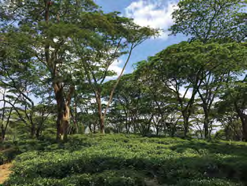

**Image 6 OCR + Description:**
```
**Image Description:**
The image shows a group of six healthcare professionals standing in a line inside a medical facility. They are all wearing white lab coats and blue surgical masks, adhering to health protocols. The background features a green wall, with an open doorway that leads to another room where a person in a white shirt is partially visible. The lighting suggests an indoor clinical setting, and the individuals appear attentive, possibly listening to instructions or a briefing.

There is no visible text in the image. The key elements include the healthcare workers' attire, facial masks, and the medical environment, which all convey a sense of professionalism and health safety awareness, suitable for an annual development report focused on healthcare or medical services.
```
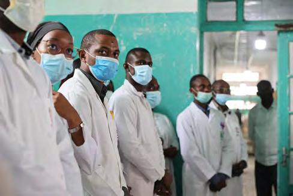

**Image 7 OCR + Description:**
```
**Image Description:**
The image shows a close-up of two vibrant sunflowers in the foreground with a damaged multi-story building in the background. The building appears to have suffered significant structural damage, evident from broken windows, missing parts of the balcony railings, and exposed internal sections. The bricks of the building are visible, indicating a partial collapse or destruction.

The contrast between the bright and lively sunflowers and the damaged building creates a poignant juxtaposition, symbolizing resilience or hope amidst destruction. 

There is no text visible in the image. The overall layout emphasizes the sunflowers prominently against the backdrop of the ruined building.
```
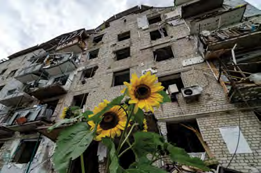

**Image 8 OCR + Description:**
```
**Image Description:**
The image shows a close-up scene depicting a young woman holding a baby in her arms. The woman has dark hair tied back and is wearing a colorful sleeveless top. She appears to be gently wiping the baby's face or mouth with a white cloth or tissue. The baby, who is dressed in a yellow outfit with a matching headband featuring a decorative flower, has a pacifier in their mouth and is looking directly at the camera. 

The background is slightly blurred, with a white wall and some indistinct elements, including a person sitting further back. The setting seems to be indoors, possibly in a community or healthcare facility.

There is no visible text within the image itself. The key elements—mother and child, the care gesture, and the setting—suggest themes related to maternal and child health, caregiving, or community support, which align with the context of an annual development report.
```
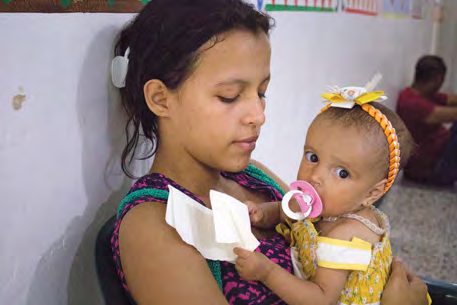

**Image 9 OCR + Description:**
```
**Image Description:**
The image shows a group of people standing in a queue outdoors, seemingly in a rural or semi-urban setting with trees and a building in the background. Most people in the line, including women, children, and men, are wearing face masks, likely indicating a precaution during a health-related event such as a vaccination or aid distribution.

At the forefront, a woman is interacting with a man seated behind a simple wooden table. The man is operating an electronic device, possibly a card reader or a biometric scanner, while the woman extends her hand toward it. Several other individuals, also wearing masks, stand nearby, possibly organizing or assisting with the process.

The image captures a moment that highlights community engagement, public health measures, or social support activities. There is no visible text in the image.

This photo is suitable for illustrating themes such as public health campaigns, community outreach, social support programs, or pandemic response efforts in an annual development report.
```
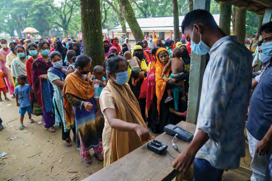

**Image 10 OCR + Description:**
```
**Image Description:**
The image depicts a group of people engaged in agricultural work on a farm or field. The layout shows multiple individuals spread across several rows of planted crops, actively tending or harvesting them. Many of the people are holding umbrellas, presumably to shield themselves from the sun. There is a mix of adults and children, with some crouching or bending down to work closely with the plants. The background features lush vegetation, including tall palm trees and other tropical plants.

There is no visible text within the image; it is purely a photographic depiction. The scene suggests a community or group effort in farming, indicative of rural development or agricultural activity, which aligns with the context of an annual development report.
```


## Page 2
+,$%'-,%'#*#,).*$/0%$#1*#,/*#/$2*34%$5&*67"89*7"&*#,/*7::$/;)7#/&*367"89*$/</$*%"5=*#%*!6>?*7"&*!?@A*#,/*#/$2*34%$5&*67"8*
B$%'09*7"&*#,/*7::$/;)7#/&*367"8*B$%'09*$/</$*#%*#,/*<);/*)".#)#'#)%".C*!6>?1*!?@1*!DE1*F!B@1*7"&*!EG!?H*+,/*#/$2.*3&%"%$.9*7"&*
3&/;/5%02/"#*07$#"/$.9*7$/*75.%*'./&*)"#/$(,7"-/7:5=*#,$%'-,%'#*#,/*$/0%$#H


**Image 1 OCR + Description:**
```
**Image Description:**
The image displays a page from an annual development report with a clean and professional layout. Key elements include:

- The main heading at the top reads "REGIONAL DEVELOPMENT CORPORATION."
- Below the heading, there are multiple sections of text. The text is presented in a formal report style, describing various aspects of the organization's development initiatives.
- On the right side of the text, there is a bar chart showing "2018 Households Built" with different colored bars representing different regions or categories.
- The bottom right corner has the page number "7".

The overall design is simple and focuses on text content supported by the bar chart for visual representation of data. The background features subtle blue curved shapes adding a modern look without distracting from the main content.
```


## Page 3
$%&'()*+&$(%!,'(-!&./!0$+/!1'/2$)/%&!!
3
&'*2&!,*%)2!4%)!,$,2!4&!4!564%+/!!
7
&'*2&!,*%)2!$%!4+&$(%!!
89
8:!(1&$-$;$%5!&'*2&!,*%)2!4%)!,$,2!$%!*%+/'&4$%!&$-/2!!
8<
IHI*>/.0%"&)"-*#%*E%20%'"&)"-*E$)./.**
IJ
IHK*L#)5)M)"-*+$'.#*D'"&.*7"&*D!D.*NO/(#);/5=**
IP
=:!+(%&'$>*&$%5!&(!&./!+(0$)?8@!+'$2$2!'/21(%2/!!
=8
KHI*4%$5&*67"8*+$'.#*D'"&.**
KK
KHK*!DE*+$'.#*D'"&.**
KQ
KHJ*D)"7"()75*!"#/$2/&)7$=*D'"&.**
KR
KHS*G#%$)/.*<$%2*E%'"#$)/.**
JT
<:!4))'/22$%5!&./!+.466/%5/2!(,!,'45$6$&AB!+(%,6$+&B!4%)!0$(6/%+/!!
<C
JHI*4%$5&*67"8*+$'.#*D'"&.**
JQ
JHK*!DE*+$'.#*D'"&.**
ST
JHJ*F!B@*+$'.#*D'"&.**
SK
JHS*D)"7"()75*!"#/$2/&)7$=*D'"&.**
SK
JHP*G#%$)/.*<$%2*E%'"#$)/.**
SJ
3:!5/%/'4&$%5!D%(E6/)5/!(%!+'$2$2!'/21(%2/!4%)!'/+(0/'A!!
3@
SHI*4%$5&*67"8*+$'.#*D'"&.**
PT
SHK*!DE*+$'.#*D'"&.**
PJ
SHJ*D)"7"()75*!"#/$2/&)7$=*D'"&.**
PS
SHS*B5%:75*7"&*>/-)%"75*U"%V5/&-/WB/"/$7#)%"*G#%$)/.**
PP
C:!,$%4%+$46!4%46A&$+2!(,!E('6)!>4%D!5'(*1!&'*2&!,*%)2!4%)!,$,2!!
F8
PHI*!"<5%V.**
XS
PHK*Y'#<5%V.**
XR
PHJ*@../#.**
QJ
4%%/G/2!!
H@
@""/Z*@H*@::$/;)7#)%".*7"&*@($%"=2.**
Q[
@""/Z*6H*\).#*%<*6%Z/.1*D)-'$/.*7"&*+7:5/.**
RT
@""/Z*EH*\).#*%<*L2:$/557*KHT*]$%-$72.*7.*%<*^'"/*JT1*KTKK**
RK
@""/Z*?H*\).#*%<*+$'.#*D'"&.*7"&*D!D.*>/</$/"(/&*)"*#,).*>/0%$#**
RX
@""/Z*NH*4%$5&*67"8*B$%'0_.*>%5/.*7"&*G/$;)(/.*)"*D!D.1*D`KTKK**
[Q
4+D%(E6/)5-/%&2!!
@7
TABLE OF CONTENTS


**Image 1 OCR + Description:**
```
**Image Description:**
The image displays a clean and professional layout suitable for an annual development report. The background features smooth, curved shapes in varying shades of blue and gray on the left side, creating a sense of depth and movement. These curves arc from the bottom left towards the top right, drawing the eye upwards and rightwards.

The rest of the page is largely clear and light-colored, providing ample space for adding text, data, or other content without distraction. There is no visible text or additional key elements on this page, making it an ideal template or introductory section for the report.

Overall, the design is modern and subtle, emphasizing simplicity and readability with a focus on blue hues that often evoke trust, stability, and professionalism.
```


## Page 4
I!!!!!"!!!!46B*+$'.#*D'"&*@""'75*>/0%$#*KTKK
INTRODUCTION FROM THE VICE PRESIDENT
Y'$*V%$5&*).*<7()"-*'"0$/(/&/"#/&1*%;/$5700)"-*($)./.*.#/22)"-*<$%2*#,/*EYa!?WI[*
07"&/2)(1*(%"<5)(#1*7"&*(5)27#/*(,7"-/H*+,/*07"&/2)(*,7.*5/&*#%*7"*)"($/7./*)"*-5%:75*
0%;/$#=1*&).$'0#)%".*)"*,'27"*(70)#75*7(('2'57#)%"1*7"&*7"*/$%.)%"*%<*#,/*<).(75*.07(/*
)"*27"=*&/;/5%0)"-*(%'"#$)/.H*F%$/*#,7"*#V%*=/7$.*)"#%*#,/*07"&/2)(1*#,/./*75$/7&=W
.#$/../&* (%'"#$)/.* 7$/* "%V* /Z0/$)/"()"-* #,/* -5%:75* )207(#* %<* #,/* V7$* )"* L8$7)"/H*
E%20%'"&)"-*($)./.*,7;/*5/&*#%*.'005=*(,7)"*&).$'0#)%".*#,7#*<'$#,/$*#,$/7#/"*<%%&*
7"&* "'#$)#)%"* ./('$)#=* 7"&* 7((/..* #%* /"/$-=1* (%20/#)#);/"/..1* 7"&* -$%V#,H* @55* #,/*
V,)5/1*(5)27#/*(,7"-/*)207(#.*(%"#)"'/*#%*)"#/".)<=1*V)#,*"7#'$75*&).7.#/$.*:/(%2)"-*
2%$/*<$/b'/"#*7"&*&727-)"-*#%*;'5"/$7:5/*(%'"#$)/.H*
+,/*4%$5&*67"8*B$%'0*).*2//#)"-*#,/*/"%$2)#=*7"&*'$-/"(=*%<*#,/./*($)./.*,/7&W%"*
V)#,*#,/*57$-/.#*$/.0%"./*)"*)#.*,).#%$=H*!#*,7.*(755/&*'0%"*#,/*<'55*7$$7=*%<*)#.*<)"7"()75*
$/.%'$(/.1*%0/$7#)%"75*/Z0/$#)./1*7"&*-5%:75*07$#"/$.,)0.*#%*.7;/*5);/.1*0$%#/(#*0/%05/1*
0$/./$;/* c%:.1* .#$/"-#,/"* $/.)5)/"(/1* 7"&* $/.#%$/* -$%V#,H* !#* ).* ,/50)"-* (%'"#$)/.*
V%$5&V)&/*"7;)-7#/*#,/*'"(/$#7)"#)/.*7"&*2%;/*<%$V7$&*%"*#,/*07#,*#%*$/(%;/$=H*+%#75*
67"8*B$%'0*<)"7"()"-*<%$*#,/*KS*2%"#,.*:/#V//"*@0$)5*KTKT*7"&*F7$(,*KTKK*$/7(,/&*
dKI[*:)55)%"1*)"(5'&)"-*<$%2*#,/*4%$5&*67"8*e!6>?*7"&*!?@f1*!DE1*F!B@1*7"&*#$'.#*<'"&.H
+,).* 2%:)5)M7#)%"* ,7.* )"(5'&/&* #,/* /O/(#);/* './* %<* #$'.#* <'"&.* 7"&* <)"7"()75*
)"#/$2/&)7$=*<'"&.*eD!D.f*#,7#*(%205/2/"#*7"&*(%"#$):'#/*#%*#,/*4%$5&*67"8*B$%'0_.*
(%$/*<'"&)"-*7"&*7(#);)#)/.H*!"*<).(75*=/7$*KTKK*eD`KTKKf*<$%2*^'5=*I1*KTKI*#%*^'"/*JT1*
KTKK1*#,/*4%$5&*67"8*B$%'0*&).:'$./&*dPHR*:)55)%"*%<*#$'.#*<'"&*<)"7"()"-H*
+,/./*$/.%'$(/.*.'00%$#*7*V)&/*;7$)/#=*%<*0$%c/(#.*:/)"-*)205/2/"#/&*:=*$/()0)/"#.*
%"*#,/*-$%'"&1*7.*V/55*7.*7&2)").#$7#);/1*8"%V5/&-/1*7"&*7&;).%$=*./$;)(/.*0$%;)&/&*
:=* #,/* 4%$5&* 67"8* B$%'0* .#7O* #%* .'00%$#* (5)/"#* "//&.1* 0$%c/(#* 0$/07$7#)%"* 7"&*
)205/2/"#7#)%"1*7"&*V)&/W$7"-)"-*-5%:75*0':5)(*-%%&.H*+,/*$/57#);/5=*2%&/.#*;%5'2/*
%<*#,/./*&).:'$./2/"#.gP*0/$(/"#*%<*#%#75*4%$5&*67"8*0$%c/(#*&).:'$./2/"#.*7"&*KP*
0/$(/"#*%<*7&2)").#$7#);/*/Z0/"&)#'$/.*)"*D`KTKKg:/5)/.*#,/)$*27"=*7&;7"#7-/.*7"&*
#,/*%'#W.)M/&*$%5/*#,/=*057=*)"*.0/()<)(*7$/7.*#,7#*/",7"(/*4%$5&*67"8*B$%'0*/O%$#.*#%*
/"&*/Z#$/2/*0%;/$#=*7"&*0$%2%#/*.,7$/&*0$%.0/$)#=*)"*7*.'.#7)"7:5/*V7=H*
+,/*4%$5&*67"8*B$%'0*278/.*.#$7#/-)(*'./*%<*#$'.#*<'"&*$/.%'$(/.*#%*(%205/2/"#*
)#.*%V"*<'"&)"-*7"&*7&;7"(/*#,/*&/;/5%02/"#*0$)%$)#)/.*%<*)#.*(5)/"#.H*+78)"-*7*5%%8*
7#*D`KTKK*7"&*#,/*57.#*<);/*=/7$.*eD`KTIRhKKf1*#,).*7""'75*$/0%$#*.,%V(7./.*,%V*#,/*
4%$5&* 67"8* B$%'0* 27"7-/.* 7"&* '#)5)M/.* #$'.#* <'"&.* 7"&* D!D.* #%* &/05%=* <)"7"()"-*
b')(85=1*/Z07"&*%0/$7#)%".1*7"&*-/"/$7#/*"/V*8"%V5/&-/*#%*.'00%$#*(5)/"#*(%'"#$)/.*
&'$)"-*#,/./*#'$:'5/"#*#)2/.H*
4JKLKJM!%KNLKM
!"#$%&'$(")$*+
?/;/5%02/"#*D)"7"(/1*4%$5&*67"8*B$%'0


**Image 1 OCR + Description:**
```
**Image Description:**
The image is a portrait photograph of a man with medium-length gray hair and glasses. He is wearing a black suit jacket, a white shirt, and a reddish-brown tie. The background is blurred, showing some greenery and an indoor or outdoor setting with soft lighting. 

There is no visible text in the image. The image layout focuses on the man's upper body and face, positioned centrally in the frame. This type of image is commonly used in annual development reports to feature key personnel or leadership figures.
```


**Image 2 OCR + Description:**
```
**Image Description:**
The image is a page from an annual development report titled "ANNUAL DEVELOPMENT REPORT 2021 Fostering Inclusive Growth: Innovation in Science and Technology for Development." 

Layout and Key Elements:
- The top part of the page features the title of the report.
- Below the title, there are sections of text laid out in columns.
- On the left side, there is a bar chart illustrating data trends with the title "Percentage of individuals using the internet, by region (2010-2019)."
- On the right side, there is a line graph titled "Global internet penetration rate (%) 2000-2020," showing the trend over time.
- Beneath the graphs, there's text providing analysis and context for the data shown.
- The text is in English, neatly organized, and includes key statistics.
- The UN emblem and the report logo appear at the top, signifying the authority of the publication.

The page presents statistical data on internet usage growth over time to support the report's theme of innovation and inclusive growth through science and technology.
```


**Image 3 OCR + Description:**
```
**Image Description:**
The image is a timeline layout representing the development process and milestones from May 2018 to April 2019, with a total duration of 1 year. The timeline is shown horizontally with key milestones marked along the path, illustrated by circles and a segmented line connecting them.

Key elements and milestones on the timeline (from left to right):

1. **May 2018** - "Platform development starts"
2. Next milestone: "Prototype completed"
3. Next milestone: "Private test launch"
4. Next milestone: "Product upgrade"
5. Next milestone: "Public beta testing"
6. Final milestone at **April 2019** - "Official release"

Additional features:
- The timeline is segmented with icons at each milestone representing progress stages.
- A badge or label on the right side reads "MEET THE DEADLINE!"
- Progress is numerically indicated as "Completed 40%" near the beginning of the timeline.

Overall, the image visually communicates the sequential phases of the product or platform development through the year, emphasizing progress and upcoming goals.
```


**Image 4 OCR + Description:**
```
**Image Description:**
The image is a detailed infographic presenting key highlights from the Climate Science for a Resilient and Equitable Economy (C-SFREE) 2022 Annual Development Report. Here's a breakdown of its layout, key elements, and text:

**Layout and Sections:**

1. **Title and Subtitle:**
   - At the top, the title "C-SFREE: 2022 Annual Development Report Highlights" appears prominently.
   - Below the title, the subtitle reads: "Laying Foundations for Resilience and Equity."

2. **Central Number:**
   - In the middle, a large dark green box prominently displays the number "54" with accompanying text, "projects seeded since 2020."

3. **Four Corner Elements:**
   Around the central number are four circular icons with brief descriptions, each representing a different focus area or accomplishment:

   - **Top Left Circle (Purple):** 
     Text: "30% of projects specifically address racial or economic justice."
     
   - **Top Right Circle (Orange):** 
     Text: "11 projects focus on advancing nature-based solutions at scale."
     
   - **Bottom Left Circle (Light Pink):** 
     Text: "24 projects representing $4.7M in interdisciplinary team investments."
     
   - **Bottom Right Circle (Pink):** 
     Text: "3 new Regional University Network centers launched."

4. **Bottom Bold Text:**
   - At the base of the image is a statement summarizing
```


**Image 5 OCR + Description:**
```
**Image Description:**
The image is a page from an annual development report with a clean, professional layout divided into two main sections. 

On the left side, there is a section titled "2022 Developments" with several bullet points outlining key achievements or activities from the year 2022. The text is presented in a straightforward manner.

On the right side, there is a vertical column with colorful infographic elements, consisting of circular icons and small blocks of text. These highlights include numbers and brief descriptions related to development milestones or statistics, such as:

- 80% Improve outcomes
- 70% Increase adoption
- 60% Streamline processes
- 50% Expand reach

At the bottom-left corner, there is a brief summary or conclusion paragraph, emphasizing the organization's growth and commitment for the upcoming year.

The overall design uses a combination of text and graphics to provide a clear, concise overview of the organization's progress and plans. The color scheme is professional and engaging, making it easy to follow the information presented.
```


**Image 6 OCR + Description:**
```
**Image Description:**
The image is a page from an annual development report. It has a clean, professional layout with the following key elements:

1. Title and Header:
   - At the top left, there is a small heading with the text "ANNUAL DEVELOPMENT REPORT."
   - Below it, a larger title reads "Completion Certificates."
   - A subtitle in smaller text under the title says, "Certificates issued & total value of completed work within the XML development programme."

2. Main Content:
   - The central part of the page shows 10 blue rectangular cards arranged mostly in two horizontal rows.
   - Each card displays the amount of completed work in British pounds (£), followed by the number of certificates issued.
   - The cards contain the following values (some have a "+" sign indicating the number is 10 or more):
     1. £51,457.00 (6 certificates)
     2. £84,431.00 (8 certificates)
     3. £305,195.00 (8 certificates)
     4. £312,496.00 (10+ certificates)
     5. £658,428.00 (10+ certificates)
     6. £666,344.00 (10+ certificates)
     7. £676,339.00 (10+ certificates)
     8. £731,945.00 (10+ certificates)
     9. £771,679.00 (10+ certificates)
     10.
```


**Image 7 OCR + Description:**
```
**Image Description:**
The image appears to be a partial view of a document, likely a page from an annual development report. The visible portion shows a curved, white or light-colored area with some faint textures, possibly the edge of a page or a design element. There is no clearly readable text or distinct key elements visible in this cropped section. 

If you want a detailed description or analysis, please provide a more complete image or specify which part you are interested in.
```


**Image 8 OCR + Description:**
```
**Image Description:**
The image is organized into a clean, modern layout featuring a simple, professional design. Key elements include:

- A large heading near the top left that says "Annual Development Report 2021" in a bold, sans-serif font.
- Beneath the heading, there is smaller text with a date range "January - December 2021."
- Below this text, there is a medium-sized image that shows an office workspace with a laptop, a notebook, and some other office supplies.
- Toward the bottom right, a block of text outlines some highlights of the report in bullet points, referencing achievements and key improvements made in 2021.
- The background is primarily white with subtle light blue accents used for graphical features like lines and shapes to guide the eye through the content.

Overall, the design is professional and organized, aiming to convey a clear summary of the year’s development activities in a visually appealing and easy-to-read format.
```


**Image 9 OCR + Description:**
```
**Image Description:**
The image is a diagram titled "Global Expansion Roadmap and Strategy." It presents a linear timeline and process flow combined with key strategic objectives arranged horizontally across a white background. 

Layout and Key Elements:
- The timeline spans from left to right, segmented into four key phases or stages.
- Each phase is represented with a number inside a dark blue hexagon, starting from 01 on the left to 04 on the right.
- Below each numbered hexagon, there is a text description summarizing the focus or tasks related to each phase.
- Above these phases, a continuous yellow arrow runs horizontally, indicating progression from left to right.
- The phases and their corresponding texts are connected by dotted lines to the arrow.
- Key milestones or goals are emphasized with brief, bolded phrases inside colored blocks or shapes under each phase.
- The overall color scheme uses dark blue, yellow, and light gray for emphasis and clarity.

Text Details:
1. **Phase 01**: Focus on "Market Research and Analysis"
2. **Phase 02**: Mentions "Establish Local Partnerships"
3. **Phase 03**: Talks about "Product Localization"
4. **Phase 04**: Concerns "Launch and Scale Operations"

Additional text near the bottom or under the main phases provide further subtasks or goals relevant to each step, but the main emphasis is on the four key phases progressing in a strategic expansion timeline.

This diagram visually communicates the structured steps for expanding a company’s
```


**Image 10 OCR + Description:**
```
**Image Description:**
The image displays a layout that appears to be part of a report or presentation slide titled "2024 Annual Development Report."

Layout and Key Elements:
- At the top right corner, the title "2024 Annual Development Report" is prominently featured.
- The top left area contains a smaller section with text, which seems to summarize or highlight key points.
- The main body of the image contains a professional photograph of a person working on drafting or design plans, with visible architectural drawings and tools such as a scale ruler and a mechanical pencil.
- To the left bottom, there is a dark blue text box with the heading "Project Overview" followed by descriptive text.
- There are subtle design elements around the edges, including blue lines and blocks that create a clean and modern look.

Text Content:
- Title: "2024 Annual Development Report"
- Heading in text box: "Project Overview"
- The smaller top-left text is less clear but appears to include a summary or introductory paragraph related to the development report.

The overall design suggests a professional and clean format focusing on development or architectural projects.
```


**Image 11 OCR + Description:**
```
**Image Description:**
The image is a slide from an annual development report presentation. Its layout and key elements are as follows:

- **Header Area**: At the top left is the logo and name of the organization in Chinese, which roughly translates to "China Enterprise Reform and Development Society." Below the organization's name is a QR code accompanied by the text "Annual Development Report Series" in Chinese.
- **Main Title**: Prominently displayed in the middle of the slide is the main title in large Chinese characters, "Annual Development Report," with an English subtitle below it, "Annual Development Report."
- **Graphic Element**: Below the title is a stylized 3D-like curve or wave graphic in shades of blue, providing a visual accent that represents development or progress.
- **Decorative Element**: In the top right corner, there is a red bird in flight, adding a symbolic or thematic element to the design.
- **Footer/Bottom Area**: Along the bottom right is a green geometric shape that adds color balance to the slide.

Overall, the design is clean, modern, and professional. It uses minimal text and graphics to emphasize the report's theme of annual progress and development. The use of blue and green colors conveys stability and growth, while the red bird symbolizes aspiration or hope.
```


**Image 12 OCR + Description:**
```
**Image Description:**
The image is a visual layout summarizing a sequence of ten steps or stages, likely representing a process or a plan for improvement over time.

Layout and Key Elements:
- The steps are arranged diagonally across the image, moving from the bottom-left to the top-right.
- Each step is represented by a numbered orange box, starting from 1 at the bottom and ending with 10 at the top.
- Between each orange box is a white space containing small icons that symbolize various concepts such as a target, a bar graph, a person climbing stairs, and other thematic visuals related to progress and development.
- The top of the image features the title "Annual Development Plan" in bold text.

Text in the Image:
- Each orange box contains a short phrase or keyword, likely outlining the key focus or milestone for that step in the development plan. The texts are:
  1. "Goal Setting"
  2. "Skill Assessment"
  3. "Resource Allocation"
  4. "Team Building"
  5. "Project Planning"
  6. "Execution"
  7. "Monitoring"
  8. "Evaluation"
  9. "Feedback"
  10. "Improvement"

Overall, the image provides a clear, step-by-step guide to an annual development process, visually emphasizing progression and continuous improvement.
```


**Image 13 OCR + Description:**
```
**Image Description:**
The image is a flyer or report cover for an annual development report. It consists of two main sections side by side.

**Left section:**
- Background shows a leafy tree with brown branches and a dense canopy of green leaves.
- The text is in two lines: "Annual Development Report" at the top (larger font), and "2019" below it in smaller font.
- The text is white and centered over the tree image.

**Right section:**
- Background is predominantly green with diagonal stripes and an overlay of leaves.
- The text at the top says "Development Report" in a bold, white font.
- Below it, there is a smaller white text line: "Annual Report."
- There is a small white section at the bottom right corner with a dark green triangle on its left side.
- No other text or logos appear in this section.

The overall design uses green and white colors prominently, evoking a natural or environmental theme. The layout is clean with a focus on nature imagery and concise titles.
```


**Image 14 OCR + Description:**
```
**Image Description:**
The image is a two-page spread from an annual development report with a clean, professional layout.

**Left Page:**
- Heading at the top: "UNSDC AT A GLANCE."
- A large, semi-transparent map of the world as the background.
- Four text boxes aligned vertically on the left side with the following white text:
  1. "CUTTING-EDGE DEMOCRATIC GOVERNANCE"
  2. "EFFECTIVE COMMON SERVICE DELIVERY"
  3. "ADVANCED PEACE BUILDING & CONFLICT PREVENTION"
  4. "DEVELOPMENT & REFORM REPORTING"
- Large, bold numbers spread across the page:
  - "2846" near the top.
  - "208" near the middle.
  - "286" near the bottom.
  - "57.6" near the bottom right.
- Additional smaller text below the numbers, describing various achievements, programs, or impacts, but the exact text is not fully legible.
- Bottom left corner: The page number "4."

**Right Page:**
- Heading at the top: "ONE YEAR IN REVIEW."
- Below this, a paragraph summarizing the past year's achievements and focus areas.
- Below the paragraph, a colorful and dynamic illustration showing a hand holding a smartphone or tablet, with various icons and people emerging from the device, symbolizing connectivity, innovation, and engagement.
- Bottom right corner: The page number "5."

Overall,
```


**Image 15 OCR + Description:**
```
**Image Description:**
The image is a page from an annual development report with a clean, modern design. The layout is divided into two main sections: a vertical timeline on the left and a content area on the right.

**Left Side (Vertical Timeline):**
- The timeline runs vertically from top to bottom.
- There are five circular icons along the timeline, each with a number inside, representing different steps or phases.
- The numbering goes from 01 at the top to 05 at the bottom.
- Each numbered circle is connected by a line, visually linking the progression.
- The circles have blue and white coloring, with the blue color filling the circle fully or partially.

**Right Side (Content Area):**
- To the right of each numbered circle, there is a text block providing details about each step.
- Each text block has a short heading or title in blue, followed by a body of descriptive text in dark gray or black.
- The text is aligned horizontally with each respective numbered circle, making it easy to follow the timeline in sequence.
- The font is modern and sans-serif, suitable for professional documents.

**Additional Elements:**
- The top right corner includes the page number "02."
- The page background is predominantly white, keeping the look clean and easy to read.
- The design uses consistent spacing and alignment to maintain clarity and professionalism.

The text content appears to describe the stages or milestones of a project or development process as part of an annual report, highlighting key activities and accomplishments over time
```


**Image 16 OCR + Description:**
```
**Image Description:**
The image is a layout of a food-focused webpage or app screen titled "Healthy Food for Healthy Family."

Key elements and layout details:

1. Header Area:
   - At the top, there's the title "Healthy food for healthy family."
   - Below the title is a subtitle: "Best Healthy Food - Because Your Family Deserves The Best Food."
   - To the right side of the header, there is a navigation menu with options: "HOME," "ABOUT US," "RECIPES," "CONTACT."
   - There is a small user profile icon near the navigation menu.

2. Main Image:
   - Under the header, centered, is a large, colorful photo of a delicious and healthy food dish served in bowls, including vegetables, grains, and other fresh ingredients.
   - The colors are vibrant and appealing.

3. Side Detail Section (Left):
   - To the left of the main image, there is a vertical navigation or information menu with these categories:
     - "Breakfast"
     - "Lunch"
     - "Dinner"
   - Each category has small circular icons representing foods or meal types.

4. Call to Action Button:
   - Below the main title and subtitle, there's a prominent call to action button labeled "View Recipes."

5. Textual Content:
   - There is descriptive text under the subtitle emphasizing the importance of healthy food choices for families.

Overall, the layout uses a clean design with balanced white space, vibrant food photography, easy navigation categories,
```


## Page 5
!"#$%&'(#)%"**!!"!!!!O
&PQNR! SQTUN! VTU! ,$,N! LVWX! NQYYMPRXU! PVYKU!
PXNYMTNXN! RM! RLX! +(0$)?#Z! YVTUX[K\! VTU! MRLXP!
X[XP]XT\KXN:*!"*#,/*<)$.#*IT*2%"#,.*%<*#,/*07"&/2)(*
eF7$(,h?/(/2:/$* KTKTf1* 4%$5&* 67"8* #$'.#* <'"&*
(%22)#2/"#.* #%#75/&* dXSS* 2)55)%"* <%$* EYa!?WI[*
$/57#/&*%0/$7#)%".H*4,/"*V7$*/$'0#/&*)"*L8$7)"/*)"*
D/:$'7$=*KTKK1*#,/*4%$5&*67"8*B$%'0*&).:'$./&*dKHSP*
:)55)%"*%<*#$'.#*<'"&*$/.%'$(/.*#%*.'00%$#*L8$7)"/*<$%2*
@0$)5*#%*^'"/*KTKKH*
N7$5=*#$'.#*<'"&*.'00%$#*<%$*#,/*0$/07$7#)%"*%<*"/V*
4%$5&* 67"8* )";/.#2/"#* 0$%c/(#.* V7.* 07$#)('57$5=*
)20%$#7"#* )"* $720)"-* '0* #,/* 67"8_.* EYa!?WI[*
$/.0%"./H*!"W(%'"#$=*%0/$7#)%".*7"&*/Z0/$)/"(/.*%;/$*
#,/*57.#*#V%*=/7$.*,7;/*75.%*5/&*#%*#,/*&/;/5%02/"#*
%<*7*"/V*-5%:75*#$'.#W<'"&/&*0$%-$72*7"&*7*"/V*D!DH*
+,/=* 7)2* #%* ,/50* 5%VW)"(%2/* (%'"#$)/.* .#$/"-#,/"*
#,/* $/.)5)/"(/* %<* #,/)$* ,/75#,* .=.#/2.* 7"&* <7()5)#7#/*
)";/.#2/"#.*)"*07"&/2)(*0$/;/"#)%"1*0$/07$/&"/..1*
7"&*$/.0%"./H
&PQNR! SQTUN! VTU! ,$,N! LVWX! X^RXTUXU! RLX! >VTJ!
5PMQY_N! PXV\L! KT! \MQTRPKXN! V`X\RXU! ab! SPV]KcKRbB!
\MTScK\RB!
VTU!
WKMcXT\X!
d,+0eB!
TMT?[X[aXP!
\MQTRPKXNB!\MQTRPKXN!KT!VPPXVPNB!VTU!TMT?NMWXPXK]T!
XTRKRKXN* #,7#* (7""%#* $/(/);/* 4%$5&* 67"8* B$%'0*
<)"7"()"-H* DEaW7O/(#/&* (%'"#$)/.* ,7;/* $/(/);/&*
2%$/*#,7"*,75<*ePQ*0/$(/"#f*%<*#%#75*4%$5&*67"8*#$'.#*
<'"&*&).:'$./2/"#.*<%$*$/()0)/"#W/Z/('#/&*7(#);)#)/.*
&'$)"-* #,/* 57.#* <);/* =/7$.H* +,).* )"(5'&/.* ,/50)"-* #%*
0$%#/(#*#,/*0%%$*7"&*2%.#*;'5"/$7:5/*&'$)"-*7(#);/*
7"&*0%.#W(%"<5)(#*.)#'7#)%".*)"*@<-,7").#7"1*4/.#*67"8*
7"&*B7M71*7"&1*2%.#*$/(/"#5=1*L8$7)"/1*V,)(,*$/(/);/&*
QI*0/$(/"#*%<*4%$5&*67"8*#$'.#*<'"&*&).:'$./2/"#.*#%*
$/()0)/"#W/Z/('#/&*7(#);)#)/.*)"*(%'"#$)/.*)207(#/&*:=*
DEa*)"*D`KTKKH*+V%*"/V*#$'.#*<'"&.*V/$/*/.#7:5).,/&*
#%*.'00%$#*L8$7)"/_.*/O%$#.*#%*$/:')5&H
?/;/5%02/"#* 07$#"/$.* ,7;/* 75.%* (%"#)"'/&* #%*
&/2%".#$7#/* #,/)$* (%22)#2/"#* #%* #,/* 0/%05/* %<*
@<-,7").#7"H*Y0/$7#)%".*)"*@<-,7").#7"*V/$/*07'./&*
&'/*#%*0%5)#)(75*)".#7:)5)#=*)"*KTKI1*:'#*#,/*@<-,7").#7"*
>/(%".#$'(#)%"* +$'.#* D'"&* ,7.* .'00%$#/&* V%$8W
7$%'"&.*#%*-/#*dIHTQ*:)55)%"*%<*#$'.#*<'"&*$/.%'$(/.*
<5%V)"-*#,$%'-,*Li*7-/"()/.*#%*,/50*&/5);/$*/../"#)75*
,/75#,* ./$;)(/.* 7"&* %#,/$* /2/$-/"(=* 7..).#7"(/* #%*
#,/*@<-,7"*0/%05/H
KUDJO KAGLAN / WORLD BANK


**Image 1 OCR + Description:**
```
**Image Description:**
The image depicts a group of children sitting at desks in what appears to be a classroom or dining area. The children are seated in rows, facing forward, with bowls or containers in front of them on the desks. The focus is on one boy at the front who is smiling slightly and looking directly at the camera. He is wearing a light brown shirt and has a green face mask pulled down below his chin. Other children in the background are also visible, some smiling or engaging with each other.

Key elements:
- Several children seated at wooden desks arranged in rows.
- Each child has a bowl or container in front of them, suggesting mealtime or a distribution of food.
- The children are in casual clothing, predominantly light brown shirts or school uniforms.
- Most children wear face masks either pulled down or hanging, indicating an awareness of health precautions.
- The background is dimly lit with a wall and window partially visible.
- There is no visible text in the image.

Overall, the image conveys a setting of children in a communal environment, likely related to education or a meal program, fitting for an annual development report emphasizing child welfare or education initiatives.
```
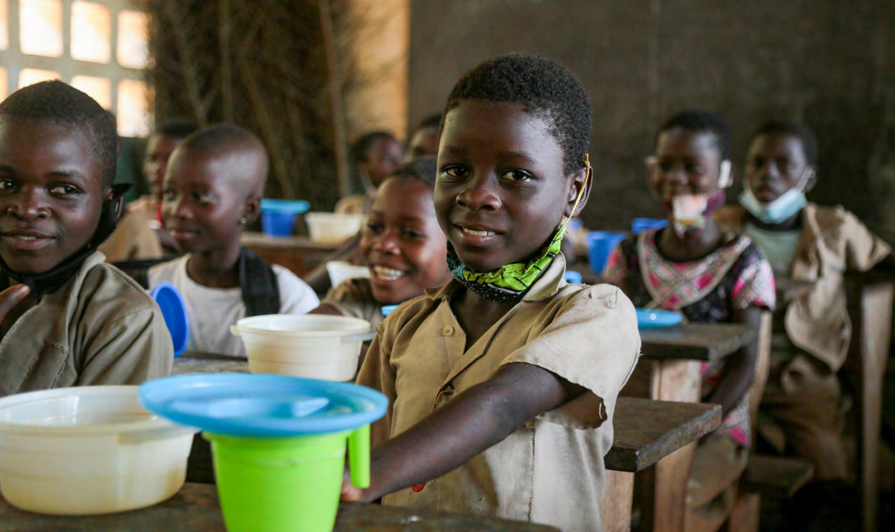

**Image 2 OCR + Description:**
```
**Image Description:**
The image depicts a simple graphic of a page curl effect on a square document or report page. The layout shows the top right corner of the page being folded over, revealing the underside which is shaded to give a sense of depth and dimension.

There is no text visible on the page or in the image itself. The key element is the curled corner, which suggests the idea of turning a page or revealing content underneath, fitting for use in an annual development report to symbolize progress, transition, or unveiling new information. The background is black, which contrasts sharply with the white page and the gray shading of the curled corner.
```


## Page 6
f!!!!!"!!!!46B*+$'.#*D'"&*@""'75*>/0%$#*KTKK
&PQNR! SQTUN! VTU! ,$,N! LVWX! NQYYMPRXU! RLX!
]XTXPVRKMT! VTU! UKNNX[KTVRKMT! MS! JTMgcXU]XB!
UVRVB! RMMcNB! VTU! VUWK\X* #%* 7&;7"(/* ($).).* $/(%;/$=*
/O%$#.* 7"&* #%* 7(,)/;/* 5%"-W#/$2* &/;/5%02/"#*
-%75.H* ?'$)"-* #,/* 57.#* <);/* =/7$.1* #$'.#* <'"&.* ,7;/*
<)"7"(/&* XJ* 0/$(/"#* %<* #,/* 4%$5&* 67"8_.* 7&;).%$=*
./$;)(/.*7"&*7"75=#)(.*e@G@f1*0$%;)&)"-*(%'"#$)/.*V)#,*
-')&7"(/* 7"&* $/(%22/"&7#)%".* %"* .#$/"-#,/")"-*
0%5)()/.1*)".#)#'#)%".1*7"&*)";/.#2/"#.H*@G@*).*7*(%$/*
(%20%"/"#* %<* #,/* 4%$5&* 67"8* B$%'0_.* 8"%V5/&-/*
./$;)(/.*7"&*0$%&'(#.1*V,)(,*75.%*)"(5'&/*&)7-"%.#)(*
#%%5.* 7"&* -')&/5)"/.* #,7#* .'00%$#* 67"8* B$%'0*
%0/$7#)%".*7"&*-5%:75*0':5)(*8"%V5/&-/*-%%&.*#,7#*
7$/* V)&/5=* .,7$/&* #%* .'00%$#* :/##/$* &/;/5%02/"#*
%'#(%2/.H* @00$%Z)27#/5=* QT* 0/$(/"#* %<* #,/* 4%$5&*
67"8* #$'.#* <'"&* &).:'$./2/"#.* <%$* 67"8W/Z/('#/&*
(%'"#$=* 7"&* -5%:75* /"-7-/2/"#* 7(#);)#)/.* )"* #,/*
57.#* <);/* =/7$.* ,7;/* .'00%$#/&* 8"%V5/&-/* 0$%&'(#.**
7"&*./$;)(/.H
Y;/$*ST*#$'.#W<'"&/&*7(#);)#)/.*<$%2*7$%'"&*#,/*V%$5&*
7$/* </7#'$/&* )"* #,).* $/0%$#H* +,/=* &/2%".#$7#/* #,/*
27"=*V7=.*#$'.#*<'"&.*7"&*D!D.*7$/*(%"#$):'#)"-*#%*#,/*
<%'$*&/;/5%02/"#*%'#(%2/.*#,/*4%$5&*67"8*B$%'0*
,7.*<%('./&*%"*&/5);/$)"-*#,$%'-,%'#*#,/*07"&/2)(*
7"&*(%20%'"&)"-*-5%:75*($)./.1*"72/5=1*.7;)"-*5);/.1*
0$%#/(#)"-* #,/* 0%%$* 7"&* 2%.#* ;'5"/$7:5/1* /".'$)"-*
.'.#7)"7:5/* :'.)"/..* -$%V#,* 7"&* c%:* ($/7#)%"1* 7"&*
.#$/"-#,/")"-*0%5)()/.1*)".#)#'#)%".1*7"&*)";/.#2/"#.*
<%$*$/:')5&)"-*:/##/$H
Y'$*
$%:'.#*
$/.0%"./*
,7.*
$/5)/&*
%"*
.#$%"-*
(%557:%$7#)%"1* 7"&* V/* #,7"8* 755* %'$* &/;/5%02/"#*
07$#"/$.1* )205/2/"#)"-* 07$#"/$.1* 7"&* $/()0)/"#*
(5)/"#.* <%$* #,/)$* '"V7;/$)"-* (%22)#2/"#* 7"&*
&/#/$2)"7#)%"* &'$)"-* #,/./* (,755/"-)"-* #)2/.H* +,/*
07#,* #%* $/(%;/$=* ).* "%#* /7.=* :'#1* #%-/#,/$1* V/* 7$/*
"7;)-7#)"-*#,/*'"(/$#7)"#)/.*7"&*0$%-$/..)"-*#%V7$&*
7*-$//"/$1*2%$/*$/.)5)/"#1*7"&*2%$/*)"(5'.);/*<'#'$/*
<%$*755H
!"*E%5%2:)71*;'5"/$7:5/*2)-$7"#.*
7"&*a/"/M'/57"*$/<'-//.*7$/*
:/"/<)#)"-*<$%2*/2/$-/"(=*(7.,*
#$7".</$.*0$%;)&/&*:=*#,/*2RVRX!VTU!
1XV\XaQKcUKT]!,QTU!d21,e!#%*$/&'(/*
#,/*.0$/7&*%<*EYa!?WI[*V,)5/*75.%*
/7.)"-*#/".)%".*V)#,*E%5%2:)7"**
,%.#*(%22'")#)/.H
!"*!"&)71*$,+*).*V%$8)"-*V)#,*.'00%$#**
%<*&/;/5%02/"#*07$#"/$.*#%*:$)"-**
"/V*0$);7#/*)";/.#2/"#*7"&*7&;)(/*#%*
#,/*,%.0)#75*./(#%$*)"*-VLVPVNLRPV!
2RVRX1*V,)(,*V7.*,7$&*,)#*:=*#,/*
EYa!?WI[*07"&/2)(H*
!"*i)-/$1*#,/*5cMaVc!,KTVT\KT]!,V\KcKRb!
SMP!EM[XTB!+LKcUPXT!VTU!4UMcXN\XTRN!
d5,,e*).*.'00%$#)"-*-%;/$"2/"#*
$/<%$2.*#%*755%V*-)$5.*#%*.#7=*)"*.(,%%5*
5%"-/$*7"&*%'#*%<*/7$5=*27$$)7-/1*-);)"-*
#,/2*7*:/##/$*(,7"(/*#%*5);/*,/75#,)/$1*
2%$/*0$%&'(#);/*5);/.H*
!"*U%.%;%1*#,/*5cMaVc!&V^!1PM]PV[!
d5&1e*).*,/50)"-*#,/*-%;/$"2/"#*
&)-)#)M/*)#.*#7Z*$/-).#$=*)"*%$&/$*#%*:%%.#*
#7Z*$/;/"'/.*7"&*$/&'(/*)"<%$275)#=*)"*
#,/*:'.)"/..*./(#%$H
+,/*EYa!?WI[*j)-,WD$/b'/"(=*
F%")#%$)"-*?7.,:%7$&*/.#7:5).,/&*:=*
RLX!*[aPXccV!,V\KcKRb!SMP!1MWXPRb!VTU!
/hQKRb!d*,1/e*).*0$%;)&)"-*#)2/5=*&7#7*
%"*,%V*#,/*EYa!?WI[*($).).*).*7O/(#)"-*
0/%05/*)"*RJ*(%'"#$)/.H*
+,/*5cMaVc!,V\KcKRb!SMP!)KNVNRXP!
'XUQ\RKMT!VTU!'X\MWXPb!d5,)''e*
&/;/5%0/&*7*2/#,%&%5%-=*<%$*$/2%#/1*
&/.8W:7./&1*0%.#W&).7.#/$*&727-/*
7../..2/"#.*#%*&/#/$2)"/*2%$/*b')(85=*
#,/*<)"7"()75*7"&*#/(,")(75*.'00%$#*
"//&/&*<%$*<7.#/$*$/(%;/$=H


**Image 1 OCR + Description:**
```
**Image Description:**
The image is a vertical infographic representing an annual development report with a clean and modern layout. It is divided into several horizontal sections, each containing a combination of icons, numerical data, and brief text descriptions. The color scheme mainly uses shades of blue, white, and gray, with accents in orange for highlights.

Key Elements:
1. Header Section:
   - Contains a large title at the top that reads "ANNUAL DEVELOPMENT REPORT."
   - Below the title, there is a smaller subtitle or introductory line, but the text is partially obscured.

2. Graphical Data Representations:
   - Several horizontal bars or progress bars with percentages and icons alongside them illustrate different statistics or achievements.
   - Each bar is labeled with brief headers such as "Project Completion," "Customer Satisfaction," etc.

3. Numerical Highlights:
   - Key figures are prominently displayed in larger font sizes for emphasis.
   - Examples include numerical percentages, growth rates, or totals relevant to the report.

4. Icons and Visual Aids:
   - Various icons (e.g., people, gears, graphs) accompany each data point, helping visually communicate the respective metrics.
   - These icons are simple and line-based, fitting the modern aesthetic.

5. Footer Section:
   - Includes a conclusion or call-to-action, though specific details are partially cropped out.

Overall, the image effectively combines visual elements and concise textual information to summarize annual development statistics in a clear, attractive format suitable for business presentations.
```


## Page 7
!"#$%&'(#)%"**!!"!!!!i
'XVUKT]!RLKN!'XYMPR
+LVYRXP!#*0$%;)&/.*7"*%;/$;)/V*%<*,%V*#,/*4%$5&*67"8*B$%'0*'./.*#$'.#*<'"&.*7"&*D!D.*/O/(#);/5=*#%*27Z)2)M/*
&/;/5%02/"#*)207(#1*07$#)('57$5=*&'$)"-*#)2/.*%<*($).).*7"&*'"(/$#7)"#=H
+LVYRXP!j!&/5;/.*&//0/$*)"#%*#,/*$%5/*#$'.#*<'"&.*7"&*D!D.*,7;/*057=/&*)"*#,/*4%$5&*67"8*B$%'0_.*$/.0%"./*#%*
#,/*EYa!?WI[*($).).H*@*$7"-/*%<*0$%c/(#.1*7&;).%$=*./$;)(/.1*7"&*8"%V5/&-/*0$%c/(#.*7$/*,)-,5)-,#/&*#%*.,%V*,%V*
#$'.#*<'"&.*7"&*D!D.*,7;/*<7.#W#$7(8/&*<'"&)"-*#%*/2/$-/"(=*"//&.1*:%%.#/&*.'00%$#*<%$*#,/*2%.#*;'5"/$7:5/1*7"&*
,/50/&*57=*#,/*-$%'"&V%$8*<%$*5%"-W#/$2*$/(%;/$=H
+LVYRXP!k*/Z72)"/.*,%V*#$'.#*<'"&.*7"&*D!D.*/",7"(/*4%$5&*67"8*B$%'0*7(#)%"*)"*(%'"#$)/.*7O/(#/&*:=*DEa1*
)"(5'&)"-*7#W$).8*$/-)%".*7"&*$/()0)/"#.*'"7:5/*#%*$/(/);/*<)"7"()"-*<$%2*#,/*67"8*B$%'0_.*%V"*$/.%'$(/.H*@*
.7205/*%<*0$%c/(#.1*7&;).%$=*./$;)(/.1*7"&*8"%V5/&-/*0$%c/(#.*)55'.#$7#/*#,/*:$%7&*$7"-/*%<*)"#/$;/"#)%".*#,7#*
#$'.#*<'"&.*7"&*D!D.*.'00%$#*#%*7&&$/..*DEaH
+LVYRXP!I*5%%8.*7#*,%V*#$'.#*<'"&.*/"7:5/*#,/*4%$5&*67"8*B$%'0*#%*<'5<)55*)#.*$%5/*7.*7"*)"&/0/"&/"#*-/"/$7#%$*
7"&*:$%8/$*%<*8"%V5/&-/1*7"75=.).1*7"&*7&;)(/H*!#*.,%V.*,%V*8"%V5/&-/*./$;)(/.*7"&*0$%&'(#.*7#*#,/*5%(751*
$/-)%"751*7"&*-5%:75*5/;/5*(%"#$):'#/*#%*#,/*67"8*B$%'0_.*V%$8*)"*;7$)%'.*V7=.H
+LVYRXP!O*0$%;)&/.*7&&)#)%"75*<)"7"()75*)"<%$27#)%"*7"&*7"75=#)(.*%"*#,/*7(#);)#)/.*%<*4%$5&*67"8*B$%'0*#$'.#*
<'"&.*7"&*D!D.H*!#*/Z72)"/.*<);/W=/7$*#$/"&.*%"*#$'.#*<'"&*7"&*D!D*)"<5%V.1*%'#<5%V.1*7"&*7../#.*'"&/$*27"7-/2/"#H
!"#$%&%%$'#()*++,$+-$!)./01-.23#3$4#/.50/*).*7*./07$7#/1*.'005/2/"#7$=*&%('2/"#*#,7#*0$%;)&/.*2%$/*&/#7)5*
%"*#,/*#$'.#W<'"&/&*7(#);)#)/.*$/</$/"(/&*)"*#,).*$/0%$#H*!#*,)-,5)-,#.*&/;/5%02/"#*07$#"/$*(%"#$):'#)%".1*7.*V/55*
7.*#,/*V%$8*%<*:/"/<)()7$)/.*7"&*.#78/,%5&/$.*%"*#,/*-$%'"&H
ANINDITO MUKHERJEE / IFC


**Image 1 OCR + Description:**
```
**Image Description:**
The image shows a clean, well-lit laboratory or production room with workers in protective clothing. The layout consists of two rows of workers sitting on opposite sides of a long table, facing each other. Each worker is wearing a white lab coat, blue surgical cap, face mask, and yellow gloves, indicating adherence to hygiene and safety protocols.

Key elements in the image include:
- Blue plastic containers on the table filled with small vials or bottles with pink caps and various packaging boxes.
- Workers appear to be involved in packaging or inspecting these vials.
- The room has a clean, sterile environment with bright overhead lighting, white walls, and a blue door in the background.
- Two rows of workers, about 8-10 per side, are visible.

There is no visible text in the image, other than partial letters "BE" on the upper front of one worker's lab coat, which might be part of a company or laboratory name.

Overall, the scene represents a pharmaceutical or medical manufacturing or packaging area, fitting for inclusion in an annual development report related to healthcare or vaccine production.
```
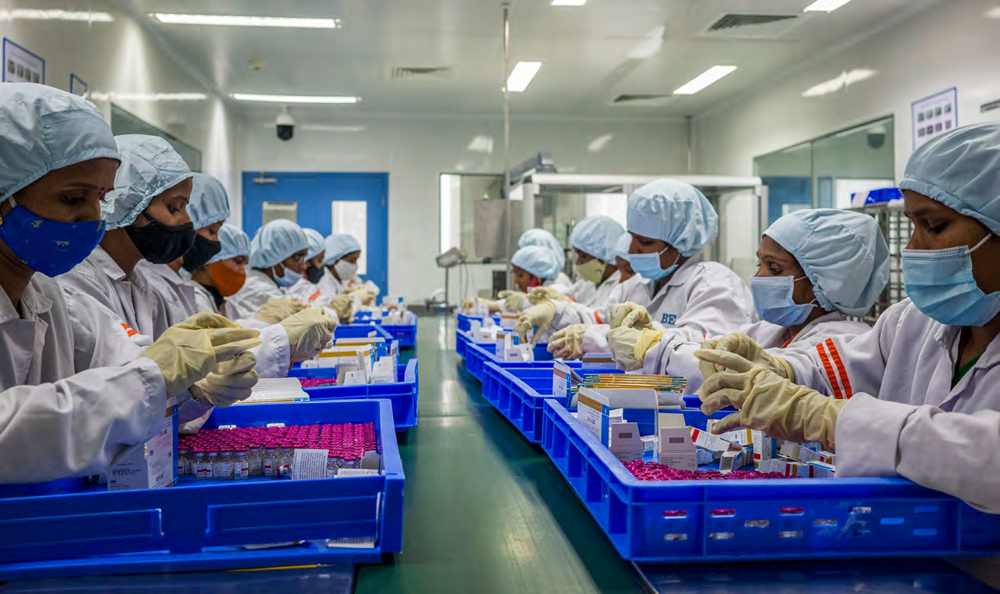

**Image 2 OCR + Description:**
```
**Image Description:**
The image shows a simple icon of a sheet of paper with a top-right corner folded down, suggesting a document or report. The background is black, and the sheet of paper is white, creating a strong contrast. There are no visible text or additional key elements within the image itself, just the representation of a single page with a curled corner. It appears to be a generic symbol often used to represent documents or reports.
```


## Page 8
EMPcU! >VTJ! 5PMQY! RPQNR! SQTUN* 7$/* <)"7"()75*
)".#$'2/"#.* #,7#* 7((/0#* (%"#$):'#)%".* <$%2* %"/* %$*
2%$/*&%"%$.1*V,)(,*7$/*,/5&*7"&*&).:'$./&*:=*#,/*
4%$5&*67"8*B$%'0*7.*7*#$'.#//H*+,/=*7$/*)20%$#7"#*
<'"&)"-*.%'$(/.*<%$*:%#,*(5)/"#.*7"&*#,/*4%$5&*67"8*
B$%'0g($/7#)"-* 07$#"/$.,)0.* 7"&* 057#<%$2.* <%$*
<)"7"()751*8"%V5/&-/1*7"&*%#,/$*(%557:%$7#)%".*7$%'"&*
#,/*V%$5&*7"&*7($%..*/;/$=*7$/7*%<*&/;/5%02/"#H
,KTVT\KVc!KTRXP[XUKVPb!SQTUN!d,$,Ne!7$/*7*
.0/()75*#=0/*%<*#$'.#*<'"&*<%$*V,)(,*#,/*4%$5&*67"8*
).*7*5)2)#/&*#$'.#//*%$*#$/7.'$=*27"7-/$*eKP*D!D.f*7"&*
7"*)205/2/"#)"-*/"#)#=*eI[*D!D.fH*+=0)(755=*-%;/$"/&*
)"&/0/"&/"#5=1*D!D.*0$%;)&/*57$-/W.(75/*0%%5/&*
<'"&)"-*#,$%'-,*2'5#)05/*)205/2/"#)"-*/"#)#)/.*<%$*
-5%:75*0':5)(*-%%&.1*.'(,*7.*$/.0%"&)"-*#%*(5)27#/*
(,7"-/1*2)#)-7#)"-*(%22'")(7:5/*&)./7./.1*7"&*
/",7"()"-*<%%&*./('$)#=H
TRUST FUNDS AND FIFS AT A GLANCE
i%#/C*+,/*4%$5&*67"8*B$%'0*/"(%207../.*#,/*!"#/$"7#)%"75*67"8*<%$*>/(%".#$'(#)%"*7"&*?/;/5%02/"#*e!6>?f1*#,/*!"#/$"7#)%"75*
?/;/5%02/"#*@..%()7#)%"*e!?@fg#%-/#,/$*$/</$$/&*#%*7.*#,/*4%$5&*67"8g*#,/*!"#/$"7#)%"75*D)"7"(/*E%$0%$7#)%"*e!DEf1*7"&*#,/*F'5#)57#/$75*
!";/.#2/"#*B'7$7"#//*@-/"(=*eF!B@fH
-$54!lmn:#!>
k***NZ07"&/&*.'00%$#**
<%$*-'7$7"#//.*)"**
DEa*.)#'7#)%".
$,+!mn:ji!>
k*!DE*@&;).%$=*./$;)(/.
k**65/"&/&*<)"7"(/**
(%W)";/.#2/"#.*)"**
#,/*0$);7#/*./(#%$
EMPcU!>VTJ?X^X\QRXU!d>/e!
4\RKWKRKXN!m#:##!>
k**>/./7$(,*7"&**
8"%V5/&-/*0$%&'(#.
k**@&;).%$=*./$;)(/.*7"&*
7"75=#)(.*e@G@f
k**+/(,")(75*7..).#7"(/1**
(707()#=*:')5&)"-
k**]$%c/(#*0$/07$7#)%"**
7"&*.'0/$;).)%"
EMPcU!>VTJ!'X\KYKXTR?
X^X\QRXU!!d'/e!4\RKWKRKXN!
mI:If!>o
k**E%W<)"7"()"-*<%$*0$%c/(#.*:/)"-*
<)"7"(/&*:=*#,/*46B1*D!D.1*%$**
%#,/$*&%"%$*$/.%'$(/.
k**G#7"&W75%"/*0$%c/(#.*#,7#*(7"*
/Z#/"&*67"8*.'00%$#*)"*DEa*
.)#'7#)%".1*/2/$-/"()/.1*7"&*
5%(7#)%".*%'#*%<*$/7(,*%<**
4%$5&*67"8*<)"7"()"-
lRRm*<$%2*4%$5&*67"8*#$'.#*<'"&*$/.%'$(/.*edJH[J*6f*7"&*IKm*<$%2*4%$5&*67"8W)205/2/"#/&*D!D*$/.%'$(/.*edTHPJ*6f
Op!%<*#%#75**
4%$5&*67"8*0$%c/(#*
&).:'$./2/"#.**
#%*(5)/"#*(%'"#$)/.
jOp!%<*#%#75**
4%$5&*67"8*
7&2)").#$7#);/*
/Z0/"&)#'$/.
q!!!!"!!!!46B*+$'.#*D'"&*@""'75*>/0%$#*KTKK
EMPcU!>VTJ!5PMQY!,Ajnjj!&PQNR!,QTU!)KNaQPNX[XTRN


**Image 1 OCR + Description:**
```
**Image Description:**
The image appears to be a mostly blank page with a light blue gradient background, featuring curved shapes or waves in various shades of blue on the bottom right corner. There is no text, titles, graphics, or other elements present on the page. The overall layout is very minimalistic, with ample white space occupying most of the upper and left side of the page.

This blank or background-style page could be used in an annual development report as a cover page, section divider, or background for additional content to be added later.
```


## Page 9
!"#$%&'(#)%"!!!!"!!!!Z
&'*2&!,*%)2!4%)!,$,2!2*11('&!&./!E('6)!>4%D!5'(*1
4%)!4))!046*/!&(!$&2!+6$/%&2!4%)!14'&%/'2
!"#
46*#$'.#*<'"&
&).:'$./2/"#.
<%$*>N*7(#);)#)/.*)"
DEaW7O/(#/&*(%'"#$)/.
D`KTIRhKK
$%&'!()
46*#$'.#*<'"&
&).:'$./2/"#.*)"
J*2%"#,.*#%
.'00%$#*L8$7)"/
@0$)5h^'"/*KTKK
$*&+()
46*#$'.#*<'"&**
(%22)#2/"#.*<%$*JTTn*
EYa!?WI[*%0/$7#)%".
F7$(,*KTKTh^'"/*KTKK
!%#
46*#$'.#*<'"&
&).:'$./2/"#.*<%$
>N*7(#);)#)/.*)"*!?@
(%'"#$)/.
D`KTIRhKK
+,#
46_.*#%#75*@G@**
/Z0/"&)#'$/.*<)"7"(/&**
:=*#$'.#*<'"&.
D`KTIRhKK
!"($/7./*#,/**
(%"(/..)%"75)#=1*.(75/1**
7"&*$/7(,*%<*46B**
0$%c/(#.*7"&*0$%-$72
YO/$*.0//&*7"&**
<5/Z):)5)#=*#%*7(#*7.**
<)$.#W$/.0%"&/$.**
#%*($)./.
D)55*8"%V5/&-/*7"&**
<)"7"()"-*-70.
]$%;)&/*-$7"#*<)"7"()"-*
V,/"*(5)/"#*(%'"#$)/.*
(7""%#*:%$$%V*7"&**
0$);7#/*)";/.#%$.*7$/**
V7$=*#%*)";/.#
D)"7"(/*#,/*27c%$)#=*%<*
*!DE*7&;).%$=*./$;)(/.
G'00%$#*0)5%#*0$%c/(#.*#%**
#/.#*('##)"-W/&-/*
700$%7(,/.*<%$*.(75/*'0
6'=*&%V"*#,/*(%.#*%<*
)";/.#2/"#*#%*.#)2'57#/*
27$8/#.*
NZ#/"&*46B*.'00%$#*#%**
"%"W2/2:/$.1*(%'"#$)/.**
)"*7$$/7$.1*7"&*%#,/$.**
%'#*%<*$/7(,
@55%V*07$#"/$.*#%*:')5&*
%"*46B*#/(,")(75*7"&*
%0/$7#)%"75*(707()#=
G'00%$#*-5%:75*0':5)(**
-%%&.*#%*7&;7"(/*
&/;/5%02/"#*)..'/.**
#,7#*#$7".(/"&**
"7#)%"75*:%'"&7$)/.
"-#
46*#$'.#*<'"&*6N*
&).:'$./2/"#.*<%$**
(%'"#$=*7"&*-5%:75**
/"-7-/2/"#*.'00%$#/&**
8"%V5/&-/*./$;)(/.*
D`KTIRhKK


**Image 1 OCR + Description:**
```
**Image Description:**
The image you provided appears to be a clean and minimalistic background design likely used for a section of an annual development report. Here is a description of its layout and key elements:

- The background is predominantly a very light blue or white color, giving a professional and clean appearance.
- There are several sweeping, curved bands or arcs in various shades of blue spanning from the top left corner towards the bottom right of the image. These arcs create a sense of motion and progression while maintaining a subtle visual interest.
- The bands have a gradient effect, with darker blues nearer to the top left corner that gradually lighten as they curve downward.
- There is no text or other graphic elements visible in the image.
- The ample white space on the right side of the image suggests it may be used as a backdrop for placing text, charts, or other content in the report.

Overall, the image serves as a modern and professional visual element that could work well in an annual report, providing a clean and fresh look without distracting from the main content. If you need help designing specific text or content to overlay on this image, feel free to ask!
```


## Page 10
TRUST FUNDS IN ACTION
!"#$%&'()*&+#",-&.#,/.&0,)%/&()%&121/&/,--"#.&(&%345#/5&#()65&"0&%545$"-75).&(8.343.35/&.9(.&(#5&95$-3)6&8",).#35/&
)(436(.5& ,)85#.(3).:& ")& .95& -(.9& ."& #58"45#:;& <93/& #5-"#.& 05(.,#5/& .95& 0"$$"=3)6& >?& .#,/.@0,)%5%& (8.343.35/A& =9389&
9(45& B55)& 37-$575).5%& 3)& .95& $(/.& 0345& :5(#/& C1DEF?GHEEI;& <95:& (#5& 0,#.95#& %5.(3$5%& 3)& .95& !"!!# $%&'())*# )+##
,'-./0+-12%2#3%.-4/.5#
!"#"$%&'
SPF supporting  
migrants and refugees
HAITI
IFC building resilience 
in the garment industry
'()*@5J58,.5%&C'KI&*)"=$5%65&(8.343.:
'()*@5J58,.5%&C'KI&(8.343.:&/,--"#.3)6&
-#"L58.&-#5-(#(.3")&"#&/,-5#43/3")
M583-35).@5J58,.5%&CMKI&(8.343.:
N8.343.:&8").#3B,.5/&."&.95&-#5-(#(.3")A&37-$575).(.3")A&"#&8"@
03)()83)6&"0&()&2'MOA&2ONA&21PA&"#&121@0,)%5%&-#"L58.
!"#$"#%&'()*)+$,-).%'/0%1$-)'%2)'31%#*#%&'344")55)56
7&,)'$8'7"05%980.4)4'31%#*#%&6
21P&(%43/"#:&/5#4385/
Q(43)6&$345/
R#".58.3)6&.95&-""#&()%&7"/.&4,$)5#(B$5
K)/,#3)6&/,/.(3)(B$5&B,/3)5//&6#"=.9&()%&L"B&8#5(.3")
Q.#5)6.95)3)6&-"$3835/A&3)/.3.,.3")/A&()%&3)45/.75)./&
0"#&#5B,3$%3)6&B5..5#
&
&&
&&&
&(
GLOBAL ACTIVITIES 
 GFDRR assessing  
disasters remotely 
+RQ&B#5(*3)6&)5=&6#",)%&")&
.95&58")"738/&"0&)(.,#5
+MQ1&#5%,83)6&/-55%/&&
()%&/(43)6&$345/&")&#"(%/
IBEP helping  
overcome post-pandemic 
investment constraints
IEI drawing lessons from 
COVID-19 for learners  
with disabilities
 KGGTF building back better 
with green growth diagnostics
 RMS'TUK&,/3)6&7(#3)5&&
/-(.3($&-$())3)6
QR1&B,3$%3)6&8")0$38.&&
/5)/3.343.:&3)."&!'+&-#"L58./
QUM+K&,)%5#/.()%3)6&&
83.:&0"#7&."&-#"7".5&
/,/.(3)(B$5&6#"=.9
UFPE tracing the impact of 
COVID-19 on households
&(
&&&
&
&(
&(
&(
&(
&&
&(
&&
&(
&&
GUATEMALA
InfoDev promoting 
food security and  
empowering women
&&&
JAMAICA
 GRiF strengthening financial 
response to hurricanes
&(
10   |  WBG Trust Fund Annual Report 2022
Introduction))*))++
,-.)/'$%&'
OOR&,)$"8*3)6&&
.95&%363.($&58")"7:
#&%.0&'
N0#38(&MKOOV&7(3)/.#5(73)6&
/,/.(3)(B$5&0"#5/.&7()(6575).
1"$'#&'
P22R&37-#"43)6&(885//&."&
03)()85&0"#&/7($$&B,/3)5//5/
%'2/#'3.1-
WPR&B""/.3)6&$345$39""%/
4"1"("
+<R&B""/.3)6&.(J&
8"7-$3()85
05'23'
XPR&37-#"43)6&&
-,B$38&95($.9&",.8"75/&
,'6&4&1,'2
+RQN&3)8#5(/3)6&&
(88",).(B3$3.:&43(&&
.93#%@-(#.:&7")3."#3)6
.,-&"7&'
21P&95$-3)6&&
/7($$&B,/3)5//5/&(885//&8#5%3.
'8/-'2&1,'2)
NM<1&/,--"#.3)6&
.95&7"/.&4,$)5#(B$5
!9,.)3:&("&0.
21P&57-"=5#3)6&
="75)&/7($$9"$%5#&0(#75#/
%;04&2')8'1"
21P&7(--3)6&.95&=(:&&
."&8$5()&5)5#6:&/."#(65
$"<'$%&=;.
1PR1&8,..3)6&8(#B")&
573//3")/A&)".&.#55/&
>.$.2
Y22&7(*3)6&,#B()&&
85).5#/&8$37(.5&#5/3$35).
REGIONAL ACTIVITIES
AFRICA EAST
IFC assessing opportunities  
in Kenya’s refugee-hosting areas
EAST ASIA AND THE PACIFIC
UFGE collecting data on  
gender-based violence 
MIDDLE EAST AND 
NORTH AFRICA
WB We-Fi helping women entrepreneurs 
pivot toward e-commerce
SOUTH ASIA
IFC confronting the  
multipronged effects of COVID-19 
&
&&
&&&
&
&(
&&
&&&
&&
&&
&&
&&&
&&&
,"2/'
RPMN12&/.#5)6.95)3)6&
03)()83($&#5/3$35)85&."&%3/(/.5#/
&(
7'7;')2.5)/;&2.'
21P&5)(B$3)6&/"$(#&-"=5#
&
,"/"
+!QR&3)0"#73)6&=(.5#&&
/,--$:&()%&/()3.(.3")&/.#(.56:
&(
7-&#&77&2.1
U1<&3)8#5(/3)6&6$"B($&&
4($,5&89(3)&-(#.383-(.3")
&&&
&&&
&&
&(
5.1,)%'24)?)/'<'
+RM'N&37-#"43)6&&
/"$3%&=(/.5&7()(6575).
21P&5)(B$3)6&#""0."-&&
/"$(#&-"=5#
&&
&&
&(
'<.0%'&6'2
21P&3)8#5(/3)6&&
03)()83($&3)8$,/3")
&&&
2&/.0
+11&/,--"#.3)6&$56($&
#50"#7/&."&-#".58.&="75)&()%&63#$/
&(
2&/.0&'
!'&!5@13&,)$"8*3)6&&
03)()83)6&0"#&="75)&5).#5-#5)5,#/
&&&
$"0"!!"
21P&B,3$%3)6&03)()83($&&
/58."#&#5/3$35)85
&(


## Page 11
#j!!!!"!!!!46B*+$'.#*D'"&*@""'75*>/0%$#*KTKK
KUDJO KAGLAN / WORLD BANK


**Image 1 OCR + Description:**
```
**Image Description:**
The image depicts a group of medical professionals standing in a line against a turquoise wall. They are wearing white lab coats and blue surgical face masks, indicating a healthcare or clinical setting. The focus is on the middle of the group where a man is looking directly at the camera. The others are slightly out of focus, with the individuals closest to the camera on both ends partially cropped out of the frame. There is no visible text in the image. The overall tone conveys a sense of attentiveness and professionalism.
```


## Page 12
IH*Y0#)2)M)"-*+$'.#*D'"&.*7"&*D!D.*)"*L"(/$#7)"*+)2/.*!!"!!!!#k
1. OPTIMIZING TRUST FUNDS AND FIFS  
IN UNCERTAIN TIMES
!"* D/:$'7$=* KTKT1* #,/* EYa!?WI[* 07"&/2)(* 7:$'0#5=*
/"&/&* #,/* &/(7&/W5%"-* /Z07".)%"* %<* #,/* -5%:75*
/(%"%2=* 7o/$* #,/* KTTRhKTT[* <)"7"()75* ($).).H* 4,7#*
.#7$#/&* 7.* 7* V%$5&V)&/* 0':5)(* ,/75#,* /2/$-/"(=1*
b')(85=* :/(72/* 7"* )"#/$"7#)%"75* /(%"%2)(* ($).).H*
]':5)(*,/75#,*(%"#7)"2/"#*7"&*2)#)-7#)%"*2/7.'$/.1*
V,)(,* V/$/* "/(/..7$=* #%* 5)2)#* #,/* .0$/7&* %<* #,/*
;)$'.* 7"&* .7;/* 5);/.1* (72/* 7#* 7"* /(%"%2)(* (%.#H*
G,'#&%V".*('$#7)5/&*/(%"%2)(*7(#);)#=*7"&*/$%&/&*
#,/*/(%"%2)(*0$%-$/..*#,7#*(%'"#$)/.*,7&*7(,)/;/&*
%;/$*27"=*&/(7&/.H*U/=*./(#%$.*V)#,*57$-/*B?]*7"&*
c%:.* 2'5#)05)/$.1* 5)8/* #%'$).2* 7"&* .'005=* (,7)".* )"*
27"'<7(#'$)"-* 7"&* 7-$):'.)"/..1* V/$/* 07$#)('57$5=*
,7$&*,)#H*+V%*=/7$.*7"&*2'5#)05/*.#$7)".*%<*#,/*;)$'.*
57#/$1*)#*).*.#)55*'"(/$#7)"*,%V*#,/*07"&/2)(*V)55*/"&1*
"%#V)#,.#7"&)"-*#,/*;7(()"/.1*#,/$70)/.1*7"&*0':5)(*
,/75#,*2/7.'$/.*&/;/5%0/&*7"&*7&%0#/&H*
+,/"1*7.*#,/*V%$5&*V7.*$/(%;/$)"-*<$%2*#,/*/(%"%2)(*
&%V"#'$"*(7'./&*:=*#,/*07"&/2)(1*#,/*V7$*)"*L8$7)"/*
:/-7"*)"*D/:$'7$=*KTKKH*+,).*,7.*5/&*#%*#$7-)(*5%..*%<*
5)</1*#,/*V%$.#*'$:7"*&/.#$'(#)%"*)"*N'$%0/*.)"(/*4%$5&*
47$*!!1*7"&*#,/*,)-,/.#*,'27"*&).057(/2/"#*"'2:/$.*
V%$5&V)&/*.)"(/*LHiH*$/(%$&W8//0)"-*:/-7"H*G%2/*IJ*
2)55)%"*&).057(/&*L8$7)")7".*,7;/*0'.,/&*#,/*#%#75*
"'2:/$* %<* &).057(/&* 0/$.%".* V,%* ,7;/* <5/&* #,/)$*
,%2/.* &'/* #%* <$7-)5)#=1* (%"<5)(#1* 7"&* ;)%5/"(/* eDEaf*
#%*2%$/*#,7"*ITT*2)55)%"*0/%05/*V%$5&V)&/Ig2%$/*
#,7"*%"/*0/$(/"#*%<*,'27")#=H*+,/$/*7$/*"%V*2%$/*
;)%5/"#*(%"<5)(#.*-5%:755=*#,7"*7#*7"=*#)2/*)"*#,/*07.#*
JT*=/7$.H*
+,/* V7$* )"* L8$7)"/* ,7.* 75.%* &).$'0#/&* 8/=* /"/$-=*
7"&*7-$)('5#'$75*/Z0%$#.1*(7'.)"-*<'/5*7"&*<%%&*0$)(/.*
#%* $)./* V%$5&V)&/H* D%%&* .,%$#7-/.* 7$/* 5/7&)"-* #%*
)"($/7./&*275"'#$)#)%"*7"&*/;/"*<72)"/*(%"&)#)%".*
)"*.%2/*-$7)"*)20%$#)"-*(%'"#$)/.1*.'(,*7.*G%275)7H*
4,/"* #,/* V7$* V)55* /"&1* ,%V* )#* V)55* :/* ./##5/&1* 7"&*
V,7#*)#*V)55*(%.#*#%*$/:')5&*$/27)"*'"(/$#7)"H
+,/* %"-%)"-* (5)27#/* ($).).* ,7.* <'$#,/$* )"#/".)<)/&*
#,/./*
(,755/"-/.*
7"&*
&//0/"/&*
'"(/$#7)"#=1*
/.0/()755=* )"* #,/* 5/7.#* &/;/5%0/&* (%'"#$)/.* 75$/7&=*
;'5"/$7:5/* #%* /(%"%2)(* .,%(8.1* "7#'$75* &).7.#/$.1*
7"&*-5%:75*7"&*$/-)%"75*.0)55%;/$.1*5)8/*#,/*EYa!?WI[*
07"&/2)(*7"&*$/<'-//*)"<5'ZH*\/o*'"(,/(8/&1*(5)27#/*
(,7"-/* )207(#.* (%'5&* &$);/* KIX* 2)55)%"* 0/%05/* #%*
2)-$7#/* V)#,)"* #,/)$* %V"* (%'"#$)/.* :=* KTPT1* V)#,*
,%#.0%#.*%<*)"#/$"75*2)-$7#)%"*/2/$-)"-*7.*.%%"*7.*
KTJTHK*+,/*/Z#/"#*7"&*&/0#,*%<*#,/./*(%20%'"&)"-*
($)./.* 7$/* "%#* %"5=* /Z7(/$:7#)"-* -5%:75* )"/b'75)#)/.*
:'#*75.%*$).8)"-*&/(7&/.*%<*&/;/5%02/"#*-7)".H
#:#!'XNYMTUKT]!RM!!
+M[YMQTUKT]!+PKNXN
+,/* 4%$5&* 67"8* B$%'0* ).* ,/50)"-* )#.* (%'"#$=* 7"&*
0$);7#/*./(#%$*(5)/"#.*"7;)-7#/*#,/./*'"(/$#7)"#)/.*%"*
#,/*07#,*#%*$/(%;/$=*V)#,*7*($).).*$/.0%"./*#,7#*,7.*
://"*.V)o1*.'.#7)"/&1*7"&*(%20$).)"-*#,/*<)"7"()"-*
7"&*#/(,")(75*/Z0/$#)./*%<*#,/*/"#)$/*-$%'0H*G#7$#)"-*
)"*2)&WF7$(,*KTKT1*#,/*4%$5&*67"8*B$%'0*2%'"#/&*
I*L")#/&*i7#)%".*j)-,*E%22)..)%"/$*<%$*>/<'-//.H*^'"/*KTKKH*,-./0-%1'$*)(2%3.'#$)%4"(5-0#$6$*+%"*%7879:
K*4%$5&*67"8H*KTKIH*,'.;*)(<$--%&0'+%7%2%=#+"*>%.*%?*+$'*0-%@-"60+$%A">'0+".*:


## Page 13
#I!!!!"!!!!46B*+$'.#*D'"&*@""'75*>/0%$#*KTKK
#,/*<7.#/.#*7"&*57$-/.#*<)"7"()75*$/.0%"./*)"*)#.*,).#%$=*
#%* ,/50* &/;/5%0)"-* (%'"#$)/.* $/.0%"&* 7"&* $/(%;/$*
<$%2*#,/*EYa!?WI[*($).).H*+%#75*67"8*B$%'0*<)"7"()"-*
<%$*#,/*KS*2%"#,.*:/#V//"*@0$)5*KTKT*7"&*F7$(,*KTKK*
$/7(,/&*dKI[*:)55)%"1*)"(5'&)"-*<$%2*#,/*4%$5&*67"8*
e!6>?*7"&*!?@f1*!DE1*F!B@1*7"&*#$'.#*<'"&.H*!"*$/.0%"./*
#%* (%20%'"&)"-* ($)./.1* #,/* 67"8* B$%'0* 057".* #%*
.'.#7)"*#,).*/O%$#*<%$*7"%#,/$*=/7$*V)#,*dIQT*:)55)%"*
%<*<)"7"()"-*<$%2*@0$)5*KTKK*#%*^'"/*KTKJ1*(%20$).)"-*
dITP* :)55)%"* %<* <)"7"()"-* <$%2* #,/* 4%$5&* 67"81* dSR*
:)55)%"*<$%2*!DE1*d[*:)55)%"*<$%2*F!B@1*7"&*d[*:)55)%"*
<$%2*#$'.#*<'"&.HJ*+,/*67"8*B$%'0*75$/7&=*&/5);/$/&*
752%.#*dPJ*:)55)%"*%<*#,/*dIQT*:)55)%"*#7$-/#*)"*#,/*<)$.#*
#,$//*2%"#,.*<$%2*@0$)5*I*#%*^'"/*JT1*KTKKH*
>M^!#:#:!,MQP!1PKMPKRb!)XWXcMY[XTR!(QR\M[XN!MS!RLX!EMPcU!>VTJ!5PMQY!
'XNYMTNX!RM!RLX!+(0$)?#Z!+PKNKN
+,/./* :%5&* 7(#)%".* 7$/* 0$/&)(7#/&* %"* #,/* 67"8*
B$%'0_.* ($).).* $/.0%"./* .#$7#/-=* 7&%0#/&* )"* ^'"/*
KTKTH* >/(%-")M)"-* #,/* EYa!?WI[* ($).).* 7.* 7* V)&/W
$7"-)"-* .%()%W/(%"%2)(* -5%:75* ($).).1* #,/* 67"8*
B$%'0* ).* <%('./&* "%#* %"5=* %"* .7;)"-* 5);/.* :'#* 75.%*
%"*0$%#/(#)"-*0%%$*7"&*;'5"/$7:5/*0/%05/1*/".'$)"-*
.'.#7)"7:5/* :'.)"/..* -$%V#,* 7"&* c%:* ($/7#)%"1* 7"&*
.#$/"-#,/")"-*0%5)()/.1*)".#)#'#)%".1*7"&*)";/.#2/"#.*
e6%Z*IHIfH*+,/*67"8*B$%'0_.*7$#)('57#)%"*%<*#,/./*<%'$*
:$%7&* &/;/5%02/"#* %'#(%2/.* ,7.* .,70/&* -5%:75*
&/:7#/.* 7$%'"&* $/.0%"&)"-* #%* #,/* ($).).* )"* <%$71*
)"(5'&)"-* #,/* BQ* 7"&* #,/* BKT1* 7"&* ,7.* -')&/&* #,/*
67"8*B$%'0_.*(%'"#$=*&)75%-'/.H
2VWKT]!cKWXNr!j/50)"-*(%'"#$)/.*.#%0*#$7".2)..)%"*%<*EYa!?WI[1*&/5);/$*,/75#,*./$;)(/.1*/".'$/*
;'5"/$7:5/*,%'./,%5&.*7((/..*#%*2/&)(75*(7$/1*7"&*:')5&*$/.)5)/"(/*<%$*<'#'$/*07"&/2)(.
!1PMRX\RKT]!RLX!YMMP!VTU![MNR!WQcTXPVacX!YXMYcXr!G'00%$#)"-*)"(%2/*7"&*<%%&*.'005)/.**
<%$*#,/*2%.#*;'5"/$7:5/1*7.*V/55*7.*/205%=2/"#*<%$*0%%$/$*,%'./,%5&.1*)"<%$275*:'.)"/../.1**
7"&*2)($%/"#/$0$)./.
/TNQPKT]!NQNRVKTVacX!aQNKTXNN!]PMgRL!VTU!sMa!\PXVRKMTr!]$%;)&)"-*0%5)(=*7"&*<)"7"()75*
7..).#7"(/*#%*:'.)"/../.*7"&*<)"7"()75*)".#)#'#)%".*#%*,/50*(%207")/.*e/.0/()755=*.2755*7"&*
2/&)'2*/"#/$0$)./.f*0$/./$;/*c%:.1*V/7#,/$*#,/*($).).1*7"&*$/#'$"*#%*-$%V#,
2RPXT]RLXTKT]!YMcK\KXNB!KTNRKRQRKMTNB!VTU!KTWXNR[XTRN!SMP!PXaQKcUKT]!aXRRXPr!*
j/50)"-*(%'"#$)/.*0$/07$/*<%$*7*$/.)5)/"#*$/(%;/$=1*V)#,*7"*/20,7.).*%"*)20$%;)"-*-%;/$"7"(/*
7"&*)".#)#'#)%".
J**4%$5&*67"8*B$%'0H*@'-'.#*KI1*KTKKH*,-./0-%@'"("(%B$(5.*($2%1C$%D.'-)%E0*F%,'.;5G(%3'06$<.'F:
G%'$(/C*4%$5&*67"8*B$%'0H*^'"/*KTKTH*H0I"*>%J"I$(K%H#0-"*>L;5%?650#+%0*)%,$++"*>%E0#F%.*%1'0#F2%D.'-)%E0*F%,'.;5%@M!?4L9N%
@'"("(%B$(5.*($%=55'.0#C%&05$':
$
$$
$$$
$0


## Page 14
IH*Y0#)2)M)"-*+$'.#*D'"&.*7"&*D!D.*)"*L"(/$#7)"*+)2/.*!!"!!!!#O
!"* KTKI1* #,/* 67"8* B$%'0* <'$#,/$* $/<)"/&* )#.* ($).).*
$/.0%"./S*7"&*57'"(,/&*7*"/V*(5)27#/*(,7"-/*7(#)%"*
057"1P* :%#,* '"&/$.(%$)"-* #,/* %00%$#'")#=* #%* #7(85/*
.)2'5#7"/%'.5=*#,/*5%"-/$W#/$2*(,755/"-/*%<*(5)27#/*
(,7"-/* 7"&* .'00%$#* 7* $/(%;/$=* :')5#* %"* -$//"/$1*
2%$/* $/.)5)/"#1* 7"&* 2%$/* )"(5'.);/* &/;/5%02/"#*
eB>!?fH* +,/* B>!?* 700$%7(,* (755.* <%$* .(75)"-* '0*
)";/.#2/"#.*)"*755*<%$2.*%<*(70)#75g,'27"1*0,=.)(751*
"7#'$751*7"&*.%()75g#%*&$);/*-$%V#,1*($/7#/*c%:.1*7"&*
(%"#$):'#/* #%* 7* :/##/$* <'#'$/* <%$* 7551* /.0/()755=* #,/*
;'5"/$7:5/1* 5%VW)"(%2/* 0%0'57#)%".* 2%.#* 7O/(#/&*
:=*#,/*)207(#.*%<*(5)27#/*(,7"-/1*EYa!?WI[1*(%"<5)(#1*
;)%5/"(/1*7"&*%#,/$*($)./.H*!"#/-$7#/&1*5%"-/$W,%$)M%"*
B>!?*.#$7#/-)/.*.//8*#%*$/07)$*#,/*.#$'(#'$75*&727-/*
(7'./&*:=*#,/*EYa!?WI[*($).).*7"&*7((/5/$7#/*(5)27#/*
(,7"-/* 2)#)-7#)%"* 7"&* 7&70#7#)%"* /O%$#.* V,)5/*
$/.#%$)"-* 2%2/"#'2* %"* 0%;/$#=* $/&'(#)%"* 7"&*
.,7$/&*0$%.0/$)#=H
#:j!*RKcKtKT]!&PQNR!,QTUN!VTU!!
,$,N!/`X\RKWXcb
+,/*4%$5&*67"8*B$%'0_.*($).).*$/.0%"./*,7.*)"(5'&/&*
#$'.#* <'"&.* 7"&* D!D.* <$%2* #,/* :/-)"")"-H* +,/*
67"8* B$%'0* ,7.* /O/(#);/5=* './&* #,/* <5/Z):)5)#=* 7"&*
$/.0%".);/"/..* %<* #,/./* <'"&)"-* 2/(,7").2.* #%*
&/05%=* $/.%'$(/.* b')(85=1* (%205/2/"#* 7"&* /Z07"&*
5/"&)"-*%0/$7#)%".1*7"&*-/"/$7#/*"/V*8"%V5/&-/H*
+$'.#* <'"&.* 7"&* D!D.* 7$/* 7"* )20%$#7"#* #%%5* )"* #,/*
67"8* B$%'0_.* #%%58)#* #%* /"&* /Z#$/2/* 0%;/$#=* 7"&*
0$%2%#/* .,7$/&* 0$%.0/$)#=* )"* 7* .'.#7)"7:5/* V7=H*
+,/=* $/-'57$5=* (%W<)"7"(/* 67"8* B$%'0* 0$%c/(#.A*
0$%;)&/*)"($/7./&*(%"(/..)%"75)#=1*.(75/1*7"&*$/7(,A*
7"&* <)55* 8"%V5/&-/* 7"&* <)"7"()"-* -70.H* +,/=* ,/50*
0)5%#*0$%c/(#.*-/#*%O*#,/*-$%'"&*#%*#/.#*('##)"-W/&-/*
700$%7(,/.* <%$* .(75/* '01* 7"&* #,/=* 0$%;)&/* -$7"#*
<)"7"()"-*V,/"*(5)/"#*(%'"#$)/.*(7""%#*:%$$%V*7"&*
0$);7#/*)";/.#%$.*7$/*V7$=*#%*)";/.#H*+,).*,/50.*:'=*
S**4%$5&*67"8*B$%'0H*@0$)5*KTKIH*3'.6%@M!?4L9N%@'"("(%B$(5.*($%+.%B$("-"$*+%B$#.I$'O%P%H0I"*>%J"I$(%0*)%J"I$-"C..)(%<C"-$%H;55.'+"*>%,'$$*K%
B$("-"$*+%0*)%?*#-;("I$%4$I$-.56$*+%Q,B?4R:
P**4%$5&*67"8*B$%'0H*KTKIH*D.'-)%E0*F%,'.;5%@-"60+$%@C0*>$%=#+".*%&-0*%7879S787T2%H;55.'+"*>%,'$$*K%B$("-"$*+K%0*)%?*#-;("I$%4$I$-.56$*+:
&%V"*#,/*(%.#*%<*)";/.#2/"#*#%*.#)2'57#/*27$8/#.*7"&*
755%V.*&/;/5%02/"#*07$#"/$.*#%*:')5&*%"*#,/*4%$5&*
67"8*B$%'0_.*#/(,")(75*7"&*%0/$7#)%"75*(707()#=*#%*
,/50*#,%./*2%.#*)"*"//&H*Y;/$*#,/*57.#*<);/*=/7$.1*PK*
0/$(/"#*%<*4%$5&*67"8*#$'.#*<'"&*&).:'$./2/"#.*<%$*
$/()0)/"#W/Z/('#/&*e>Nf*7(#);)#)/.*,7;/*-%"/*#%*5%VW
)"(%2/*(%'"#$)/.*/5)-):5/*<%$*!?@*<)"7"()"-H*
@($%..* #,/* 67"8* B$%'01* %"-%)"-* $/<%$2.* )"* #,/*
27"7-/2/"#*%<*#$'.#*<'"&.*7"&*D!D.*7$/*75.%*07=)"-*
%O* V)#,* )20$%;/&* .#$7#/-)(* 75)-"2/"#1* .#$%"-/$*
)"#/$"75* %;/$.)-,#* 7"&* $).8* 27"7-/2/"#1* 2%$/*
.#$/725)"/&* 0$%(/../.1* $/&'(/&* #$7".7(#)%".* (%.#.1*
7"&* 2%$/* /O/(#);/* (%557:%$7#)%"* %"* /.#7:5).,)"-*
&/;/5%02/"#* 0$)%$)#)/.* 72%"-* #,/* 67"8* B$%'01*
&%"%$.1* (5)/"#* (%'"#$)/.1* 7"&* %#,/$* 07$#"/$.* e6%Z*
IHKfH*+,/./*)20$%;/2/"#.*755%V*4%$5&*67"8*B$%'0*
)".#)#'#)%".*#%*2%:)5)M/*#$'.#*<'"&*7"&*D!D*$/.%'$(/.*
V)#,*-$/7#/$*.0//&*7"&*7(('$7(=*#%*.'00%$#*(5)/"#.H
GRETA GRANADOS / WORLD BANK


**Image 1 OCR + Description:**
```
**Image Description:**
The image portrays a close-up of a woman holding a baby. The woman looks serene and focused downward, while the baby, wearing a yellow dress with white and yellow accents and a decorative bow headband, looks directly at the camera with a pink pacifier in her mouth. The baby is clutching a folded piece of paper or tissue. The background is minimal and softly blurred, ensuring the focus remains on the subjects.

There is no visible text in the image. The key elements emphasize a tender interaction and connection between the woman and the child, which could represent themes of care, family support, or early childhood development—relevant for an annual development report.
```
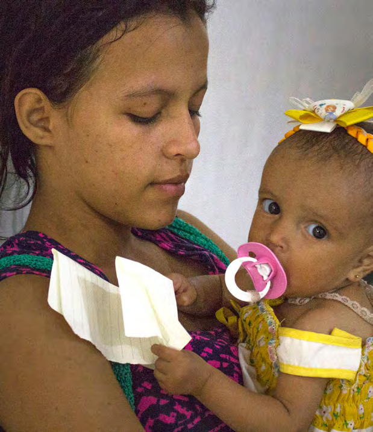

**Image 2 OCR + Description:**
```
**Image Description:**
The image shows a stylized graphic of a page corner being peeled back or folded over from the top right. The page appears mostly black, with the folded-back corner exposing a white or light gray underside. There is no text or other key elements visible on this image. It appears to be a simple icon or symbol, possibly representing a page-turning or flipping action, often used in digital documents or reports.
```


## Page 15
#f!!!!"!!!!46B*+$'.#*D'"&*@""'75*>/0%$#*KTKK
4,)5/* 4%$5&* 67"8* B$%'0* #$'.#* <'"&* 7"&* D!D*
&).:'$./2/"#.* (%"#)"'/* #%* :/* $/57#);/5=* .2755* )"*
;%5'2/g278)"-* '0* P* 0/$(/"#* %<* #%#75* 4%$5&* 67"8*
0$%c/(#*&).:'$./2/"#.*7"&*KP*0/$(/"#*%<*#,/*67"8_.*
7&2)").#$7#);/*/Z0/"&)#'$/.*)"*D`KTKKg#,/=*057=*7"*
%'#W.)M/&* $%5/* )"* .0/()<)(* 7$/7.H* +,).* 7""'75* $/0%$#*
<%('./.*%"*#,$//*%<*#,/./*7$/7.*($)#)(75*#%*#,/*4%$5&*
67"8* B$%'0_.* $/.0%"./* #%* #,/* EYa!?WI[* 07"&/2)(1*
(%"<5)(#1*7"&*(5)27#/*(,7"-/C*
k**j/50)"-*(%'"#$)/.*(%0/*V)#,*.,%(8.*7"&*57=**
#,/*-$%'"&V%$8*<%$*$/(%;/$=
k**NZ#/"&)"-*#,/*67"8*B$%'0_.*.'00%$#*7($%..*7*
:$%7&*$7"-/*%<*DEa*.)#'7#)%".*
k**E%"#$):'#)"-*#%*(%'"#$=1*$/-)%"751*7"&*-5%:75*
8"%V5/&-/*%"*.'.#7)"7:5/*&/;/5%02/"#*#%*
/"7:5/*2%$/*/O/(#);/*.%5'#)%".
&PQNR!SQTUN!VPX!SKPNR!PXNYMTUXPN!RM!VUWXPNX!NLM\JN!
RLVR!\MQTRPKXN!X^YXPKXT\X:!+,/./*.,%(8.*$7"-/*<$%2*
5%(75)M/&*"7#'$75*&).7.#/$.1*.'(,*7.*/7$#,b'78/.*7"&*
,'$$)(7"/.1*#%*-5%:75*(%"#7-)%".1*.'(,*7.*#,/*<)"7"()75*
($).).*%<*KTTRhKTT[*7"&*#,/*EYa!?WI[*07"&/2)(1*#%*
27"W27&/*&).$'0#)%".1*.'(,*7.*#,/*V7$*)"*L8$7)"/H*
+$'.#*<'"&.*7$/*%o/"*#,/*<)$.#*%"*#,/*-$%'"&*#%*,/50*
&)7-"%./* #,/* /O/(#.* %<* 7* .,%(81* 7../..* (%'"#$)/._*
)22/&)7#/*"//&.1*7"&*0$%;)&/*)22/&)7#/*<)"7"()"-*
#%*#)&/*#,/2*%;/$*'"#)5*5%"-/$W#/$2*.'00%$#*(7"*:/*
0'#*)"*057(/H
+,/* 4%$5&* 67"8* B$%'0* ).* 7:5/* #%* &/05%=* #$'.#*
<'"&.* b')(85=1* .)"(/* #$'.#* <'"&* (%22)#2/"#.* 7"&*
&).:'$./2/"#.*(7"*:/*0$%-$722/&*%$*$/0$%-$722/&*
V)#,*#,/*700$%;75*%<*$/5/;7"#*-%;/$")"-*:%&)/.H*+$'.#*
<'"&.*(7"*75.%*2%:)5)M/*7&&)#)%"75*$/.%'$(/.*7#*7"=*
#)2/* &'$)"-* #,/* =/7$1* 7&&)"-* #%* #,/)$* <5/Z):)5)#=* )"*
2//#)"-* /2/$-/"(=* "//&.* 7.* #,/./* 7$)./H* >/(/"#*
$/<%$2.*)"*#,/*V7=*67"8*B$%'0*)".#)#'#)%".*27"7-/*
#$'.#*<'"&.*<'$#,/$*/",7"(/*#,).*7&;7"#7-/*V)#,*2%$/*
.#$/725)"/&*-%;/$"7"(/*7"&*27"7-/2/"#*.=.#/2.1*
-$/7#/$*.#$7#/-)(*75)-"2/"#1*7"&*:/##/$*/"-7-/2/"#*
72%"-*.#78/,%5&/$.*e6%Z*IHKfH
JULIA BURLACHENKO / WORLD BANK


**Image 1 OCR + Description:**
```
**Image Description:**
The image shows two large, heavily damaged apartment buildings with visible fire and smoke damage. The buildings appear to be abandoned or severely ruined, with many windows missing or broken. The structures are on either side of a gap leading to a distant view of greenery and a small pile of debris. 

In the foreground, there is a paved sidewalk bordered by a strip of grass with shrubs and small trees. Two people are walking along the sidewalk, carrying bags, seemingly passing through the area.

On the left building, there is a yellow sign attached to a balcony that reads: "Authorities hear us".

The overall tone of the image evokes a sense of devastation and recovery, likely symbolizing the aftermath of conflict or disaster and the ongoing human experience around it. This makes it relevant for an annual development report focusing on reconstruction, resilience, or post-crisis recovery themes.
```
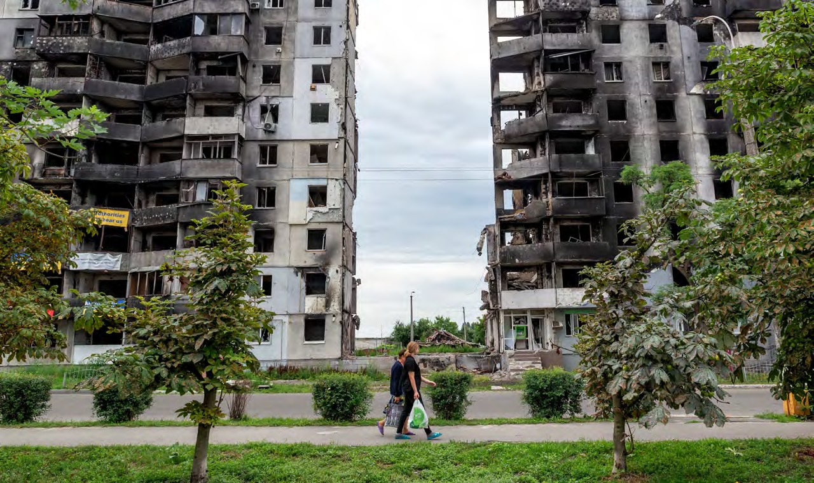

**Image 2 OCR + Description:**
```
**Image Description:**
The image shows a simple graphic of a page corner being curled upward from the bottom right. The background of the image is black, and the page itself is white with a slight shadow effect to show the curl. There are no other elements or text visible on the page or in the image. 

This image likely symbolizes turning a new page or revealing new information, which fits well with the theme of an annual development report.
```


## Page 16
IH*Y0#)2)M)"-*+$'.#*D'"&.*7"&*D!D.*)"*L"(/$#7)"*+)2/.*!!"!!!!#i
>M^!#:j:!EMPcU!>VTJ!5PMQY!&PQNR!,QTU!-VTV]X[XTR!4PPVT]X[XTRN
'X\XTR!PXSMP[N!XTNQPX!EMPcU!>VTJ!5PMQY!KTNRKRQRKMTN!\VT!NRPVRX]K\Vccb!UXYcMb!RPQNR!SQTU!VTU!!
,$,!PXNMQP\XN!gKRL!]PXVRXP!NYXXU!VTU!V\\QPV\b!RM!NQYYMPR!\cKXTRN_!UXWXcMY[XTR!]MVcN:
G)"(/* KTKT1* #,/* 4%$5&* 67"8* ).* #$7".)#)%")"-* <$%2* 7*
<$7-2/"#/&* 0%$#<%5)%* %<* PK[* #$'.#* <'"&* 7((%'"#.* #%*
QT* 57$-/$* 7"&* 2%$/* .#$7#/-)(755=* 75)-"/&* L2:$/557* KHT*
]$%-$72.*e@""/Z*EfH
k**G#$7#/-)(*75)-"2/"#*7"&*.#$%"-/$*)"#/$"75*%;/$.)-,#1*
$/&'(/&*#$7".7(#)%".*(%.#.1*7"&*:/##/$*)"#/-$7#)%"*V)#,*
#,/*67"8_.*.#$7#/-=*7"&*057"")"-*0$%(/../.*
k**G#$/725)"/&1*,7$2%")M/&*-%;/$"7"(/*7"&*
27"7-/2/"#*0$%(/../.*<%$*:/##/$*/"-7-/2/"#1*
#$7".07$/"(=1*7"&*$).8*27"7-/2/"#*
k**!"($/7./&*<%('.*%"*$/.'5#.*$/0%$#)"-1*(%22'")(7#)%".1*
7"&*;).):)5)#=
k**>/b')$/2/"#.*7"&*0$%(/&'$/.*7$#)('57#/&*)"*]%5)(=*7"&*
]$%(/&'$/*D$72/V%$8*&%('2/"#.*)..'/&*)"*D`KTKK
k**+%*&7#/1*RRm*%<*#$'.#*<'"&*<'"&$7).)"-*:/)"-*(,7""/5/&*
#,$%'-,*#,/*L2:$/557*KHT*]$%-$72.
EMPcU!>VTJ
!"* KTKK1* #,/* D'"&)"-* i//&.* @../..2/"#* e$/"72/&* #,/*
E%'"#$=W?$);/"*6'&-/#)"-*/Z/$()./f*V7.*<'55=*)"#/-$7#/&*
)"#%*!DE_.*7""'75*057"")"-*7"&*:'&-/#)"-*0$%(/..*#%*&%*
#,/*<%55%V)"-C
k**N".'$/*#,7#*0$%c/(#.*7"&*:'&-/#.*75)-"*V)#,*!DE_.*
.#$7#/-)(*0$)%$)#)/.*7#*7*(%'"#$=*%$*$/-)%"75*5/;/5
k**]$%;)&/*7*<'55/$*0)(#'$/*%<*<'"&)"-*"//&.*7($%..*#,/2/.*
7"&*$/-)%".
k**@55%V*:/##/$*75)-"2/"#*V)#,*&/;/5%02/"#*07$#"/$*
0$)%$)#)/.*#%*($/7#/*2%$/*/O)()/"#*7"&*<5/Z):5/**
057#<%$2.*#%*<'"&*!DE*0$%c/(#.*7&&$/..)"-*8/=*
&/;/5%02/"#*(,755/"-/.
k**D'$#,/$*.'00%$#*#,/*)"#$%&'(#)%"*%<*.#$/725)"/&*
-%;/$"7"(/*7$%'"&*<'"&)"-*0$%0%.75.*7"&*755%(7#)%".
$,+
!"* D`KTKK1* F!B@* 7&%0#/&* #,/* F!B@* G#$7#/-)(* ]$)%$)#)/.*
]$%-$72*#%*.#$/725)"/*27"7-/2/"#*%<*)#.*<%'$*#$'.#*<'"&.H*
k**E%22%"*-%;/$"7"(/*<$72/V%$8*#,7#*0$%;)&/.*'")<)/&*
-%;/$"7"(/1*$/0%$#)"-1*7"&*%;/$.)-,#*$/b')$/2/"#.
k**E%".).#/"#*700$%7(,*#%V7$&*.#$7#/-=1*<'"&$7).)"-1**
7"&*(%%$&)"7#)%"*#%*7;%)&*&'05)(7#)%"*%<**
#$'.#*<'"&*7(#);)#)/.*
k**6%%.#.*F!B@_.*7:)5)#=*#%*0$%;)&/*:5/"&/&*<)"7"(/*
.%5'#)%".*<%$*)#.*(5)/"#.
!"*D`KTKK1*#,/*4%$5&*67"8*B$%'0*./$;/&*7.*5)2)#/&*#$'.#//*
%$* #$/7.'$=* 27"7-/$* <%$* KP* D!D.* 7"&* 7"* )205/2/"#)"-*
/"#)#=*%<*I[*D!D.*e@""/Z*NfH*
k**>/05/").,2/"#.*.'00%$#/&*)"*D`KTKKC*dS*:)55)%"*<%$*#,/*
B5%:75*]7$#"/$.,)0*<%$*N&'(7#)%"*eB]Nf*7"&*dPHJ*:)55)%"*
<%$*#,/*B5%:75*N";)$%"2/"#*D7()5)#=*eBNDf
+,/* 4%$5&* 67"8* B$%'0* D!D* F7"7-/2/"#* D$72/V%$8*
,/50.*8//0*#,/*-5%:75*7)&*7$(,)#/(#'$/*<$7-2/"#7#)%"*7"&*
(%205/Z)#=*)"*(,/(8H*
k**!"($/7./&*/"-7-/2/"#*V)#,*&/;/5%02/"#*07$#"/$.*#%*
.,70/*#,/*&)75%-'/*7$%'"&*#,/*(%"#)"''2*%<*<)"7"()"-*
)".#$'2/"#.*7;7)57:5/*#%*2//#*&/;/5%02/"#*%:c/(#);/.*
k**D%('.*%"*:')5&)"-*%"*7*2%$/*.#$7#/-)(*7)&*7$(,)#/(#'$/
-$54
,$,N


**Image 1 OCR + Description:**
```
**Image Description:**
The image is a single page from an annual development report, with a vertical layout. The page features a professional and clean design. Key elements include:

- A large, full-height photograph that takes up the entire page. The photo shows green plants with yellow-green fruits, which appear to be limes, growing on a tree.
- Near the bottom right corner, there is text with a logo and the organization's details in white font:
  - The logo reads "FOLUR."
  - Below the logo, the text states:  
    "Food Systems for the Future  
    Forests, Trees and Agroforestry Program  
    An annual development report  
    2023"
- The text is positioned over a translucent dark green gradient that makes it stand out against the photo background.

The overall layout conveys a focus on agriculture, sustainability, or forestry, consistent with the themes suggested by the text.
```


## Page 17
#q!!!!"!!!!46B*+$'.#*D'"&*@""'75*>/0%$#*KTKK
Figure 1.1. World Bank Trust Fund Disbursements to FCV-affected Countries
l*3Y#,/$*G#7#/.9*)"(5'&/*(%'"#$)/.*"%#*700/7$)"-*%"*#,/*%O)()75*46B*5).#*%<*<$7-)5/*7"&*(%"<5)(#W7O/(#/&*.)#'7#)%".*
)"*/7(,*<).(75*=/7$H*+,).*$/0%$#*$/-7$&.*L8$7)"/*7.*7"*DEaW7O/(#/&*(%'"#$=*.)"(/*@0$)5*I1*KTKKH*
D%$*/Z7205/1*V,/"*V7$*/$'0#/&*)"*L8$7)"/*)"*D/:$'7$=*
KTKK1* #,/* 4%$5&* 67"8* (%22)##/&* 7"&* &).:'$./&*
dKHSP*:)55)%"*%<*#$'.#*<'"&*$/.%'$(/.*#%*(%W<)"7"(/*#V%*
4%$5&* 67"8* 0$%c/(#.* )"* L8$7)"/* )"* #,/* 57.#* b'7$#/$*
e@0$)5*#%*^'"/f*%<*D`KTKKH*+,).*$70)&*$/5)/<*#%*L8$7)"/*
$/0$/./"#/&* QI* 0/$(/"#* %<* 4%$5&* 67"8* #$'.#* <'"&*
&).:'$./2/"#.*<%$*>N*7(#);)#)/.*)"*(%'"#$)/.*)207(#/&*
:=*DEa*)"*D`KTKKH*Y"*7((%'"#*%<*L8$7)"/1*4%$5&*67"8*
#$'.#W<'"&/&* >N* &).:'$./2/"#.* #%* DEa* .)#'7#)%".*
)"($/7./&*:=*IQK*0/$(/"#*)"*D`KTKK1*<$%2*dIHKQ*:)55)%"*
)"*D`KTKI*#%*dJHSP*:)55)%"*)"*D`KTKK*eD)-'$/*IHIfH
+,/* 4%$5&* 67"8* B$%'0* ,7.* 75.%* /O/(#);/5=* './&*
#$'.#*<'"&*7"&*D!D*$/.%'$(/.*)"*)#.*)")#)75*7"&*%"-%)"-*
$/.0%"./*#%*#,/*EYa!?WI[*($).).H*@.*.,%V"*)"*E,70#/$*
K1* #$'.#* <'"&* (%22)#2/"#.* #%#75/&* dXSS* 2)55)%"*
&'$)"-*#,/*<)$.#*IT*2%"#,.*%<*#,/*EYa!?WI[*07"&/2)(*
eF7$(,h?/(/2:/$* KTKTf* )"* $/.0%"./* #%* )22/&)7#/*
"//&.1* 7"&* #,/"* 5/;/5/&* %O* 7.* %#,/$* 4%$5&* 67"8*
B$%'0*<'"&)"-*V7.*0'#*)"#%*057(/H*
+$'.#*<'"&.*(%"#)"'/*#%*(%"#$):'#/*#%*#,/*67"8*B$%'0_.*
%;/$755*/O%$#.*#%*,/50*(%'"#$)/.*:')5&*:7(8*:/##/$*V)#,*
2%$/*$/.)5)/"(/*7"&*0$/07$/&"/..*#%*V)#,.#7"&*<'#'$/*
.,%(8.H*D%$*/Z7205/1*)"*67"-57&/.,*7"&*E%5%2:)71*
#$'.#*<'"&.*7$/*)"<%$2)"-*7"&*0$%;)&)"-*(7.,*#$7".</$.*
#%* 2)#)-7#/* #,/* /O/(#.* %<* #,/* EYa!?WI[* 07"&/2)(*
%"* ;'5"/$7:5/* 0%0'57#)%".H* !"* #,/* ],)5)00)"/.*
7"&* >V7"&71* #$'.#* <'"&.* ,7;/* .'00%$#/&* .#'&)/.*
(%"&'(#/&*#%*)"<%$2*-$%V#,W0$%2%#)"-*-%;/$"2/"#*
0%5)()/.*)"*7*0%.#W07"&/2)(*V%$5&H
!"##
$"##
%"##
&"##
'"##
#"##
()*+,-./0,-
123,.-4
50+4367896:0,04/
50+436:0,04/;
!"#$%%$&'(
)*+,-.
)*+,-/
)*+,+,
)*+,+-
)*+,++
0.94
0.47
1.40
1.42
0.66
0.76
1.28
0.62
0.65
0.41
0.49
1.28
1.03
2.45
0.49
0.51


## Page 18
IH*Y0#)2)M)"-*+$'.#*D'"&.*7"&*D!D.*)"*L"(/$#7)"*+)2/.*!!"!!!!#Z
&PQNR!SQTUN!X^RXTU!RLX!EMPcU!>VTJ!5PMQY_N!PXV\L!
KT!\MQTRPKXN!SV\KT]!SPV]KcKRbB!\MTScK\RB!VTU!WKMcXT\X:!
+,/* EYa!?WI[* 07"&/2)(* 7"&* (5)27#/* (,7"-/* ,7;/*
/Z7(/$:7#/&* #,/* 75$/7&=* 0/$;7.);/* (,755/"-/.*
7..%()7#/&* V)#,* DEa* 7"&* )"($/7./&* ;'5"/$7:)5)#=H*
6=* KTJT1* #V%W#,)$&.* %<* #,/* V%$5&_.* /Z#$/2/* 0%%$*
7$/*/Z0/(#/&*#%*5);/*)"*(%'"#$)/.*V,/$/*<$7-)5)#=*,7.*
:/(%2/*#,/*"%$2H*+$'.#*<'"&.*(%205/2/"#*#,/*67"8*
B$%'0_.*%V"*<)"7"()"-*)"*DEaW7O/(#/&*(%'"#$)/.*7"&*
0$%;)&/* &/;/5%02/"#* $/.%'$(/.* #%* #,%./* #,/* 67"8*
B$%'0* (7""%#* $/7(,* V)#,* )#.* %V"* $/.%'$(/.C* "%"W
2/2:/$*(%'"#$)/.1*(%'"#$)/.*)"*7$$/7$.1*7"&*(%'"#$)/.*
V)#,%'#*7*V/55W<'"(#)%")"-*-%;/$"2/"#*#%*)205/2/"#*
7(#);)#)/.H* +$'.#* <'"&.* /",7"(/* #,/* 67"8* B$%'0_.*
/O/(#);/"/..* )"* .'00%$#)"-* (%'"#$)/.* )"* 7&&$/..)"-*
#,/*(7'./.*7"&*/O/(#.*%<*DEa*7"&*)"*.#$/"-#,/")"-*
#,/)$*$/.)5)/"(/1*/.0/()755=*<%$*#,/)$*2%.#*;'5"/$7:5/*
7"&*27$-)"75)M/&*0%0'57#)%".H
@.*.,%V"*)"*E,70#/$*J1*DEaW7O/(#/&*(%'"#$)/.*,7;/*
$/(/);/&*2%$/*#,7"*,75<*ePQ*0/$(/"#f*%<*#%#75*4%$5&*
67"8*#$'.#*<'"&*&).:'$./2/"#.*<%$*$/()0)/"#W/Z/('#/&*
7(#);)#)/.* &'$)"-* #,/* 57.#* <);/* =/7$.H* +,).* )"(5'&/.*
,/50)"-* #%* 0$%#/(#* #,/* 0%%$* 7"&* 2%.#* ;'5"/$7:5/*
&'$)"-*7(#);/*(%"<5)(#.*7"&*0%.#W(%"<5)(#*.)#'7#)%".*)"*
@<-,7").#7"1*4/.#*67"8*7"&*B7M71*7"&*L8$7)"/H*+$'.#*
<'"&.*75.%*.'00%$#*/O%$#.*#%*7&&$/..*.=.#/2)(*-/"&/$*
:)7./.1*.'(,*7.*,/50)"-*-)$5.*.#7=*)"*.(,%%5*5%"-/$*)"*
i)-/$*7"&*,/50)"-*V%2/"*/"#$/0$/"/'$.*-7)"*7((/..*
#%* <)"7"()"-* )"* i)-/$)7H* +$'.#* <'"&* <)"7"()"-* ).* 75.%*
:/)"-*'./&*#%*.'00%$#*#,/*&/;/5%02/"#*%<*)""%;7#);/*
<)"7"()75*.%5'#)%".*#%*27"7-/*<)"7"()75*$).8.*%<*./;/$/*
V/7#,/$*7"&*"7#'$75*&).7.#/$.*)"*#,/*E7$)::/7"*7"&*
#,/*]7()<)(*!.57"&.H*
&PQNR!SQTUN!NQYYMPR!RLX![VsMPKRb!MS!RLX!EMPcU!>VTJ!
5PMQY_N! JTMgcXU]X! YPMUQ\RN! VTU! NXPWK\XN:! +,/*
4%$5&*67"8*B$%'0*).*7*5/7&/$*)"*#,/*-/"/$7#)%"*7"&*
&)../2)"7#)%"*%<*&/;/5%02/"#*8"%V5/&-/1*)"(5'&)"-*
-')&7"(/1*&7#71*7"&*#%%5.*#%*,/50*(5)/"#.*278/*2%$/*
)"<%$2/&* &/().)%".* 7"&* #%* 7&;7"(/* &/;/5%02/"#*
#,)"8)"-*7"&*%'#(%2/.*7$%'"&*#,/*V%$5&H*+,/*67"8*
B$%'0_.*(%207$7#);/*7&;7"#7-/*5)/.*)"*#,/*.="/$-)/.*
:/#V//"* 8"%V5/&-/* 7"&* <)"7"()"-H* U"%V5/&-/*
.'00%$#.* #,/* &/.)-"* %<* %0/$7#)%".* #,7#* #,/* 67"8*
B$%'0* <)"7"(/.1* 7"&* #,/./* %0/$7#)%".1* )"* #'$"1*
-/"/$7#/* 8"%V5/&-/* 7:%'#* V,7#* V%$8.* #%* )"<%$2*
.':./b'/"#*%0/$7#)%".H*
+$'.#* <'"&.* ,7;/* <)"7"(/&* 7:%'#* XJ* 0/$(/"#* %<* #,/*
4%$5&* 67"8_.* 7&;).%$=* ./$;)(/.* 7"&* 7"75=#)(.* e@G@f*
%;/$* #,/* 57.#* <);/* =/7$.H* +,/./* 7(#);)#)/.* 0$%;)&/*
(%'"#$)/.* V)#,* -')&7"(/* 7"&* $/(%22/"&7#)%".* %"*
.#$/"-#,/")"-*0%5)()/.1*)".#)#'#)%".1*7"&*)";/.#2/"#.*
<%$* $/:')5&)"-* :/##/$H* +$'.#* <'"&.* 75.%* .'00%$#*
4%$5&* 67"8* $/./7$(,* 7(#);)#)/.* 7"&* &/;/5%02/"#*
%<* -5%:75* 8"%V5/&-/* 057#<%$2.1* &)7-"%.#)(* #%%5.1*
7"&* -')&/5)"/.* <%$* 67"8* B$%'0* .#7O* #%* './* )"* #,/)$*
%0/$7#)%"75*V%$8*)"*7$/7.*.'(,*7.*/";)$%"2/"#75*7"&*
"7#'$75* $/.%'$(/* 27"7-/2/"#1* 7"&* $/<%$2)"-* 7"&*
)20$%;)"-*#,/*(5)27#/*<%$*0$);7#/*./(#%$*)";/.#2/"#.*
0%.#WEYa!?WI[H*
]7$#)('57$5=* )"* #)2/.* %<* ($).).1* #,/* 67"8* B$%'0*
/"&/7;%$.*#%*.#$/"-#,/"*)#.*$%5/*7.*7*.%5'#)%".*:7"8*
#,7#* :$)"-.* -5%:75* 8"%V5/&-/* #%* :/7$* #%* -/"/$7#/*
&/;/5%02/"#* .%5'#)%".* )"* 7* #)2/5=1* (%"#/Z#'75)M/&1*
7"&*)"#/-$7#/&*V7=H*@.*.,%V"*#,$%'-,%'#*E,70#/$.*
K*7"&*J1*8"%V5/&-/*./$;)(/.*7$/*7"*)"#/-$75*07$#*%<*
#,/* 67"8* B$%'0_.* EYa!?WI[* ($).).* $/.0%"./1* 7.* V/55*
7.* /O%$#.* #%* 7&&$/..* DEa* (,755/"-/.H* i'2/$%'.*
/Z7205/.*
%<*
#$'.#*
<'"&W.'00%$#/&*
@G@*
7$/**
,)-,5)-,#/&1*.'(,*7.*7*.#$7#/-)(*&)7-"%.#)(*%<*+%-%_.*
V7#/$* .'005=* 7"&* .7")#7#)%"* ./(#%$* #%* )"<%$2* #,/*
&/;/5%02/"#*%<*7*"7#)%"75*.#$7#/-=1*7"&*-')&7"(/*#%*
U%.%;%*%"*V7=.*#%*)20$%;/*)#.*#7Z07=/$*$/-).#$=*#%*
:%%.#*#7Z*$/;/"'/.*7"&*$/&'(/*)"<%$275)#=H*E,70#/$*
S*%O/$.*./;/$75*/Z7205/.*%<*$/./7$(,*7(#);)#)/.*7"&*
8"%V5/&-/*0$%&'(#.*7#*#,/*$/-)%"75*7"&*-5%:75*5/;/5H*


## Page 19
jn!!!!"!!!!46B*+$'.#*D'"&*@""'75*>/0%$#*KTKK
WORLD BANK


**Image 1 OCR + Description:**
```
**Image Description:**
The image depicts a scene of community engagement or aid distribution, likely related to development or humanitarian work. It shows a group of women and children, many wearing colorful traditional clothing and face masks, standing in line outdoors among trees. The focus is on a woman in the foreground pressing her finger onto a fingerprint scanner on a wooden table, which is connected to a device resembling a card reader or biometric verification machine. A man, partially visible on the right, is operating or overseeing the devices. The setting appears to be a rural or semi-rural area, with simple structures visible in the background.

There is no visible text in the image. The layout centers on the interaction at the table with a crowd waiting behind, emphasizing a systematic, organized process possibly for registration, aid distribution, or access control related to a development program.
```
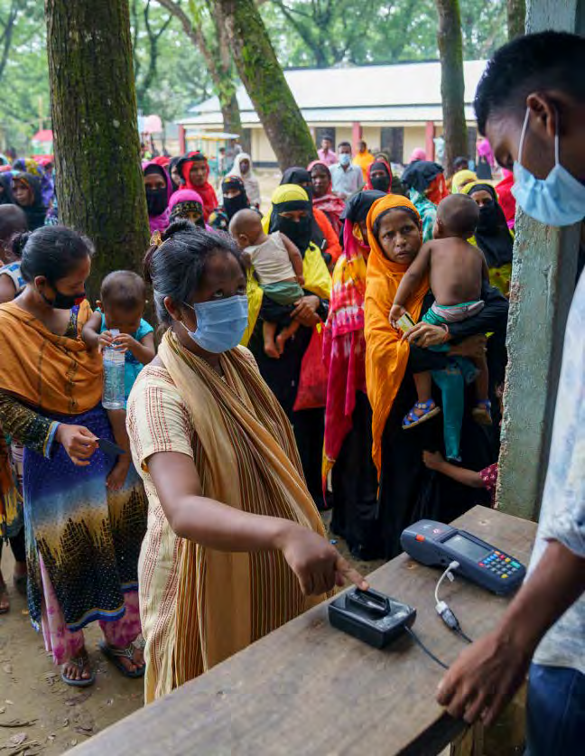

## Page 20
KH*E%"#$):'#)"-*#%*#,/*EYa!?WI[*E$).).*>/.0%"./!!!!"!!!!j#
2. CONTRIBUTING TO THE COVID-19  
CRISIS RESPONSE
G)"(/* F7$(,* KTKT1* #,/* 4%$5&* 67"8* B$%'0* ,7.*
2%'"#/&*#,/*<7.#/.#*7"&*57$-/.#*($).).*$/.0%"./*)"*
)#.* ,).#%$=* #%* ,/50* &/;/5%0)"-* (%'"#$)/.* $/.0%"&*
7"&* $/(%;/$* <$%2* #,/* EYa!?WI[* ($).).H* D%$* #,/* <)$.#*
KQ* 2%"#,.* %<* #,/* EYa!?WI[* ($).).g@0$)5* I1* KTKT*
#%* ^'"/* JT1* KTKKg#,/* 67"8* B$%'0* &/5);/$/&* 7"*
'"0$/(/&/"#/&* dKQK* :)55)%"* )"* "/V* (%22)#2/"#.1*
%<*V,)(,*dQ[*:)55)%"*V7.*<$%2*!6>?1*d[I*:)55)%"*<%$2*
!?@1* dQP* :)55)%"* <$%2* !DE1* dIJ* :)55)%"* <$%2* F!B@1**
7"&*dIS*:)55)%"*<$%2*#$'.#*<'"&.*eD)-'$/*KHIfH
+$'.#* <'"&.* 7"&* D!D.* ,7;/* 27&/* )20%$#7"#*
(%"#$):'#)%".* #%* #,/* 67"8* B$%'0_.* 07"&/2)(*
$/.0%"./H* F7"=* &/;/5%02/"#* 07$#"/$.* ,7;/* 27&/*
"/V*(%"#$):'#)%".*#%*#$'.#*<'"&.*7"&*D!D.*#%*.'00%$#*
#,/* EYa!?WI[* $/.0%"./H* \%%8)"-* :7(8* %;/$* #,/* 57.#*
#V%*=/7$.1*#,).*(,70#/$*.,%V(7./.*,%V*#$'.#W<'"&/&*
7(#);)#)/.*,7;/*://"*3<)$.#*$/.0%"&/$.9*#%*#,).*($).).1*
7.*#,/=*%o/"*7$/*)"*#,/*(7./*%<*27"=*/2/$-/"()/.H*
+$'.#* <'"&* $/.%'$(/.* (7"* :/* 0$%-$722/&* %$**
$/0$%-$722/&* 7"&* &/05%=/&* b')(85=* #,$%'-,%'#**
#,/* =/7$1* /"7:5)"-* #,/* 67"8* B$%'0* #%* 7../..* #,/**
.)#'7#)%"* %"* #,/* -$%'"&* 7"&* 0$%;)&/* )22/&)7#/**
.'00%$#* V,)5/* 5%"-/$W#/$2* 7..).#7"(/* ).* 0'#* )"*
057(/H* !"* #,/* (7./* %<* #,/* EYa!?WI[* $/.0%"./1* #$'.#*
<'"&.*,7;/*<7.#W#$7(8/&*<'"&)"-*#%*2//#*/2/$-/"(=*
"//&.1*:%%.#/&*.'00%$#*<%$*#,/*2%.#*;'5"/$7:5/1*7"&**
,/50/&*57=*#,/*-$%'"&V%$8*<%$*(%'"#$)/.*#%*$/:')5&*
V)#,*2%$/*.'.#7)"7:)5)#=1*$/.)5)/"(/1*7"&*)"(5'.)%"H
Figure 2.1. World Bank Group COVID-19 Crisis Response Commitments,  
April 1, 2020 to June 30, 2022
!"#$%&!"#$%
!$'%&&&#'%
!()%&!(#"%
*!+'%&)#*%
#,&-./010/023&345567/28&9:&
/743/&;4<83%&'#&%
!"#"$
%&''&()&


## Page 21
jj!!!!"!!!!46B*+$'.#*D'"&*@""'75*>/0%$#*KTKK
Figure 2.2. World Bank COVID-19 Related Activities, by Type of Activity, FY2020–2022
j:#!EMPcU!>VTJ!&PQNR!,QTUN!
6=* #,/* /"&* %<* D`KTKK1* 4%$5&* 67"8* #$'.#* <'"&.*
(%22)##/&* dIHXJ* :)55)%"* #%* JI[* EYa!?WI[* $/57#/&*
4%$5&* 67"8* %0/$7#)%".* #,7#* 7$/* ,/50)"-* (%'"#$)/.*
$/.0%"&* &)$/(#5=* #%* #,/* EYa!?WI[* ($).).H* @:%'#* [S*
0/$(/"#* %<* #$'.#* <'"&* (%22)#2/"#.* edIHPJ* :)55)%"f*
V/$/* <%$* <)"7"()"-* $/()0)/"#W/Z/('#/&* e>Nf* 0$%c/(#.*
7"&* X* 0/$(/"#* %<* (%22)#2/"#.* ed[[* 2)55)%"f* V/$/*
<%$*67"8W/Z/('#/&*e6Nf*7(#);)#)/.*#,7#*7$/*.'00%$#)"-*
0$%c/(#* 0$/07$7#)%"* %$* )205/2/"#7#)%"1* @G@1* 7"&*
%#,/$*8"%V5/&-/*./$;)(/.H*@:%'#*PJ*0/$(/"#*%<*#,/./*
(%22)#2/"#.*edRXJ*2)55)%"f*V/$/*&).:'$./&*:=*^'"/*
!"#$%&'('&')*#*+,,-.&'/0#.)*)$.%1#
$/2#3/-45)20)#,.-2+%&*6#!"
!"#$%&'('&')*
*+,,-.&'/0#$2('*-.7#
*).('%)*#8#$/$57&'%*6#!#$
!"#
9-.52#!$/3
:.+*&;<+/2)2
=%&'('&')*#
!"#$%&'('&')*#*+,,-.&'/0#
,.),$.$&'-/#->#?!@AB?A=#
,.-C)%&*6#%#
!"#$%&'('&')*#*+,,-.&'/0#
,.)$.$&'-/#->#@"#
,.-C)%&*6#!"&
@"#0.$/&*#%-;>'/$/%'/0#
?!@AB?A=#,.-C)%&*6#'!
D&$/2;$5-/)#
@"#0.$/&*6#("
JT1*KTKKH*+,).*$/0$/./"#.*752%.#*IT*0/$(/"#*%<*755*#$'.#*
<'"&*&).:'$./2/"#.*&'$)"-*#,/*KS*2%"#,.*:/#V//"*
^'5=*I1*KTKT*7"&*^'"/*JT1*KTKKH*
F7"=*67"8*%0/$7#)%".*,7;/*://"*.'00%$#/&*:=*2%$/*
#,7"* %"/* #$'.#W<'"&/&* 7(#);)#=H* D)-'$/* KHK* 0$%;)&/.*
7* :$/78&%V"* %<* #,/* SRT* #$'.#W<'"&/&* 7(#);)#)/.*
#,7#* ,7;/* .'00%$#/&* #,/* JI[* 4%$5&* 67"8* EYa!?WI[*
$/57#/&*%0/$7#)%".H*+,/*6N*7(#);)#)/.*.'00%$#)"-*#,/*
0$/07$7#)%"*%<*"/V*4%$5&*67"8*)";/.#2/"#*0$%c/(#.*
,7;/*://"*07$#)('57$5=*)20%$#7"#*)"*$720)"-*'0*#,/*
67"8_.*$/.0%"./*#%*#,/*07"&/2)(H*


## Page 22
KH*E%"#$):'#)"-*#%*#,/*EYa!?WI[*E$).).*>/.0%"./!!!!"!!!!jk
Figure 2.3. World Bank COVID-19 Trust-Funded Activities, by Global Practices, FY2020–2022
G)"(/* #,/* :/-)"")"-* %<* #,/* 07"&/2)(1* #$'.#* <'"&*
(%22)#2/"#.*,7;/*<%('./&*"%#*%"5=*%"*#,/*,/75#,*
./(#%$1* :'#* 75.%* %"* %#,/$* ./(#%$.* )207(#/&* :=* #,/*
V)&/$* .%()%W/(%"%2)(* ($).).1* )"(5'&)"-* /&'(7#)%"1*
.%()75*0$%#/(#)%"*7"&*c%:.1*V7#/$1*7"&*)"#/$"7#)%"75*
#$7&/*eD)-'$/*KHJfH
'41$)!'/21(%2/!,('!$--/)$4&/!%//)2
F%.#* #$'.#* <'"&* (%22)#2/"#.* V/$/* 27&/* V)#,)"*
#,/*<)$.#*2%"#,.*%<*#,/*07"&/2)(1*7.*#,/*4%$5&*67"8*
$'.,/&* #%* 0$%;)&/* )22/&)7#/* $/5)/<* #%* (%'"#$)/.*
V%$5&V)&/H* +,/* "'2:/$* %<* "/V* #$'.#W<'"&/&* 6N*
(%22)#2/"#.* <%$* EYa!?WI[* $/.0%"./* 7((/5/$7#/&*
<$%2*<);/*(%22)#2/"#.*)"*#,/*#,)$&*b'7$#/$*%<*D`KTKT*
e^7"'7$=*#%*F7$(,*KTKTf*#%*SS*(%22)#2/"#.*)"*#,/*
<%'$#,* b'7$#/$* %<* D`KTKT* e@0$)5* #%* ^'"/* KTKTf* #%* RQ*
(%22)#2/"#.*)"*#,/*<)$.#*b'7$#/$*%<*D`KTKI*e^'5=*#%*
!"#$%
&'((')*
!"#$%&'()*
+#,-./0,)%1%
2"334.31).-
51($.67&8,.#4.4")&9&
:";,$(.4")7&!"#$%
<"=4($&:#".1=.4")&9&
>"?-7&&'#"%
@%,=(.4")7&&$#(%
!(.1#7&)#'%
A(=#"1=")"34=-7&+#(%1&
()%&B)C1-.31).7&*#(%
D.61#&:#(=.4=1&E#1(-7&
&&#*%
G/0#/2:/$* KTKTf* eD)-'$/* KHSfH* +,/* "'2:/$* %<* "/V*
#$'.#W<'"&/&* >N* (%22)#2/"#.* 0/78/&* 7#* KQ* -$7"#.*
&'$)"-* #,/* ./(%"&* b'7$#/$* %<* D`KTKI* eY(#%:/$* #%*
?/(/2:/$* KTKTfH* +$'.#* <'"&* (%22)#2/"#.* <%$* :%#,*
6N*7"&*>N*7(#);)#)/.*0/78/&*&'$)"-*#,/*<)$.#*b'7$#/$*%<*
D`KTKI1*V)#,*6N*-$7"#.*7#*dJKHK*2)55)%"*7"&*>N*-$7"#.*7#**
dK[Q*2)55)%"H
6%#,* "'2:/$.* 7"&* 72%'"#.* %<* "/V* #$'.#* <'"&*
(%22)#2/"#.* ,7;/* #70/$/&* %O* .)"(/* #,/* )")#)75* IT*
2%"#,.*%<*#,/*67"8_.*EYa!?WI[*$/.0%"./*eF7$(,*#%*
?/(/2:/$* KTKTf1* /Z(/0#* <%$* #,/* ./(%"&* 7"&* <%'$#,*
b'7$#/$.*%<*D`KTKK*eD)-'$/*KHSfH*+,/*67"8*)")#)7#/&*7*
"/V*.07#/*%<*@G@*7(#);)#)/.*)"*#,/*./(%"&*b'7$#/$*%<*
D`KTKK*eY(#%:/$*#%*?/(/2:/$*KTKIf*7"&*27&/*57$-/*
(%22)#2/"#.* #%* .'00%$#* @<-,7").#7"* &'$)"-* #,/*
./(%"&*7"&*<%'$#,*b'7$#/$.*%<*D`KTKKH


## Page 23
jI!!!!"!!!!46B*+$'.#*D'"&*@""'75*>/0%$#*KTKK
Figure 2.4. World Bank COVID-19 Trust-Funded Activities, by Time Periods, FY2020–2022
+$'.#* <'"&.* /"-7-/&* )"* /7$5=* EYa!?WI[* $/.0%"./*
7(#);)#)/.* ,7;/* ,/50/&* #,/* 4%$5&* 67"8* 0$%#/(#* #,/*
0%%$*7"&*2%.#*;'5"/$7:5/*)"*#,/*)22/&)7#/*)".#7"(/H*
!"* 67"-57&/.,1* <'"&)"-* <$%2* #,/* .Q[VT! +VYKRVc!
*[aPXccV!1PM]PV[!,/50/&*#%*7&&*/(%"%2)(*)"(5'.)%"*
(%20%"/"#.*#%*27c%$*(7.,*#$7".</$*0$%-$72.*#%*,/50*
5%VW)"(%2/* V7-/* /7$"/$.* -7)"* 7* :/##/$* <%%#,%5&*
)"* #,/* V%$8057(/* 0%.#W07"&/2)(H* !"* E%5%2:)71* #,/*
4%$5&*67"8*'./&*-$7"#*<)"7"()"-*<$%2*#,/*2RVRX!VTU!
1XV\XaQKcUKT]! ,QTU! d21,e* #%* 0$%;)&/* /2/$-/"(=*
(7.,*#$7".</$.*#%*;'5"/$7:5/*2)-$7"#.*7"&*a/"/M'/57"*
$/<'-//.*#%*2)#)-7#/*#,/*.0$/7&*%<*EYa!?WI[*7"&*/7./*
#/".)%".*V)#,*E%5%2:)7"*,%.#*(%22'")#)/.H
!"*LM:/8).#7"*7"&*+7c)8).#7"1*.'00%$#*<$%2*#,/*DMPXV!
&PQNR! ,QTU! SMP! /\MTM[K\! VTU! 1XV\X?>QKcUKT]!
&PVTNKRKMTN! /"7:5/&* #/Z#* 2/..7-)"-* .=.#/2.* <%$*
27..*0':5)(*%'#$/7(,*#,7#*/"(%'$7-/&*$).8*$/&'(#)%"*
:/,7;)%$.* /7$5=* )"* #,/* 07"&/2)(* 7"&* ;7(()"7#)%".*
!""
#"
$"
%"
&"
'"
("
)"
*"
!"
"
)'"
)""
*'"
*""
!'"
!""
'"
"
!"!"
#$
+,-./012-3456127
859-5:-+,-3;2<=<2<>7
859-5:-?,-@/5A>;27
?,-./012-3456127
%&'()*+,-.()/
0123*,4554-(/6
%&'()*+7)48')4-(*9'):
;.,<:&*-=*%&'()>
?:8:5*+7)484)4:/
!"!"
#@
!"!A
#A
!"!A
#!
!"!A
#$
!"!A
#@
!"!!
#A
!"!!
#!
!"!!
#$
!"!!
#@
B:(C4(D
+7)48')4-(
%"(/* #,/=* :/(72/* 7;7)57:5/H* F%$/* #,7"* IT* 2)55)%"*
0/%05/*V/$/*<'55=*;7(()"7#/&*7-7)".#*EYa!?WI[*V)#,*
#,/*,/50*%<*#,/./*.=.#/2.H
Y#,/$* 0$%-$72.* 7&70#/&* .%2/* %<* #,/)$* %"-%)"-*
7(#);)#)/.*#%*,/50*/".'$/*.'.#7)"7:5/*:'.)"/..*-$%V#,*
7"&* c%:* ($/7#)%"* 72%"-* V%2/"W5/&* /"#/$0$)./.H*
!"* B'7#/27571* .'00%$#* <$%2* #,/! $TSMP[VRKMT! SMP!
)XWXcMY[XTR! 1PM]PV[! d$TSM)XWe* ,/50/&* #,/*
-%;/$"2/"#*8//0*)#.*G(,%%5*D//&)"-*]$%-$72*'0*7"&*
$'"")"-* &'$)"-* EYa!?WI[* 5%(8&%V".1* :=* 7&70#)"-*
&)-)#75*#/(,"%5%-)/.*#,/*0$%-$72*,7&*://"*0)5%#)"-*
#%*,/50*V%2/"*.2755,%5&/$*<7$2/$.*7((/..*27$8/#.H
@($%..*./;/"*(%'"#$)/.*)"*#,/*F)&&5/*N7.#*7"&*i%$#,*
@<$)(7* eFNi@f* $/-)%"1* #,/* 4%$5&* 67"8* 7&70#/&*
<)"7"()"-*<$%2*#,/*EM[XT!/TRPXYPXTXQPN!,KTVT\X!
$TKRKVRKWX! dEX?,Ke* #%* .,)o* <%('.* #%* /W(%22/$(/*
#$7)")"-* #%* ,/50* V%2/"* /"#$/0$/"/'$.* 7"&* .2755*
:'.)"/..*%V"/$.*V%$8*7$%'"&*EYa!?WI[*$/.#$)(#)%".*
7"&*/2:$7(/*&)-)#75*#$7".<%$27#)%".H


## Page 24
KH*E%"#$):'#)"-*#%*#,/*EYa!?WI[*E$).).*>/.0%"./!!!!"!!!!jO
@5#,%'-,* #,/* 67"8* 07'./&* )#.* %0/$7#)%".* )"*
@<-,7").#7"* 7o/$* #,/* 0%5)#)(75* )".#7:)5)#=* )"* @'-'.#*
KTKI1* #,/* 67"8* ,7.* V%$8/&* (5%./5=* V)#,* #,/*
)"#/$"7#)%"75*(%22'")#=*#%*<)"&*75#/$"7#);/*V7=.*#%*
0$%;)&/*7..).#7"(/*#%*#,/*0/%05/*%<*@<-,7").#7"H*+,/*
4S]LVTKNRVT! 'X\MTNRPQ\RKMT! &PQNR! ,QTU! d4'&,e*
#$7".</$$/&* dITT* 2)55)%"* #%* Li!END* )"* ?/(/2:/$*
KTKI* 7"&* 7"* 7&&)#)%"75* dIX[* 2)55)%"* )"* F7=* KTKK*
#%* $/.'2/* <)"7"()"-* /../"#)75* ,/75#,* ./$;)(/.* 7"&*
EYa!?WI[* $/.0%"./.* )"* 07$#"/$.,)0* V)#,* 4jY* 7"&*
#,$%'-,*0$%;)&/$.*7(#);/*)"*#,/*G/,7#27"&)*0$%-$721*
V,)(,* <%('./&* %"* ,/75#,1* "'#$)#)%"1* 7"&* <72)5=**
057"")"-*./$;)(/.H*
@"%#,/$*07"&/2)(W/$7*/;%5'#)%"*).*#,/*&/;/5%02/"#*
%<*7*"/V*-5%:75*#$'.#W<'"&/&*0$%-$721*#,/*+cK[VRX!
VTU! )KNVNRXP! 'KNJ! -VTV]X[XTR! SMP! .XVcRL!
2bNRX[N1* :%$"/* %'#* 7* 4%$5&* 67"8* $/0%$#* 7"&*
$/(%22/"&7#)%".*%"*0$/07$)"-*,/75#,(7$/*.=.#/2.*
<%$* .,%(8.HX* \7'"(,/&* )"* KTKK* V)#,* .'00%$#* %<* #,/*
B5%:75*D7()5)#=*<%$*?).7.#/$*>/&'(#)%"*7"&*>/(%;/$=_.*
^707"W4%$5&* 67"8* ]$%-$72* <%$* F7)".#$/72)"-*
?).7.#/$*>).8*F7"7-/2/"#*)"*?/;/5%0)"-*E%'"#$)/.1*
#,/* "/V* 0$%-$72* .'00%$#.* %0/$7#)%"75* 7"75=#)(.*
#%* <7()5)#7#/* -%;/$"2/"#._* &/().)%"* 278)"-* #%*
.#$/"-#,/"*$/.)5)/"(/*%<*,/75#,*.=.#/2.H*!#*).*0)5%#)"-*
(%'"#$=W.0/()<)(*-70*7"75=./.*#%*,/50*)&/"#)<=*27c%$*
$).8.* 7"&* 7$/7.* <%$* 7(#)%"1* 7"&* /Z05%$)"-* (%'"#$)/.*
V,/$/*(5)/"#._*&/27"&.*7$/*,)-,*7"&*(5/7$*#%*)";/.#*)"*
)"#/-$7#/&*$/.)5)/"(/*<%$*#,/*,/75#,*./(#%$H
2*11('&!&(!6(E/'!$%+(-/!+(*%&'$/2
\%VW)"(%2/* (%'"#$)/.* 7"&* 5%V/$* 2)&&5/W)"(%2/*
(%'"#$)/.*,7;/*$/(/);/&*XX*0/$(/"#*7"&*KJ*0/$(/"#1*
$/.0/(#);/5=1* %<* #%#75* EYa!?WI[W$/57#/&* #$'.#* <'"&*
(%22)#2/"#.* .)"(/* #,/* 07"&/2)(* :/-7"H* +,).*
)"(5'&/.* +7c)8).#7"* V,/$/* #,/! 5cMaVc! 1VPRTXPNLKY!
SMP! 2M\KVc! 4\\MQTRVaKcKRb! d5124e* ).* .'00%$#)"-* 7*
"/#V%$8*%<*();)5*.%()/#=*%$-7")M7#)%".*eEGY.f*#,7#*7$/*
'.)"-*7"*7$$7=*%<*.%()75*7((%'"#7:)5)#=*#%%5.*#%*2%")#%$*
#,/* )205/2/"#7#)%"* %<* #,/* +7c)8).#7"* N2/$-/"(=*
EYa!?WI[* ]$%c/(#H* !"* >V7"&71* 7* DTMgcXU]X! SMP!
+LVT]X!*[aPXccV!1PM]PV[!dD+1f*)207(#*/;75'7#)%"*
.#'&=*&/2%".#$7#/&*#,7#*-%;/$"2/"#*5)(/".)"-*7"&*
)"(/"#);)M)"-* %<* #/Z#)5/* 27"'<7(#'$/$.* #%* 0$%&'(/*
,)-,Wb'75)#=* <7(/* 27.8.* .5%V/&* #,/* .0$/7&* %<*
EYa!?WIT*7"&*-/"/$7#/&*.%()75*:/"/<)#.*7#*5/7.#*<);/*
#)2/.*7.*57$-/*7.*#,/)$*(%.#H
X**>/"#.(,5/$1*^'"A*U57):/$1*E,$).#%0,A*+7$);/$&)1*F/$./&/,A*?/.c%"b'/$/.1*E,5%/A*F/$(7&7"#/1*^7$/&H*KTKIH*3'.*+-"*$2%&'$50'"*>%U$0-+C#0'$%
HO(+$6(%V.'%HC.#F(%V'.6%4"(0(+$'(%+.%&0*)$6"#(:
+,).*$/./7$(,*.,%V.*,%V*(7$/<'5*
)207(#*/;75'7#)%"*(7"*0$%;)&/*
/;)&/"(/*#%*)"<%$2*%'$*0%5)(=*
&/().)%"W278)"-*)"*>V7"&7H
4$*"(%A;F060K%=(("(+0*+%@.66"((".*$'%V.'%B$($0'#CK%
&-0**"*>%W%AWXK%B<0*)0%B$I$*;$%=;+C.'"+O
KUDJO KAGLAN / WORLD BANK GROUP


**Image 1 OCR + Description:**
```
**Image Description:**
The image shows a healthcare worker administering a vaccine injection to a woman seated indoors. The healthcare worker is wearing a white uniform with "Ministerio de Salud" written on it, suggesting affiliation with a health ministry. They are also wearing a surgical mask, protective goggles, and a blue hair net for hygiene. The woman receiving the vaccine is wearing a green mask and a white sleeveless shirt, exposing her upper arm for the injection.

The background includes a window with semi-transparent blue curtains, letting natural light into the room. There are posters on the yellow wall behind them, possibly related to health or biological subjects. The setting appears to be a clinic or healthcare facility.

There is no visible text in the image apart from the wording on the healthcare worker's shirt. The composition focuses on the vaccination process, highlighting public health and medical care themes, appropriate for an annual development report.
```
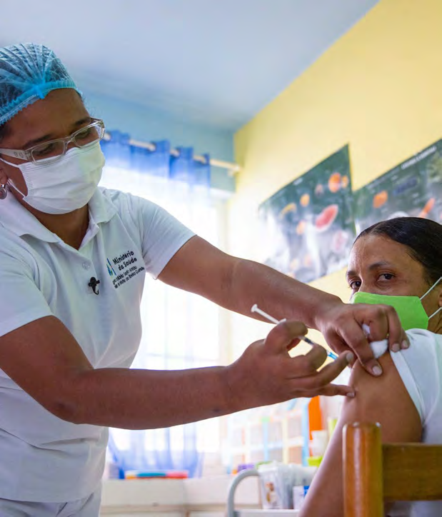

**Image 2 OCR + Description:**
```
**Image Description:**
The image shows a simple graphic of a turned page corner, typically representing a page being flipped or a page curl. The background is entirely black, while the page curl itself is white or light gray with shading that gives it a three-dimensional appearance. There is no text or other key elements visible in this image. This type of graphic is often used in documents, presentations, or reports to symbolize turning to the next page or to indicate additional content.
```


## Page 25
jf!!!!"!!!!46B*+$'.#*D'"&*@""'75*>/0%$#*KTKK
@:%'#*X[*0/$(/"#*%<*#%#75*EYa!?WI[W$/57#/&*#$'.#*<'"&*
(%22)#2/"#.*,7.*-%"/*#%*(%'"#$)/.*07$#)()07#)"-*)"*
#,/* ?/:#* G/$;)(/* G'.0/".)%"* !")#)7#);/* e?GG!f1* 7"&*
7"%#,/$* IT* 0/$(/"#* #%* "%"W07$#)()07#)"-* /5)-):5/*
(%'"#$)/.H* !")#)7#/&* :=* #,/* 4%$5&* 67"8* 7"&* #,/*
!"#/$"7#)%"75* F%"/#7$=* D'"&* e!FDf* )"* KTKT1* #,/*
?GG!* 755%V/&* 07$#)()07#)"-* (%'"#$)/.* #%* #/20%$7$)5=*
.'.0/"&* &/:#W./$;)(/* 07=2/"#.* %<* dIKH[* :)55)%"* #%*
#,/)$*%O)()75*($/&)#%$.*#%*(%"(/"#$7#/*#,/)$*$/.%'$(/.*
%"*$/.0%"&)"-*#%*#,/*07"&/2)(HQ
+,/* )XaR! -VTV]X[XTR! ,V\KcKRb! d)-,e! &PQNR! ,QTU*
,7.* ://"* 7(#);/* &'$)"-* #,/* 07"&/2)(1* 0$%;)&)"-*
;)$#'75*#/(,")(75*7..).#7"(/*7"&*#$7)")"-*7(#);)#)/.H*@*
<%('.*%"*&/:#*#$7".07$/"(=*,7.*://"*.#$/"-#,/"/&*
#,$%'-,* "/V* 7(#);)#)/.* $/57#/&* #%* $/0%$#)"-* 7"&*
2%")#%$)"-* %<* 0':5)(* &/:#* 7"&* <).(75* $).8.H* E$).).W
$/5/;7"#* .'00%$#* ,7.* )"(5'&/&* #/(,")(75* 7..).#7"(/*
%"*27"7-)"-*&/:#W$/57#/&*(%"#)"-/"#*5)7:)5)#)/.*7"&*
0$%;)&)"-* c'.#W)"W#)2/* .'00%$#* #%* 7&&$/..* ($)#)(75*
"//&.*%<*?FD*(%'"#$)/.H
54$%2!,'(-!&'*2&!,*%)!'/,('-2
+,/*#$7".)#)%"*%<*#,/*4%$5&*67"8*#$'.#*<'"&*0%$#<%5)%*
#%V7$&*:/##/$*<%('./&1*2%$/*(%".%5)&7#/&*L2:$/557*
KHT*]$%-$72.1*.#7$#)"-*)"*KTKT1*,7.*<7()5)#7#/&*7*2%$/*
$70)&* $/.0%"./* #,7"* 2)-,#* %#,/$V)./* ,7;/* ://"*
#,/*(7./H*@*#%#75*%<*JP*L2:$/557*KHT*]$%-$72.*,7;/*
$/.0%"&/&* #%* #,/* EYa!?WI[* ($).).* V)#,* "/V* -$7"#W
5/;/5*(%22)#2/"#.*%<*dIHT[*:)55)%"*#,$%'-,*#,/*/"&*
%<*D`KTKK1*(%55/(#);/5=*$/0$/./"#)"-*XQ*0/$(/"#*%<*#,/*
#%#75*#$'.#*<'"&*$/.0%"./H
G%2/*
0$%-$72.*
.#$/725)"/&*
-$7"#W278)"-*
0$%(/../.* #%* 278/* ($).).* $/(%;/$=* <'"&.* 7;7)57:5/*
#%* )205/2/"#)"-* 07$#"/$.* 7.* b')(85=* 7.* 0%..):5/H*
+,/=*75.%*0);%#/&*/Z).#)"-*-$7"#.*#%*7&&$/..*(5)/"#._*
2%.#* )22/&)7#/* "//&.H* +,/./* 7&c'.#2/"#.* ,7;/*
/"7:5/&* 0$%-$72.* #%* <$//* '0* $/.%'$(/.* #%* .'00%$#*
#,/)$* EYa!?WI[* $/.0%"./.* 7"&* &/5);/$* %"* #,/* 2%.#**
0$/..)"-*0$)%$)#)/.H*
D%$*/Z7205/1*#,/**[aPXccV!,V\KcKRb!SMP!&PVUX!d*,&e!
/.#7:5).,/&* 7* <7.#W#$7(8* /";/5%0/* #%* $/.0%"&* #%*
'$-/"#1* '"7"#)()07#/&* $/b'/.#.* <$%2* (%'"#$=* #/72.*
<%$*:%#,*%"-%)"-*7"&*"/V*7(#);)#)/.H*+,/*/^RPV\RKWXN!
5cMaVc! 1PM]PV[[VRK\! 2QYYMPR! d/512e* 0$%-$72*
)"($/7./&*)#.*$/5)7"(/*%"*)"W(%'"#$=*(%".'5#7"#.*7"&*
$/2%#/*#%%5.*7"&*7(#);)#)/.*#%*(%"&'(#*&7#7*(%55/(#)%"*
7"&* <%55%VW'0* )"#/$;)/V.* ;)7* /27)51* 0,%"/* (755.1*
7"&*;)$#'75*2//#)"-.H*+,/*2%;/*#%*;)$#'751*)"#/$"/#W
:7./&*(%22'")(7#)%".*75.%*($/7#/&*%00%$#'")#)/.*#%*
)"#$%&'(/*"/V*5/;/5.*%<*5/7$")"-*72%"-*:/"/<)()7$)/.*
V)#,*0$/;)%'.5=*5%V*5/;/5.*%<*&)-)#75*5)#/$7(=H
Y<*
07$#)('57$*
"%#/1*
#,/*
.XVcRL!
/[XP]XT\b!
1PXYVPXUTXNN! VTU! 'XNYMTNX! d./1'e! 1PM]PV[B!
V,)(,* #,/* 67"8* /.#7:5).,/&* )"* ^'"/* KTKT1* ).* "%V*
#,/* #,)$&* 57$-/.#* L2:$/557* KHT* ]$%-$72* e7o/$* @>+D*
7"&*B5%:75*D)"7"()"-*D7()5)#=f*)"*#/$2.*%<*700$%;/&*
-$7"#* 72%'"#.* <%$* EYa!?WI[* $/57#/&* 7(#);)#)/.**
#,$%'-,* ^'"/* JT1* KTKK* eD)-'$/* KHPfH* +,/* 67"8*
/.#7:5).,/&*#,/*jN]>*0$%-$72*#%*0$%;)&/*'0.#$/72*
7"&*(7#75=#)(*<'"&)"-*#%*,/50*(%'"#$)/.*0$/07$/*7"&*
$/.0%"&* #%* /2/$-)"-* ,/75#,* /2/$-/"()/.H* 6=* #,/*
/"&*%<*D`KTKK1*jN]>*,7&*./('$/&*%;/$*dKIP*2)55)%"*
)"*&%"%$*(%"#$):'#)%".*7"&*(%22)##/&*dRX*2)55)%"*#%*
KP*(%'"#$=*7"&*$/-)%"75*$/()0)/"#.1*V)#,*PS*0/$(/"#**
%<* -$7"#* 755%(7#)%".* #%* 7&&$/..* #,/* EYa!?WI[*
07"&/2)(*7"&*SX*0/$(/"#*#%*0$/07$/*:/##/$*<%$*<'#'$/*
,/75#,*/2/$-/"()/.H
Y#,/$*27c%$*#$'.#*<'"&.*(%"#$):'#)"-*#%*#,/*EYa!?WI[*
$/.0%"./1* )"* 7&&)#)%"* #%* L2:$/557* KHT* ]$%-$72.1*
)"(5'&/*#,$//*D!DW.'00%$#/&*0$%-$72.*<%$*V,)(,*#,/*
4%$5&*67"8*7(#.*7.*%"/*%<*#,/*)205/2/"#)"-*/"#)#)/.*
e#,/*B5%:75*]7$#"/$.,)0*<%$*N&'(7#)%"1*#,/*]7"&/2)(*
N2/$-/"(=* D)"7"()"-* D7()5)#=1* 7"&* #,/* B5%:75*
E%"(/..)%"75* D)"7"()"-* D7()5)#=f* 7"&* %#,/$* #$'.#W
<'"&/&*0$%-$72.1*.'(,*7.*#,/*4/.#*67"8*7"&*B7M7*
F'5#)W&%"%$* +$'.#* D'"&H* +,/* #%0* ./;/"* 0$%-$72.1*
5/&* :=* #,/* @>+D1* ,7;/* 7((%'"#/&* <%$* RS* 0/$(/"#* %<*
#$'.#* <'"&* -$7"#* (%22)#2/"#.* #%* EYa!?WI[* $/57#/&*
7(#);)#)/.*.)"(/*#,/*07"&/2)(*.#$'(8*eD)-'$/*KHPfH
Q**D%$*2%$/*)"<%$27#)%"*%"*#,/*?/:#*G/$;)(/*G'.0/".)%"*!")#)7#);/1*.//*C++5(2YY<<<:<.'-)/0*F:.'>Y$*Y+.5"#Y)$/+Y/'"$VY#.I")L9NL)$/+L
($'I"#$L(;(5$*(".*L"*"+"0+"I$:


## Page 26
KH*E%"#$):'#)"-*#%*#,/*EYa!?WI[*E$).).*>/.0%"./!!!!"!!!!ji
Figure 2.5. Top Seven Trust Fund Programs Funding COVID-19 Activities,  
Percent Share by Volume of Grants, FY2020–2022
j:j!$,+!&PQNR!,QTUN
!DE1*V)#,*#,/*.'00%$#*%<*07$#"/$W<'"&/&*#$'.#*<'"&.1*
(%"#)"'/&* #%* 0$%;)&/* 57$-/W.(75/* EYa!?WI[* $/5)/<*
<)"7"()"-*)"*D`KTKK*7"&*&/5);/$/&*7&;).%$=*./$;)(/.*
#7)5%$/&* #%* 7&&$/..* /(%"%2)(* (,755/"-/.* &$);/"* :=*
#,/*,/75#,*($).).H*!DE_.*$/5)/<*<)"7"()"-*0$%;)&/.*(5)/"#.*
V)#,*/../"#)75*5)b')&)#=*.'00%$#*)"*#)2/.*%<*;%57#)5)#=*
7"&*'"(/$#7)"#=H*!#*).*<%('./&*%"*#,$//*(%205/2/"#7$=*
7$/7.C*$/5)/<1*$/.#$'(#'$)"-1*7"&*$/.)5)/"#*$/(%;/$=H*!DE*
<)"7"()"-* 07(87-/.* 0$)27$)5=* #7$-/#* #,/* 057(/.* 7"&*
0/%05/*V,/$/*)#*).*"//&/&*2%.#1*%o/"*(%205/2/"#/&*
V)#,*7&&)#)%"75*<'"&.*2%:)5)M/&*<$%2*%#,/$*.%'$(/.H*
\7'"(,/&*)"*KTKT1*!DE_.*D7.#W+$7(8*EYa!?WI[*D7()5)#=*
,7.*)"($/7./&*#%*dRHX*:)55)%"H*+,/*)")#)7#);/*)"(5'&/.*
7*67./*%<*#,/*]=$72)&*]$%-$721*%O/$)"-*7&&)#)%"75*
.'00%$#*#%*#,/*0%%$/.#*7"&*#,%./*,7$&/.#*,)#*:=*#,/*
07"&/2)(1* V,)(,* 57'"(,/&* 7#* dSTT* 2)55)%"* )"* KTKI*
7"&*$/(/);/&*7"*7&&)#)%"75*dKTT*2)55)%"*)"*KTKKH*+,/*
!"#$%&'()%&*+,-.&()/0-)'.&*
1/0()*20&34*!!"#$
56.7%6*8%/)&,/($'9*"./*
:30-%)'.&4*%#"%$
!"#$%
&'((')*
;./63*<%&=
1/0()>20&3,3
?.@@')@,&)(
56.7%6*2'&%&-'&#*
2%-'6')A4*%%"&$
56.7%6*?.&-,(('.&%6*
2'&%&-'&#*2%-'6')A4*'"($
B,%6)$*:@,/#,&-A*
8/,9%/,3&,((*C*+,(9.&(,4*
("!$
8%&3,@'-*:@,/#,&-A*
2'&%&-'&#*2%-'6')A4*!"#$
;,()*<%&=*%&3*5%D%4*'"%$
E)$,/*8/.#/%@(4*
%(")$
D7()5)#=*0$%;)&/&*dQHS*:)55)%"*#%*<)"7"(/*ITJ*0$%c/(#.*
0$%;)&)"-* 5)b')&)#=1* V%$8)"-* (70)#751* 7"&* #$7&/*
<)"7"()"-*#%*8//0*(%207")/.*)"*:'.)"/..1*/.0/()755=*
)"*#,/*)"&'.#$)/.*2%.#*7O/(#/&*:=*EYa!?WI[H*
4,)5/* $%:'.#* ;7(()"7#)%"* (7207)-".* 7$/* '"&/$V7=*
)"*.%2/*$/-)%".1*G%'#,*@.)7*7"&*G':WG7,7$7"*@<$)(7*
"//&* ,/501* 7"&* !DE* .,7$0/"/&* )#.* <%('.* %"* #,/./*
$/-)%".* V,/$/* #,/* "//&* ).* #,/* -$/7#/.#* #%* 0$%;)&/*
)";/.#2/"#* 7"&* 7&;).%$=* V%$8H* 4)#,* .'00%$#* <$%2*
&/;/5%02/"#* 07$#"/$.1* !DE* 0$%;)&/&* 7* pXTTW2)55)%"*
5%"-W#/$2*<)"7"()"-*07(87-/*<%$*4NYXT!1LVP[V\VPX!
.McUKT]N!
6K[KRXUB*
7*
5/7&)"-*
0,7$27(/'#)(75*
(%207"=* )"* G%'#,* @<$)(71* #%* :%%.#* 0$%&'(#)%"* %<*
;7(()"/.*7"&*%#,/$*#,/$70)/.*)"*@<$)(7"*7"&*/2/$-)"-*
27$8/#.H* i/V* 7-$//2/"#.* V)#,* G/"/-75_.* !".#)#'#*
]7.#/'$* ?787$* 7"&* #,/* >V7"&7* ?/;/5%02/"#*
6%7$&* V)55* <'$#,/$* )"($/7./* ;7(()"/* 0$%&'(#)%"**
7($%..*@<$)(7H


## Page 27
jq!!!!"!!!!46B*+$'.#*D'"&*@""'75*>/0%$#*KTKK
!"* G%'#,* @.)71* 7* dJT* 2)55)%"* <)"7"()"-* 07(87-/* V)55*
7..).#* !"&)7_.* >KM/* )"* /Z07"&)"-* )#.* .'005=* %<* 5%VW
0$)(/&1*-/"/$)(*;7(()"/.*<%$*#,/*$%'#)"/*)22'")M7#)%"*
%<* (,)5&$/"H* !DE* ).* V%$8)"-* )"* -VLVPVNLRPV! 2RVRXB*
!"&)71* %"/* %<* #,/* V%$.#W7O/(#/&* .#7#/.* &'$)"-* #,/*
EYa!?WI[*($).).1*#%*:$)"-*"/V*0$);7#/*)";/.#2/"#*7"&*
7&;)(/*#%*#,/*,%.0)#75*./(#%$H*>'4+!>VTJB*#,/*57$-/.#*
5/"&/$* #%* #,/* .2755* 7"&* 2/&)'2* /"#/$0$)./* eGFNf*
./(#%$*)"*67"-57&/.,*$/(/);/&*!DE*.'00%$#*7"&*#$'.#W
<'"&/&*7&;).%$=*./$;)(/.*#%*.#$/"-#,/"*)#.*7:)5)#=*#%*
5/"&*#%*GFN*(5)/"#.H
+,/*07"&/2)(*.,7$0/"/&*%'$*<%('.*
%"*#,/*'$-/"#*"//&*<%$*7O%$&7:5/*7"&*
('##)"-W/&-/*,/75#,(7$/*<7()5)#)/.1*7"&*
b'75)#=*27"0%V/$*#%*27"7-/*#,/2H*
+,$%'-,*#,/*]]]*700$%7(,1*V/*(7"*
7(,)/;/*:%#,H
HC'"%H;/C0(C%4$(0"K%U.*.'0/-$%A"*"(+$'K%?*);(+'"$(K%
A"*$(%0*)%A0'0+C"%J0*>;0>$%4$50'+6$*+K%?*)"0%
?$7V)"-* %"* )#.* dS* :)55)%"* 5cMaVc! .XVcRL! 1cVRSMP[B!
!DE*75.%*)"($/7./&*#,/*&/5);/$=*%<*;7(()"/.1*0/$.%"75*
0$%#/(#);/*
/b')02/"#1*
7"&*
2/&)(75*
.'005)/.*
#,$%'-,%'#*/2/$-)"-*27$8/#*/(%"%2)/.H*!"*D/:$'7$=*
KTKK1* #,/* 057#<%$2* V7.* /Z#/"&/&* <%$* 7"* 7&&)#)%"75*
%"/*7"&*7*,75<*=/7$.H*!DE_.*)";/.#2/"#*0)0/5)"/*<%$*#,/*
057#<%$2*#%#75/&*dRJQ*2)55)%"*7#*#,/*/"&*%<*D`KTKKH*
!"*&/;/5%0)"-*#,/*)";/.#2/"#*0)0/5)"/1*!DE*$/5)/&*%"*
$70)&* .'00%$#* <$%2* ./;/$75* &/;/5%02/"#* 07$#"/$.*
#%* )205/2/"#* 7&;).%$=* 7"&* '0.#$/72* 7(#);)#)/.H* +%*
&7#/1* !DE* ,7.* )";/.#/&* d[RTHP* 2)55)%"* <$%2* )#.* %V"*
7((%'"#*)"*7&&)#)%"*#%*dPQPHX*2)55)%"*2%:)5)M/&*<$%2*
%#,/$.H* +,).* <)"7"()"-* 0$%;)&/&* "//&/&* 2/&)(75*
)"<$7.#$'(#'$/* 7"&* ./$;)(/.1* V,)(,* V)55* (%"#)"'/* #%*
./$;/*#,/)$*#7$-/#*0%0'57#)%".*5%"-*7o/$*#,/*EYa!?WI[*
($).).*.':.)&/.H*
!DE* V7.* 7:5/* #%* 7&70#* )#.* &/5);/$=* 2%&/.* 7"&*
(%"#)"'/*#%*0$%;)&/*)";/.#2/"#*7"&*7&;).%$=*./$;)(/.*
#,$%'-,%'#* #,/* EYa!?WI[* ($).).H* +/72.* %;/$(72/*
#$7;/5*$/.#$)(#)%".*:=*2%;)"-*#%*;)$#'75*%'#$/7(,*7"&*
&/5);/$=* 057#<%$2.1* )"(5'&)"-* 0)5%#)"-* ;)$#'75* $/75)#=*
7../..2/"#.*7"&*%#,/$*)""%;7#);/*700$%7(,/.H*+,/*
<%('.*%"*;)$#'75*7"&*$/2%#/*(%".'5#7#)%"*,7.*.0'$$/&*
(5)/"#.* #%* 7&%0#* &)-)#75* .%5'#)%".* #,7#* V)55* <7()5)#7#/*
<'#'$/*/"-7-/2/"#H*
D%$* /Z7205/1* V)#,* #,/* .'00%$#* %<* &/;/5%02/"#*
07$#"/$.1* #,/* !DE* 7&;).%$=* ./$;)(/.* #/72* )"* Eq#/*
&_!;%)$/*
)205/2/"#/&*
#,/*
X1LbRM!
XcX\RPMTK\!
YcVRSMP[B! V,)(,* 278/.* #$7&/* )"* 057"#* 0$%&'(#.*
.7</$1*<7.#/$1*7"&*(,/70/$*:/#V//"*Eq#/*&_!;%)$/*7"&*
6'$8)"7*D7.%1*7"&*,7.*$/7(,/&*%'#*#%*$/0$/./"#7#);/.*
<$%2*#,/*-$7)"1*.//&1*7"&*7-$)('5#'$75*./(#%$.*)"*%#,/$*
(%'"#$)/.1*.'(,*7.*U/"=71*F/Z)(%1*7"&*L-7"&7H*
j:k!,KTVT\KVc!$TRXP[XUKVPb!,QTUN
+,/* $/.0%"./* %<* #,/* )"#/$"7#)%"75* &/;/5%02/"#*
(%22'")#=*#%*#,/*EYa!?WI[*07"&/2)(*,7.*:/"/<)##/&*
-$/7#5=*<$%2*#,/*57$-/W.(75/*(%"#$):'#)%".*%<*,/75#,W
$/57#/&* D!D.* #%* .7;/* 5);/.* 7"&* 0$%#/(#* #,/* 2%.#*
;'5"/$7:5/H* D!D.* ,7;/* (%"#$):'#/&* "%#* %"5=* #%* #,/*
)22/&)7#/*($).).*$/.0%"./*:=*&/5);/$)"-*;7(()"/.*7"&*
%#,/$*,/75#,*.'005)/.*#%*2)55)%".*%<*0/%05/*7$%'"&*#,/*
V%$5&1*:'#*75.%*#%*.#$/"-#,/")"-*,/75#,*.=.#/2.*7"&*
/",7"()"-*0$/07$/&"/..*<%$*<'#'$/*07"&/2)(.H*+,/*
4%$5&* 67"8* 0$%;)&/.* )"&).0/".7:5/* 7&2)").#$7#);/1*
%0/$7#)%"751* 5/-751* 7"&* <)"7"()75* ./$;)(/.* #%* #,/*
<%55%V)"-* D!D.1* V,)(,* 7$/* 278)"-* )20%$#7"#*
(%"#$):'#)%".*#%*EYa!?WI[*,/75#,*$/.0%"./.H
&LX!
+MVcKRKMT!
SMP!
/YKUX[K\!
1PXYVPXUTXNN!
$TTMWVRKMTN! d+/1$e1* <%$* V,)(,* #,/* 4%$5&* 67"8* ,7.*
./$;/&*7.*7*5)2)#/&*#$'.#//*.)"(/*)#*V7.*/.#7:5).,/&*
)"* KTIR1* 57'"(,/&* 7* (/"#$75)M/&* 57:* "/#V%$81* %0/"*
#%* 755* EYa!?WI[* ;7(()"/* &/;/5%0/$.1* #%* .#7"&7$&)M/*
#,/*/;75'7#)%"*%<*EYa!?WI[*;7(()"/*(7"&)&7#/.*7"&*
)&/"#)<=* #,/* 2%.#* .'((/..<'5* 0%#/"#)75* ;7(()"/.H* @55*
EN]!*&/;/5%02/"#*07$#"/$.*,7;/*7-$//&*#%*/b')#7:5/*
7((/..*0$)"()05/.1*7"&*#,/*EYa!?WI[*a7(()"/.*B5%:75*
@((/..* eEYa@rf* <7()5)#=* ,7.* 27&/* 2'5#)05/* EN]!W
.'00%$#/&*;7(()"/.*7((/..):5/*#%*#,/*V%$5&H*EN]!*,7.*
)")#)7#/&* &/;/5%02/"#* %<* "/Z#W-/"/$7#)%"* ;7(()"/.*
7-7)".#*EYa!?WI[*;7$)7"#.*7"&*).*057"")"-*.#'&)/.*%"*
#,/*&'$7:)5)#=*%<*)22'")#=*7"&*;7(()"/*/O/(#);/"/..H*


## Page 28
KH*E%"#$):'#)"-*#%*#,/*EYa!?WI[*E$).).*>/.0%"./!!!!"!!!!jZ
&LX!$TRXPTVRKMTVc!,KTVT\X!,V\KcKRb!SMP!$[[QTKtVRKMT!
d$,,$[e* )..'/.* ;7(()"/* :%"&.* )"* (70)#75* 27$8/#.*
e:7(8/&* :=* :)"&)"-* 05/&-/.* <$%2* &%"%$* (%'"#$)/.f*
#,7#*0$%;)&/*)22/&)7#/*<'"&)"-*<%$*B7;)1*#,/*a7(()"/*
@55)7"(/1* #%* 0'$(,7./* 7"&* &).#$):'#/* ;7(()"/.H* 4)#,*
#,/* 4%$5&* 67"8* ./$;)"-* 7.* #$/7.'$=* 27"7-/$* #%*
/"7:5/*#,/./*#$7".7(#)%".1*!DD!2*,7.*057=/&*7*($)#)(75*
$%5/*.)"(/*#,/*.#7$#*%<*#,/*07"&/2)(*)"*<$%"#5%7&)"-*
&%"%$*05/&-/.*#%*,/50*<'"&*#,/*0'$(,7./*%<*EYa!?WI[*
;7(()"/.H*!DD!2*0$%;)&/&*dQRT*2)55)%"*#%*B7;)*)"*KTKI*
<%$*#,/*EYa@r*@FE*<7()5)#=*#%*0'$(,7./*;7(()"/.*<%$*[K*
%<*#,/*V%$5&_.*0%%$/.#*(%'"#$)/.1*7"&*7*<'$#,/$*dI[P*
2)55)%"*)"*^7"'7$=*KTKKH*!DD!2*V7.*7:5/*#%*0$%;)&/*
#,/./* <'"&.* :=* '"&/$#78)"-* )#.* 57$-/.#W/;/$* :%"&*
)..'7"(/*0$%-$72C*7*dQPT*2)55)%"*;7(()"/*:%"&*)..'/&*
)"*@0$)5*KTKI*7"&*/Z07"&/&*:=*7*<'$#,/$*dKPT*2)55)%"*
)"*i%;/2:/$*KTKIH*
+,/*4%$5&*67"8*).*75.%*#,/*5)2)#/&*#$'.#//*%<*#,/*5cMaVc!
,QTUB* V,)(,* .'00%$#.* 0$%-$72.* )"* 2%$/* #,7"* ITT*
(%'"#$)/.*#%*7((/5/$7#/*#,/*/"&*%<*@!?G1*#':/$('5%.).1*
7"&*2757$)7*7.*/0)&/2)(.H*+%*,/50*(%'"#$)/.*$/.0%"&*
#%* EYa!?WI[1* #,/* B5%:75* D'"&* ,/50/&* /.#7:5).,* #,/*
@((/..*#%*EYa!?WI[*+%%5.*@((/5/$7#%$*e@E+W@f*7"&*"%V*
(%W5/7&.*)#.*j/75#,*G=.#/2.*7"&*>/.0%"./*E%""/(#%$*
ejG>Ef*V)#,*#,/*4jY1*Li!END1*7"&*#,/*4%$5&*67"81*
V)#,* .'00%$#* <$%2* #,/* B5%:75* D)"7"()"-* D7()5)#=H*
+,/* jG>E* ).* .'00%$#)"-* 07$#"/$* %$-7")M7#)%".* 7"&*
(%'"#$)/.* #%* /",7"(/* #,/* '0#78/* %<* EYa!?WI[* #%%5.*
e&)7-"%.#)(.1*#,/$70/'#)(.1*7"&*;7(()"/.f*:=*,/50)"-*
#,/2* )&/"#)<=* -70.1* (%%$&)"7#)"-* V)#,* 07$#"/$.* #%*
7&&$/..* )&/"#)<)/&* "//&.1* 7"&* 2%")#%$)"-* (%'"#$=*
0$%-$/..*7-7)".#*-5%:75*#7$-/#.H
KUDJO KAGLAN / WORLD BANK


**Image 1 OCR + Description:**
```
**Image Description:**
The image shows a medical or healthcare setting with a person, possibly a healthcare worker, wearing a white lab coat and a face mask, standing on the left side. The individual is focused on handling some items on a counter or table. 

Key elements in the image:
- The person is positioned near a window with blue curtains allowing natural light to illuminate the room.
- On the right side of the surface, there is a large gray cooler box with a black and red strap and a red label partially visible, possibly for storing vaccines or medical supplies.
- On the counter, there are various items including a container holding cotton balls and a pump dispenser bottle.
- The walls are light yellow and light blue.
- There are two posters on the yellow wall with images of food items or dishes.
- A white door is visible on the right side of the image, with a calendar or chart attached to it.
- Behind the healthcare worker, a sink with soap dispensers is visible near the window.

No explicit text is fully visible or legible aside from some partial writing on the cooler box and labels on the pump bottle. The overall layout suggests this is a clinical or vaccination environment aimed at healthcare service delivery.
```
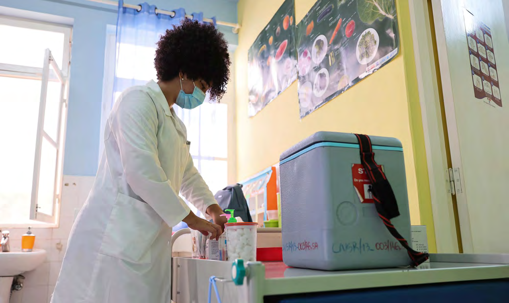

**Image 2 OCR + Description:**
```
**Image Description:**
The image shows a design element resembling a page corner being peeled or curled up from the top right of the page. The page itself is white, and the curled corner reveals a grayish shade underneath, indicating the back of the page. The background beyond the page is black, making the curled corner and the page stand out prominently. 

There is no text or other elements visible in this image; it appears to be a stylized graphic likely used as a decorative or transitional feature in the layout of a report or document.
```


## Page 29
kn!!!!"!!!!46B*+$'.#*D'"&*@""'75*>/0%$#*KTKK
%/E!,$,!,('!14%)/-$+!1'/0/%&$(%B!
1'/14'/)%/22!4%)!'/21(%2/
+,/* EYa!?WI[* 07"&/2)(* ,7.* &/2%".#$7#/&* #,7#*
)";/.#)"-*)"*0$/;/"#)%"1*0$/07$/&"/..1*7"&*$/.0%"./*
e]]>f*).*7*-5%:75*0':5)(*-%%&*#,7#*:/"/<)#.*/;/$=*"7#)%"1*
$/-7$&5/..*%<*)"(%2/H*4,)5/*/;/$=*(%'"#$=*"//&.*#%*
)";/.#*2%$/*#%*0$/07$/*<%$*#,/*"/Z#*07"&/2)(1*5%VW
)"(%2/* 7"&* .%2/* 5%V/$* 2)&&5/W)"(%2/* (%'"#$)/.*
V)55*"//&*7&&)#)%"75*$/.%'$(/.1*)"(/"#);/.*#%*)";/.#1*
7"&* (707()#=* .#$/"-#,/")"-* #%* )205/2/"#* ]]>*
7(#)%".H* !"* D`KTKK1* &%"%$.* 700$%7(,/&* #,/* 4%$5&*
67"8*#%*/.#7:5).,*7*"/V*D!D*#%*0$%;)&/*]]>W$/57#/&*
.'00%$#*#%*(%'"#$)/.*7"&*$/-)%".1*7.*07$#*%<*:$%7&/$*
/O%$#.*7)2/&*7#*.#$/"-#,/")"-*-5%:75*,/75#,*./('$)#=H*
+,/*"/V*D!D1*700$%;/&*:=*#,/*4%$5&*67"8_.*6%7$&*%"*
^'"/*JT1*KTKK1*V)55*(%205/2/"#*#,/*V%$8*%<*/Z).#)"-*
)".#)#'#)%".* #,7#* 0$%;)&/* )"#/$"7#)%"75* <)"7"()"-* <%$*
]]>* 7"&* )"<%$2* #,/* ,/75#,W<)"7"(/* (%%$&)"7#)%"*
V%$8*%<*#,/*BKT*j/75#,*7"&*D)"7"(/*+7.8*D%$(/*7)2/&*
7#* .#$/"-#,/")"-* #,/* :$%7&/$* ,/75#,* 7$(,)#/(#'$/1*
.#7"&7$&.1*7"&*-5%:75*-%;/$"7"(/*7$$7"-/2/"#.H*
j:I!2RMPKXN!SPM[!+MQTRPKXN
D$%2*#,/*;/$=*<)$.#*&7=.*%<*#,/*EYa!?WI[*07"&/2)(1*
#$'.#W<'"&/&* 0$%-$72.* ,7;/* ,/50/&* #,/* 4%$5&*
67"8* B$%'0* &/5);/$* %"* <%'$* 0$)%$)#=* &/;/5%02/"#*
%'#(%2/.H* +,/* <%55%V)"-* .#%$)/.* <$%2* #,/* 4%$5&*
67"8*7"&*!DE*&/2%".#$7#/*#,/*;7$)/#=*%<*V7=.*#$'.#*
<'"&.*7$/*(%"#$):'#)"-H*+,/=*7$/*<'$#,/$*/Z07"&/&*)"**
#,/*7877%Z$0'/..F%.V%1';(+LV;*)$)%B$(;-+(:
240$%5!6$0/2
+MTSPMTRKT]!RLX![QcRKYPMT]XU!X`X\RN!MS!+(0$)?#Z!
KT!2MQRL!4NKV:*!DE*.'00%$#/&*6>@E*67"81*#,/*57$-/.#*
5/"&/$*#%*#,/*GFN*./(#%$*)"*67"-57&/.,1*#%*.#$/"-#,/"*
)#.*.2755*:'.)"/..*%0/$7#)%".*7"&*$).8*27"7-/2/"#*
<$72/V%$8*.%*#,7#*)#*(7"*(%"#)"'/*#%*0$%;)&/*5%7".*#%*
GFN*(5)/"#.H*!"*F7,7$7.,#$7*G#7#/1*!"&)71*!DE*).*,/50)"-*
#%* .#$'(#'$/* 7"&* )205/2/"#* ,%.0)#75* 0':5)(W0$);7#/*
07$#"/$.,)0.1* V,)(,* V)55* :$)"-* )"* ($'()75* 0$);7#/*
)";/.#2/"#H*!DE*,7.*.)-"/&*27"&7#/.*#%*:')5&*#,$//*
#/7(,)"-* ,%.0)#75.* )"* F7,7$7.,#$7* #%* #$7)"* ,/75#,*
.0/()75).#.* 7"&* 0$%;)&/* 2%$/* (707()#=* <%$* ,%.0)#75*
(7$/H* !"* 67"-57&/.,1* !DE* ).* 75.%* V%$8)"-* #%* )20$%;/*
0%5)(=*(%%$&)"7#)%"*7"&*$/-'57#)%".*<%$*;7(()"/*(%5&*
(,7)"*7"&*5%-).#)(.*7"&*<7()5)#7#)"-*#,/*/.#7:5).,2/"#*
%<*#/20/$7#'$/W(%"#$%55/&*5%-).#)(.*7"&*V7$/,%'.)"-H
1'(&/+&$%5!&./!1(('!4%)!
-(2&!0*6%/'4>6/
>MMNRKT]!cKWXcKLMMUN!KT!>VT]cVUXNL:!+,/*67"-57&/.,*
j'27"*E70)#75*@((/5/$7#)%"*]$%-$721*V,)(,*0$)%$)#)M/.*
#,/*$/(%;/$=*%<*,'27"*(70)#75*5%../.*<$%2*#,/*EYa!?WI[*
($).).1*$/(/);/&*dIHJK*2)55)%"*<$%2*#,/*.Q[VT!+VYKRVc!
*[aPXccV! 1PM]PV[:* !#* ,7.* ,/50/&* #,/* 4%$5&* 67"8*
V%$8*V)#,*2'5#)05/*-%;/$"2/"#*7-/"()/.*#%*)"#$%&'(/*
/(%"%2)(*)"(5'.)%"*(%20%"/"#.*#%*27c%$*(7.,*#$7".</$*
0$%-$72.H*+,/*7"75=#)(75*%'#0'#.*,7;/*75.%*)"<%$2/&*#,/*
&/.)-"*%<*#V%*!?@*)";/.#2/"#*0$%c/(#.C*#,/*$/.#$'(#'$)"-*
%<*#,/*dJTT*2)55)%"*E7.,*+$7".</$*F%&/$")M7#)%"*]$%c/(#*
7"&*7*<%55%VW'0*#%*#,/*!"(%2/*G'00%$#*]$%-$72*<%$*#,/*
]%%$/.#*]$%c/(#H
2QYYMPRKT]! [K]PVTRN! VTU! PXSQ]XXN! KT! +McM[aKV:*
B$7"#* <)"7"()"-* <$%2* #,/* 2RVRX! VTU! 1XV\XaQKcUKT]!
,QTU! d21,e! ).* .'00%$#)"-* #,/* 0$%;).)%"* %<* (7.,*
#$7".</$.* #%* ;'5"/$7:5/* 2)-$7"#.* 7"&* a/"/M'/57"*
$/<'-//.* e"%#* (%;/$/&* :=* -%;/$"2/"#* 0$%-$72.f* #%*
$/&'(/*#,/*.0$/7&*%<*EYa!?WI[*7"&*/7./*#/".)%".*V)#,*
,%.#* (%22'")#)/.H* +,/* (7.,* #$7".</$* (%20%"/"#* %<*
#,).*0$%c/(#*).*:/)"-*)205/2/"#/&*#,$%'-,*#,/*4%$5&*
D%%&* ]$%-$722/* %"* :/,75<* %<* #,/* -%;/$"2/"#1**
V,)5/* 7* 67"8W/Z/('#/&* (%20%"/"#* ).* ,/50)"-* #%*
.#$/"-#,/"*#,/*)".#)#'#)%"75*<$72/V%$8*<%$*E%5%2:)7_.*
EYa!?WI[* /2/$-/"(=* $/.0%"./1* 2)#)-7#)"-* /Z(5'.)%"*
7"&*Z/"%0,%:)7H
.XcYKT]!N[Vcc!aQNKTXNNXN!V\\XNN!\PXUKR!KT!/RLKMYKV:!
]$)%$* #%* #,/* EYa!?WI[* 07"&/2)(1* #,/* N#,)%0)7"*
<)"7"()75* ./(#%$* V7.* (5%./&1* ,)-,5=* $/-'57#/&1* 7"&*
(%20$)./&* %<* c'.#* IR* (%22/$()75* :7"8.H* +,/* ./(#%$*
<7(/&*<%$/)-"*/Z(,7"-/*(%".#$7)"#.*7"&*#)-,#*5)b')&)#=*
(%"&)#)%".1* 5/7;)"-* 5)##5/* $%%2* <%$* :7"8.* #%* 27"7-/*
57$-/*V)#,&$7V75.*%$*.,%(8.1*7"&*0$/;/"#)"-*#,/*./(#%$*
<$%2* $/.0%"&)"-* #%* 27$8/#* &/27"&.* <%$* ($/&)#H* !DE*
57'"(,/&* #,/* EYa!?WI[* '2:$/557* 0$%c/(#* )"* KTKT* #%*


## Page 30
KH*E%"#$):'#)"-*#%*#,/*EYa!?WI[*E$).).*>/.0%"./!!!!"!!!!k#
B'7$7"#//)"-*#,/*.7</#=*7"&*0$);7(=*
%<*.'$;/=*$/.0%"&/"#.*:=*2/7".*%<*
)"&)$/(#*0$%Z=*b'/.#)%".1*07$#)('57$5=*
5).#*$7"&%2)M7#)%"*7"&*;)-"/##/.1*,7.*
://"*7"*)20%$#7"#*5/..%"*V/*,7;/*
5/7$"/&*<$%2*#,/*4%$5&*67"8_.*V%$8H
[$((06O*%X*#0'*0#".*K%?*+$'LB$>".*0-%=)I"(.'%.*%
,$*)$'%H+0+"(+"#(K%D.6$*%@.;*+%&'.>'066$K%%
\]%D.6$*
.'00%$#* #,/* ./(#%$* 7"&* #,/* $/.#$'(#'$)"-* %<* :7"8.*
#%* 2)")2)M/* #,/* )207(#.* %<* #,/* 07"&/2)(* 7"&* #%*
<7()5)#7#/* FGFN_.* 7((/..* #%* <)"7"()75* ./$;)(/.H* !DE*
,7.* &/5);/$/&* +$/7.'$=* 7"&* \)b')&)#=* F7"7-/2/"#*
&)7-"%.#)(.*#%*#,$//*:7"8.1*7*27$8/#*.#'&=*%<*FGFN.1*
7"&* #$7)")"-* %"* "%"0/$<%$2)"-* 5%7".* 7"&* 0$%:5/2*
5%7"*27"7-/2/"#1*7.*V/55*7.*:'.)"/..*7"&*<)"7"()75*
27"7-/2/"#*#$7)")"-*<%$*V%2/"*/"#$/0$/"/'$.H
+MccX\RKT]!5>0!UVRV!PX[MRXcb!KT!/VNR!4NKV!VTU!RLX!
1V\KSK\:*+%*'"&/$.#7"&*2%$/*.=.#/27#)(755=*,%V*7"&*
V,=* -/"&/$W:7./&* ;)%5/"(/* eB6af* )"($/7./&* &'$)"-*
#,/*07"&/2)(1*#,/*4%$5&*67"8*B/"&/$*!""%;7#)%"*\7:1*
V)#,*.'00%$#*<$%2*#,/**[aPXccV!,V\KcKRb!SMP!5XTUXP!
/hQVcKRb! d*,5/eB! &/;/5%0/&* 7* ./#* %<* )""%;7#);/*
2/7.'$/.* #%* %:#7)"* B6a* &7#7* '.)"-* 0,%"/* .'$;/=.*
V)#,%'#* c/%07$&)M)"-* $/.0%"&/"#_.* .7</#=H* +,/./*
)"(5'&/&*b'/.#)%""7)$/.*&/;/5%0/&*<%$*$/.0%"&/"#.*
%<* %"-%)"-* )207(#* /;75'7#)%".* )"* !"&%"/.)71* \7%*
]?>1* 7"&* #,/* ],)5)00)"/.H* G'$;/=%$.* V/$/* 7:5/* #%*
)"</$*#,/*5)8/5),%%&*%<*/Z0%.'$/*#%*;)%5/"(/*V)#,%'#*
7.8)"-*&)$/(#5=*7:%'#*)#H*Li*4%2/"*7"&*%#,/$*07$#"/$*
7-/"()/.* ,7;/* 7&%0#/&* .)2)57$* b'/.#)%""7)$/.* 7"&*
.'$;/=*0$%#%(%5.*#%*%:#7)"*:/##/$*&7#7*%"*#,/*)207(#*
%<*#,/*07"&/2)(*%"*#,/*)"()&/"(/*%<*B6aH
/%2*'$%5!2*2&4$%4>6/!>*2$%/22!
5'(E&.!4%)!u(>!+'/4&$(%
$T\PXVNKT]!SKN\Vc!KT\cQNKMT!KT!4tXPaVKsVT:*!DE1*V)#,*
&/;/5%02/"#*07$#"/$*.'00%$#1*).*,/50)"-*@M/$:7)c7"*
:')5&* #,/* )".#)#'#)%"75* 7"&* $/-'57#%$=* <$72/V%$8*
<%$* /5/(#$%")(* 7"&* &)-)#75* <)"7"()75* ./$;)(/.* eN?DGf1*
/"7:5)"-* <)"7"()75* )"#/$2/&)7$)/.* #%* %0/"* 7((%'"#.*
7"&* (%"&'(#* #$7".7(#)%".* $/2%#/5=H* +,).* )"(5'&/.*
&/;/5%02/"#* %<* #,/* &$7o* ]7=2/"#* G=.#/2* 7"&*
]7=2/"#* G/$;)(/.* \7V1* V,)(,* V)55* /"7:5/* 7-/"#.*
#%* &/5);/$* <)"7"()75* ./$;)(/.H* @&%0#)%"* %<* #,/* Y0/"*
67"8)"-* >%7&* F70* KTKIhKTKP* 7"&* $/2%#/* U"%V*
`%'$*E5)/"#*&'/*&)5)-/"(/*0$%(/..*V)55*75.%*/Z07"&*#,/*
#$7&)#)%"75* 7"&* "%"#$7&)#)%"75* <)"7"()75* ./(#%$* 7"&*
/"7:5/*)""%;7#);/*<)"7"()75*./$;)(/*0$%;)&/$.*#%*/"#/$*
#,/*27$8/#H*!DE*).*75.%*)205/2/"#)"-*#,/*N?DG*0$%c/(#*
)"*U=$-=M*>/0':5)(1*+7c)8).#7"1*7"&*LM:/8).#7"H
1PM[MRKT]!SMMU!NX\QPKRb!VTU!X[YMgXPKT]!gM[XT!
SVP[XPN!KT!5QVRX[VcV:*B'7#/2757_.*G(,%%5*D//&)"-*
]$%-$72* ,7.* )20$%;/&* <%%&* 7"&* "'#$)#)%"* ./('$)#=*
%<* .(,%%5(,)5&$/"* 7"&* /20%V/$/&* KHP* 2)55)%"*
.2755,%5&/$* <7$2/$.* :=* $/b')$)"-* 0':5)(* .(,%%5.*
#%* 0'$(,7./*PT* 0/$(/"#* %<* #,/)$*<%%&*.'005)/.*<$%2*
5%(75*<72)5=*<7$2/$.H*4,)5/*#,/*EYa!?WI[*($).).*.,'#*
&%V"* 2'(,* %<* #,/* /(%"%2=1* #,/* -%;/$"2/"#* V7.*
7:5/*#%*8//0*#,).*0$%-$72*-%)"-1*#,7"8.1*)"*07$#1*#%*
7"*$TSM)XW!-$7"#*#,7#*,7&*://"*0'#*)"*057(/*:=*#,/*
4%$5&* 67"8* #%* 0)5%#* &)-)#75* #/(,"%5%-)/.* #%* ,/50*
V%2/"*7-$)0$/"/'$.*)20$%;/*#,/)$*27$8/#*7((/..*#%*
#,/*G(,%%5*D//&)"-*]$%-$72H*
$T\PXVNKT]!]cMaVc!WVcQX!\LVKT!YVPRK\KYVRKMT!KT!RLX!
1LKcKYYKTXN:* +%* 7../..* #,/* )207(#* %<* #,/* EYa!?WI[*
($).).*%"*-5%:75*;75'/*(,7)".*eBaE.f*)"*#,/*],)5)00)"/.1*
#,/**[aPXccV!,V\KcKRb!SMP!&PVUX!d*,&e*(%"&'(#/&*7*
.#'&=H*+,).*<%'"&*#,7#*#,/*(%'"#$=*"//&.*#%*)"($/7./*)#.*
<%$/)-"*&)$/(#*)";/.#2/"#*7##$7(#);/"/..*7"&*&/;/5%0*
.8)55.*#%*:%%.#*BaE*07$#)()07#)%"*)"*7*0%.#WEYa!?WI[*
V%$5&H* +,/* $/0%$#* 75.%* 27&/* $/(%22/"&7#)%".* %"*
,%V* #,/* ],)5)00)"/.* (%'5&* $/(%"<)-'$/* )#.* 5/7&)"-*
/Z0%$#* ./(#%$.* #%* :/"/<)#* <$%2* #,/* ('$$/"#* -5%:75*
$/.#$'(#'$)"-*%<*BaE.H*


## Page 31
kj!!!!"!!!!46B*+$'.#*D'"&*@""'75*>/0%$#*KTKK
$[YPMWKT]! YQacK\! LXVcRL! MQR\M[XN! KT! 'gVTUV:!
+%* .5%V* #,/* .0$/7&* %<* EYa!?WI[1* #,/* B%;/$"2/"#*
%<*
>V7"&7*
5)(/"./&*
7"&*
)"(/"#);)M/&*
#/Z#)5/*
27"'<7(#'$/$.* #%* 0$%&'(/* (/$#)<)7:5=* ,)-,Wb'75)#=**
<7(/* 27.8.H* +%* 7../..* )207(#1* #,/* DTMgcXU]X! SMP!
+LVT]X! *[aPXccV! 1PM]PV[! dD+1e* (%"&'(#/&*
$/./7$(,* '.)"-* "%;/5* 7&2)").#$7#);/* $/(/)0#* &7#7* )"*
>V7"&7H*!#*V7.*07$#*%<*7*c%)"#*/O%$#*V)#,*-%;/$"2/"#*
7'#,%$)#)/.* #%* 0$%&'(/* $)-%$%'.* )207(#* /;75'7#)%"*
/;)&/"(/*
<%$*
0%5)(=*
&/().)%".H*
+,/*
$/./7$(,*
&/2%".#$7#/&* #,7#* )"($/7.)"-* #,/* .'005=* %<* ,)-,W
b'75)#=*<7(/*27.8.*&)&*.5%V*#,/*.0$/7&*%<*EYa!?WI[1*
7"&* #,/* $/.'5#.* 7$/* "%V* &)$/(#5=* )"<%$2)"-* 0%5)(=*
<%$27#)%"* )"* >V7"&71* "/)-,:%$)"-* (%'"#$)/.1* 7"&*
%#,/$*(%'"#$)/.*V)#,*.)2)57$*5/;/5.*%<*<%$275)M7#)%"H
.XcYKT]! gM[XT! XTRPXYPXTXQPN! YKWMR! RMgVPU!
X?\M[[XP\X!KT!-/%4:!+%*,/50*V%2/"W%V"/&*7"&*
5/&* GFN.* e4GFN.f* )"* FNi@* (%'"#$)/.* -$%V* #,/)$*
:'.)"/../.* %"5)"/* &'$)"-* #,/* 07"&/2)(1* #,/* EMPcU!
>VTJ_N! EM[XT! /TRPXYPXTXQPN! ,KTVT\X! $TKRKVRKWX!
dEX?,Ke*,7.*V%$8/&*V)#,*07$#"/$.*#%*#$7)"*%;/$*ITT*
/W(%22/$(/* 7&;).%$.* #%* .'00%$#* * 4GFN.* #,$%'-,*
#,/* /"#)$/* &)-)#75* #$7".<%$27#)%"H* G%* <7$1* %;/$* KST*
V%2/"* /"#$/0$/"/'$.* ,7;/* )"($/7./&* #,/)$* './* %<*
&)-)#75*#%%5.*7"&*./$;)(/.H*+,$%'-,*$/<%$2*7"&*27$8/#*
7&;).%$=*V%$81*#,/*4%$5&*67"8*4/WD)*#/72*,7.*75.%*
,/50/&*2%:)5)M/*dQI*2)55)%"*)"*7&&)#)%"75*<)"7"()"-*
<%$*4GFN.*#,$%'-,*2'5#)05/*4%$5&*67"8*)";/.#2/"#*
0$%c/(#.1*$/7(,/&*XQR*4GFN.1*7"&*,/50/&*/"7(#*#V%*
5/-75*$/<%$2.*e)"*^%$&7"f*#%*0$%2%#/*7*2%$/*)"(5'.);/*
/";)$%"2/"#*<%$*/W(%22/$(/H
2&'/%5&./%$%5!1(6$+$/2B!!
$%2&$&*&$(%2B!4%)!$%0/2&-/%&2!!
,('!'/>*$6)$%5!>/&&/'
*TcM\JKT]! &LX! 5V[aKV_N! UK]KRVc! X\MTM[b:! +,/*
B72:)7_.*?)-)#75*N(%"%2=*?)7-"%.#)(1*(%"&'(#/&*V)#,*
.'00%$#*<$%2*#,/*)K]KRVc!)XWXcMY[XTR!1VPRTXPNLKY!
d))1eB* 0$%;)&/.* 7* (%20$/,/".);/* ."70.,%#* %<*
+,/* B72:)7_.* &)-)#75* /(%"%2=H* +,).* '"&/$.(%$/.*
0%5)()/.*7"&*)";/.#2/"#.*#,7#*(%'5&*,/50*#,/*(%'"#$=*
7&&$/..* )#.* <$7-)5)#=1* .0'$* )"(5'.);/* -$%V#,* 7"&* c%:*
($/7#)%"1*7"&*:$)&-/*#,/*/Z).#)"-*&)-)#75*&);)&/1*V,)5/*
.#$/"-#,/")"-* $/.)5)/"(/* )"* #,/* <7(/* %<* <'#'$/* ($)./.*
7"&*07"&/2)(.H*+,/*<)"&)"-.*,7;/*(%"#$):'#/&*#%*#,/*
4%$5&* 67"8* B$%'0* E%'"#$=* ]7$#"/$.,)0* D$72/V%$8*
7"&* #,/* !DE* E%'"#$=* G#$7#/-=* <%$* #,/* (%'"#$=1* 7.*
V/55* 7.* 5/"&)"-* %0/$7#)%".1* )"(5'&)"-* &/;/5%02/"#*
0%5)(=* <)"7"()"-* #7$-/#)"-* #/5/(%21* 7"&* 7* $/-)%"75*
&)-)#75*#$7".<%$27#)%"*)";/.#2/"#*%0/$7#)%"*(%;/$)"-**
#,/*B72:)7H
>QKcUKT]! SKTVT\KVc! NX\RMP! PXNKcKXT\X! KT! -MPM\\M:!
]$)%$*#%*#,/*EYa!?WI[*07"&/2)(1*#,/*;%5'2/*%<*"%"W
0/$<%$2)"-* 5%7".* ei]\.f* )"* F%$%((%* #%00/&* dITHI*
:)55)%"H*D7(/&*V)#,*)"($/7./&*:'&-/#*(%".#$7)"#.1*#,/*
-%;/$"2/"#*,7.*://"*V%$8)"-*V)#,*!DE*.)"(/*KTKT*#%*
$0
SULTAN DANYALOV / IFC
+,).*#$7)")"-*,7.*755%V/&*2/*#%*%0/"*
2=*<)$.#*%"5)"/*.#%$/H*4)#,*#,/*,/50*%<*
2=*(%7(,*7"&*#,/*,7$&*V%$8*%<*2=*
#/721*!*72*.'$/*V/*V)55*:/*7:5/*#%*
/Z07"&*%'$*:'.)"/..*7"&*#$7&/*%"**
7*57$-/$*.(75/H
U0^$'%="(("K%3.;*)$'%.V%='+%='+"(0*0+%0*)%D$L3"%
$L#.66$'#$%+'0"*"*>%50'+"#"50*+%"*%1;*"("0


**Image 1 OCR + Description:**
```
**Image Description:**
The image shows a small retail shop setting with two men engaged in a transaction. 

Layout and Key Elements:
- The man on the left, wearing a white shirt and black face mask, appears to be the shopkeeper. He is holding a payment terminal device.
- The man on the right, wearing a black shirt and face mask, is extending his hand to use a card or mobile device for payment.
- The shop’s interior is packed with various goods on shelves, including snacks and confectionery items.
- In the foreground, on the left side, there is a rack holding chocolate bars, including clearly visible "Turkish Pistachio" and "Nestlé" branded bars.
- Behind the shopkeeper, shelves are filled with packets of snacks, biscuits, and other grocery items.
- On the glass display in front of the shopkeeper, there is a blue poster with text and some icons, but the text is only partially legible. The visible text includes:
  - "FINE COMPACT"
  - "La tua scelta, più semplice." (Italian for "Your choice, simpler.")
  - It appears to be an informational poster, possibly about a product or a payment method.

The overall atmosphere reflects a typical small local convenience or grocery store where digital payments are being used, indicative of modernization and development in commerce practices, making it relevant for an annual development report.
```
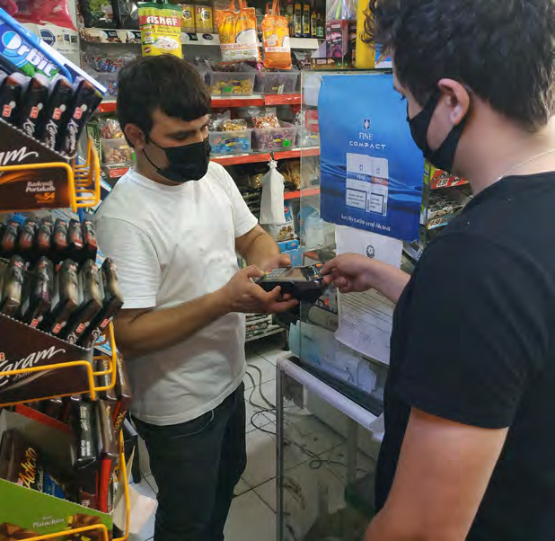

**Image 2 OCR + Description:**
```
**Image Description:**
The image shows a page layout with the bottom right corner of a white page being curled upward, revealing a solid black background underneath. There is no visible text or other elements on the white page or the black background. The design suggests a page-turning or unfolding effect, which could symbolize revealing new information or progress, fitting for an annual development report.
```


## Page 32
KH*E%"#$):'#)"-*#%*#,/*EYa!?WI[*E$).).*>/.0%"./!!!!"!!!!kk
+,)$&W07$#=*2%")#%$)"-*V7.*&/.)-"/&*
#%*0$%;)&/*7"*'":)7./&*0/$.0/(#);/*
%"*0$%c/(#*)205/2/"#7#)%"*7"&*278/*
$/(%22/"&7#)%".*<%$*)20$%;/2/"#H
[06(C$)%_0'"6.IK%&'.^$#+%@..')"*0+.'K%10^"F"(+0*%
X6$'>$*#O%@M!?4L9N%B$(5.*($%&'.^$#+
&/;/5%0*#,/*./(%"&7$=*27$8/#*<%$*i]\.*#%*7&&$/..*
#,).* ($)#)(75* )..'/* V)#,* 0$);7#/* ./(#%$* 07$#)()07#)%"*
7"&*/".'$/*$%:'.#*$/(%;/$=H*!DE*).*V%$8)"-*V)#,*67"8*
@5WF7-,$):*e6@Ff1*#,/*(/"#$75*:7"81*#%*<7()5)#7#/*#,/*
#$7".</$7:)5)#=* %<* &/:#1* $/;)./* #,/* #7Z* <$72/V%$8* <%$*
i]\.1* 7"&* )20$%;/* #,/* $/-'57#%$=* <$72/V%$8* <%$*
#,/*&/:#*./$;)(/*)"&'.#$=1*V)#,*#,/*-%75*#%*.#)2'57#/*
<'$#,/$* )";/.#2/"#.* '"&/$* !DE_.* ?).#$/../&* @../#*
>/(%;/$=*]$%-$72H*+,/*0$%c/(#*,7.*75$/7&=*&/5);/$/&*
7* $/<%$2* 07(87-/* <%$* #,/* #7Z* #$/7#2/"#* %<* i]\.1*
V,)(,* 6@F* ,%0/.* #%* )"#$%&'(/* )"* #,/* KTKJ* <)"7"(/*
:)551*7&%0#)%"*%<*7"*/#,)(.*(%&/*<%$*#,/*&/:#*./$;)()"-*
)"&'.#$=1* 7"&* <%$27#)%"* %<* 7"* )"#/$W2)").#/$)75*
(%22)##//*#%*&).('..*#,/*&/:#*#$7".</$7:)5)#=*$/<%$2H
/TVacKT]! RLKPU?YVPRb! [MTKRMPKT]! KT! &VsKJKNRVT:! +%*
.#$/"-#,/"* 7((%'"#7:)5)#=* )"* #,/* )205/2/"#7#)%"* %<*
#,/* dPQHPW2)55)%"* !?@W<'"&/&* +7c)8).#7"* N2/$-/"(=*
EYa!?WI[*>/.0%"./*]$%c/(#1*#,/*5cMaVc!1VPRTXPNLKY!
SMP! 2M\KVc! 4\\MQTRVaKcKRb! d5124e! ).* .'00%$#)"-* 7*
"/#V%$8* %<* EGY.* )"* 2%")#%$)"-* (7.,* #$7".</$.* #%*
;'5"/$7:5/* ,%'./,%5&.1* EYa!?WI[* (%22'")(7#)%".1*
#,/* 0$%('$/2/"#* %<* )"#/".);/* (7$/* /b')02/"#1*
7"&* #,/* ;7(()"/* $%55* %'#H* G)"(/* F7$(,* KTKI1* #,/*
F)").#$=* %<* j/75#,* 7"&* G%()75* ]$%#/(#)%"* ,7.* './&*
#,/* <//&:7(8* $/(/);/&* #%* (%'$./W(%$$/(#* 7"&* 7;/$#*
)205/2/"#7#)%"* $).8.H* B]G@* /Z0/$)/"(/* ,7.* .,%V"*
#,7#* V,/"* -%;/$"2/"#.* 7(#* %"* ()#)M/"* <//&:7(81*
#,/)$* %V"* 2%")#%$)"-* 0$%(/../.* 7$/* /",7"(/&1*
75%"-* V)#,* -$/7#/$* #$7".07$/"(=* 7"&* (%"<)&/"(/* )"**
-%;/$"2/"#*)")#)7#);/.H
$TSMP[KT]! gVRXP! NQYYcb! VTU! NVTKRVRKMT! NRPVRX]b!
KT! &M]M:! +,/* +%-%* G#$7#/-)(* 47#/$* ?)7-"%.#)(1*
(%"&'(#/&* V)#,* .'00%$#* <$%2* #,/* 5cMaVc! EVRXP!
2X\QPKRb! v! 2VTKRVRKMT! 1VPRTXPNLKY! d5E21eB* ).*
7* (%20$/,/".);/* 7"75=.).* %<* #,/* (%'"#$=_.* V7#/$*
.'005=1* .7")#7#)%"1* 7"&* $/.%'$(/.* 27"7-/2/"#*
./(#%$* #%* ,/50* #,/* -%;/$"2/"#* ./#* ./(#%$75**
0$)%$)#)/.H* U/=* %'#0'#.* )"(5'&/* 7"* 7(#)%"* 057"* #%*
)20$%;/*#,/*./(#%$_.*/O)()/"(=1*0$)"()05/.*#%*-')&/*
#7$)O* $/<%$2.1* 7"&* :$%7&/$* $/(%22/"&7#)%".* %"*
V7#/$*./(#%$*057"")"-1*$/-'57#)%"1*7"&*27"7-/2/"#*
)"*#,/*(%"#/Z#*%<*#,/*EYa!?WI[*07"&/2)(H*+,/*.#'&=*
).* 75.%* )"<%$2)"-* #,/* &/.)-"* %<* 7* dXPW2)55)%"* !?@W
<)"7"(/&* 0$%c/(#* #%* )20$%;/* #,/* "7#)%"75* '$:7"*
V7#/$* '#)5)#=_.* * %0/$7#)%"75* /O)()/"(=H* @.* %<* KTKT1*
%"5=*IQ*0/$(/"#*%<*,%'./,%5&.*)"*+%-%*,7&*7((/..*
#%* :7.)(* ,7"&V7.,)"-* <7()5)#=1* 7"&* PT* 0/$(/"#* #%*
&$)"8)"-*V7#/$*#,$%'-,*0':5)(5=W27"7-/&*.=.#/2.H
FARHOD KHOLMATOV / WORLD BANK


**Image 1 OCR + Description:**
```
**Image Description:**
The image shows a group of four medical professionals standing in what appears to be a clinical or hospital setting. Three men are wearing white lab coats and distinctive white medical caps, along with blue surgical masks. One of these men is gesturing with his right hand, as if explaining or presenting something. A woman in the group is wearing a blue protective gown over her clothes and a blue surgical mask; she is holding a clipboard and writing notes.

The background features a clinical environment with equipment and storage cabinets, suggesting the photo was taken in a healthcare facility. There is no visible text within this image.

This visual effectively conveys a professional medical team engaged in discussion or assessment, aligning well with themes of healthcare development and institutional progress for an annual development report.
```


**Image 2 OCR + Description:**
```
**Image Description:**
The image shows a single sheet of paper with its top right corner curled downward, revealing the underside of the page. The primary visible side of the paper is black, while the underside, visible due to the curled corner, is white. There is no text, graphics, or additional elements visible on the paper itself. The image appears to be a simple representation of a turned or peeling page.
```


## Page 33
kI!!!!"!!!!46B*+$'.#*D'"&*@""'75*>/0%$#*KTKK
MOHAMED AZAKIR/  WORLD BANK


**Image 1 OCR + Description:**
```
**Image Description:**
The image depicts a refugee camp setting with several key elements:

Layout and Key Elements:
- In the foreground, there are four boys walking on rocky ground. One boy is pushing a wheelbarrow filled with bags or belongings.
- The middle ground features a fenced area with children playing or gathered near playground equipment, including a swing set.
- The background shows numerous white tents or shelters arranged in rows, indicating a large refugee camp.
- Some structures have water tanks on top, and the fencing is blue and metal.
- A prominent metal roof structure is visible in the middle of the scene.

Text:
- The word “unicef” along with its logo is visible on a white container or modular unit in the background, indicating the involvement of UNICEF in the camp.

The image conveys an organized but basic living environment for displaced people, highlighting children's presence and some infrastructure elements.
```
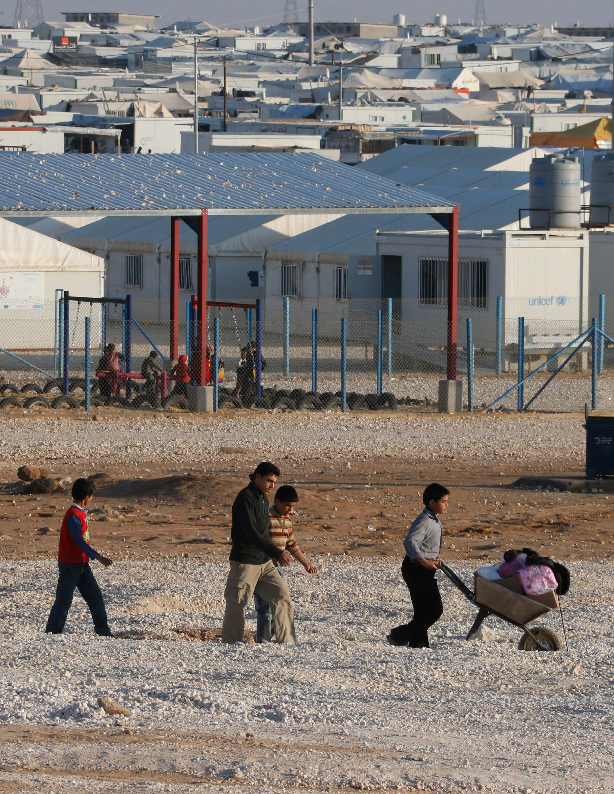

## Page 34
JH*@&&$/..)"-*#,/*E,755/"-/.*%<*D$7-)5)#=1*E%"<5)(#1*7"&*a)%5/"(/!!!!"!!!!kO
3. ADDRESSING THE CHALLENGES OF 
FRAGILITY, CONFLICT, AND VIOLENCE 
+,/*0$/;75/"(/*%<*<$7-)5)#=1*(%"<5)(#*7"&*;)%5/"(/*eDEaf*
)"*#,/*4%$5&*67"8*B$%'0_.*(5)/"#*(%'"#$)/.*,7.*:%#,*
)"($/7./&* 7"&* :/(%2/* 2%$/* 0/$.).#/"#* )"* $/(/"#*
=/7$.HR*+,/$/*7$/*"%V*2%$/*;)%5/"#*(%"<5)(#.*-5%:755=*
#,7"* 7#* 7"=* #)2/* )"* #,/* 07.#* JT* =/7$.1* $/.'5#)"-* )"*
#,/* 57$-/.#* <%$(/&* &).057(/2/"#* ($).).* e:%#,* <%$/)-"*
7"&*&%2/.#)(f*#,7#*#,/*V%$5&*,7.*/Z0/$)/"(/&*.)"(/*
4%$5&*47$*!!H*Y"*#%0*%<*#,).1*#,/*4%$5&*67"8*B$%'0*
/.#)27#/.* #,7#* #,/* EYa!?WI[* 07"&/2)(* ,7.* 0'.,/&*
7"*7&&)#)%"75*KT*2)55)%"*0/%05/*5);)"-*)"*<$7-)5/*7"&*
(%"<5)(#W7O/(#/&* .)#'7#)%".* )"#%* /Z#$/2/* 0%;/$#=H[*
6=* KTJT1* #V%W#,)$&.* %<* #,/* V%$5&_.* /Z#$/2/* 0%%$*
7$/*/Z0/(#/&*#%*5);/*)"*(%'"#$)/.*V,/$/*<$7-)5)#=*,7.*
:/(%2/*#,/*"%$2*e6%Z*JHIfHIT
D7(/&*V)#,*V%$./")"-*DEa*&="72)(.1*#,/*67"8*B$%'0*
7&%0#/&* )#.* 7878L787T% 3@!% H+'0+$>O* #%* (,7"-/* #,/*
V7=*)#*V%$8.*)"*#,/./*./##)"-.H*!#*).*-/##)"-*)";%5;/&*
.%%"/$*7"&*.#7=)"-*/"-7-/&*5%"-/$*#%*,/50*(%'"#$)/.*
:/##/$* 7&&$/..* #,/* &$);/$.* 7"&* )207(#.* %<* DEa* 7"&*
.#$/"-#,/"*#,/)$*$/.)5)/"(/1*/.0/()755=*<%$*#,/)$*2%.#*
;'5"/$7:5/*7"&*27$-)"75)M/&*0%0'57#)%".H*+,/*67"8*
B$%'0_.*EYa!?WI[*$/.0%"./*7"&*%"-%)"-*V%$8*%;/$*
#,/*57.#*<);/*=/7$.*.0/78*#%*)#.*)"($/7./&*<%('.*%"*DEa1*
.'00%$#/&*:=*#$'.#*<'"&.*7"&*D!D.H
RH**Y<*#,/*XI*(%'"#$)/.*7"&*#/$$)#%$)/.*#,7#*,7;/*700/7$/&*%"*#,/*67"8*B$%'0_.*%O)()75*5).#*%<*<$7-)5/*7"&*(%"<5)(#W7O/(#/&*.)#'7#)%".*.)"(/*
KTTX*eV,/"*#,/*5).#*V7.*.#7$#/&f1*JK*(%'"#$)/.*7"&*#/$$)#%$)/.*ePK*0/$(/"#f*,7;/*700/7$/&*%"*#,/*5).#*<%$*7*&/(7&/*%$*5%"-/$H*?'$)"-*#,/*
07.#*<);/*=/7$.*eD`KTIRhKKf1*%"5=*.)Z*(%'"#$)/.*/Z)#/&*#,).*%O)()75*5).#1*V,)5/*")"/*(%'"#$)/.*V/$/*7&&/&*#%*#,/*5).#H*
[**4%$5&*67"8*B$%'0H*^'"/*KTKTH*B5%:75*N(%"%2)(*]$%.0/(#.H*G//*75.%*,##0.CssVVVHV%$5&:7"8H%$-s/"s#%0)(s*
<$7-)5)#=(%"<5)(#;)%5/"(/s%;/$;)/VH
IT**E%$$751*]7'51*@5/Z7"&/$*!$V)"1*i7"&)")*U$).,"7"1*?7")/5*B/$.M%"*F7,5/$1*7"&*+7$7*a).,V7"7#,H*KTKTH*3D$7-)5)#=*7"&*E%"<5)(#C*Y"*#,/*D$%"#*
\)"/.*%<*#,/*D)-,#*@-7)".#*]%;/$#=H9*E)#/&*)"*#,/*D.'-)%E0*F%,'.;5%H+'0+$>O%V.'%3@!%7878S787TH*
>M^!k:#:!2M[X!,V\RMPN!!
+MTRPKaQRKT]!RM!,+0
k**B%;/$"2/"#.*#,7#*57(8*#,/*(707()#=*%$*
V)55)"-"/..*#%*27"7-/*%$*2)#)-7#/*$).8.*
k**>).)"-*)"/b'75)#=1*57(8*%<*%00%$#'")#=1*
&).($)2)"7#)%"1*7"&*/Z(5'.)%"*#,7#*<'/5*
-$)/;7"(/.*7"&*0/$(/0#)%".*%<*)"c'.#)(/
k**!"#/$(%""/(#/&*(,755/"-/.*#,7#*#$7".(/"&*
:%$&/$.C*(5)27#/*(,7"-/1*&/2%-$70,)(*
(,7"-/1*2)-$7#)%"1*&)-)#75*#$7".<%$27#)%"1*
)55)()#*<)"7"()75*<5%V.1*7"&*;)%5/"#*/Z#$/2).2*
k**+,/./*<7(#%$.*(7"*)"($/7./*;'5"/$7:)5)#=**
#%*.,%(8.*7"&*($)./.*7"&*($/7#/**
$/-)%"75*.0)55%;/$.H
G%'$(/C*4%$5&*67"8*B$%'0H*^7"'7$=*KTKTH*D.'-)%E0*F%
,'.;5%H+'0+$>O%V.'%3'0>"-"+OK%@.*V-"#+%0*)%!".-$*#$%
7878S787T:


## Page 35
kf!!!!"!!!!46B*+$'.#*D'"&*@""'75*>/0%$#*KTKK
\/7&)"-*#,/*/O%$#*).*!?@1*#,/*67"8*B$%'0_.*<'"&*<%$*
#,/* 0%%$/.#* (%'"#$)/.1* V,/$/* (%"&)#)%".* <%$* DEa*
7$/* 0$/;75/"#H* +,/* .,7$/* %<* !?@* $/.%'$(/.* -%)"-* #%*
(%'"#$)/.* 7O/(#/&* :=* DEa* ,7.* 2%$/* #,7"* &%':5/&*
<$%2* 7"* 7;/$7-/* %<* IX* 0/$(/"#* )"* !?@IX* 7"&* !?@IQ*
eD`KTIKhKTIQf1*#%*KJ*0/$(/"#*)"*!?@IR*eD`KTIRhKTKTf1*
7"&*#%*JP*0/$(/"#*)"*!?@I[*eD`KTKIhKTKKfHII
?'$)"-* #,/* 57.#* <);/* =/7$.1* 4%$5&* 67"8* #$'.#* <'"&.*
,7;/*(%"#$):'#/&*KI*0/$(/"#*%<*#%#75*&).:'$./2/"#.*
<%$*>N*7(#);)#)/.*)"*#,/./*(%'"#$)/.*eD)-'$/*JHIfH*+,/*
#%#75* ;%5'2/* %<* #$'.#* <'"&* &).:'$./2/"#.* <%$* >N*
7(#);)#)/.* ,7.* ://"* <7)$5=* (%".#7"#1* 7;/$7-)"-* dIHKP*
:)55)%"* 7* =/7$* <$%2* D`KTIRhKI* :/<%$/* )"($/7.)"-* #%*
dJHSP* :)55)%"* )"* D`KTKK* &'/* #%* #,/* V7$* )"* L8$7)"/H*
!#.* .,7$/* &/(5)"/&* <$%2* JT* 0/$(/"#* )"* D`KTIR* #%* IS*
0/$(/"#*)"*D`KTKI*&'/*#%*#,/*)"($/7.)"-*;%5'2/*%<*!?@*
&).:'$./2/"#.*#%*DEa*(%'"#$)/.1*:/<%$/*)"($/7.)"-*#%*
KS*0/$(/"#*)"*D`KTKK1*7-7)"*&'/*#%*#,/*V7$*)"*L8$7)"/H*
!6>?* &).:'$./2/"#.* #%* (%'"#$)/.* 7O/(#/&* :=* DEa*
,7;/* ://"* ;/$=* .27551* 7;/$7-)"-* %"5=* dTHQ[* :)55)%"**
eIT*0/$(/"#f*7*=/7$*<%$*#,/*57.#*<);/*=/7$.H
+,).*(,70#/$*.,/&.*5)-,#*%"*#,/*.'00%$#*#$'.#*<'"&.*
7"&* D!D.* ,7;/* 0$%;)&/&* %;/$* #,/* 57.#* <);/* =/7$.* #%*
/",7"(/*DEa*)")#)7#);/.*)"*67"8*B$%'0*(5)/"#*(%'"#$)/.*
7"&* #%* 0$%;)&/* &/;/5%02/"#* $/.%'$(/.* #%* 7#W$).8*
$/()0)/"#.* #,7#* #,/* 67"8* B$%'0* (7""%#* $/7(,* V)#,*
)#.*%V"*$/.%'$(/.H*+,).*/Z0/$)/"(/*)"*7&&$/..)"-*#,/*
(,755/"-/.*%<*DEa*75.%*%O/$.*)".)-,#.*7"&*5/..%".*<%$*
($).).*$/.0%"./*2%$/*-/"/$755=1*.)"(/*#,/*/(%"%2)(*
7"&* .%()75* (%"&)#)%".* )"* (%'"#$)/.* 2%.#* 7&;/$./5=*
7O/(#/&*:=*#,/*EYa!?WI[*07"&/2)(*%o/"*$/./2:5/*
(%'"#$)/.*(,7$7(#/$)M/&*:=*<$7-)5)#=H
Figure 3.1. IBRD, IDA, and World Bank Trust Fund Disbursements for Recipient-Executed 
Activities in Countries Affected by FCV, FY2018–2022 ($ billions)
!"#$
!$%
&'()*+,(-.)
&'()*+,(-.)+/)+01/'2+34+&3*/5
678
698
:78
:98
;78
;98
78
98
!"#$%%$&'(
;<=99
;>=99
;:=99
;9=99
?=99
<=99
>=99
:=99
9
)*+,-.
)*+,+,
)*+,+-
)*+,++
2.96
1.41
0.29
)*+,-/
3.54
1.17
0.25
0.27
5.48
1.16
0.27
7.59
1.27
2.86
7.95
3.45
30%
24%
17%
14%
24%
II**E%"#)"')"-*#,).*#$/"&1*!?@*?/0'#)/.*7"&*6%$$%V)"-*>/0$/./"#7#);/.*7-$//&*)"*D/:$'7$=*KTKI*#%*.)-")<)(7"#5=*)"($/7./*.'00%$#*#%*!?@*
(%'"#$)/.*)"*D`KTKK*7"&*D`KTKJ*:=*<$%"#5%7&)"-*$/.%'$(/.*<$%2*!?@I[*<$%2*D`KTKJ*#%*D`KTKKH*+,).*&/().)%"*.,%$#/"/&*#,/*!?@I[*(=(5/*
:=*%"/*=/7$*e<$%2*#,$//*=/7$.*#%*#V%f1*7&;7"(/&*#,/*!?@KT*$/05/").,2/"#*:=*%"/*=/7$*#%*(%;/$*#,/*0/$)%&*<$%2*^'5=*I1*KTKK*#%*^'"/*JT1*
KTKP1*7"&*755%V/&*7*(7$$=W%;/$*%<*dII*:)55)%"*<$%2*!?@I[*#%*!?@KTH*G//C*!?@KTH*D/:$'7$=*IQ1*KTKKH%=))"+".*(%+.%?4=%B$(.;'#$(2%1<$*+"$+C%
B$5-$*"(C6$*+%S%E;"-)"*>%E0#F%E$++$'%V'.6%+C$%@'"("(2%1.<0')%0%,'$$*K%B$("-"$*+%0*)%?*#-;("I$%3;+;'$:


## Page 36
JH*@&&$/..)"-*#,/*E,755/"-/.*%<*D$7-)5)#=1*E%"<5)(#1*7"&*a)%5/"(/!!!!"!!!!ki
k:#!EMPcU!>VTJ!&PQNR!,QTUN
4%$5&*67"8*#$'.#*<'"&.*,7;/*(%55/(#);/5=*&/;%#/&*7*
57$-/*.,7$/*%<*#,/)$*$/.%'$(/.*#%*0$%c/(#.*)"*(%'"#$)/.*
)207(#/&*:=*DEaH*E%'"#$)/.*%"*#,/*4%$5&*67"8*B$%'0_.*
%O)()75*5).#*%<*<$7-)5/*7"&*(%"<5)(#W7O/(#/&*.)#'7#)%".*
eDEGf* ,7;/* $/(/);/&* 2%$/* #,7"* ,75<* ePQ* 0/$(/"#f* %<*
755*>N*&).:'$./2/"#.*<$%2*#$'.#*<'"&.*&'$)"-*#,/*57.#*
<);/*=/7$.*eD)-'$/*JHKfH*+,/*#%0*#/"*$/()0)/"#.*$/(/);/&*
PK* 0/$(/"#* %<* >N* &).:'$./2/"#.* edQHQ* :)55)%"f1* )"*
&/.(/"&)"-* %$&/$C* @<-,7").#7"1* L8$7)"/1* 4/.#* 67"8*
7"&* B7M71* F%M72:)b'/1* ?/2%($7#)(* >/0':5)(* %<*
E%"-%1*G%275)71*G'&7"1*\/:7"%"1*\):/$)71*7"&*`/2/"*
e+7:5/*JHIfH*@<-,7").#7"*$/(/);/&*752%.#*%"/Wb'7$#/$*
%<* >N* &).:'$./2/"#.* edJHP* :)55)%"f* &'$)"-* #,).* <);/W
=/7$*0/$)%&H*
Figure 3.2. World Bank Trust Fund Disbursements for Recipient-Executed Activities  
in Countries Affected by FCV, FY2018–2022 ($ billions)*
4%$8)"-* V)#,* &/;/5%02/"#* 07$#"/$.1* #,/* 4%$5&*
67"8*B$%'0*,7.*$/.0%"&/&*$70)&5=*7"&*/O/(#);/5=*#%*
.'00%$#*L8$7)"/*.)"(/*V7$*.#7$#/&*)"*D/:$'7$=*KTKKH*
+,/*V7$*,7.*(7'./&*(7#7.#$%0,)(*&727-/*#%*L8$7)"/_.*
/(%"%2=*7"&*,7$2*#%*)#.*0/%05/H*@2%"-*%#,/$*#,)"-.1*
#,/* 4%$5&* 67"8* ,7.* /.#7:5).,/&* #V%* 2'5#)W&%"%$*
#$'.#* <'"&.* #%* 0$%;)&/* dKHSP* :)55)%"* %<* (%W<)"7"()"-*
-$7"#.* e75$/7&=* &).:'$./&f* #%* #V%* 67"8* %0/$7#)%".C*
#,/* D)"7"()"-* %<* >/(%;/$=* %<* N(%"%2)(* N2/$-/"(=*
eD>NNf* L8$7)"/* G'005/2/"#75* ?/;/5%02/"#* ]%5)(=*
e700$%;/&*)"*F7$(,*KTKKf*7"&*#,/*]':5)(*NZ0/"&)#'$/.*
<%$* @&2)").#$7#);/* E707()#=* N"&'$7"(/* e]N@ENf* )"*
L8$7)"/*]$%c/(#*e700$%;/&*)"*^'"/*KTKKfH**@.*L8$7)"/*
7"&*&/;/5%02/"#*07$#"/$.*,7;/*.%'-,#*)".#$'2/"#.*
V)#,* $70)&1* ./('$/1* 7"&* /O)()/"#* &).:'$./2/"#*
2/(,7").2.*#%*.'00%$#*#,/*(%'"#$=1*#,/*4%$5&*67"8*
B$%'0*,7.*/2/$-/&*7.*7*($'()75*#$'.#/&*07$#"/$H*!#*V)55*
(%"#)"'/*#%*'./*#$'.#*<'"&.*7.*07$#*%<*)#.*.'00%$#*#%*
L8$7)"/_.*$/:')5&)"-*/O%$#.H


## Page 37
kq!!!!"!!!!46B*+$'.#*D'"&*@""'75*>/0%$#*KTKK
i%#/C*F%M72:)b'/*V7.*"%#*%"*#,/*46B*%O)()75*5).#*%<*<$7-)5/*7"&*(%"<5)(#W7O/(#/&*.)#'7#)%".*)"*D`KTKT1*"%$*\):/$)7*)"*D`KTKKH*
?).:'$./2/"#.*7$/*%"5=*.,%V"*<%$*=/7$.*)"*V,)(,*(%'"#$)/.*7$/*%"*#,/*%O)()75*DEG*5).#H
Table 3.1. Top Ten Recipient Countries Affected by FCV,  
by Trust Fund Disbursements, FY2018–2022 ($ millions)
,Ajn#q
,Ajn#Z
,Ajnjn
,Ajnj#
,Ajnjj
&MRVc
2LVPX!MS
&MRVc
4S]LVTKNRVT
[JPHP
QP[HK
XXIHP
XS[HS
*S[IHT*
J1S[XHX
KJHXm
*JPVKTX
K1SPTHQ
K1SPTHQ
IXHPm
EXNR!>VTJ!VTU!5VtV
IIIHP
[PH[
IJRHK
ITTHS
ITXHK
PPKHJ
JHQm
-MtV[aKhQX
JIHR
S[HX
Q[HS
[JHR
KPSHP
IHQm
+MT]MB!)X[:!'XY:
KRHX
SJHQ
XXHP
XTHJ
JSHX
KJJHQ
IHXm
2M[VcKV
P[H[
PPHI
KTHT
JRHR
KRH[
KTKHR
IHSm
6XaVTMT
SXHK
IRHK
PTHP
KKHR
JKH[
IQTHX
IHKm
2QUVT
IQHK
ITHK
PHI
IIRH[
XHX
IPQH[
IHIm
6KaXPKV
JIHP
KKH[
KTHP
JPHP
IITHS
THQm
AX[XTB!'XY:
IKH[
KKHX
RHI
KJHX
IRHP
RPHQ
THXm
(RLXP!,+0!+MQTRPKXN
IJTHK
[IHS
IRPHS
ISTHK
IRXHJ
QJJHX
SH[m
4cc!,+0!+MQTRPKXN
I1STPHJ
I1IXRH[
I1IPPHR
I1KX[HJ
J1SS[HP
R1SSRHR
PQHTm
4cc!+MQTRPKXN
K1RTJHK
K1P[THJ
K1SJKHX
K1PSXHJ
S1SXTHQ
IS1RJJHI
ITTHTm


## Page 38
JH*@&&$/..)"-*#,/*E,755/"-/.*%<*D$7-)5)#=1*E%"<5)(#1*7"&*a)%5/"(/!!!!"!!!!kZ
2*11('&!,('!.4')?&(?'/4+.!164+/2
4%$5&*67"8*#$'.#*<'"&.*7$/*/.0/()755=*)20%$#7"#*<%$*
(%'"#$)/.* #,7#* &%* "%#* ,7;/* 7((/..* #%* !?@* %$* !6>?*
<)"7"()"-1* .'(,* 7.* "%"W2/2:/$.* e4/.#* 67"8* 7"&*
B7M7f1*(%'"#$)/.*)"*7$$/7$.*et)2:7:V/f1*7"&*(%'"#$)/.*
V)#,%'#* 7* <'"(#)%")"-* -%;/$"2/"#* #%* )205/2/"#*
0$%c/(#.H* !"* B7M71* #,/* 5cMaVc! 1VPRTXPNLKY! SMP!
'XNQcRN?>VNXU! 4YYPMV\LXN! d51'>4e* ,7.* 0$%;)&/&*
7&&)#)%"75*<)"7"()"-*#%*)20$%;/*#,/*%0/$7#)%".*7"&*
27)"#/"7"(/*%<*7*.%5)&*V7.#/*27"7-/2/"#*<7()5)#=1*
#,/*(%".#$'(#)%"*%<*V,)(,*V7.*)")#)755=*<)"7"(/&*:=*#,/*
4%$5&*67"8*+$'.#*D'"&*<%$*#,/*4/.#*67"8*7"&*B7M7H*
E%"(/..)%"75* <)"7"(/* 0$%;)&/&* #,$%'-,* #,/* 5cMaVc!
+MT\XNNKMTVc! ,KTVT\X! ,V\KcKRb! d5+,,e* ).* ,/50)"-*
\/:7"%"* 27"7-/* #,/* )"<5'Z* %<* G=$)7"* $/<'-//.H*
+$'.#*<'"&*.'00%$#*,7.*://"*($)#)(75*)"*#,).*.)#'7#)%"*
V,/$/* #,/* (%'"#$=_.* 7((/..* #%* !6>?* $/.%'$(/.* ,7.**
://"*(%".#$7)"/&H
G)"(/* #,/* )".#)-7#)%"* %<* 0%5)#)(75* )".#7:)5)#=* )"*
@<-,7").#7"* )"* @'-'.#* KTKI1* #,/* 67"8* ).* <)"&)"-*
75#/$"7#);/*V7=.1*#,$%'-,*Li*%$-7")M7#)%".*7"&*"%"W
-%;/$"2/"#75* %$-7")M7#)%".* eiBY.f1* #%* '#)5)M/* #,/*
$/.%'$(/.* <$%2* #,/! 4S]LVTKNRVT! 'X\MTNRPQ\RKMT!
&PQNR!,QTU!d4'&,e*#%*$/.'2/*/../"#)75*,/75#,*./$;)(/.*
7"&* /2/$-/"(=* <%%&* 7..).#7"(/H* Y0/$7#)%"75* .)"(/*
KTTK1*#,/*@>+D*,7.*,).#%$)(755=*://"*#,/*57$-/.#*4%$5&*
67"8* #$'.#* <'"&1* V)#,* %;/$* dIJ* :)55)%"* (%"#$):'#/&*
:=*2%$/*#,7"*JT*&%"%$.*#%*&7#/H*G)"(/*@'-'.#*KTKI1*
#,/*@>+D*,7.*.'00%$#/&*V%$8W7$%'"&.*#%*-/#*dIHTQS*
:)55)%"*%<*#$'.#*<'"&*$/.%'$(/.*<5%V)"-*#,$%'-,*./;/$75*
Li*7-/"()/.g"72/5=1*D@Y1*Li?]1*Li!END1*LiY]G1*
7"&* #,/* 4%$5&* D%%&* ]$%-$722/g#%* ,/50* &/5);/$*
/2/$-/"(=*7..).#7"(/*#%*#,/*@<-,7"*0/%05/H
5/&&$%5!$%0(60/)B!2&4A$%5!/%545/)
+$'.#*<'"&.*7$/*,/50)"-*#,/*4%$5&*67"8*7&&$/..*#,/*
(,755/"-/.* %<* DEa* (%'"#$)/.* #,$%'-,%'#* 755* .#7-/.*
%<* <$7-)5)#=H* @.* 7$#)('57#/&* )"* #,/* 67"8* B$%'0_.* DEa*
.#$7#/-=1* #,).* 2/7".* "%#* %"5=* 0$/;/"#)"-* ;)%5/"#*
(%"<5)(#* 7"&* )"#/$0/$.%"75* ;)%5/"(/* :=* 7&&$/..)"-*
#,/* &$);/$.* %<* <$7-)5)#=* :/<%$/* #,/=* #'$"* )"#%* <'55W*
:5%V"* ($)./.1* :'#* 75.%* $/27)")"-* /"-7-/&* &'$)"-*
(%"<5)(#* 7"&* ($).).* .)#'7#)%".* #%* 0$/./$;/* ,7$&WV%"*
&/;/5%02/"#* -7)".* <$%2* .5)00)"-* :7(81* 0$%#/(#*
/../"#)75* )".#)#'#)%".1* 7"&* :')5&* $/.)5)/"(/* .%*
(%'"#$)/.*7$/*./#*%"*#,/*(%'$./**<%$*$/(%;/$=H*
D%$* /Z7205/1* )"* `/2/"1* #,/* wQVcKRb! $TSPVNRPQ\RQPX!
$TWXNR[XTR! dw$$e! 1VPRTXPNLKY* ).* ,/50)"-* #%* $/.#%$/*
V7$W&727-/&* '$:7"* )"<$7.#$'(#'$/* ./$;)(/.* )"*
IX* ()#)/.* 7"&* 278/* #,/2* 2%$/* (5)27#/W$/.)5)/"#H*
!"* G%275)71* #,/* +M[YXRKRKWX! $TUQNRPKXN! VTU!
$TTMWVRKMT!1PM]PV[!d+$$1e*,7.*,/50/&*#%*.(75/*'0*7*
FGFN*D)"7"()"-*D7()5)#=*)"*#,/*V78/*%<*#,/*EYa!?WI[*
($).).1* :$)"-)"-* )"* 7&&)#)%"75* $/.%'$(/.* #%* <)"7"()75*
)".#)#'#)%".*7"&*2)#)-7#)"-*5)b')&)#=*.,%$#7-/.*(7'./&*
:=*#,/*07"&/2)(*)"*;'5"/$7:5/*:'#*;)7:5/*<)$2.H*
4%$5&* 67"8* #$'.#* <'"&.* 7$/* 75.%* ,/50)"-* (%'"#$)/.*
#$7".)#)%"* %'#* %<* <$7-)5)#=* :=* .'00%$#)"-* /O%$#.* #%*
.#$/"-#,/"* #,/* 5/-)#)27(=* 7"&* (707()#=* %<* (%$/*
)".#)#'#)%".H* &LX! 4SPK\V! '/))x! 1PM]PV[* )"* \):/$)7*
7"&*#,/*,MPXNR!+VPaMT!1VPRTXPNLKY!,V\KcKRb!d,+1,e*
)"* F%M72:)b'/* 7$/* <%.#/$)"-* (%22'")#=W:7./&*
<%$/.#*27"7-/2/"#*:%#,*#%*$/&'(/*(7$:%"*/2)..)%".*
7"&*)20$%;/*5);/5),%%&.H*!"*U%.%;%1*#,/*5cMaVc!&V^!
1PM]PV[! d5&1e* ).* ,/50)"-* #,/* -%;/$"2/"#* &)-)#)M/*
)#.* #7Z* $/-).#$=* #%* :%%.#* #7Z* $/;/"'/.* 7"&* $/&'(/*
)"<%$275)#=* )"* #,/* :'.)"/..* ./(#%$H* E%'"#$)/.* 5)8/*
\):/$)7*7"&*+%-%*,7;/*$/(/"#5=*://"*$/2%;/&*<$%2*
#,/* %O)()75* 4%$5&* 67"8* DEG* 5).#1* #,7"8.1* )"* 07$#1* #%*
#$'.#* <'"&* (%"#$):'#)%".* #%* )20$%;/&* -%;/$"7"(/**
7"&*)".#)#'#)%"75*7$$7"-/2/"#.H


## Page 39
In!!!!"!!!!46B*+$'.#*D'"&*@""'75*>/0%$#*KTKK
4%$5&*67"8*#$'.#*<'"&.*7$/*75.%*,/50)"-*#%*2)#)-7#/*
#,/* .0)55%;/$.* %<* DEa1* .'(,* 7.* <%$(/&* &).057(/2/"#*
%$* .,%(8.* $/.'5#)"-* <$%2* <72)"/.1* 07"&/2)(.1* 7"&*
(5)27#/*7"&*/";)$%"2/"#75*(,755/"-/.H*D%$*/Z7205/1*
)"*^727)(71*#,/!5cMaVc!'KNJ!,KTVT\KT]!,V\KcKRb!d5'K,e!
.'00%$#/&*#,/*-%;/$"2/"#*)"*./('$)"-*7*(7#7.#$%0,/*
:%"&* 0$%;)&)"-* )".'$7"(/* (%;/$7-/* V%$#,* dIRP*
2)55)%"* <%$* #,$//* ,'$$)(7"/* ./7.%".* KTKIhKTKJH* !"*
#,/* ]7()<)(* >/-)%"1* #,/* 1V\KSK\! +VRVNRPMYLX! 'KNJ!
4NNXNN[XTR!VTU!,KTVT\KT]!$TKRKVRKWX!d1+'4,$e*,7.*
,/50/&*+%"-7*:/(%2/*#,/*<)$.#*(%'"#$=*)"*#,/*$/-)%"*
#%*7&%0#*7*&).7.#/$*$).8*<)"7"()"-*.#$7#/-=H
4/*7$/*05/7./&*V)#,*#,/*.'((/..<'5*
057(/2/"#*%<*#,).*(7#7.#$%0,/**
:%"&1*V,)(,*7&&.*7"*)"&).0/".7:5/*
57=/$*%<*&).7.#/$*$).8*<)"7"()"-**
#,7#*(%205/2/"#.*%'$*$).8W*
57=/$)"-*700$%7(,H
]">$-%@-0'F$K%A"*"(+$'%.V%3"*0*#$%0*)%+C$%&;/-"#%H$'I"#$K%
,.I$'*6$*+%.V%[060"#0
0%..):5=* 7O/(#)"-* .%()75* .#7:)5)#=* 7"&* #,$/7#/")"-*
&/;/5%02/"#*-7)".H*!"*#,).*(,755/"-)"-*/";)$%"2/"#1*
!DE* 7"&* )#.* &/;/5%02/"#* 07$#"/$.* V%$8* V)#,* (5)/"#*
(%'"#$)/.*7"&*#,/)$*0$);7#/*./(#%$*(%207")/.*#%*,/50*
0$%#/(#*#,/)$*/(%"%2)/.*7"&*:'.)"/../.H*
D%$* /Z7205/1* )"* `/2/"1* V,/$/* (5)27#/* (,7"-/* 7"&*
%"-%)"-*(%"<5)(#*,7;/*$7)./&*<%%&*)"./('$)#=*#%*($)#)(75*
5/;/5.1*!DE*).*.'00%$#)"-*0$);7#/*(%207")/.*#%*0$%;)&/*
8/=*./$;)(/.*#%*#,/*0%0'57#)%"H*!DE*,7.*27&/*)#.*<)$.#*
)";/.#2/"#* )"* `/2/"* )"* 7* &/(7&/* #%* .VbXc! 2VXXU!
4TV[!5PMQY!d.24e1*V,)(,*).*,/50)"-*#,/*(%207"=*
#%* /Z07"&* )#.* 0$%;).)%"* %<* .#705/* <%%&.* 5)8/* <5%'$1*
.'-7$1* V,/7#1* 7"&* &7)$=* 0$%&'(#.* 7"&* &).#$):'#/*
<%%&* #%* (%22'")#)/.* )"* "//&H* !"* 07$#"/$.,)0* V)#,*
#,/* -%;/$"2/"#.* %<* @'.#$)71* @'.#$75)71* ?/"27$81*
7"&*#,/*i/#,/$57"&.1*!DE*).*75.%*0$%;)&)"-*jG@*<%%&*
0$%(/..)"-*057"#.*V)#,*7&;).%$=*./$;)(/.*<%('./&*%"*
/"/$-=* 7"&* V7#/$* /O)()/"(=1* V7.#/V7#/$* #$/7#2/"#1*
(%.#* .7;)"-.1* 0$%&'(#);)#=* /",7"(/2/"#1* 7"&* BjB*
$/&'(#)%"H*
!205/2/"#7#)%"*
%<*
$/(%22/"&/&*
2/7.'$/.*V)55*/"7:5/*jG@*#%*&/5);/$*)#.*./$;)(/.*2%$/*
/O)()/"#5=*#%*#,/*0/%05/*%<*`/2/"H
+,/*KTIR*!DE*E70)#75*!"($/7./*07(87-/*057(/&*.#$%"-*
/20,7.).*%"*!DE_.*-$%V#,*)"*!?@*7"&*DEa*(%'"#$)/.*7.*
7*8/=*%'#(%2/*$/<5/(#/&*)"*!DE_.*E%$0%$7#/*G(%$/(7$&H*
!DE*(%22)##/&*#%*)"($/7.)"-*)#.*.,7$/*%<*)";/.#2/"#*
(%22)#2/"#.*)"*!?@*7"&*DEa*(%'"#$)/.*#%*ST*0/$(/"#*
:=*D).(75*`/7$*KTJT1*V)#,*IPWKT*0/$(/"#*)"*5%VW)"(%2/*
!?@*7"&*!?@sDEa*(%'"#$)/.H*+,).*V%'5&*$/b')$/*7#*5/7.#*
7*<);/W<%5&*)"($/7./*)"*)";/.#2/"#*;%5'2/.*<$%2*#,/*
('$$/"#*5/;/5H
+,/*)"#$%&'(#)%"*)"*!?@IR*%<*#,/*dKHP*:)55)%"*]$);7#/*
G/(#%$* 4)"&%V* e]G4f* 755%V.* !DE* #%* )"($/7./*
)";/.#2/"#.* )"* DEa* (%'"#$)/.1* #,'.* (%205/2/"#)"-*
!?@_.* .'00%$#* <%$* 0%5)(=* $/<%$2.* #,7#* 7$/* 7)2/&*
7#* .#)2'57#)"-* 0$);7#/* ./(#%$W5/&* -$%V#,H* 4)#,*
.)-")<)(7"#*.'00%$#*<$%2*&/;/5%02/"#*07$#"/$.1*!DE*
(%"#)"'/.*#%*V%$8*V)#,*(5)/"#.*%"*)20$%;)"-*/"7:5)"-*
/";)$%"2/"#.1*$/-'57#%$=*$/<%$2.1*'0.#$/72*0$%c/(#*
&/;/5%02/"#1* 7"&* (707()#=* :')5&)"-H* !DE_.* E$/7#)"-*
F7$8/#.* .#$7#/-=* ).* ($)#)(75* #%* .'((/..* )"* #,/* DEa*
(%"#/Z#*:/(7'./*)#*5%%8.*:/=%"&*)"&);)&'75*0$%c/(#.*
#%* )207(#.* %"* /"#)$/* 27$8/#.H* ?%)"-* #,).* $/b')$/.*
7* ./(#%$75* <%('.* <%$* 0$%c/(#* &/;/5%02/"#* 7"&**
7&;).%$=*V%$8H*
k:j!$,+!&PQNR!,QTUN
!DE* 0$)%$)#)M/.* &/5);/$=* %<* )";/.#2/"#* 7"&* 7&;).%$=*
./$;)(/.*)"*<$7-)5/*/(%"%2)/.*:/(7'./*&/;/5%02/"#*
.,%'5&* "%#* 7"&* (7""%#* :/* 057(/&* %"* ,%5&* #%*
7V7)#* 7* #%#75* (/..7#)%"* %<* '"$/.#* 7"&* )".#7:)5)#=H* +%*
#,/* (%"#$7$=1* /(%"%2)(* $/<%$21* .'.#7)"7:5/* 7"&*
)"(5'.);/* &/;/5%02/"#1* 7"&* #7$-/#/&* )";/.#2/"#*
7"&* 0$);7#/* ./(#%$* -$%V#,* (7"* :/* 8/=* )"-$/&)/"#.*
)"* #720)"-* &%V"* )".#7:)5)#=* 7"&* 0%5)#)(75* ;)%5/"(/*
7"&*.#7:)5)M)"-*(%'"#$)/.*)"*DEa*.)#'7#)%".H*G'00%$#*
<$%2* &/;/5%02/"#* 07$#"/$.* ).* 8/=* )"* #,/./**
(,755/"-)"-*/";)$%"2/"#.H*
+,/*2'5#)05/*.)2'5#7"/%'.*(,755/"-/.*%<*(%"#)"')"-*
V7;/.*%<*EYa!?WI[*)"</(#)%"1*)"#/".)<=)"-*)207(#.*%<*
(5)27#/*(,7"-/1*0/$.).#/"#*&).$'0#)%".*)"*-5%:75*7"&*
$/-)%"75* 7-$)('5#'$75* .'005=* (,7)".1* )"<57#)%"1* ,)-,*
5/;/5.*%<*0':5)(*7"&*0$);7#/*&/:#1*&/#/$)%$7#)"-*-5%:75*
/(%"%2)(* %'#5%%81* 7"&* #,/* V7$* )"* L8$7)"/* ,7;/*
)"($/7./&*5/;/5.*%<*<$7-)5)#=*7"&*)"./('$)#=*7$%'"&*#,/*
V%$5&H*E%20%'"&)"-*($)./.*V%$./"*<%%&*)"./('$)#=1*


## Page 40
JH*@&&$/..)"-*#,/*E,755/"-/.*%<*D$7-)5)#=1*E%"<5)(#1*7"&*a)%5/"(/!!!!"!!!!I#
>/(/"#* !DE* )")#)7#);/.* )"* DEa* (%'"#$)/.* :')5&* %"*
5%"-* /Z0/$)/"(/* 7"&* .#$%"-* (%557:%$7#)%"* V)#,*
&/;/5%02/"#*07$#"/$.H*+,/*+MTScK\R!4`X\RXU!2RVRXN!
KT! 4SPK\V! d+424e* )")#)7#);/1* /.#7:5).,/&* )"* KTTR* 7"&*
(%"(5'&/&* &'$)"-* D`KTKK1* .'00%$#/&* 0$);7#/* ./(#%$*
&/;/5%02/"#*)"*IJ*DEaW7O/(#/&*(%'"#$)/.*)"*@<$)(7H*
F7"=* &/;/5%02/"#* 07$#"/$.* 0$%;)&/&* <5/Z):5/*
<'"&)"-*#,$%'-,*E@G@*#%*,/50*%;/$(%2/*8/=*0$%c/(#*
:%##5/"/(8.*7"&*$/&'(/*#,/*(%.#*%<*V%$8)"-*)"*#,/./*
(%'"#$)/.1*/".'$)"-*!DE*)";/.#2/"#.*V/$/*&%"/*)"*7*
(%"<5)(#W./".)#);/*V7=*7"&*DEa*%0/$7#)%"75*8"%V5/&-/*
V7.*(70#'$/&*7"&*.,7$/&H*+%*:')5&*%"*5/..%".*5/7$"/&*
<$%2* E@G@1* !DE* ).* V%$8)"-* V)#,* 07$#"/$.* #%* 57'"(,*
#,/*@<$)(7*D$7-)5)#=*!")#)7#);/*#%*.'00%$#*2%$/*0$);7#/*
./(#%$*)";/.#2/"#.*)"*JK*(%'"#$)/.*7O/(#/&*:=*DEaH
+,/! ,V\KcKRb! SMP! $TWXNR[XTR! +cK[VRX! 4UWKNMPb!
2XPWK\XN! d,$42e* 2'5#)W&%"%$* #$'.#* <'"&* ,7.* 5%"-*
0$)%$)#)M/&* .'00%$#* <%$* !DE* 7&;).%$=* ./$;)(/.* )"*
(%'"#$)/.*/5)-):5/*<%$*!?@*<'"&)"-*7"&*#,%./*7O/(#/&*
:=* DEa1* 2%.#5=* )"* G':WG7,7$7"* @<$)(7H* Y"/* %<* #,/*
5%"-/.#W$'"")"-* 7&;).%$=* /"-7-/2/"#.* .'00%$#/&*
:=* D!@G* :/"/<)#.* #,/* IQ* 2/2:/$* (%'"#$)/.* %<* #,/*
Y$-7")M7#)%"*<%$*#,/*j7$2%")M7#)%"*%<*6'.)"/..*\7V*
)"* @<$)(7* eYj@?@f1* ")"/* %<* V,)(,* 7$/* %"* #,/* 67"8*
B$%'0_.*D`KTKK*5).#*%<*<$7-)5/*.#7#/.H*+,/*57#/.#*D!@GW
Yj@?@* )")#)7#);/* .//8.* #%* /",7"(/* #,/* /"7:5)"-*
/";)$%"2/"#1* %0#)2)M/* '.7-/* %<* &)-)#75* ($/&)#*
)"<$7.#$'(#'$/1*7"&*/"(%'$7-/*0$%&'(#*)""%;7#)%"*)"*
<%'$* Yj@?@* (%'"#$)/.1* )"(5'&)"-* 6'$8)"7* D7.%* 7"&*
#,/*?/2%($7#)(*>/0':5)(*%<*E%"-%H
@"%#,/$* /Z7205/* ).* #,/* 1'(21/+&2! 1VPRTXPNLKY!
MT! uMaN! VTU! /UQ\VRKMT! SMP! ,MP\Kacb! )KNYcV\XU!
1XPNMTN!d,)1e!VTU!.MNR!+M[[QTKRKXNB*/.#7:5).,/&*
:=* #,/* i/#,/$57"&.1* !DE1* #,/* !"#/$"7#)%"75* \7:%'$*
Y$-7")M7#)%"1*Li!END1*#,/*4%$5&*67"81*7"&*LijE>H*
+,/* 07$#"/$.,)0* 7)2.* #%* ,/50* #$7".<%$2* #,/* V7=*
-%;/$"2/"#.* 7"&* %#,/$* .#78/,%5&/$.1* )"(5'&)"-*
#,/* 0$);7#/* ./(#%$1* $/.0%"&* #%* <%$(/&* &).057(/2/"#*
($)./.H*+,/*4%$5&*67"8*B$%'0_.*%;/$755*/"-7-/2/"#*
)"*#,/*$/<'-//*7"&*D?]*.07(/*).*-$%'"&/&*)"*7*.%5)&*
07$#"/$.,)0* V)#,* LijE>1* .#$'(#'$/&* 7$%'"&* #,/*
(%205/2/"#7$)#=*%<*#,/)$*27"&7#/.*7"&*(707()#)/.H
MOHAMED ABDIHAKIM ALI/WORLD BANK


**Image 1 OCR + Description:**
```
Daa

daa

i a
\\ VEryeayppppy A

aE PNR,
Lee

iS

**Image Description:**
The image layout features a woman sitting in the center-right, surrounded by stacks of folded and rolled fabric in various colors and patterns. She is holding a piece of blue fabric with a white star pattern, resembling a flag. The background includes neatly arranged piles of colorful textiles on shelves or makeshift stands. The woman herself is dressed in a patterned outfit and a black headscarf.

Key elements:
- The woman seated centrally-right, holding blue and white fabric.
- Multiple stacks of fabric around her, displaying a wide variety of colors and designs.
- The setting appears to be a market or a workshop, with fabrics arranged for sale or display.
- No visible text is present in the image.

This scene appears to illustrate textile trade or craftsmanship, possibly highlighting economic development or informal sector activities as part of an annual development report.
```
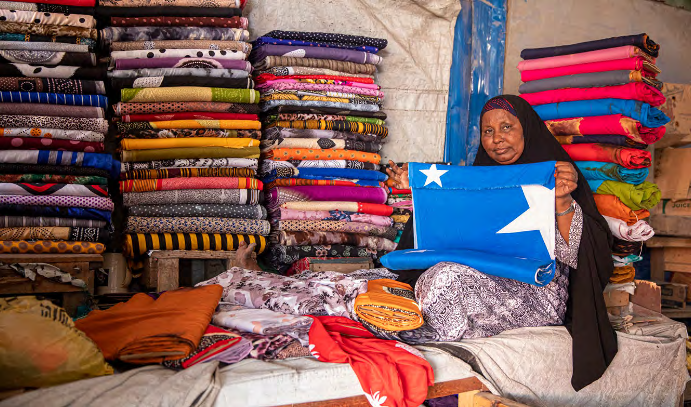

**Image 2 OCR + Description:**
```
**Image Description:**
The image shows a simple graphic representation of a page corner being curled or folded over from the top-right corner, revealing the backside of the page. The front of the page is black, and the curled corner is white with a subtle gradient shading that gives the appearance of a three-dimensional fold. 

There is no visible text or other key elements in the image. The design suggests a page-turn or page-flip effect, which could be symbolic of moving forward or revealing new information, fitting for an annual development report theme.
```


## Page 41
Ij!!!"!!46B*+$'.#*D'"&*@""'75*>/0%$#*KTKK
k:k!-$54!&PQNR!,QTUN
F!B@* <7()5)#7#/.* <%$/)-"* &)$/(#* )";/.#2/"#.* )"#%*
&/;/5%0)"-* (%'"#$)/.* :=* 0$%;)&)"-* -'7$7"#//.*
e0%5)#)(75* $).8* )".'$7"(/* 7"&* ($/&)#* /",7"(/2/"#f*
#%* )";/.#%$.* 7"&* 5/"&/$.H* F!B@* #$'.#* <'"&.* ,/50* #%*
/Z07"&*)#.*-'7$7"#//*V%$8*)"*(%'"#$)/.*7O/(#/&*:=*DEa*
V,/$/*F!B@*%0/$7#)%".*V%'5&*:/*%#,/$V)./*5)2)#/&H*
+V%*%<*)#.*<%'$*#$'.#*<'"&.*7$/*.0/()755=*&)$/(#/&*7#**
DEa*.)#'7#)%".H
N.#7:5).,/&* )"* KTIJ1* #,/! +MTScK\R! 4`X\RXU! VTU!
,PV]KcX! /\MTM[KXN! ,V\KcKRb! d+4,/,e! .'00%$#.*
F!B@*-'7$7"#//.*/Z(5'.);/5=*)"*DEa*(%"#/Z#.H*E@DND*
0$%;)&/.*7"*!")#)75*\%..*\7=/$*eD)$.#*7"&*G/(%"&*\%..*
\7=/$.f* %<* &%"%$* -$7"#.* 7"&* 7* (7557:5/* -'7$7"#//*
<$%2*&%"%$.H*F!B@*75.%*07$#)()07#/.*)"*#,/*D)$.#*\%..*
\7=/$*75%"-.)&/*E@DND*#%*#,/*/Z#/"#*&/#/$2)"/&*:=*
#,/*7-/"(=H*+,/*!")#)75*\%..*\7=/$*0$%;)&/.*0$%#/(#)%"*
<$%2*#,/*)")#)75*5%../.*%(('$$)"-*'"&/$*F!B@_.*E%"#$7(#*
%<*B'7$7"#//H*NZ(/..*5%..*7:%;/*#,/*!")#)75*\%..*\7=/$*
).*:%$"/*(%205/#/5=*:=*F!B@H*+,/*.'((/..*%<*E@DND*
5)/.*)"*)#.*7:)5)#=*#%*%O/$*7*,)-,*&/-$//*%<*5/;/$7-/*#%*)#.*
&%"%$.H*!#*,7.*#,'.*<7$*<7()5)#7#/&*F!B@*B'7$7"#//.*)"*
7*ICIT*$7#)%1*.'00%$#/&*]$);7#/*?)$/(#*F%:)5)M7#)%"*)"*
7*ICR*$7#)%1*7"&*#%#75*<)"7"()"-*7(#);)#=*)"*7*ICIQ*$7#)%H*
N.#7:5).,/&* )"* I[[Q1* #,/* EXNR! >VTJ! VTU! 5VtV!
&PQNR! ,QTU! dE>v5! &,e* /"(%'$7-/.* 0$);7#/* ./(#%$*
)";/.#2/"#*7"&*/(%"%2)(*&/;/5%02/"#*)"*#,/*4/.#*
67"8*7"&*B7M7*:=*%O/$)"-*0%5)#)(75*$).8*)".'$7"(/*#%*
:%#,* 5%(75* 7"&* <%$/)-"* )";/.#%$.H* !#* /Z#/"&.* F!B@_.*
%0/$7#)%".* #%* 7* "%"W2/2:/$* #/$$)#%$=* #,7#* ).* "%#*
/5)-):5/*<%$*<)"7"()"-*%$*-'7$7"#//.H*E'$$/"#5=*<'"&/&*
:=* (%"#$):'#)%".* <$%2* ^707"_.* F)").#$=* %<* D)"7"(/*
7"&*#,/*]75/.#)"/*\):/$7#)%"*Y$-7")M7#)%"1*#,/*46uB*
+D* (%;/$.* -'7$7"#//.* '"&/$V$)##/"* )"* #,/* 4/.#*
67"8*7"&*B7M7*<%$*#,/*<'55*72%'"#*%<*#,/*-'7$7"#//H*
G#7$#)"-* V)#,* 7"* )")#)75* 07)&W'0* (%"#$):'#)%"* %<* c'.#*
%;/$*dIP*2)55)%"1*#,/*46uB*+D*,7.1*.%*<7$1*.'00%$#/&*
#,/*)..'7"(/*%<*F!B@*-'7$7"#//.*V%$#,*dJJHKI*2)55)%"*
e-$%..fH*@.*%<*@0$)5*JT1*KTKK1*)#.*'"&/$V$)#)"-*(707()#=*).*
dKQH[Q*2)55)%"1*V)#,*#,/*)"($/7./*(%2)"-*<$%2*)"#/$/.#*
)"(%2/1*0$/2)'2.1*7"&*$/#'$".*%"*)";/.#2/"#.*.)"(/*
)#.*)"(/0#)%"H*
F!B@_.* %#,/$* #V%* #$'.#* <'"&.* ,7;/* 7* :$%7&/$*
/";)$%"2/"#75*
7"&*
.'.#7)"7:)5)#=*
<%('.H*
+,/*
'XTXgVacX! /TXP]b! +VRVcbNR! &PQNR! ,QTU! d'/+&,eB!
/.#7:5).,/&* )"* KTKI1* .'00%$#.* $/"/V7:5/* /"/$-=*
0$%c/(#.* 7"&* 7"()557$=* 0$%c/(#.* #,7#* 7$/* &)$/(#5=*
#)/&* #%* $/"/V7:5/* /"/$-=* e)H/H1* 2)")W-$)&* .=.#/2.1*
#$7".2)..)%"* .=.#/2.1* :7##/$=* .#%$7-/1* /#(HfH* !#*
0$%;)&/.* 7* ;7$)/#=* %<* $).8* 2)#)-7#)%"* 7"&* (707()#=*
#%%5.1* )"(5'&)"-* 7* <)$.#W5%..* <7()5)#=1* $/)".'$7"(/1*
-'7$7"#//*#/"%$*/Z#/".)%"1*5)b')&)#=*.'00%$#*e'"&/$*
&/;/5%02/"#f1*7"&*<)"7"()75*-$7"#.H
+,/* ,QTU! SMP! 4UWVT\KT]! 2QNRVKTVaKcKRb! d,42eB!
/.#7:5).,/&* )"* ^7"'7$=* KTKK1* &/5);/$.* #/(,")(75*
7..).#7"(/*#%*2)#)-7#/*$).8.*7"&*)20$%;/*&/;/5%02/"#*
)207(#.*%<*F!B@*0$%c/(#.H*!#*V)55*:/*&/05%=/&*#%*.'00%$#*
F!B@_.*(5)/"#.*)"*7$/7.*5)8/*(5)27#/1*-/"&/$1*<$7-)5)#=1*
/";)$%"2/"#75*7"&*.%()75*.#7"&7$&.1*7"&*(%$0%$7#/*
-%;/$"7"(/H*+,$%'-,*D@G1*F!B@*(7"*7&&$/..*.0/()<)(*
(,755/"-/.* <%$* 0$%c/(#.* 7($%..* 7* ;7$)/#=* %<* ./(#%$.1*
)"(5'&)"-* 7-$)('5#'$/1* 27"'<7(#'$)"-1* #/5/(%21* 7"&*
)"<$7.#$'(#'$/H*D@G*).*)"#/"&/&*#%*(%205/2/"#*F!B@_.*
/Z).#)"-* (707()#=* 7"&* 278/* )#.* 0$%&'(#* %O/$)"-.*
2%$/*7((/..):5/1*07$#)('57$5=*<%$*.2755*7"&*2/&)'2W*
.)M/&*)";/.#%$.H
k:I!,KTVT\KVc!$TRXP[XUKVPb!,QTUN
!"* 7&&)#)%"* #%* #,/* #,$//* ,/75#,W$/57#/&* D!D.* #,7#*
V/$/*&).('../&*)"*E,70#/$*K1*%#,/$*D!D.*7$/*278)"-*
)20%$#7"#* (%"#$):'#)%".* #%* 7&&$/..)"-* #,/* &$);/$.*
7"&*)207(#.*%<*DEa*7"&*#%*.#$/"-#,/")"-*(%'"#$)/._*
$/.)5)/"(/1* /.0/()755=* <%$* #,/)$* 2%.#* ;'5"/$7:5/* 7"&*
27$-)"75)M/&*0%0'57#)%".H*+,/*4%$5&*67"8*,%.#.*#,/*
./($/#7$)7#.*%<*./;/$75*D!D.*#,7#*,7;/*7*07$#)('57$*<%('.*
%"*.)#'7#)%".*7O/(#/&*:=*DEaH*+,/*4%$5&*67"8*).*75.%*
7"*)205/2/"#)"-*/"#)#=*<%$*#,/*<%55%V)"-*/Z7205/.1*
2/7")"-* #,7#* 67"8* #/72.* 7$/* )";%5;/&* )"* #,/*
0$/07$7#)%"1*&/.)-"1*7"&*)205/2/"#7#)%"*%<*0$%c/(#.*
7"&*7(#);)#)/.*<)"7"(/&*:=*#,/./*D!D.H*
+,/* 5cMaVc! 1VPRTXPNLKY! SMP! /UQ\VRKMT! d51/e* ,7.*
)205/2/"#/&*%"/*%<*#,/*57$-/.#*/Z#/$"75*7..).#7"(/*
0$%-$72.*&/&)(7#/&*#%*/&'(7#)%"*)"*$/.0%"./*#%*#,/*
EYa!?WI[* ($).).H* D$%2* )#.* dPTT* 2)55)%"* 7((/5/$7#/&*
<'"&)"-* V)"&%V* /.#7:5).,/&* )"* D`KTKT1* )#* ,7.**
0$%;)&/&*dSXQ*2)55)%"*)"*-$7"#.*#%*,/50*-%;/$"2/"#.*


## Page 42
JH*@&&$/..)"-*#,/*E,755/"-/.*%<*D$7-)5)#=1*E%"<5)(#1*7"&*a)%5/"(/!!!!"!!!!Ik
.'.#7)"* 5/7$")"-* <%$* '0* #%* JPP* 2)55)%"* (,)5&$/"* )"*
XX* (%'"#$)/.* 7"&* :')5&* 2%$/* $/.)5)/"#* /&'(7#)%"*
.=.#/2.H*B]N*,7.*75.%*)&/"#)<)/&*.'00%$#*#%*(%'"#$)/.*
7O/(#/&*:=*<$7-)5)#=*7"&*(%"<5)(#*7.*7*8/=*0$)%$)#=*#%*
$/7(,* (,)5&$/"* 2%.#* )"* "//&* %<* /&'(7#)%"* .'00%$#H*
!"* D`KTKK1* 2%$/* #,7"* %"/W#,)$&* eJS* 0/$(/"#f* %<* #,/*
07$#"/$.,)0_.* >N* &).:'$./2/"#.* %<* dIRI* 2)55)%"*
V/"#* #%* DEaW7O/(#/&* (%'"#$)/.H* B]N_.* %0/$7#)%"75*
<$72/V%$8*755%V.*)#*#%*$/&)$/(#*$/.%'$(/.*#%*0$)%$)#=*
7(#);)#)/.* 7$).)"-* <$%2* 7"* /2/$-/"(=H* @.* 7* $/.'5#1*
'0* #%* dJTT* 2)55)%"* )"* B]N* <'"&.* 7$/* 7;7)57:5/* #%**
.'00%$#* /&'(7#)%"* <%$* 755* (,)5&$/"* )"* @<-,7").#7"**
%;/$*#,/*"/Z#*#,$//*=/7$.H*
+,/*5cMaVc!+MT\XNNKMTVc!,KTVT\KT]!,V\KcKRb!d5+,,e!
0$%;)&/.* &/;/5%02/"#* .'00%$#* %"* (%"(/..)%"75*
#/$2.* #%* 2)&&5/W)"(%2/* (%'"#$)/.* )207(#/&* :=*
$/<'-//*($)./.*7($%..*#,/*V%$5&H*@.*.'(,1*)#*).*0$%;)&)"-*
(%"(/..)%"75* <)"7"()"-* #%* #V%* 4%$5&* 67"8* 0$%c/(#.*
)"* \/:7"%"C* #,/* G#$/"-#,/")"-* \/:7"%"_.* EYa!?WI[*
>/.0%"./*]$%c/(#*7"&*#,/*4,/7#*G'005=*N2/$-/"(=*
]$%c/(#1* V,)(,* ).* .7</-'7$&)"-* 7((/..* #%* 7O%$&7:5/*
:$/7&*<%$*0%%$*7"&*;'5"/$7:5/*,%'./,%5&.1*)"(5'&)"-*
$/<'-//.H* +,/./* 7(#);)#)/.* )"(5'&/* 0$%('$/2/"#* %<*
7&&)#)%"75* EYa!?WI[* ;7(()"/.* #%* (%;/$* #,/* /"#)$/*
0%0'57#)%"1* .#$/"-#,/")"-* #,/* ,/75#,* .=.#/2* <%$*
07"&/2)(* $/.0%"./1* 7"&* #7$-/#/&* )"#/$;/"#)%".*
#%* )"($/7./* ;7(()"/* '0#78/* :=* ;'5"/$7:5/* -$%'0.1*
)"(5'&)"-*$/<'-//.H*
N.#7:5).,/&*)"*KTIT*)"*$/.0%"./*#%*#,/*KTTQhKTTR*<%%&*
0$)(/*($).).1*#,/*5cMaVc!4]PK\QcRQPX!VTU!,MMU!2X\QPKRb!
1PM]PV[! d54,21e! ,/50.* #%* )20$%;/* #,/* $/.)5)/"(/*
7"&*.'.#7)"7:)5)#=*%<*7-$)('5#'$/*7"&*<%%&*.=.#/2.*)"*
#,/*V%$5&_.*0%%$/.#*(%'"#$)/.H*!#*0$%;)&/.*5%VW)"(%2/*
(%'"#$)/.1* 7-$):'.)"/../.1* 7"&* .2755,%5&/$* <7$2/$.*
V)#,*<)"7"()75*7"&*#/(,")(75*$/.%'$(/.*#%*&/.)-"*7"&*
)205/2/"#*0$%c/(#.*#,7#*.'00%$#*7(#);)#)/.*75%"-*#,/*
<%%&* ;75'/* (,7)"H* !#* V%$8.* #%* $/&'(/* <$7-2/"#7#)%"*
7"&*/"(%'$7-/*(%%$&)"7#)%"*7"&*8"%V5/&-/W.,7$)"-*
72%"-* &%"%$* 7"&* (5)/"#* (%'"#$)/.1* )"#/$"7#)%"75*
%$-7")M7#)%".1*EGY.1*iBY.1*7"&*#,/*0$);7#/*./(#%$H*!"*
D`KTKK1*752%.#*%"/W#,)$&*eK[*0/$(/"#f*%<*#,/*0$%-$72_.*
>N*&).:'$./2/"#.*%<*dPI*2)55)%"*V/"#*#%*DEaW7O/(#/&*
(%'"#$)/.H*+,/*B@DG]*).*('$$/"#5=*(%".)&/$)"-*%0#)%".*
#%*$/.0%"&*b')(85=*7"&*/O/(#);/5=*#%*#,/*<%%&*0$)(/*
($).).*7$).)"-*<$%2*#,/*V7$*)"*L8$7)"/H
k:O!2RMPKXN!SPM[!+MQTRPKXN
+,/* <%55%V)"-* .#%$)/.* <$%2* #,/* 4%$5&* 67"8* 7"&*
!DE* &/2%".#$7#/* #,/* ;7$)/#=* %<* V7=.* #$'.#* <'"&.*
,7;/* ,/50/&* (%'"#$)/.* 7O/(#/&* :=* DEa* &'$)"-* #,/*
57.#* <);/* =/7$.H* +,/=* 7$/* %$-7")M/&* 7$%'"&* <%'$*
&/;/5%02/"#*%'#(%2/.*#,/*4%$5&*67"8*B$%'0*,7.*
<%('./&* %"* &/5);/$)"-* #,$%'-,%'#* #,/* 07"&/2)(*
7"&* #,/* (%20%'"&)"-* /O/(#.* %<* (%"<5)(#1* (5)27#/**
(,7"-/1* 7"&* %#,/$* -5%:75* (,755/"-/.H* +,/./* .#%$)/.*
7$/*<'$#,/$*/Z07"&/&*)"*#,/*7877%Z$0'/..F%.V%1';(+L
V;*)$)%B$(;-+(:
240$%52!6$0/2
/TVacKT]! NMcVP! YMgXP! KT! 1VYQV! %Xg! 5QKTXV:*
6')5&)"-* %"* )#.* /Z0/$)/"(/* )205/2/"#)"-* #,/*
\)-,#)"-* B5%:75* 0$%-$72* 7$%'"&* #,/* V%$5&1* !DE*
V%$8/&* V)#,* 0$);7#/* ./(#%$* 07$#"/$.* #%* &/;/5%0* 7*
"/#V%$8* %<* 752%.#* JTT* /"#$/0$/"/'$.* 0$%;)&)"-*
%OW-$)&*.%57$*.=.#/2.*)"*]70'7*i/V*B')"/7*e]iBf1*
V,)(,*,7.*/"7:5/&*%;/$*KP*0/$(/"#*%<*#,/*0%0'57#)%"*
#%* 7((/..* /5/(#$)()#=* <%$* #,/* <)$.#* #)2/H* @.* .#7#/&* )"*
#,/* KTKI* )"&/0/"&/"#* /;75'7#)%"* %<* #,/* @'.#$75)7W
i/V* t/757"&W!DE* ]iB* ]7$#"/$.,)01* 3#,).* 0$%c/(#*
,7.* ($/7#/&* )20%$#7"#* )22/&)7#/* $/.'5#.* #,7#* 7$/*
;/$=*5)8/5=*#%*:/*.'.#7)"/&*7"&*#%*27-")<=*)#.*)207(#*
)"*#,/*=/7$.*#%*(%2/H9*+,/*)"#/"&/&*)207(#*%<*#,).*
0$%c/(#* ).* 7"* 7&&)#)%"75* JTT1TTT* 0/%05/* ,7;)"-*
7((/..* #%* )20$%;/&* )"<$7.#$'(#'$/* #V%* =/7$.* 7o/$*
0$%c/(#*(%205/#)%"H
1'(&/+&$%5!&./!1(('!4%)!!
-(2&!0*6%/'4>6/!
2QYYMPRKT]! RLX! [MNR! WQcTXPVacX! KT! 4S]LVTKNRVT:!
!"* ?/(/2:/$* KTKI1* #,/* 67"8* 7"&! 4S]LVTKNRVT!
'X\MTNRPQ\RKMT! &PQNR! ,QTU! d4'&,e* &%"%$.* 7-$//&*
#%*#$7".</$*dKRT*2)55)%"*%<*@>+D*<'"&.*#%*Li!END*7"&*
#,/*4%$5&*D%%&*]$%-$722/*#%*,/50*<)"7"(/*/../"#)75*
,/75#,* ./$;)(/.* 7"&* /2/$-/"(=* <%%&* 7..).#7"(/* 7.*
07$#*%<*#,/*)"#/$"7#)%"75*(%22'")#=_.*,'27")#7$)7"*
$/.0%"./* 7o/$* #,/* +75):7"* #78/%;/$H* 6/#V//"* @0$)5*
7"&* ^'"/* KTKK1* #,/* @>+D* &%"%$.* 7"&* #,/* 67"8*
700$%;/&* <%'$* %0/$7#)%".* #%#75)"-* dQ[S* 2)55)%"* <%$*
<%%&*./('$)#=1*5);/5),%%&.1*,/75#,*./$;)(/.1*7"&*iBY*
(707()#=*.'00%$#H*+,/./*%0/$7#)%".*7$/*)205/2/"#/&*
:=* D@Y1* LiY]G1* Li!END1* 7"&* Li?]1* $/.0/(#);/5=H*
+,).*
.'00%$#*
&/2%".#$7#/.*
#,/*
)"#/$"7#)%"75*
(%22'")#=_.* 5%"-W#/$2* (%22)#2/"#* #%* #,/* @<-,7"*
0/%05/1* '.)"-* #,/* @>+D* 7.* 7* 0$)27$=* 057#<%$2* <%$**
&%"%$*(%%$&)"7#)%"H
$$


## Page 43
II!!!!"!!!!46B*+$'.#*D'"&*@""'75*>/0%$#*KTKK
-VYYKT]!RLX!gVb!RM!\cXVT!XTXP]b!NRMPV]X!KT!>QPJKTV!
,VNM:*4)#,*7"*/5/(#$)<)(7#)%"*$7#/*%<*c'.#*KT*0/$(/"#*)"*
KTKT1*6'$8)"7*D7.%*.//8.*#%*7(,)/;/*'");/$.75*7((/..*
#%*/"/$-=*:=*KTKPH*!#*700$%7(,/&*!DE*#%*7../..*,%V*
0$);7#/*)";/.#2/"#*)"*/"/$-=*.#%$7-/*(%'5&*(%"#$):'#/*
#%*,)-,/$*5/;/5.*%<*.%57$*0%V/$*0$%&'(#)%"H*!"*KTKI1*!DE*
0$/07$/&*7*$%7&*270*.,%V)"-*#,7#*#,/*(%'"#$=*(%'5&*
&/;/5%0* '0* #%* QT* 2/-7V7##.* eF4fsKTT* 2/-7V7##*
,%'$.* eF4,f* :=* KTKP* :=* '#)5)M)"-* 7"* )"&/0/"&/"#*
:7##/$=*.#%$7-/*.=.#/2*e)W6NGGf*.%5'#)%"H*+,/*.=.#/2*
(%'5&* 0%#/"#)755=* .7;/* dIHP* 2)55)%"* #%* dJHJ* 2)55)%"*
7""'755=* )"* <%..)5* <'/5* 7"&* /"/$-=* )20%$#.* V,)5/*
$/&'()"-*(7$:%"*/2)..)%".H*!DE*).*('$$/"#5=*0$/07$)"-*
7"*)";/.#2/"#*/"-7-/2/"#*V)#,*#,/*-%;/$"2/"#*#%*
(%W&/;/5%0*7*KT*F4sST*F4,*)W6NGG*0$%c/(#H
$[YPMWKT]!NMcKU!gVNRX![VTV]X[XTR!KT!5VtV:!&LX!
5cMaVc!1VPRTXPNLKY!SMP!'XNQcRN?>VNXU!4YYPMV\LXN!
d51'>4e* ).* .'00%$#)"-* #,/* B7M7* G%5)&* 47.#/*
F7"7-/2/"#* ]$%c/(#1* V,)(,* :/"/<)#.* 752%.#* ,75<*
#,/* 0%0'57#)%"* %<* #,/* B7M7* .#$)0H* !#* ,7.* <)"7"(/&*
(%".#$'(#)%"*%<*7*"/V*.7")#7$=*57"&<)551*#V%*#$7".</$*
.#7#)%".1* 7"&* /b')02/"#* #%* /",7"(/* ./(%"&7$=*
V7.#/* (%55/(#)%"1* 2/&)(75* V7.#/* #$/7#2/"#1* 7"&*
<)"75* &).0%.75H* >/.'5#.W:7./&* <'"&)"-* <$%2* B]>6@1*
0$%;)&/&*7.*7&&)#)%"75*<)"7"()"-*<%$*#,/*0$%c/(#1*,7.*
://"* #7$-/#/&* #%V7$&* )20$%;)"-* %0/$7#)%".* 7"&*
27)"#/"7"(/*%<*#,/*"/V5=*(%".#$'(#/&*)"<$7.#$'(#'$/1*
#%* /".'$/* .%5)&* V7.#/* ).* /O)()/"#5=* 7"&* .'.#7)"7:5=*
27"7-/&H* B]>6@* .'00%$#* ,7.* )20$%;/&* .%5)&*
V7.#/* ./$;)(/* &/5);/$=* 7"&* .#$/"-#,/"/&* <)"7"()75*
.'.#7)"7:)5)#=* %<* #,/* .%5)&* V7.#/* ./$;)(/* 0$%;)&/$*
#,$%'-,*)20$%;/&*(%.#*$/(%;/$=H
-VKTNRPXV[KT]! NQNRVKTVacX! SMPXNR! [VTV]X[XTR!
KT! 6KaXPKV:! 4)#,* .'00%$#* <$%2* #,/! 4SPK\V! '/))x!!
1PM]PV[B* #,/* \):/$)7* D%$/.#* G/(#%$* ]$%c/(#* ).* ,/50)"-**
#%* $/&'(/* &/<%$/.#7#)%"* 7"&* <%$/.#* &/-$7&7#)%"*
#,$%'-,*7*,%5).#)(*700$%7(,H*!#*).*0$%#/(#)"-*;'5"/$7:5/*
0%0'57#)%".1*
($/7#)"-*
.'.#7)"7:5/*
5);/5),%%&*
75#/$"7#);/.1* 7"&* 0$%2%#)"-* (%22'")#=* 700$%7(,/.1*
$/-'57#%$=* $/<%$2.1* 7"&* )".#)#'#)%"75* .#$/"-#,/")"-H*
+,).*,7.*:$%'-,#*%;/$*7*2)55)%"*,/(#7$/.*%<*57"&*'"&/$*
.'.#7)"7:5/* 27"7-/2/"#* 0$7(#)(/.* 7"&* .#$/"-#,/"/&*
#,/* (707()#)/.* 7"&* $/.%'$(/.* <%$* 0$%#/(#/&* 7$/7.*
27"7-/2/"#* '")#.* 7"&* <%$/.#$=W$/57#/&* )".#)#'#)%".H*
D%$/.#* &V/55/$.* 7"&* './$.* "%V* ,7;/* :/##/$* 7((/..* #%*
"7#'$75* $/.%'$(/.* 7"&* #,/* 8"%V5/&-/1* 7../#.1* 7"&*
./$;)(/.*#%*/"-7-/*)"*.'.#7)"7:5/*5);/5),%%&.H
+QRRKT]!\VPaMT!X[KNNKMTNB!TMR!RPXXN!KT!-MtV[aKhQX:!
!"* ^'5=* KTKI1* F%M72:)b'/* :/(72/* #,/* <)$.#* (%'"#$=*
)"* #,/* V%$5&* #%* $/(/);/* 07=2/"#* <$%2* RLX! ,MPXNR!
+VPaMT! 1VPRTXPNLKY! ,V\KcKRb! d,+1,e* <%$* $/&'()"-*
/2)..)%".* #,$%'-,* c'$).&)(#)%"75* <%$/.#* 0$/./$;7#)%"H*
+,/* dXHS* 2)55)%"* 07=2/"#* ).* #,/* <)$.#* %<* <%'$* #,7#* V)55*
'"5%(8*'0*#%*dPT*2)55)%"*<%$*$/&'()"-*IT*2)55)%"*#%".*
%<* -$//",%'./* -7.* /2)..)%".* :=* KTKSH* U"%V5/&-/*
7"&* (707()#=* :')5&)"-* 0$%;)&/&* :=* #,/* DE]D* ,7.* 5/&*
#%* /",7"(/&* <%$/.#* 2%")#%$)"-* 7"&* 7* $%:'.#* :/"/<)#*
.,7$)"-*057"1*/".'$)"-*#,7#*755*.#78/,%5&/$.1*)"(5'&)"-*
!"&)-/"%'.* ]/%05/.* 7"&* 5%(75* (%22'")#)/.1* 7$/**
<7)$5=*$/V7$&/&H
D%$/.#*(%22'")#)/.*7$/*#,/*$/75*
V)""/$.*,/$/H*+,).*7-$//2/"#*V)55*
755%V*F%M72:)b'/*#%*./('$/*5%"-W
#/$2*<)"7"(/*#%*0$%;)&/*75#/$"7#);/.*
#%*&/<%$/.#7#)%"*7"&*$/V7$&*/O%$#.*
#%*2)#)-7#/*(5)27#/*(,7"-/1*$/&'(/*
0%;/$#=1*7"&*27"7-/*"7#'$75**
$/.%'$(/.*.'.#7)"7:5=H
?I$+$%[.0`;"6%A0"/0a$K%A"*"(+$'%.V%J0*)%0*)%
X*I"'.*6$*+K%A.a06/"`;$
PRINCE MOMO AND BILITY GERNINYAN / WORLD BANK


**Image 1 OCR + Description:**
```
**Image Description:**
The image layout features a group of six individuals standing closely together in a natural outdoor setting, likely a forest or wooded area. The background is filled with green foliage and tall trees, indicating a lush environment.

Key elements:
1. Six people are standing in a row, posing for the photograph.
2. Most individuals are dressed in uniforms suggesting they could be forest rangers, park wardens, or involved in environmental conservation activities.
3. One person, second from the left, is wearing a black t-shirt with the word "RANGER" prominently displayed in white letters on the front.
4. Some individuals have accessories such as binoculars, a cap, and what appears to be walkie-talkies or communication devices, further suggesting their role related to patrolling or monitoring the forest.

There is no text in the image other than the word "RANGER" on the black t-shirt.

This image likely highlights the team responsible for forest protection or conservation efforts, making it suitable for inclusion in an annual development report focusing on environmental or wildlife management activities.
```
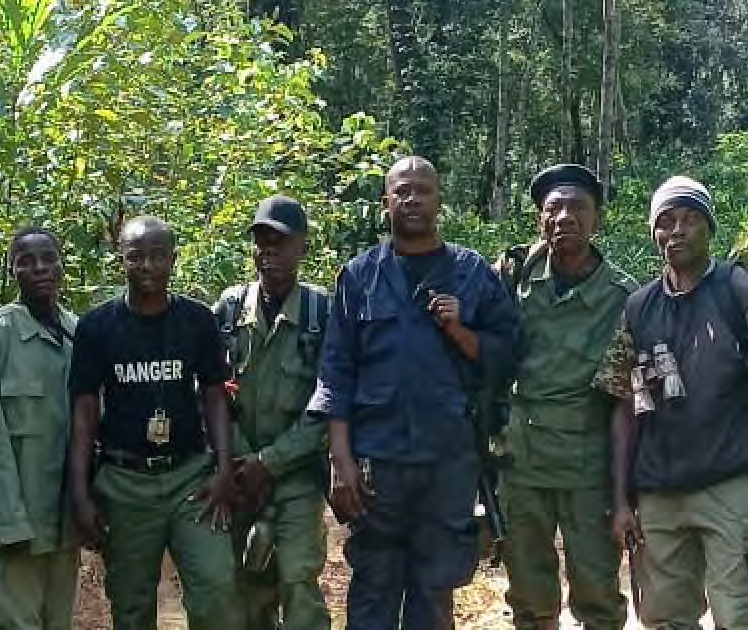

**Image 2 OCR + Description:**
```
**Image Description:**
The image shows a page with a curled top-right corner, suggesting a page being turned or peeled back. The page has a white background with the word "CONTENTS" centered vertically and horizontally in a bold, black font. The curled corner reveals a black area behind the white page, enhancing the visual effect of a page-turn or reveal. There are no other visible elements or text on this image.

This layout is clean and minimalistic, typically used as a contents or index page in an annual development report or similar document.
```


## Page 44
JH*@&&$/..)"-*#,/*E,755/"-/.*%<*D$7-)5)#=1*E%"<5)(#1*7"&*a)%5/"(/!!!!"!!!!IO
/TVacKT]! PMMyMY! NMcVP! YMgXP! KT! EXNR! >VTJ!
VTU! 5VtV:* +,/* 4/.#* 67"8* )20%$#.* [[* 0/$(/"#* %<*
)#.* /5/(#$)()#=* <$%2* !.$7/51* V,)5/* B7M7* )20%$#.* XS*
0/$(/"#H*!"*KTKT1*!DE*.)-"/&*7*5%7"*7-$//2/"#*V)#,*
#,/*F7..7&/$*(%207"=*#%*&/;/5%0*7"&*<)"7"(/*#,/*
(%".#$'(#)%"*%<*7*KKhKP*F4*&).#$):'#/&*.%57$*.=.#/2*
#,7#*V)55*/",7"(/*#,/*$/"/V7:5/*/"/$-=*./(#%$*7"&*
7&&$/..* (,$%")(* 0%V/$* .,%$#7-/.* 7"&* :57(8%'#.* )"*
#,/*4/.#*67"8H*L"&/$*#,/*F7..7&/$*G(,%%5*>%%o%0*
]a*]$%-$721*'0*#%*PTT*.(,%%5.*7$/*:/)"-*%'#<)##/&*V)#,*
.%57$*07"/5.*#%*.'00%$#*'")"#/$$'0#/&1*(5/7"*/"/$-=*
V,)5/*.#'&/"#.*7$/*)"*(57..H*!DE*,7.*(%205/#/&*)")#)75*
.#$'(#'$75* 7../..2/"#.* %<* #,/* .(,%%5.* 7"&* ./5/(#/&*
7"*%V"/$*/"-)"//$*#%*7'-2/"#*#/(,")(75*7"&*0$%c/(#*
/Z/('#)%"*(707()#=H*4,/"*(%205/#/&1*#,/*0$%c/(#*V)55*
0$%;)&/* $/5)7:5/1* (5/7"* 0%V/$* <%$* 2%$/* #,7"* IX1TTT*
,%'./.*7"&*:'.)"/../.*7($%..*#,/*4/.#*67"8H
/%2*'$%5!2*2&4$%4>6/!>*2$%/22!
5'(E&.!4%)!u(>!+'/4&$(%!
/[YMgXPKT]!gM[XT!N[VccLMcUXP!SVP[XPN!KT!+zRX!
U_$WMKPX:!@-$)('5#'$/*7((%'"#.*<%$*7:%'#*7*b'7$#/$*%<*
Eq#/*&_!;%)$/_.*B?]*7"&*752%.#*,75<*%<*)#.*/205%=2/"#H*
4%2/"* <7$2/$* (%%0/$7#);/.* %o/"* 57(8* 7((/..* #%*
<)"7"()75*#$7)")"-1*27$8/#*8"%V5/&-/1*7"&*.#7"&7$&.1*
V,)(,*(7"*5)2)#*#,/)$*)"(%2/.*7"&*-$%V#,*%00%$#'")#=H*
!"* 07$#"/$.,)0* V)#,* #,/* @<$)(7"* ?/;/5%02/"#* 67"81*
!DE* 57'"(,/&* 7"* 7&;).%$=* 0$%c/(#* )"* KTKI* #%* :%%.#*
#,/* 0$%</..)%"75* (707()#)/.1* )"(%2/.1* 7"&* 7((/..*
#%*<)"7"(/*%<*!;%$)7"*V%2/"*.2755,%5&/$*<7$2/$.*)"*
#,/*.#705/*<%%&*./(#%$H*!#*,7.*(%"&'(#/&*7*&//0*&);/*
27$8/#* .#'&=* %"* #,$//* .#705/* ($%0.* 7"&* 7"75=M/&*
#,/*8/=*:7$$)/$.*<%$*V%2/"W5/&*(%W%0.H*+,/*0$%c/(#*
0$%;)&/.* (707()#=* :')5&)"-* <%$* <)"7"()75* )".#)#'#)%".*
#%*5/"&*#%*V%2/"W5/&*(%W%0.*7"&*)#*,7.*&/;/5%0/&*
:'.)"/..* 2%&/5.* <%$* (7..7;71* 27)M/1* 7"&* 057"#7)"**
0$%(/..)"-*'")#.H*
*TcM\JKT]! SKTVT\KT]! SMP! gM[XT! XTRPXYPXTXQPN!
KT! %K]XPKV:* Y"/* %<* #,/* :)--/.#* ,)"&$7"(/.* #%* #,/*
-$%V#,* %<* 4GFN.* ,7.* ://"* 7((/..* #%* <)"7"(/1*
/Z7(/$:7#/&* :=* -/"&/$* :)7./.* 7"&* .#$)(#* (%557#/$75*
$/b')$/2/"#.H*!"*07$#"/$.,)0*V)#,*@((/..*67"8*7"&*
$$$
#,/*?/;/5%02/"#*67"8*%<*i)-/$)71*#,/*4%$5&*67"8_.*
EM[XT! /TRPXYPXTXQPN! ,KTVT\X! $TKRKVRKWX! dEX?,Ke*
0$%-$72* 0$%;)&/&* 7&;).%$=* ./$;)(/.* #%* )205/2/"#*
7* &)-)#75* (7.,* <5%VW:7./&* 5/"&)"-* 0$%&'(#* #,7#*
,7.* 0$%;)&/&* d[HR* 2)55)%"* )"* 7&&)#)%"75* <)"7"()"-*
#%* %;/$* I1XPT* 4GFN.H* +,/* 67"8_.* 4/WD)* #/72* 75.%*
,/50/&*57'"(,*#,/*6'.)"/..*G'00%$#*D7()5)#=*5/"&)"-*
057#<%$21* )"* 07$#"/$.,)0* V)#,* G#/$5)"-* 67"8H* +,/./*
)""%;7#);/*.%5'#)%".*7$/*0$%;)&)"-*5)</5)"/.*#%*V%2/"*
/"#$/0$/"/'$.* 7"&* ,/50)"-* #%* 7((/5/$7#/* :'.)"/..*
-$%V#,*7"&*/205%=2/"#H*
+,/*/7./*%<*.(75)"-*'0*2=*:'.)"/..*
#,$%'-,*#,/*)"#/"./*07"&/2)(*=/7$*
(%'5&*%"5=*:/*27&/*0%..):5/*#,$%'-,*
#,/*.'00%$#*%<*@((/..*67"8H*D7(/#758*
V7.*7:5/*#%*#78/*#,/*5/70*%<*%0/")"-*7*
"/V*%'#5/#*&'$)"-*#,/*07"&/2)(H
30*"6.F;6%M-.-0)$K%3.;*)$'%.V%30#$+0-F%%
E$0;+OK%]">$'"0
$[YPMWKT]! -2-/_N! V\\XNN! RM! SKTVT\X! KT! 2M[VcKV:!
+,/* G%275)7* FGFN* D)"7"()"-* D7()5)#=* 7"&* ?)-)#75*
G/$;)(/.*>/7&)"/..*G'00%$#*7(#);)#=1*<)"7"(/&*:=*#,/*
+M[YXRKRKWX! $TUQNRPKXN! VTU! $TTMWVRKMT! 1PM]PV[!
d+$$1eB*.'00%$#/&*#,/*&/.)-"*7"&*)205/2/"#7#)%"*%<*
7*EYa!?WI[*/"#/$0$)./*.'$;/=*#%*2%")#%$*#,/*)207(#*
%<*#,/*EYa!?WI[*07"&/2)(*%"*G%275)*/"#/$0$)./.*7"&*
)"<%$2*#,/*0%5)(=*$/.0%"./*#%*.'00%$#*0$);7#/*./(#%$*
$/(%;/$=H* +,/* .'$;/=* <)"&)"-.* &)$/(#5=* )"<%$2/&* #,/*
.(75/W'0* %<* 7"* 70/Z* FGFN* <)"7"()"-* <7()5)#=* :/)"-*
.'00%$#/&* :=* 7* 4%$5&* 67"8* 5/"&)"-* %0/$7#)%"* #%*
)20$%;/* 7((/..* #%* <)"7"(/* <%$* FGFN.* 7"&* 57$-/*
<)$2.H*+,/*.'$;/=*,/50/&*:$)"-*7&&)#)%"75*<)"7"()"-*
#%*#V%*%<*#,/*<7()5)#=_.*<)"7"()"-*V)"&%V.*#%*2)#)-7#/*
07"&/2)(W$/57#/&* 5)b')&)#=* .,%$#7-/.* )"* ;'5"/$7:5/*
:'#*;)7:5/*<)$2.H


## Page 45
If!!!!"!!!!46B*+$'.#*D'"&*@""'75*>/0%$#*KTKK
-VJKT]!QPaVT!\XTRXPN!\cK[VRX!PXNKcKXTR!KT!AX[XT:*
+,/*();)5*(%"<5)(#*)"*`/2/"*.)"(/*KTIP*,7.*&727-/&*
'$:7"* )"<$7.#$'(#'$/* 7"&* 5/o* #V%W#,)$&.* %<* #,/*
0%0'57#)%"*V)#,%'#*7((/..*#%*.7</*V7#/$1*.7")#7#)%"1*
7"&* %#,/$* /../"#)75* ./$;)(/.H* +,/* 67"8_.* `/2/"*
!"#/-$7#/&* L$:7"* G/$;)(/.* N2/$-/"(=* ]$%c/(#* !!* ).*
,/50)"-* #%* $/.#%$/* '$:7"* )"<$7.#$'(#'$/* ./$;)(/.* )"*
IX* `/2/")* ()#)/.H* +%* ,/50* )205/2/"#* #,/* 0$%c/(#1*
#,/*
wQVcKRb!
$TSPVNRPQ\RQPX!
$TWXNR[XTR!
dw$$e!
1VPRTXPNLKY* 0$%;)&/&* 7* -$7"#* #%* .'00%$#* (5)27#/*
7../..2/"#.*)"*#,/./*()#)/.H*+,/*-$7"#*75.%*0$%;)&/&*
#$7)")"-* #%* :')5&* #,/* (707()#=* 7"&* 7V7$/"/..* %<*
2'")()075*%O)(/$.1*8/=*5)"/*2)").#$)/.1*7"&*#,/*0$);7#/*
./(#%$*%"*)"(%$0%$7#)"-*(5)27#/*$/.)5)/"(/*)"#%*#,/)$*
)"<$7.#$'(#'$/*057"")"-*7"&*&/.)-"H
$0 2&'/%5&./%$%5!1(6$+$/2B!
$%2&$&*&$(%2B!4%)!$%0/2&-/%&2!!
,('!'/>*$6)$%5!>/&&/'!
>QKcUKT]! PXNKcKXT\X! KT! .VKRK_N! ]VP[XTR! KTUQNRPb:!
!DE_.* E$/7#)"-* !";/.#2/"#* Y00%$#'")#)/.* )"* j7)#)*
0$%c/(#* ).* &/.)-"/&* #%* $/;);/* #,/* -7$2/"#* ./(#%$*
#,$%'-,* c%:* $/#/"#)%"* )"* #,/* 2/&)'2* #/$21* 7"&*
.'00%$#* )";/.#2/"#* -/"/$7#)%"* 7"&* c%:* ($/7#)%"H* !#*
).*V%$8)"-*V)#,*)"&'.#$=*7..%()7#)%".*7"&*(%207")/.*
#%* -/"/$7#/* )";/.#2/"#* (%22)#2/"#.* )"* #,/* #/Z#)5/*
)"&'.#$=* 7"&* 0$%2%#/* j7)#)* 7.* 7* &/.#)"7#)%"* <%$*
)";/.#%$.1* .'00%$#)"-* )#.* 5%"-W#/$2* .'.#7)"7:5/*
-$%V#,H* !"* 7&&)#)%"* #%* .%5;)"-* #,/* :%##5/"/(8.* %<*
#,/*-7$2/"#*./(#%$1*!DE*).*7..).#)"-*#,/*B%;/$"2/"#*
%<* j7)#)* )"* )20$%;)"-* 7o/$(7$/* ./$;)(/.* #%* /Z).#)"-*
)";/.#%$.* 7"&* %'#$/7(,* #%* "/V* )";/.#%$.* )"* #,/*
7007$/5*./(#%$1*)"(5'&)"-*.'00%$#*#%*#,/*0$);7#/*./(#%$*
)"*&/;/5%0)"-*#,/)$*:'.)"/../.H
OLLIVIER GIRARD / THE GLOBAL FINANCING FACILITY


**Image 1 OCR + Description:**
```
**Image Description:**
The image depicts a group of women, most of whom are wearing various colored hijabs or headscarves, engaged in what appears to be a lively discussion or community meeting outdoors. The women are dressed in long robes or dresses in different colors such as light pink, black with a red hijab, blue, white, and maroon. One woman in a blue hijab is wearing a face mask and holding a mobile phone. Two women are seated at a simple wooden table with papers on it, and the rest are standing around them, seemingly focused on the conversation.

The setting includes a brownish wall with a fence topped with barbed wire in the background, giving the impression of an enclosed or secured area. There are trees providing dappled sunlight and shade.

There is no visible text in the image. The scene's arrangement suggests a community or development meeting, possibly discussing plans or issues pertinent to the group, fitting a context appropriate for an annual development report.
```
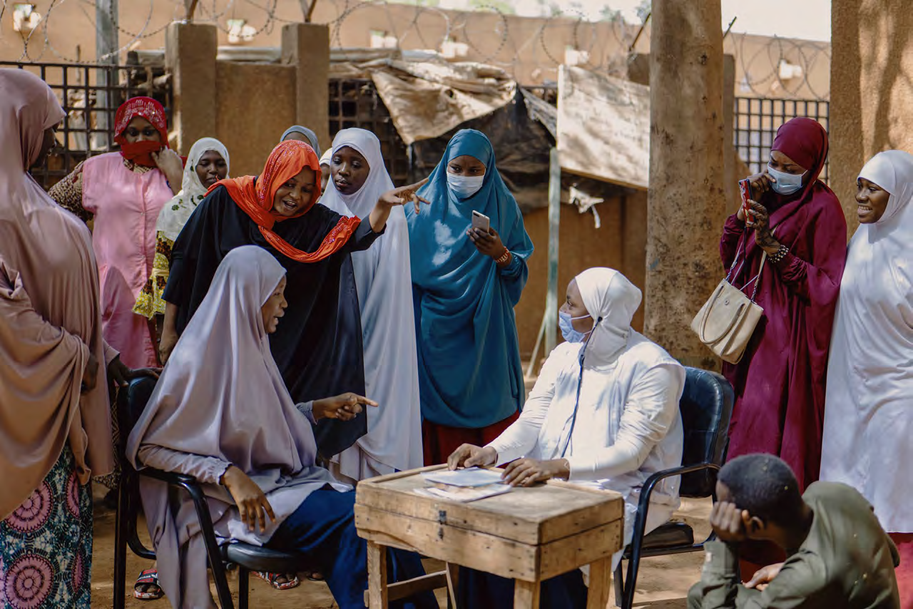

**Image 2 OCR + Description:**
```
**Image Description:**
The image shows a single page designed to look like it is being folded or turned from the bottom right corner, revealing a silver or gray underside. The background of the page is black, creating a strong contrast with the white front of the page and the gray fold. There is no text or other elements visible on the page itself. The overall appearance suggests a visual metaphor for revealing or turning a new page, which is fitting for an annual development report.
```


## Page 46
JH*@&&$/..)"-*#,/*E,755/"-/.*%<*D$7-)5)#=1*E%"<5)(#1*7"&*a)%5/"(/!!!!"!!!!Ii
2RPXT]RLXTKT]!SKTVT\KVc!PXNYMTNX!RM!LQPPK\VTXN!KT!
uV[VK\V:! !"* ^'5=* KTKI1! RLX! 5cMaVc! 'KNJ! ,KTVT\KT]!
,V\KcKRb! d5'K,e* .'00%$#/&* #,/* B%;/$"2/"#* %<*
^727)(7* )"* ./('$)"-* 7* (7#7.#$%0,/* :%"&* 0$%;)&)"-*
)".'$7"(/*(%;/$7-/*V%$#,*dIRP*2)55)%"*<%$*#,/*KTKI1*
KTKK1* 7"&* KTKJ* ,'$$)(7"/* ./7.%".H* !<* #$)--/$/&1* #,/*
(7#7.#$%0,/* :%"&* V%'5&* 07=* %'#* V)#,)"* V//8.H*
+,).* (%205/2/"#.* ^727)(7_.* /Z).#)"-* 0%$#<%5)%*
%<* &).7.#/$* $).8* <)"7"()"-* )".#$'2/"#.1* V,)(,*
)"(5'&/.*7*(%"#)"-/"(=*<'"&1*(%"#)"-/"#*($/&)#1*7"&*
.%;/$/)-"*(7#7.#$%0,/*)".'$7"(/*<$%2*#,/*E7$)::/7"*
E7#7.#$%0,/* >).8* !".'$7"(/* D7()5)#=H* ^727)(7* ).* #,/*
<)$.#* .2755* ).57"&* .#7#/* #%* )"&/0/"&/"#5=* .0%".%$*
7* (7#7.#$%0,/* :%"&H* @((%$&)"-* #%* D)#(,* $7#)"-1* #,).*
.)-")<)(7"#5=*.#$/"-#,/"/&*^727)(7_.*"7#'$75*&).7.#/$*
$).8*2)#)-7#)%"*.#$7#/-=H
>MMNRKT]!RV^!\M[YcKVT\X!KT!DMNMWM:*!20$%;)"-*#,/*
b'75)#=*%<*#,/*#7Z07=/$*$/-).#$=*).*($)#)(75*<%$*U%.%;%*
#%* $/&'(/* )"<%$275)#=* 7"&* :%%.#* #7Z* $/;/"'/.H**
+,/* U%.%;%* N",7"()"-* #,/* v'75)#=* 7"&* G(%0/* %<**
+7Z* >/-).#$7#)%"* eNvG+>f* 7&;).%$=* ./$;)(/.1* <'"&/&*
:=* #,/* 5cMaVc! &V^! 1PM]PV[! d5&1eB! ,7.* 5/&* #%* #,/*
)"#$%&'(#)%"* %<* 7* 5/-75* :7.).* <%$* )205/2/"#)"-*
/W.)-"7#'$/.* 7.* 7* 0$/(%"&)#)%"* <%$* &)-)#)M)"-* #,/*
:'.)"/..*7"&*#7Z07=/$*$/-).#$=H*Y#,/$*7(,)/;/2/"#.*
)"(5'&/* /.#7:5).,)"-* 7* ?7#7* G,7$)"-* D%$'2* #%*
.#$/"-#,/"*
&7#7*
/Z(,7"-/*
7"&*
)"#/$W7-/"(=*
(%%0/$7#)%"1*&/;/5%0)"-*7*#7Z*-70*2%&/51*7"&*$7).)"-*
7V7$/"/..*%"*#,/*7&;7"#7-/.*%<*$/&'(/&*)"<%$275)#=H
2QYYMPRKT]! cX]Vc! PXSMP[N! RM! YPMRX\R! gM[XT!
VTU! ]KPcN! KT! %K]XP:! 4)#,* .'00%$#* <$%2* #,/! 5cMaVc!
,KTVT\KT]! ,V\KcKRb! SMP! EM[XTB! +LKcUPXTB! VTU!
4UMcXN\XTRN! d5,,eB* #,/* 4%$5&* 67"81* 7"&* %#,/$*
07$#"/$.1*#,/*-%;/$"2/"#*%<*i)-/$*,7.*/"-7-/&*V)#,*
(%22'")#)/.*#%*#7(85/*/7$5=*27$$)7-/.*7"&*$/<%$2*)#.*
5/-75*<$72/V%$8*#%*755%V*27$$)/&*7&%5/.(/"#*-)$5.*#%*
.#7=*)"*.(,%%5*7"&*7((/..*<72)5=*057"")"-*./$;)(/.H*@.*
7*$/.'5#1*-)$5.*7$/*"%V*5/..*5)8/5=*#%*&$%0*%'#*%<*.(,%%5*
:/(7'./*%<*0$/-"7"(=*7"&*7$/*-);/"*7*<7)$/$*(,7"(/*#%*
5);/*,/75#,)/$1*2%$/*0$%&'(#);/*5);/.H*+,/*BDD*).*75.%*
0$%;)&)"-*.)2)57$*.'00%$#*#%*6/")"1*E72/$%%"1*7"&*
Eq#/*&_!;%)$/*7.*07$#*%<*)#.*B/"&/$*>%7&270H
2RPXT]RLXTKT]! SKTVT\KVc! PXNKcKXT\X! RM! UKNVNRXPN! KT!
&MT]V:!+/(,")(75*7..).#7"(/*0$%;)&/&*:=*#,/!1V\KSK\!
+VRVNRPMYLX! 'KNJ! 4NNXNN[XTR! VTU! ,KTVT\KT]!
$TKRKVRKWX! d1+'4,$e* 7)2.* #%* )"($/7./* #,/* <)"7"()75*
$/.)5)/"(/*%<*]7()<)(*!.57"&*(%'"#$)/.*7-7)".#*"7#'$75*
,7M7$&.* 7"&* #,/)$* (707()#=* #%* 2//#* 0%.#W&).7.#/$*
<'"&)"-* "//&.H* +,).* ,/50/&* +%"-7* :/(%2/1* )"* F7=*
KTKI1*#,/*<)$.#*(%'"#$=*)"*#,/*]7()<)(*$/-)%"*#%*7&%0#*7*
&).7.#/$*$).8*<)"7"()"-*.#$7#/-=*e?>DGfH*+,7"8.*#%*#,).*
7..).#7"(/*7"&*%"-%)"-*(%557:%$7#)%"*V)#,*#,/*@.)7"*
?/;/5%02/"#* 67"81* #,/* B%;/$"2/"#* %<* +%"-7* ).*
"%V*)205/2/"#)"-*./;/$75*?>DG*7(#);)#)/.1*)"(5'&)"-*
7&70#);/*.%()75*0$%#/(#)%"1*$).8*)&/"#)<)(7#)%"1*7"&*#,/*
$/;)/V*%<*+%"-7_.*i7#)%"75*N2/$-/"(=*D'"&H*


**Image 1 OCR + Description:**
```
**Image Description:**
The image appears to be a page from an annual development report. The layout features a clean, modern design with a mix of text and visual elements.

Key elements include:
1. A title near the top left that says "Annual Development Report."
2. A large block of text beneath the title, likely a summary or introduction.
3. On the right, there is a large graphic or photo overlaying a textured background, which includes trees and some gold confetti-like dots.
4. The bottom part of the page contains several months listed vertically with brief descriptions or milestones next to each month, such as "JAN," "FEB," "MAR," and so on, representing a timeline of events or achievements across the year.

The overall design combines neutral earth-toned backgrounds with crisp white text blocks and gold accents, aiming to convey professionalism and growth.
```


## Page 47
Iq!!!!"!!!!46B*+$'.#*D'"&*@""'75*>/0%$#*KTKK
GAJENDRA SHRESTHA / ZOOM PHOTOGRAPHY CENTER, KATHMANDU 


**Image 1 OCR + Description:**
```
**Image Description:**
The image depicts a lively outdoor scene featuring a group of school children dressed in light blue shirts and dark blue pants or skirts, typical of school uniforms. The children are actively engaged with each other, with some standing, walking, and two children in wheelchairs being pushed by their peers. 

Key elements include:
- Children holding hands, symbolizing friendship and support.
- The two wheelchairs, which stand out prominently in the foreground, promoting inclusivity.
- A yellow school bus parked in the background on the left side.
- Trees and greenery in the background, suggesting the setting is a schoolyard or nearby area.
- Other children and a few adults further in the background, indicating a busy, communal environment.

There is no visible text on the image. The overall tone conveys a sense of community, inclusivity, and active participation among children of diverse abilities, aligning well with themes often highlighted in an annual development report related to education, inclusivity, or community development.
```


## Page 48
SH*B/"/$7#)"-*U"%V5/&-/*%"*E$).).*>/.0%"./*7"&*>/(%;/$=**!!"!!!!IZ
4. GENERATING KNOWLEDGE ON  
CRISIS RESPONSE AND RECOVERY
U"%V5/&-/* ).* ;)#75* )"* #,/* 4%$5&* 67"8* B$%'0_.*
2)..)%"* %<* .'00%$#)"-* 0%;/$#=* $/&'(#)%"* 7"&*
7(,)/;)"-* )"(5'.);/1* .'.#7)"7:5/* -$%V#,H* +,/* 67"8*
B$%'0_.*$/.0%"./*#%*#,/*EYa!?WI[*($).).*/";).7-/.*7*
.)-")<)(7"#*$%5/*<%$*8"%V5/&-/*7"&*7&;).%$=*./$;)(/.*
#%*,/50*-%;/$"2/"#.1*0$);7#/*./(#%$*7"&*();)5*.%()/#=*
:/##/$* '"&/$.#7"&* 7"&* 7&70#* #%* (,7"-/* 7"&* :')5&*
:7(8*:/##/$1*7.*V/55*7.*&/.)-"*0%5)(=*$/.0%"./.*7"&*
)"#/$;/"#)%".* 7#* #,/* (%22'")#=1* "7#)%"751* $/-)%"75*
7"&*-5%:75*5/;/5.HIK*+,).*(,70#/$*$/;/75.*#,/*.)-")<)(7"#*
$%5/* #,7#* #$'.#* <'"&.* ,7;/* 057=/&* )"* #,/* -/"/$7#)%"*
7"&*'./*%<*8"%V5/&-/*)"*$/.0%"./*#%*#,/*EYa!?WI[*
($).).*7"&*(%20%'"&)"-*-5%:75*(,755/"-/.H
+,/*4%$5&*67"8*B$%'0*).*7*5/7&/$*)"*#,/*-/"/$7#)%"*7"&*
&)../2)"7#)%"*%<*&/;/5%02/"#*8"%V5/&-/*0$%&'(#.*
7"&* ./$;)(/.H* !#* ,7.* 0)%"//$/&* 7"75=#)(75* V%$8* %"*
)..'/.* $7"-)"-* <$%2* /(%"%2)(* -$%V#,* #%* 0%;/$#=*
7"&* )"/b'75)#=* 2/7.'$/2/"#* #%* -%;/$"7"(/* 7"&*
./$;)(/*&/5);/$=H*!#*75.%*(%"&'(#.*)207(#*/;75'7#)%".*
7"&*$7"&%2)M/&*(%"#$%5*#$)75.*7"&*0$%&'(/.*7*V)&/*
;7$)/#=* %<* -5%:75* 0':5)(* 8"%V5/&-/* -%%&.1* .'(,* 7.*
-5%:755=*.#7"&7$&)M/&*&7#7*%"*,%'./,%5&.1*0%;/$#=1*
7"&*&/:#H*+,/*67"8*B$%'0*:/7$.*#,/*(%.#.*7"&*.,7$/.*
$/.'5#.*72%"-*(%'"#$)/.*7"&*&/;/5%02/"#*07$#"/$.*
#%*.'00%$#*:/##/$*&/;/5%02/"#*%'#(%2/.H
IK**4%$5&*67"8*B$%'0H*^'"/*KTKTH*H0I"*>%J"I$(K%H#0-"*>L;5%?650#+%0*)%,$++"*>%E0#F%.*%1'0#FK*46B*E%;)&WI[*>/.0%"./*@00$%7(,**
]70/$1*0H*JJH
IJ**G#/0,/"*U"7(81*6$7&/5=*EH*]7$8.1*@")*j7$'#='"=7"1*7"&*F7##,/V*?)\%$/"M%H*@0$)5*KTKTH*U.<%4.$(%+C$%D.'-)%E0*F%?*V-;$*#$%+C$%
4$I$-.56$*+%&'".'"+"$(%.V%J.<L?*#.6$%0*)%J.<$'LA"))-$%?*#.6$%@.;*+'"$(1*]%5)(=*>/./7$(,*4%$8)"-*]70/$*[KKPH
+,/*67"8*B$%'0_.*'")b'/*(%207$7#);/*7&;7"#7-/*5)/.*
)"*#,/*.="/$-)/.*:/#V//"*8"%V5/&-/*7"&*<)"7"()"-1*
V,/$/*8"%V5/&-/*.'00%$#.*#,/*&/.)-"*%<*%0/$7#)%".*
#,/* 67"8* B$%'0* <)"7"(/.1* 7"&* #,/./* %0/$7#)%".1*
)"* #'$"1* -/"/$7#/* 8"%V5/&-/* 7:%'#* V,7#* V%$8.1*
)"<%$2)"-*.':./b'/"#*%0/$7#)%".H*@.*7"*)"&/0/"&/"#*
-/"/$7#%$*7"&*:$%8/$*%<*-5%:75*8"%V5/&-/1*#,/*67"8*
B$%'0* (%227"&.* (%";/")"-* 0%V/$* #,7#* 755%V.* )#*
#%* )"<%$2* &/;/5%02/"#* 0%5)(=* 278/$.* 7"&* #78/* 7*
5/7&*$%5/*)"*./##)"-*#,/*7-/"&7*<%$*-5%:75*&).('..)%".**
%"*&/;/5%02/"#H*
]7$#)('57$5=* )"* #)2/.* %<* ($).).* 5)8/* #,/* EYa!?WI[*
07"&/2)(1*#,/*67"8*B$%'0*/"&/7;%$.*#%*.#$/"-#,/"*
)#.*$%5/*7.*7*.%5'#)%".*:7"8*#,7#*(%2:)"/.*<)"7"()"-*
V)#,* -5%:75* 8"%V5/&-/* #%* -/"/$7#/* &/;/5%02/"#*
.%5'#)%".* )"* 7* #)2/5=1* 0'$0%./<'51* 7"&* )"#/-$7#/&*
27""/$H*>/(/"#*$/./7$(,*,7.*&/2%".#$7#/&*#,7#*#,/*
4%$5&*67"8_.*"%"W5/"&)"-*)".#$'2/"#.*7$/*/;/"*2%$/*
/O/(#);/*#,7"*)#.*5/"&)"-*)".#$'2/"#.*)"*)"<5'/"()"-*
#,/*0%5)(=*0$)%$)#)/.*%<*(5)/"#*(%'"#$)/.1*7O/(#)"-*"%#*
%"5=*#,/*&)$/(#)%"*%<*-%;/$"2/"#*0%5)(=1*:'#*75.%*)#.*
&/.)-"* 7"&* )205/2/"#7#)%"HIJ* +,/$/<%$/1* $%'-,5=*
%"/* =/7$* 7o/$* #,/* EYa!?WI[* 07"&/2)(* .#7$#/&1* #,/*
67"8* B$%'0* 7$#)('57#/&* 7* "/V* .#$7#/-)(* <$72/V%$8*
<%$*)#.*8"%V5/&-/*V%$81*V,)(,1*72%"-*%#,/$*#,)"-.1*
(57..)<)/.* 67"8* B$%'0* 8"%V5/&-/* 0$%&'(#.* 7"&*
./$;)(/.* )"#%* #,$//* (7#/-%$)/.1* /7(,* V)#,* &).#)"(#*
-%;/$"7"(/*7"&*$'5/.*e6%Z*SHIfH


## Page 49
On!!!!"!!!!46B*+$'.#*D'"&*@""'75*>/0%$#*KTKK
>M^!I:#:!+VRX]MPKXN!MS!EMPcU!>VTJ!5PMQY!DTMgcXU]X!1PMUQ\RN!VTU!2XPWK\XN
4UWKNMPb!2XPWK\XN!VTU!4TVcbRK\N!d424e
k**>/0$/./"#.*#,/*57$-/.#*72%'"#*%<*8"%V5/&-/*0$%&'(#.*7"&*./$;)(/.*0$%&'(/&*7""'755=*e7:%'#*RQ*
0/$(/"#*%<*#,/*4%$5&*67"8_.*7""'75*/Z0/"&)#'$/.*%"*8"%V5/&-/*V%$8f
k**U"%V5/&-/1* &7#71* 7"&* 7"75=.).* -/"/$7#/&* #%* ,/50* .,70/* (%'"#$=1* $/-)%"751* %$* -5%:75* &/;/5%02/"#*
.#$7#/-)/.1*0%5)()/.1*%$*$/<%$2.
k**!"(5'&/.*(%'"#$=*0%;/$#=*.#'&)/.*#,7#*)"<%$2*67"8*B$%'0*0$%-$72.1*&)$/(#*.'00%$#*<%$*)".#)#'#)%"75*
(707()#=*:')5&)"-1*7"&*.%'#,W.%'#,*8"%V5/&-/*/Z(,7"-/.*#,7#*<7()5)#7#/*#,/*#$7".</$*%<*/Z0/$)/"(/*
72%"-*(5)/"#*(%'"#$)/.
'XNXVP\L*
k**+,/*-/"/$7#)%"*%<*%$)-)"75*)&/7.*7"&*"%;/5*2/#,%&%5%-)(75*#%%5.*7)2/&*7#*)"($/7.)"-*#,/*'"&/$.#7"&)"-*
%<*/(%"%2)(*7"&*.%()75*)..'/.*#%*)"<%$2*0%5)(=*&)75%-'/*e7:%'#*Q*0/$(/"#*%<*7""'75*/Z0/"&)#'$/.*%"*
8"%V5/&-/*V%$8f
k**4)&/*$7"-/*%<*0$%&'(#.*<$%2*(%'"#$=W.0/()<)(*$/./7$(,*070/$.*#%*)207(#*/;75'7#)%".*#%*-5%:75*$/0%$#.1*
5)8/*#,/*4%$5&*?/;/5%02/"#*>/0%$#*
$TRXPTVc!DTMgcXU]X!1PMUQ\RN
k**4)&/*$7"-/*%<*%0/$7#)%"75*-')&/.1*#%%58)#.1*7"&*8"%V5/&-/W.,7$)"-*;/,)(5/.*#7$-/#/&*7#*67"8*B$%'0*
.#7O*#%*.'00%$#*0$%</..)%"75*&/;/5%02/"#*7"&*%0/$7#)%"75*V%$8*eP*#%*X*0/$(/"#*%<*7""'75*/Z0/"&)#'$/.*
%"*8"%V5/&-/*V%$8f
G%'$(/C*4%$5&*67"8*B$%'0H*F7$(,*KTKIH*B$0-"a"*>%+C$%D.'-)%E0*F%,'.;5G(%_*.<-$)>$%&.+$*+"0-%V.'%Xb$#+"I$%4$I$-.56$*+%H.-;+".*(:
I:#!EMPcU!>VTJ!&PQNR!,QTUN!
>/<5/(#)"-*#,/*)20%$#7"(/*%<*8"%V5/&-/*)"*#,/*4%$5&*
67"8_.*V%$81*.0/"&)"-*%"*8"%V5/&-/*0$%&'(#.*7"&*
./$;)(/.* $%'-,5=* &%':5/&* )"* "%2)"75* #/$2.* &'$)"-*
#,/* 57.#* &/(7&/1* <$%2* c'.#* %;/$* dPTT* 2)55)%"* )"*
D`KTIT*#%*"/7$5=*dI*:)55)%"*)"*D`KTKTH*+,).*)"($/7./&*
.0/"&)"-* %"* 8"%V5/&-/* 0$%&'(#.* 7"&* ./$;)(/.* ,7.*
://"* .'00%$#/&* :=* )"($/7./.* )"* :%#,* #$'.#* <'"&.*
7"&* #,/* 67"8_.* 7&2)").#$7#);/* :'&-/#* eD)-'$/* SHIfH*
?'$)"-* #,/* 57.#* <);/* =/7$.1* 4%$5&* 67"8* #$'.#* <'"&.*
,7;/* (%"#$):'#/&* 7:%'#* XJ* 0/$(/"#* %<* #,/* 67"8_.*
#%#75*/Z0/"&)#'$/.*%"*@G@H*NZ(/0#*<%$*#,/*.5)-,#*&)0*
)"* D`KTKI* &'/* #%* #,/* 07"&/2)(* e57$-/5=* &'/* #%* 7*
$/&'(#)%"* )"* #$7;/5W$/57#/&* /Z0/"&)#'$/.* $/.'5#)"-*
<$%2*EYa!?WI[*$/.#$)(#)%".f1*67"8*.0/"&)"-*,7.*://"*
.#/7&)5=*-$%V)"-*%;/$*#,/*=/7$.1*)"(5'&)"-*)"*D`KTKK*
V)#,*#,/*-$7&'75*$/.'20#)%"*%<*#$7;/5H*
4%$5&*67"8*#$'.#*<'"&.*,7;/*(%55/(#);/5=*&/;%#/&*7*
57$-/*.,7$/*%<*#,/)$*6N*/Z0/"&)#'$/.*<%$*(%'"#$=*7"&*
-5%:75*/"-7-/2/"#*7(#);)#)/.*#%*8"%V5/&-/*0$%&'(#.*
7"&* ./$;)(/.H* ?'$)"-* #,/* 57.#* <);/* =/7$.1* 7:%'#* ,75<*
%<* #,/./* 6N* &).:'$./2/"#.* ,7;/* ://"* <%$* (%'"#$=W
5/;/5* 8"%V5/&-/* ./$;)(/.* 7"&* KI* 0/$(/"#* <%$* -5%:75*
8"%V5/&-/* ./$;)(/.* eD)-'$/* SHKfH* +,/* $/27)")"-*
72%'"#.* ,7;/* ://"* <%$* 0$%c/(#* 0$/07$7#)%"* 7"&*
.'0/$;).)%"*eKP*0/$(/"#f1*(%'"#$=*%0/$7#)%"75*.'00%$#*
eK*0/$(/"#f1*7"&*-5%:75*(%";/")"-*eK*0/$(/"#fH


## Page 50
SH*B/"/$7#)"-*U"%V5/&-/*%"*E$).).*>/.0%"./*7"&*>/(%;/$=**!!"!!!!O#
Figure 4.1 World Bank Expenditures on Advisory Services  
and Analytics, by Source of Funds, FY2018–2022 ($ millions)
Figure 4.2. Bank-Executed Trust Fund Expenditures for Country and Global Engagement 
Activities, by Type of Activities, FY2018–2022 ($ millions)
!""#
$"#
%"#
&"#
'"#
("#
)"#
*"#
+"#
!"#
"#
!"#$%%$&'(
!,"""
$""
%""
&""
'""
(""
)""
*""
+""
!""
"
)*+,-.
)*+,+,
)*+,+-
)*+,++
)*+,-/
195
-./01234516.789:/4;3<7=.3:/>.4
=?53.7;@7A324B7C2D94
E5DF7E29G.B
A324B7C2D94
HIB.3D566<7C2D9.97J2BK2B4
71
25
559
229
80
30
551
234
88
34
546
227
62
33
535
246
57
590
27
66%
62%
61%
62%
64%
!"#$%"&'(#)"*+,*&-*./01*2
-3%.*&#4&'(#)"*+,*&-*./01*2
5#6(7.8&'(#)"*+,*&-*./01*2
9.#:*17&9.*;%.%70#(&<&-6;*./020#(
5#6(7.8&=;*.%70#(%"&-6;;#.7
!"#$%"&5#(/*(0(,
!"#$%%$&'(
>??
@??
A??
B??
C??
D??
E??
F??
G??
?
)*+,-.
)*+,+,
)*+,+-
)*+,++
)*+,-/
409
198
22
183
13
411
200
25
161
15
393
196
26
161
13
380
194
13
156
16
410
203
11
181
19
72%
71%
70%
71%
72%
G??H
>?H
@?H
A?H
B?H
C?H
D?H
E?H
F?H
G?H
?H
183
13
25
161
15
26
161
13
13
156
16
11
181
19
72%
71%
70%
71%
72%


## Page 51
Oj!!!!"!!!!46B*+$'.#*D'"&*@""'75*>/0%$#*KTKK
+,/* $/5)7"(/* %"* #$'.#* <'"&.* #%* /Z07"&* #,/* 4%$5&*
67"8_.* 8"%V5/&-/* V%$8* )"($/7./.* #,/* )20%$#7"(/*
%<*7-$//&W'0%"*0$)%$)#)/.*:/#V//"*#,/*67"8*7"&*)#.*
&/;/5%02/"#*07$#"/$.H*+$'.#*<'"&*$/<%$2.*7$/*,/50)"-*
#%*7&&$/..*#,).*)..'/H*+,/*#$7".)#)%"*#%*7*4%$5&*67"8*
0%$#<%5)%*%<*L2:$/557*KHT*]$%-$72.*7)2.*#%*.#$/"-#,/"*
#,/*75)-"2/"#*:/#V//"*#$'.#*<'"&.*7"&*#,/*.#$7#/-)(*
0$)%$)#)/.*%<*#,/*67"81*)#.*&/;/5%02/"#*07$#"/$.1*7"&*
)#.* (5)/"#.H* 6=* (,7""/5)"-* &%"%$* $/.%'$(/.* #,$%'-,*
</V/$*7"&*57$-/$*L2:$/557*0$%-$72.1*#,/*4%$5&*67"8*
).*$7#)%"75)M)"-*)#.*#$'.#*<'"&*0%$#<%5)%*#%*.#$/"-#,/"*
Table 4.1. Country-level Trust-funded ASA Featured in Chapters 2 and 3
+MQTRPb!MP!'X]KMT
&PQNR!,QTU!
1PM]PV[
4\RKWKRb
2XcS?NRVTUKT]!424
U%.%;%
B+]
6%%.#)"-*#7Z*(%205)7"(/*7"&*$/&'()"-*)"<%$275)#=
N7.#*@.)7*7"&*#,/*]7()<)(
LDBN
E%55/(#)"-*B6a*&7#7*#,$%'-,*0,%"/*)"#/$;)/V.
424!$TUKPX\Rcb!+MTRPKaQRKT]!RM!EMPcU!>VTJ!,KTVT\KT]
67"-57&/.,
jE]
@&&)"-*/(%"%2)(*)"(5'.)%"*(%20%"/"#*#%*(7.,*#$7".</$.
B72:)7
??]
L"5%(8)"-*#,/*0%#/"#)75*%<*+,/*B72:)7_.*&)-)#75*/(%"%2=
B'7#/2757
!"<%?/;
])5%#)"-*&)-)#75*#%%5.*#%*/20%V/$)"-*V%2/"*<7$2/$.**
&'$)"-*EYa!?WI[
i)-/$)7
46*4/WD)
L"5%(8)"-*<)"7"()"-*<%$*V%2/"*/"#$/0$/"/'$.
],)5)00)"/.
LD+
!"($/7.)"-*-5%:75*;75'/*(,7)"*07$#)()07#)%"*)"*7*0%.#**
EYa!?WI[*V%$5&
+7c)8).#7"
B]G@
!"($/7.)"-*7((%'"#7:)5)#=*#,$%'-,*#,)$&W07$#=*2%")#%$)"-*%<*
EYa!?WI[*/2/$-/"(=*$/.0%"./*
+%-%
B4G]
!"<%$2)"-*'");/$.75*V7#/$*.'005=*7"&*.7")#7#)%"*.#$7#/-=
+%"-7
]E>@D!
G#$/"-#,/")"-*<)"7"()75*$/.)5)/"(/*#%*&).7.#/$.
F)&&5/*N7.#*7"&**
i%$#,*@<$)(7
46*4/WD)
j/50)"-*V%2/"*/"#$/0$/"/'$.*0);%#*#%V7$&*/W(%22/$(/
#,/* 5)"8* :/#V//"* <)"7"()"-* 7"&* .#$7#/-)(* 0$)%$)#)/.1*
7"&* #%* /",7"(/* #,/* 27)".#$/72)"-* %<* 8"%V5/&-/*
-/"/$7#/&*)"#%*<'#'$/*(%'"#$=*%0/$7#)%".H
+,/* $/.'5#* ).* V/55W#7$-/#/&* 8"%V5/&-/* ./$;)(/.* 7#*
#,/*(%'"#$=1*$/-)%"751*7"&*-5%:75*5/;/5.H*@.*.,%V"*)"*
E,70#/$.*K*7"&*J*%<*#,).*$/0%$#1*4%$5&*67"8*#$'.#*<'"&.*
.'00%$#*@G@*7(#);)#)/.*#,7#*7$/*,/50)"-*(%'"#$)/.*#%*
.7;/* 5);/.1* 0$%#/(#* #,/* 0%%$* 7"&* 2%.#* ;'5"/$7:5/1*
/".'$/*.'.#7)"7:5/*:'.)"/..*-$%V#,*7"&*c%:*($/7#)%"1*
7"&*.#$/"-#,/"*0%5)()/.1*)".#)#'#)%".1*7"&*)";/.#2/"#.*
<%$*$/:')5&)"-*:/##/$*e+7:5/*SHIfH


## Page 52
SH*B/"/$7#)"-*U"%V5/&-/*%"*E$).).*>/.0%"./*7"&*>/(%;/$=**!!"!!!!Ok
4%$5&* 67"8* #$'.#* <'"&.* 75.%* .'00%$#* $/-)%"75*
8"%V5/&-/* 7(#);)#)/.H* !"* N'$%0/* 7"&* E/"#$75* @.)71*
#,/*4%$5&*67"8*7"&*#,/*N'$%0/7"*E%22)..)%"*V%$8*
#,$%'-,* #V%* 8/=* 0$%-$72.C* /QPMYXjnjn! d/*jnjne!
VTU! RLX! /QPMYXVT! +M[[KNNKMT! {! EMPcU! >VTJ!
1VPRTXPNLKY! MT! /QPMYX! VTU! +XTRPVc! 4NKV! d//11e:!
NLKTKT* .'00%$#/&* #,/* 67"8_.* V%$8* #%* &/;/5%0*
/(%"%2)(* 7"75=.).* %<* &).7.#/$* $).8* 0$/;/"#)%"* 7"&*
0$/07$/&"/..* )"* NL* 2/2:/$* .#7#/.* 7"&* (%'"#$)/.*
'"&/$* #,/* NL* E);)5* ]$%#/(#)%"* F/(,7").2H* +,).*
V%$8* b'7"#)<)/.* #,/* 0%#/"#)75* <).(75* 7"&* /(%"%2)(*
)207(#.*%<*"7#'$75*&).7.#/$.*)"*N'$%0/*7"&*#,/*(%.#.*
7"&* :/"/<)#.* %<* 0$/;/"#)%"* 2/7.'$/.H* NN]]* ,7.*
.'00%$#/&*8/=*0$%-$72.*<%$*#,/*G=$)7"*0%0'57#)%"*)"*
+w$8)=/1*<%('.)"-*%"*$/-)%".*V)#,*#,/*57$-/.#*$/<'-//*
0%0'57#)%".*7"&*%"*#,/*"//&.*%<*,%.#*(%22'")#)/.H*
+,).*-/"/$7#/.*8/=*8"%V5/&-/*#%*)"<%$2*#,/*67"8*7"&*
07$#"/$._*/O%$#.*-%)"-*<%$V7$&H
4%$5&* 67"8* #$'.#* <'"&.* 75.%* .'00%$#* $/./7$(,*
7(#);)#)/.*7"&*8"%V5/&-/*0$%&'(#.*7#*#,/*-5%:75*5/;/51*
V,)(,*(%"#$):'#/*#%*#,/*-5%:75*0':5)(*-%%&*7"&*#%*#,/*
67"8_.* (%'"#$=* V%$8* )"* ;7$)%'.* V7=.H* D%$* /Z7205/1*
#,/*5cMaVc!'MVU!2VSXRb!,V\KcKRb!d5'2,e*57'"(,/&*)#.*
G0//&*F7"7-/2/"#*j':*)"*D/:$'7$=*KTKI*#%*0$%;)&/*
<$//*0':5)(*7((/..*#%*/;)&/"(/W:7./&*$/.%'$(/.*7"&*
$%7&W.7</#=* 8"%V5/&-/* #%* ,/50* (%'"#$)/.* $/&'(/*
/Z(/..);/* #$7O)(* .0//&.H* +,/* *[aPXccV! ,V\KcKRb! SMP!
1MWXPRb!VTU!/hQKRb!d*,1/e*/.#7:5).,/&*)#.*EYa!?WI[*
j)-,WD$/b'/"(=* F%")#%$)"-* ?7.,:%7$&* #%* 0$%;)&/*
#)2/5=*&7#7*%"*,%V*#,/*EYa!?WI[*($).).*).*7O/(#)"-*#,/*
5);/.*7"&*V/55W:/)"-*%<*,%'./,%5&.*7"&*)"&);)&'75.*)"*
RJ*(%'"#$)/.H
+,/* 5cMaVc! ,V\KcKRb! SMP! )KNVNRXP! 'XUQ\RKMT! VTU!
'X\MWXPb!d5,)''f*&/;/5%0/&*7*B5%:75*]%.#W?).7.#/$*
?727-/*N.#)27#)%"*eB>@?Nf*2/#,%&%5%-=*#%*/"7:5/*
4%$5&*67"8*#/72.*#%*&/#/$2)"/*$/2%#/5=*7"&*2%$/*
b')(85=*#,/*<)"7"()75*7"&*#/(,")(75*.'00%$#*"//&/&*<%$*
$/(%;/$=H*+,/*2RVRX!VTU!1XV\XaQKcUKT]!,QTU!d21,e!
($/7#/&* 7* ./#* %<* -')&/5)"/.* 7"&* $/(%22/"&7#)%".*
<%$* )"(%$0%$7#)"-* (%"<5)(#* ./".)#);)#=* )"* "7#'$75*
$/.%'$(/* 27"7-/2/"#* 0$%c/(#.* )"* 7* V7=* #,7#*
7((%'"#.*<%$*5)"87-/.*:/#V//"*(%"<5)(#1*<$7-)5)#=1*7"&**
"7#'$75*$/.%'$(/.H
I:j!$,+!&PQNR!,QTUN!
U"%V5/&-/*).*7"*7../#*#%*:/*'./&*7"&*7005)/&*)"*#,/*
&/5);/$=*%<*./$;)(/.*7"&*0$%&'(#.*#%*!DE*(5)/"#.*7"&*
07$#"/$.*7"&*)"*#,/*($/7#)%"*%<*!DE*#,%'-,#*5/7&/$.,)01*
V,)(,* ,)-,5)-,#.* 5/..%".* 5/7$"/&1* )".)-,#.* 7"&*
)""%;7#)%"H*+,/*($/7#)%"*7"&*/Z#/$"75*&)../2)"7#)%"*
%<*%0/$7#)%"75*8"%V5/&-/*#%*!DE*(5)/"#.*7"&*07$#"/$.**
).* 7* 8/=* (%20%"/"#* %<* )#.* #,%'-,#* 5/7&/$.,)0**
700$%7(,1* V,)(,* (%".).#.* %<* #,$//* (%205/2/"#7$=*
/5/2/"#.C*
e7f*
(%";/")"-*
0%V/$1*
e:f*
(%"#/"#*
-/"/$7#)%"1*7"&*e(f*.#7"&7$&*./##)"-H*!DE_.*(%";/")"-*
0%V/$* :$)"-.* #%-/#,/$* .,7$/&* 8"%V5/&-/* <$%2*
27$8/#* 07$#)()07"#.* 7"&* &)../2)"7#/.* #,/* (%"#/"#*
-/"/$7#/&* V,)5/* 75.%* &/;/5%0)"-* .#7"&7$&.* V,)(,*
-7)"*V)&/*27$8/#*7((/0#7"(/H*U"%V5/&-/*-/"/$7#/&*
:=*!DE*(%2/.*<$%2*#,$//*0$)"()075*.%'$(/.C*
k**!".)-,#.*7"&*&7#7*<$%2*!DE_.*%0/$7#)%"75*7(#);)#)/.1*
V,)(,*-);/.*!DE*0$%0$)/#7$=*)"<%$27#)%"*<$%2*#,/*
(5)/"#.1*(%W)";/.#%$.1*7"&*%#,/$*07$#"/$.*
k**Y$)-)"75*$/./7$(,*-/"/$7#/&*:=*!DE*.#7O1*4%$5&*
67"8*G#7O1*%$*:=*c%)"#*!DEW4%$5&*67"8*#/72.1*
%o/"*'.)"-*!DE*7"&*4%$5&*67"8*-/"/$7#/&*&7#7*
e/"#/$0$)./*.'$;/=.1*(5)/"#*.'$;/=.f*
k*>/./7$(,*7"&*8"%V5/&-/*(70#'$/&*&'$)"-*!DE_.*
(%";/")"-*7(#);)#)/.
U"%V5/&-/* &$);/.* #,/* )"#/$"75* V%$8)"-.* %<* !DE*
#%* /".'$/* #,7#* #,/* "/Z#* )";/.#2/"#* 7"&* 7&;).%$=*
%0/$7#)%"*).*:/##/$*#,7"*#,/*57.#*:/(7'./*8"%V5/&-/*
-7)"/&*<$%2*#,/*<%$2/$*).*<%5&/&*)"#%*#,/*57##/$H*+,).*
700$%7(,*).*7#*#,/*<%$/<$%"#*%<*!DE_.*'0.#$/72*7-/"&7*
V,/$/* 5/..%".* 5/7$"/&* 7"&* ./(#%$75* 7"&* $/-)%"75*
8"%V5/&-/*).*)".#$'2/"#75*)"*:')5&)"-*0$);7#/*./(#%$*
%00%$#'")#)/.*7($%..*(5)/"#*(%'"#$)/.H*!DE*(5)/"#.*7"&*
07$#"/$.* :/"/<)#* <$%2* #,).* )"W,%'./* /Z0/$)/"(/* 7"&*
/Z0/$#)./* :%#,* #7()#5=* #,$%'-,* &)$/(#* /"-7-/2/"#.*
V)#,* !DE* .#7O* 7"&* #/72.* 7"&* )"&)$/(#5=* #,$%'-,*
8"%V5/&-/*0$%&'(#.*7"&*0':5)(7#)%".*0$%&'(/&*:=*
!DEH*!"*$/(/"#*=/7$.1*!DE*,7.*://"*)"($/7.)"-5=*<%('./&*
%"* )20$%;)"-* #,/* 7:)5)#=* %<* !DE* .#7O* #%* (%557#/* 7"&*
&)../2)"7#/*b'75)#=*8"%V5/&-/*0$%&'(#.*<%$*)"#/$"75*
7"&* /Z#/$"75* 0'$0%./.H* +,).* %"-%)"-* )")#)7#);/* 07=.*
&);)&/"&.*:=*(%20)5)"-*7"&*278)"-*7;7)57:5/*7*V)&/*
7$$7=* %<* 8"%V5/&-/* 7"&* /Z0/$)/"(/.* <$%2* 7($%..*
$/-)%".*7"&*)"&'.#$)/.H


## Page 53
OI!!!!"!!!!46B*+$'.#*D'"&*@""'75*>/0%$#*KTKK
+,$%'-,*&/(7&/.*%<*/Z0/$)/"(/*%<*%0/$7#)"-*)"*DEa*
.)#'7#)%".1*V)#,*.'00%$#*<$%2*&/;/5%02/"#*07$#"/$.1*
!DE*,7.*&/;/5%0/&*7"*)"W&/0#,*'"&/$.#7"&)"-*%<*#,/*
(,755/"-/.* 7"&* %00%$#'")#)/.* %<* V%$8)"-* )"* #,/./*
27$8/#.*7"&*,7.*&/;/5%0/&*7*./#*%<*.0/()75)M/&*#%%5.*
7"&*700$%7(,/.*#%*/"7:5/*<'$#,/$*/"-7-/2/"#H*!DE*
'#)5)M/.* #,).* 8"%V5/&-/* 7"&* #,/./* 5/..%".* 5/7$"/&*
#%*(%"#$):'#/*#%*#,/*-$%V)"-*:%&=*%<*8"%V5/&-/*%"*
0$);7#/*./(#%$*&/;/5%02/"#*)"*DEa*(%'"#$)/.*7"&*#%*
0$%;)&/*-')&7"(/*#%*,/50*%#,/$*)";/.#%$.*.'((/..<'55=*
/"-7-/*)"*#,/./*27$8/#.H*>/(/"#*!DE*<$7-)5)#=W<%('./&*
0':5)(7#)%".* )"(5'&/* ./;/$75* $/0%$#.1* .#'&)/.1* 7"&*
"%#/.* 7'#,%$/&* :=* #,/* DEGs!?@* E%%$&)"7#)%"* L")#*
V)#,)"*#,/*!DE*65/"&/&*D)"7"(/*?/07$#2/"#*7"&*!DE_.*
&%"%$W<'"&/&*DEG*@<$)(7*!")#)7#);/C
k%%,$*$'0+"*>%&'"I0+$%?*I$(+6$*+%"*%3'0>"-$%0*)%
@.*V-"#+L=b$#+$)%='$0(K*7*KTI[*.#'&=*#,7#*&$7V.*
%"*7(7&/2)(*$/./7$(,*7"&*!DE_.*/Z0/$)/"(/*V)#,*
#,/*0$);7#/*./(#%$*)"*DEG*#%*&/$);/*5/..%".*%"*,%V*
#%*/"-7-/*V)#,*#,/*0$);7#/*./(#%$*#%*<%.#/$*-$%V#,1*
c%:*($/7#)%"1*7"&*.#7:)5)#=
k**?650#+(%.V%@M!?4L9N%.*%+C$%&'"I0+$%H$#+.'%%
"*%3'0>"-$%0*)%@.*V-"#+L=b$#+$)%H"+;0+".*(K%*
7*KTKT*"%#/*0':5).,/&*)"*N2/$-)"-*F7$8/#.**
eNFf*E%207..
k**&'"I0+$%H$#+.'%?*"+"0+"I$(%"*%3.'#$)%4"(5-0#$6$*+%
@.*+$c+(2%@.*(+'0"*+(%0*)%M55.'+;*"+"$(%V.'%0%
A0'F$+L/0($)%=55'.0#CK*7*KTKI*XA%@.650((*"%#/*
0$/07$/&*7.*7*:7(8-$%'"&*070/$*<%$*7*LijE>*
<57-.,)0*KTKI*$/0%$#*%"*#,/*4%$5&_.*D%$():5=*
?).057(/&1*75.%*V)#,*)"0'#.*<$%2*#,/*U78'27*
U75%:/=/)*E,755/"-/*D'"&*#/72
!DE*75.%*5/;/$7-/.*)#.*DEa*8"%V5/&-/*7"&*/Z0/$)/"(/*
:=* (%W5/7&)"-* V)#,* .'(,* &/;/5%02/"#* 07$#"/$.* 7.*
#,/*@<$)(7"*?/;/5%02/"#*67"81*6$)#).,*!"#/$"7#)%"75*
!";/.#2/"#1*7"&*#,/*!"#/$"7#)%"75*B$%V#,*E/"#$/1*#,/*
7""'75* ?D!* D$7-)5)#=* D%$'2* )"* YZ<%$&1* 7* (%"</$/"(/*
#,7#* (%";/"/.* KQ* &/;/5%02/"#* <)"7"(/* )".#)#'#)%".*
#%*/Z(,7"-/*8"%V5/&-/*7"&*0$%2%#/*(%557:%$7#)%"*
%"*(7#75=M)"-*7"&*)20$%;)"-*#,/*/O/(#);/"/..*%<*c%:W
($/7#)"-* 0$);7#/* )";/.#2/"#.* )"* <$7-)5/* 7"&* (%"<5)(#W
7O/(#/&*/";)$%"2/"#.H
F%.#* )20%$#7"#5=1* !DE_.* 8"%V5/&-/* V%$8* ).* 2/7"#*
#%* <'"(#)%"* %"* #,/* -$%'"&1* "%#* )"* 7"* );%$=* #%V/$H*
D%$* /Z7205/1* 7* KTIR* #$'.#W<'"&/&* .#'&=* :=* !DE*
)&/"#)<)/&* 7* ($/7#);/* 700$%7(,* #%* #,/* :'$-/%")"-*
$/<'-//* ($).).* )"* G':WG7,7$7"* @<$)(7H* +,/* _0F;60%
0(%0%A0'F$+%%&-0#$$.#'&=*5%%8/&*7#*U/"=7_.*U78'27*
$/-)%"*7.*7*5%('.*%<*%00%$#'")#=*<%$*.2755*:'.)"/..H*
+,).*V%$8*V7.*<%55%V/&*:=*.#'&)/.*)"*KTKT*%"*V7#/$*
b'75)#=*7"&*)"*KTKK*%"*#,/*/"/$-=*./(#%$1*V,)(,*,7;/*
)&/"#)<)/&*#7"-):5/*V7=.*#%*755/;)7#/*(,755/"-/.*<7()"-**
U78'27*0/%05/H
I:k!,KTVT\KVc!$TRXP[XUKVPb!,QTUN
U"%V5/&-/*).*7"*)20%$#7"#*7-/"&7*)"*#,/*%0/$7#)%".*
%<*D!D.1*V,)(,*-/"/$7#/*7"&*&)../2)"7#/*8"%V5/&-/*
7)2/&*7#*7&&$/..)"-*.0/()<)(*&/;/5%02/"#*(,755/"-/.H*
+,/./*8"%V5/&-/*7(#);)#)/.*7$/*-/"/$755=*'"&/$#78/"*
&)$/(#5=* %$* (%22)..)%"/&* :=* #,/* ./($/#7$)7#.* %<*
D!DW.'00%$#/&* 0$%-$72.H* D%$* #,/* IQ* D!D.* V,/$/* #,/*
4%$5&* 67"8* ,%.#.* #,/* ./($/#7$)7#.* e.'(,* 7.* <%$* B]N*
7"&* B@DG]f1* 67"8* 7"&* ./($/#7$)7#* .#7O* -/"/$755=*
(%557:%$7#/* )"* -/"/$7#)"-* 8"%V5/&-/* 0$%&'(#.* 7"&*
%$-7")M)"-*8"%V5/&-/W.,7$)"-*7(#);)#)/.HIS
D7(/&* V)#,* #,/* '"0$/(/&/"#/&* ($).).* 0$/./"#/&* :=*
EYa!?WI[1* #,/* 5cMaVc! 1VPRTXPNLKY! SMP! /UQ\VRKMT!
d51/e! .#/00/&* '0* )#.* 8"%V5/&-/* /Z(,7"-/* 7"&*
7&;%(7(=H* !"W0/$.%"* 7"&* ;)$#'75* 8"%V5/&-/* .,7$)"-*
/;/"#.*7#*-5%:75*7"&*$/-)%"75*5/;/5.*:$%'-,#*#%-/#,/$*
LiNGEY1*Li!END1*7"&*#,/*4%$5&*67"8*#%*#78/*.#%(8*
%<* /&'(7#)%"* $/.0%"./.* #%* #,/* EYa!?WI[* ($).).H* +,/*
U"%V5/&-/* 7"&* !""%;7#)%"* NZ(,7"-/* 57'"(,/&* 7"*
%:./$;7#%$=* %"* EYa!?WI[* $/.0%"./.* )"* /&'(7#)%"*
.=.#/2.* )"* @<$)(7H* +%-/#,/$* V)#,* G)/$$7* \/%"/_.**
F)").#$=* %<* N&'(7#)%"1* B]N* %$-7")M/&* 7* ;)$#'75*
2)").#/$)75W5/;/5* &)75%-'/* /"-7-)"-* JT* 07$#"/$*
(%'"#$)/.* %"* 5/7$")"-* <$%2* 0$/;)%'.* /Z0/$)/"(/.**
V)#,*N:%57H
IS**G//*@""/Z*N*<%$*#,/*5).#*%<*4%$5&*67"8*$%5/.*7"&*./$;)(/.*<%$*KP*D!D.*)"*D`KTKKH


## Page 54
SH*B/"/$7#)"-*U"%V5/&-/*%"*E$).).*>/.0%"./*7"&*>/(%;/$=**!!"!!!!OO
+,/*5cMaVc!4]PK\QcRQPX!VTU!,MMU!2X\QPKRb!1PM]PV[!
d54,21e* 0$%;)&/.* 7&;).%$=* .'00%$#* #%* (5)/"#.* %"*
$/(%"<)-'$)"-*#,/)$*%0/$7#)%".*7"&*&)-)#)M)"-*.'005=*
(,7)".H* B@DG]* %$-7")M/.* 7* U"%V5/&-/* D%$'2*
/;/$=* #V%* =/7$.* #%* :$)"-* #%-/#,/$* 0$%c/(#* #/72.* #%*
.,7$/* 7"&* 5/7$"* 2%$/* 7:%'#* $/5/;7"#* #%0)(.H* !"* #,/*
U"%V5/&-/*D%$'2*KTKI1*7*F%")#%$)"-*7"&*N;75'7#)%"*
./..)%"*V7.*&/5);/$/&*#%*0$%;)&/*-')&7"(/*#%*0$%c/(#*
#/72.*%"*,%V*#%*'./*$/2%#/*./".)"-*7"&*#,)$&W07$#=*
2%")#%$)"-*&'$)"-*#,/*EYa!?WI[*07"&/2)(H
+,/* $/.0%"./* %<* #,/* +MVcKRKMT! SMP! /YKUX[K\!
1PXYVPXUTXNN!$TTMWVRKMTN!d+/1$e*#%*EYa!?WI[*,7.*
)"(5'&/&*($)#)(75*$/./7$(,*)"#%*EYa!?WI[*;7(()"/*.,%#.*
:/)"-*$%55/&*%'#*7$%'"&*#,/*V%$5&*)"*7&&)#)%"*#%*.%2/*
'0W7"&W(%2)"-*;7(()"/*(7"&)&7#/.H*EN]!*,7.*0'.,/&*
<%$V7$&*7*./$)/.*%<*.#'&)/.*#%*0$%;)&/*.()/"#).#.*7"&*
&/().)%"W278/$.* V)#,* 2%$/* )"W&/0#,* 8"%V5/&-/*
%"*,%V*EYa!?WI[*;7(()"/.*V%$8H*+,/*&7#7*V)55*75.%*
:/*'./&*#%*0$%;)&/*)"<%$27#)%"*%"*%0#)275*;7(()"/*
'./* )"* .%2/* %<* #,/* 2%.#* ;'5"/$7:5/* 0%0'57#)%".*
V)#,* #,/* '5#)27#/* -%75* %<* /Z07"&)"-* 7((/..* #%**
EYa!?WI[*;7(()"/.H*
I:I!5cMaVc!VTU!'X]KMTVc!
DTMgcXU]X?5XTXPVRKMT!2RMPKXN
G)"(/* #,/* EYa!?WI[* 07"&/2)(* :/-7"* )"* /7$5=* KTKT1*
4%$5&* 67"8* B$%'0* #$'.#* <'"&.* ,7;/* <)"7"(/&* 7*
:$%7&*$7"-/*%<*@G@*e+7:5/*SHIf1*$/0%$#.1*7"&*)"#/$"75*
8"%V5/&-/* 0$%&'(#.* #%* .'00%$#* 2%$/* )"<%$2/&*
&/().)%".* 7"&* 7(#)%"* %"* ($).).* $/(%;/$=* 7"&* 5%"-W
#/$2* &/;/5%02/"#* -7)".H* +,/=* 7$/* 755* (%"#$):'#)"-*
#%*#,/*67"8*B$%'0_.*0$)%$)#=*&/;/5%02/"#*%'#(%2/.H*
+%* <%55%V* 7$/* /Z7205/.* %<* $/./7$(,* 7(#);)#)/.* 7"&*
8"%V5/&-/* 0$%&'(#.* 7#* #,/* -5%:75* 5/;/5H* @55* :'#*
%"/* %<* #,/./* 7(#);)#)/.* V7.* )")#)7#/&* )"* $/.0%"./*
#%* #,/* EYa!?WI[* 07"&/2)(H* +,/./* .#%$)/.* 7$/**
<'$#,/$* /Z07"&/&* )"* #,/* 7877% Z$0'/..F% .V% 1';(+L%
V;*)$)%B$(;-+(:
FLORIO / WORLD BANK


**Image 1 OCR + Description:**
```
**Image Description:**
The image shows a group of schoolgirls, likely in a classroom or assembly setting. They wear blue pinafore uniforms over white shirts. Most of the students have face masks, some pulled below their chins. The focus is on one girl in the center who is smiling directly at the camera.

There is no text visible in the image. The composition emphasizes the positive atmosphere among the students, potentially reflecting themes of education, youth development, or community engagement suitable for an annual development report.
```


**Image 2 OCR + Description:**
```
**Image Description:**
The image shows a single sheet of paper with the top right corner slightly curled downward, revealing the back side of the page. The sheet is mostly blank except for some text at the very top.

At the top of the page, aligned left, is the heading "Annual Development Report 2023" in bold font. Below the heading, there is a subtitle or tagline that reads "Driving Innovation and Growth" in a slightly smaller font size.

The rest of the visible front side of the paper does not contain any other visible text or graphical elements. The background behind the sheet is completely black, which emphasizes the paper and the curled corner.

Key elements:
- Single white sheet of paper
- Top right corner curled downward
- Heading: "Annual Development Report 2023"
- Subtitle: "Driving Innovation and Growth"
- Black background

The layout is clean and minimalistic, focusing on the heading and the curled corner detail.
```


## Page 55
Of!!!!"!!!!46B*+$'.#*D'"&*@""'75*>/0%$#*KTKK
240$%5!6$0/2
4NNXNNKT]!YPKWVRX!NX\RMP!MYYMPRQTKRKXN!KT!DXTbV_N!
PXSQ]XX?LMNRKT]!VPXV:*U78'27*(720*7"&*U75%:/=/)*
G/##5/2/"#*)"*"%$#,/$"*U/"=7*7$/*,%2/*#%*2%$/*#,7"*
KJT1TTT*$/<'-//.*7"&*&).057(/&*0/%05/*<$%2*6'$'"&)1*
?/2%($7#)(*>/0':5)(*%<*#,/*E%"-%1*N#,)%0)71*G%275)71*
G%'#,*G'&7"1*7"&*G'&7"H*@.*#,).*$/<'-//*,%.#)"-*7$/7*
,7.* (%"#)"'/&* #%* -$%V* %;/$* #,/* 57.#* KP* =/7$.1* !DE_.*
DVJQ[V! DVcMaXbXK! +LVccXT]X! ,QTU! dDD+,e* ,7.*
.'00%$#/&*./;/$75*.#'&)/.*#%*,/50*)20$%;/*U78'27*
0/%05/*5);/.H*@*KTIR*.#'&=1*_0F;60%0(%0%A0'F$+%&-0#$K%
5%%8/&* 7#* #,/* U78'27* (720* 7"&* #%V"* 7.* 7* .)"-5/*
(%22/$()75* 7"&* <)"7"()75* 27$8/#* 7"&* ,)-,5)-,#/&*
#,/* #=0/.* %<* :'.)"/..* %00%$#'")#)/.* 7;7)57:5/* <%$*
#,/* 0$);7#/* ./(#%$H* @* </7.):)5)#=* .#'&=* (%"&'(#/&* )"*
KTKT*%"*#,/*b'75)#=*7"&*b'7"#)#=*%<*V7#/$*7;7)57:5/*
<%$*(%22/$()75*'./*/Z05%$/&*#,/*(%"&'();/"/..*<%$*
7-$):'.)"/..*&/;/5%02/"#*7"&*&/#/$2)"/&*0$7(#)(75*
.#/0.* #%* )20$%;/* V7#/$* $/.%'$(/.* 7"&* .'.#7)"7:5/*
'.7-/H*@*<%55%VW%"*$/0%$#*(%"&'(#/&*)"*KTKK*7../../&*
%00%$#'")#)/.* <%$* 0$%;)&)"-* %$* /Z07"&)"-* /"/$-=*
./$;)(/.*)"*#,/*7$/7H
'XUQ\KT]! NYXXUN! RM! NVWX! cKWXN! MT! PMVUN:* !"*
D/:$'7$=* KTKI1* RLX! 5cMaVc! 'MVU! 2VSXRb! ,V\KcKRb!
d5'2,e! 57'"(,/&* #,/* G0//&* F7"7-/2/"#* j':1* 7"*
%"5)"/* 057#<%$2* #7$-/#/&* 0$)27$)5=* 7#* 5%V/$W)"(%2/*
(%'"#$)/.H*!#*0$%;)&/.*/;)&/"(/W:7./&*$/.%'$(/.*7"&*
$%7&* .7</#=* 8"%V5/&-/* #%* ,/50* (%'"#$)/.* 27"7-/*
.0//&*#,$%'-,*)"<$7.#$'(#'$/*)"#/$;/"#)%".1*/O/(#);/*
/"<%$(/2/"#1* #7$-/#/&* 7V7$/"/..* 2/7.'$/.1* 7"&*
;/,)(5/* #/(,"%5%-=H* \/7&)"-* 7(,)/;/2/"#.* '"&/$*
#,/* G0//&* F7"7-/2/"#* j':* )"(5'&/* .'((/..<'5*
)205/2/"#7#)%"* %<* .0//&* 27"7-/2/"#* 2/7.'$/.A*
0':5)(7#)%"* %<* 8/=* -')&7"(/* &%('2/"#.A* /Z#/".);/*
$/./7$(,* %"* #,/* /(%"%2)(.* %<* .0//&A* 7* -5%:75*
5):$7$=*%<*.0//&W$/57#/&*&%('2/"#.1*.#'&)/.1*c%'$"75*
7$#)(5/.1* 27"'75.* 7"&* $/0%$#.A* 7"&* .0//&W$/57#/&**
#$7)")"-*./..)%".H
B>GD*057=.*7*($)#)(75*$%5/*7.*-5%:75*$%7&*
.7</#=*8"%V5/&-/*,':*7"&*0$)27$=*
07$#"/$*#%*-%;/$"2/"#.*)"*&/5);/$)"-*
$/./7$(,*7"&*7&;).%$=*./$;)(/.H
_$--O%J0'(.*K%,BH3%E.0')%@C0"'K%%
E-..6/$'>%&C"-0*+C'.5"$(
DANIEL SILVA YOSHISATO / WORLD BANK


**Image 1 OCR + Description:**
```
**Image Description:**
The image depicts a busy street scene, likely in an urban area with active commerce and transit. 

Layout and key elements:
- The street runs diagonally from the left foreground to the center background.
- Multiple motorcyclists and scooter riders are on the road, some wearing helmets and a few wearing face masks.
- On the right side, various shops have merchandise displayed outside, including hanging clothes, colorful textiles, framed artworks, and decor items.
- Several people are walking along the sidewalk or standing near the shops, engaging with the surroundings.
- The atmosphere suggests a mix of daily commute and local market activity.

Texts visible in the image:
- A bright yellow sign toward the center reads: "COZY SPA Body & Beauty Care Center."
- Above and around the shops are multiple signboards with various texts, including:
  - "CLOUD" (part of a sign with more words, partly obscured)
  - "TIBET HOUSE PVT. LTD." on a red horizontal sign.
  - "THE 1ST COLLECTION OF TIBET..." on the Tibetan House sign.
  - Phone numbers and an email address are listed but partially obscured.
  
Overall, the scene captures an energetic street with commerce, transport, and pedestrian activity common in an urban marketplace environment. This fits well as a visual element in an annual development report showing local economic or social life.
```
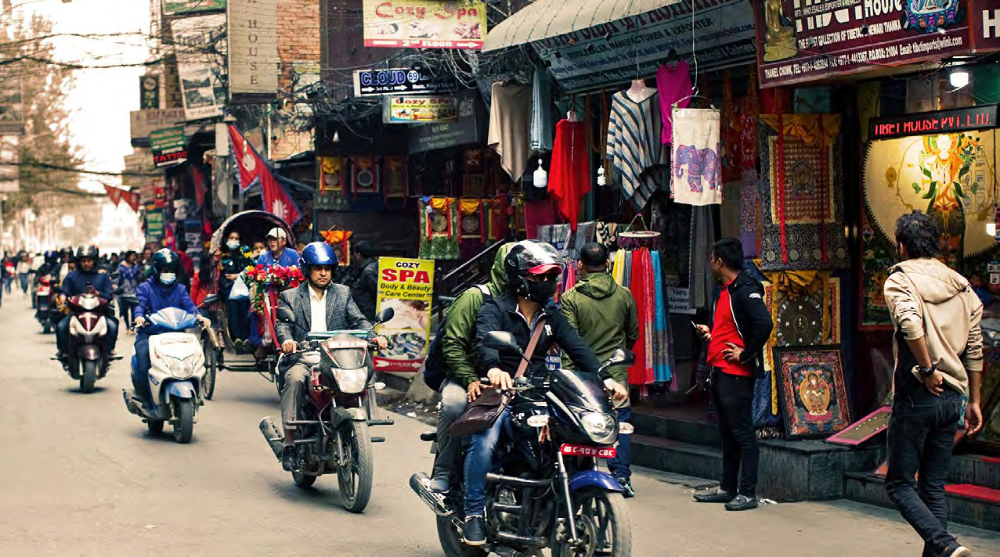

**Image 2 OCR + Description:**
```
**Image Description:**
The image shows a simple graphic representation of a page with a curled-up corner, indicating the turning of a page. The background is black, while the page itself is white with a gray shadow to give the curled corner a three-dimensional effect. There is no text or additional key elements present on the page graphic. This kind of image is often used to symbolize documents, reports, or digital pages being turned.
```


## Page 56
SH*B/"/$7#)"-*U"%V5/&-/*%"*E$).).*>/.0%"./*7"&*>/(%;/$=**!!"!!!!Oi
IP**GH*@,27&")71*@H*EH*E,$).#)/"1*]H*G0/"(/$1*+H*j7$#1*7"&*EH*EH*&/*@$7'c%*67$:%.7H*4$V;$-"*>%@.*V-"#+2%X*I"'.*6$*+%0*)%]0+;'0-%B$(.;'#$%
A0*0>$6$*+%0(%0%&0+C<0O%+.%&$0#$:*+,/*4%$5&*67"8*B$%'01*47.,)"-#%"1*?EH*e<%$#,(%2)"-fH
$$
$$$
$0
B>@?N_.*.V)o*7"&*2/#,%&%5%-)(755=*
.%'"&*7../..2/"#*).*.'00%$#)"-*4%$5&*
67"8*#/72.*7"&*&/;/5%02/"#*07$#"/$.*
7.*#,/=*.//8*#%*0$%;)&/*#,/*:/.#*
0%..):5/*,/50*#%*L8$7)"/H
=';5%E0*$'^"K%D.'-)%E0*F%B$>".*0-%@.;*+'O%4"'$#+.'K%
X0(+$'*%X;'.5$
1'(&/+&$%5!&./!1(('!4%)!-(2&!
0*6%/'4>6/
>QKcUKT]! \MTScK\R! NXTNKRKWKRb! KTRM! EMPcU! >VTJ!
5PMQY! YPMsX\RN:* N";)$%"2/"#75* &/-$7&7#)%"1* #,/*
/Z05%)#7#)%"* %<* "7#'$75* $/.%'$(/.1* /";)$%"2/"#75*
.#$/..%$.1* 7"&* (5)27#/* (,7"-/* (7"* :/* &$);/$.* %<*
;)%5/"#*(%"<5)(#H*+,/*2RVRX!VTU!1XV\XaQKcUKT]!,QTU!
d21,e*.'00%$#/&*#,/*($/7#)%"*%<*7*./#*%<*-')&/5)"/.*
7"&* $/(%22/"&7#)%".* <%$* (%"<5)(#* ./".)#);)#=* )"*
4%$5&* 67"8* B$%'0* 0$%c/(#.* <%('./&* %"* (5)27#/*
(,7"-/*7"&*"7#'$75*$/.%'$(/*27"7-/2/"#1*V,)(,*).*
.'227$)M/&*)"*7*<%$#,(%2)"-*$/0%$#HIP*+,).*/O%$#*).*
,/50)"-*27)".#$/72*(%"<5)(#*./".)#);)#=*)"*67"8*B$%'0*
%0/$7#)%".1* )"* 7((%$&7"(/* V)#,* )#.* DEa* .#$7#/-=1* #%*
7((%'"#*<%$*5)"87-/.*:/#V//"*(%"<5)(#1*<$7-)5)#=1*7"&*
"7#'$75*$/.%'$(/.H*
&PV\KT]! RLX! K[YV\R! MS! +(0$)?#Z! MT! LMQNXLMcUN:!
&LX! *[aPXccV! ,V\KcKRb! SMP! 1MWXPRb! VTU! /hQKRb!
d*,1/e*).*0$%;)&)"-*#)2/5=*7"&*7(('$7#/*&7#7*%"*#,/*
)207(#.*%<*EYa!?WI[*)"*RJ*(%'"#$)/.*:7./&*%"*,)-,W
<$/b'/"(=* 2%")#%$)"-* 0,%"/* .'$;/=.H* +,).* 0%5)(=W
$/5/;7"#1*,7$2%")M/&*&7#7*,7.*://"*27&/*7;7)57:5/*
%"*7"*)"#/$7(#);/1*0':5)(5=*7;7)57:5/*EYa!?WI[*j)-,W
D$/b'/"(=* F%")#%$)"-* ?7.,:%7$&H* !#* .,%V.* ,%V*
#,/* ($).).* ).* 7O/(#)"-* #,/* 5);/.* 7"&* V/55W:/)"-* %<*
,%'./,%5&.* 7"&* )"&);)&'75.1* ,%V* #,/=* 7$/* (%0)"-*
V)#,*)#.*)207(#.1*7"&*#,/*/Z#/"#*#%*V,)(,*0$);7#/*7"&*
0':5)(* 7..).#7"(/1* )"(5'&)"-* ;7(()"/.1* ).* $/7(,)"-**
#,/*"//&)/.#H*
/%2*'$%5!2*2&4$%4>6/!>*2$%/22!
5'(E&.!4%)!u(>!+'/4&$(%
>PXVJKT]!TXg!]PMQTU!MT!RLX!X\MTM[K\N!MS!TVRQPX:!
+,/*IP#,*2//#)"-*%<*#,/*E%";/"#)%"*%"*6)%&);/$.)#=*
057".*#%*7&%0#*7*"/V*B5%:75*6)%&);/$.)#=*D$72/V%$8*
eB6DfH*!"*.'00%$#1*#,/*4%$5&*67"8*B$%'0*,7.*(7$$)/&*
%'#*7*:$%7&*$/./7$(,*)")#)7#);/1*#,/*>%7&*#%*U'"2)"-1*
7)2/&* 7#* 7$#)('57#)"-* 7* "/V1* /;)&/"(/W:7./&*
"7$$7#);/* %"* #,/* $%5/* "7#'$/* 057=.* )"* &/;/5%02/"#*
7"&* #,/* 0%5)(/.* $/b')$/&* #%* .'.#7)"* #,).* $%5/* 7"&*
/".'$/* .'.#7)"7:5/* 0%.#W07"&/2)(* -$%V#,* 7"&* c%:*
($/7#)%"H* +,/* 5cMaVc! 1PM]PV[! MT! 2QNRVKTVaKcKRb!
d512e! 1PM]PV[* ,7.* .'00%$#/&* #,/* V%$81* )"(5'&)"-*
0$%&'()"-*#,$//*$/0%$#.*#,7#*,7;/*)"<%$2/&*#,/*B6D*
0$%(/..C* 1C$% X#.*.6"#% @0($% V.'% ]0+;'$K% A./"-"a"*>%
&'"I0+$% 3"*0*#$% V.'% ]0+;'$K* 7"&* \*-.#F"*>% ]0+;'$L
H60'+%4$I$-.56$*+:*
2&'/%5&./%$%5!1(6$+$/2B!
$%2&$&*&$(%2B!4%)!$%0/2&-/%&2!,('!
'/>*$6)$%5!>/&&/'
4NNXNNKT]! UKNVNRXPN! hQK\JcbB! V\\QPVRXcbB! VTU!
PX[MRXcb! RM! NYXXU! PX\MWXPb:* +,/* EYa!?WI[*
07"&/2)(* ,7.* .07$8/&* -$/7#/$* &/27"&* <%$* $70)&*
7"&* $/2%#/* 0%.#W&).7.#/$* &727-/* /.#)27#)%".H*
+,/* B5%:75* >70)&* 0%.#W&).7.#/$* ?727-/* N.#)27#)%"*
eB>@?Nf*2/#,%&%5%-=1*&/;/5%0/&*:=*#,/*4%$5&*67"8*
V)#,* <'"&)"-* <$%2* #,/* 5cMaVc! ,V\KcKRb! SMP! )KNVNRXP!
'XUQ\RKMT! VTU! 'X\MWXPb! d5,)''eB* ).* 7* $/2%#/1*
&/.8W:7./&1*
0%.#W&).7.#/$*
&727-/*
7../..2/"#*
700$%7(,H*!#*'./.*(7#7.#$%0,/*2%&/5)"-*#/(,")b'/.1*
,).#%$)(75*&727-/*&7#71*(/".'.*7"&*.%()%W/(%"%2)(*
&7#71* /"-)"//$)"-1* .7#/55)#/* )27-/$=1* &$%"/* <%%#7-/*
7"&*.%()75*2/&)7*#%*/.#)27#/*(%.#.*%<*&727-/H*G)"(/*
KTKT1* #,/* 4%$5&* 67"8* ,7.* (%"&'(#/&* KT* B>@?N.*
V%$5&V)&/1* )"(5'&)"-* %"/* <%$* L8$7)"/1* V,)(,* ,7.*
)"<%$2/&*#,/*67"8*B$%'0_.*$/.0%"./*#%*#,/*(%"<5)(#H


## Page 57
Oq!!!!"!!!!46B*+$'.#*D'"&*@""'75*>/0%$#*KTKK
>QKcUKT]!
aV\J!
aXRRXP!
gKRL!
]PXXT!
]PMgRL!
UKV]TMNRK\N:* +,/* EYa!?WI[* 07"&/2)(* ,7.* /Z0%./&*
#,/*)"#/$(%""/(#/&"/..*%<*"7#'$751*,'27"1*0,=.)(751*
7"&* )"#7"-):5/* (70)#75* 7"&* ,)-,5)-,#/&* #,/* "//&*
<%$* 7* 2%$/* :757"(/&* <%$2* %<* &/;/5%02/"#* #,7#* ).*
:/##/$* 0$/07$/&* <%$* 2'5#)05/* #,$/7#.H* !"* $/.0%"./1*
#,/* 4%$5&* 67"8* &/;/5%0/&* )#.* B>!?* .#$7#/-=H* +%*
.'00%$#*)#.*)205/2/"#7#)%"1*#,/*67"8*,7.*&/;/5%0/&*
7* (%20$/,/".);/* &)7-"%.#)(1* V)#,* .'00%$#* <$%2*
#,/* DMPXV! 5PXXT! 5PMgRL! &PQNR! ,QTU! dD55&,eB* #%*
)&/"#)<=*7$/7.*V,/$/*)";/.#2/"#.*V)55*,7;/*#,/*2%.#*
)207(#H* +,/* 67"8* ,7.* (%205/#/&* B>!?* &)7-"%.#)(.*
)"* %;/$* SP* (%'"#$)/.1* )"(5'&)"-* 27"=* )207(#/&* :=*
DEaH* +,/=* 0$%;)&/* 7"75=#)(75* '"&/$0)"")"-.* )"* (%$/*
(%'"#$=* &%('2/"#.1* .'(,* 7.* G=.#/27#)(* E%'"#$=*
?)7-"%.#)(.1* E%'"#$=* ]7$#"/$.,)0* D$72/V%$8.1* 7"&*
E%'"#$=*E5)27#/*7"&*?/;/5%02/"#*>/0%$#.1*7"&*#%*
)"<%$2*#,/*0$/07$7#)%"*%<*5/"&)"-*%0/$7#)%".H
)PVgKT]! cXNNMTN! SPM[! +(0$)?#Z* SMP! cXVPTXPN!
gKRL! UKNVaKcKRKXNH* @#* #,/* 0/78* %<* #,/* 5%(8&%V".1*
#,/* EYa!?WI[* 07"&/2)(* (7'./&* IRT* (%'"#$)/.* #%*
(5%./*.(,%%5.*#/20%$7$)5=1*<%$()"-*RP*0/$(/"#*%<*#,/*
V%$5&_.*5/7$"/$.*%'#*%<*.(,%%5*:')5&)"-.1*V,)(,*<'$#,/$*
)"($/7./&* #,/* $).8* %<* 27$-)"75)M7#)%"* <%$* (,)5&$/"*
V)#,*&).7:)5)#)/.H*+,/*$T\cQNKWX!/UQ\VRKMT!$TKRKVRKWX!
d$/$e* (%%$&)"7#/&* 7* c'.#W)"W#)2/* V%$8)"-* -$%'0* %<*
&/;/5%02/"#* 07$#"/$.* #%* &/;/5%0* 7"* )..'/.* 070/$*
%'#5)")"-*#,/*(,755/"-/.*/Z0/$)/"(/&*:=*5/7$"/$.*V)#,*
&).7:)5)#)/.*&'$)"-*#,/*EYa!?WI[*07"&/2)(H*]);%#)"-*
#%* !"(5'.)%"C* \/;/$7-)"-* \/..%".* <$%2* EYa!?WI[*
]7"&/2)(* <%$* \/7$"/$.* V)#,* ?).7:)5)#)/.* 0$/./"#.* 7*
27#$)Z* %<* $/(%22/"&7#)%".* 0/$#7)")"-* #%* .(,%%5*
(5%.'$/.*&'/*#%*#,/*EYa!?WI[*($).).H*+,/*$/0%$#*,7.*
://"*&%V"5%7&/&*%;/$*K1XTT*#)2/.*.)"(/*^'5=*KTKTH
ANDREA BORGARELLO / WORLD BANK 


**Image 1 OCR + Description:**
```
**Image Description:**
The image shows a natural landscape dominated by many tall trees with dense green foliage. The trees have thick trunks and the leaves form broad canopies, creating a lush green environment. The ground is covered with dense green shrubs or low-lying plants. The sky is mostly clear with patches of white clouds. There is no text or layout elements in the image; it is purely a photograph of a green and healthy forested area. This image could visually emphasize themes like environmental conservation, sustainable development, or natural resource management in an annual development report.
```
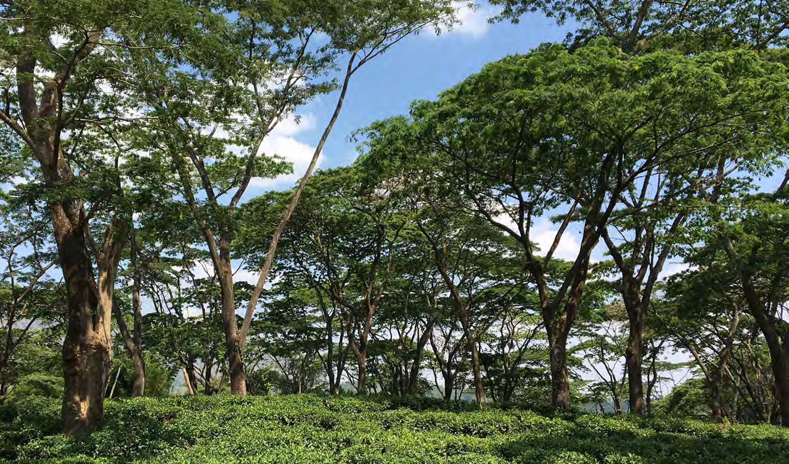

**Image 2 OCR + Description:**
```
**Image Description:**
The image shows a person dressed in white dealing with a large white and yellow bird with a bright orange beak. The bird appears to be a pelican. The scene seems to be outdoors, with a body of water or wet surface in the background. The person is holding the bird in a way that suggests care or examination, possibly for environmental or wildlife conservation purposes.

There is no visible text on the image itself. The layout focuses closely on the interaction between the person and the bird, capturing a moment that likely relates to wildlife care or a conservation activity. The content fits well with themes often found in annual development reports related to environmental or ecological efforts.
```


## Page 58
SH*B/"/$7#)"-*U"%V5/&-/*%"*E$).).*>/.0%"./*7"&*>/(%;/$=**!!"!!!!OZ
+,/*B5%:75*!"<5'/"(/*4)"&%V*).*
#$'5=*-5%:751*7"&*)#.*$/.'5#.*7$/*:/)"-*
&/5);/$/&*)"*(%'"#$)/.*V7=*:/=%"&**
#,/*")"/*#7$-/#*(%'"#$)/.H
_0+O%U">>"*(.*K%\_%3.'$">*K%@.66.*<$0-+C%0*)%
4$I$-.56$*+%Mb"#$%Q3@4MR
.XcYKT]!
\MQTRPKXN!
MWXP\M[X!
YMNR?YVTUX[K\!
KTWXNR[XTR!\MTNRPVKTRN:*@.*/(%"%2)/.*#$=*#%*:')5&*
:7(8*:/##/$*<$%2*#,/*EYa!?WI[*($).).1*)#*).*($'()75*<%$*
)".#)#'#)%".1*0%5)()/.1*7"&*$/-'57#)%".*#%*<7()5)#7#/*#,/*
$/755%(7#)%"*%<*$/.%'$(/.*#%V7$&*5%"-W$'"*/(%"%2)(*
#$7".<%$27#)%"1* c%:* ($/7#)%"1* 7"&* )"(5'.)%"H* +,/*
$[YPMWKT]! >QNKTXNN! /TWKPMT[XTR! SMP! 1PMNYXPKRb!
d$>/1e* 0$%-$72* ,7.* -/"/$7#/&* 8/=* 8"%V5/&-/*
$/.%'$(/.* #,$%'-,* )#.* B5%:75* !"<5'/"(/* 4)"&%V1* #%*
7..).#* (%'"#$)/.* )"* 7&&$/..)"-* )";/.#2/"#* (5)27#/*
(%".#$7)"#.* /Z7(/$:7#/&* :=* #,/* 07"&/2)(H* +,/./*
)"(5'&/*@"*!";/.#2/"#*]/$.0/(#);/*%"*B5%:75*a75'/*
E,7)".* >/0%$#* 7"&* #,/* B5%:75* ]'5./* G'$;/=* %<*
F'5#)"7#)%"75*N"#/$0$)./.H*+,/=*7&&*#%*#,/*V)&/*$7"-/*
%<*8"%V5/&-/*$/.%'$(/.*#,/*V)"&%V*,7.*0$%&'(/&*#%*
.'00%$#*4%$5&*67"8*B$%'0*0$%c/(#.*)"*2%$/*#,7"*[T*
(%'"#$)/.*7"&*)"<5'/"(/*2%$/*#,7"*ST*0%5)(=*$/<%$2.H
*TUXPNRVTUKT]!\KRb!SMP[!RM!YPM[MRX!NQNRVKTVacX!
]PMgRL:! @.* '$:7"* 0%0'57#)%".* )"($/7./* V%$5&V)&/1*
057"")"-* <%$* 7* :/##/$* '$:7"* <'#'$/* $/b')$/.*
'"&/$.#7"&)"-*#,/*<%$(/.*#,7#*,7;/*.,70/&*#,/*()#)/.*
)",7:)#/&*#%&7=H*]7"(78/.*#%*]=$72)&.*g*E)#=*D%$2*
#%*]$%2%#/*G'.#7)"7:5/*B$%V#,*7"75=M/.*#,/*.,70/*
7"&*-$%V#,*%<*"/7$5=*IT1TTT*()#)/.*:/#V//"*I[[T*7"&*
KTIP1*/Z72)")"-*#,/*&="72)(*$/57#)%".,)0*:/#V//"*7*
()#=_.*/(%"%2)(*-$%V#,*7"&*#,/*<5%%$*.07(/*7;7)57:5/*
#%* $/.)&/"#.* 7"&* :'.)"/../.H* E%W<)"7"(/&* :=* #,/*
2QNRVKTVacX! *PaVT! VTU! 'X]KMTVc! )XWXcMY[XTR!
d2*'5/e* '2:$/557* 0$%-$721* #,/* $/0%$#* /Z72)"/.*
,%V* /(%"%2)(* 7"&* .07#)75* &/;/5%02/"#* 0$%(/../.*
75)-"* V)#,* #,/* B>!?* 700$%7(,* )"* 0'$.')"-* 0%;/$#=*
$/&'(#)%"* 7"&* .,7$/&* 0$%.0/$)#=H* !#* (7"* ,/50* ()#=*
5/7&/$.*7"#)()07#/*7"&*0$/07$/*<%$*<'#'$/*"//&.*7"&*
($/7#/*/"7:5)"-*(%"&)#)%".*<%$*.'.#7)"7:5/*-$%V#,H
*NKT]![VPKTX!NYVRKVc!YcVTTKT]!RM!XTVacX!RLX!>cQX!
/\MTM[b:*+,/*4%$5&*67"8*).*0$%;)&)"-*#/(,")(75*7"&*
<)"7"()75* .'00%$#* #%* -%;/$"2/"#.* 7"&* #,/* 0$);7#/*
./(#%$* #%* /Z07"&* '"&/$.#7"&)"-* %<* %(/7".* 7"&*
.'00%$#*#,/*65'/*N(%"%2=H*+,/*1'(>6*/!*[aPXccV!
1PM]PV[* ,7.* 0$%&'(/&* 7* #%%58)#1* F7$)"/* G07#)75*
]57"")"-* eFG]f* <%$* 7* >/.)5)/"#* 7"&* !"(5'.);/* 65'/*
N(%"%2=1*V,)(,*)"(5'&/.*7*./$)/.*%<*-')&7"(/*"%#/.*
7"&*<7(#.,//#.*$/57#/&*#%*#,/*&)O/$/"#*FG]*0,7./.H*
6=*$/&'()"-*)";/.#2/"#*$).8*7"&*)20$%;)"-*)";/.#%$._*
(/$#7)"#=* )"* 7((/..)"-* 27$)"/* $/.%'$(/.1* FG]*
0$%;)&/.*7*(%20$/,/".);/*7"&*)"#/-$7#/&*)";/.#2/"#*
<$72/V%$8*7"&*<)"7"()75*7"&*.%()75*$7#)%"75*<%$*#,/*
65'/*N(%"%2=H*!#*7005)/.*/(%"%2)(*#%%5.*#%*:757"(/*
27$)"/*'./.*7"&*7&&$/../.*8/=*($%..W('##)"-*#,/2/.1*
.'(,* 7.* -/"&/$* 7"&* 27$-)"75)M/&* 0/%05/1* (5)27#/*
(,7"-/1*7"&*:)%&);/$.)#=H


**Image 1 OCR + Description:**
```
**Image Description:**
The image is a two-page spread from an annual development report featuring a clean, structured layout with textual content and images.

Left Page:
- Title at the top: "Strong leadership"
- Main body text below that, discussing leadership qualities and their impact on the organization.
- Two images aligned next to the text:
  1. On the left: Group of wind turbines standing against a partly cloudy sky, set in a green field.
  2. On the right: Sunlight peeking through tall green trees in a forest.
- The text wraps around the images neatly, creating an engaging visual flow.

Right Page:
- Large heading at the top: "Responsibly managing natural resources"
- Several paragraphs of text underneath the heading, elaborating on responsible management, sustainability efforts, and specific actions taken.
- A sidebar with a header "Our Environmental Initiatives" that includes bullet points or short highlights of particular programs.
- An illustration of a water droplet beside a lush blue and green landscape at the bottom right corner, which may symbolize water conservation or ecosystem balance.
- Page number "31" is visible at the bottom.

Overall, the pages emphasize environmental stewardship and leadership themes, combining imagery of renewable energy and nature with concise, informative text and highlighted initiatives. The design uses a harmonious and professional style suitable for a corporate report.
```


## Page 59
fn!!!!"!!!!46B*+$'.#*D'"&*@""'75*>/0%$#*KTKK
JOAO DOS SANTOS / WORLD BANK
E>5!&PQNR!,QTUN!VTU!,$,NB!,Ajnjj!,KTVT\KVc!2TVYNLMR
,Ajnjj!$%,6(E2
m!#f:f!aKccKMT
!"#$%&'()*&+#,-+&.,)%&/")+#01,+0")-2&3456'
787&/")+#01,+0")-2&39954'
:0;<=-+&0)&$(-+&.0>=&?=(#-@&%#0>=)&1?&/(-<&/")+#01,+0")-&+"2
k**F'5#)W?%"%$*+$'.#*D'"&*<%$*E%W<)"7"()"-*%<*#,/*]':5)(*
NZ0/"&)#'$/.*<%$*@&2)").#$7#);/*E707()#=*N"&'$7"(/*)"*L8$7)"/*
]$%c/(#C*dIHJ6
k**F'5#)W?%"%$*+$'.#*D'"&*<%$*E%W<)"7"()"-*%<*#,/*L8$7)"/*G/(%"&*
N(%"%2)(*>/(%;/$=*?/;/5%02/"#*]%5)(=*]$%-$72CdIHI6
k*B5%:75*D'"&C*dKHP6
87A&+#,-+&.,)%&/")+#01,+0")-2&3B5C'
!"#$%&'()*&+#,-+&.,)%&%0-1,#-=D=)+-2&3E5F'
:0;<=-+&0)&$(-+&.0>=&?=(#-@&%#0>=)&1?&%0-1,#-=D=)+-&+"&&
-,GG"#+&H*#(0)=2
k**F'5#)W?%"%$*+$'.#*D'"&*<%$*E%W<)"7"()"-*%<*#,/*]':5)(*
NZ0/"&)#'$/.*<%$*@&2)").#$7#);/*E707()#=*N"&'$7"(/*)"*L8$7)"/*
]$%c/(#C*dIHJ6
k**F'5#)W?%"%$*+$'.#*D'"&*<%$*E%W<)"7"()"-*%<*#,/*L8$7)"/*G/(%"&*
N(%"%2)(*>/(%;/$=*?/;/5%02/"#*]%5)(=*]$%-$72C*dIHI6
87A&+#,-+&.,)%&%0-1,#-=D=)+-2&3B5C'
A(-<&+#()-.=#-&.#"D&787-&+"&0DG$=D=)+0);&=)+0+0=-2&3I5J'
,Ajnjj!(*&,6(E2
m!#k:i!aKccKMT
8)/#=(-=%&/")+#01,+0")-&$=%&+"&0)/#=(-=%&7:8K
K"G&!"#$%&'()*&+#,-+&.,)%&7:8K2&
k*E7$:%"*D)"7"(/*]$%-$72C*dIHS6
k*@<-,7").#7"*>/(%".#$'(#)%"*+$'.#*D'"&C*dIHT6
k*B5%:75*D)"7"()"-*D7()5)#=C*dTHR6*
K"G&787&7:8K2
k*B$//"*E5)27#/*D'"&C*d[HJ6
k*B5%:75*N";)$%"2/"#*D7()5)#=C*dPHS6
k*E5)27#/*!";/.#2/"#*D'"&.C*dSHS6
,Ajnjj!,*%)2!!
./6)!$%!&'*2&
m!I#:Z!aKccKMT


**Image 2 OCR + Description:**
```
**Image Description:**
The image is a simple background with a very light sky blue gradient, transitioning from paler blue and white near the bottom to a slightly more saturated sky blue at the top. There are soft white clouds along the lower-left and right portions. No text or key elements are present in this image. It appears to be intended as a background or placeholder, possibly for a serene or hopeful theme in the report.
```


**Image 3 OCR + Description:**
```
**Image Description:**
The image is a single-page layout from an annual development report, focusing on the topic of Environmental Sustainability. It is divided into several sections with a clear and organized design. Key elements and text include:

1. Title and Subtitle:
   - The main title at the top left reads "Environmental Sustainability".
   - Below the title is a smaller subtitle "Our Actions and Impact".

2. Introductory Text:
   - There is a brief paragraph explaining the organization's commitment to sustainability, highlighting efforts to reduce carbon footprint and promote green practices.

3. Infographic Section:
   - A central infographic features icons and figures related to sustainability metrics such as energy savings, water conservation, and waste reduction.
   - There are percentages and numerical data displayed next to each icon to show progress and impact.

4. Key Achievements:
   - A bulleted list or set of highlighted points summarizes major accomplishments in environmental sustainability for the reporting year. Examples include:
     - Reduced carbon emissions by X%
     - Increased renewable energy use by Y%
     - Diverted Z tons of waste from landfills

5. Supporting Image:
   - A photo or graphic relevant to environmental themes is placed on the right side or integrated within the layout, enhancing the visual appeal.

6. Footer:
   - The bottom of the page includes page numbers and possibly a small logo or branding element related to the report.

The overall layout uses clean typography, green and blue color schemes typical for environmental topics, and balances text with graphics for
```


**Image 4 OCR + Description:**
```
**Image Description:**
The image features a vertical layout with a soft cloudy sky background, giving it an airy and light feeling. Key elements include:

1. At the top, in large, light gray font, is the text "INTRODUCTION".
2. Below that, there is a paragraph of text in a smaller, darker font. It reads: 
   "In 2022 we laid the foundation 
    for a new way of working — an 
    integrated child-centred model, 
    with the impact of our work 
    at the core."
3. Towards the bottom, there is a credit line in small font that states:
   "© UNICEF Executive Board Annual Session 
    24 - 26 January 2023"
4. The overall design is simple and minimalistic, with a focus on clarity and readability, suitable for an annual development report's introductory section.
```


**Image 5 OCR + Description:**
```
**Image Description:**
The image shows a scenic landscape with rolling green hills in the foreground and a partly cloudy sky in the background. The sky has patches of blue with some white clouds scattered across. There are no buildings, people, or other man-made structures visible. The overall feel is natural and peaceful, showcasing the beauty of nature. 

Since this is part of an annual development report, the image likely serves as a visual element to complement textual content related to environment, geography, agriculture, or rural development. 

There is no visible text within the image itself. The layout is simple with the hills occupying the lower portion and the sky taking up the upper part. The lighting is natural, with some shadows creating depth on the hills.
```
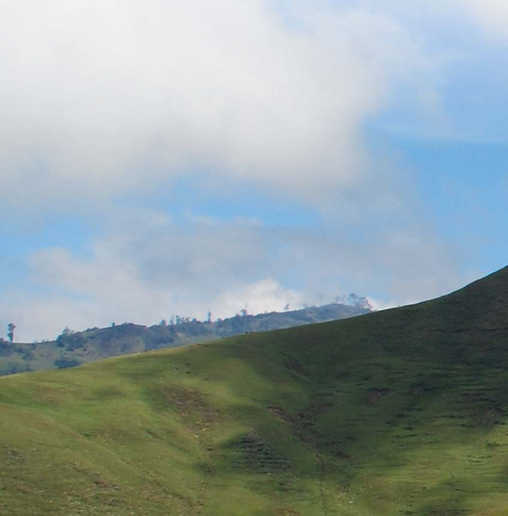

**Image 6 OCR + Description:**
```
**Image Description:**
The image features a natural landscape with two grassy hills or small mountains. The larger hill is centered and appears cone-shaped with a rounded peak, covered in green grass with subtle variations in texture and shadow. The smaller hill is positioned to the right, partially obscured by the larger one. The sky above is a light blue with scattered white clouds, creating a bright and serene atmosphere. There is no text visible in this image. The image has a clean, peaceful aesthetic, fitting for an annual development report that may be highlighting themes of growth, nature, or environmental development.
```
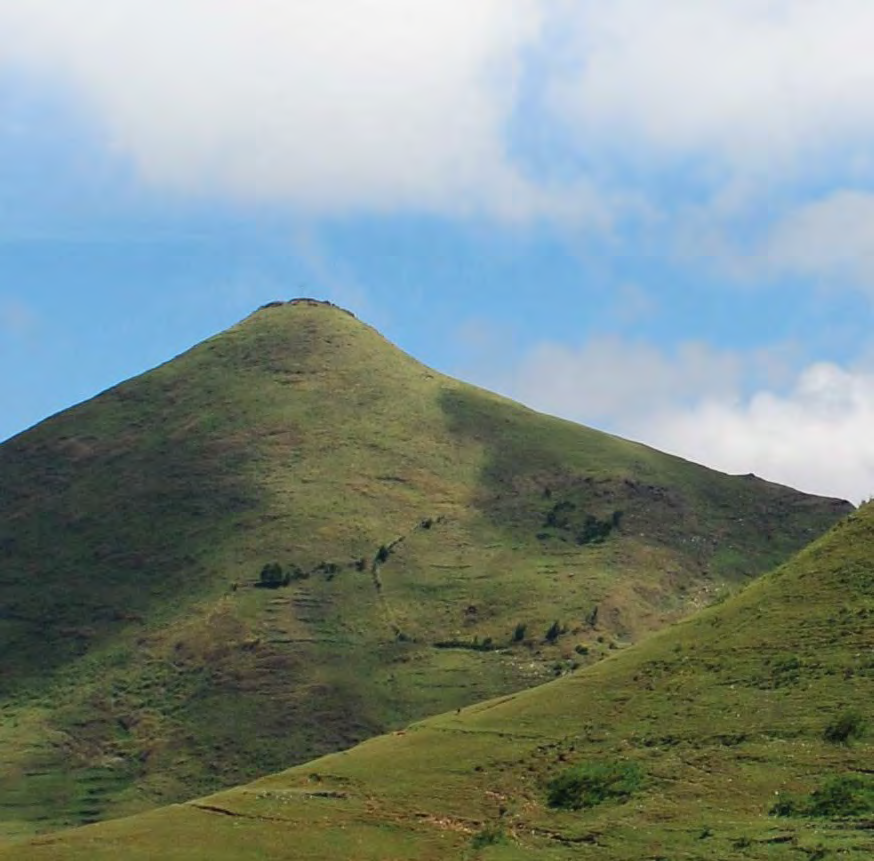

**Image 7 OCR + Description:**
```
**Image Description:**
The image is a vertical photograph showcasing a natural landscape dominated by a steep, grassy green hill occupying the right half and bottom portion of the frame. The hill has a textured surface with patches of grass, small vegetation, and rocky areas. The left half and the top part of the image consist of an expansive sky filled mostly with light grayish clouds, giving a serene and slightly overcast atmosphere.

There is no visible text within the image. The overall layout is divided visually between the earth (hill) and sky, emphasizing nature and possibly themes of growth, elevation, or stability suitable for an annual development report's visual element.
```


**Image 8 OCR + Description:**
```
**Image Description:**
The image appears to be a landscape scene featuring a grassy hillside or mountain slope. The terrain is mostly covered in green grass with some scattered bushes or small trees, particularly towards the bottom right corner. There are patches in the grass where it seems the vegetation is less dense or disturbed, possibly by natural erosion or footpaths. 

There are no visible human-made structures or people in the image. It looks like a natural, rural area, possibly used for grazing as indicated by several small animals (likely sheep) that can be seen scattered across the slope.

There is no text or any other graphical elements within the image. 

If this is part of an annual development report, the image likely supports content related to land use, agriculture, environmental conditions, or rural development.
```
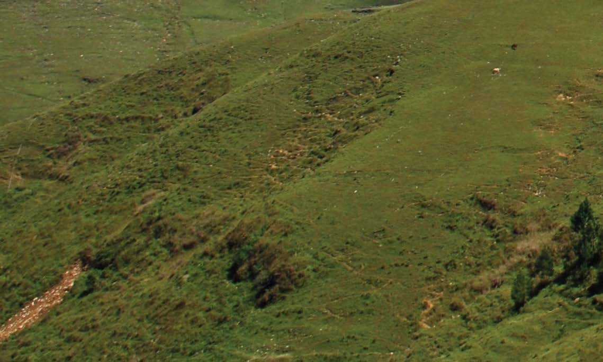

**Image 9 OCR + Description:**
```
**Image Description:**
The image shows a landscape of grassy hills with some scattered trees forming a small cluster towards the bottom center. The grass is a vibrant green with uneven terrain and subtle shadows highlighting the contours of the hills. There are no buildings, people, or distinct man-made structures visible. The sky is not in the frame, focusing solely on the natural hill and tree scene.

There is no text or other graphical elements present in this image. It appears to be a nature photograph likely used as a visual element in the development report but does not contain any direct informational content such as titles or captions.
```
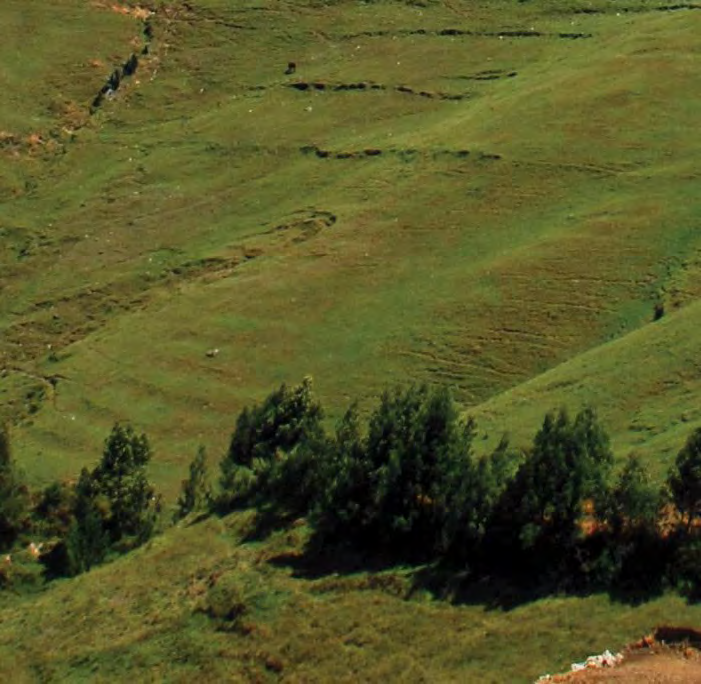

## Page 60
PH*D)"7"()75*@"75=#)(.*%<*4%$5&*67"8*B$%'0*+$'.#*D'"&.*7"&*D!D.!!!!"!!!!f#
5. FINANCIAL ANALYTICS OF  
WORLD BANK GROUP TRUST FUNDS AND FIFS
+,).*(,70#/$*0$%;)&/.*7--$/-7#/*<)"7"()75*)"<%$27#)%"*
%"*#,/*7(#);)#)/.*%<*#$'.#*<'"&.*7"&*D!D.*7&2)").#/$/&*
)"&);)&'755=*%$*c%)"#5=*:=*#,/*4%$5&*67"81*!DE1*F!B@1*
7"&*!EG!?HIX*!#*5%%8.*7#*<);/W=/7$*#$/"&.1*<$%2*D`KTIR*
#%* D`KTKK1* %"* #$'.#* <'"&* 7"&* D!D* )"<5%V.1* %'#<5%V.1*
7"&* 7../#.* '"&/$* 27"7-/2/"#g755* %<* V,)(,*
&/2%".#$7#/*#,/*4%$5&*67"8*B$%'0_.*0%.)#)%"*7.*#,/*
07$#"/$*%<*(,%)(/*#%*7&;7"(/*&/;/5%02/"#*7-/"&7.*
)"*(%'"#$)/.1*$/-)%".1*7"&*7$%'"&*#,/*-5%:/H*D)-'$/*
PHI*0$%;)&/.*7"*%;/$;)/V*%<*8/=*<)"7"()75*&7#7H*
)/,$%$&$(%2!(,!D/A!,$%4%+$46!&/'-2
$TScMgNr* E7.,* (%"#$):'#)%".* #%* #$'.#* <'"&.* )"(5'&/*
/"(7.,2/"#*%<*0$%2)..%$=*"%#/.*7"&*(7.,*$/(/)0#.*
<$%2*&%"%$.H*D%$*D!D.1*07)&W)"*(%"#$):'#)%".*)"(5'&/*
$/(/)0#.*)"*#,/*<%$2*%<*(7.,*%$*0$%2)..%$=*"%#/.*7"&*
%#,/$*.%'$(/.*%<*<'"&.1*.'(,*7.*E/$#)<)/&*N2)..)%".*
>/&'(#)%".* eEN>.f* 7"&* :%"&* )..'7"(/.1* :'#* "%#*
)"(5'&)"-*)";/.#2/"#*)"(%2/H*
@55* (%"#$):'#)%".* 07)&W)"* e(7.,* 7"&* 0$%2)..%$=*
"%#/.1* "/#* %<* (/$#7)"* &).(%'"#.f* 7$/* $/0%$#/&* '.)"-*
#,/*&7#/*%<*$/(/)0#H*!#*27=*75.%*)"(5'&/*(%"#$):'#)%"*
#$7".</$.*<$%2*%#,/$*#$'.#*<'"&.H*@2%'"#.*#%*&%"%$*
:757"(/*7"&*,%5&)"-*7((%'"#.*,7;/*://"*/Z(5'&/&H*
D$%2*D`KTIR1*2%.#*(%"#$):'#%$.*#%*#,/*B5%:75*D'"&*
0$%;)&/&*(%"#$):'#)%".*&)$/(#5=*#%*)#.*./($/#7$)7#1*7"&*
#,/*#$'.#//*$/(/);/.*#,/./*<'"&.*7.*(%"#$):'#)%".*<$%2*
#,/*B5%:75*D'"&*G/($/#7$)7#*7.*7*(%"#$):'#%$H*
(QRScMgNr*?).:'$./2/"#.*<$%2*#$'.#*<'"&.*7"&*(7.,*
#$7".</$.* <$%2* D!D.* #%* )205/2/"#)"-* /"#)#)/.* <%$*
&/;/5%02/"#* 7(#);)#)/.H* D%$* 7((%'"#)"-* 0'$0%./.1*
D!D*#$7".</$.*#%*#,/*4%$5&*67"8*7.*7"*)205/2/"#)"-*
/"#)#=* 7$/* "%#* )"(5'&/&* )"* D!D* &).:'$./2/"#.* :'#*
#$7".</$$/&* 7"&* 57#/$* $/(%$&/&* 7.* 4%$5&* 67"8* #$'.#*
<'"&*&).:'$./2/"#.H
4NNXRNr!D'"&.*,/5&*)"*#$'.#*eDj!+f*7$/*(%20$)./&*%<*
(7.,1*)";/.#2/"#.1*7"&*0$%2)..%$=*"%#/.*$/(/);7:5/*
7#*#,/*/"&*%<*#,/*<).(75*=/7$H*3Y#,/$.9*Dj!+*)"(5'&/.*
72%'"#.*,/5&*)"*/.($%V*%"*:/,75<*%<*#,/*!"#/$"7#)%"75*
E/"#$/* <%$* G/##5/2/"#* %<* !";/.#2/"#* ?).0'#/*
e!EG!?f1*&%"%$*:757"(/*7((%'"#.*e?6@f1*:757"(/.*%"*
7&2)").#$7#)%"*7((%'"#.1*7"&*'"7005)/&*$/(/)0#.H*+,/*
#%#75*72%'"#*%<*?6@*7"&*j%5&)"-*7((%'"#*:757"(/.*
,/5&*V7.*dSTR*2)55)%"*7#*#,/*/"&*%<*D`KTKKH
IX**?'/*#%*$%'"&)"-1*&).:'$./2/"#.*:/5%V*dPT*2)55)%"*7$/*&).057=/&*7.*dTHTT*2)55)%"*7"&*%#,/$*<)-'$/.*0$/./"#/&*)"*#,).*(,70#/$*27=*"%#*
7&&*'0*#%*#%#75.H


## Page 61
fj!!!!"!!!!46B*+$'.#*D'"&*@""'75*>/0%$#*KTKK
Table 5.1. Key Statistics on World Bank Group Trust Funds and FIFs, FY2018–2022
,A#q
,A#Z
,Ajn
,Aj#
,Ajj
+MTRPKaQRKMTN!dm!aKccKMTe
4%$5&*67"8*+$'.#*D'"&.
KHQ[
JHRP
JHXQ
SHTR
SHRX
!DE*+$'.#*D'"&.
THJJ
THSP
THKQ
THJK
THK[
F!B@*+$'.#*D'"&.
THTT
THTT
THTT
THTT
THTI
D!D.
QHQT
XH[[
RH[S
[H[I
IIHJ[
&MRVc
#n:qj
##:jZ
#j:qq
#I:k#
#f:OO
)KNaQPNX[XTRN!VTU!&PVTNSXPN!dm!aKccKMTe#i
4%$5&*67"8*+$'.#*D'"&.
JHRX
JHXQ
JHPT
JHPQ
PHPQ
EX%=#+"I"+"$(
9:8d
9:8e
9:8f
9:8g
9:99
BX%=#+"I"+"$(
7:e8
7:TN
7:hg
7:TT
h:hd
!DE*+$'.#*D'"&.
THJI
THJT
THKQ
THKP
THKQ
F!B@*+$'.#*D'"&.
THTT
THTT
THTT
THTT
THTT
D!D.
PHXJ
SHRQ
XHQP
[HIP
QHRS
&MRVc
[HRT
RHRS
ITHPK
IKH[Q
IJHXR
3?3%+'0*(V$'(%+.%DE,%1';(+%3;*)(
9:hg
9:88
8:N7
8:ee
8:dd
,QTUN!.XcU!KT!&PQNR!dm!aKccKMTe
4%$5&*67"8*+$'.#*D'"&.
[HT[
ITHJP
IIHKK
IKHJP
IIH[X
!DE*+$'.#*D'"&.
THXS
THRT
THRJ
TH[I
TH[K
F!B@*+$'.#*D'"&.
THII
THII
THT[
THT[
THIT
D!D.
KIHXP
KJHIJ
KSHJ[
KPH[X
KQHRR
Y#,/$.
THQQ
THRR
THR[
TH[S
TH[R
&MRVc
kj:ji
kO:jf
ki:Ij
In:jI
I#:qf
IQ**D!D*#$7".</$.*#%*4%$5&*67"8*B$%'0*#$'.#*<'"&.*7$/*/Z(5'&/&*<$%2*#,/*#%#75*#%*7;%)&*&%':5/*(%'"#)"-*%<*&).:'$./2/"#.H*D!D*#$7".</$.*#%*
#,/*4%$5&*67"8*B$%'0*7.*)205/2/"#)"-*/"#)#=1*#$'.#//1*7"&*./($/#7$)7#*7$/*75.%*/Z(5'&/&*<$%2*#,/*#$7".</$.H


## Page 62
PH*D)"7"()75*@"75=#)(.*%<*4%$5&*67"8*B$%'0*+$'.#*D'"&.*7"&*D!D.!!!!"!!!!fk
Table 5.1. Key Statistics on World Bank Group Trust Funds and FIFs, FY2018–2022
,A#q
,A#Z
,Ajn
,Aj#
,Ajj
+MTRPKaQRKMT!'X\XKWVacX!dm!aKccKMTe
4%$5&*67"8*+$'.#*D'"&.
SHJQ
JHQQ
JHPQ
JHRX
JHIQ
!DE*+$'.#*D'"&.
THSK
THSP
THPI
THJR
THKR
F!B@*+$'.#*D'"&.
THTI
THTI
THTI
THTI
THTP
D!D.
PHPS
XHSK
QHTI
[HQK
[HSK
&MRVc
#n:kI
#n:fO
##:nZ
#k:Zi
#j:Zj
$TWXNR[XTR!$T\M[X!dm!aKccKMTe
4%$5&*67"8*+$'.#*D'"&.IR
THIS
THKR
THKJ
THTS
THTT
!DE*+$'.#*D'"&.
THTI
THTK
THTK
THTT
THTT
D!D.
THJK
THPR
THPI
THIX
WTHKK
&MRVc
n:Ii
n:qq
n:if
n:jn
?n:jj
IR*!"(5'&/.*F!B@*#$'.#*<'"&.H


## Page 63
fI!!!!"!!!!46B*+$'.#*D'"&*@""'75*>/0%$#*KTKK
Figure 5.1. Cash Contributions by Development Partner Type:  
World Bank Group Trust Funds and FIFs, FY2018-2022
2MWXPXK]T!]MWXPT[XTRN!PX[VKT!RLX![MNR!NK]TKSK\VTR!\MTRPKaQRMPN!RM!EMPcU!>VTJ!5PMQY!RPQNR!SQTUNB!
V)#,*XK*0/$(/"#*.,7$/*edJ[H[*:)55)%"f*%<*#,/*(7.,*(%"#$):'#)%".*$/(/);/&*:/#V//"*D`KTIRhKKH*]$);7#/*"%"W
0$%<)#*/"#)#)/.*7$/*#,/*./(%"&*57$-/.#*-$%'0*%<*(%"#$):'#%$.*<%$*D!D.*eSJ*0/$(/"#f1*V,)5/*)"#/$-%;/$"2/"#75*
)".#)#'#)%".*7$/*<%$*4%$5&*67"8*#$'.#*<'"&.*eIK*0/$(/"#f*7"&*!DE*#$'.#*<'"&.*eK*0/$(/"#fH
I[**D$%2*D`KTIQ1*2%.#*(%"#$):'#%$.*#%*#,/*B5%:75*D'"&*0$%;)&/&*(%"#$):'#)%".*&)$/(#5=*#%*)#.*./($/#7$)7#1*7"&*#,/*#$'.#//*$/(/);/.*#,/./*
<'"&.*7.*(%"#$):'#)%".*<$%2*#,/*B5%:75*D'"&*./($/#7$)7#*7.*7*(%"#$):'#%$H*[Xm*%<*#,/*(7.,*(%"#$):'#)%".*$/(/);/&*<$%2*0$);7#/*"%"W0$%<)#*
/"#)#)/.*<%$*D!D.*).*<$%2*B5%:75*D'"&*./($/#7$)7#H
!"#$%&'()*&+#,-.&/,)%-
!"#$%&'
!"#$%&'()*&0#",1
("&$%)('&&
2).3#4"53#)63).($&
2)-.7.,.7")-
!")$%!'
8#75(.3&9"#&8#"97.&
:#4()7;(.7")-
!"*$%+'
8#75(.3&<")=1#"97.&
>).7.73-
)#",$%*)'
?"53#374)&
0"53#)63).-
2/@&+#,-.&/,)%-
!"+$%()'
!"#$%&'()*&0#",1
!"($%)!'
2).3#4"53#)63).($&
2)-.7.,.7")-
!"!($%)'
8#75(.3&9"#&8#"97.&
:#4()7;(.7")-
!"!&$%('
8#75(.3&<")=1#"97.&
>).7.73-
)")$%,,'
?"53#374)&
0"53#)63).-
/2/-
!"($%!'
!"#$%&'()*&0#",1
!"-$%('&&
2).3#4"53#)63).($&
2)-.7.,.7")-
)*",$%+&'
8#75(.3&<")=1#"97.&
>).7.73-
(&"($%#+'
?"53#374)&
0"53#)63).-
!"#$%&'())*+*,(-*.#
O:#!$TScMgN#Z


## Page 64
PH*D)"7"()75*@"75=#)(.*%<*4%$5&*67"8*B$%'0*+$'.#*D'"&.*7"&*D!D.!!!!"!!!!fO
Figure 5.2. Top Ten Development Partners’ Contributions to  
World Bank Group Trust Funds and FIFs,  FY2018-2022 ($ billions)
&LX! *TKRXU! 2RVRXN! VTU! RLX! *TKRXU! DKT]UM[! \MTRKTQX! RM! aX! RLX! RMY! UXWXcMY[XTR! YVPRTXPN! SMP!
EMPcU! >VTJ! 5PMQY! RPQNR! SQTUN:* D$%2* D`KTIRhKK1* #,/* L")#/&* G#7#/.* V7.* #,/* 57$-/.#* &/;/5%02/"#*
07$#"/$* V)#,* ('2'57#);/* (7.,* (%"#$):'#)%".* %<* dJHX* :)55)%"1* <%55%V/&* :=* #,/* L")#/&* U)"-&%2* 7#**
dKHS*:)55)%"H*
D%$*D!D.1*#,/*#%0*#/"*.%;/$/)-"*&/;/5%02/"#*07$#"/$.*(%"#$):'#/&*dKT*:)55)%"*&'$)"-*D`KTIRhKK1*V,)(,*
7((%'"#/&*<%$*SX*0/$(/"#*%<*('2'57#);/*(7.,*(%"#$):'#)%".*edSKHQ*:)55)%"fH*+,/*L")#/&*U)"-&%2*V7.*#,/*
57$-/.#*&/;/5%02/"#*07$#"/$*V)#,*(%"#$):'#)%".*%<*dJHS*:)55)%"1*<%55%V/&*:=*B/$27"=*edJHJ*:)55)%"fH
!"#$%&'()*+$($%
!"#$
!"%$
&"#$
&"%$
'"#$
'"%$
%"#$
%"%$
()*+,-
.*)/-01
()*+,-
2+3+,4
5,613)7
8393)
:63);,
<06=37
>?609,3)
@011*44*0)
<,+A,6B3)-4
@3)3-3
2=,-,)
,-(.*/0122'3'41&'$(5
:C:4
D06B-E$3)FEG6?4+E:?)-4
C:@EG6?4+E:?)-4
!"#$
%"#$
&"%$
!"'$
(")$
&"&$
!"!$
("*$
&"($
&"($
("&$
%"#$
!"&$
&"&$
("+$
("%$
&"($
%"&$
&"+$
&"%$
("!$
&")$
&"($
("($
&"&$
("#$
&"*$
&"($


## Page 65
ff!!!!"!!!!46B*+$'.#*D'"&*@""'75*>/0%$#*KTKK
Figure 5.3. Annual FIF Transfers to World Bank Group as Implementing Entity,  
FY2018-2022 ($ billions)
,$,N! PX[VKT! VT! K[YMPRVTR! SQTUKT]! NMQP\X! SMP! EMPcU! >VTJ! 5PMQY! RPQNR! SQTUN:* +$7".</$.* <$%2* D!D.*
#%*0$%c/(#.*)205/2/"#/&*:=*#,/*4%$5&*67"8*B$%'0*&/($/7./&*<$%2*[*0/$(/"#*edIHT*:)55)%"f*%<*#,/*#%#75*
#$7".</$.*<$%2*D!D.*#%*755*)205/2/"#)"-*/"#)#)/.*)"*D`KTKI*#%*R*0/$(/"#*edTHQ*:)55)%"f*)"*D`KTKKH*!"*D`KTKK1*
#,/*#%0*#,$//*#$7".</$.*V/$/*27&/*<$%2*#,/*B5%:75*]7$#"/$.,)0*<%$*N&'(7#)%"*eB]Nf*7#*dTHK*:)55)%"1*<%55%V/&*
:=*#,/*B5%:75*N";)$%"2/"#*D7()5)#=*eBNDf*7#*dTHI*:)55)%"*7"&*#,/*B5%:75*E%"(/..)%"75*D)"7"()"-*D7()5)#=*7#*
dTHI*:)55)%"H*Y"*7*('2'57#);/*:7.).*.07"")"-*D`KTIRhKK1*#,/*4%$5&*67"8*B$%'0*7.*7"*)205/2/"#)"-*/"#)#=*
$/(/);/&*#,/*57$-/.#*72%'"#.*%<*#$7".</$.*<$%2*#,/*B]N*edIHK*:)55)%"f1*<%55%V/&*:=*E!D*edTH[*:)55)%"f*7"&*#,/*
BND*edTHX*:)55)%"fH
KT**+$7".</$.*#%*)205/2/"#)"-*/"#)#)/.*)"(5'&/*#$7".</$.*<%$*0$%c/(#*0$/07$7#)%"1*.'0/$;).)%"*<//.1*0$%c/(#*)205/2/"#7#)%"1*7"&*.0/()75*
7-$//2/"#*#$7".</$.*<%$*0$%-$72.*<%$*,/7;)5=*)"&/:#/&*0%%$*(%'"#$)/.*ej!]Ef*7"&*@FEH*j%V/;/$1*)"*#,/*(7./*%<*#,/*B5%:75*D'"&1**
#,/$/*).*7*5'20*.'2*#$7".</$*#%*#,/*./($/#7$)7#1*7"&*#,/*'./*%<*#,/*#$7".</$$/&*<'"&.*).*&/#/$2)"/&*:=*#,/*B5%:75*D'"&H
,$,!&'4%2,/'2jn
!"#$%&'()%*
!"#$
!"#$
!"%$
!"&$
!"&$
'"($
!"%%
!"&$
!"!$
!"'$
!"'$
!"($
!"%#
!"&$
!"'$
!"&$
!"'$
'"!$
!"%&
!"#$
!"'$
!"'$
!"!$
'"'$
!"#'
!"#$
!"&$
!"'$
!"&$
'"&$
()*+,-
./012/342,)5+,-*67380,3
9:;<2)6053=,;-)3!;5:
./012/3>05<+--6052/3
!6525<65?3!2<6/6)@
./012/395A6,05B+5)3!2<6/6)@
>/6B2)+3C5A+-)B+5)3!;5:-


## Page 66
PH*D)"7"()75*@"75=#)(.*%<*4%$5&*67"8*B$%'0*+$'.#*D'"&.*7"&*D!D.!!!!"!!!!fi
G)"(/*D`KTIQ1*.)-"/&*(%"#$):'#)%".*<%$*!DE*:5/"&/&*<)"7"(/*,7&*7;/$7-/&*dISP*2)55)%"*7*=/7$*<%$*!DE*#$'.#*
<'"&.H*E7"7&7*,7.*://"*#,/*57$-/.#*.%;/$/)-"*&/;/5%02/"#*07$#"/$*#%*!DE*:5/"&/&*<)"7"(/*#$'.#*<'"&.*
&'$)"-* D`KTIRhKK1* 7((%'"#)"-* <%$* SJ* 0/$(/"#* %<* #%#75* ('2'57#);/* .)-"/&* (%"#$):'#)%".* edJII* 2)55)%"f1*
<%55%V/&*:=*#,/*L")#/&*U)"-&%2*eKJ*0/$(/"#1*dIX[*2)55)%"f*7"&*D)"57"&*eI[*0/$(/"#1*dIJS*2)55)%"fH*
Figure 5.4. Signed Contributions to IFC Blended Finance Trust Funds,  
FY2018-2022 ($ millions)
Signed Contributions to IFC Blended Finance Trust Funds by Donor,  
FY2018-2022 ($ millions)
!"#$%"&'&()
*&+",$-./()&+0.(
1.23"4"''"5$-./()&+0.(
6.7"($8(+5"95"("/5,$
-0(&(2"$:(0+0&+0;"$<6"=-0>
!"+?"5'&(),
-0('&()
@(0+")$A0(B).7
C&(&)&
!"#
$%&"#
%'(")
%$)"$
#&"*
!'"#
!#"&
#"&


## Page 67
fq!!!!"!!!!46B*+$'.#*D'"&*@""'75*>/0%$#*KTKK
Figure 5.5. World Bank Trust Fund Disbursements, by Top Ten Programs,  
FY2018-2022 ($ billions)
O:j!(QRScMgN
!"#$%#&'()"*+,-
!"#$%$&'(&)%*%+,-.%#/&012/#%2
!3!&4%5,"26%5&3.-+%.%#/%$&'(&71#8&15&3.-+%.%#/9#:&;#/9/(
.*)&*/0'1*)"2
;<=;<>&?,2+$&71#8&012/#%25@9-&02,:21.
A+,'1+&>:296"+/"2%&1#$&!,,$&B%6"29/(&02,:21.
?%5/&71#8&1#$&A1C1
A+,'1+&<,#6%559,#1+&!9#1#69#:&!169+9/(
<12',#&!9#1#6%
A+,'1+&!9#1#69#:&!169+9/(
A+,'1+&;#*92,#.%#/&!169+9/(
<+9.1/%&3#*%5/.%#/&!"#$5
A+,'1+&012/#%25@9-&D,2&;$"61/9,#&E2"5/&!"#$
>D:@1#95/1#&4%6,#5/2"6/9,#&E2"5/&!"#$
3456
7486
94:6
94;6
94<6
9456
9486
9436
9436
9436
&LX! RMY! #n! RPQNR! SQTU! YPM]PV[N! V\\MQTRXU! SMP! Ik! YXP\XTR! MS! RLX! RMRVc! EMPcU! >VTJ! RPQNR! SQTU!
UKNaQPNX[XTRN* edKTHK* :)55)%"f* <$%2* D`KTIRhKKH* +,/* ,)-,/.#* &).:'$./2/"#.* V/$/* 27&/* <$%2* #,/*
@<-,7").#7"*>/(%".#$'(#)%"*+$'.#*D'"&*edJHP*:)55)%"f1*<%55%V/&*:=*%#,/$*57$-/*&).:'$./2/"#.*27&/*:=*#,/*
4%$5&*67"8*)"*)#.*$%5/*7.*)205/2/"#)"-*/"#)#=*<%$*D!D.*5)8/*#,/*B]NedIHS*:)55)%"f1*E!D*edTH[*:)55)%"f*7"&*#,/*
BND*edTHR*:)55)%"fH


## Page 68
PH*D)"7"()75*@"75=#)(.*%<*4%$5&*67"8*B$%'0*+$'.#*D'"&.*7"&*D!D.!!!!"!!!!fZ
Figure 5.6. World Bank Trust Fund Disbursements,  by Top Five Stand-alone Trust Funds,  
FY2018-2022
!"#$%&'('"()*$+,-$./)"(0)1$-$#,23$(&)!#"()45#&')1,(,.)6.5%&)75(0)8!9
:"(;#"0$%<)=$"#&<)>$+&,.)>522,.&)!.,?$+&)45#&')1,(,.)6.5%&)75(0
@&<',2'")!.,05+&'-$)>"A$&/)B$&)!.,?$+&)C)8!9
45#&'D1,(,.)6.5%&)75(0)A,.)E,DA'("(+'(;),A)&<$)FG."'($
>$+,(0)@+,(,3'+)*$+,-$./)1$-$#,23$(&)!,#'+/)!.,;."3
45#&'D1,(,.)6.5%&)75(0)A,.)E,DA'("(+'(;),A)&<$)!5H#'+)@I2$(0'&5.$
A,.)J03'('%&."&'-$)E"2"+'&/)@(05."(+$)'()FG."'($)!.,?$+&
!"#$%&&'()*&$
+,$-#"$&*&.%$
/012
/032
4032
40/2
40/2
+,/*4%$5&*67"8*).*7(#)"-*b')(85=*#,$%'-,*#$'.#*<'"&.*#%*,/50*(%'"#$)/.*<7()"-*&);/$./*,/75#,1*/(%"%2)(1*
7"&*.%()75*)207(#.*%<*#,/*07"&/2)(1*7.*V/55*7.*#,/*V7$*)"*L8$7)"/H*+$'.#*<'"&.*,7;/*.#/00/&*'0*)"*;7$)%'.*
V7=.1*)"(5'&)"-*#,$%'-,*)#.*.#7"&W75%"/*#$'.#*<'"&.H*EMPcU!>VTJ!RPQNR!SQTUN!UKNaQPNXU!mj:O!aKccKMT!RM!
*JPVKTX!KT!RLX!cVNR!hQVPRXP!MS!,Ajnjj:
i%#/C*e]f*)"&)(7#/.*07$755/5*#$'.#*<'"&


## Page 69
in!!!!"!!!!46B*+$'.#*D'"&*@""'75*>/0%$#*KTKK
!"*D`KTKK1*D!D.*<)"7"(/&*IK*0/$(/"#*%<*#%#75*#$'.#*<'"&*&).:'$./2/"#.*#%*>N*7(#);)#)/.*.'0/$;)./&*:=*#,/*
4%$5&*67"8*e!6>?*7.*)205/2/"#)"-*/"#)#=f1*V)#,*7"*7;/$7-/*.,7$/*%<*KJ*0/$(/"#*<%$*#,/*57.#*<);/*=/7$.H*&LX!
WMcQ[X!VTU!NLVPX!MS!RLX!,$,!SQTUKT]!RM!'/!V\RKWKRKXN!LVWX!UX\cKTXU!UQPKT]!RLX!cVNR!SKWX!bXVPN*<$%2*dTH[*
:)55)%"*eJT*0/$(/"#f*)"*D`KTIR*#%*dTHP*:)55)%"*eIK*0/$(/"#f*)"*D`KTKKH*
@52%.#*%"/W#,)$&*%<*D!D*<'"&)"-*&'$)"-*D`KTIRhKK*V7.*<$%2*#,/*B]N*edIHI*:)55)%"f1*<%55%V/&*:=*E!D*edTHR*
:)55)%"f*7"&*#,/*BND*edTHX*:)55)%"fH*&LXNX!RMY!k!YPM]PV[N!V\\MQTRXU!SMP!iI!YXP\XTR!MS!'/!UKNaQPNX[XTRN!
SQTUXU!RLPMQ]L!,$,N:
Figure 5.7. World Bank Trust Fund Disbursements for Recipient-Executed Activities   
by FIFs, FY2018-2022 ($ billions)
!"#$%"&'()*%&+%,-"./&
0!'+1&2&34,5(&6%*.(4*
!7/%(%&89::26"7;&
'(<4;.=4(.&+7(>
?>%@.%.-#(&+7(>
!*44(&A"-=%.4&+7(>&2&'B8:&
%(>&':?&%;&?,,*4>-.4>&9(.-./
C@4,-%"&A"-=%.4&A5%(D4&+7(>
E4%;.&:4<4"#@4>&A#7(.*-4;&
)#*&A"-=%.4&A5%(D4
F9G?&3*%(;-.-#(&+7(>
6%(>4=-,&9=4*D4(,/&
+-(%(,-(D&+%,-"-./
!"#$%"&?D*-,7".7*4&%(>
+##>&C4,7*-./&6*#D*%=
!"#$%"&A#(,4;;-#(%"&
+-(%(,-(D&+%,-"-./
!"#$%"&9(<-*#(=4(.&+%,-"-./
A"-=%.4&'(<4;.=4(.&+7(>;
!"#$%"&6%*.(4*;5-@&)#*
9>7,%.-#(&3*7;.&+7(>
!"#$
!"%$
!"&$
!"'$
!"($
)*+,*-./0*+12
("($
!"!'$
!"!3$
!"!($
!"!'$
!"!($
!"!!($
!"!!3$
World Bank Trust Fund Disbursements for Recipient-Executed Activities 
by Funding Sources, FY2018-2022 ($ billions)
!"#$%&!'
!"!#$%&'()*%&#"+,-%+%./%0#12#34.5#4&#"+,-%+%./6.7#8./6/2
(("#$%))'
!(.0%0#12#9%:%-',+%./#;4)/.%)


## Page 70
PH*D)"7"()75*@"75=#)(.*%<*4%$5&*67"8*B$%'0*+$'.#*D'"&.*7"&*D!D.!!!!"!!!!i#
Figure 5.8. World Bank Trust Fund Disbursements for Recipient-Executed  
Activities by Regions, FY2018-2022 ($ billions)
@2%"-*#,/*4%$5&*67"8_.*$/-)%"75*'")#.1*#,/*2MQRL!4NKV!'X]KMT!d24'e!gVN!RLX!cVP]XNR!aXTXSK\KVPb!MS!
RPQNR!SQTU!UKNaQPNX[XTRN!SMP!'/!V\RKWKRKXNB*V)#,*dSHS*:)55)%"*)"*D`KTIRhKK*&'/*#%*.'00%$#*#%*@<-,7").#7"H*
?'$)"-*D`KTKK1*N'$%0/*7"&*E/"#$75*@.)7*eNE@f*:/(72/*#,/*57$-/.#*$/-)%"75*:/"/<)()7$=*7#*dKHX*:)55)%"1*
57$-/5=*&'/*#%*&).:'$./2/"#.*#%*L8$7)"/H*
!"#$
%&!'
("($
("!$
("!$
(")$
("#$
("*$
("#$
("($
("+$
%&!+
("($
("#$
("#$
(")$
("!$
("*$
("*$
("($
("'$
%&#(
("($
("#$
("#$
(",$
("#$
("#$
("*$
("($
("'$
%&#!
("($
("#$
("#$
("-$
("#$
("#$
("#$
("($
("-$
%&##
("($
#",$
("#$
(".$
("!$
("($
("#$
("#$
!"#
"$#
%&"
'&#
"$%
%"(
"$)
*+"
,-.
/01234
!"#
!"#$
!"%&
$!%
#"'$
!"(&
!"&
(")$
%"*&
'!#
+,")$(
)")&
)*#
'"*$-
!",&
+,!
("($-
%"*&
-./
!".$-
!"%&
!"$
%,$
+"(&
$*!
+%".$
*"+&


## Page 71
ij!!!!"!!!!46B*+$'.#*D'"&*@""'75*>/0%$#*KTKK
Figure 5.9. Distribution of ASA Funding, FY2018-2022
!"#$%&'('&')*
++,
+-.
+/+
+01
!"##
!"#$
!"#%
!"$&
!"$'
++0
23456#78&49
:+1
:0,
01;
:+<
0;1
=$>
<,
:1
::
.;
+<
"?@
;+
/1
/-
//
;<
!!
,0+
;;0
;/-
;;<
;-.
&PQNR!SQTU!SKTVT\KT]!SMP!>/!V\RKWKRKXN!PXYPXNXTRN!V!NK]TKSK\VTR!NLVPX!MS!RLX!EMPcU!>VTJ_N!X^YXTUKRQPXN!
MT!424B!VR!fI!YXP\XTR!KT!,Ajnjj:!+,).*57$-/*.,7$/*%<*/Z#/$"755=*<)"7"(/&*@G@*0$%;)&/.*%00%$#'")#)/.*
#%*V%$8*V)#,*&/;/5%02/"#*07$#"/$.*%"*#,/*8"%V5/&-/*7-/"&71*:'#*).*75.%*)"#$%&'(/.*(,755/"-/.*#%*#,/*
67"8_.*7:)5)#=*#%*057"*7"&*75)-"*)#.*V%$8*#%*)#.*.#$7#/-)(*0$)%$)#)/.H*+,/./*(,755/"-/.*7$/*:/)"-*7&&$/../&*7.*
7*07$#*%<*#,/*%"-%)"-*@G@*$/<%$2.H
i%#/C*>/#$%7(#);/*7&c'.#2/"#.*V/$/*27&/*<%$*0$)%$*=/7$*;75'/.*#%*$/<5/(#*#,/*0$%&'(#*(%&/*2700)"-*&/<)")#)%"*7.*7;7)57:5/*7#*
#,/*/"&*%<*D`KTKKH*66*$/</$.*#%*:7"8*:'&-/#1*NDY*$/</$.*#%*/Z#/$"755=*<)"7"(/&*%'#0'#.1*7"&*>@G*$/</$.*#%*$/)2:'$.7:5/**
7&;).%$=*./$;)(/.H


## Page 72
PH*D)"7"()75*@"75=#)(.*%<*4%$5&*67"8*B$%'0*+$'.#*D'"&.*7"&*D!D.!!!!"!!!!ik
O:k!4NNXRN
+$'.#*<'"&*7../#.*(%".).#*%<*<'"&.*,/5&*)"*#$'.#*eDj!+fg(7.,1*)";/.#2/"#.1*0$%2)..%$=*"%#/.*7"&*(%"#$):'#)%"*
$/(/);7:5/.H*+,/./*7../#.*7$/*27"7-/&*7"&*$/0%$#/&*./07$7#/5=*<%$*4%$5&*67"8*#$'.#*<'"&.1*!DE*#$'.#*<'"&.1*7"&*
D!D.*<%55%V)"-*/.#7:5).,/&*$/0%$#)"-*0$%#%(%5.H
Figure 5.10. Distribution of World Bank Group Trust Fund Assets, FY2022
!"#$
%%"&$
''"($
%"!$
!")$
!"!$
*"'$
!"!$
+,-./,01/2034-56405-
7896:--98;/
<954-/90/.,01
="'$
!"=$
#")$
!"!$
+,-./>4?4:3,@A4
!"#$%&'()$"'*+(
"!"(
,)-.&(
/0&1+$23*4$%&'()$"'*+(
&LX!V[MQTR!MS!VNNXRN!LXcU!SMP!EMPcU!>VTJ!5PMQY!RPQNR!SQTUN!VTU!,$,N!V[MQTRXU!RM!mOI:f!aKccKMT!VR!
RLX!XTU!MS!,Ajnjj:*+,/*7../#.*,/5&*(%".).#*%<*D!D.*edJQHJ*:)55)%"1*XR*0/$(/"#f1*4%$5&*67"8*#$'.#*<'"&.*edIPHI*
:)55)%"1*KR*0/$(/"#f1*!DE*#$'.#*<'"&.*edIHK*:)55)%"1*K*0/$(/"#f1*7"&*%#,/$*#$'.#*<'"&.*edIHT*:)55)%"1*K*0/$(/"#fH*
+,/*.,7$/*%<*(7.,*7"&*)";/.#2/"#.*72%'"#/&*#%*XX*0/$(/"#*%<*#%#75*7../#.1*7"&*#,/*.,7$/*%<*(%"#$):'#)%".*
$/(/);7:5/*7"&*0$%2)..%$=*"%#/.*$/(/);7:5/*V7.*KS*0/$(/"#*7"&*IT*0/$(/"#1*$/.0/(#);/5=H


## Page 73
iI!!!!"!!!!46B*+$'.#*D'"&*@""'75*>/0%$#*KTKK
$%0/2&-/%&!-4%45/-/%&!
+,/*4%$5&*67"8*27"7-/.*#,/*5)b')&*7../#.*%<*#$'.#*
<'"&.*7"&*D!D.*)"*7*.)"-5/1*(%22)"-5/&*)";/.#2/"#*
0%%5* #,7#* 0$%;)&/.* #,/* <%55%V)"-* :/"/<)#.* #%* )#.*
07$#)()07"#.C*
k**@*./5/(#)%"*%<*.':W0%$#<%5)%.*%$*2%&/5*0%$#<%5)%.*
#%*7((%22%&7#/*;7$=)"-*5)b')&)#=*"//&.*7"&*$).8*
0$/</$/"(/.*%<*&)O/$/"#*<'"&.1*27"7-/&*V)#,)"*7*
(%20$/,/".);/*$).8*27"7-/2/"#*<$72/V%$8
k**@((/..*#%*7*V)&/*;7$)/#=*%<*)";/.#2/"#*0$%&'(#.*
7"&*5%"-/$*#/$2.*%<*27#'$)#=*#%*/",7"(/*
)";/.#2/"#*$/#'$".*%;/$*#)2/
k**>/-'57$*$/;)/V*%<*5)b')&)#=*"//&.*7($%..*<'"&.*#%*
%0#)2)M/*)";/.#2/"#.*%;/$*#,/*5%"-/$*#/$2
k**G#7"&7$&)M/&*7"&*('.#%2)M/&*NGB*)";/.#2/"#*
.%5'#)%".*7"&*0$%&'(#*%O/$)"-.*#%*(7#/$*#%*
;7$)%'.*.'.#7)"7:5/*$/.0%".):5/*)";/.#)"-*eG>!f*
7.0)$7#)%".*%<*)"&);)&'75*<'"&.
+,/./*)";/.#2/"#.*/7$"*)"(%2/*:7./&*%"*#,/*#$'.#*
<'"&_.* .,7$/* %<* )"#/$/.#* )"(%2/1* $/75)M/&* -7)".* %$*
5%../.* <$%2* #,/* .75/* %<* ./('$)#)/.1* 7"&* '"$/75)M/&*
-7)".* %$* 5%../.* $/.'5#)"-* <$%2* (,7"-/.* )"* #,/* 7../#*
;75'/*,/5&*:=*#,/*0%%5*7#*<7)$*;75'/H
FARHOD KHOLMATOV / WORLD BANK


**Image 1 OCR + Description:**
```
**Image Description:**
The image features a group of six women seated at a wooden conference table. They are attentively engaged, seemingly in a meeting or discussion. The women are dressed modestly, with several wearing headscarves; one woman is wearing a medical mask. They have notebooks, pens, and a smartphone on the table, indicating note-taking or participation.

In the background, a partial view of a wall poster is visible with text in what appears to be the Tajik language. The poster includes some images such as a hand holding a green and white object, an architectural landmark, and some literary or cultural symbols. There is also a portion of the flag of Tajikistan visible on the right side, characterized by horizontal stripes of red, white, and green, with a golden emblem in the white stripe.

Due to the angle and focus on the women, the text on the poster is mostly blurred and not fully readable, but it seems to convey formal or official information, likely related to development or educational themes, fitting the context of an annual development report. The setting is a formal indoor room, possibly a government or community organization office.
```
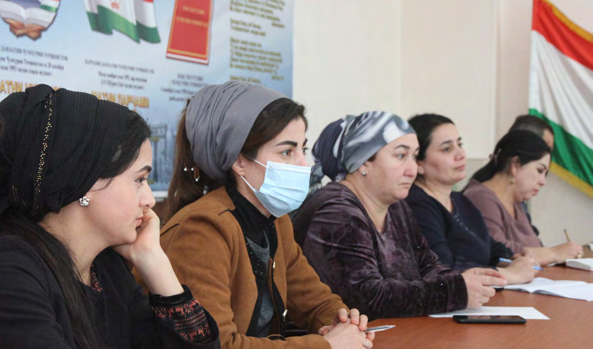

**Image 2 OCR + Description:**
```
**Image Description:**
The image depicts a pictorial representation of a page being peeled or turned from the corner. The page is white and curved, with its upper left corner folded over to reveal a silver or grey underside. The background behind the page is entirely black, creating a strong contrast that emphasizes the page-turning effect. 

There is no visible text or other elements on the page or in the image. The visual suggests themes of uncovering, transition, or revealing new information, which aligns with its use in an annual development report.
```


## Page 74
PH*D)"7"()75*@"75=#)(.*%<*4%$5&*67"8*B$%'0*+$'.#*D'"&.*7"&*D!D.!!!!"!!!!iO
?'$)"-*D`KTIRhKK1*)";/.#2/"#*)"(%2/*%"*#$'.#*<'"&*7"&*D!D*7../#.*#%#75/&*dKHI*:)55)%"1*V)#,*7*0/78*)"*
D`KTI[*7#*dRRK*2)55)%"H*?'$)"-*D`KTKK1*7*"/#*)";/.#2/"#*5%..*%<*dKKT*2)55)%"*V7.*$/(%$&/&1*V,)(,*0$)27$)5=*
$/<5/(#.*#,/*'"$/75)M/&*27$8W#%W27$8/#*5%../.*<$%2*LHGH*@-/"(=*F%$#-7-/W67(8/&*G/('$)#)/.1*$/.'5#)"-*
<$%2*7*$)./*)"*.,%$#W#/$2*LHGH*)"#/$/.#*$7#/.H
Figure 5.11. Investment Income by Trust Fund Classification, FY2018-2022 ($ millions)
!"#$
%#&$
%'&$
"%&$
()"*$
!"#$
!"#%
!"&'
!"&#
!"&&
!"#$
!"#%
!"&'
!"&#
!"&&
!"#$
!"#%
!"&'
!"&#
!"&&
"!$
)%$
)"$
+$
)$
"++$
)##$
)),$
!*$
(+$
!"#$%&&'
()*+,-./01-2*345-!30,4
!($%&'
6!7-2*345-!30,4
)*&(!$%!('
!6!4
()*+,-./01-2*345-!30,4
6!7-2*345-!30,4
!6!4
-./012


**Image 1 OCR + Description:**
```
**Image Description:**
The image is a section of an annual development report featuring a pie chart. The layout includes:

- The title above the chart: "Project Distribution".
- The pie chart is centrally positioned and divided into four differently colored slices.
- Each slice is labeled with a category name and its corresponding percentage:
  - "Education" (shown in a red slice) with 30%
  - "Healthcare" (orange slice) with 25%
  - "Infrastructure" (yellow slice) with 20%
  - "Environment" (green slice) with 25%
- A legend or key is present to the right of the chart, matching the colors with their respective categories.
- At the bottom of the image, there is a small note indicating: "Data as of December 2023".

Overall, the section provides a clear visual representation of how projects are distributed by category within the report.
```


## Page 75
if!!!!"!!!!46B*+$'.#*D'"&*@""'75*>/0%$#*KTKK
422/&!-$G!(,!&'*2&!,*%)2!!
$%0/2&-/%&!1('&,(6$(!
L0%"*$/(/)0#*%<*&/;/5%02/"#*07$#"/$*(%"#$):'#)%".*
#%*7*#$'.#*<'"&1*#,/*4%$5&*67"8*)";/.#.*#,/./*$/.%'$(/.*
)"* #,/* )"#/$"7#)%"75* (70)#75* 27$8/#.* '"#)5* #,/=* 7$/*
&).:'$./&* #%* <)"75* $/()0)/"#.H* +$'.#* <'"&* 7../#.* 7$/*
27"7-/&* V)#,* #,/* 0$)27$=* )";/.#2/"#* %:c/(#);/* %<*
(70)#75*0$/./$;7#)%"*7"&*5)b')&)#=*%"*&/27"&H*
+,/*0$%;).)%".*%<*#,/*4%$5&*67"8_.*B/"/$75*!";/.#2/"#*
@'#,%$)M7#)%".* <%$* !6>?* 7"&* !?@* 75.%* 7005=* #%* #,/*
)";/.#2/"#* %<* #$'.#* <'"&* 7../#.H* @((%$&)"-5=1* #,/./*
7../#.* 7$/* 27"7-/&* V)#,)"* (%"./$;7#);/* %;/$755*
$).8* #%5/$7"(/* 07$72/#/$.* 7"&* )";/.#/&* )"* ,)-,*
b'75)#=* ./('$)#)/.1* V,)(,* )"(5'&/* ./('$)#)/.* )..'/&*
:=* .%;/$/)-"* -%;/$"2/"#.1* -%;/$"2/"#* 7-/"()/.1*
+,/* 0%$#<%5)%* 7../#* 755%(7#)%"* 7.* %<* /"&* %<* D`KTKK* $/<5/(#.* 7* (%"./$;7#);/* )";/.#2/"#* 700$%7(,* 7"&*
&/</".);/*0%.)#)%")"-*#%*27)"#7)"*#,/*0%$#<%5)%*V)#,)"*#,/*0%5)(=*$).8*#%5/$7"(/H*+,/*0%$#<%5)%*)"(5'&/.*7*
57$-/*755%(7#)%"*%<*JS*0/$(/"#*)";/.#/&*)"*.%;/$/)-"*-%;/$"2/"#*:%"&.1*<%55%V/&*:=*KP*0/$(/"#*)"*(7.,*
7"&* 2%"/=* 27$8/#* )".#$'2/"#.1* II* 0/$(/"#* )"* 7-/"()/.* :%"&.* 7"&* IK* 0/$(/"#* )"* (%$0%$7#/W(%;/$/&*
:%"&.H*+,/*$/.#*%<*#,/*0%$#<%5)%*).*)";/.#/&*)"*.%;/$/)-"*-'7$7"#//&*7../#.1*7../#W:7(8/&*./('$)#)/.1*7"&*7*
.2755*755%(7#)%"*#%*/b')#)/.H*
Figure 5.12. Asset Mix of the World Bank Group Trust Funds Investment Portfolio,  
FY2018-2022
!""#$%&'()'"*$*'+
!"#$%&'()$*+
!++#,'(-%.#*'/#%012,2#+
3)4#1#*'()$*+
5#4#6)7#*'8-1.#,'9:02,2#+
8)$#&'8-1.#,
8)1,"-"#'(-%.#*'/#%012,2#+
/)4#1#2"$';)4#1$<#$,'()$*+
/)4#1#2"$';0-1-$,##*
,
-
.
/
00
1
23
-
4
/
/2
/
-0
1
-3
2
3
5
/2
/
--
3
-,
0
/2
2
/-
/
/1
3
05
.
//
-
/2
/
24
3
-0
3
67/.
67/1
6725
672/
6722
89:;#%<=>
7"&*2'5#)57#/$75*7"&*%#,/$*%O)()75*)".#)#'#)%".1*7../#W
:7(8/&* 7"&* 7-/"(=W-'7$7"#//&* 2%$#-7-/W:7(8/&*
./('$)#)/.1*7.*V/55*7.*.V70.*7"&*7*$7"-/*%<*&/$);7#);/.*
)"*.'00%$#*%<*./('$)#)/.*)";/.#2/"#.H*G':c/(#*#%*#,/*
0$)27$=*)";/.#2/"#*%:c/(#);/1*#,/*7../#*2)Z*72%"-*
#,/*)";/.#2/"#*0$%&'(#.*7'#,%$)M/&*:=*#,/*B/"/$75*
!";/.#2/"#* @'#,%$)M7#)%".* ).* :7./&* %"* 27$8/#*
%00%$#'")#)/.* 7;7)57:5/* V)#,)"* #,/* 7005)(7:5/* $).8*
5)2)#.H* @.* 07$#* %<* 2%")#%$)"-* 7"&* <)"7"()75* 7"&* $).8*
27"7-/2/"#* %;/$.)-,#1* 7* $/-'57$* $/:757"()"-* %<*
7../#.*).*0/$<%$2/&*#%*/".'$/*#,7#*/"%'-,*5)b')&)#=*).*
7;7)57:5/*#%*2//#*&).:'$./2/"#.*"//&.H
!";/.#2/"#* F7"7-/2/"#* %<* +$'.#* D'"&.* 7"&*
D)"7"()75*!"#/$2/&)7$=*D'"&.*KTKI*%O/$.*2%$/*&/#7)5.*
7:%'#* ,%V* #,/* 4%$5&* 67"8* 27"7-/.* 7"&* )";/.#.*
&/;/5%02/"#*07$#"/$*<)"7"()75*$/.%'$(/.H


## Page 76
PH*D)"7"()75*@"75=#)(.*%<*4%$5&*67"8*B$%'0*+$'.#*D'"&.*7"&*D!D.!!!!"!!!!ii
/%0$'(%-/%&46B!2(+$46B!4%)!
5(0/'%4%+/!+(%2$)/'4&$(%2
U//0)"-*07(/*V)#,*#,/*$70)&*.,)o*)"*#,/*-5%:75*7../#*
27"7-/2/"#* )"&'.#$=* #%V7$&* .'.#7)"7:5/* 7"&*
$/.0%".):5/* )";/.#)"-* eG>!f1* #,/* 4%$5&* 67"8* B$%'0*
).*(%22)##/&*#%*)"(%$0%$7#)"-*.'.#7)"7:)5)#=W$/57#/&*
#,/2/.* )"* 755* %0/$7#)%"75* 7(#);)#)/.1* )"(5'&)"-* #,/*
)";/.#2/"#*27"7-/2/"#*<'"(#)%"*/"#$'.#/&*#%*)#*:=*
)#.*(5)/"#.H*
N"&%$./&*:=*4%$5&*67"8*F7"7-/2/"#1*.#7$#)"-*<$%2*
^'5=*KTI[*#,/*67"8*+$/7.'$=*,7.*)205/2/"#/&*NGB*
!"#/-$7#)%"* 7.* #,/* 2%.#* 700$%0$)7#/* G>!* 700$%7(,*
V)#,)"*#,/*0'$;)/V*%<*#,/*!6>?s!?@*B/"/$75*!";/.#2/"#*
@'#,%$)M7#)%".* 7"&* (5)/"#._* )";/.#2/"#* -')&/5)"/.*
7.* .#)0'57#/&* )"* #,/* !";/.#2/"#* F7"7-/2/"#*
@-$//2/"#.H*D'$#,/$*)"*$/.0%"./*#%*-$%V)"-*&/27"&*
ALHAGIE MANKA / WORLD BANK
<$%2* .%2/* D!D.* #%* 0'$.'/* .#$7#/-)/.* #,7#* (%'5&*
7(,)/;/* &)$/(#* NGB* )207(#.1* #,/* G'.#7)"7:5/* 6%"&*
G#$7#/-=* ,7.* ://"* )"* )205/2/"#7#)%"* .)"(/* /"&* %<*
D`KTKI* <%55%V)"-* 7* -$7&'75* 700$%7(,1* .#7$#)"-* V)#,*
#,/* G%;/$/)-"1* G'0$7"7#)%"751* 7"&* @-/"(=* eGG@f*
'");/$./* 0/$2)..):5/* '"&/$* #,/* /Z).#)"-* !";/.#2/"#*
@'#,%$)M7#)%".H*@.*%<*^'"/*JT1*KTKK1*dSPT*2)55)%"*,7.*
://"* 755%(7#/&* #%* F]RWG'.#7)"7:)5)#=* V)#,* 7* 27$8W
#%W27$8/#* ;75'/* %<* dSST* 2)55)%"1* %'#* %<* V,)(,* JJ*
.'.#7)"7:5/* :%"&.* ,7;/* ://"* 0'$(,7./&1* .07"")"-*
-$//"1*.%()751*7"&*.'.#7)"7:)5)#=*(7#/-%$)/.*7"&*7)2)"-*
#%* 7&&$/..* 27"=* %<* #,/* G'.#7)"7:5/* ?/;/5%02/"#*
B%75.1*)"(5'&)"-*G?BWJ1*G?BWP1*G?BWQ1*7"&*G?BWIJH*
+,/*4%$5&*67"8*(%"#)"'/.*#%*/Z05%$/*7&&)#)%"75*G>!*
.#$7#/-)/.*)"*5)"/*V)#,*#,/*('$$/"#*27$8/#*0$7(#)(/.*#%*
2//#*#,/*/;%5;)"-*G>!*7.0)$7#)%".*7"&*&/;/5%02/"#*
%:c/(#);/.*%<*&/;/5%02/"#*07$#"/$.H


**Image 1 OCR + Description:**
```
**Image Description:**
The image depicts a woman wearing a blue safety helmet and a black t-shirt, kneeling on the floor while working with electronic equipment. She appears to be engaged in some technical or electrical work, connecting or adjusting wires attached to a blue device placed on the floor in front of her. The setting seems to be indoors, possibly in a workshop or training center, as suggested by the visible patterned fabric or poster boards in the background and the white grid-style door or window behind her.

There is no visible text in the image.

Key elements:
- Woman wearing a blue safety helmet
- Black t-shirt and blue jeans
- Blue electronic devices/equipment with multiple cables and wires
- Indoor setting with colorful backgrounds and white metal grid door/window

This image likely portrays a hands-on technical training or development activity, suitable for inclusion in an annual development report highlighting skills training, empowerment programs, or technical capacity building.
```
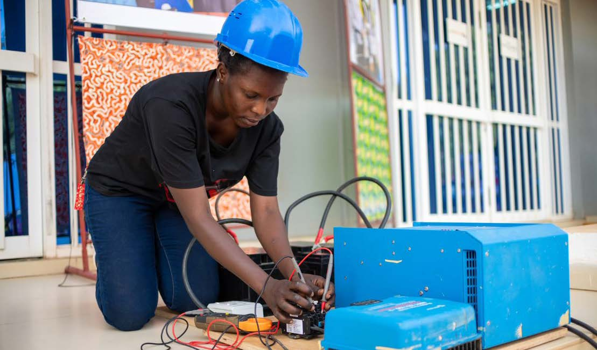

**Image 2 OCR + Description:**
```
**Image Description:**
The image appears to be a page from a report or a document with a dynamic design element—the top right corner of the page is visually "peeled back," revealing a silver or metallic-like underside. This creates a 3D effect, giving the impression that the page is being turned or peeled away.

Key elements:
- The page has a smooth, white surface.
- The peeled-back corner adds a sense of depth and movement.
- The silver or gray underside contrasts with the white page, enhancing the page-turning effect.

There is no visible text on this image. It seems to be a graphic design element rather than a content page with textual information. This might be used in an annual development report to symbolize revealing new information or transitioning to another section.
```


## Page 77
iq!!!!"!!!!46B*+$'.#*D'"&*@""'75*>/0%$#*KTKK
JULIA BURLACHENKO / WORLD BANK


**Image 1 OCR + Description:**
```
**Image Description:**
The image depicts a contrast between nature and urban decay, fitting for an annual development report that might be focusing on recovery or hope after adversity.

Layout & Key Elements:
- The foreground features vibrant yellow sunflowers with green leaves. The flowers are tall and prominent, occupying a significant portion of the lower half of the image.
- Behind the sunflowers, a heavily damaged multi-story brick building dominates the background. The building has numerous broken windows and visible structural damage, including exposed interiors and missing sections of the wall.
- The top part of the building shows damage to the roof and outer walls, emphasizing the severity of destruction.
- The sky is cloudy, adding to the somber atmosphere, but the bright sunflowers in the foreground lend a contrast with their lively colors.

Text:
- There is no text visible in the image itself.

This image can symbolize resilience and hope, with the sunflowers standing strong in front of a backdrop of destruction. It would be impactful in a development report to illustrate recovery efforts or the potential for new growth following hardship.
```


## Page 78
@""/Z/.!!!!"!!!!iZ
ANNEX A. ABBREVIATIONS AND ACRONYMS
@DN
@D4
@G@
6N
EYa!?WI[
EGY
?D)
N@]
NE@
NDY
NGB
DEG
DEa
D`
Dj!+
D!D
BQ
BKT*
B6a
B?]
B>!?
!6>?
!EG!?
!?@
!N
!NB
!DE
!FD
\E>
F?6
F?+D
FNi@
F!B@
FGFN
iBY
]]]
>N
G@>
G?B
GFN
4GFN
G>!
Li
Li!END
LG@!?
46B
4jY
+,/*4%$5&*67"8*B$%'0_.*<).(75*=/7$*$'".*<$%2*^'5=*I*#%*^'"/*JTH
L"5/..*%#,/$V)./*.0/()<)/&1*3d9*$/0$/./"#.*L")#/&*G#7#/.*&%557$.*#,$%'-,%'#*#,/*$/0%$#H
N7.#/$"*7"&*G%'#,/$"*@<$)(7*>/-)%"*
4/.#/$"*7"&*E/"#$75*@<$)(7*>/-)%"
@&;).%$=*./$;)(/.*7"&*7"75=#)(.
67"8W/Z/('#/&*7(#);)#)/.
E%$%"7;)$'.*&)./7./*KTI[
E);)5*.%()/#=*%$-7")M7#)%"
?/;/5%02/"#*D)"7"(/*a)(/W]$/.)&/"(=
N7.#*@.)7*7"&*]7()<)(*>/-)%"
N'$%0/*7"&*E/"#$75*@.)7*>/-)%"
NZ#/$"755=*<)"7"(/&*%'#0'#
N";)$%"2/"#751*.%()751*7"&*-%;/$"7"(/
D$7-)5/*7"&*(%"<5)(#W7O/(#/&*.)#'7#)%".
D$7-)5)#=1*(%"<5)(#1*7"&*;)%5/"(/
D).(75*=/7$
D'"&.*,/5&*)"*#$'.#
D)"7"()75*)"#/$2/&)7$=*<'"&
*B$%'0*%<*G/;/"*eV%$5&_.*57$-/.#*7&;7"(/&*
/(%"%2)/.*7"&*5):/$75*&/2%($7()/.f
*B$%'0*%<*+V/"#=**
eV%$5&_.*57$-/.#*/(%"%2)/.f*
B/"&/$W:7./&*;)%5/"(/
B$%..*&%2/.#)(*0$%&'(#
*B$//"1*$/.)5)/"#*7"&**
)"(5'.);/*&/;/5%02/"#
!*"#/$"7#)%"75*67"8*<%$*>/(%".#$'(#)%"*
7"&*?/;/5%02/"#
*!"#/$"7#)%"75*E/"#/$*<%$*G/##5/2/"#*%<*
!";/.#2/"#*?).0'#/.
!"#/$"7#)%"75*?/;/5%02/"#*@..%()7#)%"*
!205/2/"#)"-*/"#)#=
!"&/0/"&/"#*N;75'7#)%"*B$%'0
!"#/$"7#)%"75*D)"7"(/*E%$0%$7#)%"
!"#/$"7#)%"75*F%"/#7$=*D'"&
\7#)"*@2/$)(7*7"&*E7$)::/7"*>/-)%"
F'5#)57#/$75*&/;/5%02/"#*:7"8
F'5#)W&%"%$*#$'.#*<'"&
F)&&5/*N7.#*7"&*i%$#,*@<$)(7*>/-)%"
F'5#)57#/$75*!";/.#2/"#*B'7$7"#//*@-/"(=
F)($%1*.2755*7"&*2/&)'2W.)M/*/"#/$0$)./.
i%"W-%;/$"2/"#75*%$-7")M7#)%"
]':5)(W0$);7#/*07$#"/$.,)0
>/()0)/"#W/Z/('#/&*7(#);)#)/.
G%'#,*@.)7*>/-)%"
G'.#7)"7:5/*?/;/5%02/"#*B%75
G2755*7"&*2/&)'2W.)M/*/"#/$0$)./
*4%2/"*.2755*7"&**
2/&)'2W.)M/*/"#/$0$)./
G'.#7)"7:5/*7"&*$/.0%".):5/*)";/.#)"-
L")#/&*i7#)%".
L")#/&*i7#)%".*E,)5&$/"_.*D'"&
*L")#/&*G#7#/.*@-/"(=*<%$**
!"#/$"7#)%"75*?/;/5%02/"#*
4%$5&*67"8*B$%'0
4%$5&*j/75#,*Y$-7").7#)%"


**Image 1 OCR + Description:**
```
**Image Description:**
The image is a circular infographic titled "5 REASON OF SUCCESS!" with five key elements arranged around a central circle labeled "success." Each element has a number and corresponding text. The layout features colorful arrows and icons that connect each reason to the center.

Here are the key elements and their text:

1. "Clear Goals & Plans" (Red arrow pointing to center)
2. "Effective Strategy" (Yellow arrow pointing to center)
3. "Strong Teamwork" (Blue arrow pointing to center)
4. "Continuous Improvement" (Green arrow pointing to center)
5. "Customer Focus" (Purple arrow pointing to center)

The overall design uses gradients and vibrant colors to highlight each reason, making the infographic visually engaging as part of an annual development report.
```


## Page 79
qn!!!!"!!!!46B*+$'.#*D'"&*@""'75*>/0%$#*KTKK
ANNEX B. LIST OF BOXES, FIGURES  
AND TABLES
>(G/2
6%Z*IHIH*D%'$*]$)%$)#=*?/;/5%02/"#*Y'#(%2/.*%<*#,/*4%$5&*67"8*B$%'0*>/.0%"./*#%*#,/*EYa!?WI[*E$).).**
IS
6%Z*IHKH*4%$5&*67"8*B$%'0*+$'.#*D'"&*F7"7-/2/"#*@$$7"-/2/"#.**
IQ
6%Z*JHIH*G%2/*D7(#%$.*E%"#$):'#)"-*#%*DEa**
JP
6%Z*SHIH*E7#/-%$)/.*%<*4%$5&*67"8*B$%'0*U"%V5/&-/*]$%&'(#.*7"&*G/$;)(/.**
PT
,$5*'/2
D)-'$/*IHIH*4%$5&*67"8*+$'.#*D'"&*?).:'$./2/"#.*#%*DEaW7O/(#/&*E%'"#$)/.**
IR
D)-'$/*KHIH*4%$5&*67"8*B$%'0*EYa!?WI[*E$).).*>/.0%"./*E%22)#2/"#.1*@0$)5*I1*KTKT*#%*^'"/*JT1*KTKK**
KI
D)-'$/*KHKH*4%$5&*67"8*EYa!?WI[*>/57#/&*@(#);)#)/.1*:=*+=0/*%<*@(#);)#=1*D`KTKThKTKK**
KK
D)-'$/*KHJH*4%$5&*67"8*EYa!?WI[*+$'.#WD'"&/&*@(#);)#)/.1*:=*B5%:75*]$7(#)(/.1*D`KTKThKTKK**
KJ
D)-'$/*KHSH*4%$5&*67"8*EYa!?WI[*+$'.#WD'"&/&*@(#);)#)/.1*:=*+)2/*]/$)%&.1*D`KTKThKTKK**
KS
D)-'$/*KHPH*+%0*G/;/"*+$'.#*D'"&*]$%-$72.*D'"&)"-*EYa!?WI[*@(#);)#)/.1*]/$(/"#*G,7$/*:=**
a%5'2/*%<*B$7"#.1*D`KTKThKTKK**
KQ
D)-'$/*JHIH*!6>?1*!?@1*7"&*4%$5&*67"8*+$'.#*D'"&*?).:'$./2/"#.*<%$*>/()0)/"#WNZ/('#/&*@(#);)#)/.**
)"*E%'"#$)/.*@O/(#/&*:=*DEa1*D`KTIRhKTKK*ed*:)55)%".f**
JX
D)-'$/*JHKH*4%$5&*67"8*+$'.#*D'"&*?).:'$./2/"#.*<%$*>/()0)/"#WNZ/('#/&*@(#);)#)/.*)"*E%'"#$)/.*@O/(#/&*:=**
DEa1*D`KTIRhKTKK*ed*:)55)%".f**
JQ
D)-'$/*SHIH*4%$5&*67"8*NZ0/"&)#'$/.*%"*@&;).%$=*G/$;)(/.*7"&*@"75=#)(.1**
:=*G%'$(/*%<*D'"&.1*D`KTIRhKTKK*ed*2)55)%".f**
PI
D)-'$/*SHKH*67"8WNZ/('#/&*+$'.#*D'"&*NZ0/"&)#'$/.*<%$*E%'"#$=*7"&*B5%:75*N"-7-/2/"#*@(#);)#)/.1**
:=*+=0/*%<*@(#);)#)/.1*D`KTIRhKTKK*ed*2)55)%".f**
PI
D)-'$/*PHI*E7.,*E%"#$):'#)%".*:=*?/;/5%02/"#*]7$#"/$*+=0/C*4%$5&*67"8*B$%'0*+$'.#*D'"&.**
7"&*D!D.1*D`KTIRWKTK**
XS
D)-'$/*PHKH*+%0*+/"*?/;/5%02/"#*]7$#"/$._*E%"#$):'#)%".*#%*4%$5&*67"8*B$%'0*+$'.#*D'"&.1**
D`KTIRWKTKK*ed*:)55)%".f**
XP
D)-'$/*PHJH*@""'75*D!D*+$7".</$.*#%*4%$5&*67"8*B$%'0*7.*!205/2/"#)"-*N"#)#=1*D`KTIRWKTKK*ed*:)55)%".f*x**
+%0*D!D*+$7".</$.*#%*4%$5&*67"8*B$%'0*7.*!205/2/"#)"-*N"#)#=1*D`KTIRWKTKK*ed*2)55)%".f**
XX
D)-'$/*PHSH*G)-"/&*E%"#$):'#)%".*#%*!DE*65/"&/&*D)"7"(/*+$'.#*D'"&.1*D`KTIRWKTKK*ed*2)55)%".f**x***
G)-"/&*E%"#$):'#)%".*#%*!DE*65/"&/&*D)"7"(/*+$'.#*D'"&.*:=*?%"%$1*D`KTIRWKTKK*ed*2)55)%".f*
*XQ


## Page 80
@""/Z/.!!!!"!!!!q#
D)-'$/*PHPH*4%$5&*67"8*+$'.#*D'"&*?).:'$./2/"#.1*:=*+%0*+/"*]$%-$72.1*D`KTIRWKTKK*ed*:)55)%".f**
XR
D)-'$/*PHXH*4%$5&*67"8*+$'.#*D'"&*?).:'$./2/"#.1*:=*+%0*D);/*G#7"&W75%"/*+$'.#*D'"&.1*D`KTIRWKTKK*
X[
D)-'$/*PHQH*4%$5&*67"8*+$'.#*D'"&*?).:'$./2/"#.*<%$*>/()0)/"#WNZ/('#/&*@(#);)#)/.*:=*D!D.1*
D`KTIRWKTKK*ed*:)55)%".f**x**4%$5&*67"8*+$'.#*D'"&*?).:'$./2/"#.*<%$*>/()0)/"#WNZ/('#/&*@(#);)#)/.**
:=*D'"&)"-*G%'$(/.1*D`KTIRWKTKK*ed*:)55)%".f**
QT
D)-'$/*PHRH*4%$5&*67"8*+$'.#*D'"&*?).:'$./2/"#.*<%$*>/()0)/"#WNZ/('#/&*@(#);)#)/.*:=*>/-)%".1**
D`KTIRWKTKK*ed*:)55)%".f**
QI
D)-'$/*PH[H*?).#$):'#)%"*%<*@G@*D'"&)"-*D`KTIRWKTKK**
QK
D)-'$/*PHITH*?).#$):'#)%"*%<*4%$5&*67"8*B$%'0*+$'.#*D'"&*@../#.1*D`KTKK**
QJ
D)-'$/*PHIIH*!";/.#2/"#*!"(%2/*:=*+$'.#*D'"&*E57..)<)(7#)%"1*D`KTIRWKTKK*ed*2)55)%".f**
QP
D)-'$/*PHIKH*@../#*F)Z*%<*#,/*4%$5&*67"8*B$%'0*+$'.#*D'"&.*!";/.#2/"#*]%$#<%5)%1*D`KTIRWKTKK**
QX
&4>6/2
+7:5/*JHIH*+%0*+/"*>/()0)/"#*E%'"#$)/.*@O/(#/&*:=*DEa1*:=*+$'.#*D'"&*?).:'$./2/"#.1**
D`KTIRhKTKK*ed*2)55)%".f**
JR
+7:5/*SHIH*E%'"#$=W5/;/5*+$'.#W<'"&/&*@G@*D/7#'$/&*)"*E,70#/$.*K*7"&*J**
PK
+7:5/*PHIH*U/=*G#7#).#)(.*%"*4%$5&*67"8*B$%'0*+$'.#*D'"&.*7"&*D!D.1*D`KTIRhKK**
XK


## Page 81
qj!!!!"!!!!46B*+$'.#*D'"&*@""'75*>/0%$#*KTKK
./012314(5/678(9()7:3;4::(7;32:(
<6
=>?/4@@0(%&-(./6A/0>
Nb')#7:5/*B$%V#,1*D)"7"(/*7"&*
!".#)#'#)%".*]$7(#)(/*B$%'0
I
E%20/#)#);/"/..*<%$*^%:.*7"&*N(%"%2)(**
+$7".<%$27#)%"*eEW^N+f
K
E%".'5#7#);/*B$%'0*#%*@..).#*#,/*]%%$*eEB@]f
J
?/:#*F7"7-/2/"#*D7()5)#=*e?FDf
S
D)"7"(/*<%$*?/;/5%02/"#*eDS?f
P
D)"7"()75*27"7-/2/"#*7"&*@((%'"#7:)5)#=*eDFu@f
X
D)"7"()75*G/(#%$*>/<%$2*7"&*G#$/"-#,/")"-*!")#)7#);/**
eD!>G+*KHTf
Q
D).(75*]%5)(=*7"&*G'.#7)"7:5/*B$%V#,
R
B5%:75*+7Z*]$%-$72*eB+]f
[
B%;/$"7"(/*7"&*!".#)#'#)%".*eBu!f
IT
]$%('$/2/"#*<%$*?/;/5%02/"#*e]S?f*
II
>).8*D)"7"(/
IK
L2:$/557*D7()5)#=*<%$*]%;/$#=*7"&*Nb')#=*eLD]Nf
IJ
L2:$/557*D7()5)#=*<%$*+$7&/*eLD+f
j'27"*?/;/5%02/"#**
]$7(#)(/*B$%'0
IS
D%'"&7#)%"75*\/7$")"-*E%207(#*eD\Ef
IP
B5%:75*D)"7"()"-*D7()5)#=*<%$*4%2/"1*E,)5&$/"*7"&**
@&%5/.(/"#.*eBDDf
IX
j/75#,*N2/$-/"(=*]$/07$/&"/..*7"&*>/.0%"./*D'"&*ejN]>f
IQ
j/75#,=*\);/.1*i'#$)#)%"*7"&*]%0'57#)%"*ej\i]f
IR
j'27"*E70)#75*L2:$/557
I[
^Y6G*L2:$/557*]7$#"/$.,)0
KT
UiYF@?*h*F)-$7#)%"*L2:$/557
ANNEX C. LIST OF UMBRELLA 2.0 PROGRAMS 
AS OF JUNE 30, 2022*


## Page 82
@""/Z/.!!!!"!!!!qk
./012314(5/678(9()7:3;4::(7;32:(
<6
=>?/4@@0(%&-(./6A/0>
j'27"*?/;/5%02/"#**
]$7(#)(/*B$%'0
KI
>70)&*G%()75*>/.0%"./h@&70#);/*7"&*?="72)(**
G%()75*]$%#/(#)%"*e>G>W@?G]f
KK
+/$#)7$=*N&'(7#)%"*7"&*G8)55.*+$7)")"-*e+NG+f*L2:$/557
KJ
L2:$/557*D7()5)#=*<%$*B/"&/$*Nb'75)#=*eLDBNf
!"<$7.#$'(#'$/*]$7(#)(/*B$%'0
KS
?)-)#75*?/;/5%02/"#*]7$#"/$.,)0*e??]f
KP
N"/$-=*G/(#%$*F7"7-/2/"#*@..).#7"(/*]$%-$72*eNGF@]f
KX
NZ#$7(#);/.*B5%:75*]$%-$7227#)(*G'00%$#*K*eNB]GWKf
KQ
B5%:75*D7()5)#=*#%*?/(7$:%")M/*+$7".0%$#
KR
B5%:75*>%7&*G7</#=*D7()5)#=*eB>GDf*KHT
K[
!&/"#)<)(7#)%"*<%$*?/;/5%02/"#*e!?S?f
JT
]':5)(W]$);7#/*!"<$7.#$'(#'$/*@&;).%$=*D7()5)#=*e]]!@Df
JI
G'.#7)"7:5/*!"<$7.#$'(#'$/
G'.#7)"7:5/*?/;/5%02/"#**
]$7(#)(/*B$%'0
JK
E5)27#/*N2)..)%".*>/&'(#)%"*D7()5)#=*eEN>Df*
JJ
E5)27#/*G'00%$#*D7()5)#=
JS
D%%&G=.#/2.KTJT
JP
B5%:75*D7()5)#=*<%$*?).7.#/$*>/&'(#)%"*7"&*>/(%;/$=*eBD?>>f
JX
B5%:75*]7$#"/$.,)0*%"*>/.'5#.W67./&*@00$%7(,/.*eB]>6@f
JQ
B5%:75*]$%-$72*%"*G'.#7)"7:)5)#=*eB]Gf
JR
B5%:75*47#/$*G/('$)#=*7"&*G7")#7#)%"*]7$#"/$.,)0*eB4G]f
J[
j'27"*>)-,#.1*!"(5'.)%"*7"&*N20%V/$2/"#*ej>!Nf
ST
\7"&*KTJT*B5%:75*]7$#"/$.,)0
SI
]7$#"/$.,)0*<%$*F7$8/#*!205/2/"#7#)%"*D7()5)#=*e]F!Df
SK
]>Y6\LN
SJ
]>YE\N@i*


## Page 83
qI!!!!"!!!!46B*+$'.#*D'"&*@""'75*>/0%$#*KTKK
./012314(5/678(9()7:3;4::(7;32:(
<6
=>?/4@@0(%&-(./6A/0>
G'.#7)"7:5/*?/;/5%02/"#**
]$7(#)(/*B$%'0
SS
]>YB>NNi
SP
G%()75*G'.#7)"7:)5)#=*!")#)7#);/*<%$*@55*eGG!S@\\f
SX
G'.#7)"7:5/*L$:7"*7"&*>/-)%"75*?/;/5%02/"#*eGL>BNf
?/;/5%02/"#*N(%"%2)(.*e?NEf
SQ
B5%:75*?7#7*D7()5)#=
SR
!207(#*N;75'7#)%"*#%*?/;/5%02/"#*!207(#*e)K)f
S[
U"%V5/&-/*<%$*E,7"-/*]$%-$72*eUE]f
D$7-)5)#=1*E%"<5)(#*7"&*a)%5/"(/
PT
G#7#/*7"&*]/7(/:')5&)"-*D'"&*KHT*eG]D*KHTf
N7.#/$"*7"&*G%'#,/$"*@<$)(7**
>/-)%"*e@DNf
PI
j%$"*%<*@<$)(7*L2:$/557
PK
G%275)7*E%'"#$=*N"-7-/2/"#
PJ
G%'#,*G'&7"*L2:$/557
PS
G'&7"*+$7".)#)%"*7"&*>/(%;/$=*G'00%$#*eG+@>Gf
PP
t)2:7:V/*G%()%WN(%"%2)(*+$7".<%$27#)%"
4/.#/$"*7"&*E/"#$75*@<$)(7**
>/-)%"*e@D4f
PX
@D4*>/-)%"75*L2:$/557
PQ
\):/$)7*>/(%".#$'(#)%"
N7.#*@.)7*7"&**
#,/*]7()<)(*>/-)%"
PR
F=7"27$*G#$7#/-)(*]7$#"/$.,)0*eFG]f
P[
]70'7*i/V*B')"/7*7"&*#,/*]7()<)(*!.57"&.*L2:$/557**
D7()5)#=*e]]!LDf
XT
+)2%$W\/.#/*G#$7#/-)(*]7$#"/$.,)0*e+\G]f*
\7#)"*@2/$)(7*7"&**
E7$)::/7"*>/-)%"
XI
+,/*E7$)::/7"*F?+D*D7()5)#=*eE7F?+DDf
F)&&5/*N7.#*7"&**
i%$#,*@<$)(7*>/-)%"
XK
\/:7"%"*D)"7"()"-*D7()5)#=
XJ
FNi@*>/-)%"75*L2:$/557*KHT
XS
]75/.#)")7"*L2:$/557*<%$*>/.)5)/"(/*G'00%$#*#%*#,/*N(%"%2=
XP
+'").)7*N(%"%2)(*>/.)5)/"(/*7"&*!"(5'.)%"*e+N>!f
XX
`/2/"*>/.)5)/"(/1*>/(%;/$=*7"&*>/(%".#$'(#)%"**
L2:$/557*]$%-$72


## Page 84
@""/Z/.!!!!"!!!!qO
./012314(5/678(9()7:3;4::(7;32:(
<6
=>?/4@@0(%&-(./6A/0>
G%'#,*@.)7*>/-)%"
XQ
@<-,7").#7"*>/(%".#$'(#)%"*+$'.#*D'"&*e@>+Df
XR
!"&)7*E%'"#$=*L2:$/557
X[
]78).#7"yITT*+$'.#*D'"&
QT
G%'#,*@.)7*>/-)%"75*!"#/-$7#)%"*7"&*E%%0/$7#)%"**
L2:$/557*eG@>>Nf
E,/(8*27$8*)"&)(7#/.*#,7#*#,/*0$%-$72*,7.*://"*<%$2755=*/.#7:5).,/&H*
l*@"=*(,7"-/.*#%*0$%0%./&*L2:$/557*KHT*]$%-$72.*27&/*7o/$*^'"/*JT1*KTKK*7$/*"%#*$/<5/(#/&*)"*#,).*#7:5/H


## Page 85
qf!!!!"!!!!46B*+$'.#*D'"&*@""'75*>/0%$#*KTKK
ANNEX D. LIST OF TRUST FUNDS AND FIFS 
REFERENCED IN THIS REPORT
B6/@C()0;D(E/7:2(F7;C:
&PQNR!,QTU
&PQNR!,QTU!%V[X|)XWXcMY[XTR!1VPRTXP
EXacKTJ
@>+D
@<-,7").#7"*>/(%".#$'(#)%"*+$'.#*D'"&
,##0.CssVVVHV:W7$#<H%$-s
@<$)(7*>N??n*]$%-$72
,##0.Css$/&&H'"<(((H)"#s
E5)27#/*7"&*?).7.#/$*>).8*F7"7-/2/"#*<%$*
j/75#,*G=.#/2.
,##0.CssVVVH-<&$$H%$-s/"s(5)27#/W&).7.#/$W
$/.)5)/"#W,/75#,W.=.#/2.
EGD
E5)27#/*G'00%$#*D7()5)#=
,##0.CssVVVHV%$5&:7"8H%$-s/"s0$%-$72.s
(5)27#/W.'00%$#W<7()5)#=
E!!]
E%20/#)#);/*!"&'.#$)/.*7"&**
!""%;7#)%"*]$%-$72
,##0.CssVVVH#,/())0H%$-s
?FD
?/:#*F7"7-/2/"#*D7()5)#=
,##0.CssVVVH&2<7()5)#=H%$-s
??]
?)-)#75*?/;/5%02/"#*]7$#"/$.,)0
,##0.CssVVVHV%$5&:7"8H%$-s/"s0$%-$72.s
&)-)#75W&/;/5%02/"#W07$#"/$.,)0
NGF@]
N"/$-=*G/(#%$*F7"7-/2/"#**
@..).#7"(/*]$%-$72
,##0.CssVVVH/.270H%$-s
NN]]
N'$%0/7"*E%22)..)%"h4%$5&*67"8*
]7$#"/$.,)0*%"*N'$%0/*7"&*E/"#$75*@.)7
NLKTKT
N'$%0/KTKT*]$%-$7227#)(*+$'.#*D'"&
NB]G
NZ#$7(#);/.*B5%:75*]$%-$7227#)(*G'00%$#*
,##0.CssVVVHV%$5&:7"8H%$-s/"s0$%-$72.s
/-0.
DE]D
D%$/.#*E7$:%"*]7$#"/$.,)0*D7()5)#=*
,##0.CssVVVH<%$/.#(7$:%"07$#"/$.,)0H%$-s
D%%&G=.#/2.KTJT
,##0.CssVVVHV%$5&:7"8H%$-s/"s#%0)(s
7-$)('5#'$/s:$)/<s<%%&W.=.#/2.WKTJT
BEDD
B5%:75*E%"(/..)%"75*D)"7"(/*D7()5)#=
,##0.Css-5%:75(OH%$-s
BD?>>
B5%:75*D7()5)#=*<%$*?).7.#/$*>/&'(#)%"**
7"&*>/(%;/$=
,##0.CssVVVH-<&$$H%$-s/"


## Page 86
@""/Z/.!!!!"!!!!qi
&PQNR!,QTU
&PQNR!,QTU!%V[X|)XWXcMY[XTR!1VPRTXP
EXacKTJ
BDD
B5%:75*D)"7"()"-*D7()5)#=*<%$*4%2/"1**
E,)5&$/"1*7"&*@&%5/.(/"#.
,##0.CssVVVH-5%:75<)"7"()"-<7()5)#=H%$-s
B]>6@
B5%:75*]7$#"/$.,)0*<%$*>/.'5#.W67./&*
@00$%7(,/.
,##0.CssVVVH-0$:7H%$-s
B]G@
B5%:75*]7$#"/$.,)0*<%$*G%()75*@((%'"#7:)5)#=
,##0.Css#,/-0.7H%$-s
B]G
B5%:75*]$%-$72*%"*G'.#7)"7:)5)#=
,##0.CssVVVHV%$5&:7"8H%$-s/"s0$%-$72.s
-5%:75W0$%-$72W%"W.'.#7)"7:)5)#=
B>)D
B5%:75*>).8*D)"7"()"-*D7()5)#=
,##0.Css-5%:75$).8<)"7"()"-H%$-s
B>GD
B5%:75*>%7&*G7</#=*D7()5)#=
,##0.CssVVVH$%7&.7</#=<7()5)#=H%$-
B+]
B5%:75*+7Z*]$%-$72
,##0.CssVVVHV%$5&:7"8H%$-s/"s0$%-$72.s
#,/W-5%:75W#7ZW0$%-$72
B4G]
B5%:75*47#/$*G/('$)#=*7"&*G7")#7#)%"*
]7$#"/$.,)0
,##0.CssVVVHV%$5&:7"8H%$-s/"s0$%-$72.s
-5%:75WV7#/$W./('$)#=W.7")#7#)%"W07$#"/$.,)0
jE]
j'27"*E70)#75*L2:$/557*]$%-$72
jN]>
j/75#,*N2/$-/"(=*]$/07$/&"/..*7"&*
>/.0%"./*D'"&
,##0.CssVVVH,/75#,/2/$-/"()/.H%$-s
j>!N
j'27"*>)-,#.1*!"(5'.)%"*7"&*N20%V/$2/"#
,##0.CssVVVHV%$5&:7"8H%$-s/"s0$%-$72.s
,'27"$)-,#.
!?S?
!&/"#)<)(7#)%"*<%$*?/;/5%02/"#
,##0.Css)&S&HV%$5&:7"8H%$-s
!6N]
!20$%;)"-*6'.)"/..*N";)$%"2/"#**
<%$*]$%.0/$)#=
,##0.CssVVVHV%$5&:7"8H%$-s/"s0$%-$72.s
):/0
!N!
!"(5'.);/*N&'(7#)%"*!")#)7#);/
,##0.CssVVVH)"(5'.);/W/&'(7#)%"W)")#)7#);/H
%$-s
!"<%?/;
!"<%$27#)%"*<%$*?/;/5%02/"#*]$%-$72
,##0.CssVVVH)"<%&/;H%$-s
UE]
U"%V5/&-/*<%$*E,7"-/*L2:$/557*]$%-$72
,##0.CssVVVHV%$5&:7"8H%$-s/"s0$%-$72.s
8"%V5/&-/W<%$W(,7"-/
UBB+D
U%$/7*B$//"*B$%V#,*+$'.#*D'"&
,##0.CssVVVHV:-8--#<H%$-s
]E>@D!
]7()<)(*E7#7.#$%0,/*>).8*@../..2/"#*7"&*
D)"7"()"-*!")#)7#);/
,##0.CssVVVH-<&$$H%$-s/"s07()<)(W(7#7.#$%0,/W
$).8W7../..2/"#W7"&W<)"7"()"-W)")#)7#);/W
0,7./WJ


## Page 87
qq!!!!"!!!!46B*+$'.#*D'"&*@""'75*>/0%$#*KTKK
&PQNR!,QTU
&PQNR!,QTU!%V[X|)XWXcMY[XTR!1VPRTXP
EXacKTJ
]>Y6\LN
]>Y6\LN*L2:$/557*]$%-$72
,##0.CssVVVHV%$5&:7"8H%$-s/"s0$%-$72.s
0$%:5'/
]]!@D
]':5)(W]$);7#/*!"<$7.#$'(#'$/*@&;).%$=*D7()5)#=
,##0.Css00)7<H%$-s
v!!]
v'75)#=*!"<$7.#$'(#'$/*!";/.#2/"#*]7$#"/$.,)0
,##0.CssVVVHV%$5&:7"8H%$-s/"s0$%-$72.s
b'75)#=W)"<$7.#$'(#'$/W)";/.#2/"#W07$#"/$.,)0
>G>W@?G]
>70)&*G%()75*>/.0%"./h@&70#);/*7"&*
?="72)(*G%()75*]$%#/(#)%"*]$%-$72
,##0.CssVVVHV%$5&:7"8H%$-s/"s0$%-$72.s
$70)&.%()75$/.0%"./0$%-$72
GD]
G#7#/*7"&*]/7(/:')5&)"-*D'"&*
,##0.CssVVVHV%$5&:7"8H%$-s/"s0$%-$72.s
.#7#/W7"&W0/7(/W:')5&)"-W<'"&
GL>BN
G'.#7)"7:5/*L$:7"*7"&*>/-)%"75*?/;/5%02/"#
,##0.CssVVVHV%$5&:7"8H%$-s.'$-/
+N>!
+'").)7*N(%"%2)(*>/.)5)/"(/*7"&*!"(5'.)%"
LDBN
L2:$/557*D7()5)#=*<%$*B/"&/$*Nb'75)#=
,##0.CssVVVHV%$5&:7"8H%$-s/"s0$%-$72.s
'2:$/557<7()5)#=<%$-/"&/$/b'75)#=
LD]N
L2:$/557*D7()5)#=*<%$*]%;/$#=*7"&*Nb')#=
LD+
L2:$/557*D7()5)#=*<%$*+$7&/
,##0.CssVVVHV%$5&:7"8H%$-s/"s0$%-$72.s
'2:$/557W<7()5)#=W<%$W#$7&/zP
46uB
4/.#*67"8*7"&*B7M7*F?+D
,##0.CssVVVHV%$5&:7"8H%$-s/"s0$%-$72.s
075/.#)")7"W07$#"/$.,)0W<%$W)"<$7.#$'(#'$/W
#$'.#W<'"&
46*4/WD)
4%$5&*67"8*4/WD)*]$%-$72
,##0.CssV/W<)H%$-s)205/2/"#)"-W07$#"/$.s
V%$5&W:7"8s
GH5I(E/7:2(F7;C:
&PQNR!,QTU
&PQNR!,QTU!%V[X|)XWXcMY[XTR!1VPRTXP
EXacKTJ
E@DND
E%"<5)(#*@O/(#/&*7"&*D$7-)5/*N(%"%2)/.*
D7()5)#=
D@G
D'"&*<%$*@&;7"()"-*G'.#7)"7:)5)#=
>NE+D
>/"/V7:5/*N"/$-=*7"&*E7#75=.#*+$'.#*D'"&
46uB*+D
4/.#*67"8*7"&*B7M7*+$'.#*D'"&


## Page 88
@""/Z/.!!!!"!!!!qZ
HFJ(E/7:2(F7;C:
&PQNR!,QTU
&PQNR!,QTU!%V[X|)XWXcMY[XTR!1VPRTXP
EXacKTJ
+DTQK[Q[
!DE*G'00%$#*<%$*BKT*E%207(#*V)#,*@<$)(7*
!")#)7#);/*W*!GE@*eB/$27"=1*i%$V7=1*
i/#,/$57"&.f
,##0.CssVVVH(%207(#V)#,7<$)(7H%$-s(%"#/"#s
(%207(#V)#,7<$)(7s,%2/H,#25
+DTQJXPS
!DE.*D%%&*G=.#/2.*?/;/5%02/"#**
]$%-$72*eB/$27"=f
,##0.Css0$/..$%%2H)<(H%$-s755s07-/.s
]$/..?/#7)5H7.0Z{!?|KXSTR
+DTQKQSR
+,/*]$);7#/*G/(#%$*4)"&%V*%<*#,/*B5%:75*
@-$)('5#'$/*7"&*D%%&*G/('$)#=*]$%-$72*
eB@DG]f*W*@&;).%$=*]$%c/(#.*G'00%$#/&*:=**
LU*4)"&%V*eL")#/&*U)"-&%2f
,##0.CssVVVH)<(H%$-sV0.sV(2s(%""/(#s
+%0)(.}NZ#}E%"#/"#s!DE}NZ#/$"75}E%$0%$7#/}
G)#/s6DsD%('.W@$/7.s:<W7-$)
,##0.Css0$/..$%%2H)<(H%$-s755s07-/.s
]$/..?/#7)5H7.0Z{!?|KXSKS
+DTQJIKR
+,/*4%2/"*N"#$/0$/"/'$.,)0*D)"7"(/*
!")#)7#);/*e4/WD)f
,##0.CssVVVH)<(H%$-sV0.sV(2s(%""/(#s
#%0)(.}/Z#}(%"#/"#s)<(}/Z#/$"75}(%$0%$7#/}
.)#/s:<s<%('.W7$/7.s:<W.2/s:<WV/W<)
,##0.Css0$/..$%%2H)<(H%$-s755s07-/.s
]$/..?/#7)5H7.0Z{!?|KXSKS
+DTQKJSI
D)"7"()75*G'00%$#*<%$*@&;).%$=*G/$;)(/.*
>/57#)"-*#%*#,/*N#,)%0)7*]$);7#/*G/(#%$*
?/;/5%02/"#*!")#)7#);/*e!#75=1*i/#,/$57"&.1*
i%$V7=1*GV/&/"1*LGf
,##0.CssVVVH)<(H%$-sV0.sV(2s(%""/(#s
"/V.}/Z#}(%"#/"#s)<(}/Z#/$"75}(%$0%$7#/}
.)#/s"/V.n7"&n/;/"#.s"/V.s)".)-,#.s
/#,)%0)7W$/<%$2.{E!?|!DE}++}!DE}Ni}Nr+
+DTQIRPT
B5%:75*G2755*7"&*F/&)'2*N"#/$0$)./.*eGFNf*
D)"7"()"-*!")#)7#);/*eL")#/&*U)"-&%2f
,##0.CssVVVH)<(H%$-sV0.sV(2s(%""/(#s
)"&'.#$=}/Z#}(%"#/"#s)<(}/Z#/$"75}(%$0%$7#/}
.)#/s<)"7"()75n)".#)#'#)%".s0$)%$)#)/.s
.2/n<)"7"(/s-5%:75n.2/n<)"7"(/n<7()5)#=
+DTQJJQJ
FNi@*FGFN*KHT*W*F'5#)*?%"%$*+$'.#*D'"&*
F)&&5/*N7.#*7"&*i%$#,*@<$)(7*eFNi@f*F)($%1*
G2755*7"&*F/&)'2*N"#/$0$)./.*eFGFNf*KHT*W*
F%$%((%*+$'.#*D'"&*eL")#/&*U)"-&%2f
,##0.CssVVVH)<(H%$-sV0.sV(2s(%""/(#s
0':5)(7#)%".}/Z#}(%"#/"#s)<(}/Z#/$"75}
0':5)(7#)%"}.)#/s0':5)(7#)%".}5).#)"-}07-/s
(%;)&WI[W/O/(#W%"W2.2/.W)"W2/7


## Page 89
Zn!!!!"!!!!46B*+$'.#*D'"&*@""'75*>/0%$#*KTKK
&PQNR!,QTU
&PQNR!,QTU!%V[X|)XWXcMY[XTR!1VPRTXP
EXacKTJ
+DTQJSTJ
+DTQJSTJW*U78'27*U75%:/=/)*E,755/"-/*
D'"&*W*!"#/$"7#)%"75*D)"7"(/*E%$0%$7#)%"*
e!DEf*NZ/('#/&*+$'.#*D'"&*eNE1*B/$27"=1*
GV)#M/$57"&1*L")#/&*U)"-&%2f
,##0.Css88(<8/H%$-s
+DTQKRIP
+DTQKRIPWB5%:75*6'.)"/..*!""%;7#)%"*
]7$#"/$.,)0*eB6!]f*e?/"27$8f
,##0.Css0$/..$%%2H)<(H%$-s755s07-/.s
]$/..?/#7)5H7.0Z{!?|KXXXS
,##0.CssVVVH)<(H%$-sV0.sV(2s
(%""/(#s&IIQISTIWKQ/PWSJJTW7K[<W
[P:IJ:7[J[XPs!DEn7"&n?/"27$8nD`KIH
0&<{FY?|@^]N>NGuEa!?|"+[I(W>
+DTKPTST
+DTKPTSTWD%$2/$*^707"*E%20$/,/".);/**
+$'.#*D'"&*e^707"f
,##0.Css0$/..$%%2H)<(H%$-s755s07-/.s
]$/..?/#7)5H7.0Z{!?|KXXXS
,##0.CssVVVH)<(H%$-sV0.sV(2s
(%""/(#s2'5#)5)"-'75}/Z#}(%"#/"#s
)<(}/Z#/$"75}(%$0%$7#/}.)#/s
)<(},%2/}c707"sc707"}07$#"/$.,)0s
(%"#$):'#)%"n%<n#,/n-%;/$"2/"#n%<nc707"s
(c#<}/"
+DTQT[[J
]N]*@<$)(7C*E%"<5)(#*@O/(#/&*G#7#/.*)"*@<$)(7*
!")#)7#);/*eE@G@f*e!$/57"&1*i/#,/$57"&.1*
i%$V7=1*L")#/&*U)"-&%2f
,##0.CssVVVH)<(H%$-sV0.s
V(2s(%""/(#sX/Q:Q:<KW&P[[W
S7SKW[/IXW:[7T/:<I([[<s
!DEnE@G@nD$7-)5)#=nD7(#nG,//#.H
0&<{FY?|@^]N>NGuEa!?|55+'c!BM
,##0.Css0$/..$%%2H)<(H%$-s755s07-/.s
]$/..?/#7)5H7.0Z{!?|KXXXS
+DTQKISX
D)"7"()75*G'00%$#*<%$*7*]$%-$72*%<*@&;).%$=*
G/$;)(/.*>/57#)"-*#%*!"(5'.);/*B$//"*B$%V#,*
e?/"27$8f
,##0.Css0$/..$%%2H)<(H%$-s755s07-/.s
]$/..?/#7)5H7.0Z{!?|KXXXS
,##0.CssVVVH)<(H%$-sV0.sV(2s
(%""/(#s&IIQISTIWKQ/PWSJJTW7K[<W
[P:IJ:7[J[XPs!DEn7"&n?/"27$8nD`KIH
0&<{FY?|@^]N>NGuEa!?|"+[I(W>


## Page 90
@""/Z/.!!!!"!!!!Z#
&PQNR!,QTU
&PQNR!,QTU!%V[X|)XWXcMY[XTR!1VPRTXP
EXacKTJ
+DTQIRR[
?/07$#2/"#*%<*D%$/)-"*@O7)$.*7"&*+$7&/*
e?D@+f*W*!DE*B5%:75*@&;).%$=*G/$;)(/.*+$'.#*
D'"&1*)"(5'&)"-*B@DG]*]$%c/(#*G#7#'.*4)"&%V*
+DTRJKQ[*e@'.#$75)7f
,##0.CssVVVH5)-,#)"--5%:75H%$-sV,/$/WV/W
V%$8s5)-,#)"-W7.)7s070'7W"/VW-')"/7s
,##0.CssVVVH)<(H%$-sV0.sV(2s(%""/(#s
"/V.}/Z#}(%"#/"#s)<(}/Z#/$"75}(%$0%$7#/}
.)#/s"/V.n7"&n/;/"#.s"/V.s(2W.#%$)/.s
070'7W"/VW-')"/7WJTTW&7=.W%<W.'".,)"/
,##0.CssVVVH)<(H%$-sV0.sV(2s(%""/(#s
+%0)(.}NZ#}E%"#/"#s!DE}NZ#/$"75}E%$0%$7#/}
G)#/s6DsD%('.W@$/7.s:<W7-$)
+DTQKTXX
i/V*t/757"&*F)").#$=*%<*D%$/)-"*@O7)$.*7"&*
+$7&/*W*!"#/$"7#)%"75*D)"7"(/*E%$0%$7#)%"*N7.#*
@.)7*7"&*]7()<)(*]7$#"/$.,)0*ei/V*t/757"&f
,##0.CssVVVH5)-,#)"--5%:75H%$-sV,/$/WV/W
V%$8s5)-,#)"-W7.)7s070'7W"/VW-')"/7s
,##0.CssVVVH)<(H%$-sV0.sV(2s(%""/(#s
"/V.}/Z#}(%"#/"#s)<(}/Z#/$"75}(%$0%$7#/}
.)#/s"/V.n7"&n/;/"#.s"/V.s(2W.#%$)/.s
070'7W"/VW-')"/7WJTTW&7=.W%<W.'".,)"/
+DTQTSIT
+DTQTSITW]$);7#/*N"#/$0$)./*]7$#"/$.,)0W
]7()<)(*e]N]W]7()<)(f*+$'.#*D'"&*W*],7./*!a*
e@'.#$75)71*^707"1*i/V*t/757"&f
,##0.CssVVVH)<(H%$-sV0.sV(2s(%""/(#s
(JPIRS<SW:&[&WSK//WR&:PWIK(RPIT<[ST:s
!DEn]%V/$)"-n#,/n]7()<)(nB')&/WD!i@\H
0&<{FY?|@^]N>NGuEa!?|"]T#:.7
,##0.CssVVVH5)-,#)"--5%:75H%$-sV,/$/WV/W
V%$8s5)-,#)"-W7.)7s070'7W"/VW-')"/7s
,##0.CssVVVH)<(H%$-sV0.sV(2s(%""/(#s
"/V.}/Z#}(%"#/"#s)<(}/Z#/$"75}(%$0%$7#/}
.)#/s"/V.n7"&n/;/"#.s"/V.s(2W.#%$)/.s
070'7W"/VW-')"/7WJTTW&7=.W%<W.'".,)"/
+DTQI[KQ
+DTQI[KQWE/"#$75*@.)7*!";/.#2/"#*E5)27#/*
]$%-$72*eL")#/&*U)"-&%2f
,##0.CssVVVH)<(H%$-sV0.sV(2s
(%""/(#s&[TRQ[/&WP<SRWSR7QW[IP7W
(S:K/S(R/K/Ps!DEn7"&nLUnD`KIH
0&<{FY?|@^]N>NGuEa!?|"](4"2(
+DTQJTSI
U%$/7W!DE*]7$#"/$.,)0*]$%-$72**
e>/0':5)(*%<*U%$/7f
,##0.Css0$/..$%%2H)<(H%$-s755s07-/.s
]$/..?/#7)5H7.0Z{!?|IXQQT
+DTQKPJR
D7()5)#=*<%$*!";/.#2/"#*E5)27#/*@&;).%$=*
G/$;)(/.*eD`IQWKI*G#$7#/-=*E=(5/f*e@'.#$)71*
E7"7&71*!$/57"&1*\'Z/2:%'$-1*i/#,/$57"&.1*
i%$V7=1*GV/&/"1*GV)#M/$57"&f
,##0.CssVVVH#,/<)7.H)"<%s
,##0.CssVVVH#,/<)7.H)"<%s.)#/.s<)7.s
<)5/.sKTKKWTQsD!@GmKTKTKImKT@""'75mKT
>/;)/VmKTNZ/('#);/mKTG'227$=H0&<


## Page 91
Zj!!!!"!!!!46B*+$'.#*D'"&*@""'75*>/0%$#*KTKK
&PQNR!,QTU
&PQNR!,QTU!%V[X|)XWXcMY[XTR!1VPRTXP
EXacKTJ
+DTQKIIS
+DTQKIISW@'.#$)7W!DE*E5)27#/*E,7"-/*
]7$#"/$.,)0*]$%-$72*e@'.#$)7f
,##0.CssVVVH)<(H%$-sV0.sV(2s
(%""/(#sT7IKSX:RWQPQIWS&R7W[QTRW
I<:[S<XS<XTSs!DEn7"&n@'.#$)7nD`KIH
0&<{FY?|@^]N>NGuEa!?|"]Ia#R^
+DTQJIRX
+DTQJIRXWE5)27#/*@&;).%$=*]7$#"/$.,)0**
eE@]f*ei/#,/$57"&.f
,##0.CssVVVH)<(H%$-sV0.sV(2s
(%""/(#sQ&S7/T7:WSJ:SWSS(<W7T7JW
/IJ</T<7KPSXs!DEn7"&ni/#,/$57"&.nD`IRH
0&<{FY?|@^]N>NGuEa!?|2.Y[6IRzC~C#/Z#*
|!"mKTKTIRmKEmKT!DEmKT7"&mKT
#,/1-$//"mKT<)"7"(/mKEmKT-$//"mKT
:')5&)"-.mKT7"&
,##0.Css0$/..$%%2H)<(H%$-s755s07-/.s
]$/..?/#7)5H7.0Z{!?|KXPXS
+DTQKJJ[
]$%c/(#*?/;/5%02/"#*D7()5)#=*#%*G'00%$#*
!"<$7.#$'(#'$/*#%*6')5&*>/.)5)/"(/*e>%(8/</55/$*
D%'"&7#)%"f
,##0.Css0$/..$%%2H)<(H%$-s755s07-/.s
]$/..?/#7)5H7.0Z{!?|IQ[PT
+DTQJIIJ
D)"57"&W!DE*65/"&/&*D)"7"(/*<%$**
E5)27#/*]$%-$72*eD)"57"&f
,##0.CssVVVH)<(H%$-sV0.sV(2s(%""/(#s
#%0)(.}/Z#}(%"#/"#s)<(}/Z#/$"75}(%$0%$7#/}
.)#/s:<s<%('.W7$/7.s:<W(5)27#/s<)"57"&
,##0.Css0$/..$%%2H)<(H%$-s755s07-/.s
]$/..?/#7)5H7.0Z{!?|KPRXX
+DTQJJSX
FNi@*]$);7#/*G/(#%$*?/;/5%02/"#*e]G?f*
]$%-$72*W*@&;).%$=*E%20%"/"#*ei/#,/$57"&.f
,##0.Css0$/..$%%2H)<(H%$-s755s07-/.s
]$/..?/#7)5H7.0Z{!?|IQQIJ
,##0.Css0$/..$%%2H)<(H%$-s755s07-/.s
]$/..?/#7)5H7.0Z{!?|KPRXX
+DTQJISK
]':5)(W]$);7#/*]7$#"/$.,)0*@&;).%$=*D'"&*
<%$*!"<$7.#$'(#'$/*!";/.#2/"#*)"*?/;/5%0)"-*
E%'"#$)/.*eB/$27"=f
,##0.CssVVVH)<(H%$-sV0.sV(2s
(%""/(#sIIIKPXJ(W(IR[WST/JW:R(JW
7:S7QT[QJQ<Rs!DEn7"&nB/$27"=nD`KIH
0&<{FY?|@^]N>NGuEa!?|"]It?JG
,##0.CssVVVH)<(H%$-sV0.sV(2s(%""/(#s
!"&'.#$=}Nr+}E%"#/"#s!DE}NZ#/$"75}
E%$0%$7#/}G)#/s]]]s]7$#"/$.s


## Page 92
@""/Z/.!!!!"!!!!Zk
&PQNR!,QTU
&PQNR!,QTU!%V[X|)XWXcMY[XTR!1VPRTXP
EXacKTJ
+DTQJIK[
67"-57&/.,*4%2/"*G2755*7"&*F/&)'2*
N"#/$0$)./.*ei%$V7=f
,##0.CssVVVH)<(H%$-sV0.sV(2s
(%""/(#s[&T[J/P/WOQ:WSR<7WRIX7W
::PPRX<KQ/X<s!DEn7"&ni%$V7=nD`KIH
0&<{FY?|@^]N>NGuEa!?|"Ga=@Ha
,##0.CssVVVHV%$5&:7"8H%$-s/"s0$%-$72.s
'2:$/557<7()5)#=<%$-/"&/$/b'75)#=s7:%'#
+DTQJPR[
67"-57&/.,*FGFN*E%;)&*>/(%;/$=**
eL")#/&*U)"-&%2f
,##0.CssVVVH)<(H%$-sV0.sV(2s
(%""/(#s&[TRQ[/&WP<SRWSR7QW[IP7W
(S:K/S(R/K/Ps!DEn7"&nLUnD`KIH
0&<{FY?|@^]N>NGuEa!?|"](4"2(
,##0.CssVVVH)<(H%$-sV0.sV(2s(%""/(#s
:IX<[T7IWKPJ/WSI[7W:I<(WQJ[:&/([[RP(s
67"-57&/.,W6'.)"/..n]5'.nG'$;/=WEH
0&<{FY?|@^]N>NGuEa!?|"2[BvrG
+DTQJSTX
!"#/$"7#)%"75*D)"7"(/*E%$0%$7#)%"*e!DEf*W*
B5%:75*!"<$7.#$'(#'$/*D7()5)#=*eB!Df*W**
G)"-70%$/*+$'.#*D'"&
,##0.CssVVVH-5%:75)"<$7<7()5)#=H%$-s07$#"/$.
+DTQJXP[
D7()5)#=*<%$*!";/.#2/"#*E5)27#/*@&;).%$=*
G/$;)(/.*eD!@Gf*eD`KKWKX*G#$7#/-=*E=(5/f
,##0.CssVVVH#,/<)7.H)"<%s
,##0.CssVVVH#,/<)7.H)"<%s.)#/.s<)7.s
<)5/.sKTKIWTXsD!@G}D`KKWKX}G#$7#/-=}D'55}
>0#}D!i@\H0&<
+DTQJJRP
D$7-)5)#=*u*E%"<5)(#W7O/(#/&*G)#'7#)%".*eDEGf*
!")#)7#);/*<%$*G':WG7,7$7"*@<$)(7*7"&*`/2/"*
F'5#)W?%"%$*+$'.#*D'"&*ei%$V7=1*!$/57"&f
,##0.Css0$/..$%%2H)<(H%$-s755s07-/.s
]$/..?/#7)5H7.0Z{!?|KXRPX
,##0.CssVVVH)<(H%$-sV0.sV(2s(%""/(#s
>NB!Yi}}Nr+}E%"#/"#s!DE}NZ#/$"75}
E%$0%$7#/}G)#/sG':WG7,7$7"n@<$)(7s]$)%$)#)/.s
D$7-)5/n7"&nE%"<5)(#n@O/(#/&nG)#'7#)%".s


## Page 93
ZI!!!!"!!!!46B*+$'.#*D'"&*@""'75*>/0%$#*KTKK
&PQNR!,QTU
&PQNR!,QTU!%V[X|)XWXcMY[XTR!1VPRTXP
EXacKTJ
+DTQJJPX
E%20$/,/".);/*^707"*+$'.#*D'"&
,##0.CssVVVH)<(H%$-sV0.sV(2s
(%""/(#s2'5#)5)"-'75}/Z#}(%"#/"#s
)<(}/Z#/$"75}(%$0%$7#/}.)#/s
)<(},%2/}c707"sc707"}07$#"/$.,)0s
(%"#$):'#)%"n%<n#,/n-%;/$"2/"#n%<nc707"s
(c#<}/"
,##0.CssVVVH)<(H%$-sV0.sV(2s(%""/(#s
"/V.}/Z#}(%"#/"#s)<(}/Z#/$"75}(%$0%$7#/}
.)#/s"/V.n7"&n/;/"#.s"/V.s(%;)&WI[W
.'005)/.
+DTQJP[I
i%$V7=*W*B5%:75*j/75#,*]57#<%$2
,##0.Css0$/..$%%2H)<(H%$-s755s07-/.s
]$/..?/#7)5H7.0Z{!?|KXIJJzC~C#/Z#|+,/mKT
07$#"/$.,)0mKTV)#,mKTi%$V7=mKT
0'#.1($)#)(75mKT0,7./mKT%<mKT#,/mKT
07"&/2)(H
,##0.Css0$/..$%%2H)<(H%$-s755s07-/.s
]$/..?/#7)5H7.0Z{!?|IQQXI
,##0.CssVVVH)<(H%$-sV0.sV(2s(%""/(#s
"/V.}/Z#}(%"#/"#s)<(}/Z#/$"75}(%$0%$7#/}
.)#/s"/V.n7"&n/;/"#.s"/V.s(%;)&WI[W
.'005)/.
+DTQJPPS
!DE*B5%:75*@&;).%$=*]$%c/(#*%"*]/$.%"75*
]$%#/(#);/*Nb')02/"#*eL")#/&*U)"-&%2f
,##0.CssVVVH)<(H%$-sV0.sV(2s(%""/(#s
"/V.}/Z#}(%"#/"#s)<(}/Z#/$"75}(%$0%$7#/}
.)#/s"/V.n7"&n/;/"#.s"/V.s(%;)&WI[W
.'005)/.
+DTQJKJS
]>YG]NE+G*]7$#"/$.,)0*%"*^%:.*7"&*
N&'(7#)%"*<%$*D%$():5=*?).057(/&*]/$.%".*
eD?]f*7"&*j%.#*E%22'")#)/.*ei/#,/$57"&.f
,##0.CssVVVH)<(H%$-sV0.sV(2s
(%""/(#sQ&S7/T7:WSJ:SWSS(<W7T7JW
/IJ</T<7KPSXs!DEn7"&ni/#,/$57"&.nD`IRH
0&<{FY?|@^]N>NGuEa!?|2.Y[6IR
,##0.CssVVVH)<(H%$-sV0.sV(2s(%""/(#s
#%0)(.}/Z#}(%"#/"#s)<(}/Z#/$"75}(%$0%$7#/}
.)#/s:<s<%('.W7$/7.s$/<'-//.


## Page 94
@""/Z/.!!!!"!!!!ZO
F3;0;130@(H;24/>4C30/K(F7;C:
e)"*750,7:/#)(75*%$&/$*:=*"72/*%<*#,/*<'"&f
&PQNR!,QTU
&PQNR!,QTU!%V[X|)XWXcMY[XTR!1VPRTXP
EXacKTJ
@D
@&70#7#)%"*D'"&
,##0.CssVVVH7&70#7#)%"W<'"&H%$-s*
@B>
@->/.'5#.
,##0.Css7-$/.'5#.H%$-s
EN]!
E%75)#)%"*<%$*N0)&/2)(**
]$/07$/&"/..*!""%;7#)%".
,##0.Css(/0)H"/#s
EB!@>
D%$2/$5=*#,/*E%".'5#7#);/*B$%'0*%"*
!"#/$"7#)%"75*@-$)('5#'$/*>/./7$(,
,##0.CssVVVH(-)7$H%$-s
E!DI
E+D
GED
E5)27#/*!";/.#2/"#*D'"&.
E5/7"*+/(,"%5%-=*D'"&
G#$7#/-)(*E5)27#/*D'"&
,##0.CssVVVH(5)27#/)";/.#2/"#<'"&.H%$-s
,##0.CssVVVH(5)27#/)";/.#2/"#<'"&.H%$-s
#%0)(.s(5/7"W#/(,"%5%-)/.
,##0.CssVVVH(5)27#/)";/.#2/"#<'"&.H%$-s
(%"#/"#s.#$7#/-)(W(5)27#/W<'"&W.#$'(#'$/
E>N4G
E5)27#/*>).8*7"&*N7$5=*47$")"-*G=.#/2.*
!")#)7#);/*
,##0.CssVVVH($/V.W)")#)7#);/H%$-s/"
?>+D
?/:#*>/5)/<*+$'.#*D'"&
B7;)K
@FE
!DD!2
B7;)1*#,/*a7(()"/*@55)7"(/*e<%$2/$5=*#,/*B5%:75*
@55)7"(/*<%$*a7(()"/.*7"&*!22'")M7#)%"f
@&;7"(/&*F7$8/#*E%22)#2/"#*<%$*
]"/'2%(%((75*a7(()"/.
!"#/$"7#)%"75*D)"7"(/*D7()5)#=*<%$*
!22'")M7#)%"
,##0.CssVVVH-7;)H%$-s
,##0.CssVVVH-7;)H%$-s)";/.#)"-W-7;)s
)""%;7#);/W<)"7"()"-s0"/'2%(%((75W72(
,##0.Css)O)2H%$-s
BEDD
B5%:75*E%"(/..)%"75*D)"7"()"-*D7()5)#=
,##0.Css-5%:75(OH%$-s


## Page 95
Zf!!!!"!!!!46B*+$'.#*D'"&*@""'75*>/0%$#*KTKK
&PQNR!,QTU
&PQNR!,QTU!%V[X|)XWXcMY[XTR!1VPRTXP
EXacKTJ
BNDJ
E6!+
\?ED
i]!D
GEED
B5%:75*N";)$%"2/"#*D7()5)#=
E707()#=*6')5&)"-*!")#)7#);/*<%$*+$7".07$/"(=
\/7.#*?/;/5%0/&*E%'"#$)/.*D'"&*<%$**
E5)27#/*E,7"-/
i7-%=7*]$%#%(%5*!205/2/"#7#)%"*D'"&
G0/()75*E5)27#/*E,7"-/*D'"&
,##0.CssVVVH#,/-/<H%$-s
,##0.CssVVVH#,/-/<H%$-s#%0)(.s(707()#=W
:')5&)"-W)")#)7#);/W#$7".07$/"(=W(:)#
,##0.CssVVVH#,/-/<H%$-s#%0)(.s5/7.#W
&/;/5%0/&W(%'"#$)/.W<'"&W5&(<
,##0.CssVVVH#,/-/<H%$-s&%('2/"#.s:$%(,'$/W
"7-%=7W0$%#%(%5W)205/2/"#7#)%"W<'"&
,##0.CssVVVH#,/-/<H%$-s#%0)(.s.0/()75W
(5)27#/W(,7"-/W<'"&W.((<
B@DG]
B5%:75*@-$)('5#'$/*7"&*D%%&*G/('$)#=*]$%-$72
,##0.CssVVVH-7<.0<'"&H%$-s
B5%:75*
D'"&
B5%:75*D'"&*#%*D)-,#*@!?G1*+':/$('5%.).**
7"&*F757$)7
,##0.CssVVVH#,/-5%:75<'"&H%$-s/"s
B!D
B5%:75*!"<$7.#$'(#'$/*D7()5)#=
,##0.CssVVVH-5%:75)"<$7<7()5)#=H%$-s
B]N
B5%:75*]7$#"/$.,)0*<%$*N&'(7#)%"
,##0.CssVVVH-5%:7507$#"/$.,)0H%$-s
BED
B$//"*E5)27#/*D'"&
,##0.CssVVVH-$//"(5)27#/H<'"&s
B>!D
B'=7"7*>N??W]5'.*!";/.#2/"#*D'"&
,##0CssVVVH-'=7"7$/&&<'"&H%$-s
j>D
j7)#)*>/(%".#$'(#)%"*D'"&
,##0.CssVVVH,7)#)$/(%".#$'(#)%"<'"&H%$-s
FNi@+DS
F)&&5/*N7.#*7"&*i%$#,*@<$)(7*+$7".)#)%"*D'"&
,##0.CssVVVH2/"7#$7".)#)%"<'"&H%$-s
]NDS
]7"&/2)(*N2/$-/"(=*D)"7"()"-*D7()5)#=
,##0.CssVVVHV%$5&:7"8H%$-s/"s#%0)(s
07"&/2)(.s:$)/<s07"&/2)(W/2/$-/"(=W
<)"7"()"-W<7()5)#=
]@D
])5%#*@'(#)%"*D7()5)#=*<%$*F/#,7"/*7"&**
E5)27#/*F)#)-7#)%"
,##0.CssVVVH0)5%#7'(#)%"<7()5)#=H%$-s
4/WD!
4%2/"*N"#$/0$/"/'$.*D)"7"(/*!")#)7#);/
,##0.CssV/W<)H%$-s
I*+,/*E+D*7"&*#,/*GED*7$/*#V%*./07$7#/*D!D.*#,7#*.'00%$#*#,/*E5)27#/*!";/.#2/"#*D'"&.H
K*@5#,%'-,*B7;)*).*"%#*7*D!D1*:%#,*@FE*7"&*!DD!2*7$/*D!D.*#,7#*0$%;)&/*<)"7"()75*$/.%'$(/.*<%$*B7;)H*@FE*%0/$7#)%"755=*(5%./&*)"*D`KTKIH
J**E6!+1*\?ED1*i]!D1*7"&*GEED*7$/*<%'$*./07$7#/*D!D.*#,7#*7$/*27"7-/&*'"&/$*#,/*BND*-%;/$"7"(/*<$72/V%$8*)"*7&&)#)%"*#%*#,/*27)"**
BND*D'"&H
S*]ND*%0/$7#)%"755=*(5%./&*)"*D`KTKI1*7"&*FNi@+D*%0/$7#)%"755=*(5%./&*)"*D`KTKKH


## Page 96
@""/Z/.!!!!"!!!!Zi
B6/@C()0;D(5/678L:(M6@4:(0;C(N4/O314:(3;(FHF:P(FQ%-%%
>VTJ!2XPWK\XN
>VTJ!'McXN
2RVTUVPU!,KTVT\KVc!
-VTV]X[XTR
2XPWK\XNV
4UUKRKMTVc!,KTVT\KVc
-VTV]X[XTR
2XPWK\XNa
+QNRM[KtXU
,KTVT\KVc!
-VTV]X[XTR
2XPWK\XN\
%Q[aXP!
MS!,$,N
+$'.#//*n*
!205/2/"#)"-*N"#)#=*n*
G/($/#7$)7#*n*
!"&/0/"&/"#*
N;75'7#)%"*YO)(/
BND1*\?ED1*GEED1**
i]!D1*E6!+
P
+$'.#//*n*
!205/2/"#)"-*N"#)#=*n*
G/($/#7$)7#
?>+D1*B@DG]1*j>D1*
B]N1*FNi@+D1*B!D1*
4NWD)*
E!D*eE+D1*GEDf1*BEDD
@D
II
+$'.#//*n*G/($/#7$)7#
]@D
I
+$'.#//*n*
!205/2/"#)"-*N"#)#=
B>!D1*BED1*E>N4G
J
+$'.#//
EB!@>1*@->/.'5#.1*EN]!
B5%:75*D'"&1*!DD!2
P
i'2:/$*%<*D!D.
IJ
R
S
KP
!"*/7(,*(/55*%<*#,).*#7:5/1*#,/*D!D.*7$/*5).#/&*)"*(,$%"%5%-)(75*%$&/$*%<*/.#7:5).,2/"#*7((%$&)"-*#%*#,/*&7#/.*7#*V,)(,*/7(,*D!D*#$'.#*<'"&*V7.*
7(#);7#/&H*G//*@""/Z*?*<%$*<'55*D!D*"72/.H*
7**G#7"&7$&*<)"7"()75*27"7-/2/"#*./$;)(/.*)"(5'&/*27"7-)"-*(%"#$):'#)%".1*,%5&)"-*<'"&.*$/(/);/&*)"*#$'.#1*)";/.#)"-*.'(,*<'"&.*0/"&)"-*
&).:'$./2/"#1*7"&*(%22)##)"-*7"&*#$7".</$$)"-*<'"&.*#%*#,/*)205/2/"#)"-s.'0/$;).)"-*/"#)#)/.H
:*@&&)#)%"75*<)"7"()75*27"7-/2/"#*./$;)(/.*)"(5'&/*$/05/").,2/"#*.'00%$#1*(7.,*<5%V*0$%c/(#)%".1*7"&*$/<5%V.s$/07=2/"#*27"7-/2/"#H
(**E'.#%2)M/&*<)"7"()75*27"7-/2/"#*./$;)(/.*)"(5'&/*('.#%2)M/&*#$/7.'$=*27"7-/2/"#*./$;)(/.*7"&*$/0%$#)"-1*/H-H*<%$*@FE1*!DD!21*7"&*
B5%:75*D'"&H*+,).*75.%*)"(5'&/.*E/$#)<)/&*N2)..)%"*>/&'(#)%".*eEN>Gf*27"7-/2/"#*<%$*@D1*.'00%$#*<%$*07"&/2)(*:%"&.*7"&*)".'$7"(/*)"*
#,/*]ND1*7"&*27"7-)"-*7'(#)%".*7"&*:%"&*)..'7"(/.*<%$*]@DH
ANNEX E. WORLD BANK GROUP’S ROLES AND 
SERVICES IN FIFS, FY2022


## Page 97
ACKNOWLEDGMENTS
+,/*KTKK*+$'.#*D'"&*@""'75*>/0%$#*V7.*0$%&'(/&*:=*#,/*+$'.#*D'"&*7"&*]7$#"/$*>/57#)%".*&/07$#2/"#*)"*#,/*
?/;/5%02/"#*D)"7"(/*a)(/*]$/.)&/"(=*%<*#,/*4%$5&*67"8*e?D+]>fH*!#*$/0$/./"#.*7*(%55/(#);/*/O%$#*#,7#*.07".*#,/*
/"#)$/*4%$5&*67"8*B$%'0H*@8),)8%*i).,)%*0$%;)&/&*#,/*%;/$755*;).)%"*%<*#,/*$/0%$#H*?)$8*>/)"/$27""*7"&*F/)*\/"-*
E,7"-*0$%;)&/&*.#$7#/-)(*7&;)(/*7"&*&)$/(#)%"H*]$7;//"*]H*?/.7:7#57*5/&*#,/*(%$/*#/72*#,7#*0$%&'(/&*#,/*$/0%$#1*
V,)(,*)"(5'&/&*E,$).#%0,/$*?H*B/$$7$&1*D5%$7*^7"/#*i7"8,'")1*\/.5)/*@.,:=1*7"&*G7#).,*U%$7"87"&7#,H
a75'7:5/*(%"#$):'#)%".*V/$/*0$%;)&/&*:=*6$)(/*v'/."/51*+$7()*],)55)0.1*\=&)7*U$'./*+)/#M1*\7$)..7*a%;81*G$)&,7$7"*
G$)");7.7;7$7&,7"1*^'5)7*\/..)"71*+7#)7"7*i)8%5.87=71*^%,"*F)(,7/5*?)72%"&1*+/$/.7*j71*E7"*U/;/"81*^/"")"/*
>7(,/5*F/=/$1*G72'/5*U727'*i-7"-71*F%#$)7*Y"=.(,'8WF%$%M%;1*^%7"7*]/#71*a)(#%$)7*^7"/*G%57"1*>%:*4$)-,#1*
a)c7=*E,7"&$7*G,/87$1*E,7"&$7./8,7$*G)$)-)$)1*B7"/.,*E,7"&$7./87$1*6)c'*]707(,7"*\'8%./1*F)(,/55/*`7"*\)1*>7,'5*
B'0#71*]7'5*@"#%"=*67$:%'$1*G$)&7$*]7&27"7:,7"1*G75%2/*@V%'$*@-7"&71*U$).,"7*+,7071*Uc/55*FH*i%$&57"&/$1*
7"&*?D+]>*.#7OH*NZ#/$"75*(%22'")(7#)%"*.'00%$#*V7.*0$%;)&/&*:=*]7#$)()7*&7*E727$71*G'$/.,*>7275)"-721*7"&*
i#72:'M/")*t/$)7*67"&7H
>/.'5#.*.#%$)/.*V/$/*(%"#$):'#/&*:=*D)../,7*+/../27*@:)..71*^/..)(7*@&5/$1*Y5'./=)*^%./0,*@&/=/2%1*B')&%*
@-%.#)"/55)1* \').* @5#%"1* U,75/&7* @##71* j7"&/* @=7"1* B'5$'* @M72%;71* N$)"* N5)M7:/#,* 675&V)"1* G':$7#7* 67$27"1*
F7$-7$/#/*YH*6)7557.1*F)(,/5*FH*6%#M'"-1*@2.75/*6'2:7'-,1*@5)"7*6'$57('1*^'5)7*\%')./*6$/)#1*^'5)/*E7$5/.1*^'5)7"7*
6/&%=7*E7$2%"71*^'5)7"7*E7.#7%W!.7M71*>7O7/55%*E/$;)-")1*F7=*`)"*E,7"1*a75/$=*E)7"()%1*i7".)7*E%".#7"#)"%'1*
G727"#,7*E%%81*\7'$/"*i)(%5/*E%$/1*F7#)"7#,*@")(/##/*?//"1*@5%87*>7,'5*?/.,07"&/1*^%./0,*?)(827"1*a)/$7*
D/(8%;71*N$"/.#%*D$7"(%W+/205/1*D7=/*B7$&)"/$1*^/..)(7*B/.'"&*D%$/$%1*N;7*B')#/$$/M*1*>7.,2)"*B'"7./8/$71*
U)##=*j750/$"1*+$7(=*j7$#1*?)7"7*j$).#%;71*@""WG%<)/*^/.0/$.%"1*F7$)%"*U)27")1*?)7"7*\7(,=1*G%2)8*\7551*F%")(7*
?/*\/%"1*?7;)&*\7V$/"(/1*G%")7*F7&,;7")1*^7"7*F75)".871*E,7$5%##/*F(E57)"Wi,570%1*U%275*F%,)"&$71*@"/5)=7*
F'55/$1*U/)8%*i7-7)1*t7$)"7*Y&)"7/;71*a);)7"*@V)#)*YV'%$1*^)*4%%"*]7$81*^%,"*]5/;)"1*B%572*>7::)1*]7'57*@"&$/7*
>%..)7.(%* L.(7#/-')1* U%5%-")"* G)"%'$%'* G/8%"-%1* F7##,)c.* G(,'$)"-1* ],%$72* G,7,1* \':7* G,7$71* @5/Z7"&/$*
G,7$7:7$%O1*?7")/5*G,/0,/$&1*@"&$/=*G,5=78,#/"8%1*@7$'.,)*G)",71*a)(#%$)7*G#$%8%;71*]7$#,7*B',7*+,78'$#71*
^%7""7*+'$"/$1*^%./*@"-/5*a)5575%:%.1*E7$%5*472:'-'1*7"&*U/$)"7*47"-H
?/.)-"*7"&*0$%&'(#)%"*V/$/*0$%;)&/&*:=*B)2-7*B$%'0H
4%$5&*67"8*B$%'0
IRIR*j*G#$//#*i41*47.,)"-#%"1*?HEH*KTSJJ
KTKHSQJHITTT
VVVHV%$5&:7"8H%$-
G%2/*$)-,#.*$/./$;/&
+,).*V%$8*).*7*0$%&'(#*%<*#,/*.#7O*%<*#,/*4%$5&*67"8*B$%'0H*+,/*:%'"&7$)/.1*(%5%$.1*&/"%2)"7#)%".1*7"&*%#,/$*
)"<%$27#)%"*.,%V"*%"*7"=*270*)"*#,).*V%$8*&%*"%#*)205=*7"=*c'&-2/"#*%"*#,/*07$#*%<*#,/*4%$5&*67"8*B$%'0*
(%"(/$")"-*#,/*5/-75*.#7#'.*%<*7"=*#/$$)#%$=*%$*#,/*/"&%$./2/"#*%$*7((/0#7"(/*%<*.'(,*:%'"&7$)/.H*i%#,)"-*,/$/)"*
.,755*(%".#)#'#/*%$*:/*(%".)&/$/&*#%*:/*7*5)2)#7#)%"*'0%"*%$*V7);/$*%<*#,/*0$);)5/-/.*7"&*)22'")#)/.*%<*#,/*4%$5&*
67"8*B$%'01*755*%<*V,)(,*7$/*.0/()<)(755=*$/./$;/&H
@55*b'/$)/.*%"*#,).*0':5)(7#)%"*.,%'5&*:/*7&&$/../&*#%*0%$#<%5)%7"75=#)(.yV%$5&:7"8H%$-
Zq!!!!"!!!!46B*+$'.#*D'"&*@""'75*>/0%$#*KTKK


**Image 1 OCR + Description:**
```
**Image Description:**
The image consists of a clean layout with a predominantly light blue and white color scheme. The background features soft, abstract curved shapes in varying shades of blue, creating a calm and professional atmosphere. There is no text or other key graphical elements present in this section of the image. The design suggests it might be used as a background or a title page in an annual development report, providing a visually appealing yet unobtrusive backdrop for text or data to be overlaid later.
```


## Page 98


**Image 1 OCR + Description:**
```
**Image Description:**
The image depicts a page layout from an annual development report. The layout includes a minimalist background designed with light blue and white curved shapes that form an arc across the top and right side of the page. The background design uses varying shades of blue with a subtle, semi-transparent pattern resembling a grid or tiled structure.

There is no additional text, numeric data, or graphical elements such as charts or photos present on this page section. The overall style suggests it might be intended as a title page, background, or a divider page within the report, providing a clean and professional appearance without clutter.
```


## Page 99
#nn!!!!"!!!!46B*+$'.#*D'"&*@""'75*>/0%$#*KTKK


**Image 1 OCR + Description:**
```
**Image Description:**
The image is a black-and-white photograph depicting a group of people working together in a farm field amidst rows of growing plants. The key elements of the image include:

- Multiple individuals, including women and children, engaged in agricultural activities such as planting, weeding, or tending to crops.
- Several people are holding umbrellas to shield themselves from the sun, indicating that the environment is likely sunny or hot.
- The setting is rural with dense vegetation and tall palm trees in the background, suggesting a tropical or subtropical climate.
- The individuals appear to be working cooperatively in a community or group setting.

There is no visible text in the image. The photo conveys themes of community farming, cooperation, rural development, and agricultural effort, which would fit well in an annual development report highlighting rural or agricultural projects.
```

