## Page 1
Public Disclosure Authorized
Public Disclosure Authorized
Public Disclosure Authorized
Public Disclosure Authorized


**Image 1 OCR + Description:**
```
**Image Description:**
The image shows a well-lit textile factory or workshop with white ceiling lights running parallel in the background. The central focus is on a woman standing in the foreground, directly facing the camera. She is wearing a mustard-brown hijab and a white face mask, with a black top that has floral patterns on the sleeves and front. The scene behind her is somewhat blurred, showing other workers, mostly women, who are also wearing face masks and working in the factory.

There is no visible text in the image. The layout focuses on the woman in the center with rows of workstations and workers extending into the background, highlighting an industrial work environment that seems focused on textile production or garment manufacturing. This image conveys themes such as female labor, factory work, safety measures, and possibly economic development or industrial growth, fitting for an annual development report.
```
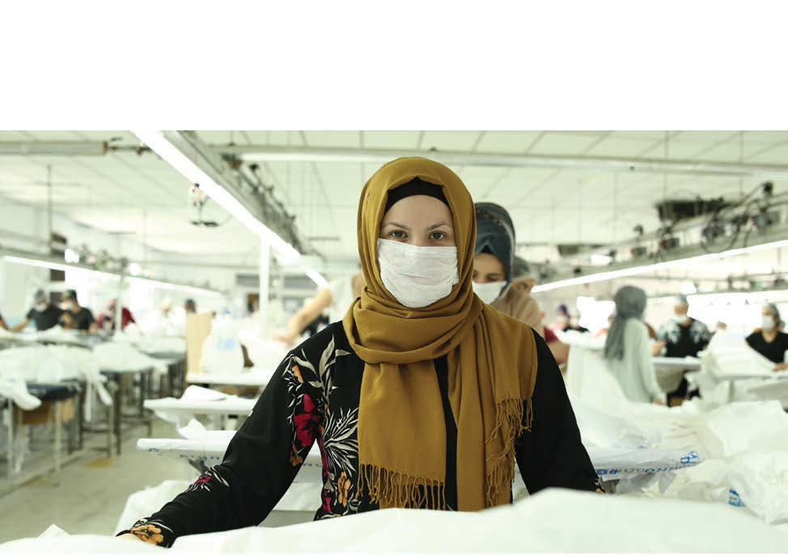

**Image 2 OCR + Description:**
```
**Image Description:**
The image shows a close-up scene with two young women engaged in writing or studying work outdoors. 

Layout and Key Elements:
- The foreground features two young women closely focused on their notebooks or writing materials.
- The young woman on the left is wearing a yellow jacket with long braided hair. She holds a pen and seems to be writing in a notebook.
- The young woman on the right wears a blue zip-up jacket and a colorful skirt with an African pattern. She looks at the other woman’s work attentively or appears to be listening.
- Behind them, there is a building with several people standing, some of whom seem to be children or teenagers.
- The sun is shining from behind the woman in yellow, causing a visible sun flare effect in the image.

Text:
- There is no visible text present in the image.

Context:
- The image appears to be captured in a rural or semi-urban outdoor setting, showing educational engagement possibly related to a community development or educational program. It fits well within an annual development report, highlighting themes of education, youth empowerment, and community involvement.
```
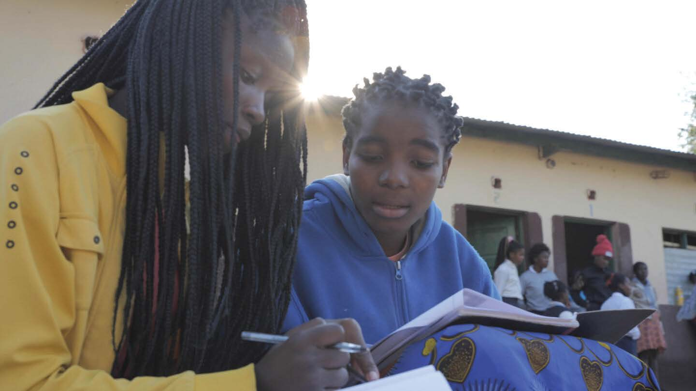

**Image 3 OCR + Description:**
```
**Image Description:**
The image depicts a classroom setting with young students seated at desks. The layout shows two boys in the foreground, each with an open book in front of them. The boy on the left is raising his hand eagerly, while the boy on the right has his hand raised but appears more contemplative or reserved. Behind them, several other students, including girls and boys, are seated at their desks, engaged in reading or activities. The background features a plain, dark-colored wall, typical of a classroom environment. There is no visible text in the image.

Key elements:
- Two boys in the front row, both with raised hands.
- Open textbooks on the desks.
- Other students in the background engaged in learning activities.
- Plain classroom wall, minimal distractions.

The image conveys an active learning environment, with students participating and focused on their studies. It would work well in an annual development report to highlight education or youth engagement initiatives.
```


**Image 4 OCR + Description:**
```
**Image Description:**
The image shows a scene of agricultural activity involving two people working outside on a sunny day. They appear to be engaged in processing or cleaning grains or seeds. 

Layout and key elements:
- Two individuals are prominently featured, bent over and working with the grains.
- The person on the left is using a wooden tool to toss grains into the air, creating a spray effect of grains falling.
- The person on the right is bending down, sorting or gathering the grains.
- A large pile of grains covers the foreground.
- Background elements include trees and what looks like rectangular hay bales.
- The sky is clear and bright blue, indicating good weather.
- There is abundant natural sunlight enhancing the scene.

There is no visible text on this image. It appears to be a visual representation relevant to agricultural development, possibly illustrating farming or rural livelihood activities in an annual development report.
```
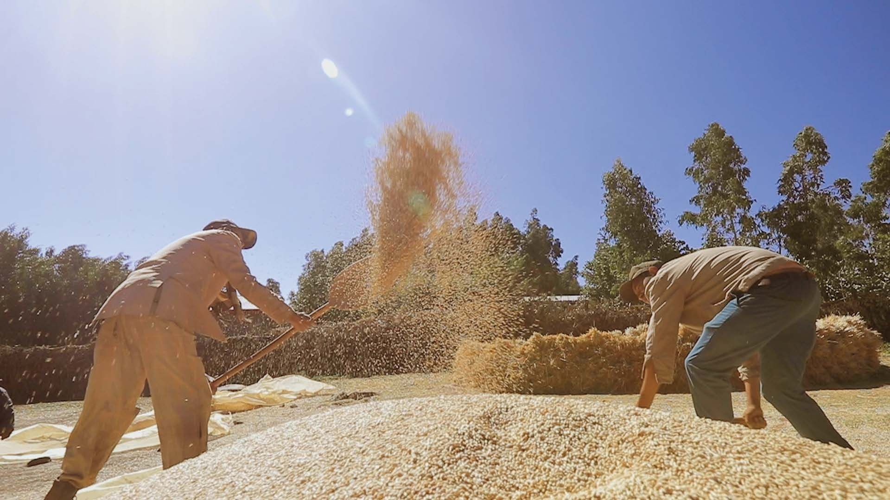

**Image 5 OCR + Description:**
```
**Image Description:**
The image shows a street scene with a focus on a designated bike lane. The bike lane is painted green and has white dashed lines running along its center to separate two directions of bike traffic. Two people are riding bicycles in the bike lane: one person is wearing a hoodie and shorts, and the other person is wearing a light blue button-up shirt and jeans. 

To the left of the bike lane is a road surface for vehicles, and to the right is a pedestrian sidewalk made of paving stones. There are trees planted in small grass patches in between the sidewalk and the bike lane. Various buildings, including a residential-looking building with barred windows and a red building with a sign that reads "LONGROM," line the street. Utility wires run overhead.

There is no visible text directly relating to the development report, except the building sign "LONGROM." The image primarily communicates urban development elements like infrastructure for cyclists, pedestrian walkways, greenery, and the coexistence of different modes of transportation in the city environment.
```


**Image 6 OCR + Description:**
```
ol oer
os 70% unisuse

**Image Description:**
The image shows a scenic landscape with multiple wind turbines spread across rolling green fields, likely used for generating wind energy. The sky is clear with a soft gradient from light blue at the top to a pale hue near the horizon, indicating either early morning or late afternoon light. The terrain has some scattered trees and the overall environment appears clean and natural.

In the bottom right corner of the image, there is a logo and text. The logo consists of a circular pattern made up of small dots connected by lines, resembling a network or a molecule structure. Next to the logo, the text reads:
"Climate Warehouse"

This image conveys themes of renewable energy, sustainability, and environmental stewardship, fitting well within the context of an annual development report focused on climate or clean energy initiatives.
```
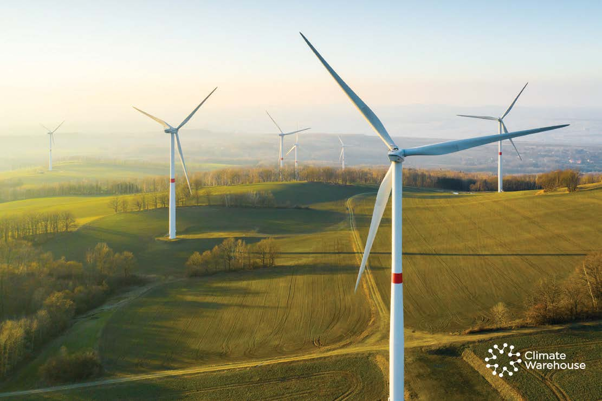

**Image 7 OCR + Description:**
```
**Image Description:**
The image features a wide landscape dominated by multiple tall electricity transmission towers lined up, stretching into the horizon. These towers carry numerous high-voltage power lines that span across the sky in parallel lines, creating a pattern that converges towards the horizon. The sky above is bright and mostly clear with a few scattered, fluffy white clouds against a vivid blue backdrop. The overall scene depicts infrastructure related to power distribution and energy transmission.

There is no visible text within the image. The layout emphasizes the vastness and reach of the electrical grid infrastructure, possibly highlighting development in energy or utilities for the annual development report.
```
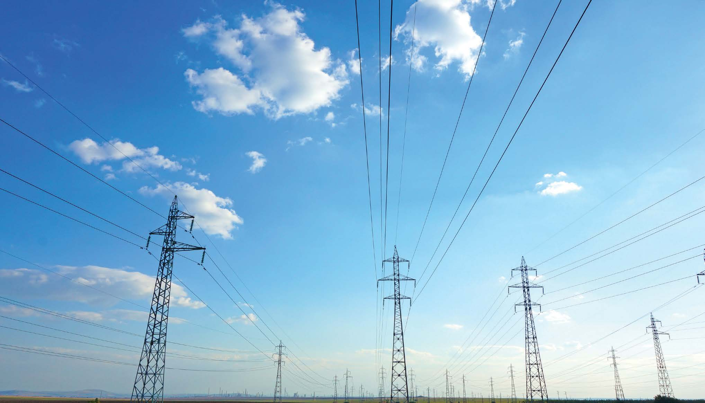

**Image 8 OCR + Description:**
```
**Image Description:**
The image features a professional office environment. The layout shows two individuals working at desks with computer monitors. In the foreground, a woman wearing a gray cardigan and a face mask is focused on typing at her keyboard. She is also wearing glasses and earphones. Her workspace includes some documents and a pen.

In the background, there is another person, also wearing a face mask, working at their computer. The background wall has a colorful geometric design with motivational text that reads: "don't wish for it, work for it."

The overall atmosphere conveys a sense of concentration, safety (due to face masks), and motivation, suitable for an annual development report's focus on productivity and workplace culture.
```
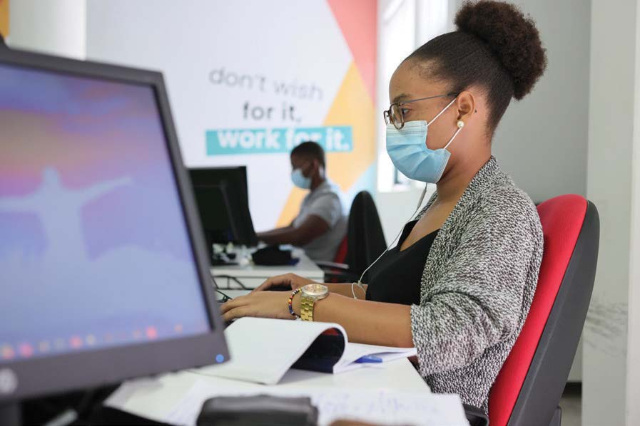

**Image 9 OCR + Description:**
```
**Image Description:**
The image features a woman standing outdoors in a mountainous area with a river flowing in the background. The woman is smiling and wearing a red garment and a patterned headscarf. She has large headphones on and is holding a white radio device with a large red circular speaker. The device has a label that reads "Community Driven Radio," along with some small logos and text that are not completely clear but suggest community or local engagement.

Key elements include:
- The woman as the central focus, expressing happiness or engagement.
- The natural mountainous environment with a river, indicating a rural or remote setting.
- The radio device symbolizing communication or media access within the community.

The overall layout centers the woman in the foreground with a sharp focus, while the rugged landscape forms a scenic backdrop, suggesting themes of connectivity and development in remote areas. This aligns well with themes typical for annual development reports, emphasizing community-driven initiatives and technological empowerment in rural regions.
```
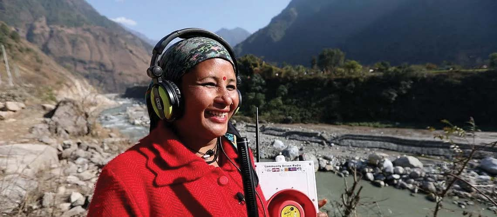

**Image 10 OCR + Description:**
```
**Image Description:**
The image shows a group of women and children seated on benches in an indoor setting with a mostly concrete floor and a blue-colored wall in the background. The key elements include:

- A woman in the foreground, wearing a green patterned dress and a gray headscarf, holding a newborn wrapped in a white blanket.
- Behind her are two more women: one wearing a blue headscarf and patterned dress, holding a baby also wrapped in white clothing; and the other wearing a yellow top, holding a toddler.
- Next to the toddler is another young child seated on the bench.
- The setting appears to be a waiting area or clinic with simple furniture including a wooden table on the right side.
- No visible text is present in the image.

The photo conveys a community or healthcare environment, focusing on mothers and their children, which is consistent with themes that might be highlighted in an annual development report related to maternal and child health or social services.
```


**Image 11 OCR + Description:**
```
**Image Description:**
The image shows a dense crowd of people gathered outdoors on a street in what appears to be an urban area. The people are standing close together, suggesting they might be waiting in line or attending an event. The background includes buildings, utility poles, and parked vehicles. Most individuals are wearing casual clothing and hats, likely for sun protection. The atmosphere feels busy and somewhat tense or serious, reflecting a situation where many people are gathered for a common purpose.

There is no visible text in the image to describe.

For an annual development report, this image likely represents community engagement, population density, public gatherings, or social conditions, illustrating a real-world context of the report's focus area.
```
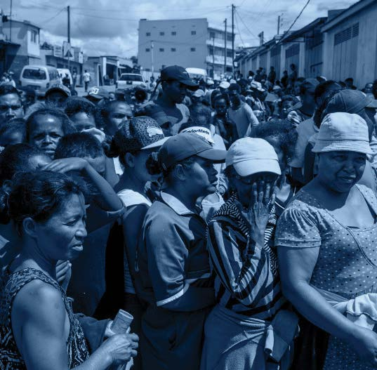

**Image 12 OCR + Description:**
```
**Image Description:**
The image shows a close-up of a person's hands cupped together, catching and holding a stream of clear water flowing down. The person's arms and part of their legs are visible, with the individual wearing a dark, short-sleeved garment and light-colored pants. The background is out of focus but appears to be a natural or outdoor setting, possibly with dirt or sand on the ground.

The image conveys themes of clean water access, hydration, or basic needs being met, making it suitable for an annual development report focused on water, sanitation, health, or community welfare. There is no visible text in the image. The composition highlights the vital importance of water and could be paired with report sections discussing water projects, sanitation improvements, or human development initiatives.
```
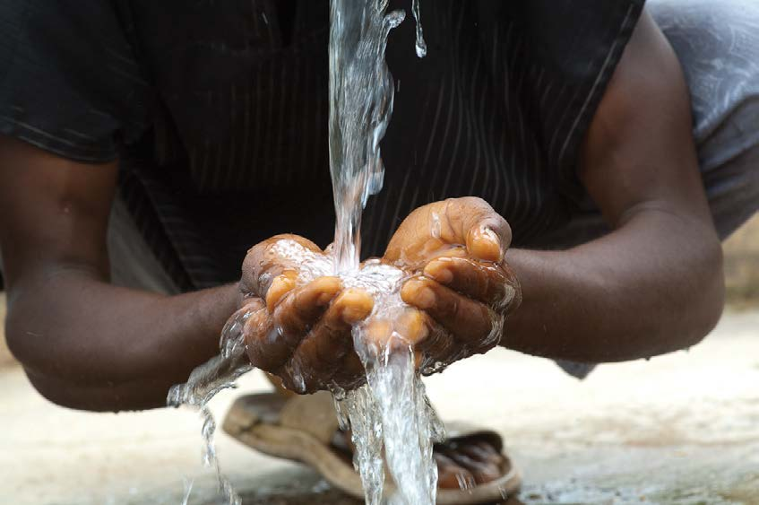

**Image 13 OCR + Description:**
```
**Image Description:**
The image showcases a coastal industrial port area with several key elements:

Layout:
- The foreground features lush greenery with large palm trees and various other vegetation.
- In the mid-ground, there is a mixture of buildings, including warehouses, office buildings, and a street running horizontally across the image.
- The background prominently displays a large port with numerous shipping containers stacked high and several large cargo cranes in blue and orange colors.
- Several large ships are docked at the port, equipped for loading and unloading containers.
- Beyond the port, the calm water body extends to a distant cityscape or town across the water, under a mostly cloudy sky.

Key Elements:
- Cargo cranes and containers dominate the port infrastructure.
- Multiple commercial and industrial buildings are interspersed with green spaces.
- There is a visible shoreline separating the port and water from the distant urban area.
- The water, port, and cityscape provide a sense of large-scale economic activity.

Text:
- There is no visible text or captions within the image itself.

The overall scene depicts an active port and industrial zone essential for trade and economic development, fitting for inclusion in an annual development report.
```
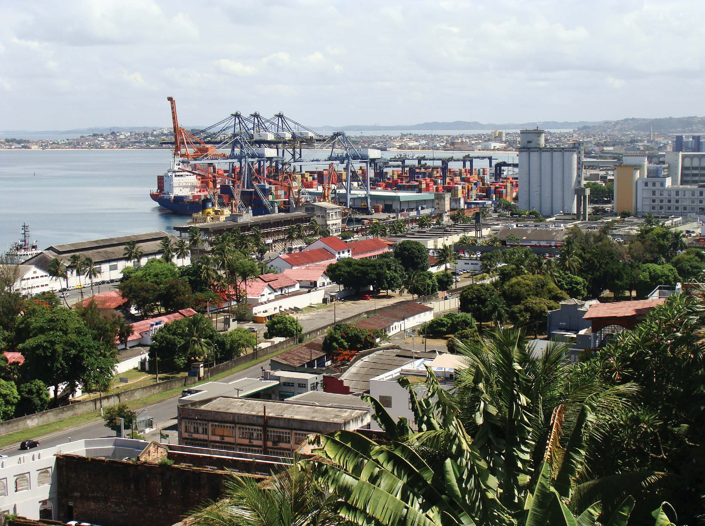

**Image 14 OCR + Description:**
```
**Image Description:**
The image features a close-up group portrait of seven children closely gathered together, filling the frame. The photograph is in monochrome blue tone, which may give a serious or calm atmosphere. 

Layout and Key Elements:
- The children occupy the entire frame with no visible background details, focusing attention on their faces and expressions.
- The expressions of the children range from neutral to slightly playful and inquisitive.
- One child in the middle is raising an arm holding onto a stick or pole that extends out of the top left corner of the image.
- The child in the foreground left has textured hair styled in a way that frames their face prominently.
- There is a small flower on a stem held in front of two of the children towards the left side of the image.
- The children are tightly positioned, suggesting a sense of closeness or community among them.

There is no visible text or graphic elements in this image, as it is a straightforward photographic portrait intended to evoke emotion and connection, likely to complement the narrative in the annual development report.
```
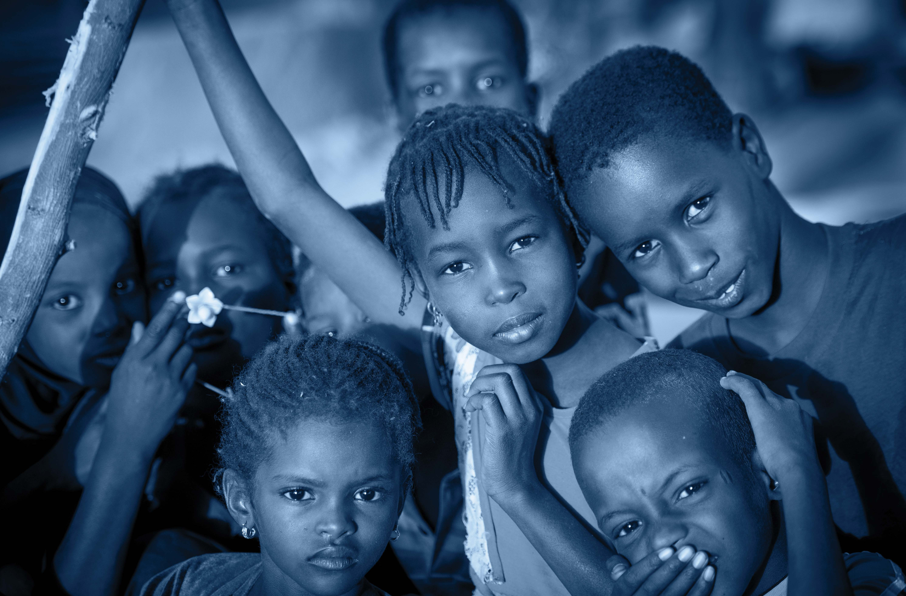

**Image 15 OCR + Description:**
```
**Image Description:**
The image features a close-up group portrait of young children, predominantly showing their faces and upper bodies. The children are packed closely together, with some overlapping partially behind others. 

Key elements:
- The children appear to be of African descent.
- Their expressions vary: some look serious or contemplative, while others have subtle smiles.
- One child in the center holds a hand up near their chin.
- Another child near the front is covering their mouth with their hand.
- There is a rustic stick or branch intersecting the left side of the frame.
- The image has a blue monochrome filter applied.

There is no text visible within the image itself. The composition and tone suggest it's intended to evoke emotion and human connection, making it fitting for an annual development report.
```


**Image 16 OCR + Description:**
```
**Image Description:**
The image features a close-up portrait of a young woman smiling directly at the camera. She wears a patterned headscarf and a white shirt. The background is slightly out of focus, showing several other individuals who are less clearly defined but add a sense of community or group setting. The warm, natural lighting and the woman's friendly expression convey a positive and hopeful atmosphere, fitting for an annual development report. There is no visible text within the image itself. The image likely aims to humanize and personalize the development themes discussed in the report.
```
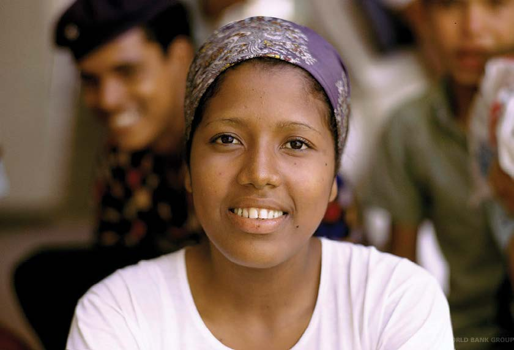

**Image 17 OCR + Description:**
```
**Image Description:**
The image depicts two individuals in a professional laboratory or medical research setting. One person is dressed in a white lab coat, sitting on a wooden stool, while the other is wearing a blue protective gown and engaging with a laptop on a black table or counter. Nearby, there is a laboratory incubator or sterilizing oven with attached papers, resting on a wooden storage unit containing bins and other lab materials. The room has large windows with metal grilles allowing natural light in, and a fire alarm device is visible on the wall above the incubator. The flooring and walls are clean and minimalistic, contributing to a neat, orderly workspace environment.

There is no visible text within the image besides some papers attached to the incubator, but the content is not legible. The focus is on the interaction between the two professionals and the laboratory equipment around them, suitable for illustrating a collaborative, research-based workflow in an annual development report.
```
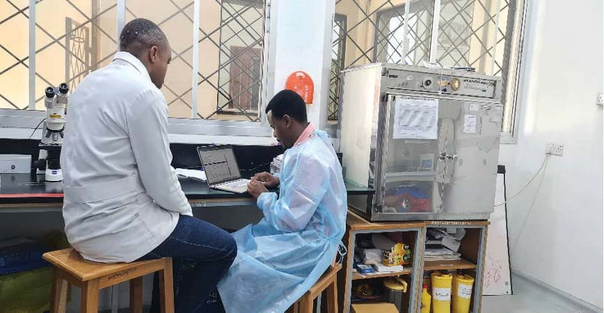

## Page 2
This report provides updates on activities as of the end of the World Bank's fiscal year 2023 (fiscal 2023), 
a 12-month period from July 1, 2022 to June 30, 2023. Throughout this report, the term “World Bank” and 
the abbreviated “Bank” refer to the five institutions that comprise the Bank: the International Bank for 
Reconstruction and Development (IBRD), the International Development Association (IDA), the International 
Finance Corporation (IFC), the Multilateral Investment Guarantee Agency (MIGA), and the International 
Centre for Settlement of Investment Disputes (ICSID). The terms “donors” and “development partners” are 
used interchangeably. All dollar amounts are U.S. dollars unless otherwise specified. As a result of rounding, 
numbers in tables may not add to totals, and percentages in figures may not add to 100 percent.


## Page 3
FOREWORD 
 II
TRUST FUNDS AND FIFS AT A GLANCE
 IV
TRUST FUNDS IN ACTION
 VI
1. PARTNERING THROUGH TRUST FUNDS AND FIFS
 1
1.1 Managing Trust Funds and FIFs 
 7
2. TACKLING CLIMATE CHANGE 
 10
2.1 Advancing Mitigation Efforts 
 13
2.2 Adapting and Building Resilience to Climate Impacts 
 15
2.3 Accessing Carbon Markets 
 17
2.4 Incentivizing the Private Sector 
 19
3. STRENGTHENING PANDEMIC PREVENTION, PREPAREDNESS, AND RESPONSE 
 22
3.1 Improving Health Systems and Regional Cooperation
 25
3.2 Promoting Local Markets and Manufacturing
 27
3.3 Facilitating FIF Contributions
 28
4. RESPONDING TO FRAGILITY, CONFLICT, AND VIOLENCE
 30
4.1 Addressing the Drivers of FCV
 33
4.2 Easing the Impact of Forced Displacement
 35
4.3 Forging Paths for Private Investment
 37
5. BUILDING FINANCIAL SUSTAINABILITY AND RESILIENCE
 40
5.1 Increasing Access to Finance
 41
5.2 Boosting International Trade and Integration
 44
5.3 Establishing Regional Catastrophe Risk Pools
 46
6. FINANCIAL INFORMATION OF TRUST FUNDS AND FIFS
 48
6.1 Inflows
 52
6.2 Outflows
 56
6.3 Assets
 61
ANNEXES
 68
Annex A. Abbreviations and Acronyms
 69
Annex B. List of Boxes, Figures and Tables
 70
Annex C. List of Umbrella 2.0 Programs as of June 30, 2023
 72
Annex D. List of Trust Funds and FIFs Referenced in this Report
 76
Annex E. World Bank’s Roles and Services in FIFs as of June 30, 2023
 84
ACKNOWLEDGEMENTS
 85
Table of Contents


## Page 4
Foreword  |  II
Foreword
We are at a critical moment in history. The world faces a perfect storm of intertwined and complex global challenges. 
For the world’s developing countries, the lingering effects of the global pandemic, slowing growth, conflict, fragility, 
food insecurity, and the urgent climate crisis all threaten to unwind development gains and plunge as many as 95 
million more people into poverty. 
The World Bank is transforming to respond to these compounding crises—fighting to preserve the hard-won 
development gains of previous decades and evolving to be a better partner to meet the most pressing needs of 
people and the planet in the future. Trust funds and financial intermediary funds (FIFs) are powerful tools for global 
development and an important part of this equation.
Trust funds and FIFs complement the World Bank’s core funding to meet critical needs, working across the 
development spectrum and delivering on the World Bank’s global challenge programs. Trust funds and FIFs have 
a powerful multiplier effect by targeting resources to issues of global concern, piloting innovative solutions for the 
most entrenched problems, developing knowledge that drives results, and allowing the World Bank to respond with 
urgency and in places otherwise out of reach.  
The evolution of the World Bank’s mission is an opportunity to further strengthen the impact of trust funds and 
FIFs. The reforms of the past five years have resulted in fewer, larger, and more strategically aligned trust funds, 
positioning them to meet this moment as they provide an established pathway for the World Bank to expand 
partnerships to increase available funds and impact. 
Partnerships play a crucial role in the success of the World Bank. Nowhere is that more prevalent than in trust funds 
and FIFs. We express gratitude to all our development partners, implementing partners, and client countries for 
their active involvement, cooperation, and commitment to our common mission and vision. As we work collectively 
to catalyze change and multiply impact in the face of cascading global crises, trust funds and FIFs are an integral 
component of the effort to end poverty and boost shared prosperity on a livable planet. 
Akihiko Nishio
Vice President
Development Finance
World Bank


**Image 1 OCR + Description:**
```
**Image Description:**
The image is a professional headshot of a middle-aged man with gray hair and glasses. He is wearing a dark suit jacket, a white shirt, and a red tie. The background is softly blurred, with some greenery visible, suggesting an indoor setting with plants. There is no text in the image. The composition and style are suitable for use in an annual development report, likely to accompany a message or profile about this individual.
```
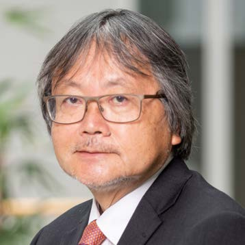

## Page 5
Foreword  |  III
Photo: Allison Kwesell / World Bank
Reading this Report
Chapter 1 provides an overview of how the World Bank leverages the partnerships and collaboration 
engendered by trust funds and FIFs to maximize development impact amid overlapping global crises.
Chapter 2 examines the strategic role trust funds and FIFs play in scaling up climate investments, 
enabling climate adaptation, and incentivizing faster decarbonization across sectors and countries. 
Chapter 3 looks at how trust funds and FIFs have enhanced the World Bank’s response to the COVID-19 
crisis, helping to pave the way for long-term recovery and better prepare for future pandemics. 
Chapter 4 delves deeper into the role trust funds and FIFs play in supporting countries affected by
 fragility, conflict, and violence, including at-risk regions and recipients unable to receive financing from
 the World Bank’s own resources.
Chapter 5 explores how trust funds and FIFs help communities and countries build financial stability and 
resilience so they are better able to withstand shocks, respond to crises, and access opportunities. 
Chapter 6 provides additional financial information and analytics on the activities of World Bank 
trust funds and FIFs. It examines five-year trends (fiscal 2019–2023) on trust fund and FIF inflows, outflows, 
and assets under management.
The 2023 Yearbook of Trust-funded Results is a separate, supplementary document that tells the stories behind 
the trust-funded activities referenced in this report. It highlights development partner contributions, the work of 
beneficiaries and stakeholders, and impact on the ground.


**Image 1 OCR + Description:**
```
**Image Description:**
The image is a close-up photograph featuring a group of young girls, presumably school students. The layout includes several faces aligned in a slightly diagonal formation from the left foreground to the right background. The focus is primarily on the second and third girls from the left, who are in sharp focus, while the first girl on the left and the partial figure on the right are blurred, creating a depth effect.

Key elements:
- The girls are wearing school uniforms, including white shirts, and darker-colored sweaters or vests.
- The lighting highlights the face of the girl in the middle, with soft sunlight illuminating her hair and face.
- The expressions of the girls are mostly neutral to mildly curious, with the central girl looking directly into the camera.
- The background is blurred, ensuring the focus remains on the faces.

There is no visible text within the image.

This photo is suitable for an annual development report as it conveys themes of education, youth, and community. The soft focus and natural light make it feel warm and engaging.
```
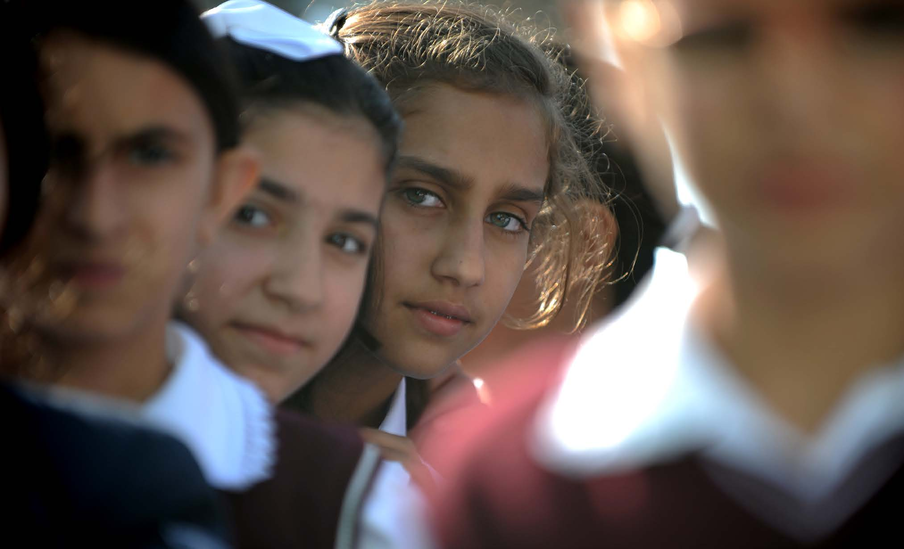

## Page 6
Trust Funds and FIFs at a Glance  |  IV
World Bank trust funds are financial instruments that create partnerships and platforms 
for financial, knowledge, and other collaborations around the world and across every area of 
development. They accept contributions from one or more donors and are held and disbursed 
by the World Bank as a trustee. Trust funds represent important funding sources for both clients 
and the World Bank. 
Financial intermediary funds (FIFs) are customized platforms for partnership programs and 
special financing mechanisms. They provide large-scale commingled funding through multiple 
implementing entities to address core development challenges. FIFs are typically governed by 
an independent board, with the World Bank serving as a limited trustee or treasury manager of 
26 FIFs and an implementing entity of 20.  
Trust Funds and FIFs at a Glance
WORLD BANK FY2023 TRUST FUND DISBURSEMENTS
* 97% was from IBRD/IDA trust fund resources ($18.8 billion), and 3% from World Bank-implemented FIF resources 
($0.7 million).
$21 B
World Bank
FY2023 trust fund
disbursements
IBRD/IDA Trust Funds
Recipient-Executed (RE) 
Activities $19.5 B *
• Co-financing for projects 
financed by the World Bank, 
FIFs, or other donor resources
• Standalone projects that 
extend Bank support in FCV 
situations, emergencies, and 
locations out of reach of 
World Bank financing
IBRD/IDA Trust Funds
Bank-Executed (BE) 
Activities $1.3 B
• Research and 
knowledge products
• Advisory services and 
analytics (ASA)
• Technical assistance, capacity 
building, project preparation 
and supervision
MIGA Trust Funds < $0.1 B
•  Expanded support for guarantees 
in FCV situations
IFC Trust Funds $0.4 B
• Advisory services
• Blended finance co-investments 
in the private sector
27% of total World Bank 
project disbursements to 
client countries
26% of total World Bank 
administrative expenditures


## Page 7
Trust Funds and FIFs at a Glance  |  V


**Image 1 OCR + Description:**
```
80%

Share of IBRD/IDA
trust fund RE
disbursements for
FC\V-affected countries

FY2019-23

Mitigation
56%

$63 M

Trust fund financing
blended with IFC financing

to catalyze private investments
in emerging markets

FY2023

$2.5 B

IBRD/IDA trust fund
RE disbursements
for climate change
mitigation and
adaptation

FY2019-23

24%

Share of IBRD/IDA
trust fund RE
disbursements for
IDA countries

FY2019-23

FY2023 increase in IBRD/IDA trust fund
contributions and disbursements driven
by support for Ukraine ($B)

25.0

22.9

20.0

15.0

10.0

50)

4.9
0.0

FY22

e—e Cash Contributions

$19.5 B

IBRD/IDA trust funds
disbursed to Ukraine
April 2022-June 2023

52% of total World Bank
support to Ukraine

FY23

Disbursements

**Image Description:**
The image is a multi-colored infographic with eight distinct sections, each providing specific data points related to IBRD/IDA trust fund activities and contributions from FY2019 to FY2023, with some focus on FY2023. It uses a combination of bold percentages, dollar amounts, pie charts, line graphs, and icons to visually communicate the data. The layout follows a grid pattern with two main columns and several rows, each box highlighted with a unique background color for differentiation.

### Detailed Description of Each Section:

1. **Top Left (Blue)**
   - Text: "80% Share of IBRD/IDA trust fund RE disbursements for FCV-affected countries FY2019–23"
   - Visual: A grid of blue and white squares, with 80 squares colored blue representing the 80%.

2. **Middle Left (Green)**
   - Text: "$2.5 B IBRD/IDA trust fund RE disbursements for climate change mitigation and adaptation FY2019–23"
   - Pie chart: 
     - Mitigation 56%
     - Adaptation 44%
   
3. **Top Right (Dark Blue)**
   - Title: "FY2023 increase in IBRD/IDA trust fund contributions and disbursements driven by support for Ukraine ($B)"
   - A line graph showing:
     - Cash Contributions (orange line): from 4.9 in FY22 to 22.3
```
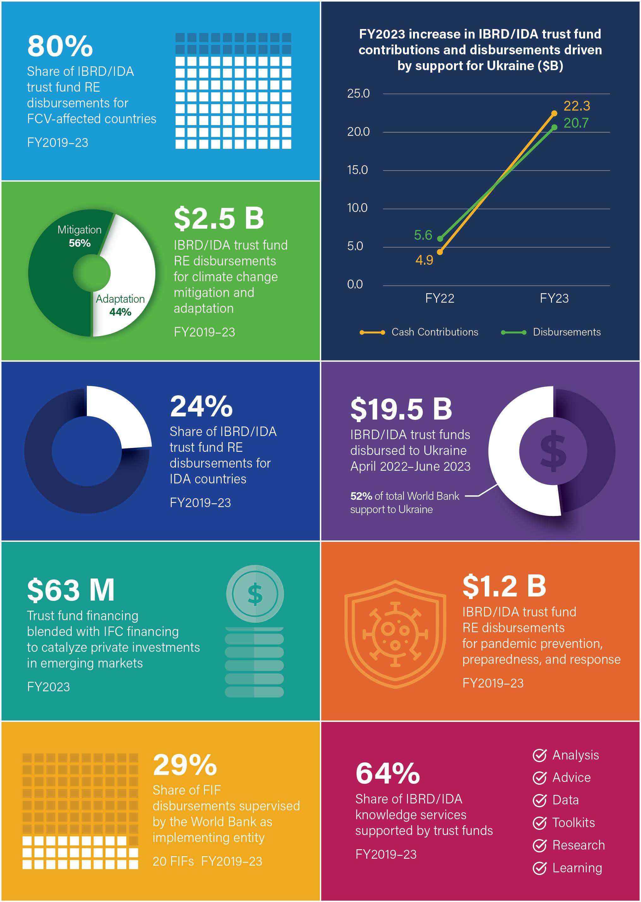

## Page 8
World Bank trust funds and FIFs support a diverse range of development activities that help countries, regions, and 
the global community respond to the overlapping challenges of climate change, pandemics, fragility, conflict, and 
violence (FCV), and financial instability. This report features the following 52 trust-funded activities implemented in 
the last five years (fiscal 2019–23). They are further detailed in the 2023 Yearbook of Trust-funded Results.
GLOBAL CHALLENGES:
Tackling climate change 
Strengthening pandemic prevention, preparedness, and response
Responding to fragility, conflict, and violence
Building financial sustainability and resilience
CÔTE D’IVOIRE
GFF builds equitable health 
systems for women, children, 
and teens
COLOMBIA
GCFF improves access 
to health care for 
Venezuelan migrants
PERU
GFDT supports 
sustainable 
mobility planning
GWSP examines the economics 
of groundwater
IFC helps close the health 
supply gap
PROBLUE envisions global 
policy to decarbonize 
international shipping
Carbon-Assist & PMIF increase 
transparency, credibility, and 
accountability in carbon markets
FINC & PYMT monitor the 
transaction costs of remittances
GTP enables environmental 
taxation to unlock climate-
smart growth
CARIBBEAN
CCRF helps understand and 
overcome barriers to vaccine 
acceptance
CENTRAL AMERICA
CCRIF advances regional 
catastrophe risk insurance pooling
SPF builds the case for 
supporting migrant women 
experiencing violence
LATIN AMERICA & THE CARIBBEAN
IFC bridges the gap between 
technology innovators and 
adopters 
KWPF supports COVID-19 
response and recovery 
REGIONAL ACTIVITIES
GLOBAL ACTIVITIES
Trust Funds in Action
CHILE
SFLAC fuels low-carbon economic 
growth with green hydrogen
BRAZIL
CPF turns trash to cash with 
low-methane landfill practices
VI  |  World Bank Trust Fund Annual Report 2023
BANGLADESH
We-Fi connects 
women-owned 
businesses to
larger corporations
SAMOA
CIF empowers 
coastal communities 
to enhance 
climate resilience
EGYPT
IFC de-risks climate-smart 
projects through blended finance
      IFC improves quality 
standards for patient care
INDONESIA
FCPF rewards emissions reductions 
through forest conservation 
KENYA
UFT appraises opportunities 
to increase trade integration
MOZAMBIQUE
GEF & ILM seek gender equality 
in conservation areas
IRAQ
I3RF expands financial inclusion 
and growth for small businesses
JSDF promotes social and 
economic inclusion of conflict-
affected youth
NIGERIA
IFC promotes gender 
equality in the private sector
TÜRKIYE
EEPP expands job 
opportunities for refugee 
and host communities
GEORGIA
EU2020 enables policy 
reforms for increased 
financial inclusion 
KAZAKHSTAN
IFC helps cities 
access long-term 
commercial finance
SOMALIA
GWSP helps turn 
sand into water
SMPF builds the public sector 
and public trust in government
ETHIOPIA
ISFL reduces emissions through 
sustainable land management
IFC cultivates a better 
future for farmers
UKRAINE
CTF, GFDRR & KGGTF 
support electricity market 
integration with Europe
IFC facilitates access to 
finance for Ukrainian refugees
LEBANON
LSCTF & REACH keep 
children in school and learning
JORDAN
GCFF enhances 
job and economic 
opportunities for all
PHILIPPINES
CSF boosts climate action through 
sustainable finance
IFC enables growth in climate-smart 
lending
IFC future-proofs pandemic response 
strategies in Quezon City
INDIA
IFC supports the 
transition to solar power
ZIMBABWE
ZISET encourages public 
engagement in the use of 
public resources
WEST BANK & GAZA
PURSE, WBGBK & MNA Umbrella 
help vulnerable communities access 
emergency social protection
EAST AFRICA 
HEPR breaks the health 
emergency cycle
HORN OF AFRICA
GSFF supports regional 
risk insurance pooling 
for pastoralists
MASHREQ
UFGE increases economic 
empowerment of forcibly 
displaced women
SAHEL
CIWA prioritizes 
groundwater protection
WEST AFRICA
DDP helps integrate 
the digital innovation 
and entrepreneurship 
ecosystem
IFC develops local 
capital markets
CENTRAL ASIA 
FS2030 protects food 
systems, preventing 
future pandemics
SOUTH ASIA 
PARCC crowdsources 
innovations to manage 
climate and disaster risks
REGIONAL ACTIVITIES
SOLOMON ISLANDS
HEPR leaves 
no one behind 
in COVID-19 
vaccinations
Trust Funds in Action  |  VII


## Page 9
1. Partnering through Trust Funds and FIFs  |  VIII
Photo: Julia Burlachenko / World Bank
Partnering through 
Trust Funds and FIFs
1


**Image 1 OCR + Description:**
```
**Image Description:**
The image features a close-up view of four sunflowers, focusing primarily on their yellow petals and large brown centers. The sunflowers are positioned prominently in the foreground, with one flower facing directly toward the right, showing its full face, while the other three are shown from the side or back, aligned diagonally from the bottom left to the upper right of the image.

In the background, there are dilapidated, weathered buildings that appear to be abandoned or in ruins, contrasting sharply with the vibrant, lively sunflowers. The sky above is cloudy and overcast, adding a somber tone to the scene.

There is no visible text in the image. The overall layout draws attention to the juxtaposition between the beauty of nature (the sunflowers) and urban decay (the ruined buildings), which could symbolize themes of resilience, hope, and renewal in the context of an annual development report.
```
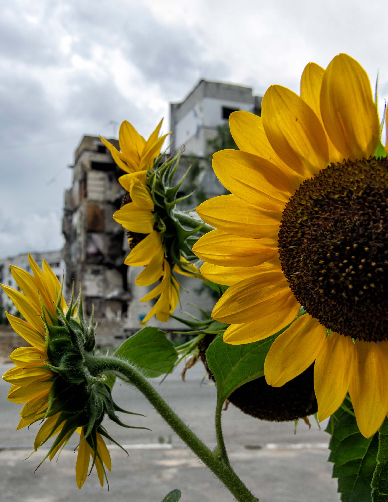

## Page 10
1. Partnering through Trust Funds and FIFs  |  1
 
The world has suffered concurrent crises and 
formidable global challenges that have devastated 
many of the least developed economies and the most 
vulnerable communities. The compounding effects of 
poverty, pandemics, climate change, debt, conflict, 
food insecurity, and fragility threaten to undo decades 
of hard-won development gains. The stakes could not 
be higher—nearly 700 million people live in extreme 
poverty, and almost half the world’s population live 
on less than $6.85 a day.1 Urgent calls from across 
the international community demand that radically 
reformed and strengthened multilateral development 
banks (MDBs) led by the World Bank address these 
challenges head-on. 
The World Bank is implementing a new playbook 
committed to creating a world free of poverty on a 
livable planet. Focusing on eight global challenges 
(Box 1.1), the Bank aims to end extreme poverty and 
boost shared prosperity on a livable planet by providing 
solutions to support country priorities, address global 
challenges through country programming, and drive 
development with speed, scale, and impact. This new 
mission builds on the Bank’s country-based model 
while retrofitting its operational and financial modalities 
to mobilize more co-financing for development. Trust 
funds and financial intermediary funds (FIFs) play an 
important role in this evolution.
Trust funds and FIFs are powerful tools for global 
development. They represent some of the best 
cooperation, 
commitment, 
and 
action 
of 
the 
international community to address the world’s most 
pressing problems. They help advance progress on 
the Sustainable Development Goals (SDGs) and the 
policy and investment priorities of middle and low-
income countries. Trust funds and FIFs are flexible, 
responsive tools in the World Bank’s comprehensive 
toolkit of policy and financial instruments, bringing 
both complementarity to Bank operations and 
targeted and customized solutions (Box 1.2). 
Climate change adaptation
and mitigation
Addressing fragility
and conflict
Pandemic prevention
and preparedness
Energy
access
Food and
nutrition security
Water security
and access
Enabling
digitalization
Protecting biodiversity
and nature
1 World Bank. October 17, 2023. “Poverty: Overview” World Bank.
Global Challenges Key to 
Creating a World Free of 
Poverty on a Livable Planet 
BOX
1.1


## Page 11
1. Partnering through Trust Funds and FIFs  |  2
By creating a platform for innovation, trust funds and 
FIFs often have a catalytic, outsized impact on global 
development. The highly concessionary financial 
resources provided by these instruments co-finance 
both IBRD loans and IDA credits, which helps soften 
terms for borrowing countries and makes it easier to 
pilot innovative solutions by de-risking investments 
in an efficient manner. These resources encourage 
experimentation, make space to pilot and scale up 
projects, and generate global public goods in which 
borrowing countries may be unwilling to invest without 
incentives to do so. 
Trust funds and FIFs offer tremendous flexibility. 
The tractability of trust funds, in allocation and 
implementation, enables the Bank to rapidly respond 
in times of crisis and remain engaged, especially in 
places where core lending activity is complicated. 
The flexible design of FIFs enables funds to be raised 
from multiple sources and channeled in a coordinated 
manner to address global priorities.
Trust funds and FIFs are engines of knowledge, 
contributing to a wide variety of IBRD and IDA 
projects implemented by recipients. They enable 
countries to obtain technical assistance, expertise, 
and analytics to support national development, as 
well as the administrative, knowledge, and advisory 
services provided by the World Bank staff to support 
client needs, project preparation and implementation, 
and wide-ranging global public goods. 
The World Bank’s private sector arm IFC also uses 
trust fund and FIF resources to unlock private 
sector finance for development, by establishing 
credible standards for investors, enabling financial 
innovation, and mobilizing private capital beyond 
IFC’s own account. Trust funds and FIFs support 
IFC’s continuum of expertise, ranging from analytics 
and diagnostics to advisory and to game-changing 
investment opportunities that stimulate greater private 
sector investments. 
MIGA, the World Bank’s political risk insurance 
and credit enhancement arm, also works with 
development partners to leverage its resources 
and increase the risk appetite of private investors 
in challenging environments. By collaborating with 
development 
partners 
to 
establish 
specialized 
guarantee trust funds, MIGA mobilizes guarantee 
capacity in high-risk states affected by fragility, conflict, 
and violence (FCV), where its operations would 
be limited.
• Increase the concessionality, scale, and reach of World Bank projects and programs
• Facilitate World Bank knowledge services, including advisory services and analytics (ASA), original 
research, data generation and analysis, and a broad range of knowledge products 
• Extend the Bank’s reach in countries affected by FCV, non-member countries, countries in arrears, 
and non-sovereign entities 
• Enable rapid responses to national, regional, and global emergencies
• Pilot projects to test new approaches for scale-up
• De-risk investments in emerging markets to stimulate other financiers
The Many Benefits of Trust Funds and FIFs 
BOX
1.2


## Page 12
1. Partnering through Trust Funds and FIFs  |  3
The World Bank is a partner of choice for trust 
funds and FIFs. Of the 26 FIFs that the World Bank 
administrates, 18 chose to have the Bank host their 
secretariat and 20 use the Bank as an implementing 
entity. During the last five years (fiscal 2019–23), the 
World Bank has implemented $4.4 billion from these 
20 FIFs, representing 29 percent of their total funding 
provided to recipient countries and regions around the 
world. For many FIFs, the World Bank is their largest 
implementing entity.
As trustee of trust funds and FIFs under its 
management, the World Bank takes its fiduciary 
obligation seriously. It provides regular reports to 
development partners on the progress of funded 
activities and the use of trust funds, as agreed in 
legal agreements. The Bank provides a management 
assertion and an attestation from external auditors 
regarding internal controls over cash-based financial 
reporting for all cash-based trust funds, along with a 
combined financial statement for these trust funds, 
and the auditor's opinion on them.
When the World Bank engages in a trust-funded 
program, it is not simply an administrator for the 
contributing donors. Rather, the Bank brings all its 
institutional capacities to bear to achieve shared 
objectives more efficiently than one partner could 
achieve by itself. The Bank is a thought leader with 
deep technical expertise and knowledge and a 
trusted source of development data and analysis. Its 
global reach, country presence, and central place in 
international development networks mean the Bank 
can convene partners across sectors and geographic 
locations to facilitate consensus on approaches to key 
development issues and then activate operations on 
the ground. These abilities and attributes ensure trust 
fund and FIF funding is used strategically to maximize 
coordinated action and achieve impact at scale.
Nowhere has the value of trust fund partnerships been 
more evident in fiscal 2023 than in Ukraine. Since 
Russia’s invasion in February 2022, the World Bank 
and other development partners have mobilized more 
than $37.5 billion—over half of which, $19.5 billion, 
has been disbursed through World Bank trust funds.2 
Support for Ukraine is largely responsible for the 
jump in total IBRD/IDA trust fund contributions and 
disbursements, which went from $4.9 billion and $5.6 
billion, respectively, in fiscal 2022 to $22.3 billion and 
$20.7 billion, respectively, in fiscal 2023. 
Photo: World Bank
2 Trust fund disbursements for Ukraine totaled $2.4 billion in fiscal 2022 and $17.1 billion in fiscal 2023.


**Image 1 OCR + Description:**
```
**Image Description:**
The image shows a group of women seated in a waiting area, each holding a baby. The setting appears to be indoors, possibly a clinic or healthcare center, indicated by the clinical blue walls, concrete flooring, and simple furniture. The floor near the entrance has a patch of bare ground or dirt, contrasting with the tiled floor inside.

Key elements include:
- Four women sitting side by side on benches or chairs.
- Each woman is holding an infant wrapped in white or light-colored blankets or clothes.
- The women are dressed in colorful traditional attire, featuring various patterns and fabrics.
- The background includes a wooden table with some items on top and an empty tray, hinting at a setting where healthcare or welfare services are offered.
- Light coming from an open doorway, partially visible on the left side of the image.
- A person walking away in the background wearing black leggings and flip-flops.

There is no visible text in the image. The overall atmosphere suggests a maternal and child healthcare context, making it suitable for inclusion in an annual development report focusing on maternal health, child care, or community health programs.
```
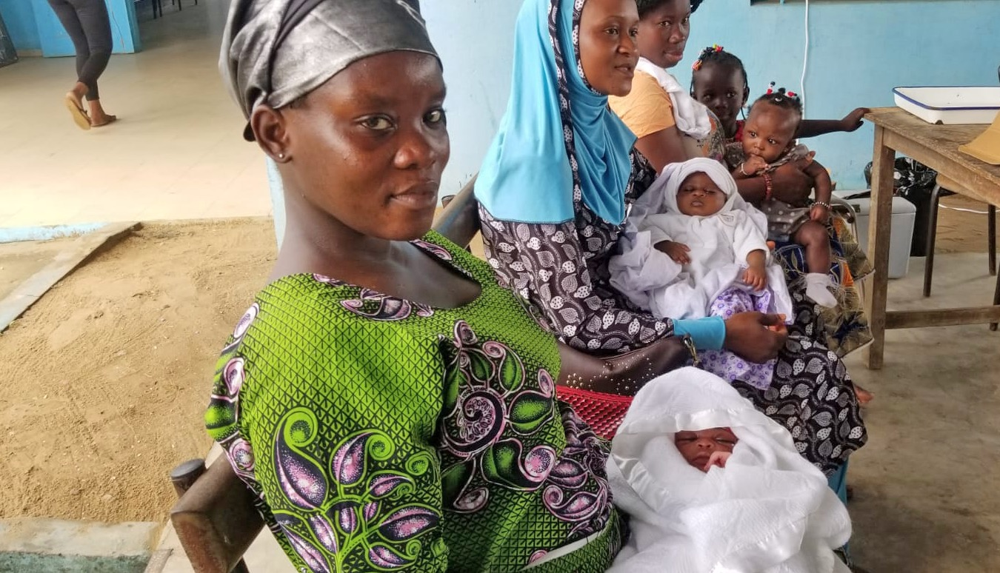

## Page 13
1. Partnering through Trust Funds and FIFs  |  4
New trust funds were set up to deliver fast-
disbursing, targeted funding to assist the people of 
Ukraine with their immediate needs, keep institutions 
and services running, and enable wider recovery 
and reconstruction efforts. The World Bank has 
since established the Multi-Donor Resources for 
Institutions and Infrastructure (MRII) Facility 
to coordinate IBRD/IDA, IFC, and MIGA support 
for Ukraine, including trust-funded initiatives. The 
facility takes a phased and multi-pronged approach 
to mobilizing financing and coordinating resources 
through guarantees, co- and parallel financing, and 
other financial instruments. 
Trust funds also enable international aid to flow to 
Afghanistan. Since the country’s abrupt change 
of government in August 2021, the Afghanistan 
Resilience Trust Fund (ARTF) has served as the 
central partnership platform from which the Bank has 
coordinated with development partners and donors 
and committed over $1 billion in off-budget support 
for the Afghan people. United Nations agencies and 
the Aga Khan Foundation implement ARTF-funded 
operations to deliver critical health, livelihood, food, 
water, and education services, as well as to collect 
and analyze data on current conditions within 
households and communities to inform humanitarian 
and development aid.
Pooled funding and partnership platforms have 
become a common development approach in 
conflict-affected, crisis, and reconstruction situations. 
Engagement with partners with on-the-ground 
presence in fragile settings has enhanced the 
Bank’s effectiveness. For example, cooperation with 
the International Committee for the Red Cross has 
Photo: Julia Burlachenko


**Image 1 OCR + Description:**
```
a",

**Image Description:**
The image depicts a construction site where two workers are actively engaged in building a brick structure. The layout is focused on the partially built brick walls with steel beams forming the roof framework above. 

Key elements in the image include:
- Two workers: one is positioned on the framework working on placing wooden planks, and the other is on the ground handling bricks.
- A large pile of bricks and rubble in the foreground.
- Wooden planks scattered around the site.
- The steel framework supporting the roof structure.
- Partially constructed brick walls with window openings.
- Some greenery in the background and signs with text in a non-English language.
- Construction tools and materials scattered around the area.

The text visible in the background on a green sign appears to be in Cyrillic script, but specific words aren't clearly distinguishable due to the angle and partial obstruction. The scene conveys ongoing construction or renovation work, suitable for illustrating infrastructure development or building progress in an annual development report.
```
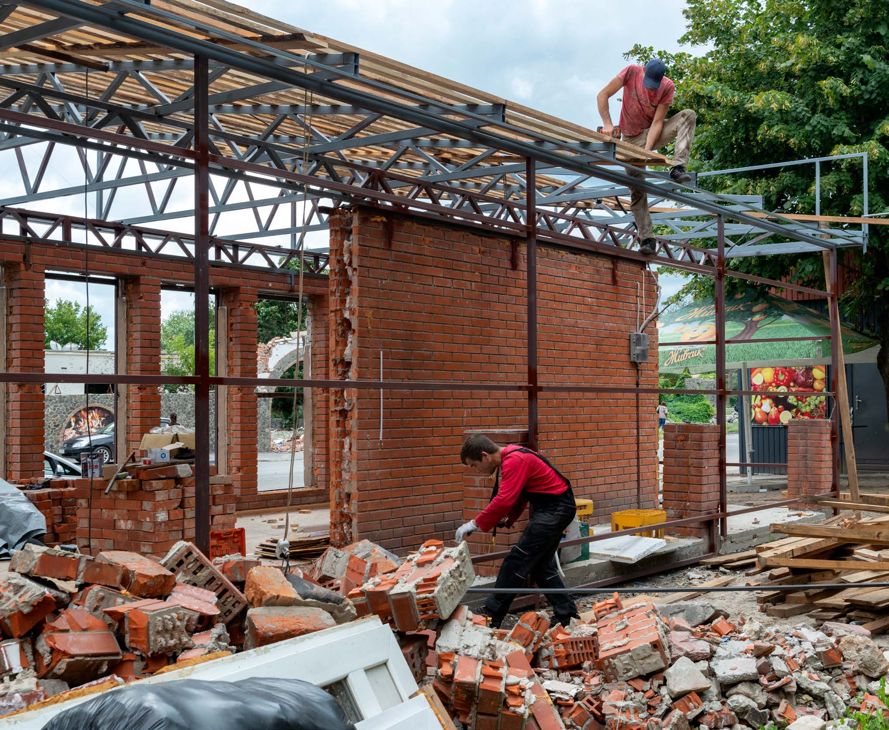

## Page 14
1. Partnering through Trust Funds and FIFs  |  5
been critical in delivering services for health and 
food security in hard-to-reach areas of Somalia 
and South Sudan. Engagement with these partners 
improves development partner coordination and 
harmonization of objectives, joint leverage in dialogue 
with government, impact, and efficiency. It dilutes 
exposure to political and reputational risks, increases 
funding predictability, and promotes robust fiduciary 
and monitoring frameworks.
International cooperation has also been essential for 
responding to the COVID-19 pandemic, with trust 
funds and FIFs playing important roles in saving 
lives, protecting the poor, maintaining education 
continuity, ensuring sustainable business growth and 
job creation, and strengthening policies, institutions, 
and investments. In the wake of the pandemic, trust-
funded research and analysis by the World Bank have 
helped cities, countries, and regions worldwide assess 
their COVID-19 response and institute reforms to build 
resilience against future pandemics by strengthening 
health care systems, vaccination protocols, and 
community outreach. 
In fiscal 2023, the World Bank used its convening 
power, knowledge, and experience to bring together 
G20 members, the World Health Organization, MDBs, 
global health institutions, and civil society to establish 
the Pandemic Fund. This new FIF answers the global 
call to augment the existing health security financing 
system and mobilize additional resources to build 
health systems and strengthen pandemic prevention, 
preparedness, and response capabilities in low and 
middle-income countries. It has raised $2 billion in 
initial contributions and issued its first call for proposals 
in February 2023. 
Also ready for action is the Scaling Climate Action 
by Lowering Emissions (SCALE) multi-partner 
umbrella trust fund initiated in fiscal 2023. The amount 
of resources required to combat climate change is 
immense, and the World Bank is working on many 
fronts to expand climate finance opportunities. SCALE 
builds on the Bank’s 20 years of experience with 
projects that generate high-quality, high-integrity 
emission reduction credits using results-based climate 
finance. This new umbrella program will pool funding 
from the global community, including donor countries, 
the private sector, and foundations, and make it 
available for the most impactful programs that reduce 
greenhouse gas (GHG) emissions. Technical advice 
and capacity strengthening provided by SCALE will 
also help countries gain the tools, knowledge, and 
experience they need to access additional private 
sector finance through international carbon markets. 
This report sheds light on these and many more trust 
fund programs that contribute to World Bank-led 
responses to overlapping global challenges, with a 
focus on climate change, pandemics, FCV, and the 
financial instability they engender. While the chapters 
are distinct, these four focus areas intersect and bring 
in other global challenges, such as energy access, 
food and nutrition security, water security and access, 
enabling digitalization, and protecting biodiversity 
and nature. 
The 52 trust-funded activities featured in this report 
and the supplemental 2023 Yearbook of Trust-
funded Results cover a five-year period from fiscal 
2019–23. These impactful activities demonstrate the 
interconnectedness of the challenges—and their 
solutions—and show how trust fund partnerships 
benefit the World Bank, its clients, and its development 
partners. For example:
• Analysis and mapping of groundwater-
dependent ecosystems in the Sahel supported 
by the Cooperation in International Waters 
in Africa (CIWA) induced countries in the 
region to initiate reforms to protect these 
essential carbon sinks, vital to rural economies, 
livelihoods, and biodiversity.
• IFC trust funds helped advance a public-
private partnership in India to develop eight 
solar power parks totaling 1,500 megawatts 
and expected to reduce 2.8 million tons of GHG 
emissions annually. 


## Page 15
1. Partnering through Trust Funds and FIFs  |  6
• World Bank-led research funded by the 
Global Program for the Blue Economy 
(PROBLUE) informs industry players in 
international maritime shipping on ways to 
harness the unique business and development 
opportunities that decarbonizing the 
sector provides.
• Advice and analysis funded by Food Systems 
2030 helped lay the groundwork for regional 
cooperation in Central Asia on pandemic 
preparedness that prioritizes zoonoses, 
antimicrobial resistance, and food safety.
• Co-financing from the Global Agriculture 
and Food Security Program (GAFSP) helps 
West African countries build regional capacity 
to manage agricultural and food insecurity 
risks through more productive climate-
smart agricultural practices and increased 
intraregional trade.
• IFC trust funds helped smooth the way for 
digital data corridors among credit bureaus in 
Eastern Europe, enabling Ukrainian refugees 
to verify their identities and credit histories 
electronically so they can gain access to 
finance in host countries.
Photo: André Benamour / LCBC


**Image 1 OCR + Description:**
```
**Image Description:**
The image shows a group of people working together around a traditional well structure made of wooden beams and ropes. The setting appears to be a dry, dusty, rural area with sparse vegetation in the background. Several goats are visible in the background, indicating a pastoral environment. 

The key elements in the image are:
- Four men, three of whom have their faces partially covered with cloth.
- A wooden frame constructed from several sturdy branches arranged in an arch-like formation.
- Ropes connected to the wooden frame, which the men are pulling, likely to draw water from the well.
- A circular well opening at the base, from which water might be drawn.
- The men are actively engaged, suggesting community involvement and manual effort.

There is no visible text in the image. 

The image conveys themes of community cooperation, traditional methods of accessing water, and rural livelihood. It is consistent with an annual development report focusing on water resources, rural development, or community projects.
```
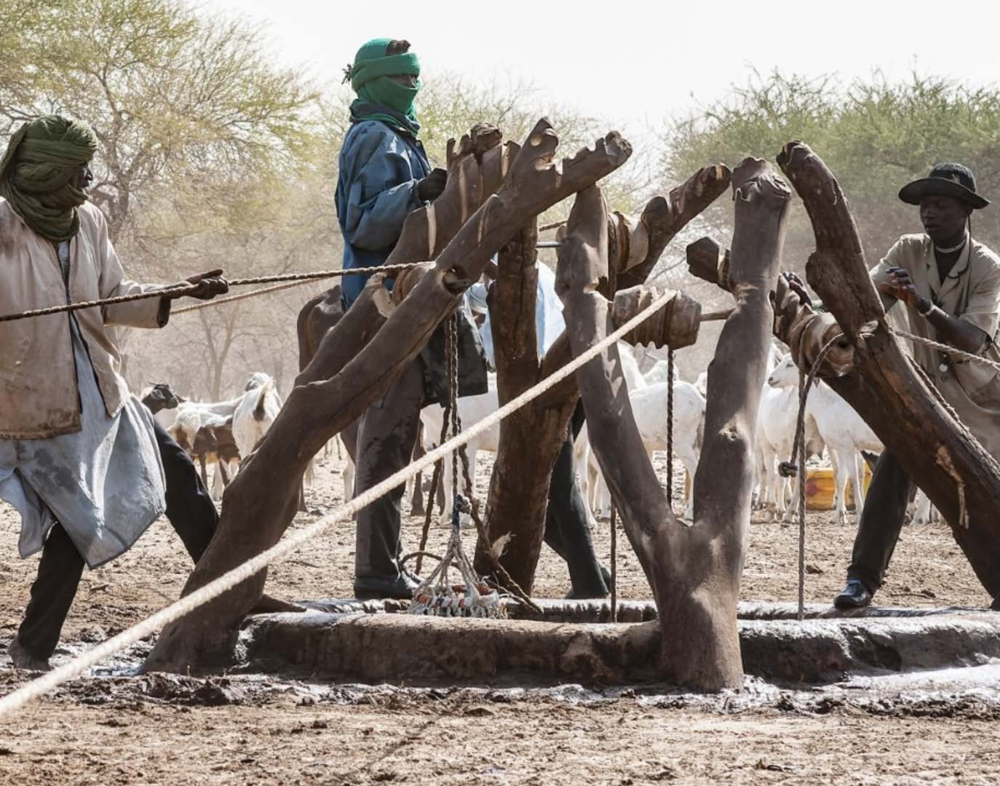

## Page 16
1. Partnering through Trust Funds and FIFs  |  7
• Each umbrella program is anchored by a primary, or anchor, multi-donor trust fund and may include 
associated trust funds. 
• A single governance structure for all funds in a program—the Partnership Council—brings the 
World Bank’s management and partners to the same table around common development 
objectives, helps avoid fragmentation of resources, and increases efficiency. 
• The Partnership Council endorses the umbrella program’s annual work program and budget after 
which the World Bank allocates program resources to individual activities. 
• A unified results framework for each umbrella program is developed in consultation with 
development partners and covers activities funded by all trust funds in a program. It is the 
key monitoring tool to assess how individual activities are contributing to a program’s overall 
development objectives. The Partnership Council reviews progress against the unified 
results framework.
• Unified reporting is implemented at the program level with a strong focus on results.
• A communication and visibility plan for each umbrella program ensures that its strategic 
communication needs are considered and implemented.
Key Features and Principles of Umbrella 2.0 Programs 
BOX
1.3
1.1 Managing Trust Funds 
and FIFs 
Across the World Bank, trust funds and FIFs are 
managed so that their financing can be mobilized 
with speed and efficiency (Table 1.1). Trust fund 
management 
arrangements 
are 
designed 
to 
enhance strategic alignment and to promote 
strong internal oversight and risk management, 
streamlined processes, and effective collaboration on 
establishing development priorities among the Bank, 
development partners, and client countries. The 
World Bank also provides administrative, operational, 
legal, and financial services to a diverse portfolio of 
FIFs and, in many cases, acts as an implementing 
entity (Annex E).
Since 2020, the World Bank has worked to transition 
from a fragmented portfolio of IBRD/IDA trust fund 
accounts to 72 larger and more strategically aligned 
Umbrella 2.0 Programs (Annex C). These programs, 
developed in consultation with the Bank’s major 
donors, seek to promote good oversight, greater 
efficiency, and results reporting (Box 1.3). Reforms 
have streamlined and harmonized governance and 
management processes for better engagement, 
transparency, and integration with the Bank’s strategy 
and planning processes while reducing transaction 
costs for mutual benefit. 
By targeting donor resources through fewer and 
larger umbrella programs, the World Bank is reducing 
its trust fund portfolio to strengthen the link between 
financing and strategic priorities. Better-focused, more 
consolidated umbrella programs complement the 
Bank's core instruments and align with its country-
driven model. They support programmatic approaches 
for addressing global priorities and global public 
goods, enable analytical and advisory work, and pilot 
approaches for later uptake under core instruments.


## Page 17
1. Partnering through Trust Funds and FIFs  |  8
UPDATE ON TRUST FUND REFORMS
Continued engagement across the World Bank’s 
Global Practices and Regions has maintained internal 
momentum on the reforms. During fiscal 2023, four 
new umbrella programs were added and two were 
dropped resulting in a total of 72 umbrella programs, 
of which 62 are up and running. Standalone trust funds 
have been reduced by 41 percent since the baseline, 
decreasing the number to 275 at the end of fiscal 2023 
(Table 1.1).
The reforms have now entered their next phase to 
further improve the use of trust funds, including 
upstream integration of trust fund resources with the 
World Bank’s business planning processes. This is 
possible because donors in umbrella programs are 
more focused at a strategic level, enabling the Bank 
to take funding decisions for individual activities 
and projects.
In fiscal 2023, an early consultation and clearance 
process on the use of global funds at the country 
level was put in place to improve trust funds’ global-
to-country linkages. A new internal information 
platform was launched to help Bank teams working 
in operations more easily access information on 
potential umbrella program funding, whether global, 
regional, or country. 
The Bank has also started developing a more 
harmonized approach to the process of allocating 
trust fund resources in line with key principles of 
ensuring transparency, efficiency, strategic alignment, 
and management oversight. Once implemented, 
this will reduce the unnecessarily wide diversity of 
practices and support internal efficiency, oversight, 
and the integration of trust funds into the Bank’s 
business planning cycle for better whole-of-finance 
decision making.
STRATEGIC FUNDRAISING 
The annual Strategic External Funds Framework 
(SEFF) exercise supports the Bank’s management 
in furthering the evolution to a more strategy-driven 
approach to fundraising and authorizing changes 
in the trust fund portfolio architecture. The fiscal 
2023 exercise consolidated progress made in the 
shift to a streamlined umbrella trust fund portfolio 
architecture and allowed for Bank management to 
review fundraising plans and ensure their alignment 
with priorities. Further, it helped confirm the realism of 
the fundraising plan for fiscal years 2024–26. Based on 
the plans laid out in the SEFF, 89 percent of trust fund 
fundraising will target umbrella programs. 
Table 1.1. Disaggregation of IBRD/IDA Trust Fund Portfolio as of June 30, 2023
Trust Fund Accounts
Trust Funds Managed by Operational Units
453
Established Umbrella 2.0 Programs - Anchor Trust Funds
62
- Associated Trust Funds
58
Standalone Trust Funds
275
Standalone Co-financing Trust Funds
58
Trust Funds Managed by Corporate Units
33
This table excludes 161 trust fund accounts that do not contribute to fragmentation or challenges with strategic alignment, such as 
parallel trust funds established following the new cost recovery mechanism, trust funds enabling the Bank’s role as FIF implementing 
entity and/or secretariat host, and trust funds created for administrative and other purposes.
Note: Standalone trust funds are those established by a World Bank business unit outside of an umbrella program. Standalone 
co-financing trust funds are trustee-level trust funds established for the sole purpose of co-financing an IDA or IBRD operation.


## Page 18
1. Partnering through Trust Funds and FIFs  |  9
Table 1.2. World Bank Trust Fund and FIF Management Arrangements
IBRD/IDA
IFC
In 2023, the process continued to transition 
from a fragmented portfolio of trust fund 
accounts to 72 larger and more strategically 
aligned Umbrella 2.0 Programs (Annex C).
• Umbrella programs offer strategic 
alignment and stronger internal 
oversight, reduced transaction costs, 
and better integration with the Bank's 
strategy and planning processes. 
• Streamlined, harmonized governance 
and management processes facilitate 
better engagement, transparency, and 
risk management. 
• Increased focus on results reporting and 
communications aims to boost visibility.
• 89% of trust fund fundraising targets 
umbrella programs.
In 2023, IFC updated several key trust fund 
policies and procedures:
• The IFC Trust Fund Directive was 
revised to consolidate the IFC policy 
framework regarding IFC Advisory 
and Blended Finance trust funds and 
introduce Upstream as a new segment 
of IFC work relying on development 
partner support.
• A modernized IFC Trust Fund 
Accreditation course was introduced 
to ensure operational and support staff 
have up-to-date information on IFC trust 
funds management. This mandatory 
training will reach approximately 1,000 
IFC staff.
• Reporting on trust-funded programs 
continues to be streamlined to 
enhance the quality of IFC donor 
reports while gaining efficiency in 
the reporting process.
MIGA
FIFs
In fiscal 2022, MIGA adopted the MIGA 
Strategic Priorities Program to streamline 
management of its five active multi-donor 
trust funds. 
• The program entails a common 
governance framework that provides 
unified governance, reporting, and 
oversight requirements.
• It has a consistent approach toward 
strategy, fundraising, and coordination 
to avoid duplication of trust fund 
activities. 
• It boosts MIGA’s ability to provide 
blended finance solutions and crowds 
in public and private reinsurance, where 
available, to deploy guarantees in 
support of its clients.
In fiscal 2023, the Bank served as limited 
trustee or treasury manager for 26 FIFs 
(Annex E). 
• FIF Management Framework, policies, 
and procedures were adopted to 
strengthen the selectivity, shaping, and 
oversight of FIFs as part of building a 
strategic global aid architecture. 
• Increased strategic engagement with 
development partners continued as 
part of ongoing efforts to shape the 
dialogue on new FIF proposals and the 
continuum of financing instruments 
available to meet development 
objectives.


## Page 19
2. Tackling Climate Change  |  10
Tackling Climate Change
2
Photo: On the Shore Films


**Image 1 OCR + Description:**
```
Top Beneficiaries of Trust Fund
Support for Climate Action

» »

South Asia East Africa
20% of 21% of
disbursements disbursements

Climate-related IBRD/IDA trust fund RE
disbursements (FY2019-23)

**Image Description:**
The image has a clean and simple layout designed to highlight key data on top beneficiaries of trust fund support for climate action. 

At the top, a bold title reads: "Top Beneficiaries of Trust Fund Support for Climate Action."

Below the title, two circular ring charts are displayed side by side:

1. On the left: 
   - A ring chart with a portion shaded darker green.
   - Below the chart, bold text states: "South Asia"
   - Underneath, green and black text reads: "20% of disbursements"

2. On the right:
   - A similar ring chart with a slightly larger portion shaded darker green.
   - Below the chart, bold text states: "East Africa"
   - Underneath, green and black text reads: "21% of disbursements"

At the bottom, a smaller caption in black says: "Climate-related IBRD/IDA trust fund RE disbursements (FY2019–23)"

The key elements clearly show that South Asia and East Africa were the top two beneficiaries of disbursements from climate-related trust funds over the fiscal years 2019 to 2023, receiving 20% and 21% respectively. The charts and text are focused purely on illustrating these percentages visually and numerically.
```
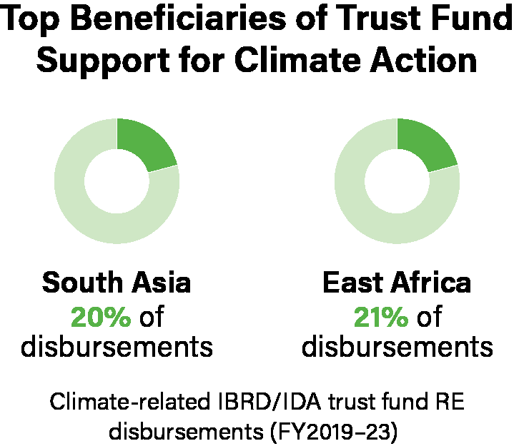

**Image 2 OCR + Description:**
```
Interconnected Challenges
and Solutions

42% of climate-related IBRD/IDA
trust fund RE disbursements supports
countries impacted by FCV

(FY2019-23)

**Image Description:**
The image is a section from an annual development report titled "Interconnected Challenges and Solutions." 

Layout and Key Elements:
- At the top, the title "Interconnected Challenges and Solutions" is displayed in bold black text centered on a white background.
- Below the title, there is a horizontal band divided into two parts:
  - The left part is a solid green square containing a white icon of a globe with leaves, representing environmental or climate-related themes.
  - The right part is a lighter green rectangle without icons or text.
- Beneath this band, there is a bold numerical figure "42%" in large green font.
- Next to the 42%, in black text, the statement reads: "of climate-related IBRD/IDA trust fund RE disbursements supports countries impacted by FCV."
- At the bottom of the text, there is a small note in parentheses: "(FY2019–23)," indicating the fiscal years covered by the data.

The overall design uses green tones to emphasize the environment and climate-related focus of the data, highlighting the percentage of financial disbursements supporting countries affected by fragility, conflict, and violence (FCV).
```


**Image 3 OCR + Description:**
```
Leveraging Global Partnerships

1/3 of climate-related
IBRD/IDA trust fund RE
disbursements are
transfers from FIFs

(FY2019-23)

**Image Description:**
The image is a segment of an annual development report titled "Leveraging Global Partnerships." The layout features a title in bold black text at the top. Below the title, there is a circular chart on the left side, designed like a donut chart, mostly light green with a solid green section representing one-third of the circle.

To the right of the chart, there is prominent text in two colors: "1/3" in large bold green font, followed by black text that reads "of climate-related IBRD/IDA trust fund RE disbursements are transfers from FIFs." Beneath this text, in smaller black font, is the timeframe reference: "(FY2019-23)."

Key elements:
- Bold title at the top: "Leveraging Global Partnerships"
- Donut chart visually representing the one-third statistic
- Text emphasizing the fraction (1/3) in green, followed by explanatory information
- Fiscal years covered are FY2019-23

The overall design uses clear, concise text supported by a simple visual aid to highlight the role of global partnerships in climate-related trust fund disbursements.
```
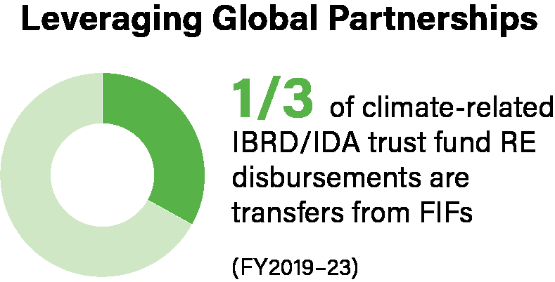

**Image 4 OCR + Description:**
```
HYUTTTTTATAUTUTTTT LUE

| THAT

NUTTY
AURA

**Image Description:**
The image shows a man wearing sunglasses, a blue shirt with reflective stripes, black pants, and red gloves, kneeling on a rooftop while inspecting or adjusting a set of solar panels. The panels are tilted and span diagonally from the bottom left to the center of the image. Behind the man, there are two air conditioning units or similar equipment on the rooftop. Green trees and a partly cloudy sky form the background. There is no visible text in the image.

Key elements:
- Man wearing protective gloves and sunglasses, engaged with the solar panels.
- Tilted solar panels on a rooftop.
- Air conditioning units on the rooftop.
- Trees and sky in the background.
- White rooftop with some dirt or patches.

The image captures an aspect of solar energy technology and maintenance, suitable for illustrating development or sustainability efforts in an annual development report.
```
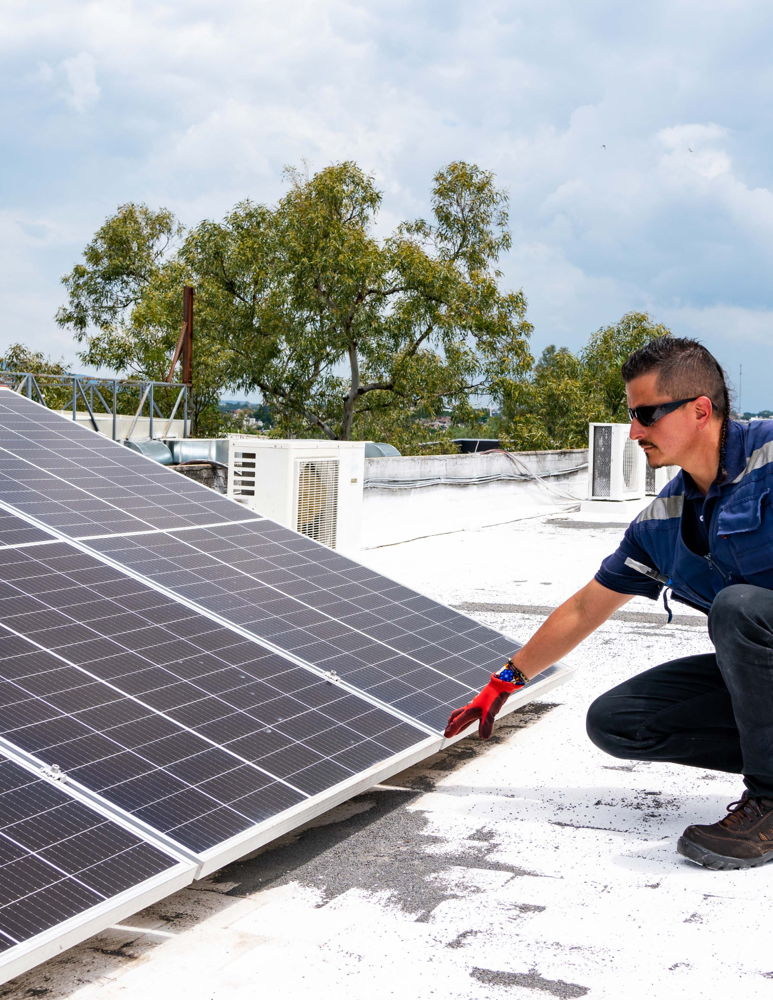

## Page 20
2. Tackling Climate Change  |  11
Climate change reverberates across the globe, but 
low-income countries and vulnerable communities 
suffer the most despite contributing the least to carbon 
emissions. Left unchecked, climate change could 
push 132 million people into poverty over the next 10 
years, undoing hard-won development gains.3 It could 
drive 216 million people to migrate within their own 
countries by 2050, with hotspots of internal migration 
emerging as soon as 2030.4 Extreme weather events 
caused by a changing climate have already severely 
strained crop yields and are expected to further 
damage global food supplies, especially in the world’s 
most food-insecure regions. GHG emissions that 
cause global warming continue to grow, and the world 
is not on track to meet net zero by 2050.5 
Tackling climate change is urgent and fundamental to 
the fight against poverty. The World Bank is the largest 
multilateral financier of climate action in developing 
countries. It delivered a record $38.6 billion in climate 
finance in fiscal 2023, a 22 percent increase from 
last year. Guided by its Climate Change Action Plan 
2021–2025, the Bank is mainstreaming climate into 
all its development work, ensuring that by 2025 
everything it does is aligned with the objectives of the 
Paris Agreement. 
The Bank helps countries most affected by the climate 
crisis turn their national plans, policy priorities, and 
other climate ambitions into meaningful action on 
reducing or preventing GHG emissions (mitigation) 
and adjusting to unavoidable consequences of climate 
change (adaptation). It works with both the public and 
private sectors to implement policy and regulatory 
reforms and to create incentives for investments that 
can mitigate climate change, as well as help countries 
adapt to it. Well managed, a just transition to low-
carbon development can usher in an era of green 
growth with more and better jobs, greater economic 
and climate resilience, and greater equality and 
shared prosperity.
The World Bank’s commitments for climate-related 
investments reached 41 percent of total Bank financing 
in fiscal 2023.  IBRD and IDA together delivered $29.4 
billion in climate finance, of which almost $12 billion 
supported investments in adaptation and resilience. 
This brings the Bank closer to its goal of achieving 
parity between mitigation and adaptation financing. 
IFC, which delivered $7.6 billion in total climate 
finance in fiscal 2023, and MIGA, which provided 
$1.5 billion, also continue to step up efforts to identify 
private sector investment opportunities that enhance 
adaptation and resilience. 
Trust funds and FIFs are part of this push for increased 
climate action. They play an important role in the 
provision of concessional funding to scale up climate 
investments, help countries in their quest for climate 
adaptation, and incentivize faster decarbonization. 
The World Bank uses trust funds in tandem with its 
core financing, as well as with climate-related FIFs, 
to address global climate challenges and support 
countries’ sustainable development efforts. 
The volume of recipient-executed (RE) disbursements 
from IBRD/IDA trust funds going to climate and other 
environment-related activities has increased annually 
for the last five fiscal years of 2019–23 (Figure 2.1). 
Climate-related RE investments during this time 
frame totaled $2.5 billion, of which $1.4 billion, or 
56 percent, were for mitigation activities, and $1.1 
billion, or 44 percent, were for adaptation activities 
(Figure 2.2). Two-thirds of all RE climate-related 
disbursements, or $1.7 billion, were contributed by 
development partners, while the other one-third, 
or $0.8 billion, consisted of transfers from FIFs 
implemented by IBRD/IDA. 
Twelve of the 26 FIFs administered by the Bank focus 
on climate change and environmental issues. The 
Bank acts as an implementing entity for many of 
these FIFs, including the Global Environment Facility 
(GEF), the Climate Investment Funds (CIF), and the 
Green Climate Fund (GCF). These are the three 
largest climate-related FIFs, with the GEF providing 
concessional 
funding 
for 
environment-related 
activities more broadly, and CIF and the GCF focusing 
on climate change mitigation and adaptation.
3 Jafino, B.A. et al. 2020. “Revised Estimate of the Impact of Climate Change on Extreme Poverty by 2030.” Policy Research 
Working Paper 9417. World Bank, Washington, D.C.
4 Clement, V., et al. 2021. Groundswell Part 2: Acting on Internal Climate Migration. Washington D.C.: World Bank.
5 To keep global warming to no more than 1.5°C, as called for in the Paris Agreement, global GHG emissions need to be reduced 
by 45 percent by 2030 and reach net zero by 2050.


## Page 21
2. Tackling Climate Change  |  12
Figure 2.1. IBRD/IDA Trust Fund RE Disbursements for Climate and 
Other Environmental Activities, Fiscal 2019–23 ($ Millions)
Figure 2.2. IBRD/IDA Trust Fund RE Disbursements for Mitigation 
and Adaptation Activities, Fiscal 2019–23 ($ Millions)


**Image 1 OCR + Description:**
```
$ Millions

1,600

1,400

1,200

1,000

800

600

400

200

FY20

Climate

FY21 FY22

@ Other Environment

654

830

FY23

**Image Description:**
The image is a vertical stacked bar chart that shows data over five fiscal years (FY19 to FY23). The chart represents millions of dollars on the vertical axis ranging from 0 to 1,600, and fiscal years (FY19, FY20, FY21, FY22, FY23) on the horizontal axis.

Key elements and layout:
- There are five bars, one for each fiscal year.
- Each bar is divided into two segments:
  1. The lower segment in teal color labeled "Climate"
  2. The upper segment in dark blue labeled "Other Environment"
- Each segment of the bars contains white text indicating the exact dollar value in millions.

Values of segments by fiscal year:
- FY19: Climate = 280, Other Environment = 251
- FY20: Climate = 383, Other Environment = 364
- FY21: Climate = 378, Other Environment = 418
- FY22: Climate = 690, Other Environment = 334
- FY23: Climate = 830, Other Environment = 654

The vertical axis is labeled "$ Millions". The horizontal axis lists the fiscal years as FY19 through FY23.

Below the chart, there is a color-coded legend:
- Teal color with the label "Climate"
- Dark blue color with the label "Other Environment"

Overall, the chart depicts a trend of increasing total dollars in both Climate and Other Environment categories over the fiscal years, with FY23
```
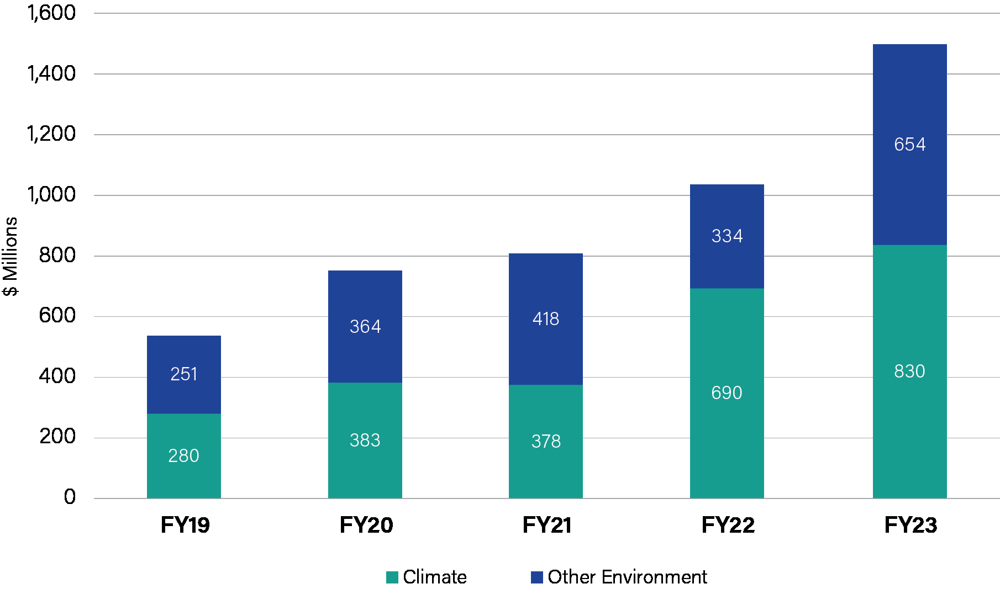

**Image 2 OCR + Description:**
```
**Image Description:**
The image is a bar and line combined chart titled "New employees by age and percentage percentage of women," which is part of an annual development report. 

Layout and Key Elements:
- The x-axis displays years ranging from 2017 to 2021.
- The y-axis shows absolute numbers, presumably representing the number of new employees.
- Each year has a stacked bar divided into two segments:
  - Blue, representing employees aged under 30.
  - Orange, representing employees aged 30 and over.
- Numbers appear inside each colored segment, indicating the exact count of employees for that age group and year.
- Two lines are plotted over the bars:
  - A blue line with percentage labels indicating the "Percentage of under 30 employees."
  - An orange line with percentage labels indicating the "Percentage of women."

Text Data:
- Year 2017: 
  - Under 30: 75 employees
  - 30 and over: 205 employees
  - Percentage under 30: 27%
  - Percentage women: 73%
- Year 2018:
  - Under 30: 162 employees
  - 30 and over: 220 employees
  - Percentage under 30: 42%
  - Percentage women: 58%
- Year 2019:
  - Under 30: 170 employees
  - 30 and over: 209 employees
  - Percentage under 30: 45%
  - Percentage
```
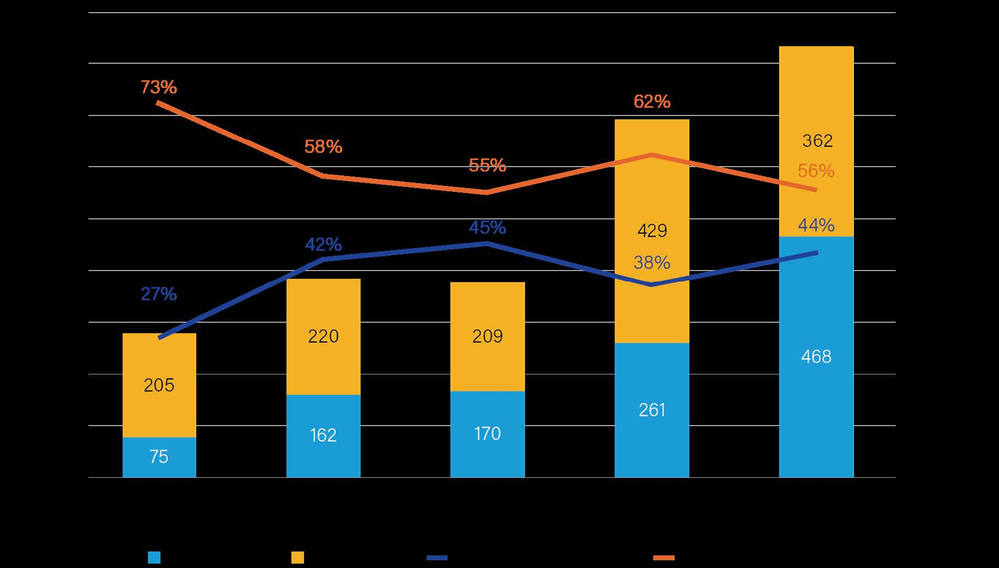

## Page 22
2. Tackling Climate Change  |  13
2.1 Advancing Mitigation Efforts
The World Bank prioritizes mitigation activities in the 
following five systems, which together contribute 
over 90 percent of global GHG emissions: energy; 
agriculture, food, water, and land; cities; transport; 
and manufacturing. Transforming these systems is 
key to achieving Nationally Determined Contributions 
(NDC)—emission reductions that countries pledge 
to achieve under the Paris Agreement—as well as 
countries’ development goals. Trust funds are part of 
these efforts.
For instance, given green hydrogen’s promise 
as a renewable energy source that could help 
decarbonize challenging sectors, such as mining 
and transport, a technical assistance grant to Chile 
from the Spanish Fund for Latin America and the 
Caribbean (SFLAC) has played a pivotal role in 
advancing the country’s National Green Hydrogen 
Strategy. The grant enabled the Bank to provide 
valuable knowledge and policy guidance, helping to 
position Chile as a regional leader in green hydrogen. 
Furthermore, it informed the preparation of a $150 
million IBRD project approved in June 2023 to 
support the creation of a Green Hydrogen Fund.
Energy sector transformation is also underway in 
Ukraine, despite Russia’s invasion. On March 16, 2022, 
the Ukrainian power system started synchronous 
operations with the power systems of the European 
Network of Transmission System Operators for 
Electricity (ENTSO-E) after disconnection from the 
Unified Power System of Russia. The World Bank 
utilized various trust funds to support this journey 
through project investments and technical assistance.6 
Ukraine now has access to a larger reserve of power 
and one of the world’s largest integrated electricity 
markets, to which Ukraine turned to improve its energy 
security after military attacks damaged more than half 
of its power infrastructure in late 2022. Over the long 
term, the synchronization will help Ukraine unlock 
trade opportunities with the European energy market 
and competition within the domestic market, as well 
as move toward sector decarbonization. A more 
flexible power system will allow greater integration of 
renewable energy sources, thereby lessening reliance 
on fossil fuels.
In India, IFC used trust funds7 to help advance a 
public-private partnership between Rewa Ultra 
Mega Solar Ltd. and the state government of Madhya 
Pradesh to develop eight solar power parks totaling 
1,500 megawatts and expected to reduce 2.8 million 
tons of GHG emissions annually. The advisory project, 
completed in fiscal 2023, not only resulted in some 
of the lowest solar tariffs in the state, but it also 
secured Indian Railways, one of the largest electricity 
consumers in the country, as a power procurer 
alongside the state power procurement entity, MP 
Power Management Company Limited. Having a 
captive, high-quality buyer has helped to de-risk the 
generation project, and it has created an opportunity 
for the largest railway network in Asia to reduce the 
carbon footprint of its train operations.
6 The trust funds involved were Bank-implemented financing from CIF’s Clean Technology Fund (CTF), the Ukraine Second 
Power Transmission Project Single-Donor Trust Fund, the Global Facility for Disaster Reduction and Recovery (GFDRR), 
the Korea Green Growth Trust Fund (KGGTF).
7 The IFC trust funds involved were the Australia Department of Foreign Affairs and Trade – IFC Global Advisory Services 
Trust Fund, and the Infrastructure Development Collaboration Partnership Fund (DEVCO).
With support, we will be able 
to establish a fund that will 
provide financing under favorable 
long-term conditions for the 
development of projects...
and support the development of
this industry.
— Mario Marcel, Minister of Finance, Chile


## Page 23
2. Tackling Climate Change  |  14
Peru 
is 
also 
focused 
on 
transport 
sector 
decarbonization. The Global Facility to Decarbonize 
Transport (GFDT) supported the preparation of an 
IBRD project focused on traffic management and safe 
infrastructure for bicyclists and other non-motorized 
transport users in the capital Lima. GFDT-funded data 
and analysis helped to prioritize transport investments 
and inform bike lane design, traffic flow, street 
intersection safety, and capacity building for local 
transport planning agencies. The work will shape the 
next 10 years of the investment program and Lima’s 
urban transport planning efforts more broadly. It will 
also serve as a blueprint for Lima’s secondary cities 
and similar World Bank projects elsewhere.
With funding from the Global Program for the 
Blue Economy (PROBLUE) and in partnership with 
clients, sector specialists, and scientists, the World 
Bank led a series of reports on decarbonizing the 
international maritime shipping sector and harnessing 
the unique business and development opportunities it 
provides. This research offers insight to policymakers 
PROBLUE has been particularly 
instrumental in identifying 
potential and supporting low-
income countries in developing 
their blue economy, especially 
business opportunities in the area 
of alternative fuels.
— Jan Hoffmann, Head, Trade Logistics Branch, Division on 
Technology and Logistics, United Nations Conference on 
Trade and Development
Photo: Carlos F Pardo / World Bank
of the International Maritime Organization, whose 
2023 GHG reduction strategy includes a common 
ambition to reach net-zero GHG emissions from 
international shipping close to 2050. Other industry 
and civil society players also use these World Bank 
global knowledge products to make evidence-based 
policy and investment decisions.


**Image 1 OCR + Description:**
```
**Image Description:**
The image depicts a green-painted, designated bike lane along a paved urban street. Two people are riding bicycles side by side within this bike lane: a woman in front on a light green bicycle with a basket, dressed in a light blue shirt and dark pants, and a man behind her on a black and red bicycle wearing a gray hoodie and dark shorts. 

To the right of the bike lane is a sidewalk bordered by a concrete curb and some grass with a tree trunk prominently visible in the foreground. In the background and to the left, there are urban elements such as residential or commercial buildings, some trees, and pedestrian figures. Street signs and road markings are also present, emphasizing the bike lane and urban setting.

There is no visible text in the image. The overall layout highlights safe infrastructure for cyclists within a city environment, likely illustrating a development related to urban planning or transportation improvements in the annual development report.
```
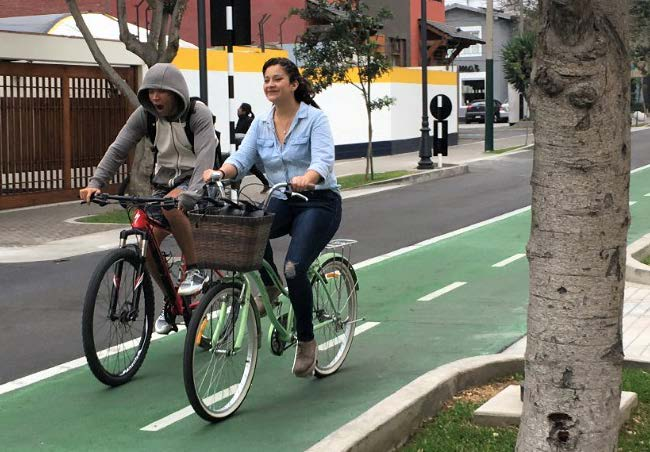

## Page 24
2. Tackling Climate Change  |  15
The World Bank’s climate change mitigation work also 
includes helping countries boost their public domestic 
resources for climate action. Green taxes and fossil 
fuel subsidy reforms can help countries raise revenues 
while accelerating investments in renewables, but 
such measures are underutilized. With funding from 
the Global Tax Program (GTP), the World Bank and 
the International Monetary Fund (IMF) developed the 
Climate Policy Assessment Tool (CPAT). Countries 
can use CPAT to design and assess climate-smart 
tax and subsidy reform options, such as carbon taxes, 
emissions trading systems, coal excise taxes, power 
feebates, electricity excises, electricity emissions, and 
renewable subsidies. The Bank has applied the tool in 
over 30 countries, contributing to development policy 
operations (DPOs) in two countries and several World 
Bank Country Climate and Development Reports.
2.2 Adapting and Building 
Resilience to Climate Impacts 
The World Bank helps countries around the world 
adapt and build resilience to the increasingly severe 
impacts of climate change so they can better prepare 
for and withstand climate shocks. The Bank has 
committed to ensuring that half of its climate finance 
supports adaptation and resilience. Trust funds 
contribute to this goal, building partnerships and 
delivering adaptation investments that benefit people 
and communities now and long into the future.
For example, the Global Facility for Disaster 
Reduction and Recovery (GFDRR) supports World 
Bank collaboration with a range of UN agencies, 
governments, and other partners to help countries 
reduce disaster risk and losses from natural disasters. 
It also serves as the World Bank’s implementing entity 
for the Climate Risk and Early Warning Systems 
Initiative (CREWS)—a FIF that invests in early 
warning systems to protect lives, livelihoods, and 
assets in least-developed countries and small island 
developing states (SIDS) that are most vulnerable to 
the impact of climate and extreme weather events. 
GFDRR enables a range of World Bank technical 
support and analytical tools, such as the Global 
Rapid Post-Disaster Damage Estimation (GRADE) 
deployed in the aftermath of recent floods in Pakistan. 
The assessment directly informed the recovery 
operations and helped leverage $1.7 billion of World 
Bank financing. In Chad, the GFDRR-backed Nature-
Based Solutions Opportunity Scan identified areas in 
which nature-based solutions could reduce pluvial 
and fluvial flood risks and address urban heat in the 
capital city. This led to a $150 million IDA investment 
in N’Djamena’s urban resilience. 
Nigeria has benefitted from Bank-implemented 
funding from the Global Environment Facility 
(GEF) and its Special Climate Change Fund 
to better handle disaster risks related to erosion. 
The Nigeria Erosion and Watershed Management 
Project (NEWMAP) helped to reduce soil erosion in 
targeted sub-watersheds across 23 states through 
an integrated watershed management approach. 
Some 12 million people have benefited from 
reconnected transport corridors, better access to 
markets and services, reduced flooding and siltation, 
improved storm water planning, and improved disaster 
risk preparedness.
From too much water to not enough, trust-funded 
activities help countries cope with water scarcity 
made worse by climate change. Groundwater is a 
vital freshwater resource worldwide, particularly 
in times of drought. As climate change worsens, 
policymakers need to better understand and manage 
this critical asset. The Global Water Security and 
Sanitation Partnership (GWSP) funded a new 
World Bank global flagship report entitled, The Hidden 
Wealth of Nations: The Economics of Groundwater in 
Times of Climate Change. It considers the economic 
value of groundwater, the costs of misusing it, and 
the opportunities to leverage it more effectively. The 
report offers new data and evidence to help prioritize 
groundwater across sectors and at the highest 
political level.


## Page 25
2. Tackling Climate Change  |  16
Governments of several countries in the Sahel 
have initiated institutional reforms to improve the 
management 
of 
their 
groundwater 
resources, 
thanks to research funded by the Cooperation in 
International Waters in Africa (CIWA) through 
the Sahel Groundwater Initiative. Analysis of the 
challenges of groundwater management in the 
region underscores the importance of this natural 
resource as a buffer against increasing water stress 
in arid lands and proposes a first typology of Sahelian 
groundwater-dependent ecosystems. 
Climate adaptation and resilience measures demand 
high-level political action, but also local community 
buy-in. In Samoa, the World Bank implemented a 
$14.6 million project financed by CIF’s Pilot Program 
for Climate Resilience (PPCR) that built on the 
governance embedded within traditional community 
structures to integrate climate risk and resilience into 
core development planning. Communities prioritized 
adaptation investments to protect coastal resources 
The project has not only benefitted 
our villages and district communities 
but also civil society and the private 
sector. We have started to build 
community resilience to climate 
change to deal with multiple shocks.
— Afioga Leasiosiofa’asisina Galumalemana Oscar 
Malielegaoi, Chief Executive Officer of the Ministry of 
Finance, and Chairperson of the Climate Resilience 
Steering Committee, Samoa
and infrastructure from sea level rise and intensifying 
storms. 
Over 
140,000 
people 
benefitted 
from 
investments ranging from rehabilitating mangroves 
to building safe shelters and escape roads. Some 400 
hectares of degraded land were replanted and fish 
reserves were strengthened.
Photo: Adaptation Fund


**Image 1 OCR + Description:**
```
**Image Description:**
The image shows two children outdoors, standing on a paved path surrounded by green foliage. The child on the left is a girl wearing a white T-shirt and a chevron-patterned skirt with colors including black, white, and shades of blue. She is holding one end of a stick resting on her shoulder. The child on the right is a boy wearing an orange T-shirt and black shorts. Both children are barefoot. They are carrying a yellow bucket, which is suspended by a rope or handle from the stick resting on the girl's shoulder.

There is no visible text or written information in the image. The setting appears natural and rural, suggesting themes of daily life, water collection, or community development, which fits well into an annual development report context.
```
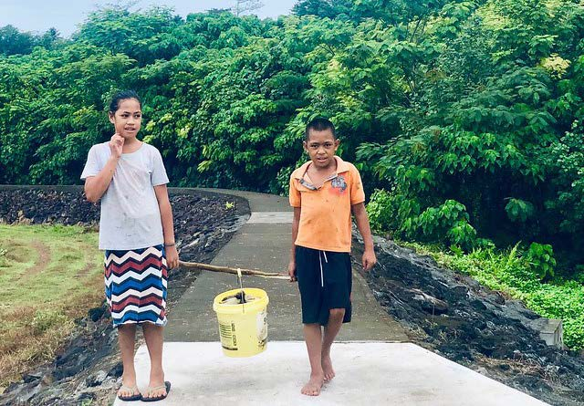

## Page 26
2. Tackling Climate Change  |  17
Community engagement is central to Mozambique’s 
Conservation Areas for Biodiversity and Development 
Project (MozBio), supported by the GEF and the 
multi-donor trust fund (MDTF) for Integrated 
Landscape Management (ILM) in Mozambique. 
Recognizing that the inclusion of women in natural 
resource management and their equal participation 
in economic and social life are essential for 
enhanced resilience, MozBio has worked closely 
with partners on gender balancing and piloting the 
Gender Action Learning System (GALS). More than 
1,000 beneficiaries have been guided through this 
step-by-step household methodology to identify and 
overcome gender barriers to economic and social 
progress. The project also supports area schools in 
implementing an environmental curriculum to raise 
youth awareness and engagement in preserving 
Mozambique’s biodiversity.
2.3 Accessing Carbon Markets 
Carbon markets could be a major source of additional 
revenue for climate action, reaching $50 billion a year 
by 2030 by some estimates.8 Market structures taking 
shape under Article 6 of the Paris Agreement hold a 
great deal of promise for incentivizing decarbonization 
efforts. Since the launch of the Clean Development 
Mechanism (CDM) under the Kyoto Protocol over 20 
years ago, the World Bank has worked with partners to 
create a full-fledged carbon market ecosystem—from 
setting standards for methodologies and requirements 
for third-party validation, to verification and reporting, 
to benefit-sharing arrangements so proceeds go to 
communities involved in reducing emissions.
World Bank trust funds have played a strategic role in 
this work, piloting results-based climate and carbon 
finance mechanisms that deliver payments once pre-
agreed targets have been achieved—namely, verified 
8 Blaufelder, C. et al. 2021. A blueprint for scaling voluntary carbon markets to meet the climate challenge. 
McKinsey Sustainability.
emission reductions (or carbon credits) that meet 
the World Bank’s highest environmental, accounting, 
and social inclusion standards. The promise of future 
payout is a strong incentive for action on the ground, 
and payments signal to other potential investors and 
buyers that real progress is being made in reducing 
emissions. To ensure success, trust funds provide 
technical assistance and capacity building so 
stakeholders have the necessary tools and training 
to generate, verify, and monetize their emission 
reductions. The process enables countries to build the 
expertise and systems needed to access international 
and regional carbon markets and sell excess carbon 
credits over the long term.
Building on these two decades of experience, the 
World Bank is preparing to roll out its new Scaling 
Climate Action by Lowering Emissions (SCALE) 
umbrella multi-partner trust fund. SCALE brings 
together all results-based climate and carbon financing 
programs currently housed at the World Bank into a 
one-stop-shop. It is designed to complement up-front 
activity-based finance with results-based payments of 
$40-60 million per project, supporting decarbonization 
across a broad range of sectors. SCALE also provides 
technical advice and capacity building and serves 
as an instrument for policy dialogue and broader 
engagement to incentivize low-carbon development. 
In addition, SCALE’s benefit-sharing arrangements 
are designed with broad stakeholder consultation 
to ensure that all project participants, including 
Indigenous Peoples and local communities, are 
recognized and rewarded for their role in driving 
low-carbon transitions. The Enhancing Access to 
Benefits while Lowering Emissions (EnABLE) 
MDTF will work in tandem with SCALE to further 
promote social inclusion of marginalized communities 
and disadvantaged groups, such as women, youth, 
and people with disabilities. 


## Page 27
2. Tackling Climate Change  |  18
Looking back over the last five years, the following 
trust-funded activities offer insight into the power 
and potential of results-based payments to stimulate 
greater and faster decarbonization in a variety of 
settings and sectors.
For example, in Brazil, the Carbon Partnership 
Facility (CPF) worked with the country’s second-
largest public bank, CAIXA, to provide financing to 
incentivize reductions in methane emissions from 
decomposing trash. Methane is a powerful GHG and 
the second-largest driver of global climate change. The 
world’s cities generate more than a billion tons of solid 
waste each year. Under this project, improvements to 
four landfills generated emission reduction payments 
of €23.7 million between 2013 and 2020, and captured 
over 175 million cubic meters of methane, equivalent 
to 3.5 million tons of CO2 emissions. 
Supported by $18 million in grants from the 
BioCarbon Fund Initiative for Sustainable Forest 
Landscapes (ISFL), Ethiopia’s Oromia Forested 
Landscape Program combines agriculture, livestock, 
and forestry to address climate change at the 
landscape level. By targeting the Oromia region, home 
to over 30 million people and 52 percent of Ethiopia's 
forests, the program plays a central role in advancing 
the country's climate resilience agenda. In February 
2023, a milestone was met with the signing of an 
Emission Reductions Purchase Agreement (ERPA). 
ISFL agrees to pay up to $40 million for the reduction 
of approximately 4 million tonnes of GHG emissions 
by 2030 through forest preservation and sustainable 
land management practices in the program area. 
Our village is no longer 
threatened by deforestation. We 
are reforesting the bare lands and 
sustainably managing the existing 
ones. We have seen how the 
microclimate is changing and the 
income-generating activities are 
benefiting us.
— Mohammed Jemal, Farmer and cooperative member, 
Chewaka district, Oromia, Ethiopia
Photo: Natalia Cieslik / World Bank


**Image 1 OCR + Description:**
```
**Image Description:**
The image shows a natural landscape dominated by a group of trees with wide, spreading branches and green foliage. The trees are spaced out across the scene, allowing sunlight to filter through the canopy. The ground beneath the trees is covered with green grass and scattered rocks. The sky is partly visible through the branches, showing a clear day with some clouds.

There are no text elements visible in the image. The overall layout consists of a well-lit, serene natural environment with a focus on the trees and their structure. This image would be suitable for illustrating themes of nature, ecology, forestry, or environmental development in an annual report.
```
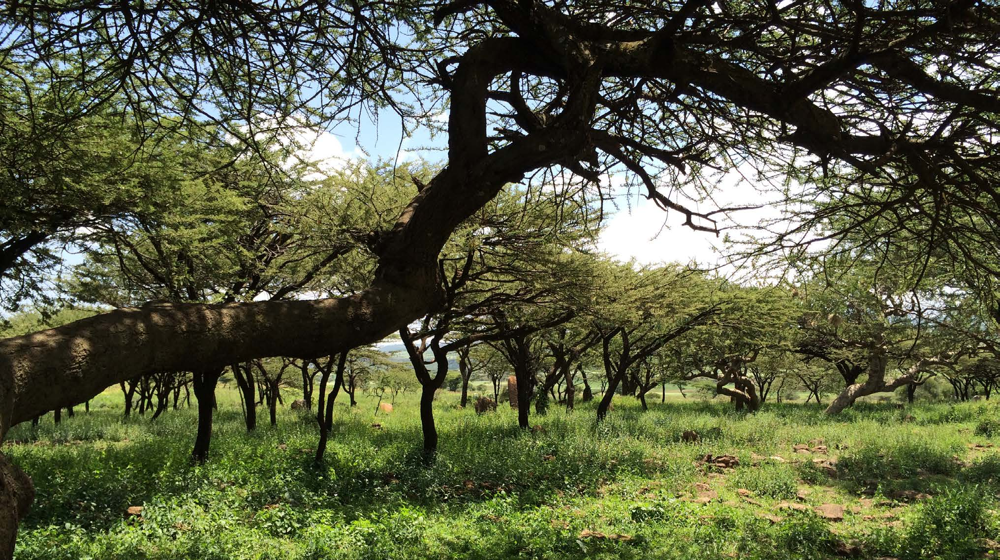

## Page 28
2. Tackling Climate Change  |  19
The Forest Carbon Partnership Facility (FCPF) 
has also signed ERPAs with 15 countries, including 
Indonesia. For over a decade, the FCPF has supported 
Indonesia in developing its first-ever jurisdictional-level 
program for reducing emissions from deforestation 
and forest degradation (REDD+), including signing an 
ERPA to uphold the program’s implementation. The 
FCPF will pay $110 million for the reduction of 22 million 
tons of GHG emissions across 12.7 million hectares 
of land rich in tropical rainforests and biodiversity. 
In fiscal 2023, Indonesia received an advance ERPA 
payment of $20.9 million, which represents 14 percent 
of the value of the emission reductions reported in the 
government’s monitoring report for the 2019–2020 
crediting period. With the FCPF, the government is 
exploring various carbon finance scenarios, including 
carbon markets and a domestic carbon exchange, as 
it expects to generate excess emission reductions. 
While carbon markets under Article 6 of the Paris 
Agreement have the potential to unlock climate 
finance, they will only be effective in limiting 
global warming if the carbon credits transacted 
are real, credible, and accurately accounted for 
and tracked. The Carbon Finance Assist Trust 
Fund (Carbon-Assist) and the Partnership for 
Market Implementation Facility (PMIF) helped 
finance the development of the Climate Action 
Data (CAD) Trust, an open-source global platform 
that connects, aggregates, and harmonizes carbon 
credit data. CAD Trust enhances transparency 
and trust in carbon markets by harmonizing data 
formats and connecting disparate carbon registry 
systems. The Government of Singapore and the 
International Emissions Trading Association also 
support the platform, whose overarching goal is to 
strengthen reporting compliance requirements and 
implementation of NDCs.
2.4 Incentivizing 
the Private Sector 
The private sector has a key role to play in helping 
address the climate challenge, as economic stresses 
and multiple crises strain the ability of governments to 
make the necessary investments to mitigate and adapt 
to climate change. With the support of trust funds, the 
World Bank offers climate expertise across industries 
and sectors, combined with a deep understanding 
of emerging markets and a practical outlook, to 
help private sector clients be competitive in the new 
climate economy. The Bank helps governments build 
expertise to work with their private sectors on climate-
oriented growth, as firms develop decarbonization 
plans and financial institutions work to increase their 
share of climate investments. 
For example, trust funds from Germany helped launch 
the World Bank’s Scaling Up Climate Finance through 
Greening the Financial Sector—or 30 by 30 Zero 
Program—in the Philippines. It is one of four countries 
targeted by the program, which aims to increase climate 
lending to 30 percent of participating banks’ portfolios 
by 2030. Work led by IFC is underway to tackle the 
regulatory and institutional constraints facing financial 
institutions, develop the market for climate thematic 
bonds, and build capacity and coordination for climate 
finance. By 2030, the program is also expected to assist 
the Philippines in aligning financial sector strategies 
and reforms with the implementation of new NDCs 
and raise at least $400 million of climate funding from 
IFC to local banks, and another $250 million through 
the introduction of climate thematic bonds issued by 
real sector companies to the capital markets.
As a bank known for its 
commitment to sustainable 
finance and climate change 
mitigation, we are delighted that 
IFC has entrusted us with this 
significant investment.
— Jose Teodoro K. Limcaoco, President and Chief Executive 
Officer, Bank of the Philippines Island, Philippines


## Page 29
2. Tackling Climate Change  |  20
In conjunction with the 30 by 30 Zero Program, 
technical assistance and advisory service grants from 
the Climate Support Facility (CSF) have contributed 
to financial sector reforms in the Philippines. The 
World Bank provided guidance on developing a 
green taxonomy and incentives for green investments 
within the country’s central bank and its Securities 
Commission, as well as on incorporating climate and 
environmental risks into financial institutions’ risk 
management frameworks and the country’s Insurance 
Code reform. This support enabled the government to 
implement a series of sustainable development policy 
actions under three DPOs approved in 2022 and 2023, 
together totaling $1.75 billion.
Trust fund and FIF financing help the Bank employ a 
range of instruments to de-risk high-impact climate 
projects in low and middle-income countries. For 
example, bespoke guarantee offerings provided by 
MIGA ease private sector investments in renewable 
energy development, including generation capacity, 
mini-grid systems, transmission systems, and battery 
storage. The Renewable Energy Catalyst Trust 
Fund (RECTF) provides a variety of risk mitigation 
and capacity tools toward this end, such as a first-
loss facility, reinsurance, guarantee tenor extension, 
financial grants, and soon, liquidity support. MIGA 
has so far used the RECTF for two guarantee projects, 
together amounting to $9.3 million in issuance 
of guarantees.
In 2022, the World Bank issued the Wildlife 
Conservation Bond (WCB) in support of South 
Africa’s efforts to conserve endangered species. Also 
known as the “Rhino Bond,” this five-year $150 million 
sustainable development bond includes a potential 
performance payment from the GEF, which will 
contribute to protecting and increasing black rhino 
populations in protected areas of South Africa. The 
WCB channels private sector investments to achieve 
conservation outcomes, while bringing jobs to local 
communities. Drawing on this model, in 2023, the 
World Bank priced a five-year $50 million, principal-
protected emission reduction-linked bond that 
mobilized private capital to increase financing for low-
carbon solutions in developing countries.
IFC uses blended finance, in which concessional 
funds from partners are blended with IFC’s own 
financing, to de-risk climate investments. A disciplined 
approach to deploying concessional funds minimizes 
the level of subsidy to avoid distorting markets and 
allows the crowding-in of other commercial financiers. 
For example, IFC invested $100 million in Egypt's 
first-ever private sector green bond to unlock finance 
for climate-smart projects, reduce GHG emissions, 
and support the country's energy transition. The 
bond will help Egypt's Commercial International 
Bank (CIB) increase lending to businesses investing 
in eco-friendly initiatives that are still nascent in 
Egypt, including green buildings, renewable energy, 
and energy efficiency. The project will benefit from 
$1.4 million in funding from the blended finance 
component of the UK-IFC Market Accelerator for 
Green Construction (MAGC) trust fund through 
performance-based incentives to motivate developers 
to construct certified green buildings.
Blended finance has helped Vietnam launch the 
development of a first-of-its-kind modern waste-to-
energy plant in Bac Ninh province to increase municipal 
solid waste treatment capacity, which currently hovers 
around 50 percent. The project includes a $15 million 
concessional loan from the Finland-IFC Blended 
Finance for Climate Program. By introducing an 
environmentally sound waste treatment and disposal 
solution, the plant will help avoid health and safety 
issues related to soil and groundwater contamination. 
Technology plays a powerful role in stimulating 
climate-smart innovations and investments. The 
World Bank serves as the trustee for AgResults 
Initiative, a FIF that uses pay-for-results prize 
competitions to incentivize the private sector to 
help develop, deliver, and scale up technologies 
that enhance productivity for smallholder farmers. 
One such competition in Vietnam sought to identify 
novel approaches for reducing GHG emissions and 
increasing yields in rice cultivation throughout South 
and Southeast Asia. 


## Page 30
2. Tackling Climate Change  |  21
Almost 70 percent of the roads 
in Neelkantha Municipality get 
damaged during the monsoon 
season... The CRISTA app now 
allows us to quickly identify 
problems and respond to repair 
and maintain roads.
— Krishna Dhakal, Engineer, Neelkantha Municipality 
Engineering Department, Nepal
IFC’s TechEmerge program matches innovators with 
companies to pilot projects, develop relationships, 
and scale solutions that tackle some of the world’s 
most pressing problems. Trust funds help expand 
the program’s reach. For example, funding from 
the Sustainable Cooling Innovation Programme 
Trust Fund enabled the TechEmerge Sustainable 
Cooling Cities LAC project to support 18 companies 
in Colombia and Mexico through two years of field 
testing new cooling technology. Demand for cooling 
in Mexico, including air conditioning, refrigeration, 
and other applications, is expected to increase six-fold 
in the next 30 years. As a result of this project, two 
innovators were able to raise $8.8 million in funding 
from external sources, and another 15 commercial 
contracts totaling $5 million are under discussion. 
In South Asia, the Program for Asia Resilience 
to Climate Change (PARCC) supported both 
the TechEmerge Resilience Fund and the Climate 
Innovation Challenge Fund. They brought together 
government representatives, the private sector, civil 
society, and other development partners from across 
the region to assess 26 crowdsourced solutions for 
providing local communities and decision makers with 
accurate information on climate and disaster risks and 
how to manage them. Innovations were diverse and 
included a two-way Wi-Fi community radio to connect 
signal-dark communities in India’s Dharma Valley, a 
parametric insurance product for flood-prone farming 
communities in Nepal, and a mobile app to monitor in 
real time the status of critical infrastructure in Nepal 
and Bangladesh.
Photo: On the Shore Films


**Image 1 OCR + Description:**
```
soe
ee tt

e

4 es
«
=

|

Reduccion
emisiones
co2

or cost? “4
Men ra de

Ww

fact
eto V.

**Image Description:**
The image depicts a man in a blue shirt, wearing a gray hard hat and a black face mask, interacting with large industrial or technical equipment. He is holding the side of a sizable blue and white machine or device. The man appears to be in a warehouse or industrial setting, as indicated by the metal shelving units and pallets in the background.

Key elements:
- The man is on the right side of the image.
- The machine has a blue front panel with white and turquoise text and icons.
- One icon is a cloud with "CO2" inside and three downward arrows, symbolizing CO2 reduction.
- Text on the blue panel includes:
  - "Reducción emisiones CO2" (Reduction of CO2 emissions)
  - "Menor costo de tu factura de" (Lower cost of your bill for), with further text cut off or not fully visible.
- The machine includes control displays or indicators, one showing the number "4" and another showing "-20."
- The background shows orange and blue warehouse racks with some yellow labels.

Overall, the image conveys a theme of environmental responsibility and cost savings related to CO2 emissions, likely highlighting the company's efforts or progress in reducing carbon emissions as part of the annual development report.
```
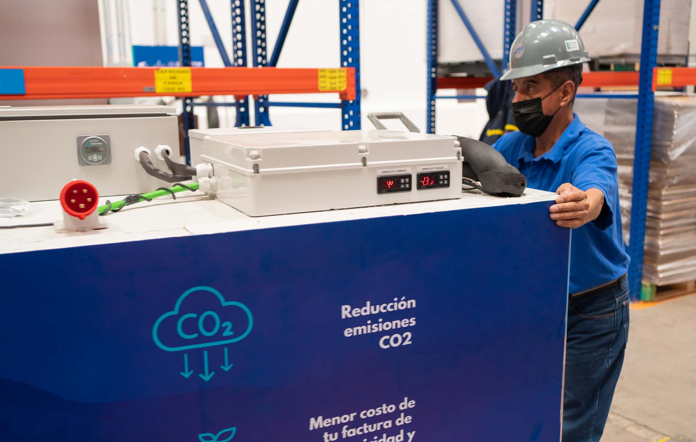

## Page 31
3. Strengthening Pandemic Prevention, Preparedness, and Response  |  22
Strengthening Pandemic Prevention, 
Preparedness, and Response 
3
Photo: Ezra Acayan / World Bank 


**Image 1 OCR + Description:**
```
Focusing on the Most Vulnerable

56% of health-related IBRD/IDA
trust fund RE disbursements supports
low-income countries

(FY2019-23)

**Image Description:**
The image layout is simple and informative, appearing as a section of an annual development report with a focus on health-related financial support to vulnerable countries.

At the top, in bold black font, is the heading: "Focusing on the Most Vulnerable."

Below the heading, the background is divided into two horizontal bands, one in a medium orange shade on the left and a lighter orange shade on the right. On the left band, there is a white icon of a shield with a stylized virus or microbial symbol inside, likely representing health protection or health-related funding.

Underneath this colored band and icon, in large, bold orange text is the key statistic: "56%". This percentage figure is the focal point of the message.

Next to the percentage, a black text explanation reads: "of health-related IBRD/IDA trust fund RE disbursements supports low-income countries."

At the bottom, in parentheses and black text, it states the fiscal years covered: "(FY2019–23)"

Overall, the image communicates the significant portion (56%) of certain health-related financial disbursements by IBRD/IDA trust funds going to support low-income countries during the fiscal years 2019 to 2023, emphasizing a focus on vulnerable populations.
```
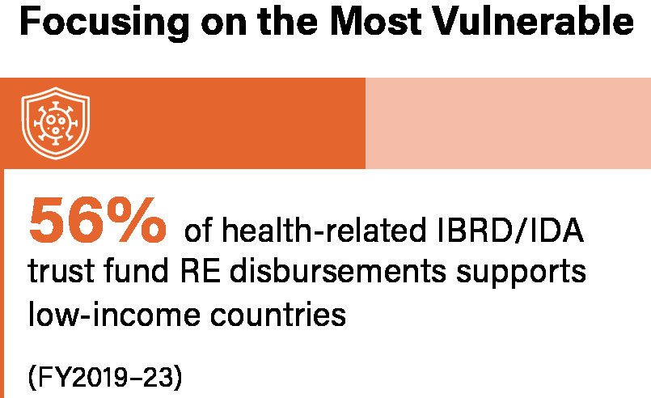

**Image 2 OCR + Description:**
```
Top Beneficiaries of Trust Fund
Support to the Health Sector

>)

South Asia East Africa
41% of 28% of
disbursements disbursements

IBRD/IDA trust fund RE disbursements to
the health sector (FY2019-23)

**Image Description:**
The image is an infographic from an annual development report focused on the top beneficiaries of trust fund support to the health sector. 

Layout and Key Elements:
- Title: At the top, bold text states "Top Beneficiaries of Trust Fund Support to the Health Sector."
- Below the title, there are two separate doughnut charts side by side.
- The left doughnut chart represents South Asia and is predominantly a lighter shade of orange with a darker orange segment.
- Under this chart, the text reads: "South Asia 41% of disbursements" with "41%" and "South Asia" highlighted in a darker orange.
- The right doughnut chart represents East Africa, also mainly a lighter orange with a smaller dark orange segment.
- Under this chart, the text reads: "East Africa 28% of disbursements" with "28%" and "East Africa" highlighted in the same darker orange.
- At the bottom, there is a note in smaller text stating: "IBRD/IDA trust fund RE disbursements to the health sector (FY2019-23)."

The image effectively conveys that South Asia and East Africa are the top two recipients of health sector trust fund disbursements during the fiscal years 2019 to 2023, with South Asia receiving the larger share.
```
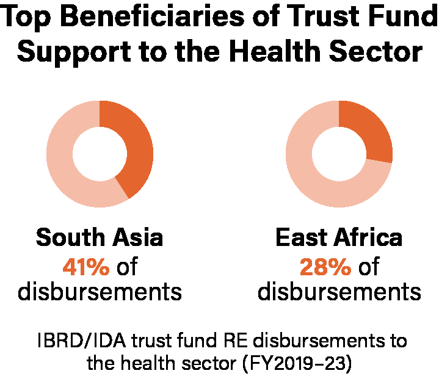

**Image 3 OCR + Description:**
```
Top Trust Funds in the Health Sector

« Global Financing Facility
« Afghanistan Resilience Trust Fund

Together account for 52% of IBRD/IDA
trust fund RE disbursements to

the health sector (FY2019-23)

**Image Description:**
The image layout is simple and text-focused, designed as a section of an annual development report highlighting key trust funds in the health sector. 

Key elements include:

1. A prominent heading in bold: "Top Trust Funds in the Health Sector."
2. Two bullet points listing the trust funds:
   - Global Financing Facility
   - Afghanistan Resilience Trust Fund
3. Below the bullet points is a sentence providing a statistic: "Together account for 52% of IBRD/IDA trust fund RE disbursements to the health sector (FY2019–23)." The percentage "52%" is emphasized in bold and colored orange to draw attention.
4. A partial circular graphic on the left side, likely a pie chart or donut chart, colored in shades of orange, representing the 52% share mentioned.

The layout combines textual data with a simple visual to highlight the significance of these two trust funds in the health sector financing.
```
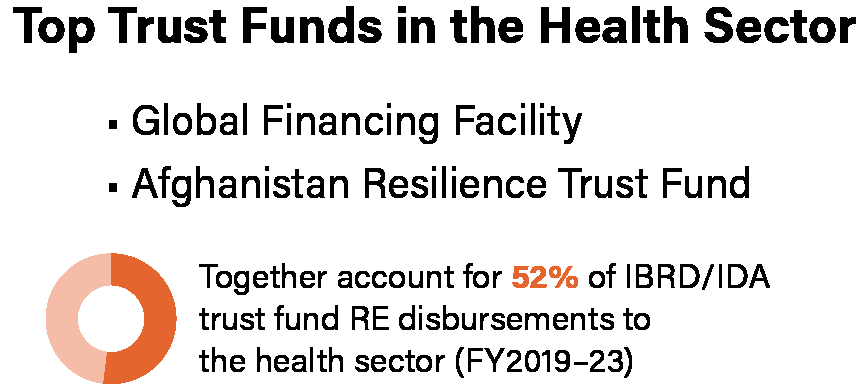

**Image 4 OCR + Description:**
```
**Image Description:**
The image is a close-up shot centered on a person's hands preparing a syringe with a vaccine or medication from a small vial. The person is wearing a blue protective gown, a face mask, and a transparent face shield, suggesting a healthcare or medical setting. 

Key elements include:
- The hands holding the syringe and vial are in sharp focus.
- The syringe needle is inserted into the vial cap, drawing liquid.
- The background is blurred, emphasizing the action of filling the syringe.
- The face mask and face shield partially obscure the person's face.

There is no visible text within the image.

This image visually represents medical preparation and vaccination, suitable for an annual development report section related to healthcare, vaccination programs, or medical advancements.
```


## Page 32
3. Strengthening Pandemic Prevention, Preparedness, and Response  |  23
When the COVID-19 pandemic struck in 2020, the 
World Bank mounted the fastest and largest financial 
response in its history to help countries respond to, and 
recover from, the crisis. Working together, the global 
community brought the pandemic under control, but 
not before it led to nearly 7 million reported deaths9 and 
total expected economic losses estimated at nearly 
$14 trillion through the end of 2023.10 The recovery 
has been highly uneven, leaving behind some of the 
poorest countries.
As of June 30, 2023, the World Bank committed $270 
billion of financial support to help public and private 
sector clients overcome the wide-ranging health and 
socio-economic impacts of the COVID-19 pandemic. 
The Bank’s response has helped to save lives, protect 
poor and vulnerable people, maintain education 
continuity, ensure sustainable business growth and 
job creation, and strengthen policies, institutions, and 
investments. The COVID-19 crisis has also spurred 
collective action to augment the existing global health 
security financing system and to mobilize additional 
resources to build health systems and strengthen 
capacity for pandemic prevention, preparedness, 
and response.
To that end, the Bank facilitated the creation of a 
new FIF, the Pandemic Fund, in September 2022. 
It provides a dedicated stream of additional, long-
term financing to strengthen pandemic prevention, 
preparedness, and response capabilities in low 
and middle-income countries through investments 
and technical support at the national, regional, 
and global levels. The fund raised $2 billion in seed 
capital from 25 donors and issued its first call for 
proposals in February 2023. The World Bank brought 
its convening power, knowledge, and experience to 
leading the development and operationalization of the 
Pandemic Fund at record speed, collaborating with 
G20 members and beyond, the WHO, and a variety 
of other stakeholders, including MDBs, global health 
institutions, and civil society. The Bank hosts the 
Pandemic Fund’s secretariat, and serves as trustee 
and one of the fund’s implementing entities.
This new Pandemic Fund and other trust funds and FIFs 
have played important roles in the Bank’s COVID-19 
pandemic response and larger efforts to strengthen 
health systems. Between fiscal 2019 to 2023, IBRD/
IDA trust funds disbursed $1.2 billion of RE grants 
toward pandemic prevention, preparedness, and 
response. These disbursements peaked in fiscal 2021 
during the height of the COVID-19 pandemic (Figure 
3.1) and surpassed health-related RE disbursements 
that year. This is because the World Bank’s response 
to the COVID-19 pandemic extended beyond health-
related activities, and still does.  
A key contributor is the Health Emergency 
Preparedness and Response Umbrella Program 
(HEPR), established by the World Bank in June 
2020 to help countries respond to the pandemic 
and prepare for future health emergencies. During 
its first two years, HEPR mobilized $211 million in 
resources and allocated $126 million through June 
2023 to support 45 country and regional efforts 
in health emergency preparedness and response. 
These resources have co-financed IDA investments, 
provided funds to countries not eligible for IDA 
resources, supported regional efforts to strengthen 
cross-border health emergency preparedness, and 
created a global effort to build the evidence needed 
to identify the most impactful health emergency 
preparedness and response efforts.
To save lives, for example, HEPR helped the Solomon 
Islands extend its COVID-19 vaccine deployment 
efforts to hard-to-reach areas in its archipelago of 
six major islands and more than 900 smaller islands. 
The HEPR grant provided funds to purchase boats, 
vehicles, and safety equipment to reach remote 
communities, and to conduct a communication 
and advocacy campaign to combat misinformation 
about COVID-19 vaccines. To help prepare for future 
pandemics, HEPR funding has enabled countries 
in Eastern Africa to strengthen their internal health 
systems and create more effective cross-border 
surveillance and response networks. In just nine 
months in 2022, the completeness and timeliness 
9 WHO. August 9, 2023. “WHO Coronavirus (COVID-19) Dashboard.” WHO.
10 World Bank. 2023. Preventing, Preparing for, and Responding to Disease Outbreaks and Pandemics: Future Directions for 
the World Bank. Washington, D.C.: World Bank.


## Page 33
3. Strengthening Pandemic Prevention, Preparedness, and Response  |  24
of priority disease reporting increased from 10 to 90 
percent in Malawi, 30 to 60 percent in Rwanda, and 68 
to 90 percent in Tanzania.
To protect the poor and most vulnerable, trust 
funds have financed social protection programs to 
ease some of the economic losses that households 
experienced during the COVID-19 pandemic. For 
example, three trust funds—the Trust Fund for 
Gaza and West Bank (WBGBK), the Palestinian 
Umbrella for Resilience Support to the Economy 
(PURSE), and the Middle East and North Africa 
Region Umbrella MDTF—financed the Emergency 
Social Protection COVID-19 Response Project, 
which provided cash transfers to more than 95,000 
vulnerable households in the West Bank and Gaza. 
This project also supported a cash-for-work program, 
which 
helped 
non-governmental 
organizations 
(NGOs) provide temporary jobs to 4,000 people, 85 
percent of whom were women.
To 
ensure 
sustainable 
business 
growth 
and 
job creation, the Iraq Reform, Recovery and 
Reconstruction 
Fund 
(I3RF) 
supports 
the 
IBRD’s COVID-19 Adaptation and Recovery Pilot 
(CARP). The project seeks to expand financial 
inclusion through non-bank financial institutions 
to revitalize Iraq’s economy post-pandemic and 
strengthen long-term resilience within its financial 
ecosystem. Comprehensive sector analysis, advice 
on regulatory reforms, and targeted assistance to 
microfinance institutions have made it easier for 
struggling businesses to access crucial financial 
resources. The project also empowers small 
businesses and entrepreneurs through grants 
and mentorship.
Figure 3.1. IBRD/IDA Trust Fund RE Disbursements for Health and 
Pandemic Activities, Fiscal 2019–2023 ($ Millions)
One of the nicest things about 
CARP is that we work with the 
Iraqi business community directly 
without mediators.
— Mustafa Rifaat, Project Implementation Unit, Deutsche 
Gesellschaft für Internationale Zusammenarbeit (GIZ)


**Image 1 OCR + Description:**
```
$ Millions

700

600

500

400

300

200

100

FY19

Health

FY20 FY21 FY22 FY23

lm Pandemic prevention, preparedness, and response activities

120%

100%

80%

60%

40%

20%

Share of Total RE Disbursements

**Image Description:**
The image is a bar chart that displays data over five fiscal years (FY19 to FY23). It appears to be part of an annual development report. The chart uses two vertical axes:

- Left vertical axis labeled "$ Millions," ranging roughly from 0 to 700, representing monetary values.
- Right vertical axis labeled "Share of Total RE Disbursements," ranging from 0% to 120%, representing percentage shares.

The horizontal axis lists the fiscal years: FY19, FY20, FY21, FY22, and FY23.

Two categories of data are represented by bars:

1. **Health** (colored blue)
2. **Pandemic prevention, preparedness, and response activities** (colored orange)

For each fiscal year, there are two bars side-by-side representing these categories. The numerical values in millions of dollars are displayed above each bar in corresponding colors.

Details by fiscal year:

- FY19:
  - Health: $311 million
  - Pandemic prevention, preparedness, and response activities: $5 million
- FY20:
  - Health: $359 million
  - Pandemic prevention, preparedness, and response activities: $58 million
- FY21:
  - Health: $442 million
  - Pandemic prevention, preparedness, and response activities: $643 million
- FY22:
  - Health: $387 million
  - Pandemic prevention, preparedness, and response activities: $148 million
- FY23:
  - Health: $
```
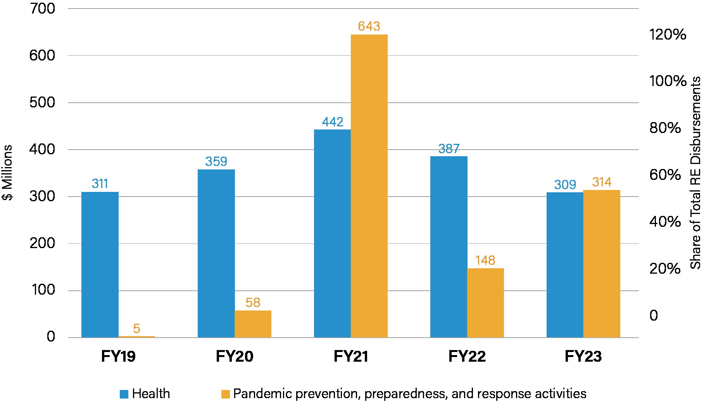

## Page 34
3. Strengthening Pandemic Prevention, Preparedness, and Response  |  25
To help countries strengthen their policies, 
institutions, and investments to foster long-term 
recovery, the Korea-World Bank Partnership 
Facility (KWPF) funded analytical work to help 
countries in Latin America and the Caribbean 
region better respond to the COVID-19 pandemic. 
The study compared the policy responses of 10 
countries in the region with South Korea and 
Uruguay, two high-performers in the first stages 
of the pandemic. A practical guide on developing 
and implementing proactive, population-based 
COVID-19 
testing 
was 
produced, 
as 
were 
two real-time analytical dashboards for safe 
economic reactivation in Colombia and Peru. 
The research also informed a regional report on 
using wastewater-based epidemiology to enhance 
pandemic  surveillance capabilities.
3.1 Improving Health Systems 
and Regional Cooperation 
Immediate COVID-19 response measures have largely 
given way to longer-term investments in pandemic 
prevention and preparedness. This comprises many 
elements, including strong and resilient health 
systems, particularly for primary care, to facilitate 
the detection of disease outbreaks, provide essential 
care, and support the deployment of vaccines and 
other medical countermeasures. The COVID-19 crisis 
laid bare long-standing weaknesses in pandemic 
preparedness in many countries, especially low and 
middle-income countries. World Bank trust funds bring 
technical knowledge, advice, and analysis to countries 
to help them strengthen their national systems and 
regional cooperation. 
The Bank’s work on pandemic preparedness 
involves One Health, a collaborative approach that 
brings animal, environmental, and public health 
sectors together to prevent, detect, respond to, and 
recover from infectious diseases. With support from 
Food Systems 2030, the World Bank is focused on 
embedding the One Health approach across the 
institution and in regions worldwide. This includes 
Central Asia, where advisory and analytical work 
underpinned the One Health Framework for Action, 
which aims to contribute to pandemic preparedness, 
with priority given to zoonoses, antimicrobial 
resistance, and food safety. The framework also 
Photo: Ministry of Health, The Solomon Islands


**Image 1 OCR + Description:**
```
| tbe

vyeees

**Image Description:**
The image depicts a group of people gathered on a small boat near a muddy shore with traditional thatched wooden houses on stilts in the background. 

Key elements:
- The group includes a mix of adults and children, with adults mostly standing and children sitting or standing in the boat.
- Two men in the center of the boat are shaking hands and appear to be part of an official or formal event.
- Three adults in the back are wearing bright yellow life vests, and one adult in a red polo shirt is also standing.
- The children are in casual clothing, and many of them are looking at the camera.
- There are colorful balloons tied to the back of the boat with text reading "2023" visible on them.
- One of the adults in the center is wearing a white shirt, possibly a uniform.

There is no visible text other than the "2023" on the balloons. The image likely aims to represent community development or a livelihood project related to water transport or fishing as part of an annual development report.
```
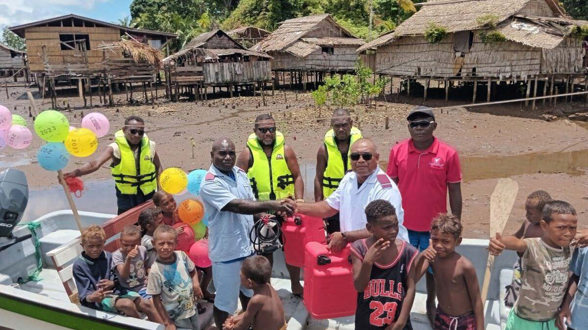

## Page 35
3. Strengthening Pandemic Prevention, Preparedness, and Response  |  26
provides an investment roadmap for the region 
still struggling with the economic impacts of the 
COVID-19 pandemic. In November 2022, five Central 
Asian countries signed a joint communiqué agreeing 
to adopt the framework, including establishing 
governance structures and engaging in joint resource 
mobilization, data sharing, and preparatory work to 
implement national and regional activities.
The One Health Framework for 
Action provides an excellent 
opportunity for accelerating the 
operationalization of the One 
Health approach in Central Asia 
and strengthening regional and 
cross-sectoral collaboration.
— Peter Sousa Hoejskov, Technical Officer on Food Safety 
and Zoonotic Diseases, WHO
Overall, countries with universal and progressive 
health coverage were better equipped to mitigate the 
negative consequences of the COVID-19 pandemic. 
Côte d’Ivoire, for example, was able to draw on an 
ongoing IDA project and technical assistance from 
the Global Financing Facility for Women, Children 
and Adolescents (GFF) that had rolled out a 
universal health coverage program to make services 
more affordable to communities. Between 2019 and 
2021, over 3.5 million individuals were enrolled in 
the health insurance program, representing an 89 
percent increase in three years. Beginning in 2020, 
the government targeted individuals working in the 
informal sector, many of them women, by encouraging 
them to register for an insurance card. This also 
helped mitigate the financial impacts of the COVID-19 
pandemic. By the end of 2021, 20 percent of all insured 
individuals were informal sector workers.
Egypt had just embarked on a path toward universal 
health coverage before the COVID-19 outbreak. 
Experiences during the pandemic underscored 
the benefits that would flow if Egypt could broaden 
access to safe and quality health care. IFC used the 
MENA Private Sector Development Trust Fund to 
launch the Egypt Health Quality Advisory Program 
to support private health care service providers 
across the country in enhancing patient safety 
practices and upgrading their quality assurance 
systems. The project has assessed and advised 100 
health care facilities across 15 governorates, which 
have used recommendations to improve processes 
and training to meet national and international 
accreditation standards.
IFC trust funds11 have also assisted local governments 
in assessing their response to COVID-19 to identify 
challenges and successes, lessons learned, and 
ways to future-proof their response capacity. In the 
Philippines, for example, Quezon City was one of 
the worst-affected cities due to its high population 
density, poor urban communities, inadequate health 
infrastructure, and limited government capacity. 
The IFC health advisory team 
visit was useful. They helped 
us identify, measure, and 
assess areas for performance 
improvement and helped build 
staff capabilities through their 
comprehensive training program 
for quality managers.
— Mahmoud Mourad, Quality Manager, 
Rofayda Hospital, Egypt
11 The trust funds involved were the Korea-IFC Partnership Program and the Australia Department of Foreign Affairs and Trade 
(DFAT)-IFC Global Advisory Services Trust Fund.


## Page 36
3. Strengthening Pandemic Prevention, Preparedness, and Response  |  27
Photo: IFC
The Quezon City COVID-19 Advisory Support 
Project identified the need to invest in better data 
management and reconfigure the city’s COVID-19 
testing and vaccination response to address broader 
public health needs. The Quezon City government 
validated the assessment results and is taking on 
recommendations. 
World Bank research funded by the Canada-
Caribbean Resilience Facility (CCRF) has garnered 
lessons learned on pandemic preparedness and 
responsiveness in the Caribbean, particularly on 
COVID-19 vaccine acceptance and uptake. Eight 
out of 20 countries in the region were still below 
a 50 percent vaccination rate as of March 2023. 
Phone and social media surveys conducted across 
multiple countries revealed distrust and concerns 
around the risks of vaccines with few perceived 
benefits. The research has led to several knowledge 
products documenting the challenges of COVID-19 
vaccine deployment in Caribbean countries and 
recommendations for improving community outreach 
and vaccine promotion strategies.
3.2 Promoting Local Markets 
and Manufacturing 
Through its private sector arm, IFC, the World 
Bank invests in initiatives to build up local vaccine, 
pharmaceutical, and health-related manufacturing 
capabilities in emerging markets to strengthen 
domestic capacity to prepare for and respond to future 
pandemics. IFC projects aim to improve the quality 
and accessibility of health products and help clients 
seize economic opportunities in medical equipment 
and pharmaceutical production. 
In particular, the IFC-led Global Health Platform 
(GHP) has helped countries respond quickly to 
COVID-19 disruptions in the short-term and continues 
to drive long-term change in the health sector. The 
platform generated close to $2 billion in investment 
commitments, including $600 million mobilized from 
a diverse set of financiers, to develop local health 
supply chains. With funding from donors,12 the GHP 
has delivered advisory services to address gender 
disparities in the health care professions, improve 
12 The IFC trust funds involved were the United Kingdom-IFC Global Advisory Project on Personal Protective Equipment 
Trust Fund, the Norway Global Health Platform Trust Fund, and the Comprehensive Japan Trust Fund.


**Image 1 OCR + Description:**
```
**Image Description:**
The image shows a group of around 27 people posing in a semi-formal setting, likely a conference or workshop room. The group consists of men and women, most of whom are holding certificates, suggesting they are participants who have completed a program or training. 

Layout and Key Elements:
- People are arranged in two rows: a seated row in front and a standing row behind.
- A white projector screen is centrally positioned behind the group.
- In front of the group is a table covered with a white tablecloth, on which a projector is placed.
- The room has large windows with white curtains letting in natural light.
- Two blue and white banners stand on either side of the group, displaying the IFC logo and related text.
- The ceiling features an ornate black chandelier.

Text on Banners:
Left banner heading: "IFC HEALTHCARE QUALITY ADVISORY PROGRAM"
Right banner headings (repeated multiple times):
- "IFC"
- "International Finance Corporation"
- "A member of the World Bank Group"

The certificates held by participants also feature the IFC logo. This image most likely documents the conclusion of an IFC healthcare quality advisory program, showing the graduates with their certificates as part of an annual development report.
```
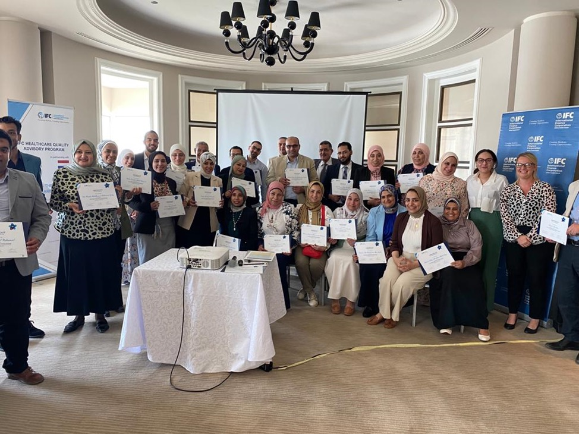

## Page 37
3. Strengthening Pandemic Prevention, Preparedness, and Response  |  28
care providers with better quality assurance practices 
are more attractive investment targets for financiers. 
The EPiHC project seeks to build transparent, resilient 
health systems through a set of shared principles for 
ethical decision making and behavior.
3.3 Facilitating FIF 
Contributions
The response of the international development 
community to the COVID-19 pandemic has benefitted 
greatly from the large-scale contributions of health-
related FIFs to save lives and protect the most 
vulnerable. FIFs have contributed not only to the 
immediate crisis response by delivering vaccines and 
other health supplies to millions of people around 
the world, but also to strengthening health systems 
and enhancing preparedness for future pandemics. 
In addition to creating the new Pandemic Fund in 
September 2022 and facilitating its development 
and launch in record speed, the World Bank provides 
indispensable 
administrative, 
operational, 
legal, 
and financial services to the following FIFs, which 
are making important contributions to COVID-19 
health responses.
The 
Coalition 
for 
Epidemic 
Preparedness 
Innovations (CEPI) brings together public and 
private sector entities, philanthropies, and civil 
society organizations to develop vaccines to stop 
future epidemics. The World Bank serves as a limited 
financial trustee. CEPI supports the world’s largest 
portfolio of COVID-19 vaccines and is the only public 
sector funder of research and development that has 
systematically leveraged its investments to enable 
equitable access to vaccines, guaranteeing access 
to doses for the COVID-19 Vaccines Global Access 
(COVAX) initiative. Working through the World Bank 
and other partners, COVAX distributed almost 2 billion 
doses of COVID-19 vaccines to 146 countries by 
November 2022. CEPI continues to invest in the next 
generation of vaccines against COVID-19 variants and 
other coronaviruses.
access to quality health care, accelerate digital 
transformation in health care and pharmaceutical 
companies, expand and diversify medical equipment 
manufacturing, and develop financing options for 
medical equipment acquisitions.
For example, GHP trust funds enabled technical 
advice to seven private sector clients in Africa, Asia, 
and the Middle East on manufacturing masks, gowns, 
and other personal protection equipment (PPE). IFC 
advised manufacturers on PPE production standards, 
connected them to potential buyers and global PPE 
procurement efforts, and shared market analysis. 
The program also served as a global platform to 
share knowledge on PPE, including global and 
regional market trends, international standards and 
certifications, PPE waste and circularity, PPE fit for 
women health care workers, and workers’ health and 
safety during PPE production.
The trust-funded Africa Medical Equipment Facility 
(AMEF) supports the acquisition of medical equipment 
by smaller health care enterprises, including hospitals, 
clinics, pathology laboratories, diagnostic imaging 
centers, and medical equipment distributors in 
Cameroon, Côte d’Ivoire, Kenya, Rwanda, Senegal, 
Tanzania, and Uganda. AMEF’s client banks have 
approved the first six medical equipment loans. In 
partnership with the Government of Norway and 
under the umbrella of the GHP, IFC also launched the 
Women’s Leadership in Private Healthcare working 
group, which brings together senior women leaders 
from 17 health care organizations in Africa, East Asia, 
and the Middle East and North Africa to identify and 
address barriers to women’s leadership in the field.
IFC’s efforts to raise standards in private health care 
include work on the Healthcare Quality Assessment 
Tool and the Ethical Principles in Health Services 
(EPiHC), both supported by donors through the 
GHP. The Healthcare Quality Assessment Tool aims 
to increase access to safe and quality health care by 
improving quality assurance processes and practices 
of health care providers. This also contributes to 
increased investment in health care facilities as health 


## Page 38
3. Strengthening Pandemic Prevention, Preparedness, and Response  |  29
The International Finance Facility for Immunization 
(IFFIm) issues vaccine bonds in capital markets 
(backed by binding pledges from donor countries) 
that provide immediate funding for Gavi, the Vaccine 
Alliance, to purchase and distribute vaccines. With 
the World Bank serving as treasury manager to 
enable these transactions, IFFIm has played a critical 
role in frontloading donor pledges to help fund the 
purchase of COVID-19 vaccines. Since the start of 
the pandemic, IFFIm has disbursed $980 million to 
Gavi for the COVAX, as well as $272 million to Gavi for 
vaccine development. 
The World Bank is also the trustee of the Global 
Fund to Fight AIDS, Tuberculosis and Malaria. 
Over the span of 20 years, the Global Fund has 
invested more than $55.4 billion across 100 countries 
to save 50 million lives and reduce the combined 
death rate from these three diseases by more than 
half in the countries where it invests. The Global 
Fund’s COVID-19 response amounted to $5 billion 
that supported 109 countries and 22 multi-country 
programs, by procuring medical supplies and 
protecting front-line health workers with training 
and PPE.
The COVID-19 pandemic caused the worst disruption 
to education in decades, leading to prolonged 
school closures and exacerbating the learning 
crisis and human capital development challenges. 
The Global Partnership for Education (GPE), 
for which the World Bank is the trustee, host, and 
largest implementing entity, provided approximately 
$500 million in accelerated funding and COVID-19 
grants to help partner country governments plan and 
implement emergency responses. Funding focused 
on preventing the negative impacts of COVID-19 
on education, ensuring continued learning for 
children, preventing the spread of COVID-19 in and 
through schools, and supporting vulnerable groups, 
especially girls. 
Photo: Ezra Acayan / World Bank


**Image 1 OCR + Description:**
```
**Image Description:**
The image shows a scene of a vaccination process. The layout centers around two main subjects: a healthcare worker administering a vaccine injection to a seated woman.

Key elements:
- The woman on the left is wearing a black shirt, a face mask, and a clear plastic face shield. She is seated and has her sleeve rolled up as she receives the vaccine.
- The healthcare worker on the right is dressed in blue protective clothing, including a surgical cap, face mask, glasses, and a face shield. The worker is holding a syringe injecting the woman.
- In the background, other seated individuals are also being attended to in a similar manner.
- There is a sign behind them with text in capital letters. The visible text reads: "VACCIN... (PAGPAPABAKUNA)." The partial word "VACCIN..." likely stands for "Vaccination," and "PAGPAPABAKUNA" is a Filipino term relating to vaccination.

The environment appears clinical and organized, with a blue cooler box and sanitizing products visible behind the subjects, reinforcing the vaccination center setting. The image conveys a message of public health efforts and vaccination development as part of an annual development report.
```
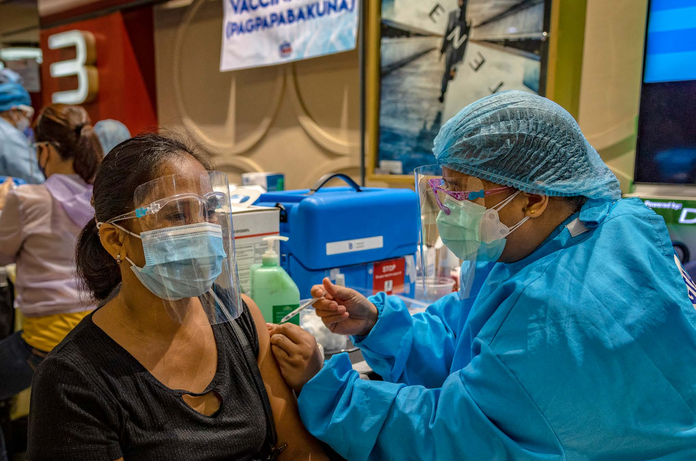

## Page 39
4. Responding to Fragility, Conflict, and Violence  |  30
Responding to Fragility, 
Conflict, and Violence
4
Photo: Natalia Cieslik / World Bank


**Image 1 OCR + Description:**
```
Shared Commitment to Action

Cash contributions to
$22.3B |BRD/IDA trust funds
$4.9 B soared in fiscal 2023,
‘ reflecting partners’ support
for World Bank activities in
Fy2022 FY2023 FCV-affected states

**Image Description:**
The image consists of a simple bar chart and accompanying text. 

Layout:
- At the top, there is a bold heading: "Shared Commitment to Action."
- Below the heading, on the left side, are two vertical bars representing cash contributions for financial years 2022 and 2023.
- The bar for FY2022 is light pink and labeled with a value of "$4.9 B."
- The bar for FY2023 is a deeper pink or red and taller, labeled with a value of "$22.3 B."
- An upward curved arrow connects the first bar to the second, indicating a significant increase.
- To the right of the bar chart is a block of text providing context for the data.

Text Content:
- The text reads: "Cash contributions to IBRD/IDA trust funds soared in fiscal 2023, reflecting partners’ support for World Bank activities in FCV-affected states."

Key Elements:
- The title emphasizes a shared commitment.
- Visual emphasis on the sharp increase from FY2022 to FY2023 in cash contributions.
- Explanation highlights the purpose of the contributions, specifically World Bank activities in fragile, conflict, and violence (FCV)-affected states.

The image effectively uses a simple bar graph and concise text to communicate the substantial growth in financial contributions and the context behind it.
```
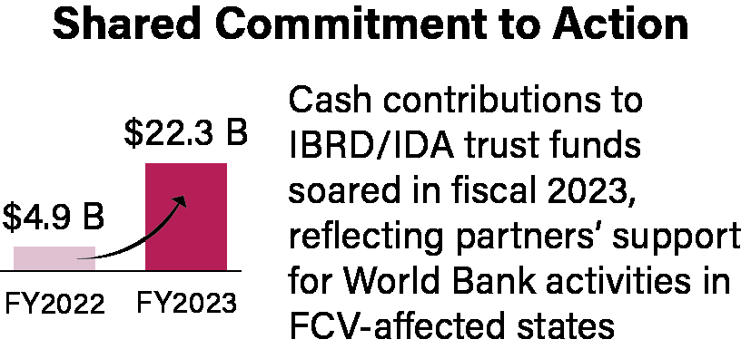

**Image 2 OCR + Description:**
```
Targeted Support for Those
Most in Need

80% of all IBRD/IDA trust fund RE
disbursements supports fragile states

FT

Na
7 <€

7 I XN

Po

93% of disbursements focuses on 5 states

« Ukraine « Ethiopia
« Afghanistan « Mozambique

« West Bank and Gaza

IBRD/IDA trust fund RE disbursements to
FCV-affected states (FY2019-23)

**Image Description:**
The image is a section from an annual development report focused on "Targeted Support for Those Most in Need." 

Layout and Key Elements:

- Title: Positioned at the top in bold, large font, reading "Targeted Support for Those Most in Need."
- Highlighted Statistic: Below the title, in large bold font, "80%" is emphasized in a dark magenta color. The text continues in black, stating, "of all IBRD/IDA trust fund RE disbursements supports fragile states."
- Visual Bar: Beneath the statistic is a horizontal bar in dark magenta with a light magenta segment at the end. The left portion of the bar has a white icon resembling four arrows pointing inward to a central point, symbolizing focus or concentration.
- Further Statistic: Below the bar, another bold percentage, "93%," also in dark magenta, indicates "93% of disbursements focuses on 5 states."
- List of States: The five states receiving focused disbursements are listed in two columns with bullet points:
  - Left column: Ukraine, Afghanistan, West Bank and Gaza
  - Right column: Ethiopia, Mozambique
- Footnote: At the bottom in smaller font, it reads, "IBRD/IDA trust fund RE disbursements to FCV-affected states (FY2019–23)," indicating the fiscal years covered.

Color Scheme:

- The report section uses dark magenta for highlighting key percentages
```
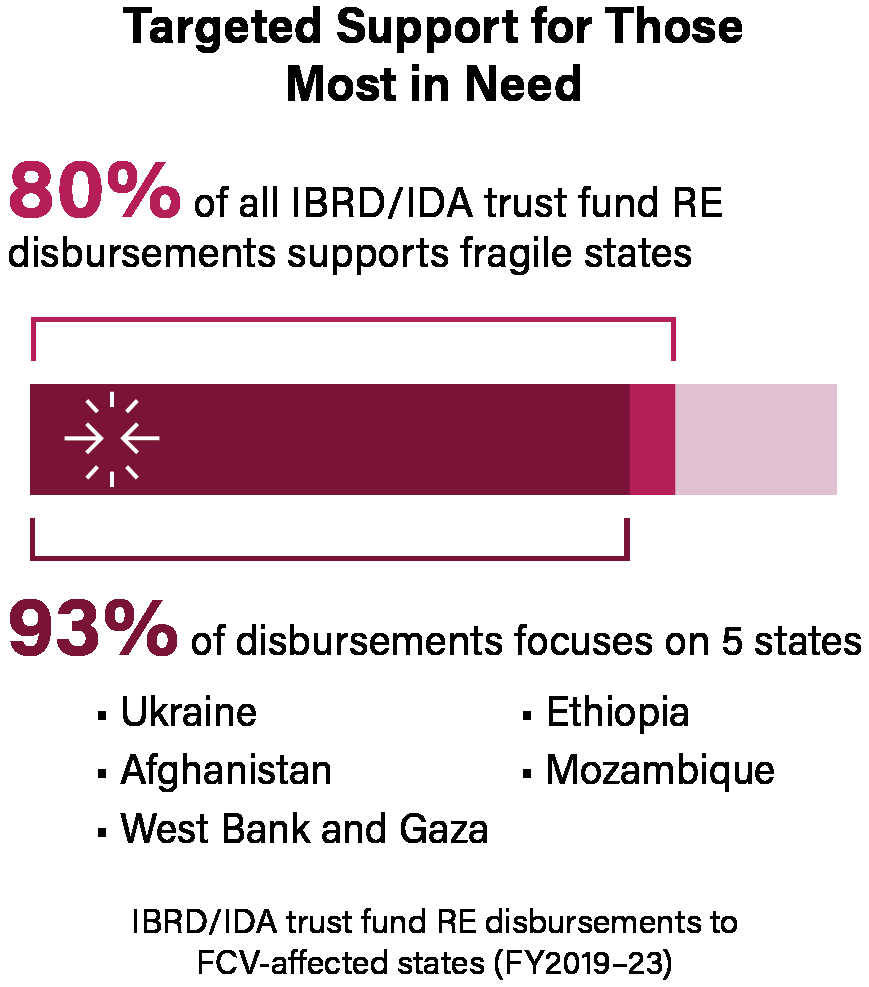

**Image 3 OCR + Description:**
```
**Image Description:**
The image shows a street scene in what appears to be a developing or underdeveloped area. 

Layout and Key Elements:
- Foreground: Two young children walk away from the camera, side by side. The older child has their arm around the younger child, suggesting care or protection. Both children are dressed in casual clothing, with the older one wearing a checkered jacket and jeans, and the younger one in a colorful sweater and blue pants.
- Middle ground: The road is unpaved and dusty, with some scattered rocks and debris on the side. 
- Left side: There is a pile of rubble and bent metal rods, possibly remnants of construction or demolition.
- Background: Several unfinished or dilapidated buildings are visible, including one with water tanks on the roof. Utility poles and wires stretch across the scene.
- Sky: Clear blue with no clouds.

There is no visible text in the image. The overall atmosphere suggests a community in a state of rebuilding or economic hardship, which fits with themes that could be part of an annual development report focused on infrastructure, community welfare, or humanitarian conditions.
```
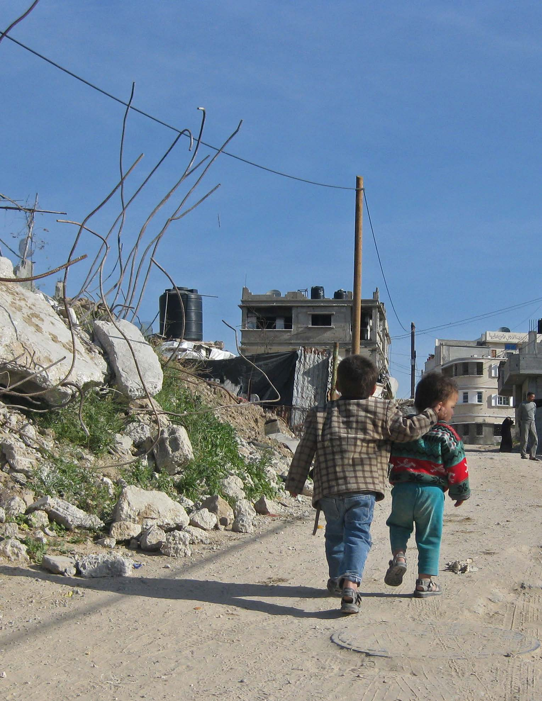

## Page 40
4. Responding to Fragility, Conflict, and Violence  |  31
By 2030, nearly 59 percent of the world’s extreme poor 
will live in countries affected by fragility, conflict, and 
violence (FCV). This sobering projection reveals the 
challenges extend well beyond Russia’s invasion of 
Ukraine, fighting in Sudan, and other headline news. 
Rising inequality, lack of opportunity, discrimination, 
and exclusion fuel the spike in violent conflict seen 
across the world since 2010. Governments often lack 
the capacity or will to manage risks, thus making 
institutions and people more vulnerable to economic 
shocks, natural disasters, and global challenges and 
regional spillovers, such as the COVID-19 pandemic 
and the influx of refugees from war-torn areas. As 
conflicts continue across the globe, the number of 
people displaced by them has reached record levels. 
Of the more than 108 million forcibly  displaced persons 
worldwide, an estimated 76 percent are hosted in low 
and middle-income countries, often by communities 
facing their own socio-economic challenges.13
Responding to fragility, conflict, and violence is key 
to attaining the SDGs and a priority of the World 
Bank, as articulated in its 2020–2025 FCV Strategy. 
A record $30 billion in financing for FCV-affected 
countries was approved in December 2021 under 
IDA’s 20th replenishment to meet diverse challenges 
in the poorest countries. The World Bank’s response to 
hotspots like Afghanistan and Ukraine has been rapid 
and effective, with trust funds playing key roles. 
Following Afghanistan’s abrupt change in government 
in August 2021, the Afghanistan Resilience 
Trust Fund (ARTF), formerly the Afghanistan 
Reconstruction Trust Fund, has enabled the World 
Bank to provide over $1 billion in off-budget support 
to deliver essential food, livelihood, health, water, 
and education services to the Afghan people and 
to build the capacity of local NGOs and civil society 
organizations. The World Bank’s new funding 
modality channels funding through United Nations 
agencies and the Aga Khan Foundation to implement 
all operations. These activities aim to address 
basic services and pave the way for development 
in Afghanistan's complex environment. ARTF also 
supports on-the-ground surveys, data collection, and 
analytics that give the Afghan people a voice and help 
shape the international community’s humanitarian-
development response in this FCV context. 
Since Russia’s invasion of Ukraine in February 2022, 
the World Bank and other development partners 
have mobilized more than $37.5 billion for Ukraine 
through June 30, 2023, of which over $19.5 billion 
has been disbursed through IBRD/IDA trust funds. 
While trust funds consistently devote a large share of 
their resources to projects in countries on the World 
Bank’s official list of fragile and conflict-affected 
situations, RE disbursements for FCV-affected states 
climbed to 94 percent of total RE disbursements in 
fiscal 2023, largely due to support for Ukraine (Figure 
4.1). RE disbursements for FCV-affected states from 
fiscal 2019–23 totaled $25.3 billion and 77 percent of 
this went to Ukraine through standalone trust funds 
for the country’s economic recovery (Figure 4.2).
This huge increase from previous years’ disbursements 
reflects the shared commitment of the World Bank 
and development partners to support Ukraine through 
urgent repair projects and coordination with the 
government for recovery and reconstruction. These 
figures also show that trust funds have been a vehicle 
of choice to deliver fast-disbursing, targeted funding 
where it is needed most. Immediately after Russia’s 
invasion began, the World Bank established two 
multi-donor trust funds in fiscal 2022 to provide $2.5 
billion in grant co-financing to two Bank operations: 
the Financing of Recovery of Economic Emergency 
(FREE) Ukraine Supplemental DPO, approved in March 
2022, and the Public Expenditures for Administrative 
Capacity Endurance (PEACE) in Ukraine Project, 
approved in June 2022.
13 UNHCR. June 2023. UNHCR Global Trends 2022. UNHCR. 


## Page 41
4. Responding to Fragility, Conflict, and Violence  |  32
Figure 4.1. IBRD/IDA Trust Fund RE Disbursements for 
FCV-affected States, Fiscal 2019–23 ($ Millions)
Figure 4.2. Top IBRD/IDA Trust Fund Programs Supporting RE Activities 
in FCV-affected States, Fiscal 2019–23 ($ Millions)


**Image 1 OCR + Description:**
```
$ Millions

v

18,000
16,000
14,000
12,000
10,000
8,000
6,000
4,000
2,000
0

ug Ukraine

100%

94%

90%

IT, 80%

70%

60%

45% 48% 50%

40%

30%

20%

10%
a a a |_| 0%

FY19 FY20 FY21 FY22 FY23

mAfghanistan m West Bank and Gaza m Other FCV States ==FCV Share of Total RE Disbursement

Share of Total RE Disbursements

**Image Description:**
The image is a combination bar and line graph illustrating financial disbursements over five fiscal years: FY19, FY20, FY21, FY22, and FY23.

**Layout & Key Elements:**
1. **Axes:**
   - The vertical axis on the left measures disbursements in millions of dollars, ranging from 0 to 20,000.
   - The vertical axis on the right measures the share of total RE disbursements as a percentage, from 0% to 100%.
   - The horizontal axis shows fiscal years: FY19 to FY23.

2. **Bar Chart:**
   - Bars are stacked, representing disbursements to four categories: Ukraine, Afghanistan, West Bank and Gaza, and Other FCV (Fragile, Conflict, and Violence-affected) States.
   - The colors for each category are:
     - Blue: Ukraine
     - Orange: Afghanistan
     - Green: West Bank and Gaza
     - Yellow: Other FCV States.
   - The bars show a notable rise in FY22 and a significant surge in FY23, with Ukraine representing the majority of the disbursement in these last two years.

3. **Line Chart:**
   - A dark blue line plots the "FCV Share of Total RE Disbursement" percentages alongside the bar chart.
   - Data points are labeled with percentages for each year:
     - FY19: 45%
     - FY20
```
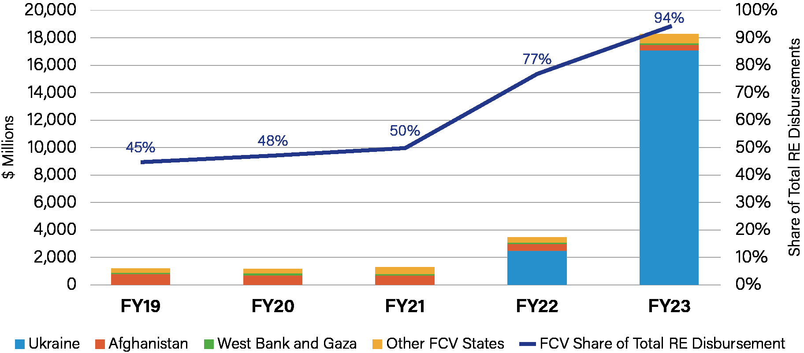

**Image 2 OCR + Description:**
```
West Bank and Gaza Global Partnership
for Education

$350, 196 $325, 1%
Global Financing

Other Trust Fund Facility
Program $258, 1%
$1,984, 8%

Afghanistan Resilience
Trust Fund

$2,898, 12%

Ukraine Standalone
Trust Funds for
Economic Recovery

$19,521, 77%

**Image Description:**
The image is a donut chart showing the distribution of funds across different trust funds and programs. The layout includes a circular chart with colored segments, each corresponding to a specific fund or program, and labels with corresponding dollar amounts and percentage shares positioned outside the chart with lines pointing to their segments. 

Key elements and information include:

- The largest portion of the chart is colored purple, representing "Ukraine Standalone Trust Funds for Economic Recovery," which accounts for $19,521 or 77% of the total.
- The second-largest portion is orange, labeled "Afghanistan Resilience Trust Fund," representing $2,898 or 12%.
- A yellow segment corresponds to the "Other Trust Fund Program" with $1,984 or 8%.
- A green segment for the "West Bank and Gaza Trust Fund," representing $352 or 1%.
- A blue segment labeled "Global Partnership for Education," showing $325 or 1%.
- A small maroon segment for the "Global Financing Facility," with $258 or 1%.

The text uses varying colors that match the chart segments to identify the amount and percentage for each fund, making it easy to visually associate the data with the chart. The image is part of an annual development report, presumably showing funding allocation or contributions across these different trust funds and programs.
```
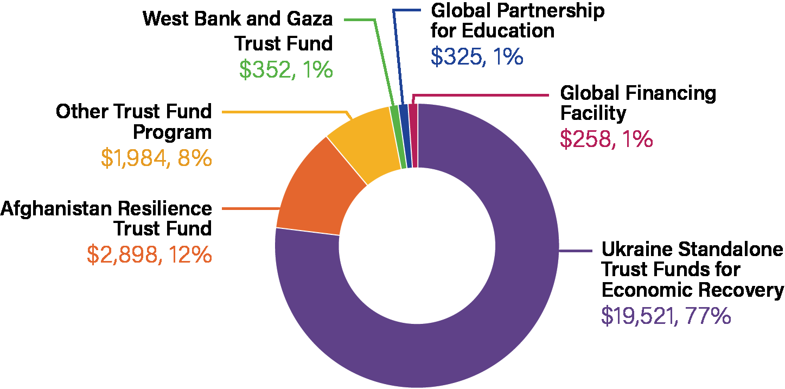

## Page 42
4. Responding to Fragility, Conflict, and Violence  |  33
The FREE operation provided an immediate platform 
for the Bank to work with Ukraine’s development 
partners and mobilize additional resources on top of 
$484 million in IBRD financing, including $134 million 
backed by guarantees. Bilateral donors (Austria, 
Denmark, Iceland, Latvia, Lithuania, Norway, the 
United Kingdom, and the United States) contributed 
grant financing for an additional $1.2 billion through 
the FREE Multi-donor Trust Fund within two 
weeks of Russia’s invasion.14 Together, $2.25 billion in 
emergency budget financing was mobilized to 
help meet the immediate social and fiscal needs 
precipitated by the invasion. 
The PEACE project has raised $19.7 billion in World 
Bank and trust fund resources to sustain support for an 
estimated 13 million Ukrainians. The bulk, $17.9 billion, 
has already been disbursed, benefitting 10 million 
pensioners, 500,000 education employees, 145,000 
government employees, 56,000 first responders, and 
over 3 million social assistance beneficiaries and 
internally displaced people. 
In December 2022, the World Bank launched the 
Ukraine Relief, Recovery, Reconstruction and 
Reform Trust Fund (URTF) for Ukraine’s immediate 
repairs and recovery efforts. The trust fund has received 
contributions and pledges from Austria, Canada, 
Iceland, Japan, Latvia, Lithuania, the Netherlands, 
Norway, Sweden, and Switzerland totaling $1.1 billion. 
The URTF is a coordinated financing and support 
mechanism to assist the Government of Ukraine in 
sustaining its administrative and service delivery 
capacity, conducting relief efforts, and planning 
and implementing its recovery, reconstruction, and 
reform agenda. 
The World Bank has since established the Multi-Donor 
Resources for Institutions and Infrastructure 
(MRII) Facility to coordinate IBRD, IFC, and MIGA 
efforts for Ukraine. The PEACE project and the 
URTF now fall under the MRII Facility, as does IFC’s 
Economic Resilience Action (ERA) program and other 
initiatives that allow donors to help Ukraine address 
its immediate needs to sustain key public services, the 
private sector, and wider recovery and reconstruction. 
The MRII takes a phased and multi-pronged approach 
to mobilizing financing and coordinating resources 
through guarantees, co- and parallel financing, and 
other financial instruments. 
4.1 Addressing the Drivers 
of FCV
The Bank supports countries at every stage of fragility, 
working to prevent violent conflict and interpersonal 
tensions before they turn into full-blown crises, but 
also remaining engaged during conflict and crisis 
to preserve hard-won development gains, protect 
essential institutions, and build resilience so countries 
are set on the course for recovery. Trust funds help 
enable this work with resources to tackle the root 
causes of FCV in various contexts and promote peace 
and stability.
In particular, the State and Peacebuilding Fund 
(SPF) is the World Bank’s leading global trust fund for 
implementing the Bank’s FCV Strategy. SPF provides 
catalytic financing to help address drivers of fragility, 
prevent conflict, activate rapid crisis response, and 
build long-term resilience. SPF’s mandate is to innovate 
and push the frontiers of the Bank’s engagement in 
FCV situations through activities that can be scaled 
and mainstreamed. SPF provides seed funding for 
pilots, tools, and analytical work that inform larger 
World Bank projects. 
For example, SPF funded a Survivor-centered 
Accessibility Framework Evaluation (SAFE) along 
migratory routes in Central America. The research 
has helped to fill knowledge gaps about the violence 
women and girls experience in their home countries 
and during their journeys along common migratory 
routes, thereby influencing World Bank operations 
on safe migration and survivor services for migrant 
women in Central America.
14 Japan made a parallel loan in the amount of $600 million.


## Page 43
4. Responding to Fragility, Conflict, and Violence  |  34
In Iraq, funding from the Japan Social Development 
Fund (JSDF) mobilizes youth as agents of change for 
building more peaceful societies. The project fosters 
the socio-economic inclusion of conflict-affected 
youth ages 15–29 through entrepreneurship and 
youth-led community development activities. Over 
3,330 young people, half of whom are women, have 
received psychosocial support and soft skills training, 
and several trainees have gone on to receive micro-
entrepreneurship startup capital and coaching. 
Somalia has also benefited from trust fund financing 
to promote peace and improve citizen confidence by 
rebuilding state functionality. The Somalia Country 
Engagement Program co-finances a $130 million 
IDA project that supports the Federal Government 
of Somalia and eligible Federal Member States in 
strengthening resource management systems, an 
inter-governmental fiscal framework, and service 
delivery systems in health and education after years 
of off-system, off-budget donor financing for these 
services. It has also fostered key policy reforms for 
state-building and enabled budget transparency and 
citizen engagement activities. 
The 
Global Water Security and Sanitation 
Partnership (GWSP) has helped Somalia improve 
rural water supply. Decades of low investment had 
left water points in pasture lands scarce, claimed by 
clans, and intrinsically linked to resource conflict. Over 
the past five years, the GWSP has helped transform 
how the World Bank works in Somalia by developing 
capacity and political capital, resulting in over 360,000 
people benefiting from improved water sources and 
a portfolio of World Bank grants to the water sector 
totaling $102 million.
The project is helping us foster 
policy reforms and nurture the 
basics of federalism.
— Abdirahman Dualeh Beileh, former Minister of Finance 
(2017–2022), Somalia
To help Zimbabwe address accountability and 
transparency 
challenges 
and 
increase 
citizen 
confidence in the use of public resources, the 
Bank launched the Public Finance Management 
Enhancement Project with financing from the 
Zimbabwe Reconstruction Fund (ZIMREF). From 
2016–2021, the project contributed to enhancing 
fiscal discipline, strategic allocation of resources, 
and service delivery efficiency, through strengthened 
systems, procedures, citizen engagement, and 
targeted capacity building. The project, together with 
other analytical work, established the foundation for 
future reforms to promote economic stability and 
inclusive growth in Zimbabwe. In 2023, the ZIMREF 
was restructured and rebranded as the Zimbabwe 
Socio-Economic Transformation Fund (ZISET), 
a country-specific umbrella program that will 
support the implementation of Zimbabwe’s National 
Development Strategy 2021–25.
FIFs also make important contributions to addressing 
the drivers and impacts of FCV and strengthening 
resilience, 
especially 
for 
the 
most 
vulnerable 
and marginalized populations. For example, the 
World Bank hosts the secretariat and serves as an 
implementing entity for the Global Agriculture 
and Food Security Program (GAFSP). It works to 
build resilient and sustainable agriculture and food 
systems in low-income countries, in times of crisis 
and beyond. With co-financing from GAFSP, the West 
Africa Food System Resilience Program will support
the second phase of Burkina Faso’s National Rural 
Sector Program targeting 125 communes in nine 
regions chosen for their high agricultural potential
and favorable climate conditions. It is part of the 
broader regional effort to increase agricultural 
productivity 
through 
climate-smart 
agriculture, 
promote intraregional value chains and trade, and 
build capacity to manage agricultural and food 
insecurity risks.


## Page 44
4. Responding to Fragility, Conflict, and Violence  |  35
4.2 Easing the Impact of 
Forced Displacement 
Russia’s invasion of Ukraine has caused the fastest-
growing refugee crisis in Europe since the end of 
World War II. Globally, an estimated 108 million people 
have been forcibly displaced from their homes, either 
internally in their countries or externally as refugees.15 
Some of these displaced people face the prospect of 
never being able to return home. Given the protracted 
nature of forced displacement, the global community 
has combined humanitarian assistance with longer-
term development financing to help refugees become 
more self-reliant so that they can contribute more to 
their own futures and their host communities.
During the last five years, IBRD/IDA trust funds have 
disbursed $844 million to help countries address 
issues related to forced displacement (Figure 4.3). 
More than 90 percent of these resources went to five 
15 UNHCR. June 2023. UNHCR Global Trends 2022. UNHCR.
countries, with Afghanistan absorbing nearly half, 
followed by Türkiye, Jordan, Lebanon, and Ethiopia. 
In fiscal 2023, Global Concessional Financing 
Facility (GCFF) disbursed $9 million to Lebanon to 
address the protracted economic and social crises 
in the country and the Port of Beirut explosion 
in 2020, in addition to the influx of refugees from 
neighboring Syria.
RE disbursements for activities that address forced 
displacement peaked at 11 percent of total RE 
disbursements in fiscal 2020 largely due to support 
for Türkiye, which hosts the largest number of 
refugees in the world (Figure 4.3). The European 
Commission–World Bank Partnership Program on 
Europe and Central Asia (EEPP) provided a €45.5 
million grant to implement the Türkiye Employment 
Support for Syrians under the Temporary Protection 
and 
Turkish 
Citizens 
project. 
This 
effort 
has 
demonstrated ways to integrate refugees into 
Photo: Dominic Chavez / World Bank


**Image 1 OCR + Description:**
```
**Image Description:**
The image shows a vast refugee camp with numerous white tents and prefabricated shelters densely packed over a wide area. The tents have the "UNHCR" logo branded on them, indicating the United Nations High Commissioner for Refugees' involvement in the camp setup. There are utility poles and water tanks visible among the tents, highlighting some infrastructure present in the camp.

In the foreground, a man is interacting with three children, two of whom are standing close to the man while another smaller child stands slightly behind them. The expressions and body language suggest a moment of connection and care within the challenging environment.

The background reveals a dry, barren landscape with a distant settlement far beyond the refugee camp. The sky is overcast, adding a muted tone to the scene.

There is no additional visible text other than the "UNHCR" logo on the tents. The overall layout emphasizes the scale of the camp and the human aspect within it, making it fitting for an annual development report focused on humanitarian efforts or refugee assistance programs.
```
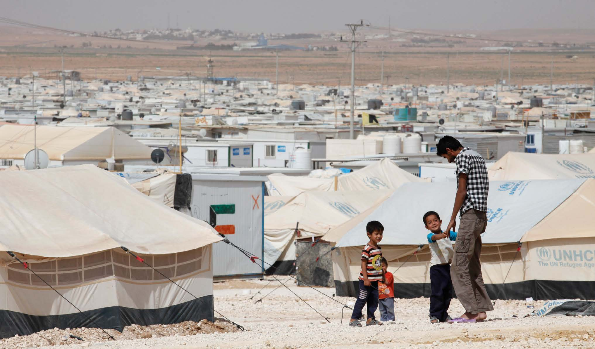

## Page 45
4. Responding to Fragility, Conflict, and Violence  |  36
formal markets and promote employment in host 
communities even during times of crisis. Nearly 38,000 
people in four Turkish provinces—more than half of 
whom were Syrian refugees—benefited from a range 
of employment programs and services, and over 
18,000 Syrian refugees and Turkish citizens were able 
to obtain formal jobs. Overall, more than 70,000 
refugees and nearly 5.8 million Turkish citizens 
registered and benefited from job counseling services.
We take care of our needs by 
ourselves. Earning your own 
money and spending it for your 
family is a unique feeling. I go 
home and my kids welcome me. 
What more could one ask for?
— Nour Alhuda Osman, Syrian beneficiary and garment 
factory worker, Adana, Türkiye
To increase the socio-economic integration of forcibly 
displaced people in the Middle East and East Africa, 
the World Bank worked with the Netherlands, the 
International Labour Organization (ILO), UNICEF, and 
UNHCR to establish the PROSPECTS Partnership 
on Jobs and Education for Forcibly Displaced Persons 
and Host Communities. In 2022, PROSPECTS helped 
IFC launch the StartMashreq program in Iraq, Jordan, 
and Lebanon with startup accelerator Flat6Labs.16 
The program aims to develop a virtual education and 
incubation platform to support startups and address 
the policy and regulatory barriers to their growth and 
scale-up. Promoting entrepreneurship in the region 
is expected to have a domino effect on creating 
opportunities for young, displaced, or otherwise 
marginalized groups.
Jordanian hosts and Syrian refugees seeking jobs 
also benefit from FIF financing from the Global 
Concessional Financing Facility (GCFF). It co-
finances a $400 million joint IBRD and IDA project that 
has contributed to aligning donors and development 
Figure 4.3. IBRD/IDA Trust Fund RE Disbursements for Activities 
Addressing Forced Displacement, by Country, Fiscal 2019–23 ($ Millions) 
16 Flat6Labs also received support from a United Kingdom trust fund, Financial Support of a Program of Advisory Services 
Relating to Flat6Labs (UK-FCO-EGYPT-F6L).


**Image 1 OCR + Description:**
```
$ Millions

300

250

200

150

100

50

FY20

u Afghanistan

@ Turkiye

28

FY21

mu Jordan

FY22

m Other Countries

FY23

**Image Description:**
The image is a stacked bar chart presented in a horizontal layout, showing financial data in millions of dollars ($ Millions) across five fiscal years (FY19 to FY23). 

### Layout and Elements:
- **Vertical Axis (Y-axis):** Represents dollar amounts in millions, ranging from 0 to 300.
- **Horizontal Axis (X-axis):** Represents fiscal years, labeled FY19, FY20, FY21, FY22, and FY23.
- **Bars:** Each fiscal year has a stacked bar divided into four color-coded segments representing different countries or groups:
  - **Orange:** Afghanistan
  - **Green:** Turkiye
  - **Yellow/Orange:** Jordan
  - **Purple:** Other Countries
- **Numerical values:** Inside or next to each segment of the bars indicating the exact amount in millions for that segment.

### Data values for each fiscal year:
- **FY19:**
  - Afghanistan: 106
  - Turkiye: 54
  - Jordan: 8
  - Other Countries: 12
- **FY20:**
  - Afghanistan: 102
  - Turkiye: 119
  - Jordan: 30
  - Other Countries: 25
- **FY21:**
  - Afghanistan: 75
  - Turkiye: 47
  - Jordan: 1
  - Other Countries: 41
- **FY22:**
  - Afghanistan:
```
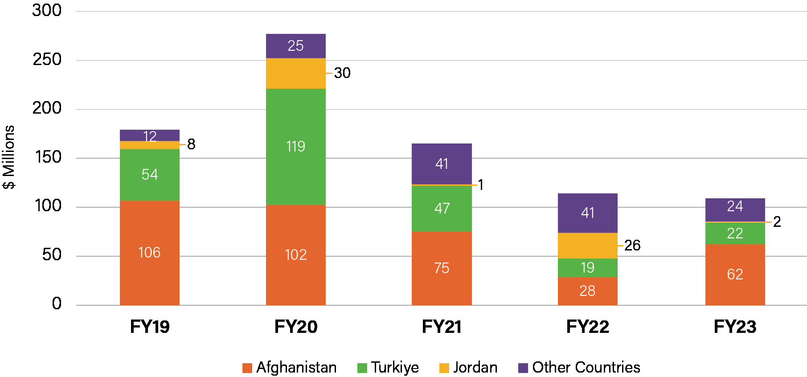

## Page 46
4. Responding to Fragility, Conflict, and Violence  |  37
partners’ activities toward formalizing the Syrian labor 
force and easing Syrians’ access to jobs. Under the 
Economic Opportunities for Jordanians and Syrian 
Refugees project, the number of work permits 
issued to Syrians increased from 45,000 in 2019 to 
62,000 in 2022 and currently stands at 77,000. Jordan 
was also the site for the Mashreq Gender Facility’s 
pilot program on increasing access to economic 
opportunities for displaced women. Supported by the 
Umbrella Facility for Gender Equality (UFGE), the 
pilot helped local municipalities understand and take 
regulatory action to address the gender barriers that 
displaced women face in the job market.
Another important focus area is education. Among 
the Syrian population in Lebanon, for example, 59 
percent of Syrian refugees ages 3–18 are not in 
formal schooling. The Lebanon Syrian Crisis Trust 
Fund (LSCTF) and the Results in Education for All 
Children Trust Fund (REACH) together provided 
$96 million in co-financing for a $100 million IDA 
project in Lebanon that has been instrumental 
in maintaining learning continuity despite the 
COVID-19 pandemic and other crises impacting 
the country, including teacher strikes. Performance-
based incentives and productivity allowances for 
public school teachers have helped these educators 
manage economic hardships and return to school to 
keep students learning.
In Colombia, a GCFF grant co-financed a $150 
million IBRD project, Improving Quality Healthcare 
Services and Efficiency, that helped increase access 
to health care for Venezuelan migrants. This first-
ever Program for Results (PforR) operation in 
Colombia provided grant financing to incentivize the 
government to incorporate a migrant and refugee 
The program is a recognition by 
the international community that 
Jordan is providing a global public 
good by hosting Syrian refugees 
and expanding their access 
to work.
— Omar Fanek, Director, Reform Secretariat, Ministry of 
Planning and International Cooperation, Jordan
perspective in the project, resulting in the affiliation of 
225,000 Venezuelan migrants into the social security 
system. This enabled them to access care during 
the pandemic, including vaccinations. A second-
generation health PforR is under consideration to 
increase migrants’ access to primary and mental 
health care, as well as specialized care for mothers, 
children, and HIV patients.
Moldova also hosts refugees displaced from Ukraine. 
To help Moldova mitigate the economic and social 
spillovers of Russia’s invasion of Ukraine, as well as 
build resilience and reduce vulnerabilities to future 
shocks, the World Bank partnered with key donors to 
establish the MDTF for Co-financing of the Moldova 
Development Policy Program. This $145 million trust 
fund seeks to bolster Moldova’s ability to implement 
its policy reform program. It complements IBRD and 
IDA commitments of $250 million for two Emergency 
Response, Resilience and Competitiveness DPOs 
and $34.2 million in grant commitments from 
the GCFF. A new umbrella program, Moldova – 
Growth, Resilience and Opportunities for Well-
being (M-GROW), is now under development and 
welcoming donor support for Moldova’s development 
toward European integration.
4.3 Forging Paths for 
Private Investment 
Even in high-risk environments, there are ways the 
private sector can help boost economic growth, 
livelihoods, and stability in fragile states. Trust funds 
support this work, demonstrating that like-minded 
donors and investors are willing to weather setbacks 
before clear progress is made.
For example, the IFC’s Africa Fragility Initiative (AFI) 
is a five-year $74 million program launched in 2021 to 
advance responsible private sector-led growth and 
job creation across 32 FCV-affected African countries 
where business costs are high, operational challenges 
formidable, and development needs great. AFI brings 
together the private sector and development partners 
to generate business development, identify local 
market champions, and improve the delivery of goods 
and services for potentially millions of people across 
the African continent. 


## Page 47
4. Responding to Fragility, Conflict, and Violence  |  38
Trust fund financing from AFI and the Global 
Agriculture and Food Security Program (GAFSP) 
Private Sector Window have helped Ethiopia advance 
its goal of establishing cooperative farming networks 
to foster economies of scale, higher quality products, 
and less fragmented supply chains. IFC advised 
Soufflet Malt Ethiopia, one of the leading investors in 
the malting sector, on expanding local sourcing. The 
project increased farmers’ access to improved seed 
varieties and established contract farming through 
aggregators and farmer financing models. By June 
2023, Soufflet’s annual purchase of grain from the 
local market was over 88,000 tons—more than double 
the project’s target—and the combined sales revenue 
of nearly 80,000 farmers increased to $87.5 million. 
Soufflet’s investment saves an estimated $50 million 
in imports per year for the country. 
In Nigeria, the IFC-managed multi-partner Facility 
for Investment Climate Advisory Services (FIAS)17 
funds the Upstream Special Economic Zone West 
Africa project, which advises the country on adopting 
and implementing legal, regulatory, and institutional 
frameworks for a competitive special economic zone. 
This will enable downstream private investments in 
health care, aeronautics, manufacturing, agribusiness, 
petrochemicals, and infrastructure while promoting 
greater economic opportunity for women.
17 FIAS activities are supported by the governments of Australia, Austria, Canada, Denmark, France, Ireland, Luxembourg, the 
Netherlands, Norway, Sweden, Switzerland, and the United States.
18 Under the CAFEF arrangements, when MIGA makes a call on the callable guarantee by providing notice of the amount 
and claim payment date to the donor once MIGA has made a claim determination, the donor is required to pay the required 
contribution to MIGA no later than 10 days prior to the claim payment date.
Thanks to the malt barley 
business, we can provide better-
quality food and clothing to 
our family. I am happy that I am 
sending [my children] to school to 
fulfill all their needs.
— Tadelech Hunde, Farmer, Ethiopia  
Improving gender equality in Nigeria’s private sector 
is the focus of IFC’s Nigeria2Equal program. With 
support from the Comprehensive Japan Trust Fund, 
the program has expanded local research and data 
with reports on the cost of bullying and harassment in 
Nigeria’s workplaces as well as gender gap analyses 
of the most capitalized companies on the Nigeria 
Exchange. The program has created a peer learning 
platform where 18 companies have made more than 
165 public commitments to implement solutions to 
reduce gender gaps in their businesses.
The World Bank also engages with the private sector in 
conflict-affected and fragile economies through MIGA, 
which provides coverage where other insurers are 
often not willing or unable to go. Three of MIGA’s five 
trust funds are focused on FCV settings, including the 
West Bank and Gaza Trust Fund. It was established 
in 1997 to encourage private sector investment and 
economic development in the West Bank and Gaza, 
by offering political risk insurance to both local and 
foreign investors. The West Bank and Gaza is not a 
member of the IMF, World Bank, or MIGA, so it is not 
eligible for their sources of financing. The trust fund 
is used to cover guarantees underwritten in the West 
Bank and Gaza for the full amount of the guarantee. 
The trust fund had an initial paid-up contribution of just 
over $15 million. As of April 30, 2023, its underwriting 
capacity was around $28 million, with the increase 
resulting from interest income, premiums, and returns 
on investments since its inception. It has supported 
the issuance of MIGA guarantees worth $45 million 
(gross) for 13 projects.
The Conflict-Affected and Fragile Economies 
Facility (CAFEF) was established in 2013 to support 
MIGA guarantees in the riskiest of FCV contexts. 
CAFEF provides an initial loss layer, which comprises 
a first and second loss layer of donor grants and 
a callable guarantee from donors.18 MIGA also 


## Page 48
4. Responding to Fragility, Conflict, and Violence  |  39
participates in the first loss layer alongside CAFEF 
to the extent determined by the agency. The initial 
loss layer provides protection from the initial losses 
occurring under MIGA’s Contract of Guarantee. Excess 
loss above the initial loss layer is borne completely 
by MIGA, and where applicable, its reinsurance 
partners. CAFEF’s success lies in the fact that it offers 
a high degree of leverage to its donors. As of April 30, 
2023, CAFEF had facilitated more than $1 billion in 
gross MIGA guarantee issuance, and its corpus was 
$68.7 million. 
In Ukraine, CAFEF supported MIGA in issuing a €100 
million capital optimization guarantee ($107 million) for 
one year and one day to Raiffeisen Bank International 
AG (RBI), a major banking and financial services 
group based in Austria. The guarantee covers equity 
investments in RBI’s subsidiary, Raiffeisen Bank Joint 
Stock Company (RBUA) in Ukraine, against the risk of 
expropriation of funds with respect to the mandatory 
cash reserves held at Ukraine’s central bank (NBU). 
Local banking regulations mandate that RBUA 
maintain reserves with NBU to be able to conduct 
operations in Ukraine. MIGA’s capital optimization 
guarantee reduces the risk weight applicable to those 
mandatory reserves at the RBI group level to zero, 
freeing up funds that RBUA can use to expand local 
lending to individuals, small businesses, and corporate 
clients in critical industries and increase the volume 
of essential non-credit banking operations. Additional 
RBUA lending enabled by the MIGA guarantee will 
bolster employment and stimulate economic activity.  
Given the heightened risks of operating in Ukraine, MIGA 
created the Support for Ukraine’s Reconstruction 
and Economy Trust Fund (SURE TF). Established 
in March 2023 with Japan’s anchor contribution of 
$23 million (expected to grow to $300 million through 
contributions from additional donors), SURE TF will 
be used as a first-loss layer or toward reinsurance 
for MIGA’s guarantees in the country. MIGA blends 
donor financing from the SURE TF with risk exposure 
on its own books and crowds in public and private 
reinsurance where available to issue guarantees in 
support of Ukraine.
Photo: Mulugeta Wolde / IFC


**Image 1 OCR + Description:**
```
PEEP tee pier Hy neice

**Image Description:**
The image layout features a rural landscape with a distant patchwork of agricultural fields on rolling hills under a clear blue sky. In the foreground, there is a woman standing on grassy land, dressed in a pink headscarf, a purple top, and a long skirt with blue, white, and beige patterns. She is positioned slightly off-center to the right and is looking toward the landscape.

Key elements in the image include:
- Expansive terraced fields on the hills, mostly in shades of brown and yellow, indicating cultivated or fallow land.
- Scattered trees and patches of greenery among the fields.
- The woman in traditional attire, providing a human element and scale to the rural scene.

There is no visible text within the image. The overall impression is one of rural life and agricultural development, suitable for an annual development report highlighting farming or rural community themes.
```
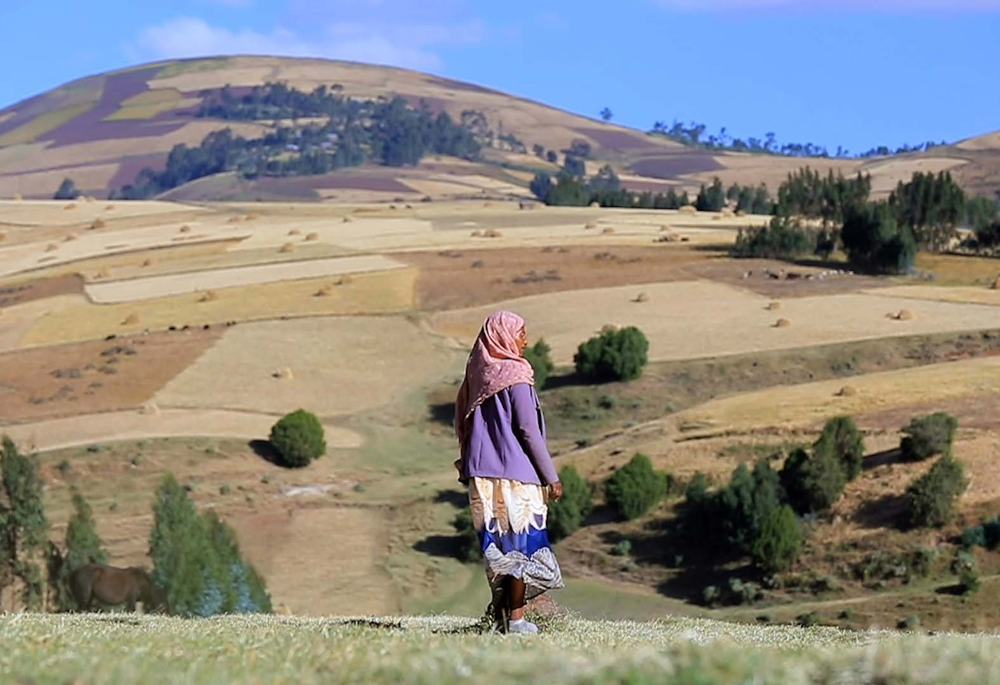

## Page 49
5. Building Financial Sustainability and Resilence  |  40
Photo: Hendri Lombard / World Bank
Building Financial 
Sustainability and Resilience 
5
The World Bank is committed to working with its 
partners to address the crises we face today—and 
to build for tomorrow.
— Akihiko Nishio, World Bank Vice President of Development Finance


**Image 1 OCR + Description:**
```
or

{

**Image Description:**
The image shows a crowded scene at a bus station or platform where people are waiting to board a bus. The setting is indoors with a green and white color scheme on the walls and ceiling. The upper part of the wall has horizontal slats for ventilation, and there are green emergency exit signs featuring a running figure and a downward arrow pointing to a door. 

Key elements include:
- Multiple people standing in a queue, including school children in uniform, adults, and a woman carrying a transparent container.
- Many people carry backpacks or handbags.
- A bus with open doors is visible on the left side.
- Some people are in motion, causing a blurred effect, especially a person walking across the foreground.
- The floor is tiled, and overall lighting suggests daytime.

There is no visible textual content directly on the image itself besides the emergency exit signs. The image conveys daily urban transit life and likely emphasizes themes such as public transport use, commuting, or urban mobility as part of an annual development report.
```
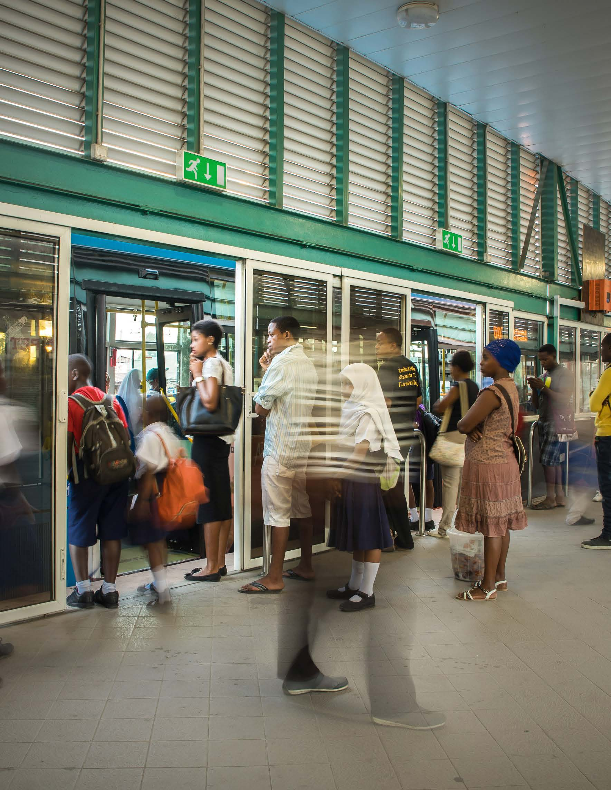

## Page 50
5. Building Financial Sustainability and Resilence  |  41
The COVID-19 pandemic and Russia’s invasion of 
Ukraine have collided to upend the fiscal and trade 
balances of many developing countries, undermining 
their financial stability and long-term growth 
prospects. The Financial Stability Board affirms that 
the current economic environment of high inflation, 
lower growth, and much tighter global financial 
conditions is particularly challenging for financial 
stability. The limited policy space in many jurisdictions 
makes it more difficult for authorities to intervene 
should a shock materialize.19
The forces that have powered growth and prosperity 
since the early 1990s have weakened, resulting in a 
persistent and broad-based decline in long-term 
growth prospects.20 Productivity, trade, labor force, 
and investment growth are expected to flag over the 
remainder of this decade. The World Bank’s latest 
projections indicate that the world economy will remain 
frail—and at risk of a deeper downturn—into 2024.21 
This unstable economic footing imperils the ability 
of emerging markets and developing economies to 
create jobs and deliver essential services, and it puts 
development goals further out of reach. 
The World Bank has long regarded strengthening the 
international financial architecture and enhancing 
developing countries' participation in the global 
trading system as global public priorities requiring 
global collective action.22 Today, the Bank’s support for 
financial sustainability and resilience has broadened 
beyond strengthening countries financial systems 
and macro-economic stability to include financial 
inclusion, access to finance, building effective 
and accountable institutions to tackle corruption, 
strengthening tax revenue generation and debt 
management, and improving financial resilience in 
response to natural disasters. 
Trust funds and FIFs support this effort, especially 
through advisory services, analytics, and other 
knowledge-based activities that build institutional 
and human resource capacity to effectively manage 
instability. They contribute to projects that increase 
access to finance, promote free and fair trade, and 
help developing countries join and compete in the 
digital economy.
5.1 Increasing Access 
to Finance 
Across developing countries, 131 million micro, 
small, and medium-size enterprises (MSMEs) have 
unmet financing needs estimated at approximately 
$5 trillion.23 In the financial services sector, women are 
disproportionately disadvantaged. While 76 percent of 
adults worldwide have a bank account, close to one-
third of adults—1.4 billion—still do not have one, and 
54 percent of all unbanked adults are women.24 The 
COVID-19 pandemic significantly impacted MSMEs as 
well as financial service providers serving the base of 
the pyramid, including microfinance institutions, non-
bank financial institutions, and MSME-focused banks. 
With the support of trust funds, the World Bank seeks 
to expand access to financial products and services 
to those who have historically been excluded from the 
banking system, particularly in IDA countries, including 
micro-borrowers, SMEs, women, home buyers, and 
farmers, among others.
19 Financial Stability Board. 2022. Promoting Financial Stability: 2022 FSB Annual Report. FSB. 
20 M. Ayhan Kose and Franziska Ohnsorge (eds.), Falling Long-Term Growth Prospects: Trends, Expectations, and Policies, 
Advance Edition, World Bank, 2023. 
21 World Bank. June 2023. Global Economic Prospects. Washington, D.C.: World Bank.
22 A communiqué of the Development Committee Ministers, dated September 25, 2000, established five global public priority 
areas for the Bank’s involvement, namely, (a) preserving the environment, (b) controlling communicable diseases, (c) 
strengthening the international financial architecture, (d) enhancing developing countries’ participation in the global trading 
system, and (e) creating and sharing knowledge relevant for development. A World Bank report for the Development 
Committee, dated September 28, 2007, subsequently reaffirmed these five priority areas.
23 SME Finance Forum. “MSME Finance Gap Data Site.” IFC and GPFI. 
24 World Bank. 2022. The Global Findex Database 2021. Washington, D.C.: World Bank.


## Page 51
5. Building Financial Sustainability and Resilence  |  42
For example, in Georgia, the EU2020 Knowledge 
and Advisory Services facilitated the design and 
implementation of a $103 million IBRD project that has 
strengthened the enabling environment for MSMEs to 
access finance post-pandemic. Policy dialogue and 
analytical reports prepared with trust fund financing 
paved the way for several important reforms, including 
the adoption of the new Law on Investment Funds 
and amendments to the Law on the Securities Market 
and the Law on Payment Systems and Payment 
Services. The work also helped launch reforms on 
fintechs, financial infrastructure, and insurance, and 
strengthened a partial credit guarantee program, 
which aims to address high collateral requirements 
and risk aversion of financial institutions to unlock 
financial intermediation to SMEs.
To facilitate access to finance for agri-MSMEs and 
small farmers in Central Europe, Austrian funding 
through FIAS supported IFC’s Central Europe 
Agriculture Finance Digital Platform in developing a 
digital gateway to address information asymmetry 
between lenders and small farmers. It consolidates 
finance, climate, pricing, and other information based 
on digital data. It also provides non-financial services 
and training on climate-smart solutions for farmers 
and agri-MSMEs.
Ukrainian refugees also have financial needs, but 
without proof of Ukrainian bank records or credit 
histories, they struggle to open bank accounts or obtain 
credit in host countries. Drawing on the partnerships 
and experiences of the Ukraine Financial Inclusion 
Credit Reporting project funded by donors,25 IFC 
launched the Digital Data Corridors initiative in 2022. 
The initiative uses existing Ukrainian and European 
credit information infrastructure and brings together 
credit information providers, financial institutions, and 
industry experts to allow financial institutions to receive 
international credit histories, identity verification, and 
bank transaction data electronically in real time. By 
the end of 2022, credit bureaus in the largest host 
countries for Ukrainians, including Poland, Czechia, 
and Moldova, were linked to the corridor, facilitating 
access to finance for Ukrainian refugees. 
This pioneering initiative will 
allow Ukrainian citizens to show 
the positive credit history they 
earned back home and build trust 
with a future employer and access 
finance from Moldovan banks and 
other financial institutions. 
— Silviu Foca, Director General, Biroul de Credit SRL
The challenge of accessing finance also extends to 
municipalities in Kazakhstan. Urban infrastructure 
is seen as a potential source of private investment 
to help expand basic services, but major regulatory 
obstacles to non-sovereign borrowing and public-
private partnerships put Kazakhstan’s cities at a 
disadvantage. Since 2020, the IFC trust-funded ECA 
Cities II Program26 has helped pave the way for reforms 
to Kazakhstan's municipal borrowing legal framework 
and piloting a commercial subnational financing 
solution. The government also amended the Budget 
Code to allow creditworthy local city governments to 
access long-term commercial finance for sustainable 
infrastructure projects.
25 The trust funds involved were the DFID Good Governance Fund (GGF)-IFC Advisory Services Trust Fund and the SECO-IFC 
Europe and Central Asia (ECA) Advisory Services Trust Fund.
26 The trust funds involved are the Austria-IFC Europe and Central Asia (ECA) Advisory Services Trust Fund and the SECO-IFC 
Global Advisory Services Trust Fund.


## Page 52
5. Building Financial Sustainability and Resilence  |  43
In January 2022, MIGA established the Fund for 
Advancing Sustainability (FAS) to deliver technical 
assistance to mitigate risks and improve development 
impacts relating to MIGA projects. FAS is deployed to 
support MIGA’s clients in its strategic focus, including 
climate, gender, fragility, and other vital areas, such 
as environmental and social standards and corporate 
governance. Through FAS, MIGA is able to address 
specific challenges for projects across all sectors, 
including agriculture, manufacturing, telecom, and 
infrastructure, to achieve sustained development 
outcomes. FAS is intended to complement MIGA’s 
existing capacity and make its product offerings more 
accessible, particularly for small and medium-sized 
investors. The Republic of Korea—the anchor donor 
for FAS—committed $3 million, of which $2 million has 
already been paid in.
The Women Entrepreneurs Finance Initiative 
(We-Fi) FIF hosted by the World Bank, works to 
break down barriers related to finance, market access, 
and capacity to empower women entrepreneurs in 
the developing world. In Bangladesh, for example, 
many women-led businesses have faced significant 
disruptions in supply and demand due to the COVID-19 
pandemic. With support from We-Fi, the World Bank 
implements the Corporate Connect Program jointly 
with local and international partners. The program 
educates and engages larger corporations to stimulate 
corporate sourcing from women-owned businesses in 
Bangladesh, and it champions regulatory reforms to 
sustain these market linkages. 
Funding from We-Fi and FIAS also contributes to an 
IFC project in Colombia that has helped Bancamia, 
the second-largest microfinance institution in the 
country, develop and pilot a plan to increase access 
to finance and banking services to forcibly displaced 
people from Venezuela, particularly women. As of 
June 2022, over 6,300 migrants and returnees have 
opened savings accounts or started lines of credit. 
The project’s success reflects the strong demand for 
access to finance among forcibly displaced people, 
and offers a model for replication in other refugee-
hosting countries.
Photo: Tahoor


**Image 1 OCR + Description:**
```
**Image Description:**
The image depicts a work environment inside an office with three people—two women and one man—working or discussing something around a desk.

**Layout and Key Elements:**

- The man is seated at the desk with a Lenovo computer monitor in front of him. He appears focused on the screen.
- The two women are standing on the left side of the desk, closely watching the computer screen. One woman is wearing an orange outfit with a patterned scarf, and the other is wearing a blue and green tie-dye top with a beige hijab.
- The desk is black with a light wood panel underneath. It holds several office items, including a black pen holder, sticky notes, a roll of yellow tape, a pink tape dispenser, a ceramic mug, and some papers.
- Behind them, there is a window with horizontal bars, letting natural light into the room. Outside the window, parts of a blue and white building are visible.
- To the right of the table, there is a white shopping bag with the word "Lajjoo’r" printed on it, along with the phrase "99% Pure."
- The room has plain white walls and is simple and uncluttered aside from the items on the desk and some bags or fabric items in the left corner.

**Text Contained:**

- The visible text is on the shopping bag: "Lajjoo’r" and "99% Pure."
- The computer monitor brand "Lenovo" is visible on the monitor.
```
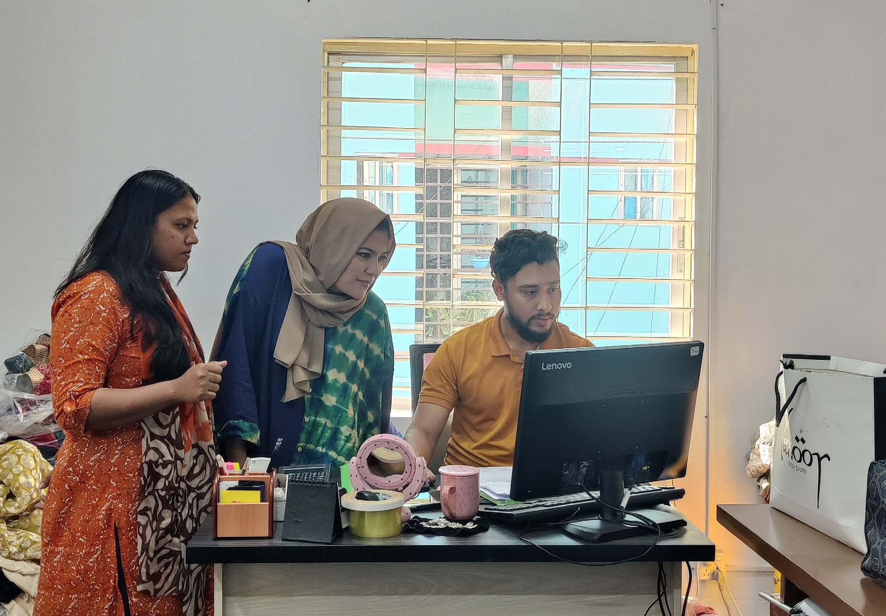

## Page 53
5. Building Financial Sustainability and Resilence  |  44
5.2 Boosting International 
Trade and Integration
International trade is a powerful driver of economic 
development, 
poverty 
reduction, 
and 
financial 
sustainability. Despite these benefits, critics blame 
globalization for losing manufacturing jobs in 
advanced economies, environmental degradation, and 
disruptions to supplies of vital goods, like vaccines. 
Increasing 
geopolitical 
tensions 
prompt 
major 
players to raise barriers to trade and investment and 
to subsidize domestic production of goods deemed 
strategic. The World Bank estimates that a slump in 
investor confidence could push 30–50 million people 
into poverty by 2030, depending on the severity of 
protectionist policies put in place by advanced and 
developing economies.27
Despite these trends, World Bank trust funds continue 
to help countries and communities participate in 
regional and global trading systems. For example, the 
Horn of Africa Umbrella supported the development 
of the East Africa Trade Facilitation Roadmap and its 
adoption by the Finance Ministers of Kenya, Ethiopia, 
Somalia, Djibouti, and South Sudan. The roadmap 
plots a course for coordinated public policy responses 
to development challenges that hamper economic 
growth in the region, and it underpins the Bank’s $325 
million East Africa Regional Trade Facilitation Project 
now under preparation.
Also in East Africa, the Umbrella Facility for Trade 
(UFT) provided technical assistance and capacity 
strengthening to the Government of Kenya to negotiate 
and assess the impacts of new trade agreements 
and changes in regional integration initiatives. This 
included re-negotiating the East African Community’s 
common external tariff, analyzing the economic and 
distributional effects of the African Continental Free 
Trade Area, and assessing the impacts of a free-
trade agreement with the United States. More than 
70 government staff members received training on 
modern trade agreement negotiations.
The Digital Development Partnership (DDP) 
contributes to the Western Africa Regional Digital 
Integration Program, the Bank’s flagship regional 
operation to increase broadband access and usage to 
advance the integration of digital markets in Western 
Africa. DDP funded research to enhance the design of 
program activities to promote financial sustainability 
and resilience of innovators and entrepreneurs in the 
region. Input from over 900 SMEs and 300 digital 
service providers across West Africa, as well as 
entrepreneurship support organizations, yielded useful 
insights into the key challenges within the regional 
digital ecosystem. Suggested solutions included a 
West Africa digital transformation fund to co-finance 
and accelerate regional SMEs’ digital transformation 
initiatives, a regional digital exchange to access 
technologies, and a range of regional knowledge 
exchange opportunities. 
27 World Bank. 2023. “Trade Has Been a Powerful Driver of Economic Development and Poverty Reduction.” Understanding 
Poverty Brief. World Bank.
Our negotiation teams have 
been able to draft policies that 
are so well written that, in our 
first meeting with the U.S. Trade 
Representative...they tipped their 
hats to us.
— Pauline Mcharo, Deputy Chief Negotiator, Kenya-U.S. 
Free Trade Agreement


## Page 54
5. Building Financial Sustainability and Resilence  |  45
Trust funds also help build the evidence base to 
solve issues related to remittances, which are vital 
for the global economy and millions of households 
worldwide. Remittance inflows to low and middle-
income economies reached $626 billion in 2022,28 
exceeding foreign direct investment and official 
development assistance. However, remittances often 
come at a high transaction cost for migrants and their 
families. With backing from the Financial Inclusion 
Trust Fund (FINC) and the Payment Systems and 
Remittances Trust Fund (PYMT), the World Bank's 
Remittance Prices Worldwide (RPW) database has 
collected quarterly data on remittance costs since 
2009, covering 367 remittance corridors. The RPW 
serves as the official reference for global remittance 
service cost reduction objectives and is used to track 
progress toward SDGs on remittance costs and to 
inform policy decisions. 
28 World Bank. November 2022. Remittances Brave Global Headwinds: Migration and Development Brief 37. Washington, D.C.: 
World Bank.
Photo: Sarah Farhat / World Bank
As governments and the private sector contend with 
the rising costs of finance, growing debt burdens, 
and increasing inflation, it becomes even more 
important to develop strong, well-regulated local 
capital markets that can promote more resilient and 
sustainable growth. Yet most developing countries 
lack the necessary preconditions for a healthy capital 
market: stable macroeconomic fundamentals, a sound 
banking system, a good institutional and regulatory 
framework, an efficient market infrastructure, and 
sufficient market size. In 2018, the World Bank and 
development partners launched the Joint Capital 
Markets Program (J-CAP) to bring together 
experts from across the Bank to deliver advisory 
services sequenced with investments to support the 
development of local debt and equity capital markets. 
J-CAP launched in 14 countries, including the West 
African Economic and Monetary Union (WAEMU). 


**Image 1 OCR + Description:**
```
0800 122 7)

**Image Description:**
The image features a smiling woman sitting on a chair with their left arm raised in a wave or greeting gesture. The woman is wearing a beige jacket over a red shirt and is positioned against a yellow wall.

Key elements in the image:
- The background wall is yellow with bold red text vertically spelling "MONEY."
- Behind the woman is a black poster displaying logos of various internet and TV service providers including DSTv, StarTimes, GOTv, Zuku, TVNext, and others.
- The poster also contains a helpline number "0 800 122 222" and a website URL "www.payway.ug".
- The overall setting suggests a friendly and welcoming atmosphere, likely in a service or retail environment related to financial or internet services.

The image's layout highlights the woman's positive expression in the foreground with vibrant signage and contact information, creating an engaging and informative scene, appropriate for an annual development report focusing on community engagement or service outreach.
```
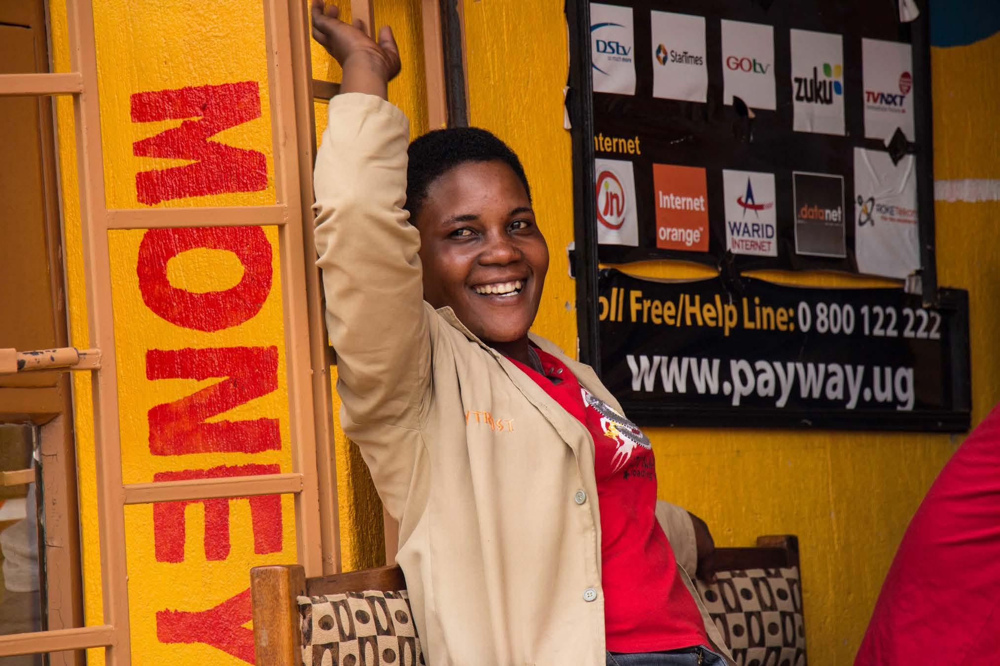

## Page 55
5. Building Financial Sustainability and Resilence  |  46
In West Africa, the program has focused on 
harmonizing the capital market environment across 
the eight WAEMU countries to expand the domestic 
institutional investor base and develop capital market 
instruments to increase real sector development. 
An improved regulatory framework, issued by the 
regional capital markets authority in January 2022 
with key assistance from J-CAP, enabled the creation 
of local private equity and venture capital funds, 
requiring them to direct at least 70 percent of their 
total investment portfolio to SMEs unlisted on stock 
markets. This will help channel investment capital to 
promising startups and young enterprises that are 
typically too risky for banks. 
5.3 Establishing Regional 
Catastrophe Risk Pools
Climate change and increasingly extreme weather 
events exacerbate the frequency and intensity of 
natural disasters, which have surged over the past 
50 years.29 According to the World Meteorological 
Organization (WMO), extreme weather and climate 
and water-related events caused nearly 12,000 
reported disasters between 1970 and 2021, with 
over 2 million deaths and $4.3 trillion in economic 
losses.30 The World Bank is a leader in establishing 
and managing designated facilities and trust funds to 
help countries respond to and recover from natural 
disasters. Regional risk insurance pools are a cost-
efficient means of enhancing countries’ financial 
sustainability and resilience, by providing short-term 
liquidity when an insurance policy is triggered by a 
catastrophic event. 
For example, the Global Shield Financing Facility 
(GSFF), formerly the Global Risk Financing Facility, 
helps to strengthen the financial resilience of 
pastoralists in the Horn of Africa—one of the poorest 
and most fragile regions in the world, with 50 million 
pastoralists among the most vulnerable. When 
drought hits, livestock either die or are sold at rock-
bottom prices. With support from the GSFF, Djibouti, 
Ethiopia, Kenya, and Somalia have come together to 
pool their drought risk through a regional institution, 
ZEP-RE, and transfer it to the insurance market. By 
March 2023, 159,000 pastoralists (about 1 million 
with dependents) were enrolled in the program 
with a package of drought index insurance, savings, 
digital accounts, and financial literacy. Over half of 
participants (57 percent) are women. The initiative 
also partners with the Consultative Group to Assist 
the Poor (CGAP) to ensure that the savings and 
insurance products meet the needs of women herders 
and service providers are incentivized to deliver.
Our cattle are like our bank 
account. When our livestock is 
affected by drought, it is like 
we have lost that account and 
we are hopeless. Since I joined 
the program and received the 
training, I can now afford to buy 
fodder for my animals.
— Asna Ware Deba, Pastoralist, Tana River County, Kenya
29 WMO. August 2021. “Weather-related disasters increase over past 50 years, causing more damage but fewer deaths.” 
Press releases. WMO.
30 WMO. “Atlas of Mortality and Economic Losses from Weather, Climate and Water Extremes.” Resources. WMO.


## Page 56
5. Building Financial Sustainability and Resilence  |  47
Countries in Central America and the Caribbean 
are also vulnerable to natural disasters, leading to 
human and economic losses that hinder economic 
growth. The COVID-19 pandemic and global inflation 
crisis have further strained the region's fiscal and 
financial systems, limiting their ability to prepare 
for and respond to future disasters. The Caribbean 
Catastrophe Risk Insurance Facility (CCRIF) 
provides affordable and high-quality catastrophe 
risk coverage and funds technical assistance to 
enable 
participating 
governments 
to 
improve 
disaster preparedness through comprehensive risk 
financing strategies. 
Photo: Vincent Tremeau / World Bank
Similarly, the Pacific Catastrophe Risk Insurance 
Company (PCRIC) was created to improve access 
to rapid, post-disaster finance for vulnerable Pacific 
Island countries as part of the G7-championed 
InsuResilience Global Partnership and with funding 
from the Pacific Catastrophe Risk Assessment and 
Financing Initiative MDTF. The PCRIC is a dedicated 
entity designed to provide disaster and climate-
related insurance to Pacific Island countries and build 
capacity in both the public and private sectors while 
helping to minimize the costs of premiums to support 
the development of disaster risk insurance markets. 
Before the PCRIC’s closure in fiscal 2023, it made full 
insurance payouts within 30 days of the occurrence of 
insured events, and the claims-paying capacity was 
enough to sustain a 1-in-200-year insured loss.


**Image 1 OCR + Description:**
```
**Image Description:**
The image features a close-up of a man standing behind a large animal with prominent horns, possibly a bull or a cow. The horns of the animal frame the man, appearing in the foreground with a blurred effect. The man is wearing a knit hat that partially covers his eyes and a worn brown vest over a patterned shirt. He has a piece of grass or straw in his mouth.

In the background, there are several other people, mostly out of focus, dressed in various traditional or rural attire, suggesting a communal or market setting. The overall mood is natural and earthy, with soft lighting.

There is no visible text in the image. The layout centers the man framed by the animal's horns, emphasizing a connection between the individual and livestock, which could resonate with themes in an annual development report related to agriculture, rural livelihoods, or pastoral communities.
```
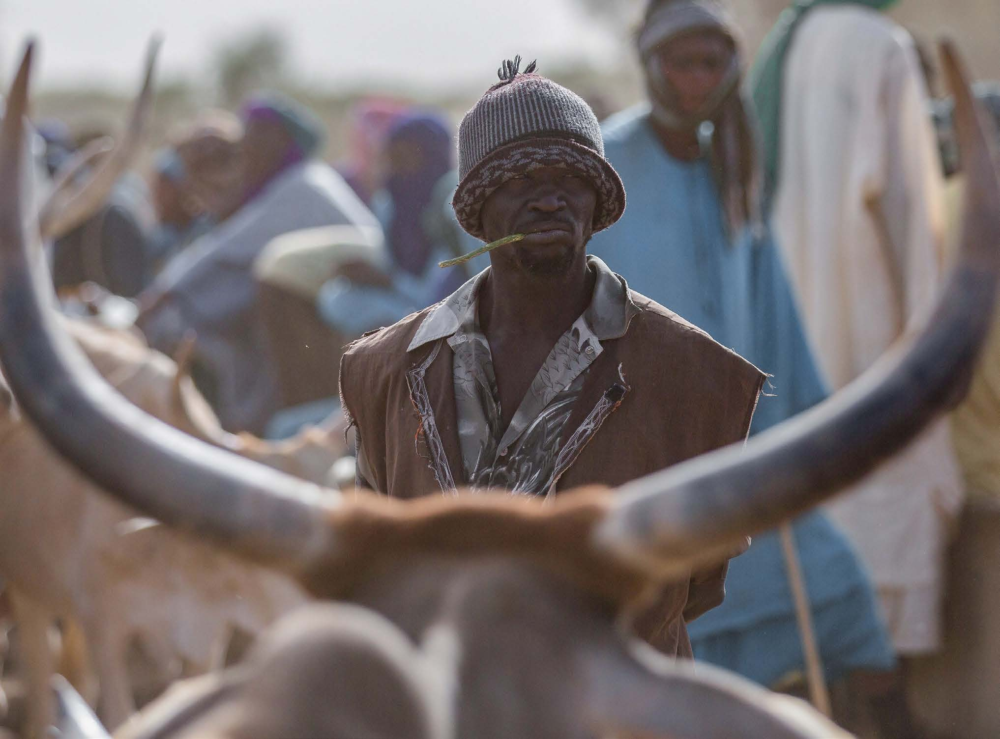

## Page 57
6. Financial Information of Trust Funds and FIFs  |  48
Financial Information of 
Trust Funds and FIFs 
6
This chapter provides aggregate financial information on the activities of trust funds and FIFs administered individually 
or jointly by IBRD, IFC, MIGA, and ICSID. It looks at five-year trends, from fiscal 2019–23, on trust fund and FIF 
inflows, outflows, and assets under management (Box 6.1)—all of which demonstrate the World Bank's position as 
the partner of choice to advance development agendas in countries, regions, and around the globe. Due to rounding, 
disbursements below $50 million are displayed as $0.00 million and other figures presented in this chapter may not 
add up to totals. 
Definitions of Key Financial Terms
Inflows are cash contributions to trust funds and FIFs, including encashment of 
promissory notes and cash receipts from donors. 
All contributions (cash and promissory notes, net of certain discounts) are reported 
using the historical FX rates at the date of receipt. Amounts to donor balance and 
holding accounts have been excluded. From fiscal 2017 onward, most contributors 
to the Global Fund provide contributions directly to its secretariat, and the trustee 
receives these funds as contributions from the Global Fund Secretariat as a contributor. 
Outflows are disbursements from trust funds and cash transfers from FIFs to 
implementing entities (World Bank excluded) for development activities. For 
accounting purposes, FIF transfers to the World Bank as an implementing entity are 
not included in FIF disbursements; instead, they are transferred and later recorded as 
IBRD/IDA trust fund disbursements.
Assets are funds held in trust (FHIT)—cash, investments, promissory notes—and 
contributions receivable at the end of the fiscal year. “Other” FHIT includes amounts 
held in escrow on behalf of the International Centre for Settlement of Investment 
Dispute (ICSID), donor balance accounts (DBA), balances on administration accounts, 
and unapplied receipts.
BOX
6.1
Photo: Climate Warehouse


**Image 1 OCR + Description:**
```
**Image Description:**
The image shows a landscape featuring multiple wind turbines spread across green fields with small clusters of trees. The shot is likely taken during the late afternoon or early morning, as indicated by the warm, angled sunlight casting long shadows. The turbines are arranged in a line extending into the distance, and a dirt path winds through the fields.

There is no text visible in the image. The layout focuses entirely on the natural and technological elements of wind energy generation, making it suitable for an annual development report, particularly one related to renewable energy or environmental sustainability.
```
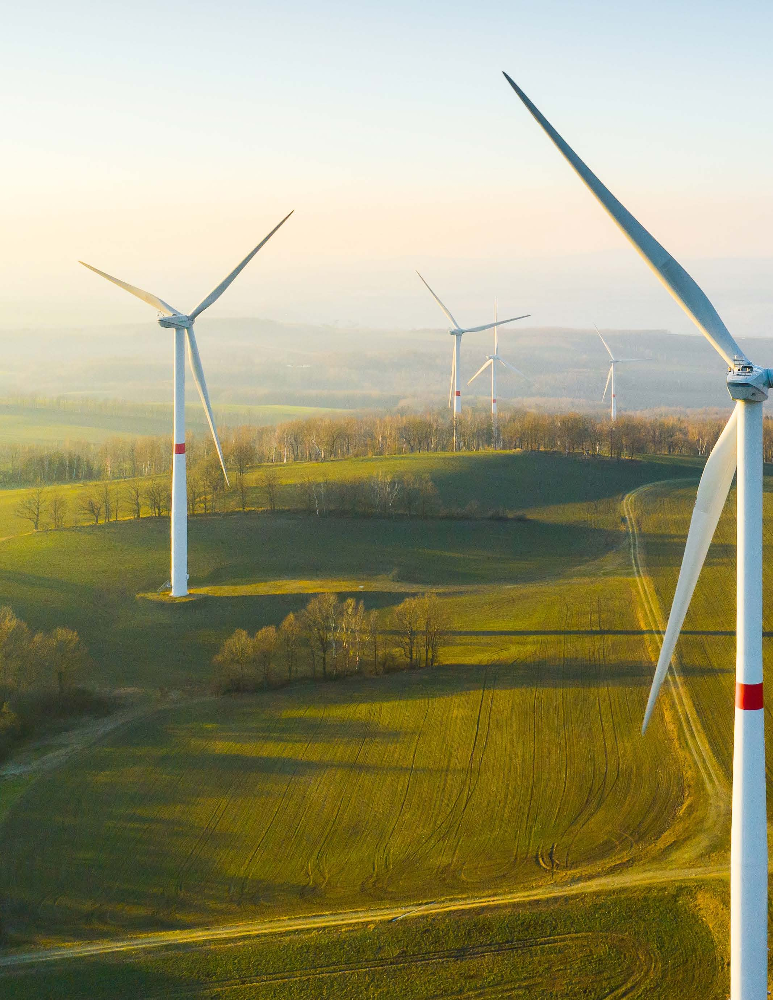

## Page 58
6. Financial Information of Trust Funds and FIFs  |  49
Fiscal 2023 Financial Snapshot of World Bank Trust Funds and FIFs
IBRD/IDA trust fund contributions: $22.3 billion
Fiscal 2023 cash contributions were the highest of the last five years, 
mainly driven by contributions to:
• MDTF for Co-financing the Public Expenditures for Administrative 
Capacity Endurance in Ukraine (PEACE) Project: $16.7 billion
• Special Transfer to Ukraine Single Donor Trust Fund: $1.7 billion
IFC trust fund contributions: $0.2 billion
FIF contributions: $12.3 billion
Significant contributions were received for: 
• The Global Fund to Fight AIDS, Tuberculosis and Malaria: $3.9 billion
• Green Climate Fund: $3.1 billion
INFLOWS
$34.9 BILLION
Over half ($25.5 billion) of the total FHIT are committed and 
pending disbursement/transfer.
Increased contributions in fiscal 2023 led to larger FHIT 
(up from $41.9 billion in fiscal 2022) 
Top trust fund FHIT: 
• Carbon finance programs: $1.3 billion
• MDTF for Co-financing the PEACE Project: $1.2 billion
• Ukraine Relief, Recovery, Reconstruction and Reform– $1.1 billion
• Global Financing Facility: $1.1 billion
Top FIF FHIT:
• Green Climate Fund: $11.7 billion
• Global Environment Facility: $6.1 billion
• Climate Investment Funds: $4.8 billion
FUNDS HELD IN 
TRUST (FHIT)
$51.1 BILLION
IBRD/IDA trust fund disbursements: $20.7 billion
Fiscal 2023 disbursements were the highest of last five years, largely 
due to disbursements to support Ukraine:
• MDTF for Co-financing the PEACE Project: $15.4 billion
• Special Transfer to Ukraine Single Donor Trust Fund: $1.7 billion
IFC trust fund disbursements: $0.3 billion
Cash transfers from FIFs to implementing entities: $7.8 billion 
OUTFLOWS
$28.8 BILLION


## Page 59
6. Financial Information of Trust Funds and FIFs  |  50
Table 6.1. Key Statistics on World Bank Trust Funds 
and FIFs, Fiscal 2019–2023
FY19
FY20
FY21
FY22
FY23
Contributions ($ billion)
IBRD/IDA Trust Funds
3.85
3.67
4.08
4.86
22.29
IFC Trust Funds
0.45
0.27
0.32
0.29
0.21
MIGA Trust Funds
0.00
0.00
0.00
0.00
0.05
FIFs
6.99
8.94
9.91
11.39
12.33
Total
11.29
12.88
14.31
16.55
34.88
Disbursements and Transfers ($ billion)
IBRD/IDA Trust Funds
3.67
3.50
3.57
5.57
20.73
Bank Executed Disbursing Accounts
1.08
1.07
1.03
1.11
1.25
Recipient Executed Disbursing Accounts
2.59
2.43
2.55
4.46
19.48
IFC Trust Funds*
0.30
0.27
0.25
0.27
0.30
MIGA Trust Funds
0.00
0.00
0.00
0.00
0.00
FIFs
4.87
6.75
9.15
7.84
7.77
Total
8.84
10.52
12.97
13.68
28.80
FIF transfers to World Bank Trust Funds
1.00
0.92
0.88
0.66
0.99
Funds Held in Trust ($ billion)
IBRD/IDA Trust Funds
10.35
11.22
12.35
11.96
14.56
IFC Trust Funds
0.80
0.83
0.91
0.92
0.85
MIGA Trust Funds
0.11
0.09
0.09
0.10
0.15
FIFs
23.13
24.39
25.96
27.88
34.47
Others
0.88
0.89
0.94
0.98
1.08
Total
35.26
37.42
40.24
41.86
51.11


## Page 60
6. Financial Information of Trust Funds and FIFs  |  51
Table 6.1. Key Statistics on World Bank Trust Funds 
and FIFs, Fiscal 2019–2023
FY19
FY20
FY21
FY22
FY23
Contribution Receivable ($ billion)
IBRD/IDA Trust Funds
3.77
3.57
3.86
3.17
2.83
IFC Trust Funds
0.45
0.51
0.38
0.28
0.28
MIGA Trust Funds
0.01
0.01
0.01
0.05
0.03
FIFs
6.42
7.01
9.72
9.42
11.14
Total
10.65
11.09
13.97
12.92
14.28
Investment Income ($ billion)
IBRD/IDA Trust Funds
0.28
0.23
0.04
0.00
0.53
IFC Trust Funds
0.02
0.02
0.00
0.00
0.04
FIFs
0.58
0.51
0.16
-0.22
0.93
Total
0.88
0.76
0.20
-0.22
1.50
Notes: IFC trust fund disbursements and transfers do not include blended finance.
In fiscal 2022, a net investment loss of $220 million was recorded for FIFs, which primarily reflects the unrealized mark-to-
market losses from U.S. Agency Mortgage-Backed Securities, resulting from a rise in short-term U.S. interest rates.


## Page 61
6. Financial Information of Trust Funds and FIFs  |  52
Figure 6.1. Cash Contributions by Development Partner Type: 
Trust Funds and FIFs, Fiscal 2019–23 ($ Billions)
6.1 Inflows31
31 From fiscal 2017, most contributors to the Global Fund provide contributions directly to its secretariat, and the trustee 
receives these funds as contributions from the Global Fund Secretariat as a contributor. The majority (96 percent) of 
the cash contributions received from private non-profit entities for FIFs is from the Global Fund Secretariat.
Sovereign governments were the main contributors to World Bank trust funds, providing 
90 percent ($35.1 billion) of the cash contributions received for IBRD/IDA trust funds, 67 percent 
($1 billion) received for IFC trust funds, and 56 percent ($27 billion) received for FIFs in fiscal 2019–23. 
Private non-profit entities were the second largest group of contributors, providing 42 percent ($20.3 
billion) of the cash contributions received for FIFs.


**Image 1 OCR + Description:**
```
IBRD/IDA Trust Funds
0.5B/1% 2.4B/6%

World Bank —_|ntergovernmental
Institutions

IFC Trust Funds

0.3B/22% 0.1B/7%

World Bank —_|ntergovernmental
Institutions

FIFs

0.2B/0% 1.1B/2%

World Bank —_|ntergovernmental

Institutions

0.0B/0%

Private for Profit
Organizations

0.0B/1%

Private for Profit
Organizations

0.8B/2%

Private Non-profit
Entities

0.0B/2%

Private Non-profit
Entities

20.3B/42%

Private Non-profit
Entities

35.1B/90%

Sovereign
Governments

1.0B/67%

Sovereign
Governments

27.0B/56%

Sovereign
Governments

\

Za

**Image Description:**
The image presents a section of an annual development report, specifically focusing on the distribution of funds within three categories: IBRD/IDA Trust Funds, IFC Trust Funds, and FIFs. The layout is structured into three horizontal sections, each representing one of these categories and containing numerical data, category labels, and doughnut charts on the right side.

### Layout and Sections:

1. **IBRD/IDA Trust Funds** (Top section):
   - Five categories are listed with associated fund values and percentages:
     - World Bank: 0.5B / 1% (in dark yellow)
     - Intergovernmental Institutions: 2.4B / 6% (in blue)
     - Private for Profit Organizations: 0.0B / 0% (in purple)
     - Private Non-profit Entities: 0.8B / 2% (in orange)
     - Sovereign Governments: 35.1B / 90% (in dark blue)
   - To the right is a doughnut chart representing these percentages visually. The chart is mostly dark blue, indicating the dominance of sovereign governments.

2. **IFC Trust Funds** (Middle section):
   - Categories with amounts and percentages:
     - World Bank: 0.3B / 22% (dark yellow)
     - Intergovernmental Institutions: 0.1B / 7% (blue)
     - Private for Profit Organizations: 0.0B /
```
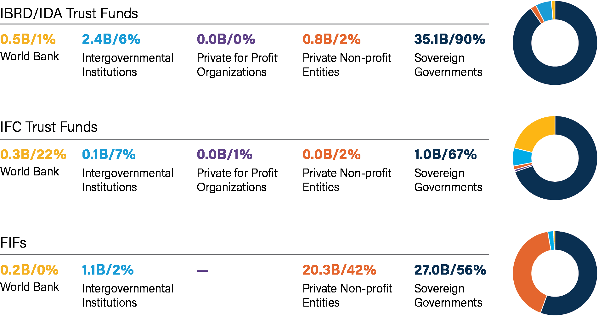

## Page 62
6. Financial Information of Trust Funds and FIFs  |  53
Figure 6.2. Top 10 Development Partner Contributions to 
Trust Funds and FIFs, Fiscal 2019–23 ($ Billions)
The United States, Germany, and the United Kingdom continue to be the top 
development partners for World Bank trust funds and FIFs. For IBRD/IDA trust funds, 
the United States was the largest development partner with cumulative cash contributions of 
$21.6 billion, followed by the United Kingdom at $2.3 billion during fiscal 2019–23.
For FIFs, the top 10 sovereign development partners contributed $23.2 billion during fiscal 
2019–23, which accounted for 48 percent of cumulative cash contributions ($48.3 billion). 
The largest contributor was Germany, with contributions of $4.3 billion, followed closely by 
the United States ($3.7 billion).


**Image 1 OCR + Description:**
```
**Image Description:**
The image is a scatter plot titled "Population in Developing Regions Projected to Increase by Almost 2 Billion Between 2020 and 2050." 

### Layout and Key Elements:
- **X-axis** represents regions: 
  - Sub-Saharan Africa
  - Northern Africa and Western Asia
  - Latin America and the Caribbean
  - Eastern and South-Eastern Asia
  - Central and Southern Asia
  - Oceania
  - Europe
  - Northern America
  
- **Y-axis** represents population in billions, ranging approximately from 0 to 2.5 billion.
  
- The graph shows three sets of data points, represented by different colors and shapes:
  - **Blue circles** indicate population in 2050.
  - **Orange circles** indicate population in 1950.
  - **Dark blue circles** indicate population in 2020.

### Data Points:
- Each region has three corresponding dots representing the population for the years 1950, 2020, and 2050.
- The largest increase in population appears in Sub-Saharan Africa and Central and Southern Asia.
- Europe and Northern America show smaller population change over the years.
- The increasing trend is clear in developing regions, especially Sub-Saharan Africa, where the 2050 projection is notably higher than 2020.

This graph effectively illustrates projected population growth primarily in developing regions from 2020 to 2050, compared with their populations in 1950.
```


## Page 63
6. Financial Information of Trust Funds and FIFs  |  54
Figure 6.3. Annual FIF Transfers to IBRD, IDA, and IFC as 
Implementing Entities, Fiscal 2019–23 ($ Billions)
FIF TRANSFERS32
FIFs remain an important funding source for World Bank trust funds. Transfers from 
FIFs to projects implemented by the IBRD, IDA, and IFC increased to $1 billion in fiscal 
2023 from $0.7 billion in fiscal 2022. In fiscal 2023, the top three transfers were made from 
the Climate Investment Funds (CIF) at $0.3 billion, followed by the Global Partnership for 
Education (GPE) and the Global Environment Facility (GEF) at $0.2 billion each. 
On a cumulative basis spanning fiscal 2019–23, the largest transfers to IBRD, IDA, and IFC 
as implementing entities were received from GPE ($1.4 billion), followed by CIF ($0.9 billion) 
and the GEF ($0.7 billion).
32 Transfers to implementing entities include transfers for project preparation, supervision fees, project implementation, and 
special agreement transfers for programs for heavily indebted poor countries (HIPC) and Advanced Market Commitments 
(AMC). However, in the case of the Global Fund, there is a lump sum transfer to the secretariat, and the use of the 
transferred funds is determined by the Global Fund.


**Image 1 OCR + Description:**
```
FY19 FY20 FY21 FY22 FY23

Global Partnership 038 0.38 0.38 028 028
Climate Investment Funds {0.28 i 028 ois 0.0B i 038
Global Environment Facility [J 018 gj 018 0.28 fi 01B 0.28
Green Climate Fund 0.0B go1B Wi o28 go1B 018
Financing Facility Wi o28 0.0B B18 Bow Bow
Others 028 M028 Boi Bo. BoB

Top FIF Transfers to the World Bank as Implementing Entity, FY2019-23 (S Billions)

y 1.4B 0.9B 0.7B
Global Partnership Climate Global

for Education Investment Funds Environment Facility
\ 0.4B 0.4B 0.8B

Green Global Concessional Other

Climate Fund Financing Facility Programs

**Image Description:**
The image is divided into two main sections that present data about Financial Intermediary Funds (FIF) transfers to the World Bank over the fiscal years 2019 to 2023.

**Top Section:**
- This section features a horizontal bar chart displaying annual transfer amounts (in billions of dollars) for six categories of funds/programs for each fiscal year (FY19 through FY23).
- The categories listed vertically on the left, each associated with a distinct color, are:
  1. Global Partnership for Education (dark blue)
  2. Climate Investment Funds (teal)
  3. Global Environment Facility (light blue)
  4. Green Climate Fund (green)
  5. Global Concessional Financing Facility (yellow/orange)
  6. Others (purple)
- For each fiscal year, colored horizontal bars correspond to these categories, with the dollar amount labeled at the end of each bar.
- Amounts vary annually, indicating shifts in funding. For example, Global Partnership for Education maintains around 0.2-0.3 billion USD from FY19 to FY23; Climate Investment Funds fluctuate between 0.0 to 0.3 billion USD; other categories have smaller but varying amounts.

**Bottom Section:**
- This is a donut chart representing the cumulative FIF transfers to the World Bank from FY2019 to FY2023.
- The donut chart uses the same color scheme as the top section to represent the proportions of each
```
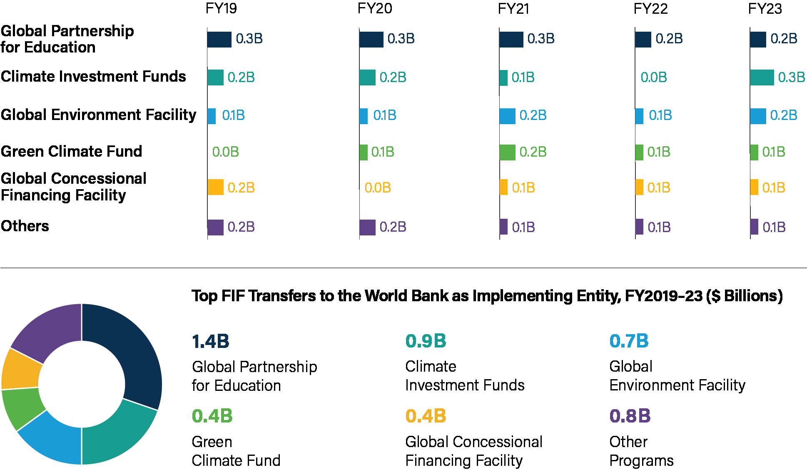

## Page 64
6. Financial Information of Trust Funds and FIFs  |  55
Since fiscal 2019, signed contributions for IFC blended finance trust funds average $90 million 
a year. The United Kingdom was the largest sovereign development partner to IFC blended 
finance trust funds during fiscal 2019–23, accounting for 38 percent of total cumulative 
signed contributions ($201 million), followed by the Netherlands (21 percent, $95 million) and 
Canada (15 percent, $68 million).
Figure 6.4. Signed Contributions to IFC Blended Finance Trust Funds, 
Fiscal 2019–23 ($ Millions)


**Image 1 OCR + Description:**
```
FY23
FY22
FY21
FY20
FY19

196

7)

122

Signed Contributions to IFC Blended Finance Trust Funds by Donor, Fiscal 2019-23 ($ Millions)

United Kingdom
Netherlands

Canada

Germany

Rockefeller Foundation
Korea

Switzerland

Gates Foundation
New Zealand

Women Entrepreneurs
Finance Initiative (We-Fi)

LLL 201
es

| ce

a2

(25

10

i 10

| 5

3

| 2

**Image Description:**
The image consists of two horizontal bar charts stacked vertically.

**Top bar chart:**
- The chart shows annual figures labeled by fiscal years (FY19 to FY23) on the vertical axis.
- Data values are represented by purple horizontal bars with numerical values at the end of each bar.
- Values listed are:
  - FY23: 196
  - FY22: 40
  - FY21: 71
  - FY20: 22
  - FY19: 122

**Bottom bar chart:**
- Titled "Signed Contributions to IFC Blended Finance Trust Funds by Donor, Fiscal 2019-23 ($ Millions)".
- The vertical axis lists donors, including countries and foundations:
  - United Kingdom
  - Netherlands
  - Canada
  - Germany
  - Rockefeller Foundation
  - Korea
  - Switzerland
  - Gates Foundation
  - New Zealand
  - Women Entrepreneurs Finance Initiative (We-Fi)
- Corresponding contribution amounts are shown as horizontal bars in orange and yellow shades, with numbers to the right of each bar:
  - United Kingdom: 201
  - Netherlands: 95
  - Canada: 68
  - Germany: 32
  - Rockefeller Foundation: 25
  - Korea: 10
  - Switzerland: 10
  - Gates Foundation: 5
  - New Zealand: 3
  - Women Entrepreneurs Finance Initiative (We-Fi):
```
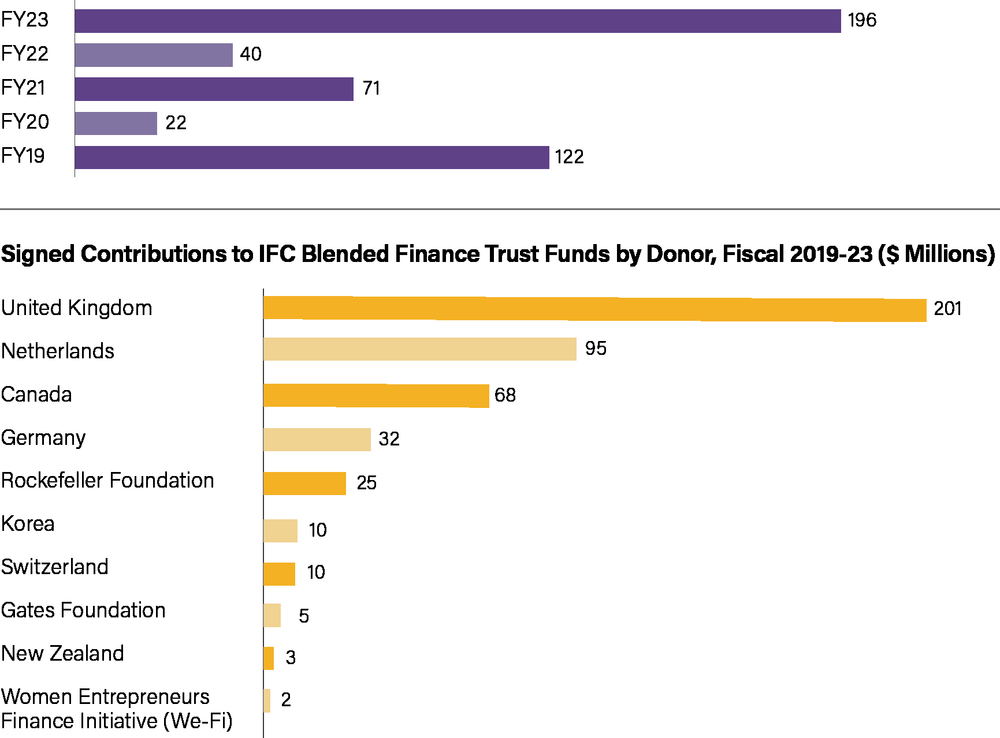

## Page 65
6. Financial Information of Trust Funds and FIFs  |  56
Figure 6.5. IBRD/IDA Trust Fund Disbursements by Top 10 Programs, 
Fiscal 2019-23 ($ Billions)
6.2 Outflows
The top 10 trust fund programs accounted for 23 percent of total IBRD/IDA trust fund 
disbursements ($37 billion) during fiscal 2019–23. The largest disbursement was made from 
the Afghanistan Resilience Trust Fund ($3.0 billion), followed by other disbursements made 
by the World Bank as the implementing entity for FIFs, like the GPE ($1.2 billion), CIF ($0.9 
billion), and the GEF ($0.8 billion). FIF programs accounted for 11 percent ($4.0 billion) of 
IBRD/IDA trust fund disbursements with the World Bank acting as the implementing entity.


**Image 1 OCR + Description:**
```
Afghanistan Resilience Trust Fund 3.00

Global Partnership for Education Ree 28
Climate Investment Funds RE 025
Global Environment Facility Es 0.86
Global Financing Facility a 0.78
Carbon Finance HE 0.58

Global Concessional Financing Facility a 058

West Bank and Gaza a 0.48

Global Agriculture and Food Security Program (9) 035

EC-ECA World Bank Partnership Program HS 036

Funding Source: m Funded by Development Partner mm FIFs

**Image Description:**
The image is a horizontal bar chart showing the amounts of funding from various sources, likely related to development or financial contributions. 

Layout:
- The chart lists funding sources on the left side.
- Each funding source has a corresponding horizontal bar extending to the right, representing the amount of funding.
- The amounts are shown at the right end of each bar, with values in billions (B).
- There is a color legend at the bottom center indicating two categories: "Funded by Development Partner" (purple) and "FIFs" (blue).

Key Elements and Text:
- The funding sources are (from top to bottom):
  1. Afghanistan Resilience Trust Fund
  2. Global Partnership for Education
  3. Climate Investment Funds
  4. Global Environment Facility
  5. Global Financing Facility
  6. Carbon Finance
  7. Global Concessional Financing Facility
  8. West Bank and Gaza
  9. Global Agriculture and Food Security Program
  10. EC-ECA World Bank Partnership Program

- Corresponding funding amounts shown (in billions):
  - Afghanistan Resilience Trust Fund: 3.0B (purple)
  - Global Partnership for Education: 1.2B (blue)
  - Climate Investment Funds: 0.9B (blue)
  - Global Environment Facility: 0.8B (blue)
  - Global Financing Facility: 0.7B
```
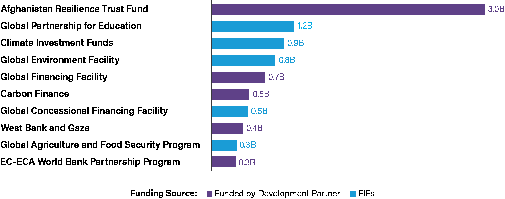

## Page 66
6. Financial Information of Trust Funds and FIFs  |  57
Figure 6.6. IBRD/IDA Trust Fund Disbursements, by Top Five Standalone 
Trust Funds, Fiscal 2019–23 ($ Billions)
The World Bank works closely with countries dealing with various development challenges, 
including climate change, inflation, conflict, and food insecurity. Standalone trust funds offer 
fast-disbursing, targeted support. In the last quarter of fiscal 2023, the World Bank trust funds 
disbursed $3.7 billion to Ukraine.
Figure 6.7. IBRD/IDA Trust Fund Disbursements for Recipient-Executed 
Activities by Funding Source, Fiscal 2019–23 ($ Billions)


**Image 1 OCR + Description:**
```
Multi-Donor Trust Fund for Co-financing of the Public Expenditure
for Administrative Capacity Endurance in Ukraine Project

Special Transfer to Ukraine Single Donor Trust Fund (SDTF)

Multi-Donor Trust Fund for Co-financing of the Ukraine
Second Economic Recovery Development Policy Program

Multi-Donor Trust Fund to Strengthen Ethiopia‘s Adaptive Safety Net

Global Shield Financing Facility

**Image Description:**
The image is a horizontal bar chart displaying five different financial contributions related to trust funds and financing facilities. The layout consists of a list of five items on the left side, each accompanied by a colored bar that extends horizontally to the right, illustrating the corresponding amount in billions (B) of dollars. The amounts are displayed at the end of each bar.

Key elements and text in the image include:

1. **Multi-Donor Trust Fund for Co-financing of the Public Expenditure for Administrative Capacity Endurance in Ukraine Project**
   - Bar color: Orange
   - Amount: 16.7B

2. **Special Transfer to Ukraine Single Donor Trust Fund (SDTF)**
   - Bar color: Green
   - Amount: 1.7B

3. **Multi-Donor Trust Fund for Co-financing of the Ukraine Second Economic Recovery Development Policy Program**
   - Bar color: Blue
   - Amount: 1.1B

4. **Multi-Donor Trust Fund to Strengthen Ethiopia's Adaptive Safety Net**
   - Bar color: Dark Red/Magenta
   - Amount: 0.1B

5. **Global Shield Financing Facility**
   - Bar color: Purple
   - Amount: 0.1B

The chart visually emphasizes the largest amount allocated to the first fund related to Ukraine administrative capacity, with significantly smaller amounts for the other funds. This image likely appears in an annual development report to illustrate funding
```
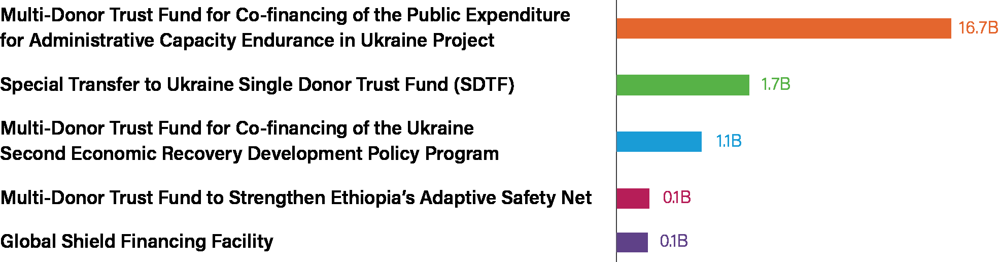

**Image 2 OCR + Description:**
```
3.2B/10%
FIFs

31.5B

28.3B/90%

Development Partner

Funding Source: m Funded by Development Partner m FIFs

**Image Description:**
The image is a horizontal bar chart segment from an annual development report. It illustrates the breakdown of a funding source totaling 31.5 billion (B), divided between two categories:

- FIFs (represented in blue) amounting to 3.2B, which is 10% of the total funding.
- Development Partner (represented in purple) amounting to 28.3B, which is 90% of the total funding.

The bar chart visually emphasizes that most of the funding (90%) comes from Development Partners, with only 10% coming from FIFs. The exact values and percentages are indicated in bold text near each segment, using blue text for FIFs and purple text for Development Partners.

Below the bar chart, there is a legend labeled "Funding Source:" showing the color coding:
- A purple square for "Funded by Development Partner"
- A blue square for "FIFs."

The layout is clean and straightforward, designed to clearly convey the proportional funding breakdown between these two sources.
```
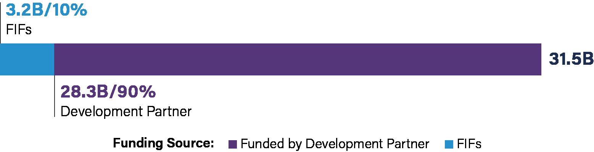

## Page 67
6. Financial Information of Trust Funds and FIFs  |  58
Figure 6.8. IBRD/IDA Trust Fund Disbursements for Recipient-Executed 
Activities by FIFs, Fiscal 2019–23 ($ Billions) 
Excluding trust fund disbursements to Ukraine, in fiscal 2023, FIFs financed 27 percent of 
total trust fund disbursements to RE activities supervised by IBRD as the implementing 
entity. The share of the FIF funding to RE activities has fluctuated during the last five 
years from $0.8 billion (31 percent) in fiscal 2019 to $0.5 billion (12 percent) in fiscal 2022 
to $0.7 billion (3 percent) in fiscal 2023 including support for Ukraine. During fiscal 2019–23, 
FIFs financed 10 percent ($3.2 billion) of total RE disbursements. Almost one-third of 
FIF funding during fiscal 2019–23 was from the GPE ($0.9 billion) followed by CIF ($0.8 billion) 
and the GEF ($0.5 billion).


**Image 1 OCR + Description:**
```
Global Partnership
for Education

Climate Investment Funds
Global Environment Facility

Global Concessional
Financing Facility

Global Agriculture and
Food Security Program

Pandemic Emergency
Financing Facility

Green Climate Fund

Least Developed Countries
for Climate Change

MENA Transition Fund

Special Climate Change Fund

Global Infrastructure Facility
Adaptation Fund

Guyana REDD+
Investment Fund

::

es oes
AT 0.58

es O48

0.38

lo) 0.078
Ml 0048
0.038

i 0028
)) 0.028
0.0058

| 0.0048

0.001B

**Image Description:**
The image is a horizontal bar chart displaying various funding amounts for different global programs and funds. The layout consists of program names on the left side, with corresponding horizontal bars extending rightward, visually representing the funding amounts. Each bar has a label on the right end indicating the amount in billions (B).

Key elements include:
- The names of the programs/funds listed vertically, aligned to the left.
- Two sets of horizontal bars in alternating colors: a darker blue and a lighter blue.
- Numeric values at the end of each bar indicating the funding amount in billions (B).

The programs and their funding amounts, from largest to smallest, are:
1. Global Partnership for Education – 0.9B (dark blue bar)
2. Climate Investment Funds – 0.8B (light blue bar)
3. Global Environment Facility – 0.5B (dark blue bar)
4. Global Concessional Financing Facility – 0.4B (light blue bar)
5. Global Agriculture and Food Security Program – 0.3B (dark blue bar)
6. Pandemic Emergency Financing Facility – 0.07B (light blue bar)
7. Green Climate Fund – 0.04B (dark blue bar)
8. Least Developed Countries for Climate Change – 0.03B (light blue bar)
9. MENA Transition Fund – 0.02B (dark blue bar)
10. Special Climate Change Fund – 0.02B (light
```
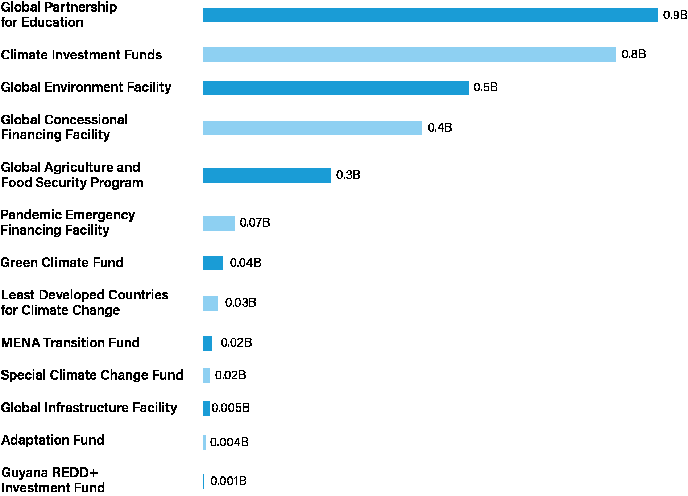

## Page 68
6. Financial Information of Trust Funds and FIFs  |  59
Figure 6.9. IBRD/IDA Trust Fund Disbursements for Recipient-Executed 
Activities by Region, Fiscal 2019–23 ($ Billions)
During fiscal 2019–23, the Europe, and Central Asia (ECA) region was the largest 
beneficiary of trust fund disbursements for RE activities ($20.3 billion), mainly due to 
support for Ukraine. The South Asia Region (SAR) was the second largest beneficiary at 
$3.7 billion, mostly due to disbursements to Afghanistan.


**Image 1 OCR + Description:**
```
FY19 FY20 FY21 FY22 FY23
AFE (DSS 078 0.48 088
AFR 0.08 0.0B 0.0B 0.0B 0.0B
AFW [jos8 Mi o28 i 028 i 0.28 Mi o.28
EAP Bo. Milo.28 Wi o.28 o.B BoB
ECA (§jo.28 io.28 fo28 2 Ty 7:5
LCR i 0.28 Mi 0.28 Mi o2B Hi 028 Mi o.28
MNA (io48 HH 0.38 Mi o2B8 Hi o28 Hi oz
SAR
OTH 0.0B 0.0B 0.0B 0.0B | 01B
Dy, AFE AFR AFW EAP ECA
SF bb 10% 0% 4% 2% 65%
3.0B 0.1B 1.2B 0.8B 20.3B
LCR MNA SAR_- OTH

3%
1,.0B

4%
13B

12% 0%
3.7B 01B

**Image Description:**
The image consists of two main parts: a horizontal bar chart (top) and a donut chart with a legend (bottom), both illustrating financial data related to different regions or categories over fiscal years.

---

**Top Section - Horizontal Bar Chart**

- The chart shows data for fiscal years (FY) labeled from FY19 to FY23.
- There are eight rows representing categories or regions, each with an abbreviation and associated color:
  - AFE (Orange-yellow)
  - AFR (Light blue)
  - AFW (Dark purple)
  - EAP (Pinkish red)
  - ECA (Orange)
  - LCR (Green)
  - MNA (Dark blue)
  - SAR (Teal)
  - OTH (Dark navy blue)
- Each fiscal year column displays horizontal bars with varying lengths corresponding to numerical values expressed in billions (B).
- Numeric labels accompany each bar, indicating the exact value in billions.
- Key observations:
  - ECA shows a significant increase in FY22 and FY23, jumping to 2.6B and 17.3B, respectively.
  - AFE values generally fluctuate, ending with 0.8B in FY23.
  - AFR consistently shows 0.0B from FY19 to FY23.
  - Other categories like AFW, EAP, LCR, MNA, SAR mostly maintain steady or slight variations in their values.
  - OTH shows 0.0B except
```


## Page 69
6. Financial Information of Trust Funds and FIFs  |  60
Figure 6.10. Advisory Services and Analytics (ASA) Costs, 
Fiscal 2019–23 ($ Millions) 
Trust fund financing for BE activities represents a significant share of the World 
Bank’s expenditures on ASA, at 66 percent in fiscal 2023. This large share of externally 
financed ASA provides opportunities to work with development partners on the knowledge 
agenda but also introduces challenges to the Bank’s ability to plan and align its work to its 
strategic priorities. 
Note: EFO refers to externally financed outputs and RAS refers to reimbursable advisory services.


**Image 1 OCR + Description:**
```
FY19
FY20
FY21

FY22
FY23

Bank Budget

Bank Executed Activities

EFO

30

34

33

27

18

RAS

Grand Total

**Image Description:**
The image is a horizontal bar chart displaying budget and activity data for a bank over five fiscal years (FY19 to FY23). The chart is divided into five columns with the following headings from left to right:

1. **Bank Budget**: 
   - Shows the budget amounts in orange horizontal bars for each year.
   - Values: FY19 (229), FY20 (234), FY21 (227), FY22 (246), FY23 (258).

2. **Bank Executed Activities**: 
   - Shows the executed activity counts with dark pink horizontal bars.
   - Values: FY19 (551), FY20 (546), FY21 (535), FY22 (590), FY23 (656).

3. **EFO**: 
   - Displays small purple bars with numerical values.
   - Values: FY19 (30), FY20 (34), FY21 (33), FY22 (27), FY23 (18).

4. **RAS**: 
   - Shows blue horizontal bars with numbers.
   - Values: FY19 (80), FY20 (88), FY21 (62), FY22 (57), FY23 (59).

5. **Grand Total**: 
   - Displays navy blue bars representing combined totals.
   - Values: FY19 (891), FY20 (902), FY21 (857), FY22 (920), FY23 (991).

Each fiscal year is listed vertically on the left side, with corresponding numerical values embedded
```
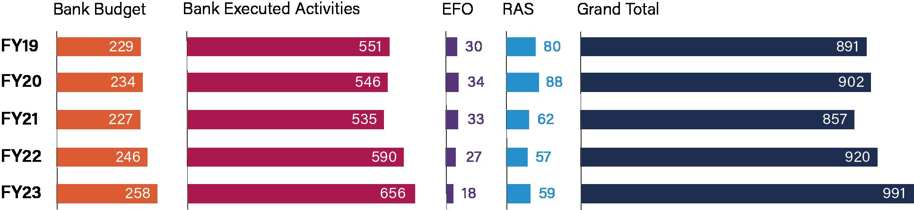

## Page 70
6. Financial Information of Trust Funds and FIFs  |  61
Figure 6.11. Distribution of Assets for IBRD/IDA Trust Funds, 
IFC Trust Funds, and FIFs, End of Fiscal 2023 ($ Billions)
The amount of assets held for World Bank trust funds and FIFs amounted to $65.4 
billion at the end of fiscal 2023. The assets held consist of FIFs ($45.6 billion, 70 percent), 
IBRD/IDA trust funds ($17.6 billion, 27 percent), IFC trust funds ($1.1 billion, 2 percent), and 
other trust funds ($1.1 billion, 2 percent). 
The share of cash and investments amounted to 68 percent of total assets, and the 
share of contributions receivable and promissory notes receivable was 22 percent and 10 
percent, respectively. 
6.3 Assets
Trust fund assets consist of funds held in trust (FHIT)—cash, investments, promissory notes—and contributions 
receivable. These assets are managed and reported separately for IBRD/IDA trust funds, IFC trust funds, and FIFs 
following established reporting protocols.


**Image 1 OCR + Description:**
```
Cash and Promissory Contributions

Investments Notes Receivable
IBRD/IDA Trust Funds 0.4B 2.9B
IFC Trust Funds 0.0B 0.3B
FIFs
Others 0.0B

**Image Description:**
The image is a horizontal bar chart divided into three categories: "Cash and Investments," "Promissory Notes," and "Contributions Receivable." Each category displays values for four different fund types listed vertically on the left side: "IBRD/IDA Trust Funds," "IFC Trust Funds," "FIFs," and "Others." 

Key elements and data for each category and fund type are:

1. **Cash and Investments:**
   - IBRD/IDA Trust Funds: 14.3B (dark blue bar)
   - IFC Trust Funds: 0.9B (orange bar)
   - FIFs: 28.4B (blue bar)
   - Others: 1.1B (purple bar)

2. **Promissory Notes:**
   - IBRD/IDA Trust Funds: 0.4B (dark blue bar)
   - IFC Trust Funds: 0.0B (orange bar)
   - FIFs: 6.1B (blue bar)
   - Others: 0.0B (purple bar)

3. **Contributions Receivable:**
   - IBRD/IDA Trust Funds: 2.9B (dark blue bar)
   - IFC Trust Funds: 0.3B (orange bar)
   - FIFs: 11.1B (blue bar)
   - Others: 0.0B (purple bar)

The bars' lengths visually represent
```
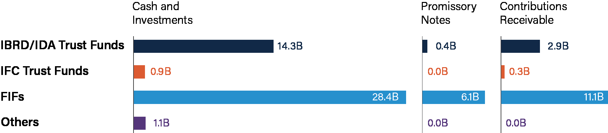

## Page 71
6. Financial Information of Trust Funds and FIFs  |  62
INVESTMENT MANAGEMENT 
The World Bank manages the liquid assets of trust funds and FIFs in a single, commingled investment pool that 
provides the following benefits to its participants: 
• A selection of sub-portfolios or model portfolios to accommodate varying liquidity needs and risk 
preferences of different funds managed within a comprehensive risk management framework
• Access to a wide variety of investment products and longer terms of maturity to enhance investment returns 
over time
• Regular review of liquidity needs across funds to optimize investments over the longer term
• Standard and customized environmental, social, and governance (ESG) investment solutions and product 
offerings to cater to various sustainable responsible investing (SRI) aspirations of individual funds
These investments earn income based on the trust fund’s share of interest income, realized gains or losses from 
the sale of securities, and unrealized gains or losses resulting from changes in the asset value held by the pool at 
fair value.
Photo: Dominic Chavez / World Bank


**Image 1 OCR + Description:**
```
**Image Description:**
The image shows a classroom setting with students sitting at desks arranged in rows. Key elements include:

1. Students: There are several students visible, all focused on their work or participating. Two boys in the foreground are raising their hands, indicating they may want to answer or ask a question.
2. Desks: The students have open books on their desks, along with personal items such as pencil cases and backpacks.
3. Background: More students are seated in the background, some looking down at their books or writing.
4. Setting: The classroom's walls are plain, with a muted color, and there is a power outlet visible on the left side of the image.

There is no visible text within the image itself, such as posters or writing on the wall.

The composition highlights an active learning environment with engaged students, suitable for use in an annual development report related to education or student participation.
```
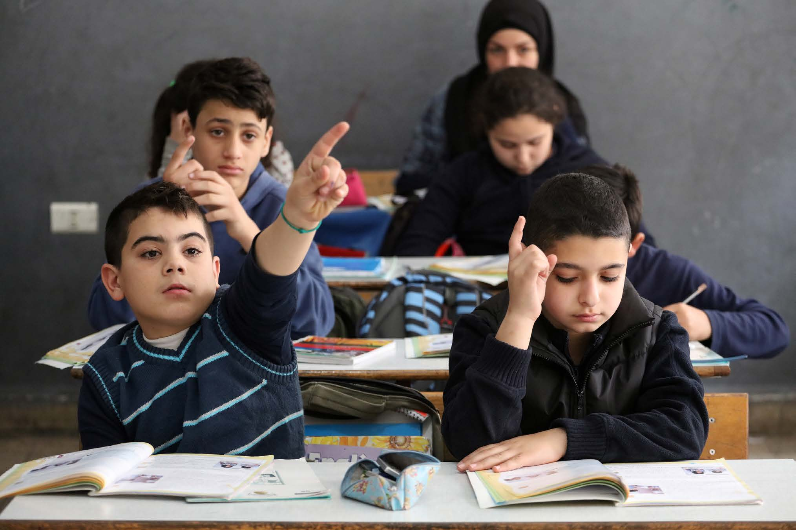

## Page 72
6. Financial Information of Trust Funds and FIFs  |  63
During fiscal 2019–23, investment income on trust fund and FIF assets totaled $3.1 billion, 
with a peak in fiscal 2023 at $1.5 billion. 
Figure 6.12. Investment Income for IBRD/IDA Trust Funds, 
IFC Trust Funds, and FIFs, Fiscal 2019–23 ($ Million)


**Image 1 OCR + Description:**
```
IBRD/IDA Trust Funds

FY19

FY20

FY21 38M
FY22 -4M

FY23

IFC Trust Funds

FY19 25M
FY20 21M
FY21 4M
FY22 2M

FY23 44M

FIFs

FY19
FY20
FY21
FY22
FY23

1,072M/34%
IBRD/IDA Trust Funds

95M/3%
IFC Trust Funds

1,957M/63%
FIFs

**Image Description:**
The image consists of two main sections presenting financial data in a report format, showing Trust Funds and their breakdown with bar and donut charts.

1. **Top Section - Bar Charts:**

   - **Title:** "IBRD/IDA Trust Funds"
     - Data is presented for fiscal years (FY) 2019 through 2023.
     - Bars are in dark blue color.
     - Values for each FY:
       - FY19: 277M
       - FY20: 226M
       - FY21: 38M
       - FY22: -4M (negative value, shown in blue text)
       - FY23: 535M

   - **Title:** "IFC Trust Funds" (orange text)
     - Same fiscal years listed.
     - Bars are orange.
     - Values:
       - FY19: 25M
       - FY20: 21M
       - FY21: 4M
       - FY22: 2M
       - FY23: 44M

   - **Title:** "FIFs" (light blue text)
     - Again, FY19 through FY23.
     - Bars are light blue.
     - Values:
       - FY19: 579M
       - FY20: 509M
       - FY21: 159M
       - FY22: -218M (negative value shown)
       - FY23: 928M
```
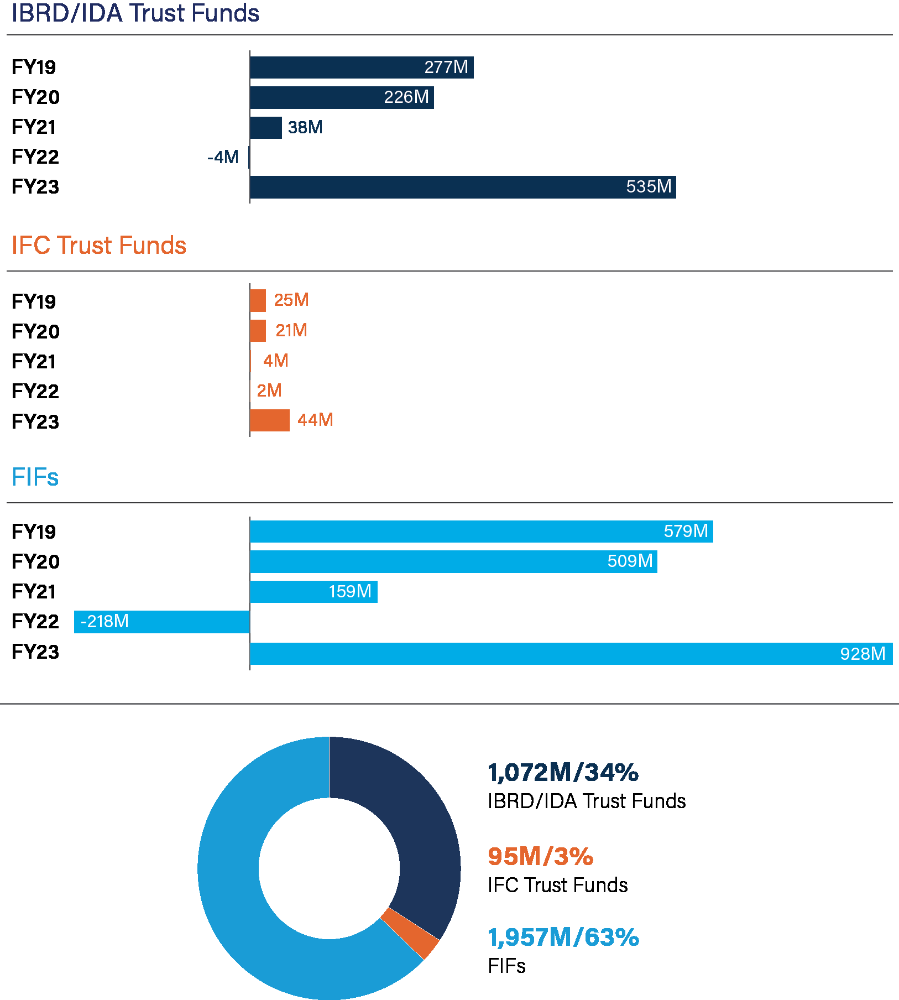

## Page 73
6. Financial Information of Trust Funds and FIFs  |  64
ASSET MIX OF TRUST FUNDS INVESTMENT PORTFOLIO 
Upon receipt of development partner contributions to a trust fund, the World Bank invests these resources in the 
international capital markets until they are disbursed to final recipients. Trust fund assets are managed with the 
primary investment objective of capital preservation and liquidity on demand. 
The provisions of the World Bank’s General Investment Authorizations for IBRD and IDA also apply to the 
investment of trust fund assets. Accordingly, these assets are managed within conservative overall risk tolerance 
parameters and invested in high-quality securities, which include securities issued by sovereign governments, 
government agencies, and multilateral and other official institutions, asset-backed and agency-guaranteed 
mortgage-backed securities, as well as swaps and a range of derivatives in support of securities investments. 
Subject to the primary investment objective, the asset mix among the investment products authorized by the 
General Investment Authorizations is based on market opportunities available within the applicable risk limits. As 
part of monitoring and financial and risk management oversight, a regular rebalancing of assets is performed to 
ensure that enough liquidity is available to meet disbursement needs.
The Investment Management of World Bank Trust Fund offers more details about how the World Bank manages 
and invests development partner financial resources.
The portfolio asset allocation as of end of fiscal 2023 reflects a conservative investment 
approach and defensive positioning to maintain the portfolio within the policy risk tolerance. 
The portfolio includes a large allocation of 27 percent in cash and money market instruments, 
followed by 23 percent invested in sovereign government bonds, 14 percent in agencies 
bonds, and 13 percent in covered bonds. The rest of the portfolio is invested in sovereign 
guaranteed, mortgage-backed and asset-backed securities, and a small allocation to equities. 
Figure 6.13. Asset Mix of the World Bank Trust Funds 
Investment Portfolio, Fiscal 2019–23 


**Image 1 OCR + Description:**
```
Agency Bonds

Asset Backed Securities
Corporates

Covered Bonds

Developed Market Equities
Money Market

Mortgage Backed Securities
Sovereign Government Bonds

Sovereign Guaranteed Bonds

FY19

FY20

FY21 FY22

f2 is

) )

1 J
ee)
a, a

|_| x
a BOSD
K

o

**Image Description:**
The image is a horizontal bar chart or table displaying financial data across five fiscal years (FY19 to FY23). It shows the breakdown of different categories of investment or financial instruments with quantities represented as numbers inside colored bars.

**Layout:**
- Five columns labeled FY19, FY20, FY21, FY22, and FY23 at the top, representing fiscal years.
- One main vertical section listing different categories of financial instruments on the left side in bold text.
- Colored horizontal bars alongside numerical values inside each year’s column, indicating amounts or percentages for the respective category.
- Each category is represented with a distinct color for quick visual differentiation.

**Categories and colors listed vertically on the left:**
1. Agency Bonds (maroon)
2. Asset Backed Securities (orange)
3. Corporates (gray)
4. Covered Bonds (yellow/orange)
5. Developed Market Equities (purple)
6. Money Market (green)
7. Mortgage Backed Securities (teal)
8. Sovereign Government Bonds (blue)
9. Sovereign Guaranteed Bonds (dark blue)

**Key details by fiscal year (numbers are the quantities inside the colored bars):**

- **FY19:**
  - Agency Bonds: 5
  - Asset Backed Securities: 1
  - Corporates: 0
  - Covered Bonds: 12
  - Developed Market Equities: 1
  - Money Market: 34
  - Mortgage Backed Securities
```
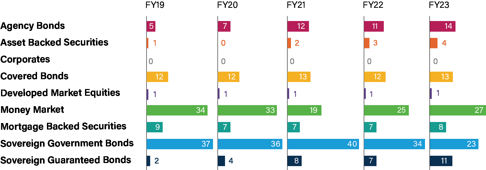

## Page 74
6. Financial Information of Trust Funds and FIFs  |  65
ENVIRONMENTAL, SOCIAL, AND GOVERNANCE CONSIDERATIONS
Keeping pace with the rapid shift in the global asset management industry toward sustainable and responsible 
investing (SRI), the World Bank is committed to integrating sustainability-related themes in all operational activities, 
including the investment management function entrusted to it by its clients. 
Since July 2019, the Bank Treasury has applied ESG integration as the default SRI approach to the trust fund 
pooled assets under management within the purview of the IBRD/IDA General Investment Authorizations and 
clients’ investment guidelines as stipulated in the Investment Management Agreements. ESG integration is an 
extension of traditional financial analysis that explicitly considers ESG factors in investments.
Further, in response to growing demand from some FIFs for more mission-driven thematic SRI investment 
strategies with sustainable development impacts, the World Bank rolled out the Sustainable Bond Strategy in 
fiscal 2021. It followed a gradual and phased approach, starting with the Sovereign, Supranational, and Agency 
(SSA) universe permissible under the existing Investment Authorizations. As of June 30, 2023, the market value of 
the portfolio invested in the strategy was $440 million, with 94 percent of the portfolio invested in 32 impact bonds 
issued by 21 SSA issuers. The Bank published its first Sustainable Fixed-Income Strategy Impact Report in 2023 to 
highlight specific issuers and holdings, SDG-aligned impact metrics, and project stories (Figure 6.14).
Through a tiered offering of SRI investment approaches, the World Bank, as the trustee for trust funds and FIFs, 
intends to achieve the overarching objective of capital preservation and liquidity on demand. The World Bank 
will continue to explore additional SRI strategies in line with current market practices to meet the evolving SRI 
aspirations and development objectives of development partners.
Photo: Erick Kaglan / World Bank


**Image 1 OCR + Description:**
```
**Image Description:**
The image depicts two people working at computer desks in an office environment. The foreground shows a woman wearing glasses, a face mask, a black top, and a gray cardigan. She is seated in a red and black office chair, typing on a keyboard with various papers and a pen on the desk in front of her. She is also wearing a gold wristwatch and earbuds.

In the background, a man is also seated at a desk, wearing a face mask and a light gray shirt, focused on his computer. The office decor includes a motivational poster on the wall behind them with the text: "don't wish for it, work for it." The words "work for it" are highlighted with a turquoise background, and the poster design features a mix of white, yellow, and orange geometric shapes.

The overall layout of the image emphasizes a professional and focused work atmosphere with attention to health safety measures such as face masks. The motivational text in the background supports a theme of diligence and productivity, appropriate for inclusion in an annual development report.
```
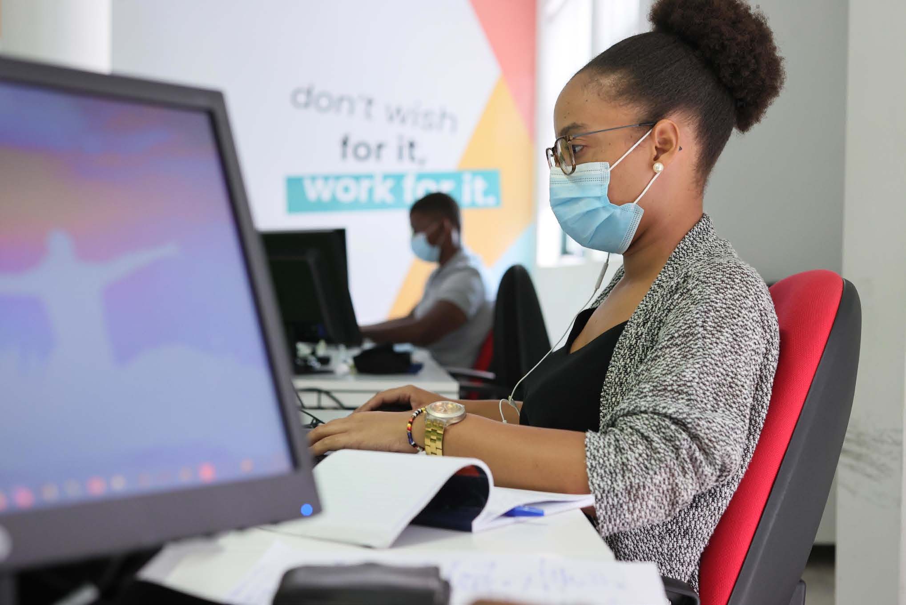

## Page 75
6. Financial Information of Trust Funds and FIFs  |  66
Figure 6.14. Topline Impact Numbers from the Sustainable Fixed-Income 
Strategy Impact Report, World Bank 2023
The strategy uses issuer information for each 
bond to calculate the impact at the issuance 
level, as well as at the holdings level, using 
a prorating approach. The topline impact 
numbers to the right show prorated impact 
attributed to the holdings of the strategy as 
of June 30, 2022.1 This is a very simplified 
representation of the impact that aligns to 
the methodology used by other investors. It 
provides an indication of the scope of impact, 
yet underestimates the actual support since 
only part of the results is reported.
Topline Impact Numbers
1 Assuming one year of holding in 2021.
Note on units: 
MWh - megowatt hour
tCO2e - tonnes of carbon dioxide equivalent; issuers 
use different methodologies to calculate 
emissions reductions
m2 - square meters
MWh per year in 
new renewable 
energy generation
Beneficiaries of 
anti-poverty programs
Farmers with access to 
improved agricultural 
services or investments
tCO2e avoided per 
year from renewable 
energy generation
Students benefited from 
education programs
Electric vehicles 
manufactured
New users of 
public transportation
m2 of inclusive 
and sustainable 
areas and healthy 
ecosystems developed
377,936
2,483
379
122,796
433
3,549
1,724
4,089


## Page 76
6. Financial Information of Trust Funds and FIFs  |  67
Photo: Hendri Lombard / World Bank


**Image 1 OCR + Description:**
```
wea

Fassaws

**Image Description:**
The image depicts a cityscape with layers of distinct architectural layouts and building types. 

Layout and key elements:
- Foreground: Numerous residential houses predominantly with colorful roofs in shades of red, green, blue, and brown. The houses are separated by trees and greenery, giving the impression of a suburban neighborhood.
- Middle-ground: A line of dense trees forms a natural barrier or green belt, separating the residential area from the urban buildings.
- Background: A collection of modern, high-rise apartment and office buildings dominate the skyline. Among them, a prominent white and blue building with a large blue dome stands out centrally. This building has a modern design with vertical blue stripes and looks like it might hold municipal, cultural, or religious significance.
- On the left side of the image, a tall building prominently displays the text "SIEMENS" in turquoise letters near the top.
- Other smaller signs, such as one partially visible with red text, appear on buildings in the background near the left side.

There is no additional textual information in the image aside from the visible building signs mentioned above. The image overall illustrates a contrast between the suburban residential area in the foreground and the modern urban development in the background, making it suitable for demonstrating urban growth and development trends in an annual report.
```
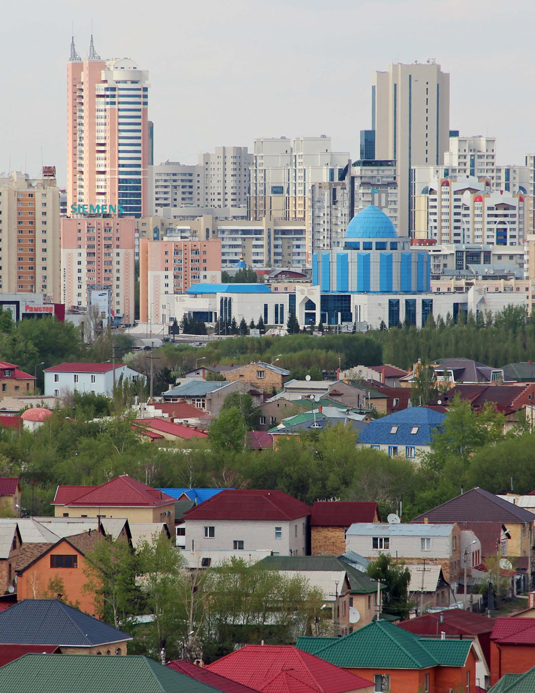

## Page 77
Annex A. Abbreviations and Acronyms  |  68
Annexes
Photo: Mulugeta Wolde / IFC


**Image 1 OCR + Description:**
```
**Image Description:**
The image shows a woman sitting indoors with a calm and composed expression. She is wearing a white textured shawl draped over her shoulders and a headscarf with a dark pattern around her head underneath. Her hands are folded lightly in her lap, and she is wearing a ring on one of her fingers.

In the background, there is a blue shelf filled with various household items such as glass jars, containers, and a tea set. The area looks like a modest kitchen or living space with some patterned cloth covering surfaces.

There is no visible text in the image.

This image has a warm and personal feel, capturing the essence of everyday life, likely highlighting the woman’s role or story as part of the annual development report. The lighting is soft, illuminating the subject well against a darker backdrop.
```
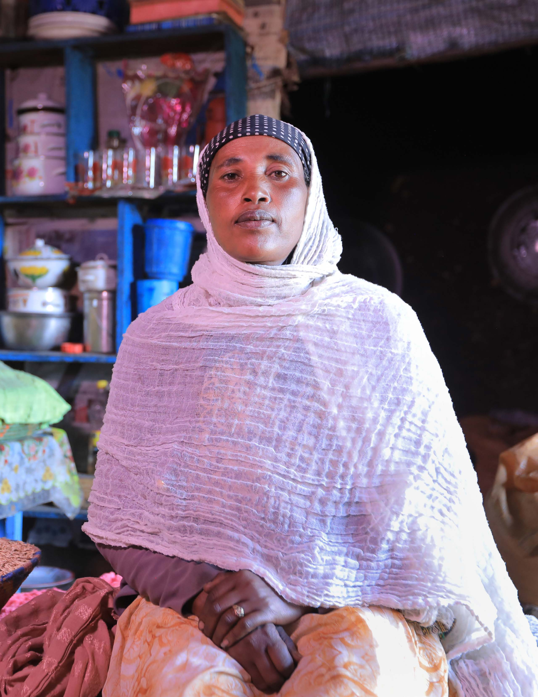

## Page 78
Annex A. Abbreviations and Acronyms  |  69
Annex A. Abbreviations and Acronyms
ASA
BE
COVID-19
DPO
ECA
ERPA
ESG
FCV
FHIT
FIF
FY
GHG
G20
G7
IBRD
ICSID
IDA
IFC
ILO
IMF
MDB
MDTF
MENA
MIGA
MSME
NDC
NGO
PPE
RE
REDD+
SAR
SDG
SIDS
SME
SRI
UN
UNHCR	
UNICEF
USAID 
WHO
Advisory services and analytics
Bank-executed activities
Coronavirus disease 2019
Development policy operation
Europe and Central Asia Region
Emission Reductions 
Purchase Agreement
Environmental, social, 
and governance
Fragility, conflict, and violence
Funds held in trust
Financial intermediary fund
Fiscal year
Greenhouse gas
Group of Twenty 
(world’s largest economies) 
Group of Seven 
(world’s largest advanced economies 
and liberal democracies)
International Bank for Reconstruction 
and Development
International Center for Settlement of 
Investment Disputes
International Development Association 
International Finance Corporation
International Labour Organization
IInternational Monetary Fund
Multilateral development bank
Multi-donor trust fund
Middle East and North Africa Region
Multilateral Investment 
Guarantee Agency
Micro, small and
medium-size enterprises
Nationally Determined Contribution
Non-governmental organization
Personal protection equipment
Recipient-executed activities
Reducing emissions from deforestation 
and forest degradation
South Asia Region
Sustainable Development Goal
Small island developing states
Small and medium-size enterprise
Sustainable and 
responsible investing
United Nations
UN Refugee Agency
United Nations Children's Fund
United States Agency for 
International Development 
World Health Organisation
The World Bank’s fiscal year runs from July 1 to June 30.
Unless otherwise specified, “$” represents U.S. dollars throughout the report.


## Page 79
Annex B. List of Boxes, Figures and Tables  |  70
Annex B. List of Boxes, Figures, and Tables
BOXES
Box 1.1 Global Challenges Key to Creating a World Free of Poverty on a Livable Planet 
Box 1.2 The Many Benefits of Trust Funds and FIFs
Box 1.3. Key Features and Principles of Umbrella 2.0 Programs
Box 6.1. Definitions of Key Financial Terms
FIGURES
Figure 2.1. IBRD/IDA Trust Fund RE Disbursements for Climate and Other Environmental 
Activities, Fiscal 2019–23
Figure 2.2. IBRD/IDA Trust Fund RE Disbursements for Mitigation and Adaptation Activities, 
Fiscal 2019–23
Figure 3.1. IBRD/IDA Trust Fund RE Disbursements for Health and Pandemic Activities, 
Fiscal 2019–2023
Figure 4.1. IBRD/IDA Trust Fund RE Disbursements for FCV-affected States, Fiscal 2019–23
Figure 4.2. Top IBRD/IDA Trust Fund Programs Supporting RE Activities in FCV-affected States, 
Fiscal 2019–23
Figure 4.3. Figure 4.3. IBRD/IDA Trust Fund RE Disbursements for Activities Addressing Forced 
Displacement, by Country, Fiscal 2019–23 
Figure 6.1. Cash Contributions by Development Partner Type: Trust Funds and FIFs, 
Fiscal 2019–23
Figure 6.2. Top 10 Development Partner Contributions to Trust Funds and FIFs, Fiscal 2019–23 
Figure 6.3. Annual FIF Transfers to IBRD, IDA and IFC as Implementing Entities, Fiscal 2019–23 
Figure 6.4. Signed Contributions to IFC Blended Finance Trust Funds, Fiscal 2019–23
1
2
7
48
12
12
24
32
32
36
52
53
54
55


## Page 80
Annex B. List of Boxes, Figures and Tables  |  71
Figure 6.5. IBRD/IDA Trust Fund Disbursements by Top 10 Programs, Fiscal 2019-23
Figure 6.6. IBRD/IDA Trust Fund Disbursements, by Top Five Standalone Trust Funds, 
Fiscal 2019–23
Figure 6.7. IBRD/IDA Trust Fund Disbursements for RE Activities by Funding Source, 
Fiscal 2019–23
Figure 6.8. IBRD/IDA Trust Fund Disbursements for RE Activities by FIFs, Fiscal 2019–23
Figure 6.9. IBRD/IDA Trust Fund Disbursements for RE Activities by Region, Fiscal 2019–23
Figure 6.10. Advisory Services and Analytics (ASA) Costs, Fiscal 2019–23
Figure 6.11. Distribution of Assets for IBRD/IDA Trust Funds, IFC Trust Funds, and FIFs, End of 
Fiscal 2023
Figure 6.12. Investment Income for IBRD/IDA Trust Funds, IFC Trust Funds, and FIFs, 
Fiscal 2019–23
Figure 6.13. Asset Mix of the World Bank Trust Funds Investment Portfolio, Fiscal 2019–23
Figure 6.14. Topline Impact Numbers from the Sustainable Fixed-Income Strategy Impact Report, 
World Bank 2023
TABLES
Table 1.1. Disaggregation of IBRD/IDA Trust Fund Portfolio as of June 30, 2023
Table 1.2. World Bank Trust Fund and FIF Management Arrangements
Table 6.1. Key Statistics on World Bank Trust Funds and FIFs, Fiscal 2019–2023
56
57
57
58
59
60
61
63
64
66
8
9
50


## Page 81
Annex C. List of Umbrella 2.0 Programs as of June 30, 2023  |  72
Annex C. List of Umbrella 2.0 Programs 
as of June 30, 2023
Practice Group / Business Units 
No
Umbrella 2.0 Program
Equitable Growth, Finance and 
Institutions Practice Group
1
Competitiveness for Jobs and Economic Transformation (C-JET)
2
Consultative Group to Assist the Poor (CGAP)
3
Debt Management Facility (DMF)
4
Finance for Development (F4D)
5
Financial Management Umbrella Program (FMUP)
6
Financial Sector Reform and Strengthening Initiative 
(FIRST 2.0)
7
Fiscal Policy and Sustainable Growth
8
Global Tax Program (GTP)
9
Governance and Institutions (G&I)
10
Procurement for Development (P4D)
11
Risk Finance
12
Umbrella Facility for Poverty and Equity (UFPE)
13
Umbrella Facility for Trade (UFT)
Human Development 
Practice Group
14
Foundational Learning Compact (FLC)
15
Global Financing Facility for Women, Children and 
Adolescents (GFF)
16
Health Emergency Preparedness and Response Umbrella 
Program (HEPR)
17
Healthy Lives, Nutrition and Population (HLNP)
18
Health Systems Resiliency Fund


## Page 82
Annex C. List of Umbrella 2.0 Programs as of June 30, 2023  |  73
Practice Group / Business Units 
No
Umbrella 2.0 Program
Human Development 
Practice Group (Cont.)
19
Human Capital Umbrella
20
JOBS Umbrella Partnership
21
KNOMAD – Migration Umbrella
22
Rapid Social Response–Adaptive and Dynamic Social Protection 
(RSR-ADSP)
23
Tertiary Education and Skills Training (TEST) Umbrella
24
Umbrella Facility for Gender Equality (UFGE)
Infrastructure Practice Group
25
Digital Development Partnership (DDP)
26
Energy Sector Management Assistance Program (ESMAP)
27
Extractives Global Programmatic Support 2 (EGPS-2)
28
Global Facility to Decarbonize Transport
29
Global Road Safety Facility (GRSF) 2.0
30
Identification for Development (ID4D)
31
Public-Private Infrastructure Advisory Facility (PPIAF)
Sustainable Development 
Practice Group
32
Climate Support Facility
33
Food Systems 2030
34
Global Facility for Disaster Reduction and Recovery (GFDRR)
35
Global Partnership on Results-Based Approaches (GPRBA)
36
Global Program on Sustainability (GPS)
37
Global Water Security and Sanitation Partnership (GWSP)
38
Human Rights, Inclusion and Empowerment (HRIE)
39
Land 2030 Global Partnership
40
Partnership for Market Implementation Facility (PMIF)
41
PROBLUE
42
PROCLEAN


## Page 83
Annex C. List of Umbrella 2.0 Programs as of June 30, 2023  |  74
Practice Group / Business Units 
No
Umbrella 2.0 Program
Sustainable Development 
Practice Group (Cont.)
43
PROGREEN
44
Social Sustainability Initiative for All (SSI4ALL)
45
Stepping up Climate Action by Lowering Emissions (SCALE)
46
Sustainable Urban and Regional Development (SURGE)
Fragility, Conflict and Violence
47
State and Peacebuilding Fund (SPF)  
Development Economics (DEC)
48
Global Data Facility
49
Impact Evaluation to Development Impact (i2i)
50
Knowledge for Change Program (KCP)
Eastern and Southern 
Africa Region (AFE)
51
Africa Regional Integration Umbrella
52
Horn of Africa Umbrella
53
Somalia Country Engagement Program 
54
South Sudan Multi-Donor Transition Trust Fund
55
Sudan Transition and Recovery Support (STARS)
56
Zimbabwe Socio-Economic Transformation Fund 
Western and Central 
Africa Region (AFW)
57
AFW Regional Umbrella
58
Liberia Reconstruction
East Asia and
the Pacific Region
59
Myanmar Strategic Partnership (MSP)
60
Papua New Guinea and the Pacific Islands 
Umbrella Facility (PPIUF)
61
Timor-Leste Strategic Partnership (TLSP) 
Europe and Central Asia Region
62
Ukraine Relief, Recovery, Reconstruction and Reform
Trust Fund (URTF)


## Page 84
Annex C. List of Umbrella 2.0 Programs as of June 30, 2023  |  75
Practice Group / Business Units 
No
Umbrella 2.0 Program
Middle East and 
North Africa Region
63
Lebanon Financing Facility
64
Libya Development Trust Fund
65
MNA Region Umbrella
66
Palestinian Umbrella for Resilience Support to the Economy
67
Tunisia Economic Resilience and Inclusion (TERI)
68
Yemen Resilience, Recovery and Reconstruction 
Umbrella Program
South Asia Region
69
Afghanistan Resilience Trust Fund (ARTF)
70
India Country Umbrella
71
Pakistan100 Trust fund
72
South Asia Regional Integration, Cooperation, and 
Engagement Umbrella
Check mark indicates that the program has been formally established.
Note: Any changes to proposed Umbrella 2.0 Programs made after June 30, 2023 are not reflected in this table. 


## Page 85
Annex D. List of Trust Funds and FIFs Referenced in this Report  |  76
Annex D. List of Trust Funds and FIFs Referenced 
in this Report
IBRD/IDA Trust Funds
Program 
Name
Weblink
ARTF
Afghanistan Resilience Trust Fund
https://www.wb-artf.org/
ISFL
BioCarbon Fund Initiative for 
Sustainable Forest Landscapes
https://www.biocarbonfund-isfl.org/
Carbon-Assist
Carbon Finance Assist Fund
CCRF
Canada-Caribbean 
Resilience Facility  
https://www.gfdrr.org/en/crf
CCRIF
Caribbean Catastrophe Risk 
Insurance Facility 
https://www.ccrif.org/
CIWA
Cooperation in International 
Waters in Africa 
https://www.ciwaprogram.org/
CPF
Carbon Partnership Facility  
CSF
Climate Support Facility
https://www.worldbank.org/en/programs/climate-
support-facility
DDP
Digital Development Partnership  
https://www.worldbank.org/en/programs/digital-
development-partnership
EnABLE
Enhancing Access to Benefits 
while Lowering Emissions  
https://www.worldbank.org/en/topic/climatechange/
brief/enable-enhancing-access-to-benefits-while-
lowering-emission
EEPP
European Commission (EC)–World 
Bank Partnership on Europe and 
Central Asia  
EU2020
EU2020 Knowledge and 
Advisory Services  
FCPF
Forest Carbon Partnership Facility 
https://www.forestcarbonpartnership.org/
FDTF
Forced Displacement Trust Fund
FINC
Financial Inclusion Trust Fund


## Page 86
Annex D. List of Trust Funds and FIFs Referenced in this Report  |  77
Program 
Name
Weblink
FREE
Ukraine Financing of Recovery of 
Economic Emergency MDTF
FS2030
Food Systems 2030
https://www.worldbank.org/en/programs/food-
systems-2030
GFDRR
Global Facility for Disaster 
Reduction and Recovery
https://www.gfdrr.org/en
GFDT
Global Facility to 
Decarbonize Transport
https://www.worldbank.org/en/programs/global-
facility-to-decarbonize-transport
GFF
Global Financing Facility for 
Women, Children, 
and Adolescents
https://www.globalfinancingfacility.org/
GSFF
Global Shield Financing Facility, 
formerly the Global Risk 
Financing Facility
https://globalriskfinancing.org/
GTP
Global Tax Program
https://www.worldbank.org/en/programs/the-global-
tax-program
GWSP
Global Water Security and 
Sanitation Partnership
https://www.worldbank.org/en/programs/global-
water-security-sanitation-partnership
HEPR
Health Emergency Preparedness 
and Response Umbrella Program
https://www.healthemergencies.org/
HOAUTF
Horn of Africa Initiative Umbrella 
Trust Fund
https://www.hoainitiative.org/multi-donor-trust-fund/
I3RF
Iraq Reform, Recovery and 
Reconstruction Trust Fund
ILM MDTF
Multi-donor Trust Fund 
for Integrated Landscape 
Management in Mozambique
https://www.worldbank.org/en/programs/
mozambiques-integrated-forest-and-landscape-
management-portfolio
JSDF
Japan Social Development Fund
https://www.worldbank.org/en/programs/japan-social-
development-fund
KGGTF
Korea Green Growth Trust Fund
https://www.wbgkggtf.org/
KWPF
Korea–World Bank 
Partnership Facility
https://www.worldbank.org/en/programs/korea-world-
bank-group-partnership-facility


## Page 87
Annex D. List of Trust Funds and FIFs Referenced in this Report  |  78
Program 
Name
Weblink
LSCTF
Lebanon Syrian Crisis Trust Fund
MDTF for Co-financing of 
the Moldova Development 
Policy Program
MNA Region Umbrella
PARCC
Program for Asia Resilience 
to Climate Change
https://www.worldbank.org/en/programs/south-asia-
regional-integration/brief/program-for-asia-resilience-
to-climate-change
PCRAFI
Pacific Catastrophe Risk 
Assessment and 
Financing Initiative
https://www.gfdrr.org/en/pacific-catastrophe-risk-
assessment-and-financing-initiative-phase-3
PEACE
Ukraine Public Expenditures 
for Administrative Capacity 
Endurance MDTF
PMIF
Partnership for Market 
Implementation Facility
https://pmiclimate.org/pmif
PROBLUE
Global Program for the 
Blue Economy
https://www.worldbank.org/en/programs/problue
PURSE
Palestinian Umbrella for Resilience 
Support to the Economy
https://www.worldbank.org/en/programs/purse_
multi_donor_trust_fund
PYMT
Payment Systems and 
Remittances Trust Fund
REACH
Results in Education for All 
Children Trust Fund
https://www.worldbank.org/en/programs/reach
SFLAC
Spanish Fund for Latin America 
and the Caribbean
SMPF
Somalia Country Engagement 
Program, formerly the Somalia 
Multi-Partner Fund
SPF
State and Peacebuilding Fund 
https://www.worldbank.org/en/programs/state-and-
peace-building-fund


## Page 88
Annex D. List of Trust Funds and FIFs Referenced in this Report  |  79
Program 
Name
Weblink
UFGE
Umbrella Facility for 
Gender Equity
https://www.worldbank.org/en/programs/
umbrellafacilityforgenderequality
UFT
Umbrella Facility for Trade
https://www.worldbank.org/en/programs/umbrella-
facility-for-trade#5
URTF
Ukraine Relief, Recovery, 
Reconstruction and Reform 
Trust Fund
https://www.worldbank.org/en/programs/urtf
Ukraine Second Power 
Transmission Project Single Donor 
Trust Fund
WBGBK
IBRD-funded West Bank and Gaza 
Trust Fund
ZISET
Zimbabwe Socio-Economic 
Transformation Fund, formerly 
the Zimbabwe Reconstruction 
Fund (ZIMREF)
https://www.worldbank.org/en/programs/zimbabwe-
reconstruction-fund
Note: Information on all IBRD/IDA trust funds can be accessed at https://www.worldbank.org/en/trust-funds-and-programs/home


## Page 89
Annex D. List of Trust Funds and FIFs Referenced in this Report  |  80
IFC Trust Funds
Trust Fund
Name
TF073556
30 By 30 Zero Program (Germany)
TF070562
Bangladesh Investment Climate Fund I (BICF I) (United Kingdom, European Commission)
TF072625
Bangladesh Investment Climate Fund II (BICF II) (United Kingdom)
TFC-16-A
Canada-IFC Renewable Energy Program for Africa (Blended Finance)
TF073356
Comprehensive Japan Trust Fund
TF071889
Department of Foreign Affairs and Trade (DFAT) - IFC Global Advisory Services Trust Fund 
SDIP II contribution 
Advancing Multilateral Partnerships for Economic Development in The Philippines 
(AMPED) / DFAT AMPED–Cities (Australia)
TF073339
DFID Good Governance Fund (GGF)-IFC Advisory Services Trust Fund (United Kingdom)
TF073659
FACILITY FOR INVESTMENT CLIMATE ADVISORY SERVICES (FIAS) (FY22-26 Strategy 
Cycle)  (Austria, Canada, Ireland, Luxembourg, Netherlands, Sweden)
TF073113
Finland-IFC Blended Finance for Climate Program (Advisory)
TFC-20-A
Finland-IFC Blended Finance for Climate Program (Blended Finance)
TF025040
Former Comprehensive Japan Trust Fund
TICAD-5 Window
TF073385
Fragility & Conflict-affected Situations(FCS) Initiative for Sub-Saharan Africa and Yemen 
Multi-Donor Trust Fund (Africa Fragility Initiative (AFI)) (Norway, Ireland)
TF072748
GAFSP (Advisory Activities) Private Sector Window (United Kingdom)
TF073056
Green Bond Technical Assistance Program (Supporting Emerging Green 
One- Amundi Planet SICAV-SIF) (Luxembourg)
TF073090
IFC Europe and Central Asia (ECA) Advisory Services Trust Fund (Austria Umbrella) / 
Europe and Central Asia (ECA) Cities Platform II (Austria)
TF073554
IFC Global Advisory Project on Personal Protective Equipment (United Kingdom)
TF073231
IFC Green Bond Technical Assistance Program (Supporting Emerging Green One-Amundi 
Planet SICAV-SIF) (Sweden)
TF072979
IFC Support for G-20 Compact with Africa Initiative (ISCA) 
(Norway, Netherlands, Germany)


## Page 90
Annex D. List of Trust Funds and FIFs Referenced in this Report  |  81
Trust Fund
Name
TF072853
Infrastructure Development Collaboration Partnership Fund (DEVCO) / DevCO 2 SA 
(United Kingdom)
TF073282
Joint Capital Markets Program (J-CAP) (Luxembourg)
TF073427
Joint Capital Markets Program (J-CAP) Multi-Donor Trust Fund (Switzerland, Germany, 
Norway, Australia)
TF073403
Kakuma Kalobeyei Challenge Fund - International Finance Corporation (IFC) Executed 
Trust Fund (Germany, European Commission, Switzerland, United Kingdom)
TF073041
Korea-IFC Partnership Program
TF073184
Market Accelerator for Green Construction Trust Fund (United Kingdom)
TF073346
MENA Private Sector Development (PSD) Program - Advisory Component  / Dutch MENA 
PSD-MAS (Netherlands)
TF073591
Norway-Global Health Platform
TF073234
Partnership for Improving Prospects for Forcibly Displaced Persons(FDP) and Host 
Communities (PROSPECTS) (Netherlands)
TF070993
Private Enterprise Partnership Africa: Conflict Affected States in Africa Initiative 
(Netherlands, Norway, Ireland, United Kingdom)
TF071855
Private Sector Window (PSW) of the Global Agriculture and Food Security Program 
(GAFSP) (Netherlands)
TF073032
Renewable Energy Advisory Services Program for Africa (Canada)
TF072821
SECO-IFC Europe and Central Asia (ECA) Advisory Services Trust Fund (Switzerland)
TF072628
SECO IFC Global Advisory Services Trust Fund 
SECO-IFC EDGE Green Building Market Transformation Program
Sustainable Cities Program ECA (Switzerland)
TF073383
Sustainable Cooling Innovation Programme Trust Fund (United Kingdom)
TF072870
The Financial Support of a Program of Advisory Services Relating to Flat6Labs 
(UK-FCO-EGYPT-F6L) (United Kingdom)
TFC-23-A
UK-IFC Market Accelerator for Green Construction (MAGC) (Blended Finance)
TF073128
Women Entrepreneurs Financing Initiative Advisory Services (We-Fi)


## Page 91
Annex D. List of Trust Funds and FIFs Referenced in this Report  |  82
MIGA Trust Funds
Program 
Name
CAFEF
Conflict Affected and Fragile Economies Facility
FAS
Fund for Advancing Sustainability
RECTF
Renewable Energy Catalyst Trust Fund
SURE TF
Support for Ukraine’s Reconstruction and Economy Trust Fund
WB&G TF
West Bank and Gaza Trust Fund
Financial Intermediary Funds
FIF
Name
Weblink
AF
Adaptation Fund
https://www.adaptation-fund.org/
AGR
AgResults
https://agresults.org/
CEPI
Coalition for Epidemic 
Preparedness Innovations
https://cepi.net/
CGIAR
Consultative Group on International 
Agriculture Research
https://www.cgiar.org/
CIF /1
Climate Investment Funds
https://www.cif.org/
CTF
Clean Technology Fund
https://www.cif.org/cif-funding#clean-
technology-fund
SCF
Strategic Climate Fund
https://www.cif.org/cif-funding#strategic-climate-fund
CREWS
Climate Risk and Early Warning 
Systems Initiative 
https://www.crews-initiative.org/en
DRTF
Debt Relief Trust Fund
Gavi /2
Gavi, the Vaccine Alliance 
(formerly the Global Alliance 
for Vaccines and Immunization)
https://www.gavi.org/
IFFIm
International Finance Facility 
for Immunization
https://iffim.org/


## Page 92
Annex D. List of Trust Funds and FIFs Referenced in this Report  |  83
FIF
Name
Weblink
GCFF
Global Concessional Financing 
Facility
https://globalcff.org/
GEF /3
Global Environment Facility
https://www.thegef.org/
CBIT
Capacity Building Initiative 
for Transparency
https://www.thegef.org/topics/capacity-building-
initiative-transparency-cbit
LDCF
Least Developed Countries Fund 
for Climate Change
https://www.thegef.org/topics/least-developed-
countries-fund-ldcf
NPIF
Nagoya Protocol Implementation 
Fund
https://www.thegef.org/documents/brochure-nagoya-
protocol-implementation-fund
SCCF
Special Climate Change Fund
https://www.thegef.org/topics/special-climate-
change-fund-sccf
GAFSP
Global Agriculture and 
Food Security Program
https://www.gafspfund.org/
Global Fund
Global Fund to Fight AIDS, 
Tuberculosis and Malaria
https://www.theglobalfund.org/en/
GIF
Global Infrastructure Facility
https://www.globalinfrafacility.org/
GPE
Global Partnership for Education
https://www.globalpartnership.org/
GCF
Green Climate Fund
https://www.greenclimate.fund/
GRIF
Guyana REDD+ Investment Fund 
http://www.guyanareddfund.org/
HRF
Haiti Reconstruction Fund
https://www.haitireconstructionfund.org/
MENATF /4
Middle East and North Africa 
Transition Fund
Pandemic Fund
Financial Intermediary Fund 
for Pandemic Prevention, 
Preparedness and Response
https://www.worldbank.org/en/programs/financial-
intermediary-fund-for-pandemic-prevention-
preparedness-and-response-ppr-fif
PAF
Pilot Auction Facility for Methane 
and Climate Mitigation
https://www.pilotauctionfacility.org/
We-Fi
Women Entrepreneurs 
Finance Initiative
https://we-fi.org/
1. CTF and SCF are two separate FIFs that support the Climate Investment Funds.
2. Although Gavi is not a FIF, IFFIm is a FIF that provides financial resources for Gavi.
3. CBIT, LDCF, NPIF, and SCCF are four separate FIFs that are managed under the GEF governance framework in addition to the 
main GEF Fund.
4. MENATF operationally closed in fiscal 2022.


## Page 93
Annex E. World Bank’s Roles and Services in FIFs, Fiscal 2023  |  84
Annex E. World Bank’s Roles and Services 
in FIFs as of June 30, 2023
Bank Services
Standard Financial 
Management
Services /a
Additional Financial
Management
Services /b
Customized
Financial 
Management
Services /c
Number 
of FIFs
• Trustee 
• Implementing Entity 
• Secretariat 
• Independent 
Evaluation Office
GEF, LDCF, SCCF, 
NPIF, CBIT
5
• Trustee 
• Implementing Entity 
• Secretariat
DRTF, GAFSP, HRF, 
GPE, MENATF, GIF, 
WE-Fi, Pandemic Fund
CIF (CTF, SCF), GCFF
AF
12
• Trustee 
• Secretariat
PAF
1
• Trustee
• Implementing Entity
GRIF, GCF, CREWS
3
• Trustee
CGIAR, AgResults, 
CEPI
Global Fund, 
IFFIm
5
Number of FIFs
14
8
4
26
Within each cell of the table, FIFs are listed in chronological order based on their activation date. See Annex D for full FIF names. 
a. Standard financial management services include managing contributions, holding funds received in trust, investing such funds 
pending disbursement, and committing and transferring funds to the implementing/supervising entities. 
b. Additional financial management services include replenishment support, cash flow projections, and reflows/
repayment management. 
c. Customized financial management services include customized treasury management services and reporting, e.g. for 
Global Fund and IFFIm. This also includes Certified Emission Reductions (CERS) management for AF and managing auctions 
and bond issuances for PAF.
Bank Roles


## Page 94
Acknowledgments  |  85
Acknowledgments
The 2023 Trust Fund Annual Report was produced by the Trust Fund and Partner Relations department in the 
Development Finance Vice Presidency of the World Bank (DFTPR). It represents a collective effort that spans 
the entire World Bank. Akihiko Nishio provided the overall vision of the report. Maitreyi Das and Mei Leng Chang 
provided strategic advice and direction to the core team that produced the report, which included Leslie Ashby, 
Christopher D. Gerrard, Satish Korankandath, Flora Janet Nankhuni, and Michelle Yan Li.
Valuable contributions were provided by Brice Quesnel, Traci Phillips, Lydia Kruse Tietz, Larissa Vovk, Tatiana 
Nikolskaya, Julia Lessina, John Michael Diamond, Can Kevenk, Teresa Ha, Sridar Padmanabhan, Annabelle Libeau, 
Ganesh Chandrasekar, Rahul Gupta, Sridharan Srinivasavaradhan, Nivedita Sundararaja Rao, Biju Papachan Lukose, 
Anushree Shetty, Krishna Thapa and DFTPR staff. External communication support was provided by Meriem Gray, 
Jacqueline Purtell Kistler, and Suresh Ramalingam.
Results stories were contributed by Mohamed Abdulkader, Oya Ardic, Yolanda Azarcon, Erin Elizabeth Baldwin, 
Gulsumkhanum Bayazitova, Ayse Ozge Bayram, Francois Bertone, Ozan Beser, Timothy Brown, Lucia Burneo, 
Naraya Carrasco, Nansia Constantinou, Mouna Couzi, Spyridon Demetriou, Sirma Demir Seker, Jules Jean Alain 
Le Gaudu, Laura Di Giorgio, Yehia Eldozdar, Dominik Englert, Paul Xavier Gaylanan Espinosa, Silu (Cece) Feng, 
Arden Finn, Janina Franco, Jessica Gesund, Ian Gillson, Zoia Goptsii, Yana Gorbatenko, Marelize Gorgens, Simon 
Hagemann, Sabine Hertveldt, Ross Hughes, Anders Jagerskog, Anne Njambi Kabugi, Subhada Kant, Zainiddin 
Karaev, Carmen Lahoz, Diana Lachy, Amy N. Luinstra, Priyasha Madhavan, Josefina Maiztegui, Sumit Manchanda, 
Silvia Martinez Romero , Matthias Mayr, Bhanu Mehrotra, Siet Meijer, Shokraneh Minovi, Komal Mohindra, Aakash 
Mohpal, Gabriella Morandi, Efrian Muharrom, Fadzai Mukonoweshuro, Shamis Musingo, Manuel Mutimucuio, 
Sarah Nedolast, Lorenzo Nelli-Feroci, Giles Edward Newmarch, Koji Nishida , Mirey Ovadiya, Halil Ibrahim Cagatay 
Ozdemir, Sonia Plaza, Iuliia Pushko, Sumati Rajput, Jack Randolph, Birgit Reuter, Kanta Rigaud, Aude-Sophie 
Rodella, Apoorva Shenvi , Andrey Shlyakhtenko, Meriem Slimane, Mariam Sou, Selcuk Tanatar, Nuyi Tao, Luis Tineo, 
Joaquin Toro, Gemma Torras Vives, Natalia Tsivadze, Natalia Tulieva, Selamawit Hailemichael Tumebo, Kristina 
Turilova, Jeremy Veillard, Rebeka Amha Woldegiorgies, Nesma Yassin, Yinan Zhang, Nicholas Zmijewski.
Design and production were provided by Gimga Group.
World Bank
1818 H Street NW, Washington, D.C. 20433
202 473 1000
www.worldbank.org
Some rights reserved.
This work is a product of the staff of the World Bank. The boundaries, colors, denominations, and other information 
shown on any map in this work do not imply judgment on the part of the World Bank concerning the legal status 
of any territory or the endorsement or acceptance of such boundaries. Nothing herein shall constitute or be 
constrained to be a limitation upon or waiver of the privileges and immunities of the World Bank, all of which are 
specifically reserved.
All queries on this publication should be addressed to DFTPR_Portfolio_Analytics@worldbank.org


## Page 95
1. Partnering through Trust Funds and FIFs  |  86


**Image 1 OCR + Description:**
```
**Image Description:**
The image layout prominently features a wide, clear sky with a few scattered clouds. The key elements in the image are multiple electrical transmission towers (pylons) that stand in a row, extending from the foreground to the horizon. They are connected by high-voltage power lines that stretch horizontally and slightly diagonally across the image, creating converging lines that draw the viewer's eye toward the distant horizon. The landscape beneath the towers appears flat and open, suggesting a rural or undeveloped area.

There is no visible text within the image itself. The image likely serves as a visual representation of infrastructure development or electrical grid expansion, fitting the context of an annual development report.
```


**Image 2 OCR + Description:**
```
aes tg

afl

eer,

**Image Description:**
The image shows a narrow sandy path leading through a dense grove of tropical trees with thin, tall trunks and spiky leaves. The trees arch overhead, creating a natural tunnel effect. At the end of the path, clear blue ocean water is visible under a bright sky. The sandy ground is dappled with shadows cast by the trees above. There is no text or additional graphic element present in the image. 

Since this image is mentioned to be part of an annual development report, it likely serves as a visual representation of nature, environmental preservation, or development related to coastal or island areas.
```
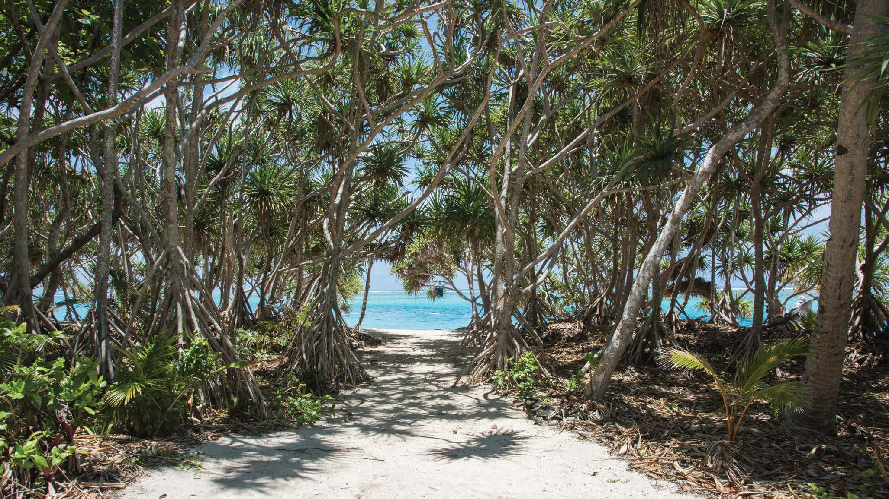

**Image 3 OCR + Description:**
```
**Image Description:**
The image shows two people working outdoors with a large quantity of grain. One person on the left is using a tool, possibly a wooden shoveling tool or a pitchfork, to toss the grain into the air, causing it to scatter and create a visible cloud. The other person on the right is bent over, seemingly interacting with the grain on the ground, perhaps sorting or gathering it. They both wear casual work clothes and hats. The background includes trees and a clear blue sky with the bright sun creating lens flares. There is no text or additional graphic content in the image.

The image visually represents traditional agricultural work, possibly related to grain drying or processing, and captures a moment of active manual labor under clear daylight. It could be used in an annual development report to illustrate rural development, agricultural productivity, or local farming practices.
```


**Image 4 OCR + Description:**
```
**Image Description:**
The image shows a young girl and boy walking on a paved path surrounded by greenery. The girl on the left wears a white t-shirt, a colorful zig-zag patterned skirt, and flip-flops. She is holding one end of a wooden stick resting on her shoulder. The boy on the right wears an orange shirt and black shorts and is barefoot. He is holding the other end of the stick, and a yellow plastic bucket is hanging from the center of the stick.

The background includes dense green foliage and trees, suggesting a natural, rural, or semi-rural setting. The sky is mostly clear with some clouds. The focus appears to be on the children carrying water, possibly reflecting themes of community development, access to resources, or rural life in the context of the annual development report. There is no visible text in the image itself.
```
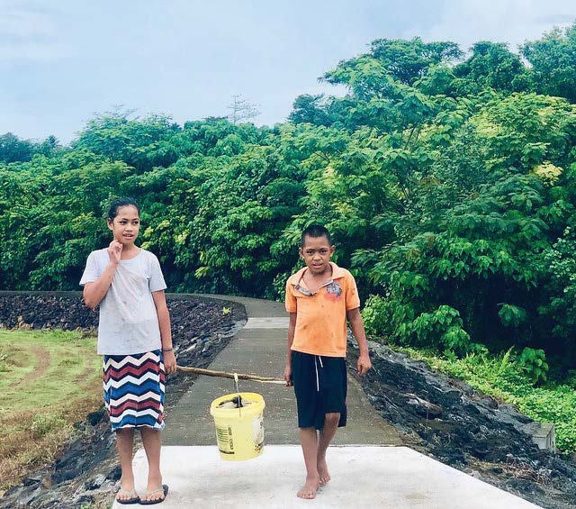

**Image 5 OCR + Description:**
```
**Image Description:**
The image shows an aerial view of a busy port area adjacent to a city. The layout includes several key elements:

1. Foreground: Dense tropical vegetation and some buildings with rooftops visible, suggesting residential or administrative areas near the port.
2. Middle ground: Rows of industrial and warehouse buildings, roads lined with trees, and a section with red-roofed buildings.
3. Background/Port area: A bustling container port with numerous colorful shipping containers stacked in rows. Multiple large cranes are positioned along several docked cargo ships, indicating active loading and unloading operations.
4. Far background: A cityscape extends towards the horizon, with a body of water separating the port from more distant urban and possibly hilly terrain.

The image does not contain any visible textual content.

The overall impression is one of a significant maritime and industrial hub, surrounded by urban development and greenery, fitting for a section in an annual development report showcasing infrastructure and economic activity.
```


**Image 6 OCR + Description:**
```
**Image Description:**
The image depicts a classroom scene with several students seated at desks. Key visual elements include:

- The classroom has a plain gray wall in the background.
- Two boys are in the foreground, sitting at a desk with open books in front of them. Both boys have their right hands raised as if to answer or ask a question.
- The boy on the left is wearing a dark blue sweater with light blue stripes, and the boy on the right is wearing a black jacket.
- Behind them, other students are sitting at desks, some looking down at their books or notebooks. One of the students in the back appears to wear a black headscarf.
- The desks have various school supplies including books and pencil cases.
- The overall atmosphere suggests an engaged classroom environment with students actively participating.

There is no visible text in the image itself. The composition and content indicate a focus on education and student involvement, suitable for an annual development report highlighting educational progress or initiatives.
```


**Image 7 OCR + Description:**
```
**Image Description:**
The image shows a group of women, dressed in colorful traditional attire, gathered around a concrete water tap fixture in a dry, reddish soil outdoor environment. One woman in a bright blue headscarf and dress is filling a yellow plastic container with water from the tap. Several other people, including children, are visible in the background walking or standing on the red soil. There are simple structures or buildings in the background, one of which has white walls and a blue trim. There is no text visible in the image. The setting suggests a community water access point likely highlighted in the annual development report to showcase efforts or progress in improving water supply or infrastructure in the area.
```


**Image 8 OCR + Description:**
```
**Image Description:**
The image shows a group of seven people gathered around solar panels outdoors. The composition is horizontal, with the solar panels prominently occupying the lower half of the image in the foreground. The people—both men and women—stand closely together behind the panels, actively engaging with them. One woman in a plaid shirt is pointing at the panels, possibly explaining something, while a man next to her, wearing a white helmet, holds a red umbrella to provide shade. The others are attentively observing or listening.

In the background, there are green plants and trees, suggesting that the solar panels are installed in a verdant, possibly rural environment. The sky appears bright, indicating a sunny day.

There is no visible text within the image. The overall scene suggests a demonstration or inspection of solar technology, likely related to a development or renewable energy project—fitting for an annual development report.
```
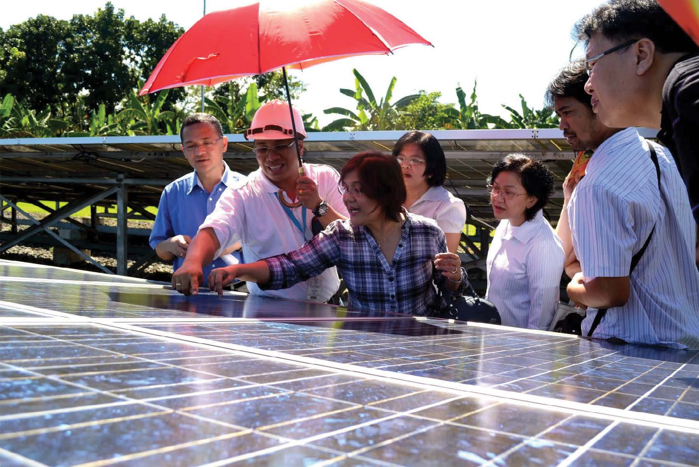

**Image 9 OCR + Description:**
```
**Image Description:**
The image depicts a small office setting focused around a desk, with three people engaged in looking at a computer screen.

Layout:
- The desk is positioned centrally in the foreground.
- Behind the desk is a window with horizontal bars, letting in natural light.
- Above the window is a wall clock displaying the time as approximately 11:13.
- To the right of the desk is an additional table with a bag or box on top and some cables underneath.

Key Elements:
- There are three people: two women standing on the left side of the desk and one man seated behind the desk.
- The man is wearing a mustard-colored polo shirt and is actively using the computer.
- One woman is dressed in an orange and brown patterned garment, and the other is wearing a green and blue tie-dye outfit with a beige headscarf.
- On the desk are various items including a pink decorative item, a pink cup, a tape dispenser, a stationery organizer with sticky notes, and papers.
- Computer equipment is branded Lenovo.
- The floor appears to be carpeted in a blue color.

Text:
- The clock has "Quartz" written on it.
- The computer monitor brand "Lenovo" is visible.
- A bag on the right side table has the text "Noor" on it, likely the name or brand related to the office or products handled there.

Overall, the image captures a collaborative moment of three individuals working together in an office environment, indicative of teamwork or training
```
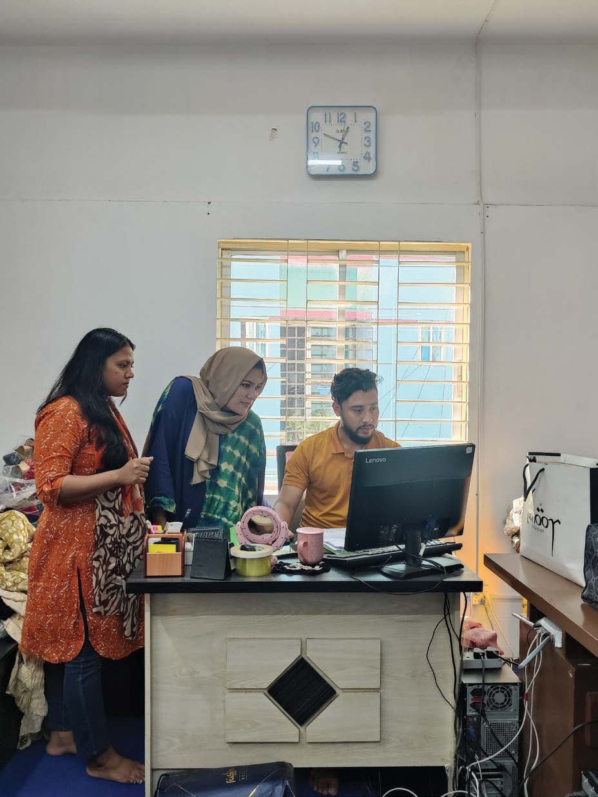

**Image 10 OCR + Description:**
```
**Image Description:**
The image shows a close-up view of a person wearing protective medical gear, including a face mask and a clear visor, preparing a syringe. The person is holding a small vial with one hand and a syringe with the other, drawing liquid from the vial. The focus is on the hands and the syringe, while the person's face is blurred in the background.

There is no text visible in the image. The image layout centers on the hands and syringe in the foreground, emphasizing the action of preparing a vaccine or injection. The background is out of focus, but some white and blue colors are present, possibly part of medical or hospital setting. 

This image would be suitable for an annual development report related to healthcare, vaccination campaigns, or medical advancements.
```
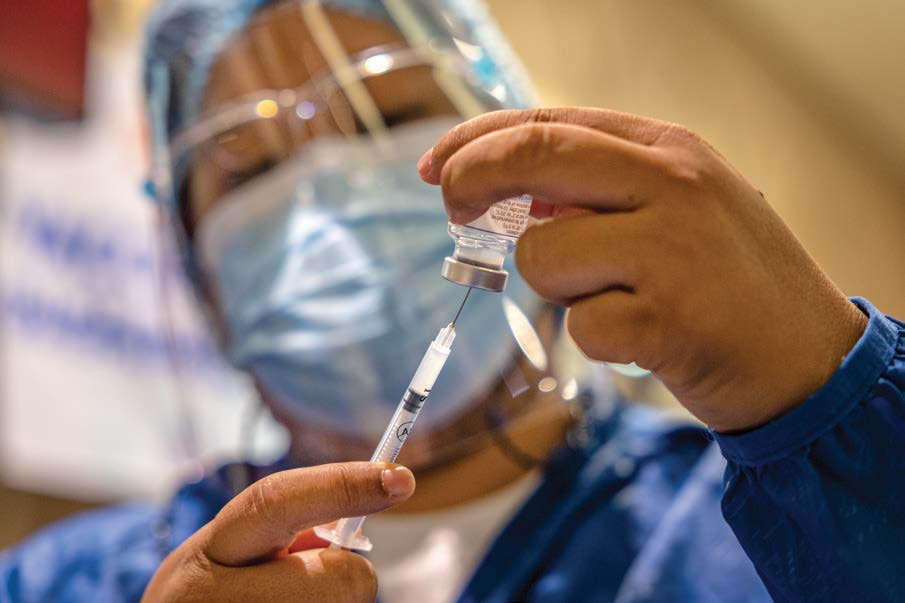

**Image 11 OCR + Description:**
```
**Image Description:**
The image shows six individuals standing outdoors on a dirt path with grass and trees in the background. They appear to be conducting an on-site discussion or inspection, likely related to development or construction given their attire and equipment. Key elements in the scene:

- All six people are wearing safety helmets and face masks, indicating attention to safety protocols.
- One person is wearing a yellow helmet and yellow boots, and is gesturing with their hands, suggesting they might be leading the discussion.
- Others are wearing white helmets; two individuals are wearing red tops, one person in a white shirt, one in a black top with blue gloves and boots, and one in a safety vest holding a blue folder.
- The setting looks like a construction or development site, with a mix of dirt ground and grass, utility poles, and a concrete wall in the background.
- The sky is overcast.

There is no visible text in the image itself. The image likely complements the report's content related to fieldwork, project management, or community development efforts.
```
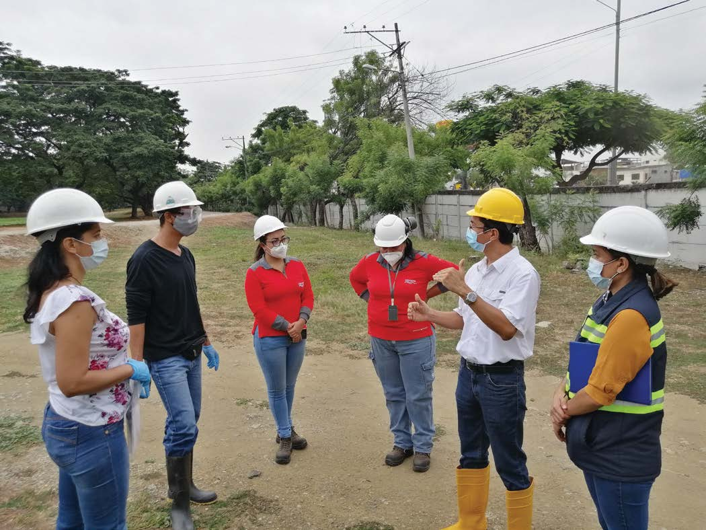

**Image 12 OCR + Description:**
```
**Image Description:**
The image features a group of seven children closely gathered together, filling the entire frame. The photo uses a cool blue monochrome tint, giving it a somber yet peaceful tone.

Key elements and layout:
- The children are mostly facing the camera and are very close to each other, creating a sense of unity and togetherness.
- The child in the center, slightly to the right, has her arm raised, possibly holding onto a stick or frame on the left side of the image.
- In the foreground, two children (one girl on the left and one boy on the right) are clearly visible with serious expressions.
- The middle child, just behind them, has an inquisitive expression and is making direct eye contact with the camera.
- Other children are slightly obscured by shadows or by each other but are still distinguishable.
- One child near the left side is holding a small flower.

There is no text visible on the image itself. The image composition and expressions evoke themes of community, resilience, or childhood development, which would fit well in an annual development report.
```


**Image 13 OCR + Description:**
```
**Image Description:**
The image features a close-up group portrait of seven children, with some faces more prominently visible than others. The layout is a tight cluster, with the children looking directly at the camera, creating an engaging and intimate feel. The children's expressions vary—from serious and contemplative to subtle smiles. 

One child in the background is holding a flower on a thin stem, which adds a delicate element to the composition. The lighting and depth of field focus primarily on the faces in the foreground, making the children's expressions stand out sharply against a blurred background.

The image is monochromatic with a bluish tint, giving it a calm, reflective, and somewhat somber tone suitable for an annual development report that might highlight human stories, social challenges, or community efforts.

There is no text visible in the image itself. The key elements are the children's faces, their varied emotions, and the natural, informal grouping that suggests community or social context.
```


**Image 14 OCR + Description:**
```
**Image Description:**
The image features a close-up of a young woman smiling gently at the camera. She is wearing a purple patterned headscarf and a white top. The background is slightly blurred but shows a few people, suggesting a group setting, possibly a classroom or community meeting. The focus is clearly on the woman in the foreground. 

There is no visible text in the image itself. The image's composition and warm, approachable expression of the woman suggest themes of community, development, empowerment, or education, fitting for an annual development report. The bottom right corner also has a faint watermark indicating it is from the "World Bank Group."
```


**Image 15 OCR + Description:**
```
**Image Description:**
The image shows a laboratory setting with two individuals seated on wooden stools. One person, dressed in a white lab coat, is sitting on the left, while the other person, wearing a light blue lab coat or protective gown, is seated on the right. Both are focused on a laptop placed on a black countertop. 

Behind the countertop, there is a large window with metal bars, allowing natural light into the room. To the right side of the image, there is a metallic cabinet or incubator placed on a small wooden shelving unit. The shelving unit contains various items, including yellow containers, papers, and other laboratory supplies.

There is no visible text in the image to transcribe. The overall layout portrays a professional lab environment with an emphasis on collaborative work and use of technology.
```

